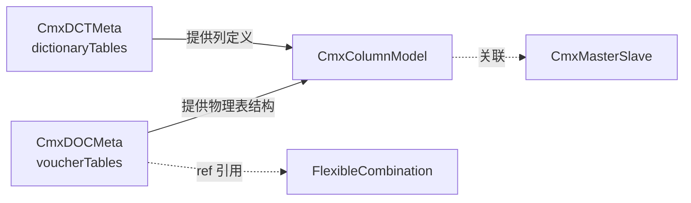

# CmxDCTMeta + CmxDOCMeta + BASE 元数据（字典/单据元数据）

> 何时读：L3 需要从后端加载字典/单据结构定义时。
> 源码：`packages/cmx-data-comp/src/lib/cmx-dct-meta.js` + `cmx-doc-meta.js`

---

## 一句话

- **CmxDCTMeta** = 加载并暴露**数据字典**元数据（`dictionaryTables`）——比如会计科目表有 1000 多个科目
- **CmxDOCMeta** = 加载并暴露**业务单据**元数据（`voucherTables`）——比如凭证由表头 + 分录组成
- **BASE 元数据**（`metaKind: "BASE"`）= 多个 DCT/DOC 共享的字段集定义——写一次，N 张表引用

两者**不直接绑 UI**，作用是"加载后端 JSON + 提供字段定义给其它模型"。

---

## CmxDCTMeta / CmxDOCMeta 字段表（props，两者完全相同）

| 字段 | 类型 | 必填 | 默认值 | 说明 |
| --- | --- | --- | --- | --- |
| `id` / `metaId` | string | 是（autoLoad 时） | `''` | 元数据业务编码：DOC 填 `moduleCode`（如 `cmxfico`），DCT 填 `dictCode`（如 `gl_account`）。后端按编码反查默认/最新版本文件（DCT 仅返回命中单表）。base 字段集仍用文件名（如 `base_dct_meta_v1.json`） |
| `domain` | string | 否 | `''` | 业务域，如 `fi` / `ar` / `gl` |
| `application` | string | 否 | `''` | 应用，如 `cmxfico` / `gl` |
| `module` | string | 否 | `''` | 模块名，如 `gl` / `fi_gl_base_data` |
| `apiPath` | string | 否 | `/api/definitions/config` | 元数据加载 API |
| `baseApiPath` | string | 否 | `/api/definitions/config` | 基础字段集加载 API |
| `serviceFn` | string | 否 | `''` | 自定义加载函数（pageService 名） |
| `baseServiceFn` | string | 否 | `''` | 基础字段集自定义加载函数 |
| `autoLoad` | boolean | 否 | `false` | 创建后是否自动加载 |
| `json` | object | 否 | `{}` | 直接粘贴的元数据 JSON（不通过 API） |
| `fieldSets` | object | 否 | `{}` | 直接粘贴的共享字段集 JSON（BASE 元数据的 `fieldSets` 部分）；构造时会被 `mergeFieldSets` 合入 |

**默认 props**（源码 `page-data-panel-models.js`）：
```js
{ id: '', domain: '', module: '', apiPath: '/api/definitions/config',
  baseApiPath: '/api/definitions/config', serviceFn: '', baseServiceFn: '',
  autoLoad: false, json: {}, baseMeta: {} }
```

> 设计器面板的 `baseMeta` prop 仅用于“共享字段集 JSON” Tab 的粘贴缓存，**不会被运行时消费**；要注入共享字段集请走 `fieldSets` prop 或 `loadMetaBatch` 的 `bases` 返回。

> **注意 application vs app**：DCT/DOC 真实字段名是 **`application`**（真实凭证 `erp-voucher-cnpc-ms.html` 核实）。不要写成 `app`（那是 FlexibleCombination 的字段）。

---

## 加载方式（4 级优先级，链式尝试）

```
1. resolver（最高优先级，函数）
2. serviceFn（host[serviceFn]）
3. baseResolver
4. 内置 fetch apiPath（兜底）
```

任一环节抛错则 `console.warn` 后继续下一环。

### 默认请求（走内置 fetch 时）

```js
// CmxDCTMeta 构造：id 填 dictCode（业务编码，非文件名）
const dct = new CmxDCTMeta({
  id: 'gl_account',
  domain: 'fi', application: 'cmxfico', module: 'gl'
})
// 默认请求（id 非 .json 时后端按 dictCode 反查 + 仅返回命中单表）：
// GET /api/definitions/config?kind=DCT&id=gl_account&domain=fi&application=cmxfico&module=gl
//
// CmxDOCMeta 同理：id 填 moduleCode（如 'cmxfico'），后端按 moduleCode 反查默认版本 DOC 文件：
// GET /api/definitions/config?kind=DOC&id=cmxfico&domain=fi&application=cmxfico&module=gl
//
// 显式文件名（.json 结尾）仍走直接路径读取（base 字段集加载用此方式）。
```

### autoLoad 模式

`autoLoad: true` 时，`initPageModels` 创建实例后自动调 `model.loadById(p.id || p.metaId)`：

```jsonc
// DCT：id = dictCode（单表加载，只返回该字典表）
{
  "modelType": "CmxDCTMeta",
  "instanceId": "glDctMeta",
  "props": {
    "id": "gl_account",
    "domain": "fi",
    "application": "cmxfico",
    "module": "gl",
    "autoLoad": true
  }
}
// DOC：id = moduleCode（后端反查默认/最新版本）
// { "modelType": "CmxDOCMeta", "props": { "id": "cmxfico", "domain": "fi", "application": "cmxfico", "module": "gl", "autoLoad": true } }
```

> `loadById` 默认会继续 `loadBaseById` 自动合并 base；要关闭传 `loadBase: false`（pageFn 里手动调）。
> **批量加载**（`loadMetaModelsBatch`）：refs 对象带 `kind` + `id`（业务编码）时同样反查；DCT 单表过滤对 batch 同样生效。

---

## DCT vs DOC：json 里装什么

### CmxDCTMeta.json（数据字典）

```jsonc
{
  "moduleMeta": {
    "moduleCode": "gl",
    "moduleName": "总账",
    "metaKind": "DCT",
    "metaName": "总账数据字典元数据",
    "version": 1
  },
  "dictionaryTables": [
    {
      "dictMeta": { "dictCode": "gl_account", "dictName": "会计科目" },
      "tableName": "gl_account",
      "fields": [ /* 表内联字段 */ ],
      "baseFieldSet":       { /* 引用 BASE 元数据的字段集 id */ },
      "hierarchyFieldSet":  { /* ... */ },
      "auditFieldSet":      { /* ... */ },
      "systemFieldSet":     { /* ... */ }
    }
  ],
  "fieldSets": {
    "common_audit": [ /* 共享字段集 */ ]
  }
}
```

### CmxDOCMeta.json（业务单据）

```jsonc
{
  "moduleMeta": { "moduleCode": "gl", "moduleName": "总账", "metaKind": "DOC", "metaName": "总账业务单据元数据", "version": 1 },
  "voucherTables": [
    {
      "voucherMeta": { "voucherCode": "voucher_header", "voucherName": "凭证表头" },
      "tableName": "voucher_header",
      "fields": [ /* 表头字段 */ ],
      "identityFieldSet":   { /* ... */ },
      "auditFieldSet":      { /* ... */ },
      "lifecycleFieldSet":  { /* ... */ }
    },
    {
      "voucherMeta": { "voucherCode": "voucher_detail", "voucherName": "凭证分录" },
      "tableName": "voucher_detail",
      "fields": [ /* 分录字段 */ ]
    }
  ],
  "voucherCommonFieldSet": [ /* 单据级字段集 */ ],
  "fieldSets": { /* 共享字段集 */ }
}
```

### DCT vs DOC 速查

| 维度 | CmxDCTMeta（字典） | CmxDOCMeta（单据） |
| --- | --- | --- |
| 用途 | "可选项"目录 | "要录入的单据"结构 |
| 顶层表字段 | `dictionaryTables` | `voucherTables` |
| 表内联字段 | `fields` | `fields` |
| 字段集 | `fieldSets` | `fieldSets` + `voucherCommonFieldSet` |
| 专用方法 | `getDictionary(dictCode)` / `listDictionaries()` | `getDocument(voucherCode)` / `listDocuments()` |
| 典型场景 | 选科目、选客户 | 录凭证、录交易 |

---

## BASE 元数据（基础元数据）—— 重点：DCT 与“字典基础元数据”的区别

> 这是用户最容易混淆的概念。

| 维度 | 数据字典定义（json） | 字典基础元数据（BASE） |
| --- | --- | --- |
| 英文 | Module Meta / DCT | Base Meta / BASE |
| 后端 kind | `DCT` | `BASE` |
| 顶层字段 | `dictionaryTables[]` | `fieldSets`（**无字典表数组**） |
| 典型数量 | 一个模块一份 | 一个域（domain）一份 |
| 被谁加载 | CmxDCTMeta.props.json | `loadMetaBatch` 的 `bases` 返回 / `loadBaseById` 合并 |
| 内容 | 字典表 + 内联字段 + 字段集引用 | 共享字段集本身（字段的完整定义） |

**一句话**：字典定义是“内容”，基础元数据是“被内容引用的公共部分”。BASE 元数据是“字典的字典”——写一次，N 张表共享。

### fieldSets（字段集）结构

```jsonc
// BASE 元数据文件里
{
  "fieldSets": {
    "common_audit": [
      { "id": "created_by",  "dataType": "VARCHAR",   "caption": { "zh_CN": "创建人" } },
      { "id": "created_at",  "dataType": "DATETIME",  "caption": { "zh_CN": "创建时间" } },
      { "id": "updated_by",  "dataType": "VARCHAR",   "caption": { "zh_CN": "修改人" } },
      { "id": "updated_at",  "dataType": "DATETIME",  "caption": { "zh_CN": "修改时间" } }
    ]
  }
}
```

字典表里引用：
```jsonc
{
  "dictCode": "gl_account",
  "tableName": "gl_account",
  "baseFieldSet": { "use": "common_audit" }
}
```

> 运行后访问 `gl_account` 字段时，`created_by` 等会**自动出现**在字段数组里（合并展开）。

### 字段集引用名（DCT vs DOC）

**DCT 可引用**：`baseFieldSet` / `hierarchyFieldSet` / `auditFieldSet` / `scopeFieldSet` / `effectiveFieldSet` / `disableFieldSet` / `systemFieldSet`

**DOC 可引用**：`voucherCommonFieldSet` / `documentFieldSets` / `baseFieldSet` / `technicalFieldSet` / `identityFieldSet` / `sourceFieldSet` / `lifecycleFieldSet` / `commonFieldSet`

---

## 通用 API 速查（pageFn 里可用）

```js
const dct = host.glDctMeta

dct.meta                    // 顶层 moduleMeta 摘要
dct.raw                     // 冻结后的完整原始 JSON
dct.listTables()            // 所有表
dct.getTable(id)            // 按编码取一张表
dct.listFieldSets()         // 共享字段集数组
dct.getFieldSet(id)         // 取某个字段集
dct.listFields(tableId)     // 展开后的字段数组（合并字段集 + 内联）
dct.getField(tableId, fieldId)  // 取某个字段对象

// DCT 专用
dct.getDictionary('gl_account')   // 取字典表
dct.listDictionaries()            // 所有 dictionaryTables

// DOC 专用
doc.getDocument('voucher_header') // 取单据表
doc.listDocuments()               // 所有 voucherTables
```

### 加载 API

```js
await dct.loadById(id?, opts?)      // 按 id 加载主元数据 + 自动合并 base
await dct.loadBaseById(id?, opts?)  // 单独加载 base 字段集
```

---

## 批量加载（推荐：DCT + DOC + base 一次拿）

```js
import { loadMetaBatch } from 'cmx-data-comp'

const bundle = await loadMetaBatch([
  { domain: 'fi', application: 'cmxfico', module: 'gl', kind: 'DCT', id: 'gl_account' },
  { domain: 'fi', application: 'cmxfico', module: 'gl', kind: 'DOC', id: 'cmxfico' }
], { host })

const dctModel = bundle.get('gl_account')
const docModel = bundle.get('cmxfico')
```

- 字段集**自动去重**，多个文件引用同一 base 只下载一次
- 单个 ref 失败不影响整体

> 真实样例 `erp-voucher-cnpc-ms.html` 用 pageService `loadDocMeta` 调 `/api/definitions/batch` 一次拿 DOC。

---

## 最小示例

### CmxDCTMeta（autoLoad）

```jsonc
{
  "modelType": "CmxDCTMeta",
  "instanceId": "glDctMeta",
  "props": {
    "id": "gl_account",
    "domain": "fi",
    "application": "cmxfico",
    "module": "gl",
    "autoLoad": true
  }
}
```

pageFn 里用：
```js
const acct = host.glDctMeta.getDictionary('gl_account')
const codeField = host.glDctMeta.getField('gl_account', 'code')
console.log(acct.dictName, codeField.caption)
```

### CmxDOCMeta（pageFn 手动批量加载）

```jsonc
{
  "modelType": "CmxDOCMeta",
  "instanceId": "docMeta",
  "props": {
    "domain": "fi",
    "application": "cmxfico",
    "module": "gl",
    "id": "cmxfico",
    "autoLoad": false
  }
}
```

pageFn：
```js
// 用 pageService 批量加载（见 page-assembly.md）：id=moduleCode，带 kind 走反查
host.loadDocMeta({ refs: [{ domain:'fi', application:'cmxfico', module:'gl', kind:'DOC', id:'cmxfico' }] })
  .then(batch => {
    const docJson = batch.items[0].doc
    const detailFields = host.docMeta.listFields('voucher_detail')
    // 用 detailFields 构造 CmxColumnModel 的列...
  })
```

---

## 与其他模型的衔接



**关键洞见**：CmxDOCMeta 提供的"物理表"是单据结构的事实源。FlexibleCombination **不应该重复定义**这些列，而应该用 ref 引用（详见 `model-flexible-combination.md` 的 Overlay 模式）。

---

## 容易踩的坑

| 坑 | 正确做法 |
| --- | --- |
| 字段名写 `app` | DCT/DOC 用 **`application`** |
| 走默认 API 时 `domain` 必填 | 后端强校验，缺 domain 返回 400 |
| `loadById` 不传 id | 等价用构造时的 id（兜底） |
| 期望 base 自动合并 | 仅 `autoLoad:true` 或手动 `loadById` 时合并 |
| 把所有字段塞 base | base 是"共享的"，独有字段写表内联 `fields` |
| 字段集 id 拼错（`common_audi`） | 拼错 → 字段集不展开，静默失败 |
| 把 BASE 元数据填到 json 字段 | 两个 Tab 互不通用，放错位置不生效 |
