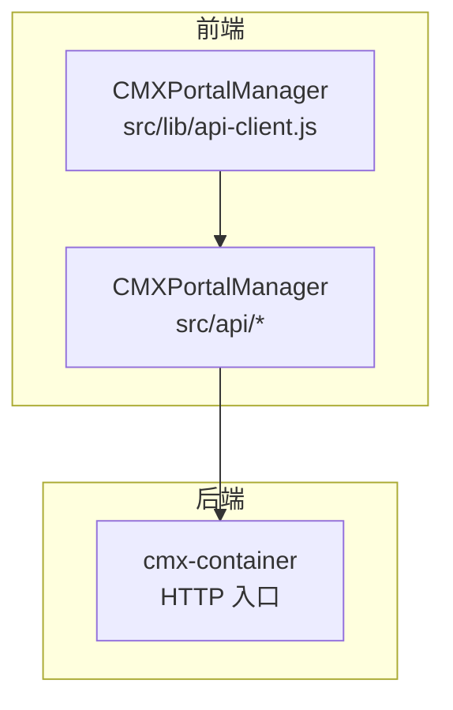
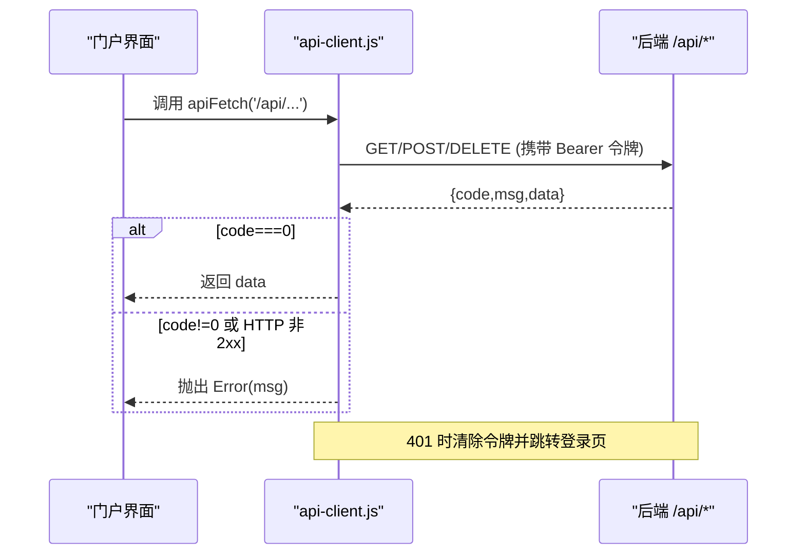
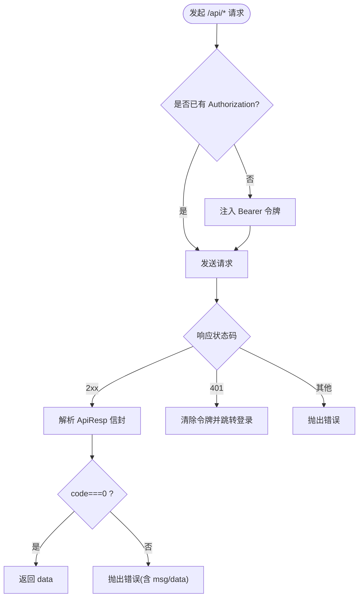
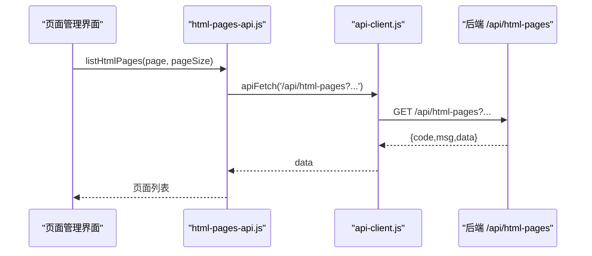
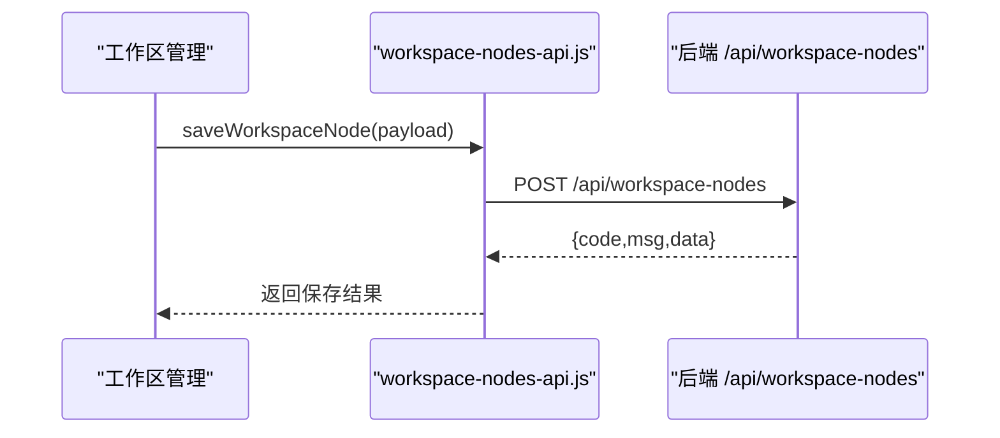
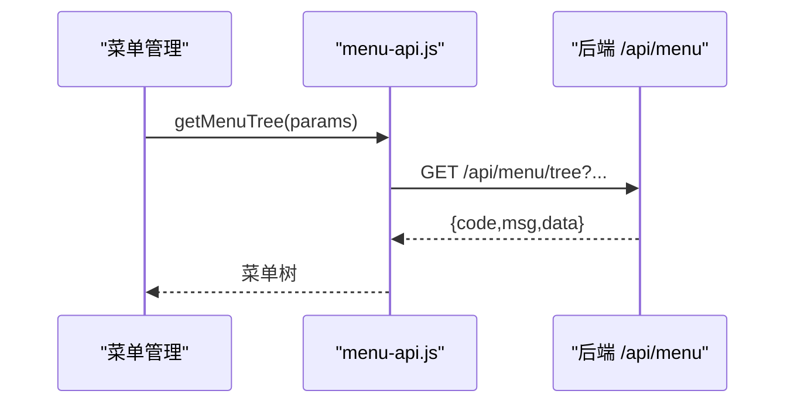
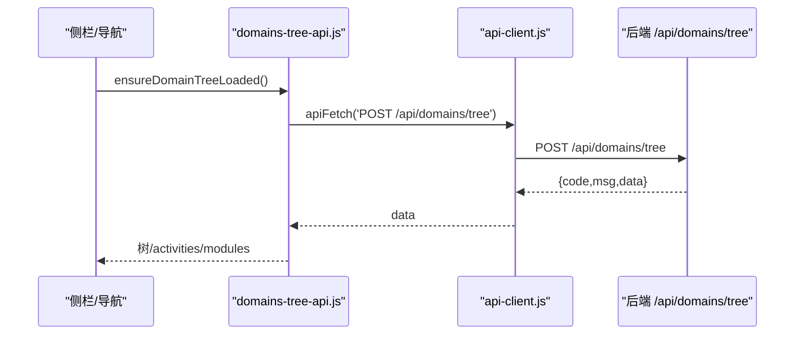
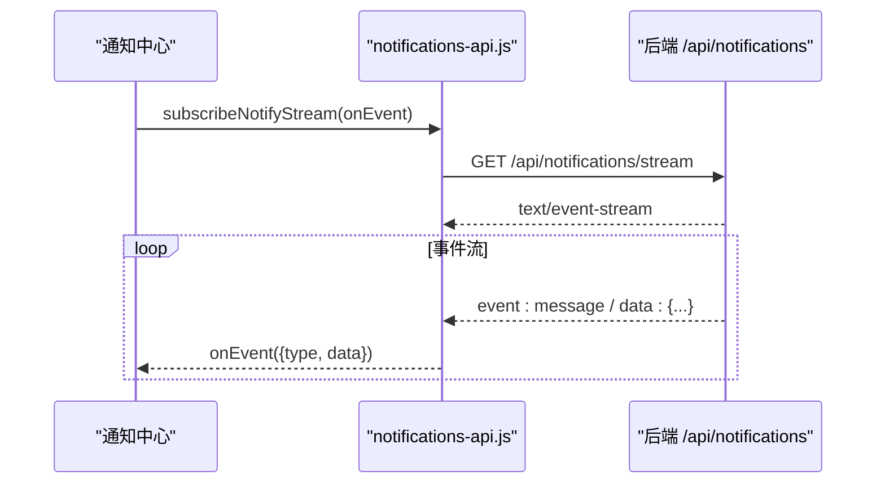
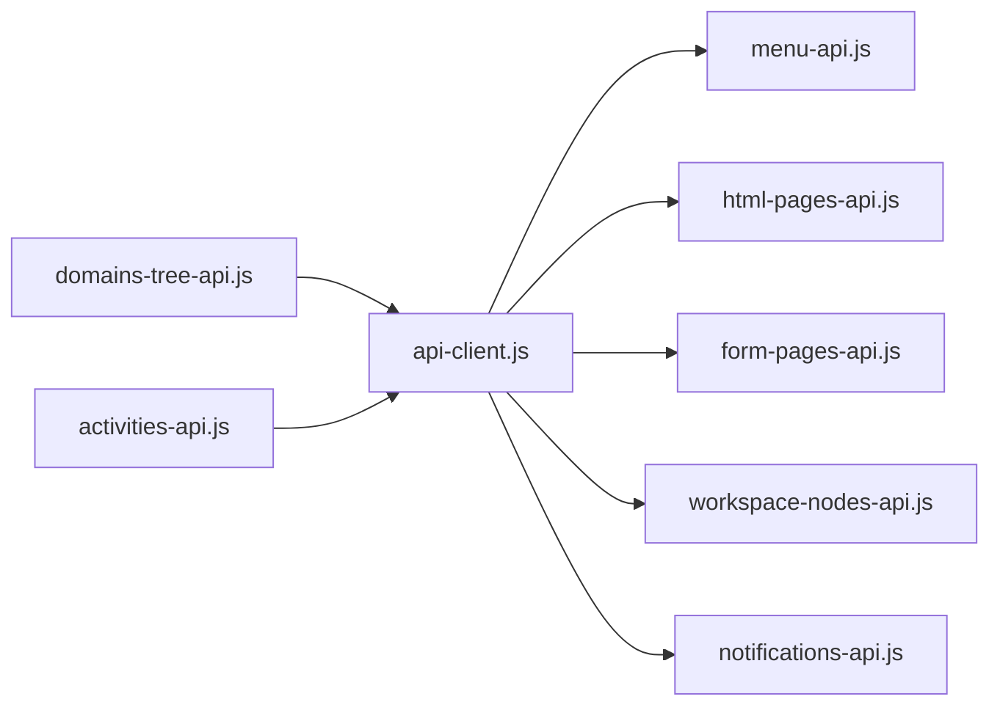

# API 参考文档

<cite>
**本文引用的文件**
- [README.md](file://README.md)
- [api-client.js](file://CMXPortalManager/src/lib/api-client.js)
- [iam-api.js](file://CMXPortalManager/src/api/iam-api.js)
- [menu-api.js](file://CMXPortalManager/src/api/menu-api.js)
- [workspace-nodes-api.js](file://CMXPortalManager/src/api/workspace-nodes-api.js)
- [html-pages-api.js](file://CMXPortalManager/src/api/html-pages-api.js)
- [domains-tree-api.js](file://CMXPortalManager/src/api/domains-tree-api.js)
- [activities-api.js](file://CMXPortalManager/src/api/activities-api.js)
- [form-pages-api.js](file://CMXPortalManager/src/api/form-pages-api.js)
- [notifications-api.js](file://CMXPortalManager/src/api/notifications-api.js)
</cite>

## 更新摘要
**变更内容**
- 更新了认证与鉴权机制的详细说明，包括统一的拦截器实现
- 增强了页面管理API的详细接口规范
- 完善了工作区API的CRUD操作说明
- 扩展了菜单API的树形结构处理
- 强化了数据模型与元数据API的版本兼容性说明
- 新增了通知中心的REST + SSE流式通信支持
- 优化了错误处理和故障排查指南

## 目录
1. [简介](#简介)
2. [项目结构](#项目结构)
3. [核心组件](#核心组件)
4. [架构总览](#架构总览)
5. [详细组件分析](#详细组件分析)
6. [依赖关系分析](#依赖关系分析)
7. [性能考虑](#性能考虑)
8. [故障排查指南](#故障排查指南)
9. [结论](#结论)
10. [附录](#附录)

## 简介
本文件为 CMX 企业门户平台的完整 API 参考，聚焦前端与后端 cmx-container 之间的 RESTful 接口契约、认证机制、错误处理与客户端集成实践。内容覆盖：
- 认证与鉴权（统一拦截器、令牌管理、401 处理）
- 页面管理（HTML 表单页、HTML 页面、工作区节点）
- 工作区与导航（域-应用-模块树、活动定义、菜单树）
- 通知中心（REST + SSE 流）
- 数据模型与元数据（权限列表、域树、活动定义）
- 版本兼容与迁移建议（信封协议、弃用端点、向后兼容策略）

**更新** 本次更新重点反映了API文档已集中化到.qoder/repowiki/系统，现有文档作为所有API端点的权威来源，包括认证、页面管理、工作区、菜单和数据模型API。

## 项目结构
CMX 前端采用 monorepo，门户运行时位于 CMXPortalManager，设计器位于 CMXHTMLDesigner，共享运行时与数据组件在 packages。所有 /api/* 请求由统一客户端 api-client.js 注入鉴权、解包 ApiResp 信封并处理 401。

**图表来源**
- [api-client.js:1-259](file://CMXPortalManager/src/lib/api-client.js#L1-L259)
- [menu-api.js:1-66](file://CMXPortalManager/src/api/menu-api.js#L1-L66)
- [html-pages-api.js:1-52](file://CMXPortalManager/src/api/html-pages-api.js#L1-L52)

**章节来源**
- [README.md:1-73](file://README.md#L1-L73)

## 核心组件
- 统一 API 客户端（api-client.js）
  - 自动注入 Authorization: Bearer 令牌
  - 解析后端统一信封 { code, msg, data }，成功返回 data，失败抛错
  - 401 时清除本地令牌并重定向登录页
  - 提供 apiFetch/apiGet/apiPost/apiDelete 便捷方法
  - 全局 fetch 拦截器：对同源 /api/* 自动加鉴权、重写跨域基础地址、透明拆信封
- 各业务 API 封装
  - 菜单、HTML 页面、表单页、工作区节点、域树、活动、通知等

**章节来源**
- [api-client.js:1-259](file://CMXPortalManager/src/lib/api-client.js#L1-L259)

## 架构总览
前后端通过统一的 ApiResp 信封通信。前端通过 api-client.js 发起请求，自动处理鉴权与错误；业务 API 模块仅关注资源操作。

**图表来源**
- [api-client.js:75-130](file://CMXPortalManager/src/lib/api-client.js#L75-L130)
- [api-client.js:175-259](file://CMXPortalManager/src/lib/api-client.js#L175-L259)

## 详细组件分析

### 认证与鉴权（统一拦截器）
- 令牌存储：localStorage 中 cmx_access_token、cmx_refresh_token
- 自动注入：对所有同源 /api/* 请求附加 Authorization 头（排除 /api/auth/*）
- 401 处理：清除令牌并跳转到 login.html（带回跳参数）
- 信封解包：成功返回 data；业务错误映射为非 2xx，保留 msg 与 data（如 violations）
- 跨域重写：当配置 VITE_API_BASE 时，将相对 /api/* 重写至后端域名

**图表来源**
- [api-client.js:38-73](file://CMXPortalManager/src/lib/api-client.js#L38-L73)
- [api-client.js:83-130](file://CMXPortalManager/src/lib/api-client.js#L83-L130)
- [api-client.js:175-259](file://CMXPortalManager/src/lib/api-client.js#L175-L259)

**章节来源**
- [api-client.js:1-259](file://CMXPortalManager/src/lib/api-client.js#L1-L259)

### 页面管理 API（HTML 页面与表单页）
- HTML 页面
  - GET /api/html-pages?page=1&pageSize=10：分页列出 HTML 页面
  - GET /api/html-pages/{id}：获取单个页面详情
  - POST /api/html-pages：保存或更新页面（按 id upsert）
  - POST /api/html-pages/batch：批量获取页面定义
- 表单页
  - GET /api/form-pages?page=1&pageSize=10：分页列出表单页
  - GET /api/form-pages/{id}：获取单个表单页详情
  - POST /api/form-pages：保存或更新表单页

**图表来源**
- [html-pages-api.js:1-52](file://CMXPortalManager/src/api/html-pages-api.js#L1-L52)
- [api-client.js:83-130](file://CMXPortalManager/src/lib/api-client.js#L83-L130)

**章节来源**
- [html-pages-api.js:1-52](file://CMXPortalManager/src/api/html-pages-api.js#L1-L52)
- [form-pages-api.js:1-59](file://CMXPortalManager/src/api/form-pages-api.js#L1-L59)

### 工作区 API（工作区节点）
- GET /api/workspace-nodes：列出工作区节点
- GET /api/workspace-nodes/{id}：获取指定节点详情
- POST /api/workspace-nodes：创建或更新节点（包含 workspace 对象）
- DELETE /api/workspace-nodes/{id}：删除节点

**图表来源**
- [workspace-nodes-api.js:1-70](file://CMXPortalManager/src/api/workspace-nodes-api.js#L1-L70)

**章节来源**
- [workspace-nodes-api.js:1-70](file://CMXPortalManager/src/api/workspace-nodes-api.js#L1-L70)

### 菜单 API（菜单树 CRUD）
- GET /api/menu/tree?domain_code=&application_code=&module_code=：加载菜单树
- GET /api/menu/get?id={id}：获取单个菜单（含 definition）
- POST /api/menu/create：新增菜单节点
- POST /api/menu/update：更新菜单节点（payload = { id, data }）
- POST /api/menu/delete：删除菜单节点（ids 为主键数组）

**图表来源**
- [menu-api.js:1-66](file://CMXPortalManager/src/api/menu-api.js#L1-L66)

**章节来源**
- [menu-api.js:1-66](file://CMXPortalManager/src/api/menu-api.js#L1-L66)

### 数据模型与元数据 API（权限、域树、活动）
- 权限列表（功能码）
  - POST /api/iam/permissions/list：拉取菜单类权限（resource_type=menu），支持客户端软过滤
- 域-应用-模块树
  - POST /api/domains/tree：一次返回三层树（域→应用→模块），前端派生 activities 与 modules
- 活动定义（已弃用，保留兼容）
  - GET /api/activities?name=portal：旧式活动清单（已被 domains-tree 取代）

**图表来源**
- [domains-tree-api.js:1-200](file://CMXPortalManager/src/api/domains-tree-api.js#L1-L200)
- [api-client.js:83-130](file://CMXPortalManager/src/lib/api-client.js#L83-L130)

**章节来源**
- [iam-api.js:1-50](file://CMXPortalManager/src/api/iam-api.js#L1-L50)
- [domains-tree-api.js:1-200](file://CMXPortalManager/src/api/domains-tree-api.js#L1-L200)
- [activities-api.js:1-233](file://CMXPortalManager/src/api/activities-api.js#L1-L233)

### 通知中心 API（REST + SSE）
- REST
  - GET /api/notifications/centers：获取通知中心列表
  - GET /api/notifications/counts：获取未读计数
  - GET /api/notifications?center={center}：获取通知列表
  - POST /api/notifications/mark-read：标记已读（支持 all）
  - POST /api/notifications/publish：发布通知
- SSE
  - GET /api/notifications/stream：订阅实时通知流（指数退避重连）

**图表来源**
- [notifications-api.js:1-117](file://CMXPortalManager/src/api/notifications-api.js#L1-L117)

**章节来源**
- [notifications-api.js:1-117](file://CMXPortalManager/src/api/notifications-api.js#L1-L117)

## 依赖关系分析
- 统一客户端依赖
  - 全局 fetch 拦截器为所有 /api/* 提供鉴权与信封解包
  - 环境变量 VITE_API_BASE 控制跨域重写
- 业务 API 依赖
  - menu-api.js、html-pages-api.js、form-pages-api.js、workspace-nodes-api.js、notifications-api.js 均基于 api-client.js 或直接使用 fetch（后者受全局拦截器保护）
  - domains-tree-api.js 与 activities-api.js 提供导航与侧栏数据源，前者为推荐方式

**图表来源**
- [api-client.js:175-259](file://CMXPortalManager/src/lib/api-client.js#L175-L259)
- [menu-api.js:1-66](file://CMXPortalManager/src/api/menu-api.js#L1-L66)
- [html-pages-api.js:1-52](file://CMXPortalManager/src/api/html-pages-api.js#L1-L52)
- [form-pages-api.js:1-59](file://CMXPortalManager/src/api/form-pages-api.js#L1-L59)
- [workspace-nodes-api.js:1-70](file://CMXPortalManager/src/api/workspace-nodes-api.js#L1-L70)
- [notifications-api.js:1-117](file://CMXPortalManager/src/api/notifications-api.js#L1-L117)
- [domains-tree-api.js:1-200](file://CMXPortalManager/src/api/domains-tree-api.js#L1-L200)
- [activities-api.js:1-233](file://CMXPortalManager/src/api/activities-api.js#L1-L233)

**章节来源**
- [api-client.js:1-259](file://CMXPortalManager/src/lib/api-client.js#L1-L259)

## 性能考虑
- 缓存策略
  - 域树单例缓存：ensureDomainTreeLoaded 保证一次请求，多次复用
  - 活动按域缓存：treeToActivities 按 domainId 缓存 activities，切域不丢失
  - 活动 URL 级缓存：ensureActivitiesLoaded 支持按 URL 去重与强制刷新
- 网络优化
  - 批量获取：getHtmlPagesBatch 减少多次往返
  - SSE 流：通知中心使用流式推送，避免轮询
- 错误恢复
  - 401 自动跳转登录，避免无效请求风暴
  - SSE 指数退避重连，最长 15s，提升稳定性

**章节来源**
- [domains-tree-api.js:41-67](file://CMXPortalManager/src/api/domains-tree-api.js#L41-L67)
- [domains-tree-api.js:94-122](file://CMXPortalManager/src/api/domains-tree-api.js#L94-L122)
- [activities-api.js:152-183](file://CMXPortalManager/src/api/activities-api.js#L152-L183)
- [notifications-api.js:56-88](file://CMXPortalManager/src/api/notifications-api.js#L56-L88)

## 故障排查指南
- 401 未授权
  - 现象：页面白屏或频繁跳转登录
  - 原因：令牌过期或无效
  - 处理：api-client.js 自动清除令牌并跳转登录；检查登录流程是否正确写入令牌
- 业务错误
  - 现象：请求失败但 HTTP 2xx
  - 原因：后端返回 { code!=0, msg }
  - 处理：捕获 Error.msg；部分错误包含 data.violations 用于逐行校验展示
- 跨域问题
  - 现象：/api/* 请求被拦截或无法到达后端
  - 处理：设置 VITE_API_BASE 指向后端域名；确保同源或 CORS 正确配置
- 空数据与缓存
  - 现象：首次加载为空，后续仍为空
  - 处理：ensureDomainTreeLoaded 失败不缓存空树，下次重试；ensureActivitiesLoaded 支持 force 刷新

**章节来源**
- [api-client.js:103-130](file://CMXPortalManager/src/lib/api-client.js#L103-L130)
- [api-client.js:175-259](file://CMXPortalManager/src/lib/api-client.js#L175-L259)
- [domains-tree-api.js:41-67](file://CMXPortalManager/src/api/domains-tree-api.js#L41-L67)
- [activities-api.js:152-183](file://CMXPortalManager/src/api/activities-api.js#L152-L183)

## 结论
CMX 门户平台通过统一客户端与信封协议实现了前后端解耦与一致的错误处理。推荐使用 domains-tree 替代分散的域/活动接口，利用缓存与批量接口提升性能，结合 SSE 实现实时通知。遵循本参考文档的认证、请求与错误处理规范，可快速集成并稳定运行。

## 附录

### 客户端集成指南
- 初始化
  - 引入 api-client.js 并安装全局拦截器（在应用启动时调用 installAuthFetchInterceptor）
  - 配置环境变量 VITE_API_BASE（跨域场景）
- 登录
  - 登录后调用 setTokens 保存令牌
  - 401 时自动跳转登录页，登录成功后重新进入原页面
- 调用 API
  - 优先使用各业务 API 模块（menu-api、html-pages-api 等）
  - 需要原始 Response（下载/二进制）时使用 rawResponse:true

**章节来源**
- [api-client.js:38-73](file://CMXPortalManager/src/lib/api-client.js#L38-L73)
- [api-client.js:175-259](file://CMXPortalManager/src/lib/api-client.js#L175-L259)

### SDK 使用说明
- 直接调用
  - 使用 apiFetch/apiGet/apiPost/apiDelete 发起请求
  - 业务模块提供高层函数（如 getMenuTree、listHtmlPages）
- 错误处理
  - 捕获 Error.msg；必要时读取 data.violations 进行结构化展示
- 缓存与刷新
  - 使用 ensureDomainTreeLoaded、ensureActivitiesLoaded 获取缓存数据
  - 通过 options.force=true 强制刷新

**章节来源**
- [domains-tree-api.js:41-67](file://CMXPortalManager/src/api/domains-tree-api.js#L41-L67)
- [activities-api.js:152-183](file://CMXPortalManager/src/api/activities-api.js#L152-L183)

### 最佳实践
- 统一使用 api-client.js 发起 /api/* 请求，避免重复鉴权逻辑
- 使用 domains-tree 替代 /api/domains 与 /api/activities 的组合
- 对高频数据启用缓存，必要时提供刷新入口
- 对 SSE 流做好重连与停止控制
- 严格校验用户输入（如菜单 key、页面 ID）以避免安全与渲染问题

**章节来源**
- [activities-api.js:21-26](file://CMXPortalManager/src/api/activities-api.js#L21-L26)
- [domains-tree-api.js:191-199](file://CMXPortalManager/src/api/domains-tree-api.js#L191-L199)

### API 版本管理与迁移指南
- 信封协议
  - 后端统一返回 { code, msg, data }；前端自动解包
  - 过渡期兼容裸错误 { error }，逐步迁移到信封
- 弃用端点
  - /api/domains 已由 /api/domains/tree 取代
  - /api/activities 已由 domains-tree 派生替代
- 向后兼容
  - 字段兼容：application/activitie、sideNav.type 兼容 module/menu-pages
  - 客户端软过滤：权限列表在无匹配时回退全量并标记 _unfiltered
- 迁移步骤
  - 替换 /api/domains 与 /api/activities 调用为 ensureDomainTreeLoaded
  - 使用 treeToDomains/treeToActivities/treeToModules 派生所需视图
  - 移除对旧端点的依赖，清理缓存逻辑

**章节来源**
- [domains-api.js:1-67](file://CMXPortalManager/src/api/domains-api.js#L1-L67)
- [activities-api.js:1-233](file://CMXPortalManager/src/api/activities-api.js#L1-L233)
- [domains-tree-api.js:1-200](file://CMXPortalManager/src/api/domains-tree-api.js#L1-L200)