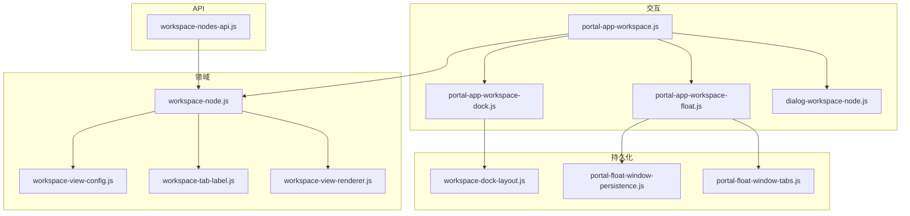
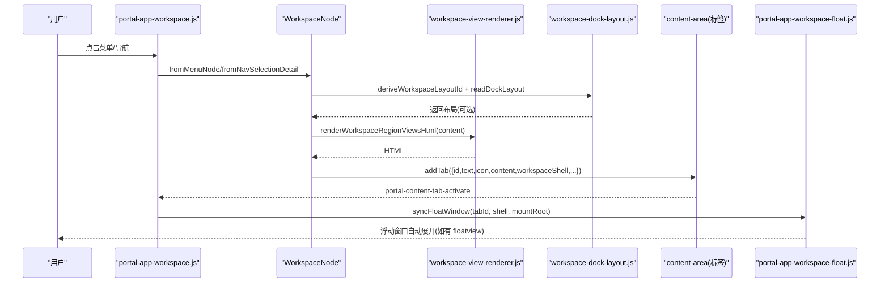
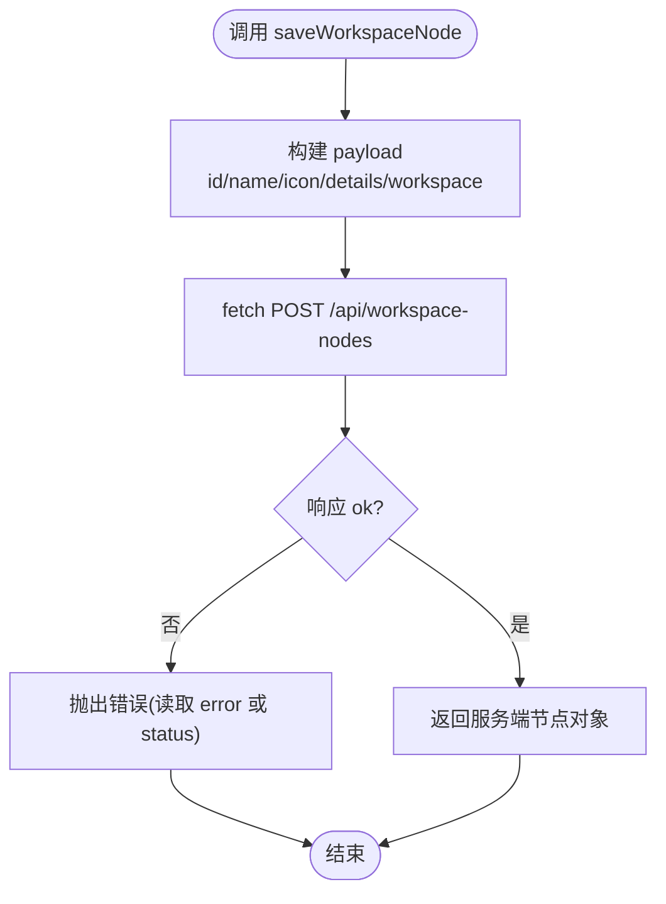
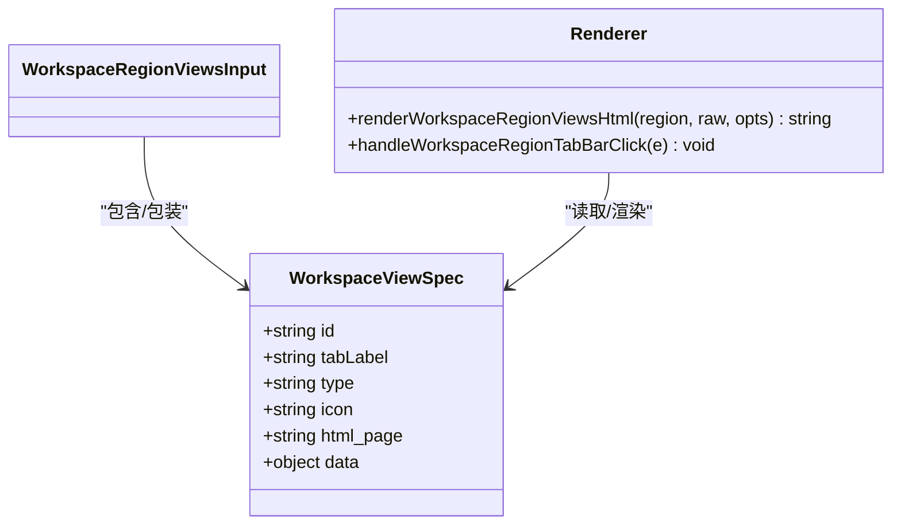
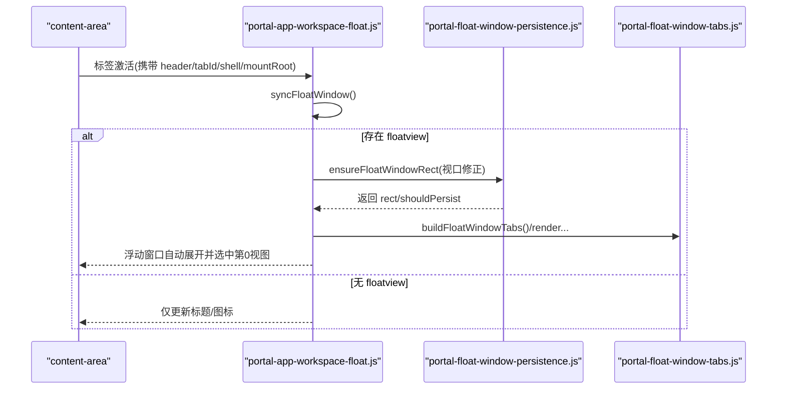
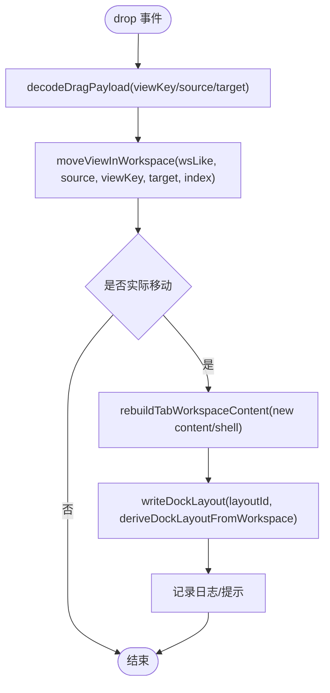
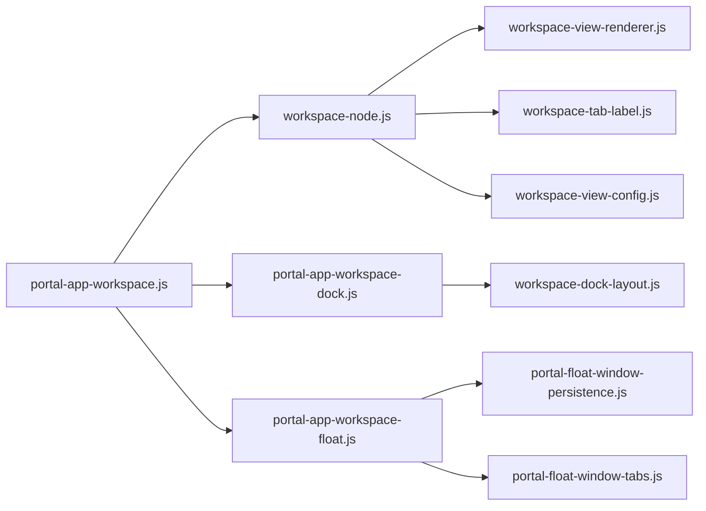

# 工作区 API

<cite>
**本文引用的文件**
- [CMXPortalManager/src/api/workspace-nodes-api.js](file://CMXPortalManager/src/api/workspace-nodes-api.js)
- [CMXHTMLDesigner/src/api/workspace-nodes-api.js](file://CMXHTMLDesigner/src/api/workspace-nodes-api.js)
- [CMXPortalManager/src/lib/workspace-node.js](file://CMXPortalManager/src/lib/workspace-node.js)
- [CMXPortalManager/src/components/portal-app-workspace.js](file://CMXPortalManager/src/components/portal-app-workspace.js)
- [CMXPortalManager/src/lib/workspace-dock-layout.js](file://CMXPortalManager/src/lib/workspace-dock-layout.js)
- [CMXPortalManager/src/components/portal-app-workspace-dock.js](file://CMXPortalManager/src/components/portal-app-workspace-dock.js)
- [CMXPortalManager/src/lib/workspace-view-config.js](file://CMXPortalManager/src/lib/workspace-view-config.js)
- [CMXPortalManager/src/lib/workspace-tab-label.js](file://CMXPortalManager/src/lib/workspace-tab-label.js)
- [CMXPortalManager/src/lib/workspace-view-renderer.js](file://CMXPortalManager/src/lib/workspace-view-renderer.js)
- [CMXPortalManager/src/components/portal-app-workspace-float.js](file://CMXPortalManager/src/components/portal-app-workspace-float.js)
- [CMXPortalManager/src/lib/portal-float-window-persistence.js](file://CMXPortalManager/src/lib/portal-float-window-persistence.js)
- [CMXPortalManager/src/lib/portal-float-window-tabs.js](file://CMXPortalManager/src/lib/portal-float-window-tabs.js)
- [CMXPortalManager/src/lib/dialog-workspace-node.js](file://CMXPortalManager/src/lib/dialog-workspace-node.js)
</cite>

## 目录
1. [简介](#简介)
2. [项目结构](#项目结构)
3. [核心组件](#核心组件)
4. [架构总览](#架构总览)
5. [详细组件分析](#详细组件分析)
6. [依赖关系分析](#依赖关系分析)
7. [性能与一致性](#性能与一致性)
8. [故障排查指南](#故障排查指南)
9. [结论](#结论)
10. [附录：状态管理与最佳实践](#附录：状态管理与最佳实践)

## 简介
本文件面向“工作区 API”，覆盖以下能力：
- 工作区节点管理：创建、读取、保存、删除工作区节点（REST 对齐）。
- 标签页控制：内容区多视图 Tab 的渲染、切换、标题与图标策略。
- 浮动窗口：floatview 区域在浮动窗中展示，含位置持久化与自动展开。
- 工作流操作：从菜单/导航选择到打开工作区节点的完整流程，含准备对话框与加载态。
- 布局持久化与同步：Dock 区域拖拽布局的派生、应用、写入 localStorage 与重置。
- 多用户协作与冲突：基于本地存储的布局隔离与 LRU 清理；后端节点级数据一致性由 REST 接口保障。
- 状态管理示例与最佳实践：提供端到端调用序列与推荐用法。

## 项目结构
工作区相关代码主要分布在 CMXPortalManager 前端模块中，分为三层：
- API 层：与后端 /api/workspace-nodes 对齐的 CRUD 封装。
- 领域模型与渲染：WorkspaceNode、视图配置、标签文案、视图渲染器。
- 交互与持久化：Dock 布局、浮动窗口、对话框工作区、准备流程。

图表来源
- [CMXPortalManager/src/api/workspace-nodes-api.js:1-70](file://CMXPortalManager/src/api/workspace-nodes-api.js#L1-L70)
- [CMXPortalManager/src/lib/workspace-node.js:1-283](file://CMXPortalManager/src/lib/workspace-node.js#L1-L283)
- [CMXPortalManager/src/lib/workspace-view-config.js:1-157](file://CMXPortalManager/src/lib/workspace-view-config.js#L1-L157)
- [CMXPortalManager/src/lib/workspace-tab-label.js:1-117](file://CMXPortalManager/src/lib/workspace-tab-label.js#L1-L117)
- [CMXPortalManager/src/lib/workspace-view-renderer.js:1-310](file://CMXPortalManager/src/lib/workspace-view-renderer.js#L1-L310)
- [CMXPortalManager/src/components/portal-app-workspace.js:1-160](file://CMXPortalManager/src/components/portal-app-workspace.js#L1-L160)
- [CMXPortalManager/src/components/portal-app-workspace-dock.js:1-154](file://CMXPortalManager/src/components/portal-app-workspace-dock.js#L1-L154)
- [CMXPortalManager/src/components/portal-app-workspace-float.js:1-79](file://CMXPortalManager/src/components/portal-app-workspace-float.js#L1-L79)
- [CMXPortalManager/src/lib/portal-float-window-persistence.js:1-109](file://CMXPortalManager/src/lib/portal-float-window-persistence.js#L1-L109)
- [CMXPortalManager/src/lib/portal-float-window-tabs.js:1-87](file://CMXPortalManager/src/lib/portal-float-window-tabs.js#L1-L87)
- [CMXPortalManager/src/lib/dialog-workspace-node.js:1-104](file://CMXPortalManager/src/lib/dialog-workspace-node.js#L1-L104)

章节来源
- [CMXPortalManager/src/api/workspace-nodes-api.js:1-70](file://CMXPortalManager/src/api/workspace-nodes-api.js#L1-L70)
- [CMXPortalManager/src/lib/workspace-node.js:1-283](file://CMXPortalManager/src/lib/workspace-node.js#L1-L283)

## 核心组件
- 工作区节点 API：提供 list/get/save/delete 四个方法，统一错误消息解析与 JSON 序列化。
- WorkspaceNode：工作区节点主控，负责从菜单/导航构造节点、合并 workspace、恢复 Dock 布局、生成 content/shell 并注入 tab。
- 视图配置与渲染：定义 region/spec 规范、归一化视图数组、内置类型渲染、Tab 条与事件委托。
- Dock 布局：按 viewKey 派生、跨区移动、localStorage 持久化、LRU 裁剪、重置。
- 浮动窗口：根据当前 content 标签头信息设置标题/图标，自动展开 floatview，持久化位置尺寸。
- 对话框工作区：将 explorer/content/property/bottom 放入对话框内展示，支持按钮回调。

章节来源
- [CMXPortalManager/src/api/workspace-nodes-api.js:1-70](file://CMXPortalManager/src/api/workspace-nodes-api.js#L1-L70)
- [CMXPortalManager/src/lib/workspace-node.js:1-283](file://CMXPortalManager/src/lib/workspace-node.js#L1-L283)
- [CMXPortalManager/src/lib/workspace-view-config.js:1-157](file://CMXPortalManager/src/lib/workspace-view-config.js#L1-L157)
- [CMXPortalManager/src/lib/workspace-view-renderer.js:1-310](file://CMXPortalManager/src/lib/workspace-view-renderer.js#L1-L310)
- [CMXPortalManager/src/lib/workspace-dock-layout.js:1-609](file://CMXPortalManager/src/lib/workspace-dock-layout.js#L1-L609)
- [CMXPortalManager/src/components/portal-app-workspace-float.js:1-79](file://CMXPortalManager/src/components/portal-app-workspace-float.js#L1-L79)
- [CMXPortalManager/src/lib/portal-float-window-persistence.js:1-109](file://CMXPortalManager/src/lib/portal-float-window-persistence.js#L1-L109)
- [CMXPortalManager/src/lib/dialog-workspace-node.js:1-104](file://CMXPortalManager/src/lib/dialog-workspace-node.js#L1-L104)

## 架构总览
工作区以“节点”为最小可打开单元，通过“菜单/导航 → 节点 → 标签页”链路打开，同时维护侧栏/属性/底部/浮动区域的视图集合，并通过 Dock 布局实现跨会话的位置记忆。

图表来源
- [CMXPortalManager/src/components/portal-app-workspace.js:93-148](file://CMXPortalManager/src/components/portal-app-workspace.js#L93-L148)
- [CMXPortalManager/src/lib/workspace-node.js:124-283](file://CMXPortalManager/src/lib/workspace-node.js#L124-L283)
- [CMXPortalManager/src/lib/workspace-dock-layout.js:113-140](file://CMXPortalManager/src/lib/workspace-dock-layout.js#L113-L140)
- [CMXPortalManager/src/lib/workspace-view-renderer.js:141-201](file://CMXPortalManager/src/lib/workspace-view-renderer.js#L141-L201)
- [CMXPortalManager/src/components/portal-app-workspace-float.js:15-43](file://CMXPortalManager/src/components/portal-app-workspace-float.js#L15-L43)

## 详细组件分析

### 工作区节点管理（REST）
- 列表：GET /api/workspace-nodes，返回 items 与 total。
- 详情：GET /api/workspace-nodes/:id，返回节点元信息与 workspace。
- 保存：POST /api/workspace-nodes，提交 id/name/icon/details/workspace。
- 删除：DELETE /api/workspace-nodes/:id，返回 removed 标志。
- 错误处理：统一读取响应体中的 error 字段或 HTTP status。

图表来源
- [CMXPortalManager/src/api/workspace-nodes-api.js:17-69](file://CMXPortalManager/src/api/workspace-nodes-api.js#L17-L69)

章节来源
- [CMXPortalManager/src/api/workspace-nodes-api.js:1-70](file://CMXPortalManager/src/api/workspace-nodes-api.js#L1-L70)
- [CMXHTMLDesigner/src/api/workspace-nodes-api.js:1-69](file://CMXHTMLDesigner/src/api/workspace-nodes-api.js#L1-L69)

### 标签页控制（内容区多视图）
- 视图配置：region 可为单视图、数组或带 views/caption/icon 的包装对象。
- 渲染：renderWorkspaceRegionViewsHtml 生成 Tab 条与面板，支持 top/bottom 定位。
- 切换：handleWorkspaceRegionTabBarClick 更新 active 样式与面板显示，并在 content 区派发 portal-content-view-change 事件，联动 property 栏显隐与内部 tab 切换。
- 标题与图标：优先使用包装层 caption/icon，否则取首个视图的 tabLabel/icon，再回退到菜单项。

图表来源
- [CMXPortalManager/src/lib/workspace-view-config.js:6-13](file://CMXPortalManager/src/lib/workspace-view-config.js#L6-L13)
- [CMXPortalManager/src/lib/workspace-view-renderer.js:141-201](file://CMXPortalManager/src/lib/workspace-view-renderer.js#L141-L201)
- [CMXPortalManager/src/lib/workspace-view-renderer.js:210-265](file://CMXPortalManager/src/lib/workspace-view-renderer.js#L210-L265)
- [CMXPortalManager/src/lib/workspace-tab-label.js:11-78](file://CMXPortalManager/src/lib/workspace-tab-label.js#L11-L78)

章节来源
- [CMXPortalManager/src/lib/workspace-view-config.js:1-157](file://CMXPortalManager/src/lib/workspace-view-config.js#L1-L157)
- [CMXPortalManager/src/lib/workspace-view-renderer.js:1-310](file://CMXPortalManager/src/lib/workspace-view-renderer.js#L1-L310)
- [CMXPortalManager/src/lib/workspace-tab-label.js:1-117](file://CMXPortalManager/src/lib/workspace-tab-label.js#L1-L117)

### 浮动窗口与工作流
- 浮动窗口：syncFloatWindow 根据当前 content 标签头设置标题/图标，若存在 floatview 则首次激活时自动展开。
- 设计器打开：openHtmlPageInDesigner 将 html_pages 视图在新标签页中以 DAM 上下文打开。
- 持久化：read/writeFloatWindowRect/BallPos 持久化位置尺寸，ensure* 修正视口可见性。
- 标签：buildFloatWindowTabs/renderFloatWindowTabBarHtml/syncFloatWindowTabBarState 管理浮动窗口内 Tab。

图表来源
- [CMXPortalManager/src/components/portal-app-workspace-float.js:15-79](file://CMXPortalManager/src/components/portal-app-workspace-float.js#L15-L79)
- [CMXPortalManager/src/lib/portal-float-window-persistence.js:21-109](file://CMXPortalManager/src/lib/portal-float-window-persistence.js#L21-L109)
- [CMXPortalManager/src/lib/portal-float-window-tabs.js:4-87](file://CMXPortalManager/src/lib/portal-float-window-tabs.js#L4-L87)

章节来源
- [CMXPortalManager/src/components/portal-app-workspace-float.js:1-79](file://CMXPortalManager/src/components/portal-app-workspace-float.js#L1-L79)
- [CMXPortalManager/src/lib/portal-float-window-persistence.js:1-109](file://CMXPortalManager/src/lib/portal-float-window-persistence.js#L1-L109)
- [CMXPortalManager/src/lib/portal-float-window-tabs.js:1-87](file://CMXPortalManager/src/lib/portal-float-window-tabs.js#L1-L87)

### 布局持久化与同步（Dock）
- 视图键派生：deriveWorkspaceViewKey 基于 html_page/id/viewId/stableHash/位置回退链。
- 布局应用：applyDockLayoutToWorkspace 将 layout 应用到 ws，保留 wrapper meta，未认领视图追加至原区末尾。
- 移动算法：moveViewInWorkspace 在同区/跨区移动视图，避免原位拖拽无效，仅写回受影响区域。
- 持久化：write/readDockLayout 使用单一 key 存储所有 workspace 布局，LRU 裁剪超量条目。
- 重置：resetTabDockLayout 清除存储并恢复原始布局快照，非 dock 区保持引用避免误销毁。

图表来源
- [CMXPortalManager/src/components/portal-app-workspace-dock.js:19-70](file://CMXPortalManager/src/components/portal-app-workspace-dock.js#L19-L70)
- [CMXPortalManager/src/lib/workspace-dock-layout.js:245-316](file://CMXPortalManager/src/lib/workspace-dock-layout.js#L245-L316)
- [CMXPortalManager/src/lib/workspace-dock-layout.js:318-398](file://CMXPortalManager/src/lib/workspace-dock-layout.js#L318-L398)

章节来源
- [CMXPortalManager/src/lib/workspace-dock-layout.js:1-609](file://CMXPortalManager/src/lib/workspace-dock-layout.js#L1-L609)
- [CMXPortalManager/src/components/portal-app-workspace-dock.js:1-154](file://CMXPortalManager/src/components/portal-app-workspace-dock.js#L1-L154)

### 对话框工作区
- DialogWorkspaceNode.fromConfig 支持 dialogspace/dialogWorkspace/extras 多种来源。
- open 动态导入对话框组件，挂载后监听关闭事件返回 action/buttonId。

章节来源
- [CMXPortalManager/src/lib/dialog-workspace-node.js:1-104](file://CMXPortalManager/src/lib/dialog-workspace-node.js#L1-L104)

## 依赖关系分析
- workspace-node.js 聚合导出多个子模块，作为工作区能力的门面。
- portal-app-workspace.js 协调打开流程、Dock 布局、浮动窗口与准备对话框。
- workspace-dock-layout.js 被 dock 组件与 node.open_view 共同使用，保证布局一致性与持久化。
- workspace-view-renderer.js 提供视图渲染与 Tab 行为，被 node 打开流程调用。
- 浮动窗口与持久化模块解耦，便于独立扩展。

图表来源
- [CMXPortalManager/src/components/portal-app-workspace.js:1-160](file://CMXPortalManager/src/components/portal-app-workspace.js#L1-L160)
- [CMXPortalManager/src/lib/workspace-node.js:1-20](file://CMXPortalManager/src/lib/workspace-node.js#L1-L20)
- [CMXPortalManager/src/components/portal-app-workspace-dock.js:1-154](file://CMXPortalManager/src/components/portal-app-workspace-dock.js#L1-L154)
- [CMXPortalManager/src/components/portal-app-workspace-float.js:1-79](file://CMXPortalManager/src/components/portal-app-workspace-float.js#L1-L79)

章节来源
- [CMXPortalManager/src/components/portal-app-workspace.js:1-160](file://CMXPortalManager/src/components/portal-app-workspace.js#L1-L160)
- [CMXPortalManager/src/lib/workspace-node.js:1-283](file://CMXPortalManager/src/lib/workspace-node.js#L1-L283)

## 性能与一致性
- 布局持久化采用单 key 存储，LRU 裁剪最多 200 条，避免 localStorage 配额耗尽。
- moveViewInWorkspace 仅写回受影响的 region，减少下游重建范围，降低视觉闪烁。
- 视图 ID 去重与稳定 hash 避免重复与漂移，提升布局匹配稳定性。
- 错误路径统一捕获并记录日志，保证异常不阻断主流程。
- 多用户协作：
  - 布局：localStorage 为浏览器本地存储，天然按用户/会话隔离；不同用户互不影响。
  - 节点数据：通过 REST 接口进行增删改查，建议在后端增加版本/时间戳与并发控制以保证一致性。
  - 冲突解决：建议在保存节点时携带 updatedAt 或版本号，后端拒绝过期写入并返回冲突提示；前端据此提示用户刷新或合并。

[本节为通用指导，无需特定文件来源]

## 故障排查指南
- 无法打开工作区：检查菜单节点是否包含 workspace 字段；确认 openWorkspaceNodeWithPrepare 正常执行。
- 浮动窗口未展开：确认当前 content 标签存在 floatview 视图；检查 ensureFloatWindowRect 视口修正逻辑。
- 布局丢失或错乱：检查 localStorage 中 cmx-portal:wsDockLayout:v1 是否存在且 schemaVersion 匹配；必要时调用 clearDockLayout 重置。
- 保存失败：查看 writeDockLayout 抛出的异常与日志；确认存储空间充足。
- 视图类型不支持：注册自定义渲染器 registerWorkspaceViewType(type, fn)。

章节来源
- [CMXPortalManager/src/lib/workspace-dock-layout.js:318-398](file://CMXPortalManager/src/lib/workspace-dock-layout.js#L318-L398)
- [CMXPortalManager/src/lib/workspace-view-renderer.js:118-139](file://CMXPortalManager/src/lib/workspace-view-renderer.js#L118-L139)
- [CMXPortalManager/src/components/portal-app-workspace-float.js:15-43](file://CMXPortalManager/src/components/portal-app-workspace-float.js#L15-L43)

## 结论
该工作区 API 提供了完整的节点管理、标签页控制、浮动窗口与工作流编排能力，并通过 Dock 布局实现了跨会话的个性化体验。结合 REST 接口与本地持久化，可在多用户场景下实现良好的隔离与一致性。建议在生产环境中增强后端并发控制与冲突提示，进一步提升协作体验。

[本节为总结，无需特定文件来源]

## 附录：状态管理与最佳实践
- 打开工作区节点
  - 通过菜单/导航触发 handleNavSelection，内部构造 WorkspaceNode 并调用 openWorkspaceNodeWithPrepare。
  - 如需预置 context，传入 extras.initialContext，供页面脚本启动期读取。
- 管理标签页
  - 使用 renderWorkspaceRegionViewsHtml 生成多视图 Tab；通过 activateWorkspaceRegionViewByIndex 程序化切换。
  - 利用 workspaceContentTabText/workspaceContentTabIcon 获取一致的标题与图标。
- 管理浮动窗口
  - 在 content 标签激活时调用 syncFloatWindow，自动展开 floatview。
  - 使用 ensureFloatWindowRect/ensureFloatBallPos 确保窗口可见性。
- 管理 Dock 布局
  - 拖动结束后由 applyViewDrop 重组 ws-like 并写回 localStorage。
  - 需要恢复默认布局时调用 resetTabDockLayout，注意非 dock 区引用保持不变。
- 多用户协作
  - 布局：localStorage 天然隔离；如需跨设备同步，可将布局迁移到后端并以用户维度存储。
  - 节点：保存时携带 updatedAt/version，后端做乐观锁；冲突时提示用户刷新或合并。
- 示例流程（端到端）
  - 用户点击菜单 → 构造节点 → 恢复 Dock 布局 → 渲染 content/shell → 添加标签页 → 激活时自动展开浮动窗口 → 拖拽调整布局 → 持久化布局。

章节来源
- [CMXPortalManager/src/components/portal-app-workspace.js:93-148](file://CMXPortalManager/src/components/portal-app-workspace.js#L93-L148)
- [CMXPortalManager/src/lib/workspace-node.js:216-283](file://CMXPortalManager/src/lib/workspace-node.js#L216-L283)
- [CMXPortalManager/src/lib/workspace-view-renderer.js:294-310](file://CMXPortalManager/src/lib/workspace-view-renderer.js#L294-L310)
- [CMXPortalManager/src/components/portal-app-workspace-dock.js:19-154](file://CMXPortalManager/src/components/portal-app-workspace-dock.js#L19-L154)
- [CMXPortalManager/src/lib/workspace-dock-layout.js:113-140](file://CMXPortalManager/src/lib/workspace-dock-layout.js#L113-L140)