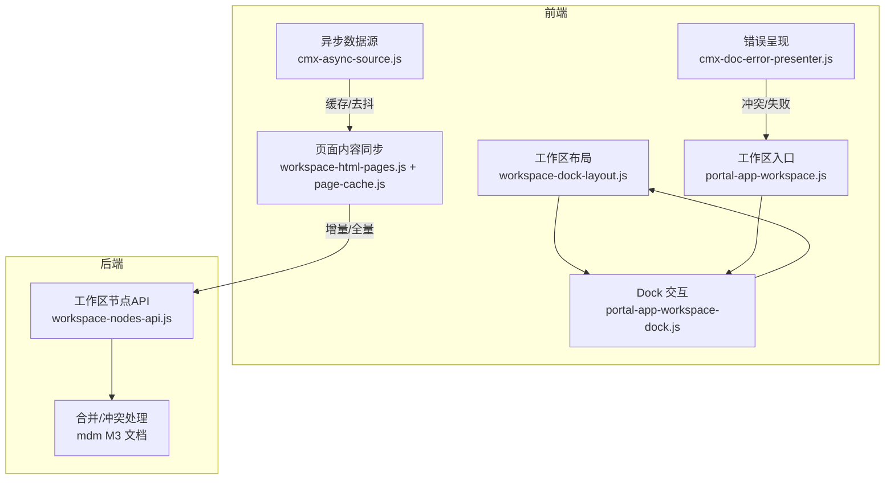
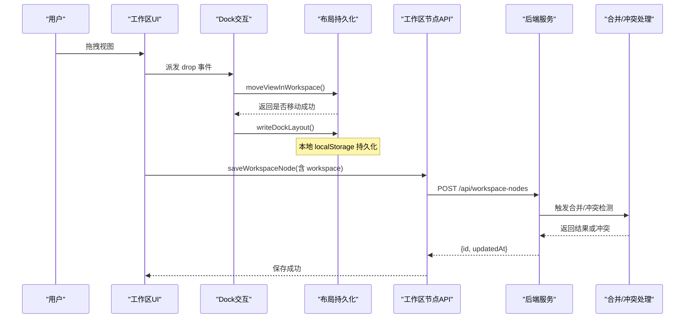
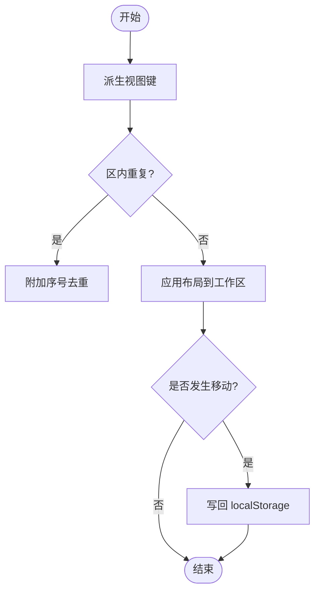
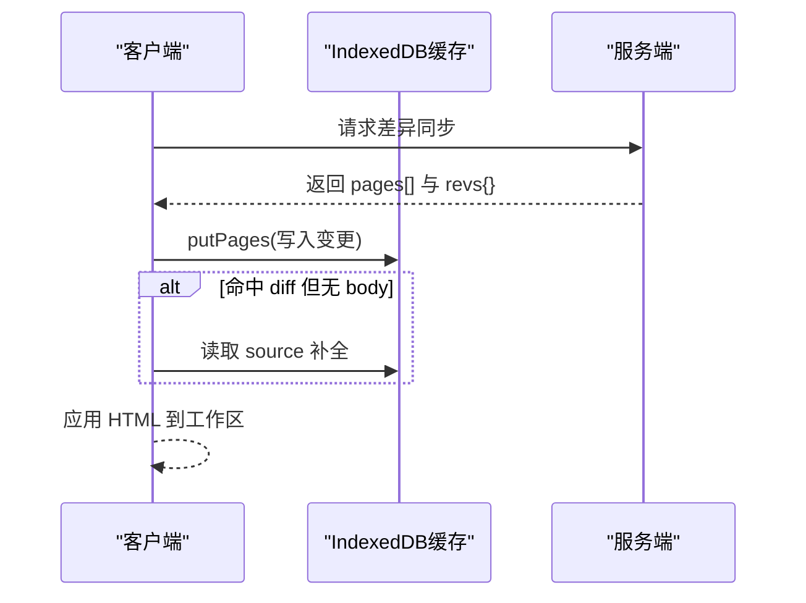
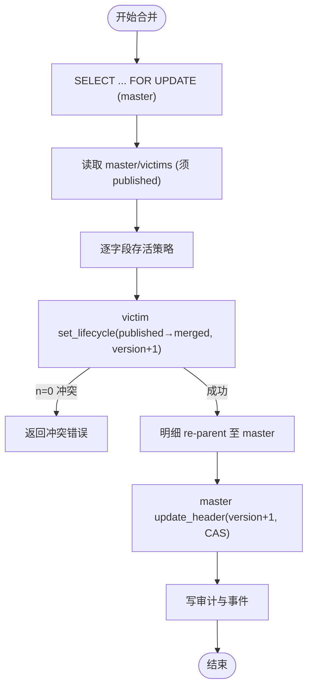
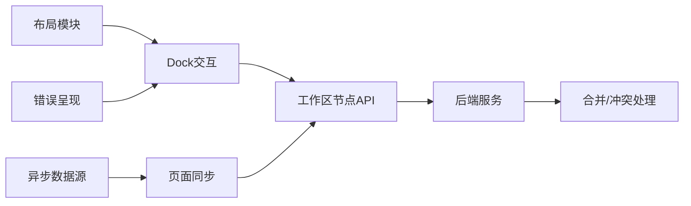

# 工作区同步机制

<cite>
**本文引用的文件**
- [CMXPortalManager/src/lib/workspace-dock-layout.js](file://CMXPortalManager/src/lib/workspace-dock-layout.js)
- [CMXPortalManager/src/components/portal-app-workspace-dock.js](file://CMXPortalManager/src/components/portal-app-workspace-dock.js)
- [CMXPortalManager/src/components/portal-app-workspace.js](file://CMXPortalManager/src/components/portal-app-workspace.js)
- [CMXPortalManager/src/lib/workspace-node.js](file://CMXPortalManager/src/lib/workspace-node.js)
- [CMXPortalManager/src/api/workspace-nodes-api.js](file://CMXPortalManager/src/api/workspace-nodes-api.js)
- [CMXHTMLDesigner/src/api/workspace-nodes-api.js](file://CMXHTMLDesigner/src/api/workspace-nodes-api.js)
- [packages/cmx-data-comp/src/lib/cmx-async-source.js](file://packages/cmx-data-comp/src/lib/cmx-async-source.js)
- [packages/cmx-data-comp/src/lib/cmx-doc-error-presenter.js](file://packages/cmx-data-comp/src/lib/cmx-doc-error-presenter.js)
- [CMXPortalManager/src/lib/page-cache.js](file://CMXPortalManager/src/lib/page-cache.js)
- [CMXPortalManager/src/lib/workspace-html-pages.js](file://CMXPortalManager/src/lib/workspace-html-pages.js)
- [documents/MDM主数据管理平台/20260804_cmx-mdm_M3_匹配合并存活_任务细化.md](file://documents/MDM主数据管理平台/20260804_cmx-mdm_M3_匹配合并存活_任务细化.md)
</cite>

## 目录
1. [简介](#简介)
2. [项目结构](#项目结构)
3. [核心组件](#核心组件)
4. [架构总览](#架构总览)
5. [详细组件分析](#详细组件分析)
6. [依赖关系分析](#依赖关系分析)
7. [性能考量](#性能考量)
8. [故障排查指南](#故障排查指南)
9. [结论](#结论)
10. [附录](#附录)

## 简介
本文件面向多用户协作场景下的“工作区同步机制”，围绕以下目标展开：
- 工作区状态同步策略：冲突检测、合并算法与版本控制。
- 本地缓存与服务器数据的同步流程：增量更新、全量同步、断线重连。
- 乐观锁实现与并发访问控制。
- 同步失败的恢复策略与错误处理方案。
- 性能优化建议与监控指标。

该机制由前端工作区布局持久化、视图拖拽重组、页面内容差异同步、以及后端合并/冲突处理共同构成，形成从界面到存储再到服务端的完整闭环。

## 项目结构
工作区同步涉及前后端多个模块：
- 前端工作区布局与视图管理：负责视图的派生键、区域移动、本地布局持久化（localStorage）。
- 页面内容同步：基于服务端返回的差异包进行增量更新，并将变更落盘 IndexedDB。
- 工作区节点 API：提供工作区节点的增删改查接口，用于持久化工作区元数据。
- 异步数据源工具：为列表/搜索等提供 LRU 缓存、去抖、请求取消能力。
- 错误呈现与冲突处理：将存储服务错误转化为可操作的用户提示，支持冲突刷新重试。
- 后端合并与并发控制：通过事务、行级锁、CAS 版本号与生命周期状态保证一致性。

图表来源
- [CMXPortalManager/src/lib/workspace-dock-layout.js:1-120](file://CMXPortalManager/src/lib/workspace-dock-layout.js#L1-L120)
- [CMXPortalManager/src/components/portal-app-workspace-dock.js:1-70](file://CMXPortalManager/src/components/portal-app-workspace-dock.js#L1-L70)
- [CMXPortalManager/src/components/portal-app-workspace.js:28-62](file://CMXPortalManager/src/components/portal-app-workspace.js#L28-L62)
- [CMXPortalManager/src/lib/workspace-html-pages.js:219-241](file://CMXPortalManager/src/lib/workspace-html-pages.js#L219-L241)
- [packages/cmx-data-comp/src/lib/cmx-async-source.js:10-81](file://packages/cmx-data-comp/src/lib/cmx-async-source.js#L10-L81)
- [packages/cmx-data-comp/src/lib/cmx-doc-error-presenter.js:19-158](file://packages/cmx-data-comp/src/lib/cmx-doc-error-presenter.js#L19-L158)
- [CMXPortalManager/src/api/workspace-nodes-api.js:1-70](file://CMXPortalManager/src/api/workspace-nodes-api.js#L1-L70)
- [documents/MDM主数据管理平台/20260804_cmx-mdm_M3_匹配合并存活_任务细化.md:23-86](file://documents/MDM主数据管理平台/20260804_cmx-mdm_M3_匹配合并存活_任务细化.md#L23-L86)

章节来源
- [CMXPortalManager/src/lib/workspace-dock-layout.js:1-120](file://CMXPortalManager/src/lib/workspace-dock-layout.js#L1-L120)
- [CMXPortalManager/src/components/portal-app-workspace-dock.js:1-70](file://CMXPortalManager/src/components/portal-app-workspace-dock.js#L1-L70)
- [CMXPortalManager/src/components/portal-app-workspace.js:28-62](file://CMXPortalManager/src/components/portal-app-workspace.js#L28-L62)
- [CMXPortalManager/src/lib/workspace-html-pages.js:219-241](file://CMXPortalManager/src/lib/workspace-html-pages.js#L219-L241)
- [packages/cmx-data-comp/src/lib/cmx-async-source.js:10-81](file://packages/cmx-data-comp/src/lib/cmx-async-source.js#L10-L81)
- [packages/cmx-data-comp/src/lib/cmx-doc-error-presenter.js:19-158](file://packages/cmx-data-comp/src/lib/cmx-doc-error-presenter.js#L19-L158)
- [CMXPortalManager/src/api/workspace-nodes-api.js:1-70](file://CMXPortalManager/src/api/workspace-nodes-api.js#L1-L70)
- [documents/MDM主数据管理平台/20260804_cmx-mdm_M3_匹配合并存活_任务细化.md:23-86](file://documents/MDM主数据管理平台/20260804_cmx-mdm_M3_匹配合并存活_任务细化.md#L23-L86)

## 核心组件
- 工作区布局与视图键派生：根据视图规格生成稳定键，支持跨区域拖拽移动与持久化。
- Dock 交互与保存：接收拖拽事件，重组工作区对象，写回本地布局，必要时重建内容挂载。
- 工作区节点 API：对后端 REST 接口封装，完成工作区节点的读取、保存、删除。
- 页面内容同步：与服务端协商差异，拉取变更并写入本地 IndexedDB，供下次 diff 命中。
- 异步数据源缓存：LRU 缓存查询结果与单值查找，支持去抖与请求取消。
- 错误呈现与冲突处理：将存储服务错误映射为用户可操作的提示，支持冲突后刷新。
- 后端合并与并发控制：通过事务、FOR UPDATE 行锁、CAS 版本号与生命周期状态确保合并安全。

章节来源
- [CMXPortalManager/src/lib/workspace-dock-layout.js:60-140](file://CMXPortalManager/src/lib/workspace-dock-layout.js#L60-L140)
- [CMXPortalManager/src/components/portal-app-workspace-dock.js:19-70](file://CMXPortalManager/src/components/portal-app-workspace-dock.js#L19-L70)
- [CMXPortalManager/src/api/workspace-nodes-api.js:20-70](file://CMXPortalManager/src/api/workspace-nodes-api.js#L20-L70)
- [CMXPortalManager/src/lib/workspace-html-pages.js:219-241](file://CMXPortalManager/src/lib/workspace-html-pages.js#L219-L241)
- [packages/cmx-data-comp/src/lib/cmx-async-source.js:10-81](file://packages/cmx-data-comp/src/lib/cmx-async-source.js#L10-L81)
- [packages/cmx-data-comp/src/lib/cmx-doc-error-presenter.js:19-158](file://packages/cmx-data-comp/src/lib/cmx-doc-error-presenter.js#L19-L158)
- [documents/MDM主数据管理平台/20260804_cmx-mdm_M3_匹配合并存活_任务细化.md:23-86](file://documents/MDM主数据管理平台/20260804_cmx-mdm_M3_匹配合并存活_任务细化.md#L23-L86)

## 架构总览
下图展示工作区同步的整体流程：用户在界面拖拽视图，前端重组工作区并持久化布局；页面内容通过差异同步更新本地缓存；工作区节点保存到后端；后端在合并时采用事务与乐观锁保障一致性。

图表来源
- [CMXPortalManager/src/components/portal-app-workspace-dock.js:19-70](file://CMXPortalManager/src/components/portal-app-workspace-dock.js#L19-L70)
- [CMXPortalManager/src/lib/workspace-dock-layout.js:245-316](file://CMXPortalManager/src/lib/workspace-dock-layout.js#L245-L316)
- [CMXPortalManager/src/api/workspace-nodes-api.js:42-56](file://CMXPortalManager/src/api/workspace-nodes-api.js#L42-L56)
- [documents/MDM主数据管理平台/20260804_cmx-mdm_M3_匹配合并存活_任务细化.md:172-195](file://documents/MDM主数据管理平台/20260804_cmx-mdm_M3_匹配合并存活_任务细化.md#L172-L195)

## 详细组件分析

### 工作区布局与视图键派生
- 视图键派生：优先使用 html_page id，其次显式 id/viewId，再退化为类型+标签+数据指纹的稳定哈希，最后回退到位置占位符。区内重复键附加序号去重。
- 布局应用：将持久化的布局应用到当前工作区，未匹配到的旧键记录丢弃日志，新增视图自动追加。
- 移动算法：按源区域与目标区域执行 splice 插入，同区移动时补偿索引偏移，仅写回受影响区域以减少重建开销。
- 持久化：以 schemaVersion 保护兼容，超过条目上限按 savedAt 淘汰最旧项，避免 localStorage 配额耗尽。

图表来源
- [CMXPortalManager/src/lib/workspace-dock-layout.js:60-140](file://CMXPortalManager/src/lib/workspace-dock-layout.js#L60-L140)
- [CMXPortalManager/src/lib/workspace-dock-layout.js:245-316](file://CMXPortalManager/src/lib/workspace-dock-layout.js#L245-L316)
- [CMXPortalManager/src/lib/workspace-dock-layout.js:318-398](file://CMXPortalManager/src/lib/workspace-dock-layout.js#L318-L398)

章节来源
- [CMXPortalManager/src/lib/workspace-dock-layout.js:60-140](file://CMXPortalManager/src/lib/workspace-dock-layout.js#L60-L140)
- [CMXPortalManager/src/lib/workspace-dock-layout.js:245-316](file://CMXPortalManager/src/lib/workspace-dock-layout.js#L245-L316)
- [CMXPortalManager/src/lib/workspace-dock-layout.js:318-398](file://CMXPortalManager/src/lib/workspace-dock-layout.js#L318-L398)

### Dock 交互与保存
- 接收 drop 事件，提取 tabId、source/target 区域与 viewKey，构建 ws-like 对象并调用移动算法。
- 成功后重建内容挂载，派生布局 JSON 并写回 localStorage，同时向日志面板输出操作结果。
- 提供保存与重置布局的能力，重置时保留非 dock 区引用以避免误销毁嵌入根。

章节来源
- [CMXPortalManager/src/components/portal-app-workspace-dock.js:19-70](file://CMXPortalManager/src/components/portal-app-workspace-dock.js#L19-L70)
- [CMXPortalManager/src/components/portal-app-workspace-dock.js:72-154](file://CMXPortalManager/src/components/portal-app-workspace-dock.js#L72-L154)

### 工作区节点 API
- 提供 list/get/save/delete 四个端点，统一封装 fetch 调用与错误信息解析。
- 保存时携带 workspace 对象，用于持久化工作区配置。

章节来源
- [CMXPortalManager/src/api/workspace-nodes-api.js:20-70](file://CMXPortalManager/src/api/workspace-nodes-api.js#L20-L70)
- [CMXHTMLDesigner/src/api/workspace-nodes-api.js:39-68](file://CMXHTMLDesigner/src/api/workspace-nodes-api.js#L39-L68)

### 页面内容同步（增量/全量）
- 增量更新：服务端返回差异包，客户端将变化的 page 写入 IndexedDB，rev 字段取自服务端权威清单。
- 兜底补全：diff 命中的 page 若服务端省略 body，则从 IndexedDB 取 source 补全，确保下游渲染不报错。
- 容量管理：IndexedDB 写入失败时尝试淘汰最旧条目后重试，避免配额超限导致主流程中断。

图表来源
- [CMXPortalManager/src/lib/workspace-html-pages.js:219-241](file://CMXPortalManager/src/lib/workspace-html-pages.js#L219-L241)
- [CMXPortalManager/src/lib/page-cache.js:145-171](file://CMXPortalManager/src/lib/page-cache.js#L145-L171)
- [CMXPortalManager/src/lib/page-cache.js:214-243](file://CMXPortalManager/src/lib/page-cache.js#L214-L243)

章节来源
- [CMXPortalManager/src/lib/workspace-html-pages.js:219-241](file://CMXPortalManager/src/lib/workspace-html-pages.js#L219-L241)
- [CMXPortalManager/src/lib/page-cache.js:145-171](file://CMXPortalManager/src/lib/page-cache.js#L145-L171)
- [CMXPortalManager/src/lib/page-cache.js:214-243](file://CMXPortalManager/src/lib/page-cache.js#L214-L243)

### 异步数据源缓存与并发控制
- LRU 缓存：按查询字符串与单值 key 缓存结果，限制最大条目数，避免内存膨胀。
- 去抖：同一 source 共享定时器，快速输入只触发最后一次请求。
- 请求取消：同一 source 前一次未完成请求会被 AbortController 取消，减少冗余网络开销。

章节来源
- [packages/cmx-data-comp/src/lib/cmx-async-source.js:10-81](file://packages/cmx-data-comp/src/lib/cmx-async-source.js#L10-L81)
- [packages/cmx-data-comp/src/lib/cmx-async-source.js:83-143](file://packages/cmx-data-comp/src/lib/cmx-async-source.js#L83-L143)

### 错误呈现与冲突处理
- 错误分类：区分中止（AbortError）、冲突（conflict）、校验失败与普通失败。
- 用户提示：将技术消息清洗为友好文案，提供帮助码与帮助链接，支持冲突后刷新重试。
- 静默处理：中止类错误默认忽略，避免干扰用户体验。

章节来源
- [packages/cmx-data-comp/src/lib/cmx-doc-error-presenter.js:19-158](file://packages/cmx-data-comp/src/lib/cmx-doc-error-presenter.js#L19-L158)

### 后端合并与并发控制（乐观锁）
- 事务与行锁：合并事务内先锁定 master 行（FOR UPDATE），串行化交叉合并。
- CAS 版本号：set_lifecycle 同时递增 published_version，使并发 update 因版本失配回滚。
- 生命周期状态：published→merged 转换受控，防止 merged 行被后续 CR 写入覆盖。
- 明细重挂：将子表 parent_field 指向 master，保证数据一致性。

图表来源
- [documents/MDM主数据管理平台/20260804_cmx-mdm_M3_匹配合并存活_任务细化.md:23-86](file://documents/MDM主数据管理平台/20260804_cmx-mdm_M3_匹配合并存活_任务细化.md#L23-L86)
- [documents/MDM主数据管理平台/20260804_cmx-mdm_M3_匹配合并存活_任务细化.md:172-195](file://documents/MDM主数据管理平台/20260804_cmx-mdm_M3_匹配合并存活_任务细化.md#L172-L195)

章节来源
- [documents/MDM主数据管理平台/20260804_cmx-mdm_M3_匹配合并存活_任务细化.md:23-86](file://documents/MDM主数据管理平台/20260804_cmx-mdm_M3_匹配合并存活_任务细化.md#L23-L86)
- [documents/MDM主数据管理平台/20260804_cmx-mdm_M3_匹配合并存活_任务细化.md:172-195](file://documents/MDM主数据管理平台/20260804_cmx-mdm_M3_匹配合并存活_任务细化.md#L172-L195)

## 依赖关系分析
- 前端布局模块依赖视图规范与渲染管线，通过 Dock 交互驱动工作区对象变化。
- 页面内容同步依赖 IndexedDB 缓存与服务端差异协议，确保增量更新与兜底补全。
- 工作区节点 API 作为前端与后端服务的桥梁，承载工作区配置的持久化。
- 异步数据源工具为列表/搜索提供性能优化，减少重复请求与内存占用。
- 错误呈现模块统一处理存储服务错误，提升用户体验与可观测性。
- 后端合并逻辑通过数据库事务与乐观锁保障并发安全，避免数据竞争。

图表来源
- [CMXPortalManager/src/lib/workspace-dock-layout.js:1-120](file://CMXPortalManager/src/lib/workspace-dock-layout.js#L1-L120)
- [CMXPortalManager/src/components/portal-app-workspace-dock.js:1-70](file://CMXPortalManager/src/components/portal-app-workspace-dock.js#L1-L70)
- [CMXPortalManager/src/api/workspace-nodes-api.js:1-70](file://CMXPortalManager/src/api/workspace-nodes-api.js#L1-L70)
- [CMXPortalManager/src/lib/workspace-html-pages.js:219-241](file://CMXPortalManager/src/lib/workspace-html-pages.js#L219-L241)
- [packages/cmx-data-comp/src/lib/cmx-async-source.js:10-81](file://packages/cmx-data-comp/src/lib/cmx-async-source.js#L10-L81)
- [packages/cmx-data-comp/src/lib/cmx-doc-error-presenter.js:19-158](file://packages/cmx-data-comp/src/lib/cmx-doc-error-presenter.js#L19-L158)
- [documents/MDM主数据管理平台/20260804_cmx-mdm_M3_匹配合并存活_任务细化.md:23-86](file://documents/MDM主数据管理平台/20260804_cmx-mdm_M3_匹配合并存活_任务细化.md#L23-L86)

章节来源
- [CMXPortalManager/src/lib/workspace-dock-layout.js:1-120](file://CMXPortalManager/src/lib/workspace-dock-layout.js#L1-L120)
- [CMXPortalManager/src/components/portal-app-workspace-dock.js:1-70](file://CMXPortalManager/src/components/portal-app-workspace-dock.js#L1-L70)
- [CMXPortalManager/src/api/workspace-nodes-api.js:1-70](file://CMXPortalManager/src/api/workspace-nodes-api.js#L1-L70)
- [CMXPortalManager/src/lib/workspace-html-pages.js:219-241](file://CMXPortalManager/src/lib/workspace-html-pages.js#L219-L241)
- [packages/cmx-data-comp/src/lib/cmx-async-source.js:10-81](file://packages/cmx-data-comp/src/lib/cmx-async-source.js#L10-L81)
- [packages/cmx-data-comp/src/lib/cmx-doc-error-presenter.js:19-158](file://packages/cmx-data-comp/src/lib/cmx-doc-error-presenter.js#L19-L158)
- [documents/MDM主数据管理平台/20260804_cmx-mdm_M3_匹配合并存活_任务细化.md:23-86](file://documents/MDM主数据管理平台/20260804_cmx-mdm_M3_匹配合并存活_任务细化.md#L23-L86)

## 性能考量
- 局部重建：移动视图时仅写回受影响区域，避免全量重建导致的视觉闪烁与性能损耗。
- 缓存策略：
  - 页面内容：IndexedDB 缓存差异结果，减少重复下载与解析。
  - 异步数据源：LRU 缓存查询结果与单值查找，降低网络压力。
- 去抖与取消：输入过滤场景下使用去抖减少请求频率；同一 source 的前次请求可被取消，避免资源浪费。
- 容量管理：localStorage 与 IndexedDB 均具备淘汰策略，防止配额耗尽影响主流程。
- 后端优化：合并事务内最小化锁持有时间，利用 FOR UPDATE 与 CAS 提高并发吞吐。

[本节为通用指导，不直接分析具体文件]

## 故障排查指南
- 布局写入失败：检查 localStorage 配额与 schemaVersion 兼容性，必要时清理旧数据。
- 页面同步失败：确认服务端差异包格式与 revs 清单，检查 IndexedDB 写入是否成功。
- 冲突处理：当出现 conflict 错误时，提示用户刷新到最新版本并重试。
- 异步请求异常：捕获 AbortError 并静默处理；其他错误通过错误呈现模块统一提示。
- 后端合并冲突：查看合并事务是否因版本失配或生命周期状态导致回滚，必要时人工介入。

章节来源
- [CMXPortalManager/src/lib/workspace-dock-layout.js:318-398](file://CMXPortalManager/src/lib/workspace-dock-layout.js#L318-L398)
- [CMXPortalManager/src/lib/page-cache.js:145-171](file://CMXPortalManager/src/lib/page-cache.js#L145-L171)
- [packages/cmx-data-comp/src/lib/cmx-doc-error-presenter.js:19-158](file://packages/cmx-data-comp/src/lib/cmx-doc-error-presenter.js#L19-L158)
- [documents/MDM主数据管理平台/20260804_cmx-mdm_M3_匹配合并存活_任务细化.md:23-86](file://documents/MDM主数据管理平台/20260804_cmx-mdm_M3_匹配合并存活_任务细化.md#L23-L86)

## 结论
本工作区同步机制通过前端布局持久化、页面内容增量同步、后端合并与乐观锁，实现了多用户协作下的状态一致性与高可用性。关键设计包括稳定的视图键派生、局部重建优化、缓存与容量管理、以及统一的错误呈现与冲突处理。建议在后续迭代中引入更细粒度的监控指标（如缓存命中率、冲突率、合并耗时）与自动化测试用例，进一步提升系统的可观测性与稳定性。

[本节为总结性内容，不直接分析具体文件]

## 附录
- 术语表：
  - 视图键：用于唯一标识工作区中视图的稳定键。
  - 差异同步：基于服务端返回的差异包进行增量更新。
  - 乐观锁：通过版本号与生命周期状态防止并发冲突。
- 参考路径：
  - 布局与移动：[workspace-dock-layout.js](file://CMXPortalManager/src/lib/workspace-dock-layout.js)
  - Dock 交互：[portal-app-workspace-dock.js](file://CMXPortalManager/src/components/portal-app-workspace-dock.js)
  - 页面同步：[workspace-html-pages.js](file://CMXPortalManager/src/lib/workspace-html-pages.js), [page-cache.js](file://CMXPortalManager/src/lib/page-cache.js)
  - 异步数据源：[cmx-async-source.js](file://packages/cmx-data-comp/src/lib/cmx-async-source.js)
  - 错误呈现：[cmx-doc-error-presenter.js](file://packages/cmx-data-comp/src/lib/cmx-doc-error-presenter.js)
  - 工作区节点 API：[workspace-nodes-api.js](file://CMXPortalManager/src/api/workspace-nodes-api.js)
  - 后端合并：[mdm M3 文档](file://documents/MDM主数据管理平台/20260804_cmx-mdm_M3_匹配合并存活_任务细化.md)

[本节为附录说明，不直接分析具体文件]