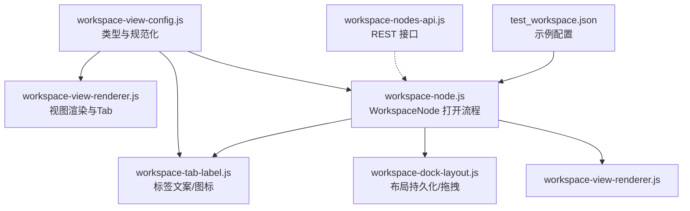
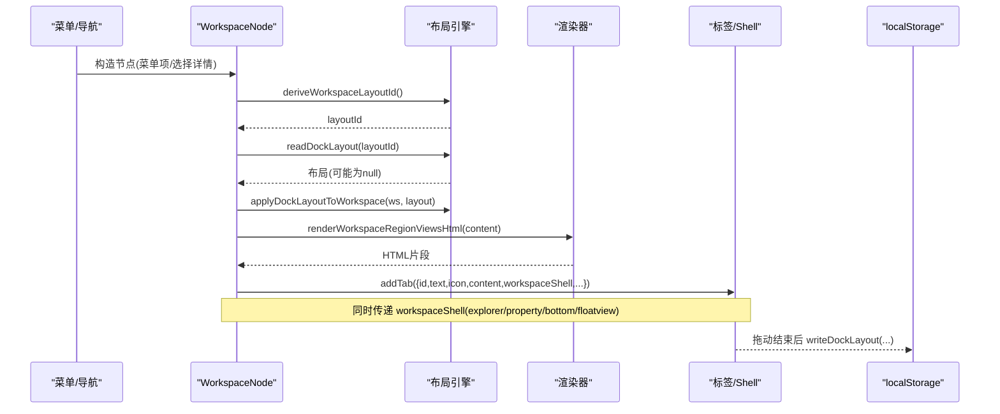
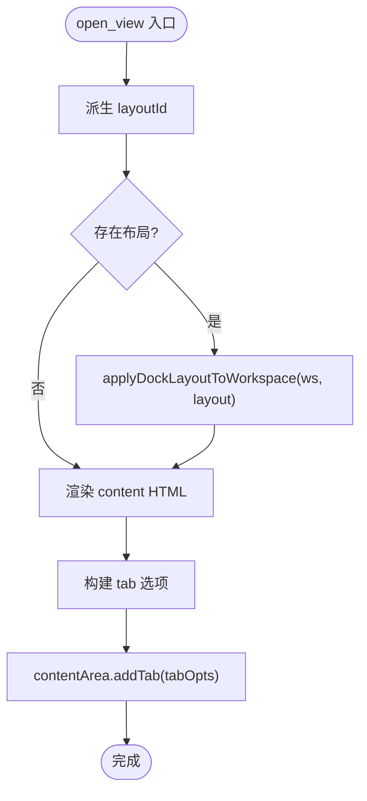
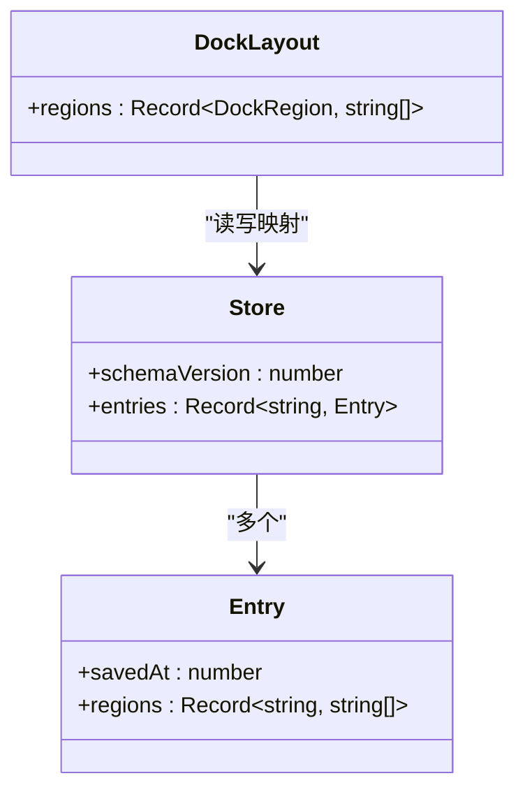
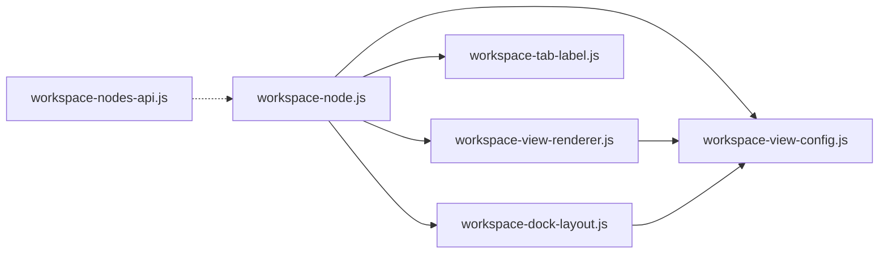

# 工作区数据模型

<cite>
**本文引用的文件**
- [workspace-view-config.js](file://CMXPortalManager/src/lib/workspace-view-config.js)
- [workspace-node.js](file://CMXPortalManager/src/lib/workspace-node.js)
- [workspace-view-renderer.js](file://CMXPortalManager/src/lib/workspace-view-renderer.js)
- [workspace-tab-label.js](file://CMXPortalManager/src/lib/workspace-tab-label.js)
- [workspace-dock-layout.js](file://CMXPortalManager/src/lib/workspace-dock-layout.js)
- [workspace-nodes-api.js](file://CMXHTMLDesigner/src/api/workspace-nodes-api.js)
- [test_workspace.json（Portal）](file://CMXPortalManager/test_workspace.json)
- [test_workspace.json（Designer）](file://CMXHTMLDesigner/test_workspace.json)
</cite>

## 目录
1. [简介](#简介)
2. [项目结构](#项目结构)
3. [核心组件](#核心组件)
4. [架构总览](#架构总览)
5. [详细组件分析](#详细组件分析)
6. [依赖关系分析](#依赖关系分析)
7. [性能与可扩展性](#性能与可扩展性)
8. [故障排查指南](#故障排查指南)
9. [结论](#结论)
10. [附录：配置示例与扩展点](#附录配置示例与扩展点)

## 简介
本文件系统性说明工作区数据模型，覆盖节点数据结构、状态管理、布局信息、元数据、生命周期、状态转换、数据持久化、验证规则与约束、典型配置示例以及扩展点。该模型用于描述一个“工作区节点”的视图区域（内容区、侧栏、属性面板、底部、浮动窗口等）及其多视图 Tab 组织方式，并支持跨区域的拖拽重排与本地持久化。

## 项目结构
工作区数据模型由一组职责清晰的模块组成：
- 配置与类型定义：workspace-view-config.js
- 渲染与交互：workspace-view-renderer.js
- 标签文案与图标：workspace-tab-label.js
- 节点主控与打开流程：workspace-node.js
- 布局持久化与拖拽：workspace-dock-layout.js
- 后端 API 对齐：workspace-nodes-api.js
- 示例配置：test_workspace.json（Portal/Designer）

图表来源
- [workspace-view-config.js:1-157](file://CMXPortalManager/src/lib/workspace-view-config.js#L1-L157)
- [workspace-view-renderer.js:1-310](file://CMXPortalManager/src/lib/workspace-view-renderer.js#L1-L310)
- [workspace-tab-label.js:1-117](file://CMXPortalManager/src/lib/workspace-tab-label.js#L1-L117)
- [workspace-node.js:1-283](file://CMXPortalManager/src/lib/workspace-node.js#L1-L283)
- [workspace-dock-layout.js:1-609](file://CMXPortalManager/src/lib/workspace-dock-layout.js#L1-L609)
- [workspace-nodes-api.js:1-69](file://CMXHTMLDesigner/src/api/workspace-nodes-api.js#L1-L69)
- [test_workspace.json（Portal）:1-136](file://CMXPortalManager/test_workspace.json#L1-L136)

章节来源
- [workspace-view-config.js:1-157](file://CMXPortalManager/src/lib/workspace-view-config.js#L1-L157)
- [workspace-view-renderer.js:1-310](file://CMXPortalManager/src/lib/workspace-view-renderer.js#L1-L310)
- [workspace-tab-label.js:1-117](file://CMXPortalManager/src/lib/workspace-tab-label.js#L1-L117)
- [workspace-node.js:1-283](file://CMXPortalManager/src/lib/workspace-node.js#L1-L283)
- [workspace-dock-layout.js:1-609](file://CMXPortalManager/src/lib/workspace-dock-layout.js#L1-L609)
- [workspace-nodes-api.js:1-69](file://CMXHTMLDesigner/src/api/workspace-nodes-api.js#L1-L69)
- [test_workspace.json（Portal）:1-136](file://CMXPortalManager/test_workspace.json#L1-L136)
- [test_workspace.json（Designer）:1-61](file://CMXHTMLDesigner/test_workspace.json#L1-L61)

## 核心组件
- WorkspaceConfig：工作区根对象，包含 content/explorer/property/bottom/prepare/floatview/model/inner/embed 等区域键，每个区域可接受单视图、视图数组或带 caption/icon/views 的包装对象。
- WorkspaceViewSpec：单个视图的最小描述，含 id、tabLabel、type、icon、html_page/htmlPageId、data 等。
- WorkspaceNodeMeta：节点元数据，含 tabId、label、icon、menu 快照等。
- WorkspaceNode：节点主控类，负责从菜单/导航选择构造节点、恢复布局、渲染内容、生成标签、应用 Shell（侧栏/属性/底部/浮动）。
- 渲染器：提供内置视图类型渲染（iframe/json/code/markdown/split/placeholder 等），支持自定义类型注册。
- 标签工具：统一计算外层签文案/图标、内容区浏览器标签文案/图标、准备对话框标题尺寸等。
- 布局引擎：派生 viewKey、读取/写入 localStorage 的 dock 布局、移动视图、DnD 事件绑定与校验。
- API：与后端 /api/workspace-nodes 对齐的增删改查接口。

章节来源
- [workspace-view-config.js:1-157](file://CMXPortalManager/src/lib/workspace-view-config.js#L1-L157)
- [workspace-view-renderer.js:1-310](file://CMXPortalManager/src/lib/workspace-view-renderer.js#L1-L310)
- [workspace-tab-label.js:1-117](file://CMXPortalManager/src/lib/workspace-tab-label.js#L1-L117)
- [workspace-node.js:1-283](file://CMXPortalManager/src/lib/workspace-node.js#L1-L283)
- [workspace-dock-layout.js:1-609](file://CMXPortalManager/src/lib/workspace-dock-layout.js#L1-L609)
- [workspace-nodes-api.js:1-69](file://CMXHTMLDesigner/src/api/workspace-nodes-api.js#L1-L69)

## 架构总览
工作区数据模型围绕“节点—区域—视图—布局”四层展开：
- 节点层：WorkspaceNode 持有 workspace 配置与 meta，驱动 open_view 流程。
- 区域层：content/explorer/property/bottom/floatview 等区域，统一以 WorkspaceRegionViewsInput 表达。
- 视图层：每个区域由若干 WorkspaceViewSpec 组成，支持多视图 Tab 切换。
- 布局层：通过 viewKey 在 localStorage 中持久化各区域视图顺序，支持跨区拖拽与恢复。

图表来源
- [workspace-node.js:124-283](file://CMXPortalManager/src/lib/workspace-node.js#L124-L283)
- [workspace-dock-layout.js:113-140](file://CMXPortalManager/src/lib/workspace-dock-layout.js#L113-L140)
- [workspace-dock-layout.js:155-243](file://CMXPortalManager/src/lib/workspace-dock-layout.js#L155-L243)
- [workspace-dock-layout.js:370-398](file://CMXPortalManager/src/lib/workspace-dock-layout.js#L370-L398)
- [workspace-view-renderer.js:148-208](file://CMXPortalManager/src/lib/workspace-view-renderer.js#L148-L208)

## 详细组件分析

### 节点数据结构与类型定义
- WorkspaceConfig：
  - 区域键：content、explorer、property、bottom、prepare、floatview、model、inner、embed。
  - 每个区域值可为：单视图对象、视图数组、或 {caption?, icon?, views[], width?, height?} 包装。
- WorkspaceViewSpec：
  - id、tabLabel、type、icon、html_page/htmlPageId、data。
  - type 决定渲染行为；内置多种类型，亦可通过 registerWorkspaceViewType 扩展。
- WorkspaceNodeMeta：
  - tabId、label、icon、menu（原始菜单快照，供历史/重建使用）。

章节来源
- [workspace-view-config.js:6-48](file://CMXPortalManager/src/lib/workspace-view-config.js#L6-L48)
- [workspace-view-config.js:50-62](file://CMXPortalManager/src/lib/workspace-view-config.js#L50-L62)

### 区域与视图规范
- normalizeWorkspaceRegionViews：将任意合法输入归一化为视图数组，过滤无效项。
- workspaceRegionViewsWrapper：识别包装对象，提取 views 列表及 caption/icon 等元信息。
- resolveWorkspaceViewId：按优先级解析唯一视图 id（spec.id → html_page → region.index），冲突时追加序号。
- collectHtmlPageIdsFromWorkspace：收集所有 html_pages 类型的页面 ID，便于批量预加载。

章节来源
- [workspace-view-config.js:64-157](file://CMXPortalManager/src/lib/workspace-view-config.js#L64-L157)

### 视图渲染与交互
- 内置类型：html、iframe、link、json、code/pre、markdown、split、placeholder 等。
- 多视图 Tab：当区域视图数大于 1 时渲染顶部/底部 Tab 条，点击切换 pane。
- 自定义类型：registerWorkspaceViewType(type, renderer) 注入渲染逻辑。
- 联动属性面板：content 区视图可声明 hideProperty/syncPropertyView，切换时派发事件联动右侧属性面板。

章节来源
- [workspace-view-renderer.js:14-108](file://CMXPortalManager/src/lib/workspace-view-renderer.js#L14-L108)
- [workspace-view-renderer.js:148-208](file://CMXPortalManager/src/lib/workspace-view-renderer.js#L148-L208)
- [workspace-view-renderer.js:214-265](file://CMXPortalManager/src/lib/workspace-view-renderer.js#L214-L265)

### 标签文案与图标
- 外层签文案/图标：优先取包装对象的 caption/icon，否则取首个非空视图的 tabLabel/icon。
- 内容区浏览器标签：若工作区未提供文案/图标，回退到菜单项 caption/name 与 icon。
- 准备对话框：支持 caption/icon/width/height，用于打开前的确认与尺寸控制。

章节来源
- [workspace-tab-label.js:11-65](file://CMXPortalManager/src/lib/workspace-tab-label.js#L11-L65)
- [workspace-tab-label.js:67-99](file://CMXPortalManager/src/lib/workspace-tab-label.js#L67-L99)
- [workspace-tab-label.js:101-117](file://CMXPortalManager/src/lib/workspace-tab-label.js#L101-L117)

### 节点生命周期与状态转换
- 构造：fromMenuNode/fromNavSelectionDetail 从菜单或导航选择构造节点，默认 content 为 placeholder。
- 打开：open_view 执行以下关键步骤：
  1) 派生 layoutId 并读取持久化布局，applyDockLayoutToWorkspace 原地调整 ws。
  2) 渲染 content 区域 HTML。
  3) 抽取 workspaceShell（explorer/property/bottom/floatview/model/inner/embed）。
  4) 组装 tab 选项（id/text/icon/content/workspaceShell/contentSpec/layoutId/originalWorkspace/sourceNode/dirty/initialContext）。
  5) 调用 contentArea.addTab 完成挂载。
- 关闭/销毁：由宿主容器管理，模型本身不直接处理。

图表来源
- [workspace-node.js:216-281](file://CMXPortalManager/src/lib/workspace-node.js#L216-L281)
- [workspace-dock-layout.js:113-140](file://CMXPortalManager/src/lib/workspace-dock-layout.js#L113-L140)
- [workspace-dock-layout.js:155-243](file://CMXPortalManager/src/lib/workspace-dock-layout.js#L155-L243)

章节来源
- [workspace-node.js:124-283](file://CMXPortalManager/src/lib/workspace-node.js#L124-L283)

### 布局信息与持久化机制
- viewKey 派生：优先 page:id → id:viewId → 稳定哈希（type/tabLabel/dataKey）→ 位置占位符。
- 存储模型：单 key cmx-portal:wsDockLayout:v1，entries 记录各 workspaceId 的 regions 顺序，LRU 修剪保护配额。
- 读写接口：readDockLayout/writeDockLayout/clearDockLayout。
- 移动算法：moveViewInWorkspace 支持跨区/同区移动，保留 wrapper 元信息，避免不必要的重建。
- DnD 集成：wireWorkspacePanelDnd 在各面板 shadowRoot 上监听 dragstart/dragover/dragleave/drop，解码 payload 并触发 onDropDetail。

图表来源
- [workspace-dock-layout.js:20-26](file://CMXPortalManager/src/lib/workspace-dock-layout.js#L20-L26)
- [workspace-dock-layout.js:320-398](file://CMXPortalManager/src/lib/workspace-dock-layout.js#L320-L398)
- [workspace-dock-layout.js:414-466](file://CMXPortalManager/src/lib/workspace-dock-layout.js#L414-L466)
- [workspace-dock-layout.js:480-604](file://CMXPortalManager/src/lib/workspace-dock-layout.js#L480-L604)

章节来源
- [workspace-dock-layout.js:60-140](file://CMXPortalManager/src/lib/workspace-dock-layout.js#L60-L140)
- [workspace-dock-layout.js:155-316](file://CMXPortalManager/src/lib/workspace-dock-layout.js#L155-L316)
- [workspace-dock-layout.js:320-604](file://CMXPortalManager/src/lib/workspace-dock-layout.js#L320-L604)

### 数据验证规则与约束
- 区域输入必须为 null/undefined、单视图对象、视图数组或包装对象；normalizeWorkspaceRegionViews 会过滤非法项。
- 视图 id 在同一 scope 内必须唯一；冲突时自动追加 #2/#3...。
- 视图 type 必须已注册（内置或自定义），否则渲染失败提示。
- 布局 key 仅包含稳定字段，避免运行时大字段污染。
- 拖拽 payload 需满足 MIME 与字段校验，非法则丢弃。
- 标签文案/图标为空时按策略回退至菜单项或默认值。

章节来源
- [workspace-view-config.js:64-157](file://CMXPortalManager/src/lib/workspace-view-config.js#L64-L157)
- [workspace-view-renderer.js:14-108](file://CMXPortalManager/src/lib/workspace-view-renderer.js#L14-L108)
- [workspace-tab-label.js:11-99](file://CMXPortalManager/src/lib/workspace-tab-label.js#L11-L99)
- [workspace-dock-layout.js:414-466](file://CMXPortalManager/src/lib/workspace-dock-layout.js#L414-L466)

### 典型工作区配置示例
- Portal 测试配置：包含 prepare/content/explorer/property/bottom/float 五个区域，每个区域均使用 html_pages 视图。
- Designer 测试配置：结构与 Portal 类似，用于设计器环境验证。

章节来源
- [test_workspace.json（Portal）:1-136](file://CMXPortalManager/test_workspace.json#L1-L136)
- [test_workspace.json（Designer）:1-61](file://CMXHTMLDesigner/test_workspace.json#L1-L61)

## 依赖关系分析
- workspace-node.js 依赖：
  - workspace-view-config.js（类型/规范化/ID 解析）
  - workspace-view-renderer.js（渲染）
  - workspace-tab-label.js（标签文案/图标）
  - workspace-dock-layout.js（布局恢复与应用）
- workspace-view-renderer.js 依赖：
  - workspace-view-config.js（规范化/ID 解析）
  - escape 工具与图标安全函数
- workspace-dock-layout.js 依赖：
  - workspace-view-config.js（规范化/ID 解析）
  - localStorage（持久化）
- 外部 API：
  - workspace-nodes-api.js 提供 REST 客户端，与后端 /api/workspace-nodes 对齐。

图表来源
- [workspace-node.js:1-20](file://CMXPortalManager/src/lib/workspace-node.js#L1-L20)
- [workspace-view-renderer.js:1-12](file://CMXPortalManager/src/lib/workspace-view-renderer.js#L1-L12)
- [workspace-dock-layout.js:1-16](file://CMXPortalManager/src/lib/workspace-dock-layout.js#L1-L16)
- [workspace-nodes-api.js:1-69](file://CMXHTMLDesigner/src/api/workspace-nodes-api.js#L1-L69)

章节来源
- [workspace-node.js:1-20](file://CMXPortalManager/src/lib/workspace-node.js#L1-L20)
- [workspace-view-renderer.js:1-12](file://CMXPortalManager/src/lib/workspace-view-renderer.js#L1-L12)
- [workspace-dock-layout.js:1-16](file://CMXPortalManager/src/lib/workspace-dock-layout.js#L1-L16)
- [workspace-nodes-api.js:1-69](file://CMXHTMLDesigner/src/api/workspace-nodes-api.js#L1-L69)

## 性能与可扩展性
- 性能要点：
  - 布局恢复采用原地修改 ws，减少重复创建；moveViewInWorkspace 仅更新受影响区域，避免全量重建。
  - localStorage 写入前进行 LRU 修剪，防止配额耗尽。
  - 视图 id 去重与稳定 hash 降低冲突与冗余。
- 可扩展点：
  - 自定义视图类型：registerWorkspaceViewType(type, renderer)。
  - 扩展区域键：可在 WorkspaceConfig 上新增键并通过相关管线适配（如 model/inner/embed）。
  - 标签文案/图标策略：通过 workspace-tab-label 统一处理，便于国际化与主题化。

[本节为通用指导，无需具体文件引用]

## 故障排查指南
- 视图类型不支持：检查 type 是否已注册或使用内置类型；查看渲染错误提示。
- 视图 id 冲突：确保 spec.id 或 html_page 唯一；系统会自动追加序号但建议显式指定。
- 布局丢失或错乱：检查 localStorage 条目 schemaVersion 与 entries 结构；必要时 clearDockLayout 重置。
- 拖拽无效：确认 payload MIME 正确、source/target 区域有效、当前激活 workspace tab 一致。
- 标签文案/图标异常：确认包装对象 caption/icon 或视图 tabLabel/icon 是否正确设置。

章节来源
- [workspace-view-renderer.js:14-108](file://CMXPortalManager/src/lib/workspace-view-renderer.js#L14-L108)
- [workspace-dock-layout.js:320-398](file://CMXPortalManager/src/lib/workspace-dock-layout.js#L320-L398)
- [workspace-dock-layout.js:414-466](file://CMXPortalManager/src/lib/workspace-dock-layout.js#L414-L466)
- [workspace-tab-label.js:11-99](file://CMXPortalManager/src/lib/workspace-tab-label.js#L11-L99)

## 结论
工作区数据模型以“节点—区域—视图—布局”为核心，提供了统一的配置表达、灵活的渲染机制、稳定的布局持久化与直观的交互体验。通过类型定义、规范化函数、渲染器与布局引擎的解耦设计，既保证了易用性，又具备良好的扩展性与可维护性。

[本节为总结性内容，无需具体文件引用]

## 附录：配置示例与扩展点

### 典型配置示例
- 准备对话框：prepare 区域可设置 caption/icon/width/height 与多个 html_pages 视图。
- 主内容区：content 区域可包含多个 html_pages 视图，支持 Tab 切换与属性面板联动。
- 侧栏/属性/底部：explorer/property/bottom 均可配置多视图与外层包装元信息。
- 浮动窗口：floatview/float 支持多视图，常用于辅助工具或快捷操作。

章节来源
- [test_workspace.json（Portal）:1-136](file://CMXPortalManager/test_workspace.json#L1-L136)
- [test_workspace.json（Designer）:1-61](file://CMXHTMLDesigner/test_workspace.json#L1-L61)

### 扩展点说明
- 自定义视图类型：通过 registerWorkspaceViewType 注册新 type，返回 HTML 字符串。
- 扩展区域键：在 WorkspaceConfig 中添加新键，并在相关管线中适配（如 model/inner/embed）。
- 标签文案/图标：利用 workspace-tab-label 提供的函数统一处理显示逻辑。
- 布局持久化：通过 deriveWorkspaceViewKey/readDockLayout/writeDockLayout 参与布局管理。

章节来源
- [workspace-view-renderer.js:14-23](file://CMXPortalManager/src/lib/workspace-view-renderer.js#L14-L23)
- [workspace-view-config.js:15-36](file://CMXPortalManager/src/lib/workspace-view-config.js#L15-L36)
- [workspace-tab-label.js:11-65](file://CMXPortalManager/src/lib/workspace-tab-label.js#L11-L65)
- [workspace-dock-layout.js:60-140](file://CMXPortalManager/src/lib/workspace-dock-layout.js#L60-L140)
- [workspace-dock-layout.js:370-398](file://CMXPortalManager/src/lib/workspace-dock-layout.js#L370-L398)