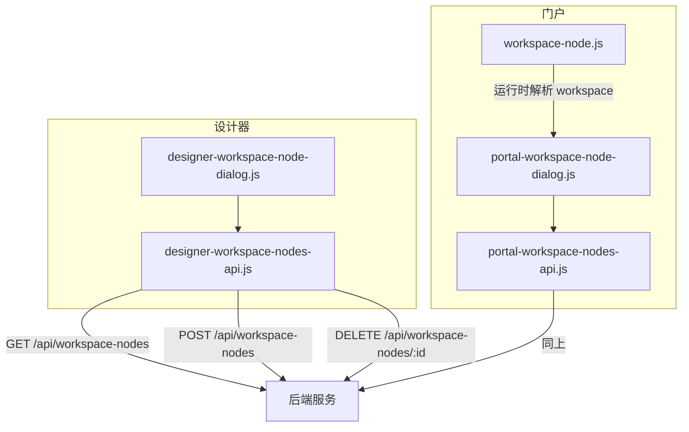
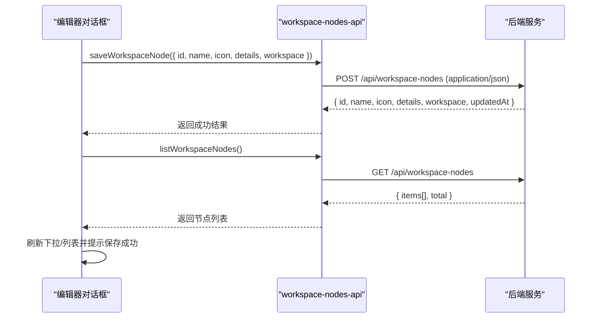
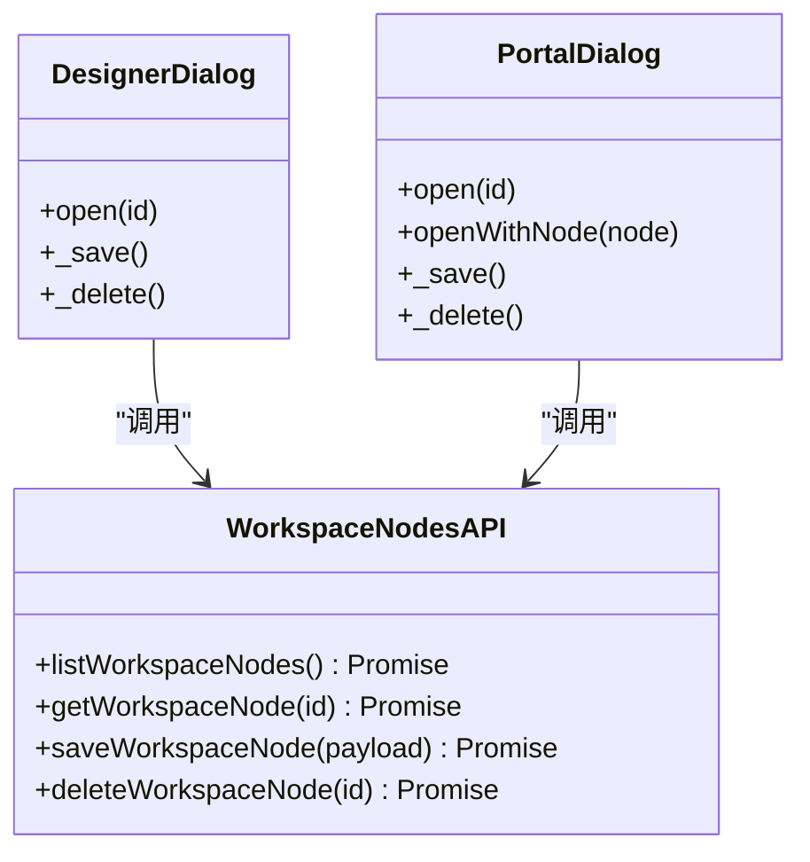
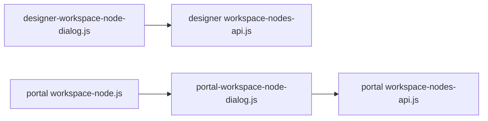

# 工作区节点 CRUD 操作

<cite>
**本文引用的文件**
- [CMXHTMLDesigner/src/api/workspace-nodes-api.js](file://CMXHTMLDesigner/src/api/workspace-nodes-api.js)
- [CMXPortalManager/src/api/workspace-nodes-api.js](file://CMXPortalManager/src/api/workspace-nodes-api.js)
- [CMXHTMLDesigner/src/components/designer-app/designer-workspace-node-dialog.js](file://CMXHTMLDesigner/src/components/designer-app/designer-workspace-node-dialog.js)
- [CMXPortalManager/src/components/portal-workspace-node-dialog.js](file://CMXPortalManager/src/components/portal-workspace-node-dialog.js)
- [CMXPortalManager/src/lib/workspace-node.js](file://CMXPortalManager/src/lib/workspace-node.js)
</cite>

## 目录
1. [简介](#简介)
2. [项目结构](#项目结构)
3. [核心组件](#核心组件)
4. [架构总览](#架构总览)
5. [详细组件分析](#详细组件分析)
6. [依赖关系分析](#依赖关系分析)
7. [性能考虑](#性能考虑)
8. [故障排查指南](#故障排查指南)
9. [结论](#结论)
10. [附录：完整调用示例与最佳实践](#附录完整调用示例与最佳实践)

## 简介
本文件面向前端开发者，系统化说明工作区节点的 CRUD 接口使用方法，包括 listWorkspaceNodes、getWorkspaceNode、saveWorkspaceNode、deleteWorkspaceNode。文档覆盖请求参数、响应格式、错误处理策略、数据结构约束以及前后端交互流程，并提供可直接参考的调用路径和最佳实践建议。

## 项目结构
工作区节点的前端能力由两个应用共享同一套 REST 契约（/api/workspace-nodes），分别位于：
- CMXHTMLDesigner：设计器侧 API 封装与可视化编辑对话框
- CMXPortalManager：门户侧 API 封装与可视化编辑对话框

图表来源
- [CMXHTMLDesigner/src/api/workspace-nodes-api.js:1-69](file://CMXHTMLDesigner/src/api/workspace-nodes-api.js#L1-L69)
- [CMXPortalManager/src/api/workspace-nodes-api.js:1-70](file://CMXPortalManager/src/api/workspace-nodes-api.js#L1-L70)
- [CMXHTMLDesigner/src/components/designer-app/designer-workspace-node-dialog.js:14-22](file://CMXHTMLDesigner/src/components/designer-app/designer-workspace-node-dialog.js#L14-L22)
- [CMXPortalManager/src/components/portal-workspace-node-dialog.js:16-25](file://CMXPortalManager/src/components/portal-workspace-node-dialog.js#L16-L25)
- [CMXPortalManager/src/lib/workspace-node.js:1-20](file://CMXPortalManager/src/lib/workspace-node.js#L1-L20)

章节来源
- [CMXHTMLDesigner/src/api/workspace-nodes-api.js:1-69](file://CMXHTMLDesigner/src/api/workspace-nodes-api.js#L1-L69)
- [CMXPortalManager/src/api/workspace-nodes-api.js:1-70](file://CMXPortalManager/src/api/workspace-nodes-api.js#L1-L70)

## 核心组件
- 统一 REST 基地址：/api/workspace-nodes
- 四个核心方法：
  - listWorkspaceNodes：列出所有工作区节点（分页元数据 items、total）
  - getWorkspaceNode(id)：获取单个节点详情（含 workspace 对象）
  - saveWorkspaceNode(payload)：创建或更新节点（POST）
  - deleteWorkspaceNode(id)：删除节点（DELETE）
- 错误处理：当 HTTP 非 ok 时，尝试读取响应体中的 error 字段作为错误消息；否则使用 statusText 或状态码拼接信息

章节来源
- [CMXHTMLDesigner/src/api/workspace-nodes-api.js:7-14](file://CMXHTMLDesigner/src/api/workspace-nodes-api.js#L7-L14)
- [CMXPortalManager/src/api/workspace-nodes-api.js:8-15](file://CMXPortalManager/src/api/workspace-nodes-api.js#L8-L15)

## 架构总览
以下序列图展示“保存工作区节点”的典型调用链：UI 组件收集模型 -> 调用 API -> 后端返回结果 -> UI 刷新列表并提示。

图表来源
- [CMXHTMLDesigner/src/components/designer-app/designer-workspace-node-dialog.js:981-1001](file://CMXHTMLDesigner/src/components/designer-app/designer-workspace-node-dialog.js#L981-L1001)
- [CMXHTMLDesigner/src/api/workspace-nodes-api.js:41-55](file://CMXHTMLDesigner/src/api/workspace-nodes-api.js#L41-L55)
- [CMXHTMLDesigner/src/api/workspace-nodes-api.js:19-23](file://CMXHTMLDesigner/src/api/workspace-nodes-api.js#L19-L23)

## 详细组件分析

### 接口定义与行为
- listWorkspaceNodes
  - 请求：GET /api/workspace-nodes，Accept: application/json
  - 响应：{ items: [{ id, name, icon, details, updatedAt }], total: number }
  - 用途：用于构建“载入已有节点”下拉列表、统计总数等
- getWorkspaceNode
  - 请求：GET /api/workspace-nodes/:id，Accept: application/json
  - 响应：{ id, name, icon, details, workspace, updatedAt }
  - 用途：打开编辑对话框时预加载已有节点
- saveWorkspaceNode
  - 请求：POST /api/workspace-nodes，Content-Type: application/json
  - 请求体：{ id, name?, icon?, details?, workspace }
  - 响应：{ id, name, icon, details, workspace, updatedAt }
  - 用途：新建或更新节点
- deleteWorkspaceNode
  - 请求：DELETE /api/workspace-nodes/:id，Accept: application/json
  - 响应：{ id, removed: boolean }
  - 用途：删除节点

章节来源
- [CMXHTMLDesigner/src/api/workspace-nodes-api.js:19-68](file://CMXHTMLDesigner/src/api/workspace-nodes-api.js#L19-L68)
- [CMXPortalManager/src/api/workspace-nodes-api.js:20-69](file://CMXPortalManager/src/api/workspace-nodes-api.js#L20-L69)

### 数据结构与约束
- 节点根对象
  - id：字符串，唯一标识；在编辑器中需满足字母数字及 ._-，长度 1-128
  - name：字符串，人类可读名称
  - icon：字符串，ui5-icon 名称，需符合命名规范（以字母开头，仅字母、数字、下划线、连字符）
  - details：字符串，说明备注
  - workspace：对象，描述区域与视图配置
- workspace 区域键
  - 设计器默认包含：content、explorer、property、bottom、prepare
  - 门户扩展包含：floatview、model、inner、embed（同时兼容 float 别名归一到 floatview）
- 区域对象
  - caption：可选，区域级标题
  - icon：可选，区域图标
  - views：数组，视图集合
  - width/height：可选，仅在 prepare 区域生效
- 视图 View
  - id：可选，业务标识
  - tabLabel：可选，底部 Tab 文案
  - type：必填，如 placeholder、html_pages、native_pages、html、iframe、link、json、code、markdown、split、menu-pages
  - icon：可选
  - html_page/native_page/view：按类型不同而存在
  - props/data：可选，JSON 对象，承载视图配置或内容

章节来源
- [CMXHTMLDesigner/src/components/designer-app/designer-workspace-node-dialog.js:24-48](file://CMXHTMLDesigner/src/components/designer-app/designer-workspace-node-dialog.js#L24-L48)
- [CMXHTMLDesigner/src/components/designer-app/designer-workspace-node-dialog.js:58-72](file://CMXHTMLDesigner/src/components/designer-app/designer-workspace-node-dialog.js#L58-L72)
- [CMXPortalManager/src/components/portal-workspace-node-dialog.js:28-55](file://CMXPortalManager/src/components/portal-workspace-node-dialog.js#L28-L55)
- [CMXPortalManager/src/components/portal-workspace-node-dialog.js:57-75](file://CMXPortalManager/src/components/portal-workspace-node-dialog.js#L57-L75)
- [CMXPortalManager/src/lib/workspace-node.js:25-53](file://CMXPortalManager/src/lib/workspace-node.js#L25-L53)

### 错误处理
- 网络层错误：当 fetch 响应非 ok 时，优先读取响应体中的 error 字段作为错误消息；若无法解析 JSON，则回退到 statusText 或状态码
- 客户端校验：
  - id 必须匹配安全正则（字母数字及 ._-，长度 1-128）
  - icon 必须匹配安全正则（字母开头，仅字母、数字、下划线、连字符）
  - html_pages 类型视图必须选择页面
- 异常传播：API 函数抛出 Error，调用方捕获后通过消息条提示用户

章节来源
- [CMXHTMLDesigner/src/api/workspace-nodes-api.js:7-14](file://CMXHTMLDesigner/src/api/workspace-nodes-api.js#L7-L14)
- [CMXPortalManager/src/api/workspace-nodes-api.js:8-15](file://CMXPortalManager/src/api/workspace-nodes-api.js#L8-L15)
- [CMXHTMLDesigner/src/components/designer-app/designer-workspace-node-dialog.js:973-1001](file://CMXHTMLDesigner/src/components/designer-app/designer-workspace-node-dialog.js#L973-L1001)
- [CMXPortalManager/src/components/portal-workspace-node-dialog.js:988-1014](file://CMXPortalManager/src/components/portal-workspace-node-dialog.js#L988-L1014)

### 典型调用流程（类图）

图表来源
- [CMXHTMLDesigner/src/api/workspace-nodes-api.js:19-68](file://CMXHTMLDesigner/src/api/workspace-nodes-api.js#L19-L68)
- [CMXHTMLDesigner/src/components/designer-app/designer-workspace-node-dialog.js:179-209](file://CMXHTMLDesigner/src/components/designer-app/designer-workspace-node-dialog.js#L179-L209)
- [CMXPortalManager/src/components/portal-workspace-node-dialog.js:219-252](file://CMXPortalManager/src/components/portal-workspace-node-dialog.js#L219-L252)

## 依赖关系分析
- 设计器与门户均依赖各自的 workspace-nodes-api.js 实现，二者语义一致，便于跨应用复用
- 对话框组件依赖 API 进行数据加载与持久化
- 门户运行时通过 workspace-node.js 对 workspace 进行快照与应用，确保 UI 正确渲染

图表来源
- [CMXHTMLDesigner/src/components/designer-app/designer-workspace-node-dialog.js:14-22](file://CMXHTMLDesigner/src/components/designer-app/designer-workspace-node-dialog.js#L14-L22)
- [CMXPortalManager/src/components/portal-workspace-node-dialog.js:16-25](file://CMXPortalManager/src/components/portal-workspace-node-dialog.js#L16-L25)
- [CMXPortalManager/src/lib/workspace-node.js:1-20](file://CMXPortalManager/src/lib/workspace-node.js#L1-L20)

章节来源
- [CMXHTMLDesigner/src/components/designer-app/designer-workspace-node-dialog.js:14-22](file://CMXHTMLDesigner/src/components/designer-app/designer-workspace-node-dialog.js#L14-L22)
- [CMXPortalManager/src/components/portal-workspace-node-dialog.js:16-25](file://CMXPortalManager/src/components/portal-workspace-node-dialog.js#L16-L25)
- [CMXPortalManager/src/lib/workspace-node.js:1-20](file://CMXPortalManager/src/lib/workspace-node.js#L1-L20)

## 性能考虑
- 列表加载：建议在对话框打开时按需加载节点列表，避免不必要的频繁刷新
- 序列化优化：保存前清理运行时字段（如预览相关字段），减少 payload 体积
- 缓存策略：可在上层对 listWorkspaceNodes 做短期缓存，减少重复请求
- 大对象传输：workspace 可能较大，注意压缩与分页展示（如需）

[本节为通用指导，不直接分析具体文件]

## 故障排查指南
- 常见错误
  - 未提供或非法 id：检查 id 是否符合安全正则与长度限制
  - 图标命名非法：确保 icon 符合 ui5-icon 命名规则
  - html_pages 未选择页面：在视图中必须选择 html_page
  - 网络错误：检查后端是否可访问、CORS、鉴权是否正确
- 定位步骤
  - 查看 API 抛出的错误消息（优先使用响应体 error 字段）
  - 检查请求体结构是否符合约定（id、name、icon、details、workspace）
  - 确认 workspace 区域与视图结构正确，必要时通过 JSON 源码模式格式化与校验

章节来源
- [CMXHTMLDesigner/src/components/designer-app/designer-workspace-node-dialog.js:973-1001](file://CMXHTMLDesigner/src/components/designer-app/designer-workspace-node-dialog.js#L973-L1001)
- [CMXPortalManager/src/components/portal-workspace-node-dialog.js:988-1014](file://CMXPortalManager/src/components/portal-workspace-node-dialog.js#L988-L1014)
- [CMXHTMLDesigner/src/api/workspace-nodes-api.js:7-14](file://CMXHTMLDesigner/src/api/workspace-nodes-api.js#L7-L14)
- [CMXPortalManager/src/api/workspace-nodes-api.js:8-15](file://CMXPortalManager/src/api/workspace-nodes-api.js#L8-L15)

## 结论
工作区节点 CRUD 在前端通过统一的 REST 契约暴露，设计器与门户各自封装了 API 与可视化编辑对话框。通过严格的输入校验、清晰的错误处理与合理的序列化策略，确保了数据的完整性与用户体验。建议在实际项目中遵循本文的数据结构与约束，结合对话框组件提供的校验与提示机制，快速完成工作区节点的创建、读取、更新与删除。

[本节为总结性内容，不直接分析具体文件]

## 附录：完整调用示例与最佳实践

### 基本用法（概念性示例）
- 列出节点
  - 调用：listWorkspaceNodes()
  - 预期响应：{ items: [...], total: number }
  - 用途：填充“载入已有节点”下拉框
- 获取节点
  - 调用：getWorkspaceNode(id)
  - 预期响应：{ id, name, icon, details, workspace, updatedAt }
  - 用途：打开编辑对话框时预加载
- 保存节点
  - 调用：saveWorkspaceNode({ id, name, icon, details, workspace })
  - 预期响应：{ id, name, icon, details, workspace, updatedAt }
  - 用途：新建或更新
- 删除节点
  - 调用：deleteWorkspaceNode(id)
  - 预期响应：{ id, removed: boolean }
  - 用途：删除指定节点

章节来源
- [CMXHTMLDesigner/src/api/workspace-nodes-api.js:19-68](file://CMXHTMLDesigner/src/api/workspace-nodes-api.js#L19-L68)
- [CMXPortalManager/src/api/workspace-nodes-api.js:20-69](file://CMXPortalManager/src/api/workspace-nodes-api.js#L20-L69)

### 数据结构要点
- 节点根字段
  - id：必填，唯一标识，安全正则校验
  - name：可选，人类可读名称
  - icon：可选，ui5-icon 名称，安全正则校验
  - details：可选，说明备注
  - workspace：必填，区域与视图配置对象
- workspace 区域
  - 设计器：content、explorer、property、bottom、prepare
  - 门户：增加 floatview、model、inner、embed（兼容 float 别名）
- 视图类型
  - 支持 placeholder、html_pages、native_pages、html、iframe、link、json、code、markdown、split、menu-pages
  - 特定类型需要额外字段（如 html_pages 的 html_page）

章节来源
- [CMXHTMLDesigner/src/components/designer-app/designer-workspace-node-dialog.js:24-48](file://CMXHTMLDesigner/src/components/designer-app/designer-workspace-node-dialog.js#L24-L48)
- [CMXPortalManager/src/components/portal-workspace-node-dialog.js:28-55](file://CMXPortalManager/src/components/portal-workspace-node-dialog.js#L28-L55)
- [CMXPortalManager/src/lib/workspace-node.js:25-53](file://CMXPortalManager/src/lib/workspace-node.js#L25-L53)

### 最佳实践
- 输入校验
  - 使用内置正则校验 id 与 icon
  - 对 html_pages 类型强制要求选择页面
- 序列化优化
  - 保存前移除运行时字段，减少 payload 大小
- 错误处理
  - 捕获 API 抛出的错误，并通过消息条提示用户
  - 在网络失败时给出友好提示
- 用户体验
  - 保存成功后刷新列表并自动关闭对话框
  - 提供 JSON 源码模式以便高级用户直接编辑

章节来源
- [CMXHTMLDesigner/src/components/designer-app/designer-workspace-node-dialog.js:973-1001](file://CMXHTMLDesigner/src/components/designer-app/designer-workspace-node-dialog.js#L973-L1001)
- [CMXPortalManager/src/components/portal-workspace-node-dialog.js:988-1014](file://CMXPortalManager/src/components/portal-workspace-node-dialog.js#L988-L1014)