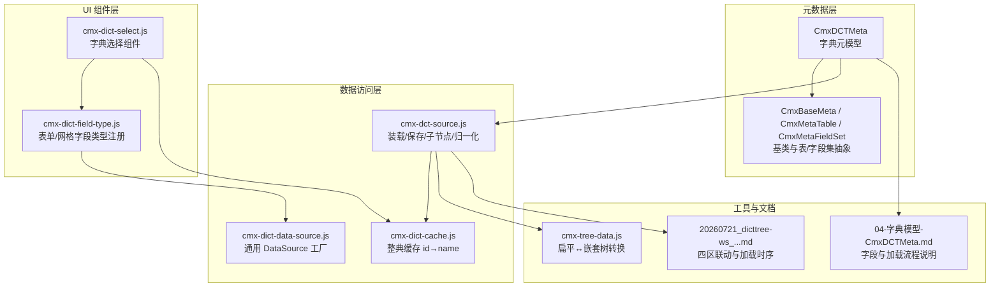
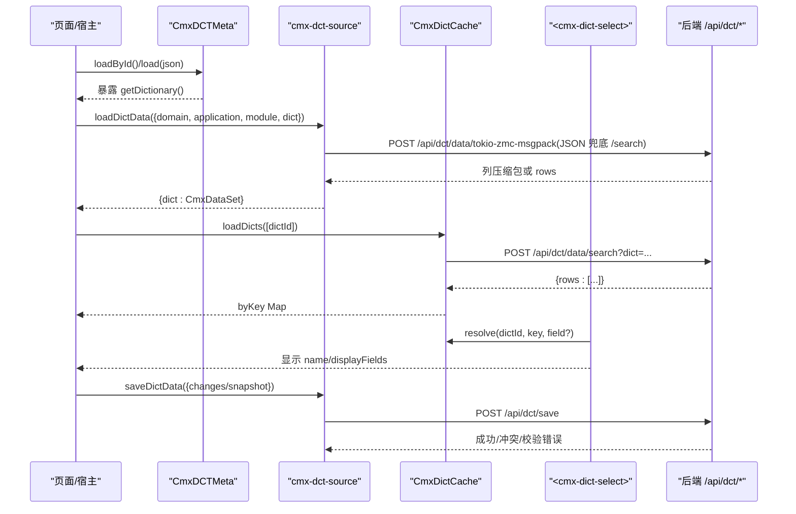
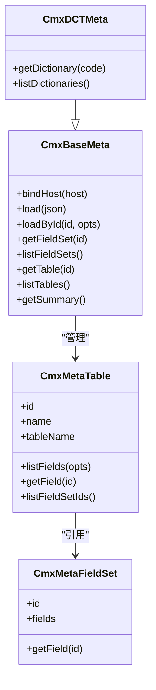
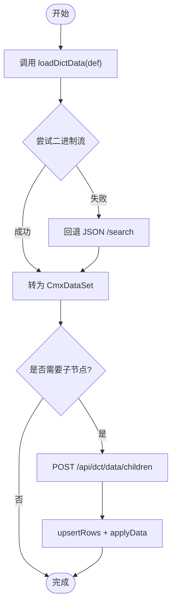
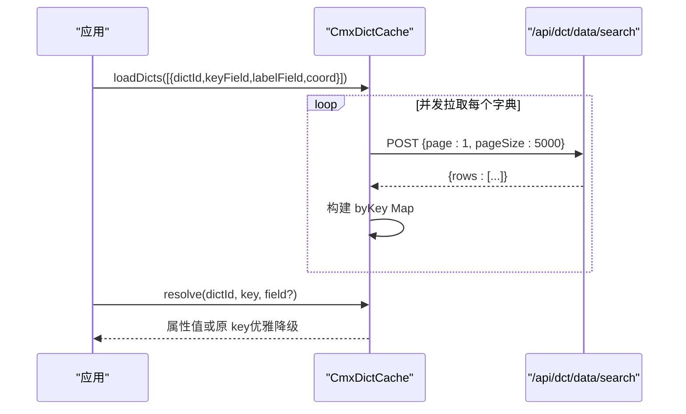
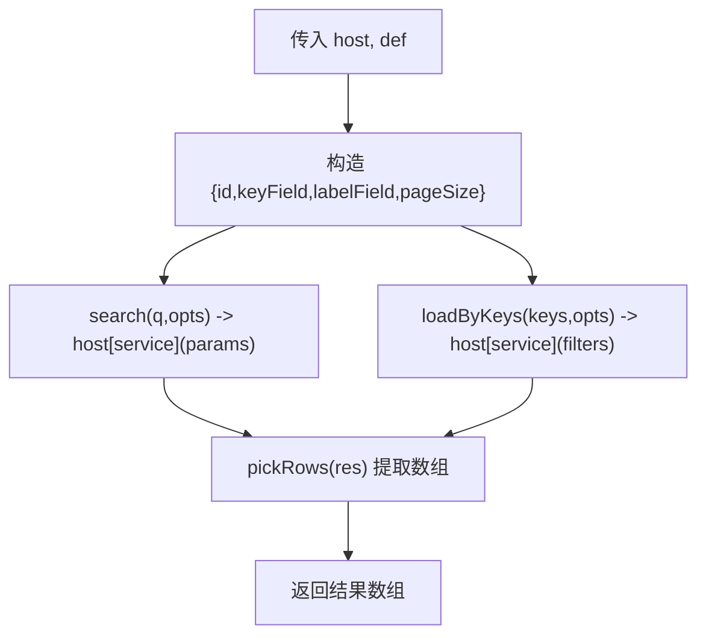
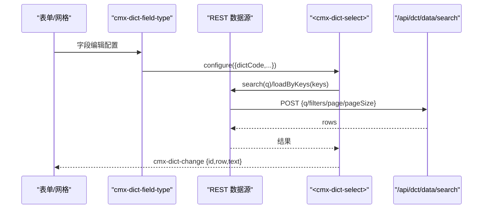
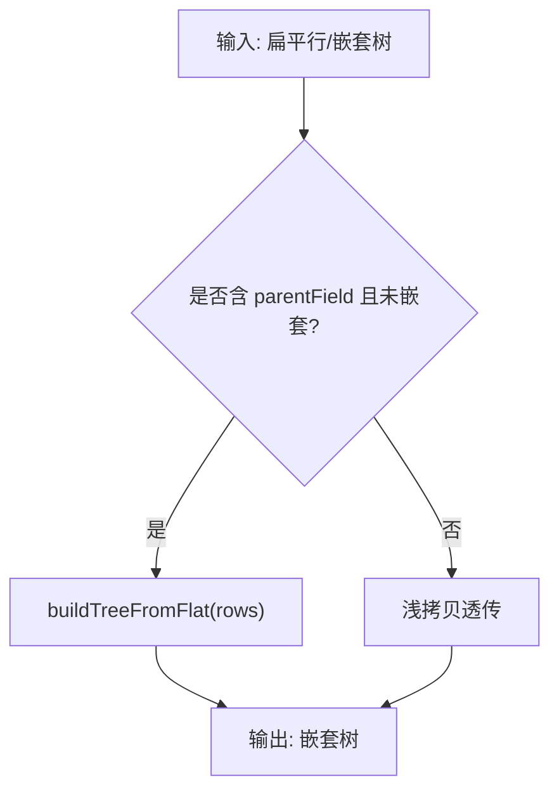
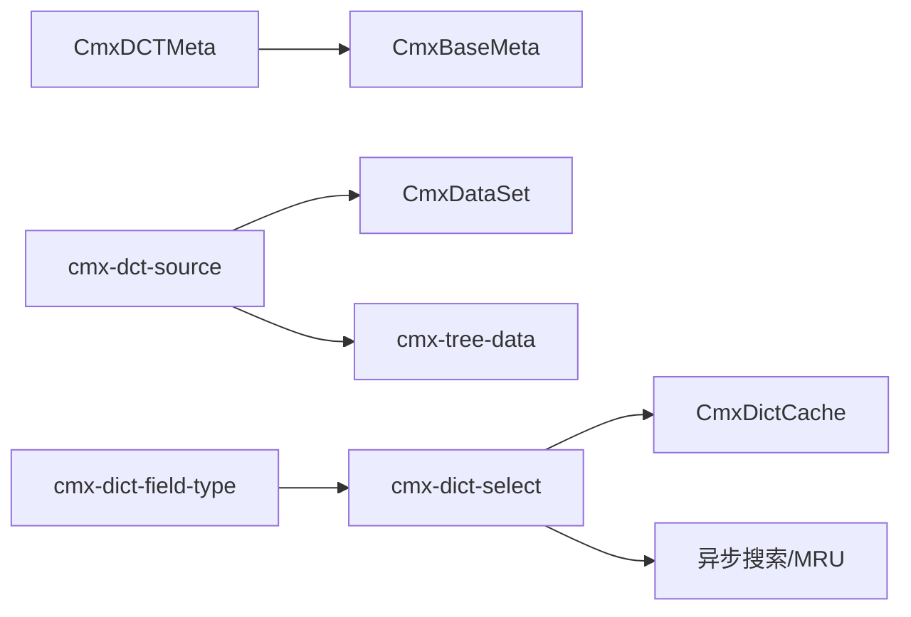

# DCT 字典模型 API

<cite>
**本文引用的文件**
- [cmx-dct-meta.js](file://packages/cmx-data-comp/src/lib/cmx-dct-meta.js)
- [cmx-meta-model.js](file://packages/cmx-data-comp/src/lib/cmx-meta-model.js)
- [04-字典模型-CmxDCTMeta.md](file://docs/CMXPortalManager+CMXHTMLDesigner-模型体系文档/04-字典模型-CmxDCTMeta.md)
- [cmx-dict-cache.js](file://packages/cmx-data-comp/src/lib/cmx-dict-cache.js)
- [cmx-dict-data-source.js](file://packages/cmx-data-comp/src/lib/cmx-dict-data-source.js)
- [cmx-dict-field-type.js](file://packages/cmx-data-comp/src/lib/cmx-dict-field-type.js)
- [cmx-dict-select.js](file://packages/cmx-data-comp/src/components/cmx-dict-select.js)
- [cmx-dct-source.js](file://packages/cmx-data-comp/src/lib/cmx-dct-source.js)
- [cmx-tree-data.js](file://packages/cmx-data-comp/src/lib/cmx-tree-data.js)
- [20260721_dicttree-ws_四区联动与字典加载逻辑.md](file://docs/20260721_dicttree-ws_四区联动与字典加载逻辑.md)
- [DCT数据字典存储与加载服务方案.html](file://docs/DCT数据字典存储与加载服务方案.html)
</cite>

## 目录
1. [简介](#简介)
2. [项目结构](#项目结构)
3. [核心组件](#核心组件)
4. [架构总览](#架构总览)
5. [详细组件分析](#详细组件分析)
6. [依赖关系分析](#依赖关系分析)
7. [性能考虑](#性能考虑)
8. [故障排查指南](#故障排查指南)
9. [结论](#结论)
10. [附录](#附录)

## 简介
本文件面向“DCT 字典模型”的端到端使用与实现，覆盖以下目标：
- 字典定义、字段配置、枚举值管理与层级结构的完整说明
- 字典项的 CRUD、批量导入导出、版本控制与缓存机制
- 字典树形结构的获取与解析方法
- 向后兼容性处理策略
- 字典驱动的下拉框、单选/多选等组件的数据源配置示例

## 项目结构
围绕 DCT 的核心代码分布在 cmx-data-comp 包中，配合设计器与文档说明形成“元数据—运行时—UI 组件—后端接口”的闭环。

图表来源
- [cmx-dct-meta.js:1-23](file://packages/cmx-data-comp/src/lib/cmx-dct-meta.js#L1-L23)
- [cmx-meta-model.js:10-18](file://packages/cmx-data-comp/src/lib/cmx-meta-model.js#L10-L18)
- [cmx-dct-source.js:1-32](file://packages/cmx-data-comp/src/lib/cmx-dct-source.js#L1-L32)
- [cmx-dict-cache.js:1-19](file://packages/cmx-data-comp/src/lib/cmx-dict-cache.js#L1-L19)
- [cmx-dict-data-source.js:1-14](file://packages/cmx-data-comp/src/lib/cmx-dict-data-source.js#L1-L14)
- [cmx-dict-select.js:1-56](file://packages/cmx-data-comp/src/components/cmx-dict-select.js#L1-L56)
- [cmx-dict-field-type.js:166-228](file://packages/cmx-data-comp/src/lib/cmx-dict-field-type.js#L166-L228)
- [cmx-tree-data.js:1-19](file://packages/cmx-data-comp/src/lib/cmx-tree-data.js#L1-L19)
- [04-字典模型-CmxDCTMeta.md:75-97](file://docs/CMXPortalManager+CMXHTMLDesigner-模型体系文档/04-字典模型-CmxDCTMeta.md#L75-L97)
- [20260721_dicttree-ws_四区联动与字典加载逻辑.md:272-318](file://docs/20260721_dicttree-ws_四区联动与字典加载逻辑.md#L272-L318)

章节来源
- [cmx-dct-meta.js:1-23](file://packages/cmx-data-comp/src/lib/cmx-dct-meta.js#L1-L23)
- [04-字典模型-CmxDCTMeta.md:75-97](file://docs/CMXPortalManager+CMXHTMLDesigner-模型体系文档/04-字典模型-CmxDCTMeta.md#L75-L97)

## 核心组件
- CmxDCTMeta：字典元数据模型，负责加载并暴露 dictionaryTables，提供 getDictionary/listDictionaries 等语义化 API。
- CmxBaseMeta/CmxMetaTable/CmxMetaFieldSet：基类与表/字段集抽象，支持字段集合并、字段引用、路径读取与摘要统计。
- cmx-dct-source：字典数据装载（主用二进制 msgpack，JSON 兜底）、子节点懒加载、保存（merge/replace）、行归一化与变更清洗。
- cmx-dict-cache：整典缓存，按 dictId 构建 key→entry Map，提供 O(1) 解析 id→name/displayFields。
- cmx-dict-data-source：通用 DataSource 工厂，统一 search/loadByKeys 协议，适配不同 host/service。
- cmx-dict-field-type：将字段 editSettings 转换为 <cmx-dict-select> 的配置，并创建 REST 数据源直连 /api/dct/data/search。
- cmx-dict-select：字典选择组件，支持 MRU、搜索、help 对话框、分级 treegrid、事件派发与本地持久化。
- cmx-tree-data：扁平↔嵌套树转换工具，防环、兼容 CmxRowSet，供 treegrid/treeview 消费。

章节来源
- [cmx-dct-meta.js:1-23](file://packages/cmx-data-comp/src/lib/cmx-dct-meta.js#L1-L23)
- [cmx-meta-model.js:98-157](file://packages/cmx-data-comp/src/lib/cmx-meta-model.js#L98-L157)
- [cmx-dct-source.js:1-32](file://packages/cmx-data-comp/src/lib/cmx-dct-source.js#L1-L32)
- [cmx-dict-cache.js:22-40](file://packages/cmx-data-comp/src/lib/cmx-dict-cache.js#L22-L40)
- [cmx-dict-data-source.js:52-123](file://packages/cmx-data-comp/src/lib/cmx-dict-data-source.js#L52-L123)
- [cmx-dict-field-type.js:166-228](file://packages/cmx-data-comp/src/lib/cmx-dict-field-type.js#L166-L228)
- [cmx-dict-select.js:83-159](file://packages/cmx-data-comp/src/components/cmx-dict-select.js#L83-L159)
- [cmx-tree-data.js:21-83](file://packages/cmx-data-comp/src/lib/cmx-tree-data.js#L21-L83)

## 架构总览
下图展示从页面到后端接口的关键调用链：元数据加载 → 字典数据装载 → UI 渲染与缓存 → 保存回写。

图表来源
- [cmx-dct-meta.js:13-18](file://packages/cmx-data-comp/src/lib/cmx-dct-meta.js#L13-L18)
- [cmx-dct-source.js:24-32](file://packages/cmx-data-comp/src/lib/cmx-dct-source.js#L24-L32)
- [cmx-dict-cache.js:49-103](file://packages/cmx-data-comp/src/lib/cmx-dict-cache.js#L49-L103)
- [cmx-dict-field-type.js:166-228](file://packages/cmx-data-comp/src/lib/cmx-dict-field-type.js#L166-L228)
- [20260721_dicttree-ws_四区联动与字典加载逻辑.md:272-318](file://docs/20260721_dicttree-ws_四区联动与字典加载逻辑.md#L272-L318)

## 详细组件分析

### 字典元模型：CmxDCTMeta
- 职责：加载字典元数据 JSON，按 dictionaryTables 暴露 getDictionary/listDictionaries；继承基类的字段集合并、字段引用、路径读取与摘要能力。
- 关键字段：moduleMeta、baseDctMetaRef、dictionaryTableConventions、dictionaryTables[]、updatedAt。
- 字段集：通过 baseDctMetaRef 引用共享字段集（如审计、生效期、停用、系统预置等），每张表可内联 fields。
- 加载优先级：resolver > serviceFn > baseResolver > 内置 fetch。

图表来源
- [cmx-dct-meta.js:3-22](file://packages/cmx-data-comp/src/lib/cmx-dct-meta.js#L3-L22)
- [cmx-meta-model.js:98-157](file://packages/cmx-data-comp/src/lib/cmx-meta-model.js#L98-L157)
- [04-字典模型-CmxDCTMeta.md:277-320](file://docs/CMXPortalManager+CMXHTMLDesigner-模型体系文档/04-字典模型-CmxDCTMeta.md#L277-L320)

章节来源
- [cmx-dct-meta.js:1-23](file://packages/cmx-data-comp/src/lib/cmx-dct-meta.js#L1-L23)
- [04-字典模型-CmxDCTMeta.md:75-233](file://docs/CMXPortalManager+CMXHTMLDesigner-模型体系文档/04-字典模型-CmxDCTMeta.md#L75-L233)

### 字典数据装载与保存：cmx-dct-source
- 装载：优先走二进制流 /api/dct/data/tokio-zmc-msgpack，失败回退 JSON /api/dct/data/search；返回 {dict: CmxDataSet}。
- 子节点：按 parentId 拉取直接下级，用于自分级字典懒下钻。
- 保存：POST /api/dct/save，支持 merge/replace；自动过滤 UI-only 字段与只读字段。
- 行归一化：normalizeDictRow 为 selfHierarchy 字典派生 hasChildren/full_path/level_no 等 UI 字段；sanitizeChangeSet 在保存时剔除这些字段。

图表来源
- [cmx-dct-source.js:24-32](file://packages/cmx-data-comp/src/lib/cmx-dct-source.js#L24-L32)
- [20260721_dicttree-ws_四区联动与字典加载逻辑.md:272-318](file://docs/20260721_dicttree-ws_四区联动与字典加载逻辑.md#L272-L318)

章节来源
- [cmx-dct-source.js:1-32](file://packages/cmx-data-comp/src/lib/cmx-dct-source.js#L1-L32)
- [20260721_dicttree-ws_四区联动与字典加载逻辑.md:272-318](file://docs/20260721_dicttree-ws_四区联动与字典加载逻辑.md#L272-L318)

### 整典缓存：CmxDictCache
- 作用：收集单据引用的 refDict，并发拉取全量条目，建立 dictId → Map<key, entry> 缓存，渲染时 O(1) 解析 id→name/displayFields。
- 接口：loadDicts(host, dicts, opts)、resolve(dictId, key, field)、resolveMany、entry、invalidate、clear。
- 兼容：支持多种响应形态（rows 数组、{rows,total}、裸数组）；失败不写缓存以便重试。

图表来源
- [cmx-dict-cache.js:22-40](file://packages/cmx-data-comp/src/lib/cmx-dict-cache.js#L22-L40)
- [cmx-dict-cache.js:49-103](file://packages/cmx-data-comp/src/lib/cmx-dict-cache.js#L49-L103)
- [cmx-dict-cache.js:105-147](file://packages/cmx-data-comp/src/lib/cmx-dict-cache.js#L105-L147)

章节来源
- [cmx-dict-cache.js:1-192](file://packages/cmx-data-comp/src/lib/cmx-dict-cache.js#L1-L192)

### 字典数据源工厂：createDictDataSource / createLocalDictDataSource
- createDictDataSource：封装 host[service] 调用，统一 search/loadByKeys 协议，支持 extraParams/responsePath/transform。
- createLocalDictDataSource：将本地 options 转成同一协议，适合 FlexibleCombination 动态列枚举。

图表来源
- [cmx-dict-data-source.js:52-123](file://packages/cmx-data-comp/src/lib/cmx-dict-data-source.js#L52-L123)
- [cmx-dict-data-source.js:125-155](file://packages/cmx-data-comp/src/lib/cmx-dict-data-source.js#L125-L155)

章节来源
- [cmx-dict-data-source.js:1-155](file://packages/cmx-data-comp/src/lib/cmx-dict-data-source.js#L1-L155)

### 字段类型与下拉组件：cmx-dict-field-type.js 与 cmx-dict-select.js
- cmx-dict-field-type：
  - 将字段 editSettings 转换为 <cmx-dict-select>.configure 配置
  - 创建 REST 数据源直连 /api/dct/data/search，携带 domain/application/module/dict 坐标
  - 支持 displayMode（value/code/label/code-label/auto/field）与 writeBack 映射
- cmx-dict-select：
  - 支持 MRU（本地 localStorage + 后端个性化）、边输边搜、help 对话框（classify/group/grid）
  - 支持 hierarchical=true 的 treegrid 模式
  - 事件：cmx-dict-change、cmx-dict-open、cmx-dict-help

图表来源
- [cmx-dict-field-type.js:166-228](file://packages/cmx-data-comp/src/lib/cmx-dict-field-type.js#L166-L228)
- [cmx-dict-select.js:83-159](file://packages/cmx-data-comp/src/components/cmx-dict-select.js#L83-L159)
- [cmx-dict-select.js:485-538](file://packages/cmx-data-comp/src/components/cmx-dict-select.js#L485-L538)

章节来源
- [cmx-dict-field-type.js:166-359](file://packages/cmx-data-comp/src/lib/cmx-dict-field-type.js#L166-L359)
- [cmx-dict-select.js:1-800](file://packages/cmx-data-comp/src/components/cmx-dict-select.js#L1-L800)

### 树形结构与解析：cmx-tree-data.js
- buildTreeFromFlat：将带 parentField 的扁平行重建为嵌套树，防环、兼容 CmxRowSet
- normalizeTreeData：智能识别输入形态，输出 Tabulator 可消费的嵌套数组
- flattenTree/walkTree/collectIds：树与扁平互转、遍历与 ID 收集

图表来源
- [cmx-tree-data.js:21-83](file://packages/cmx-data-comp/src/lib/cmx-tree-data.js#L21-L83)
- [cmx-tree-data.js:85-106](file://packages/cmx-data-comp/src/lib/cmx-tree-data.js#L85-L106)

章节来源
- [cmx-tree-data.js:1-159](file://packages/cmx-data-comp/src/lib/cmx-tree-data.js#L1-L159)

## 依赖关系分析
- CmxDCTMeta 依赖 CmxBaseMeta 提供的字段集合并与表/字段访问能力
- cmx-dct-source 依赖 CmxDataSet、消息包解码、坐标规范化与错误读取
- cmx-dict-field-type 依赖 cmx-dict-select 与 REST 数据源协议
- cmx-dict-select 依赖 CmxDataSet、异步搜索、MRU 个性化服务
- cmx-dict-cache 依赖 /api/dct/data/search 与 fetch 封装
- 树形工具 cmx-tree-data 被 treegrid/treeview 消费，解耦于 DOM

图表来源
- [cmx-dct-meta.js:1-23](file://packages/cmx-data-comp/src/lib/cmx-dct-meta.js#L1-L23)
- [cmx-dct-source.js:1-32](file://packages/cmx-data-comp/src/lib/cmx-dct-source.js#L1-L32)
- [cmx-dict-field-type.js:166-228](file://packages/cmx-data-comp/src/lib/cmx-dict-field-type.js#L166-L228)
- [cmx-dict-select.js:65-79](file://packages/cmx-data-comp/src/components/cmx-dict-select.js#L65-L79)
- [cmx-dict-cache.js:1-19](file://packages/cmx-data-comp/src/lib/cmx-dict-cache.js#L1-L19)
- [cmx-tree-data.js:1-19](file://packages/cmx-data-comp/src/lib/cmx-tree-data.js#L1-L19)

章节来源
- [cmx-dct-meta.js:1-23](file://packages/cmx-data-comp/src/lib/cmx-dct-meta.js#L1-L23)
- [cmx-dct-source.js:1-32](file://packages/cmx-data-comp/src/lib/cmx-dct-source.js#L1-L32)
- [cmx-dict-field-type.js:166-228](file://packages/cmx-data-comp/src/lib/cmx-dict-field-type.js#L166-L228)
- [cmx-dict-select.js:65-79](file://packages/cmx-data-comp/src/components/cmx-dict-select.js#L65-L79)
- [cmx-dict-cache.js:1-19](file://packages/cmx-data-comp/src/lib/cmx-dict-cache.js#L1-L19)
- [cmx-tree-data.js:1-19](file://packages/cmx-data-comp/src/lib/cmx-tree-data.js#L1-L19)

## 性能考虑
- 装载优先二进制流：减少序列化开销，提升大字典加载速度；JSON 作为兜底保证兼容性
- 整典缓存：按 dictId 构建 byKey Map，避免重复请求与 JOIN，O(1) 解析 id→name/displayFields
- 分页与上限：整典缓存默认 pageSize=5000，受后端 clamp 限制；大数据集建议分批或按需加载
- 树形构建：本地 buildTreeFromFlat 避免后端预嵌套，降低网络与计算复杂度
- 保存最小变更：sanitizeChangeSet 剔除 UI-only 与只读字段，减少无效传输

章节来源
- [cmx-dct-source.js:24-32](file://packages/cmx-data-comp/src/lib/cmx-dct-source.js#L24-L32)
- [cmx-dict-cache.js:18-20](file://packages/cmx-data-comp/src/lib/cmx-dict-cache.js#L18-L20)
- [cmx-tree-data.js:21-83](file://packages/cmx-data-comp/src/lib/cmx-tree-data.js#L21-L83)

## 故障排查指南
- 字典装载失败：检查 HTTP 状态码与响应体结构；CmxDictCache 对非 2xx 或结构异常不写缓存，便于重试
- 保存冲突：saveDictData 在 409 时抛出 conflict 标记的错误，需提示用户刷新或合并
- 校验错误：服务端返回验证信息时，包装为校验错误抛出，便于前端定位字段
- 树形环检测：buildTreeFromFlat 自动丢弃回边，兜底挂为根，避免栈溢出
- 字段集缺失：确保 baseDctMetaRef.fieldSets 包含所需字段集名，否则 listFieldSets 为空

章节来源
- [cmx-dict-cache.js:84-101](file://packages/cmx-data-comp/src/lib/cmx-dict-cache.js#L84-L101)
- [cmx-dct-source.js:165-194](file://packages/cmx-data-comp/src/lib/cmx-dct-source.js#L165-L194)
- [cmx-tree-data.js:63-81](file://packages/cmx-data-comp/src/lib/cmx-tree-data.js#L63-L81)
- [04-字典模型-CmxDCTMeta.md:225-233](file://docs/CMXPortalManager+CMXHTMLDesigner-模型体系文档/04-字典模型-CmxDCTMeta.md#L225-L233)

## 结论
DCT 字典模型以 CmxDCTMeta 为核心，结合 cmx-dct-source、CmxDictCache、cmx-dict-field-type 与 cmx-dict-select，形成了“元数据—数据—缓存—UI”的完整链路。通过二进制装载、整典缓存、树形本地构建与最小变更保存，兼顾了性能与可维护性。同时，字段集复用与向后兼容策略保障了历史数据的平滑迁移。

## 附录

### 字典定义与字段配置要点
- 顶层键：moduleMeta、baseDctMetaRef、dictionaryTableConventions、dictionaryTables[]、updatedAt
- 每张字典表：dictMeta（dictCode/dictName/dictKind/selfHierarchy/tableName/idField/codeField/labelField/parentField 等）、fields[]（16 种属性键）、字段集引用（base/hierarchy/audit/effective/disable/system/scope）
- codeRule 与 uniqueKeys：编码规则与唯一约束

章节来源
- [04-字典模型-CmxDCTMeta.md:75-233](file://docs/CMXPortalManager+CMXHTMLDesigner-模型体系文档/04-字典模型-CmxDCTMeta.md#L75-L233)

### 字典项 CRUD、批量导入导出、版本控制
- 装载：loadDictData 支持二进制与 JSON 两种模式
- 子节点：loadDictChildren 按 parentId 拉取直接下级
- 保存：saveDictData 支持 merge/replace，自动过滤 UI-only 与只读字段
- 删除/批量更新：deleteDictEntry / upsertDictEntries（见 cmx-dct-source 端点定义）
- 版本控制：后端方案提及版本台账（可选）与种子数据；前端通过 meta 的 version 与 updatedAt 感知变化

章节来源
- [cmx-dct-source.js:24-32](file://packages/cmx-data-comp/src/lib/cmx-dct-source.js#L24-L32)
- [DCT数据字典存储与加载服务方案.html:340-353](file://docs/DCT数据字典存储与加载服务方案.html#L340-L353)

### 字典驱动组件数据源配置示例
- 下拉框（<cmx-dict-select>）：
  - 配置 dictCode、idCol、labelCol、codeCol、parentCol、hierarchical、helpLayout、columns、dataSource
  - 数据源：createRestDictDataSource 直连 /api/dct/data/search，携带 domain/application/module/dict 坐标
- 单选/多选（基于 DataSource 协议）：
  - 使用 createDictDataSource(host, def) 封装 host[service]，统一 search/loadByKeys
  - 或使用 createLocalDictDataSource(options, def) 将本地选项转为 DataSource

章节来源
- [cmx-dict-select.js:83-159](file://packages/cmx-data-comp/src/components/cmx-dict-select.js#L83-L159)
- [cmx-dict-field-type.js:166-228](file://packages/cmx-data-comp/src/lib/cmx-dict-field-type.js#L166-L228)
- [cmx-dict-data-source.js:52-155](file://packages/cmx-data-comp/src/lib/cmx-dict-data-source.js#L52-L155)

### 向后兼容性处理
- 旧 /api/dict/* JSON 文件服务已下线，新接口统一为 /api/dct/data/search
- 字段键兼容：editSettings.dictCode/source/refDict 均可收敛为 dictCode
- 显示模式兼容：displayMode 支持 value/code/label/code-label/auto/field，回退到 _label 或 resolve
- 写入键兼容：applyDictRowToHost 清理旧键（如 customer.C001.code），仅保留规范命名空间键

章节来源
- [cmx-dict-field-type.js:166-228](file://packages/cmx-data-comp/src/lib/cmx-dict-field-type.js#L166-L228)
- [cmx-dict-field-type.js:230-337](file://packages/cmx-data-comp/src/lib/cmx-dict-field-type.js#L230-L337)