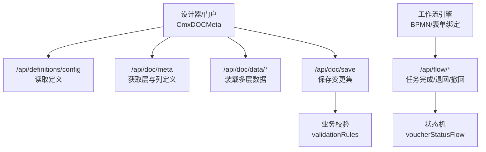
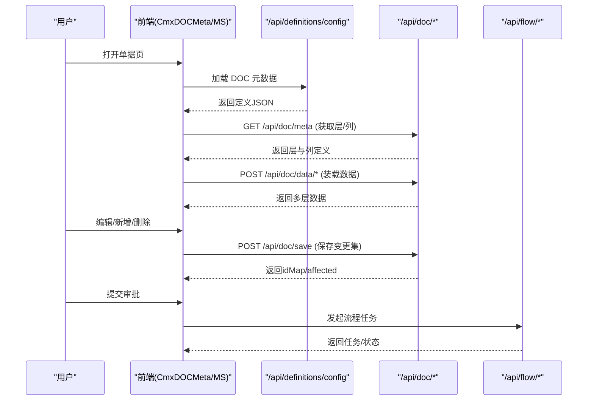
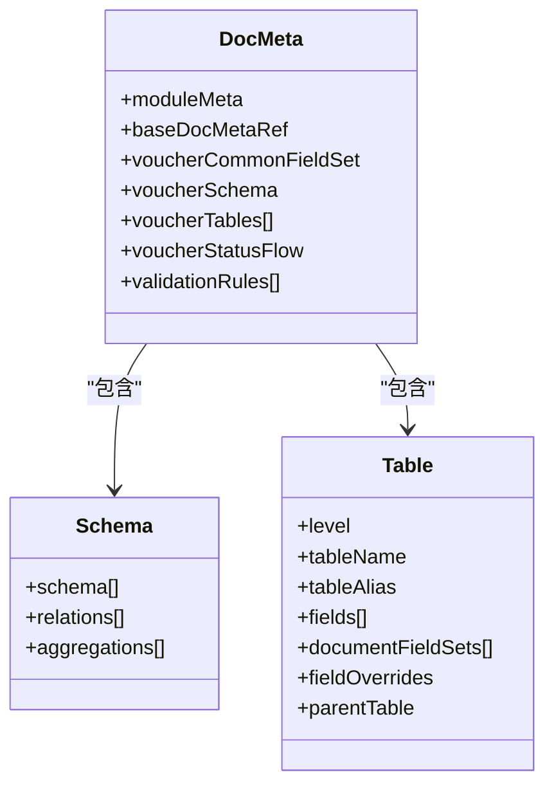
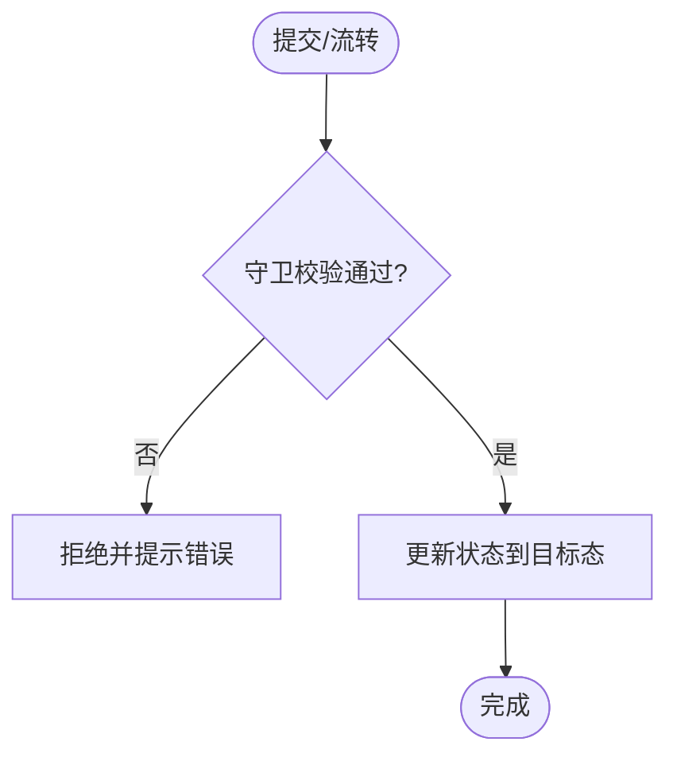
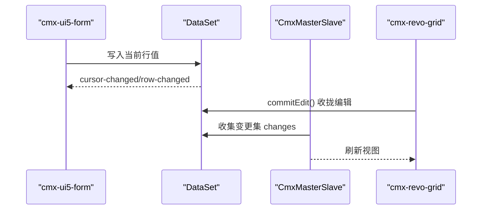
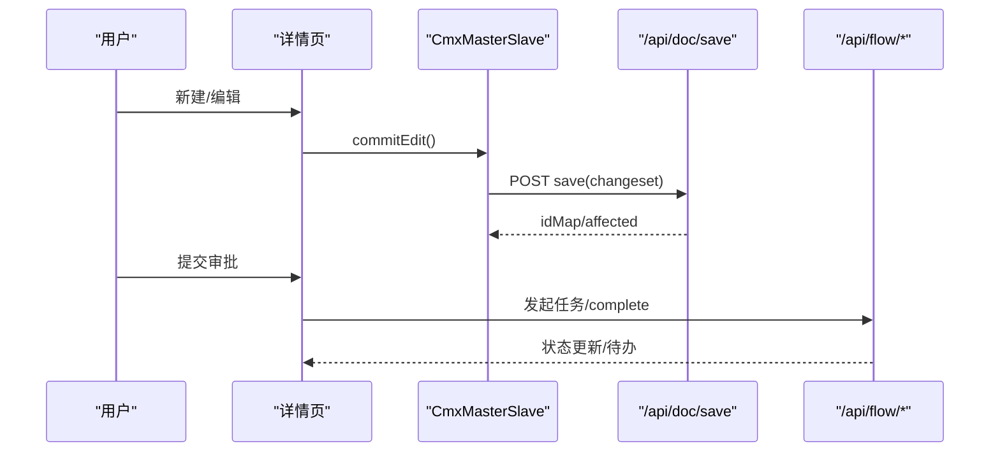
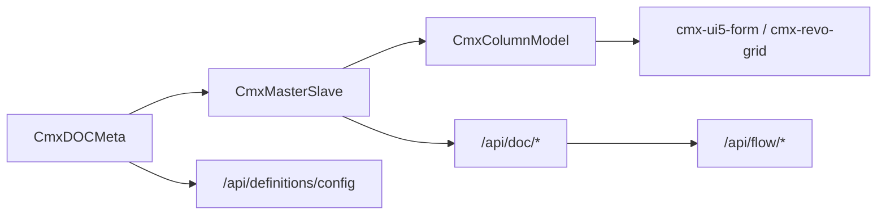

# DOC 业务单据模型 API

<cite>
**本文引用的文件**
- [05-单据模型-CmxDOCMeta.md](file://docs/CMXPortalManager+CMXHTMLDesigner-模型体系文档/05-单据模型-CmxDOCMeta.md)
- [16-后端API详解.md](file://docs/CMXPortalManager+CMXHTMLDesigner-模型体系文档/16-后端API详解.md)
- [SKILL.md（doc-crud-pages）](file://.agents/skills/doc-crud-pages/SKILL.md)
- [new-mode-and-save.md](file://.agents/skills/doc-crud-pages/references/new-mode-and-save.md)
- [三元定义体系架构文档.md](file://docs/三元定义体系架构文档.md)
- [20260819_cmx-flowengine_表单注册表维护页面方案.md](file://documents/20260819_cmx-flowengine_表单注册表维护页面方案.md)
- [20260817_cmx-mdm_主数据CR审批对接流程平台方案.md](file://documents/MDM主数据管理平台/20260817_cmx-mdm_主数据CR审批对接流程平台方案.md)
- [20260818_cmx-mdm_审批动作业务封装与详情页流程操作方案.md](file://documents/MDM主数据管理平台/20260818_cmx-mdm_审批动作业务封装与详情页流程操作方案.md)
</cite>

## 目录
1. [简介](#简介)
2. [项目结构](#项目结构)
3. [核心组件](#核心组件)
4. [架构总览](#架构总览)
5. [详细组件分析](#详细组件分析)
6. [依赖关系分析](#依赖关系分析)
7. [性能考虑](#性能考虑)
8. [故障排查指南](#故障排查指南)
9. [结论](#结论)
10. [附录](#附录)

## 简介
本文件面向“DOC 业务单据模型”的完整生命周期管理，覆盖：
- 业务单据的定义、表单结构与字段验证规则
- 业务流程配置（状态机、守卫条件、流转动作）
- 创建、编辑、提交、审批、归档的全链路说明
- 单据模板管理、动态表单生成、数据绑定与事件处理机制
- 复杂业务场景的配置示例与最佳实践

目标读者包括：前端页面开发者、后端接口使用者、流程与元数据管理员。

## 项目结构
围绕 DOC 的核心由“元数据 + 运行时模型 + 后端 API + 工作流”四部分组成：
- 元数据：CmxDOCMeta JSON 描述单据层级、表结构、关系、聚合、状态机与校验规则
- 运行时模型：CmxDOCMeta/CmxMasterSlave/CmxColumnModel 等在前端组装表单与表格
- 后端 API：/api/definitions/*、/api/doc/* 提供定义加载、数据装载与保存
- 工作流：BPMN 流程与表单绑定，驱动审批与归档

图表来源
- [16-后端API详解.md:128-160](file://docs/CMXPortalManager+CMXHTMLDesigner-模型体系文档/16-后端API详解.md#L128-L160)
- [16-后端API详解.md:380-467](file://docs/CMXPortalManager+CMXHTMLDesigner-模型体系文档/16-后端API详解.md#L380-L467)
- [20260819_cmx-flowengine_表单注册表维护页面方案.md:109-140](file://documents/20260819_cmx-flowengine_表单注册表维护页面方案.md#L109-L140)

章节来源
- [16-后端API详解.md:1-100](file://docs/CMXPortalManager+CMXHTMLDesigner-模型体系文档/16-后端API详解.md#L1-L100)
- [05-单据模型-CmxDOCMeta.md:60-131](file://docs/CMXPortalManager+CMXHTMLDesigner-模型体系文档/05-单据模型-CmxDOCMeta.md#L60-L131)

## 核心组件
- CmxDOCMeta：承载 DOC 元数据（层级 schema、relations、aggregations、statusFlow、validationRules），并提供 getDocument/listDocuments 等语义化访问
- CmxMasterSlave：协调多层主从数据装载与渲染，支持分页、懒下钻、父子关系联动
- CmxColumnModel：基于元数据自动生成列定义，支持引用模式与手写列合并
- 后端 API：/api/definitions/* 管理定义；/api/doc/* 负责数据装载与保存；/api/flow/* 负责流程任务
- 表单与事件：cmx-ui5-form 动态渲染字段；revo-grid 行选择、单元格编辑事件驱动数据收集

章节来源
- [05-单据模型-CmxDOCMeta.md:25-57](file://docs/CMXPortalManager+CMXHTMLDesigner-模型体系文档/05-单据模型-CmxDOCMeta.md#L25-L57)
- [SKILL.md:79-169](file://.agents/skills/doc-crud-pages/SKILL.md#L79-L169)
- [packages/cmx-data-comp/src/components/cmx-ui5-form.js:124-137](file://packages/cmx-data-comp/src/components/cmx-ui5-form.js#L124-L137)

## 架构总览
DOC 端到端流程：
- 设计期：通过 /api/definitions/config 加载 DOC 元数据 JSON，构建 CmxDOCMeta
- 运行期：通过 /api/doc/meta 获取层与列定义，使用 CmxMasterSlave 装载多层数据
- 交互期：用户编辑表单/表格，触发事件收集变更；保存时调用 /api/doc/save
- 流程期：提交后进入工作流，状态机依据 voucherStatusFlow 与 validationRules 守卫进行流转

图表来源
- [16-后端API详解.md:128-160](file://docs/CMXPortalManager+CMXHTMLDesigner-模型体系文档/16-后端API详解.md#L128-L160)
- [16-后端API详解.md:380-467](file://docs/CMXPortalManager+CMXHTMLDesigner-模型体系文档/16-后端API详解.md#L380-L467)
- [20260819_cmx-flowengine_表单注册表维护页面方案.md:109-140](file://documents/20260819_cmx-flowengine_表单注册表维护页面方案.md#L109-L140)

## 详细组件分析

### 单据定义与表单结构
- 顶层键：moduleMeta、baseDocMetaRef、voucherCommonFieldSet、voucherSchema、voucherTables、voucherStatusFlow、updatedAt、validationRules
- moduleMeta：含 organizationDict/keyDicts/documentTypeDict/versioning 等 DOC 专属字段
- baseDocMetaRef：引用基础字段集（如 documentIdentityFields、documentTechnicalFields 等）
- voucherSchema：schema（层级树）、relations（主外键）、aggregations（聚合上卷）
- voucherTables：每张表的 level、tableName、tableAlias、fields、documentFieldSets、fieldOverrides、parentTable
- 字段属性：与 DCT 一致，DOC 额外支持 editSettings、agg

图表来源
- [05-单据模型-CmxDOCMeta.md:60-131](file://docs/CMXPortalManager+CMXHTMLDesigner-模型体系文档/05-单据模型-CmxDOCMeta.md#L60-L131)
- [05-单据模型-CmxDOCMeta.md:129-189](file://docs/CMXPortalManager+CMXHTMLDesigner-模型体系文档/05-单据模型-CmxDOCMeta.md#L129-L189)
- [05-单据模型-CmxDOCMeta.md:191-273](file://docs/CMXPortalManager+CMXHTMLDesigner-模型体系文档/05-单据模型-CmxDOCMeta.md#L191-L273)

章节来源
- [05-单据模型-CmxDOCMeta.md:60-131](file://docs/CMXPortalManager+CMXHTMLDesigner-模型体系文档/05-单据模型-CmxDOCMeta.md#L60-L131)
- [05-单据模型-CmxDOCMeta.md:129-189](file://docs/CMXPortalManager+CMXHTMLDesigner-模型体系文档/05-单据模型-CmxDOCMeta.md#L129-L189)
- [05-单据模型-CmxDOCMeta.md:191-273](file://docs/CMXPortalManager+CMXHTMLDesigner-模型体系文档/05-单据模型-CmxDOCMeta.md#L191-L273)

### 字段验证规则与状态机
- validationRules：跨表校验规则，包含 code/name/level/expr/message，被状态流转 guard 引用
- voucherStatusFlow：stateField、states（code/name/editable）、transitions（action/name/from/to/guard）
- 守卫条件：guard 引用 validationRules.code，在流转时执行业务校验

图表来源
- [05-单据模型-CmxDOCMeta.md:275-307](file://docs/CMXPortalManager+CMXHTMLDesigner-模型体系文档/05-单据模型-CmxDOCMeta.md#L275-L307)
- [05-单据模型-CmxDOCMeta.md:308-341](file://docs/CMXPortalManager+CMXHTMLDesigner-模型体系文档/05-单据模型-CmxDOCMeta.md#L308-L341)

章节来源
- [05-单据模型-CmxDOCMeta.md:275-307](file://docs/CMXPortalManager+CMXHTMLDesigner-模型体系文档/05-单据模型-CmxDOCMeta.md#L275-L307)
- [05-单据模型-CmxDOCMeta.md:308-341](file://docs/CMXPortalManager+CMXHTMLDesigner-模型体系文档/05-单据模型-CmxDOCMeta.md#L308-L341)

### 动态表单生成与数据绑定
- cmx-ui5-form 根据 CmxColumnModel 动态渲染字段，支持分组与扁平模式
- 行级数据绑定：ds.cursor-changed 监听游标切换，row-changed 监听值变化回写
- 事件处理：表单提交、网格编辑、行选择等事件驱动数据收集与刷新

图表来源
- [packages/cmx-data-comp/src/components/cmx-ui5-form.js:124-137](file://packages/cmx-data-comp/src/components/cmx-ui5-form.js#L124-L137)
- [SKILL.md:115-169](file://.agents/skills/doc-crud-pages/SKILL.md#L115-L169)

章节来源
- [packages/cmx-data-comp/src/components/cmx-ui5-form.js:124-137](file://packages/cmx-data-comp/src/components/cmx-ui5-form.js#L124-L137)
- [SKILL.md:115-169](file://.agents/skills/doc-crud-pages/SKILL.md#L115-L169)

### 完整生命周期管理（创建、编辑、提交、审批、归档）
- 创建：空装载 filter:"id:-1"，预建根行 ensureBatchRow，子行 _ensureChildDs 注册监听
- 编辑：commitEdit 收拢编辑，changeset 收集 insert/update/delete
- 提交：POST /api/doc/save，后端应用 idMap 回写真实 id
- 审批：通过工作流任务 complete/reject/withdraw，状态机按 guard 校验
- 归档：激活或发布后状态变为已归档/已激活，不可编辑

图表来源
- [new-mode-and-save.md:5-64](file://.agents/skills/doc-crud-pages/references/new-mode-and-save.md#L5-L64)
- [new-mode-and-save.md:118-162](file://.agents/skills/doc-crud-pages/references/new-mode-and-save.md#L118-L162)
- [16-后端API详解.md:442-474](file://docs/CMXPortalManager+CMXHTMLDesigner-模型体系文档/16-后端API详解.md#L442-L474)

章节来源
- [new-mode-and-save.md:5-64](file://.agents/skills/doc-crud-pages/references/new-mode-and-save.md#L5-L64)
- [new-mode-and-save.md:118-162](file://.agents/skills/doc-crud-pages/references/new-mode-and-save.md#L118-L162)
- [16-后端API详解.md:442-474](file://docs/CMXPortalManager+CMXHTMLDesigner-模型体系文档/16-后端API详解.md#L442-L474)

### 单据模板管理与动态表单生成
- 模板管理：/api/definitions/config 增删改查 DOC 定义；/api/model/deploy 批量部署至数据库
- 动态表单：CmxColumnModel 引用元数据自动列 + 手写列合并；cmx-ui5-form 动态渲染
- 数据绑定：DataSet 与 grid/form 双向绑定，事件驱动刷新

章节来源
- [16-后端API详解.md:150-160](file://docs/CMXPortalManager+CMXHTMLDesigner-模型体系文档/16-后端API详解.md#L150-L160)
- [16-后端API详解.md:566-598](file://docs/CMXPortalManager+CMXHTMLDesigner-模型体系文档/16-后端API详解.md#L566-L598)
- [SKILL.md:83-113](file://.agents/skills/doc-crud-pages/SKILL.md#L83-L113)

### 复杂业务场景配置示例与最佳实践
- 四层凭证：批→头→科目行→辅助行，relations 通过 upper_id 关联，aggregations 金额逐层上卷
- MDM 变更请求：头存主体提议值（关键字段逐列），行存明细提议值；状态机 draft→approving→approved→activated→rejected
- 最佳实践：
  - 使用 loadMetaBatch 一次拉取 DCT+DOC+BASE，减少网络开销
  - 列表查询用 def.query.layers 丰富查询，避免简单 filter 字符串
  - 字典引用列统一 *_id 存 id、*_code 存 code，displayField 控制回显
  - 保存前对所有可编辑 grid 调 commitEdit，确保最后一格编辑不丢失

章节来源
- [三元定义体系架构文档.md:499-661](file://docs/三元定义体系架构文档.md#L499-L661)
- [documents/MDM主数据管理平台/20260804_cmx-mdm_M0_域建模_任务细化.md:300-503](file://documents/MDM主数据管理平台/20260804_cmx-mdm_M0_域建模_任务细化.md#L300-L503)
- [SKILL.md:134-177](file://.agents/skills/doc-crud-pages/SKILL.md#L134-L177)
- [SKILL.md:242-245](file://.agents/skills/doc-crud-pages/SKILL.md#L242-L245)

## 依赖关系分析
- 前端模型依赖：CmxDOCMeta → CmxMasterSlave → CmxColumnModel → cmx-ui5-form/cmx-revo-grid
- 后端 API 依赖：/api/definitions/* → /api/doc/* → /api/flow/*
- 元数据依赖：DOC 引用 BASE 字段集；FLC 可引用 DOC 列作为 detail.fields

图表来源
- [16-后端API详解.md:128-160](file://docs/CMXPortalManager+CMXHTMLDesigner-模型体系文档/16-后端API详解.md#L128-L160)
- [16-后端API详解.md:380-467](file://docs/CMXPortalManager+CMXHTMLDesigner-模型体系文档/16-后端API详解.md#L380-L467)
- [20260819_cmx-flowengine_表单注册表维护页面方案.md:109-140](file://documents/20260819_cmx-flowengine_表单注册表维护页面方案.md#L109-L140)

章节来源
- [16-后端API详解.md:128-160](file://docs/CMXPortalManager+CMXHTMLDesigner-模型体系文档/16-后端API详解.md#L128-L160)
- [16-后端API详解.md:380-467](file://docs/CMXPortalManager+CMXHTMLDesigner-模型体系文档/16-后端API详解.md#L380-L467)

## 性能考虑
- 数据传输：大批量场景使用 tokio-zmc-msgpack/sqlx-zmc-msgpack 二进制传输，减少序列化开销
- 懒下钻：/api/doc/data/children 按需加载子层，降低首屏负载
- 流式传输：超大单层结果使用 /api/doc/data/tokio-zmc-stream chunked 推送
- 批量保存：/api/doc/save/batch 支持原子/非原子多文档保存

章节来源
- [16-后端API详解.md:432-490](file://docs/CMXPortalManager+CMXHTMLDesigner-模型体系文档/16-后端API详解.md#L432-L490)

## 故障排查指南
- 保存失败：检查 validationRules 是否通过，后端返回 422 时查看 diagnostics
- 状态流转失败：确认 guard 引用的 validationRules.code 存在且表达式合法
- 工作流任务异常：检查表单绑定 formKey 与 kind（workspace/html/native）是否匹配
- 前端数据不同步：确保保存前对所有 grid 调 commitEdit；二次保存不断链依赖 applyIdMap

章节来源
- [16-后端API详解.md:442-467](file://docs/CMXPortalManager+CMXHTMLDesigner-模型体系文档/16-后端API详解.md#L442-L467)
- [20260819_cmx-flowengine_表单注册表维护页面方案.md:109-140](file://documents/20260819_cmx-flowengine_表单注册表维护页面方案.md#L109-L140)
- [new-mode-and-save.md:118-162](file://.agents/skills/doc-crud-pages/references/new-mode-and-save.md#L118-L162)

## 结论
DOC 业务单据模型通过“元数据驱动 + 运行时模型 + 后端 API + 工作流”形成完整的生命周期管理能力。设计期定义清晰的结构与规则，运行期高效装载与交互，流程期安全可控的审批与归档。遵循最佳实践可显著提升开发效率与系统稳定性。

## 附录
- 关键 API 速查：
  - 定义管理：/api/definitions/config（读/写/删/批量/默认）
  - 数据装载：/api/doc/meta、/api/doc/data/*（json/msgpack/stream）
  - 数据保存：/api/doc/save、/api/doc/save/batch
  - 版本化：/api/doc/revisions、/api/doc/revision、/api/doc/restore
  - 工作流：/api/flow/forms（表单绑定 CRUD）

章节来源
- [16-后端API详解.md:128-160](file://docs/CMXPortalManager+CMXHTMLDesigner-模型体系文档/16-后端API详解.md#L128-L160)
- [16-后端API详解.md:380-490](file://docs/CMXPortalManager+CMXHTMLDesigner-模型体系文档/16-后端API详解.md#L380-L490)
- [20260819_cmx-flowengine_表单注册表维护页面方案.md:109-140](file://documents/20260819_cmx-flowengine_表单注册表维护页面方案.md#L109-L140)