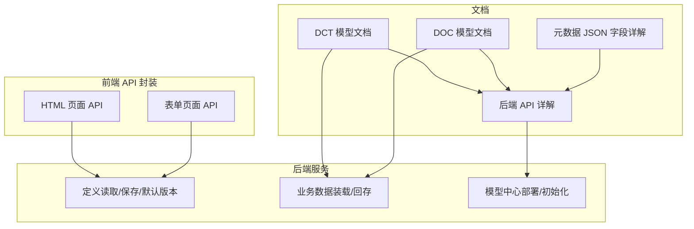
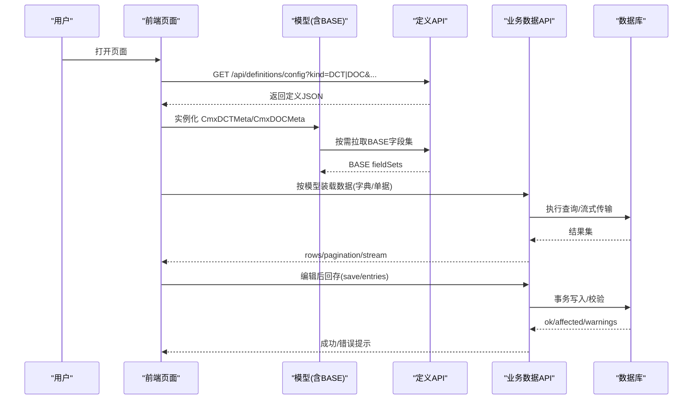
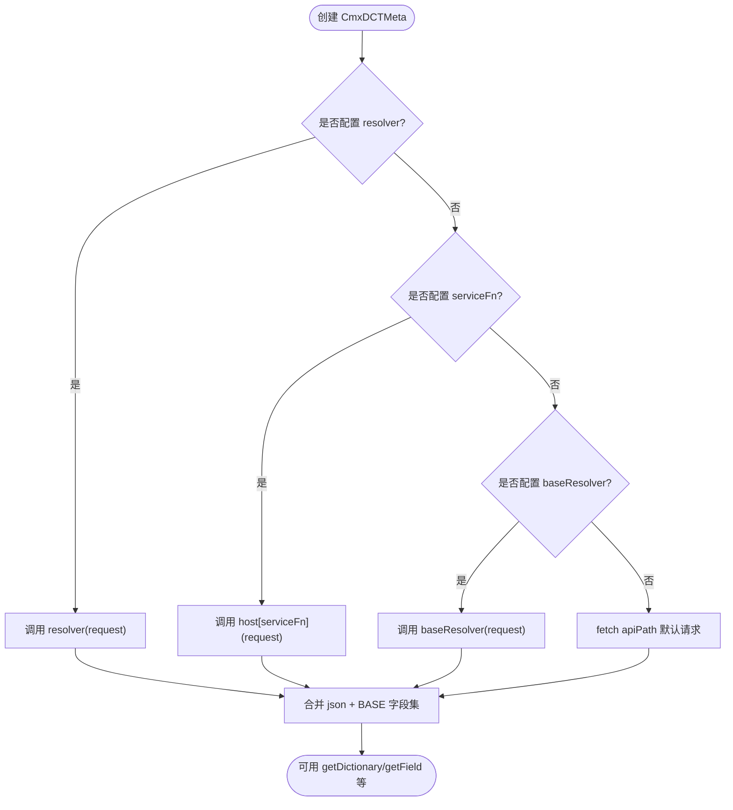
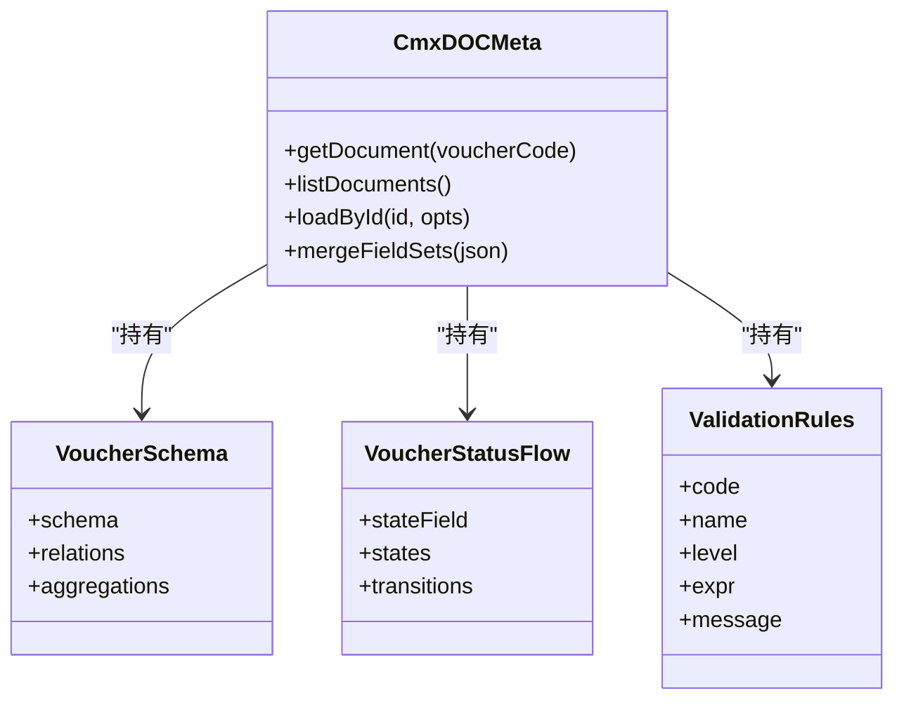
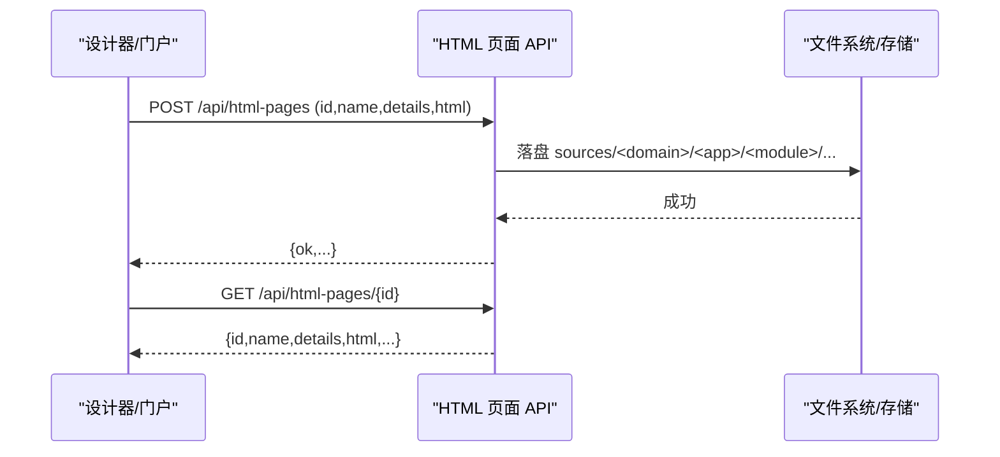
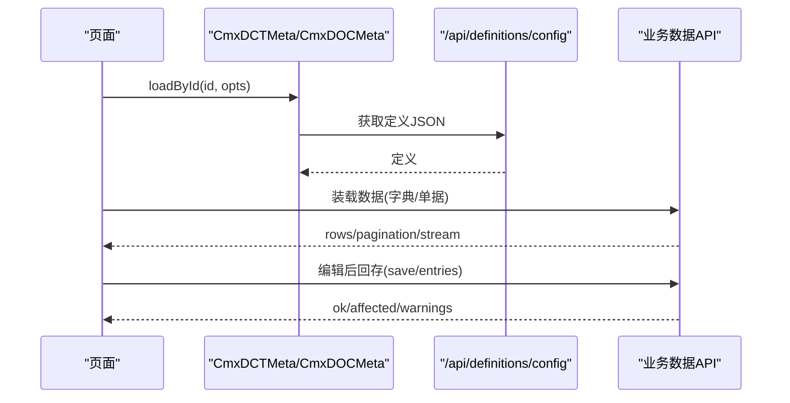
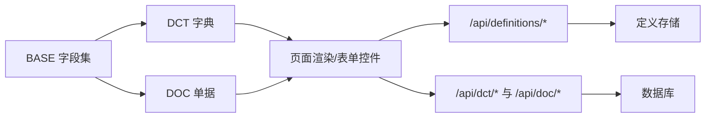

# 数据模型 API

<cite>
**本文引用的文件**
- [04-字典模型-CmxDCTMeta.md](file://docs/CMXPortalManager+CMXHTMLDesigner-模型体系文档/04-字典模型-CmxDCTMeta.md)
- [05-单据模型-CmxDOCMeta.md](file://docs/CMXPortalManager+CMXHTMLDesigner-模型体系文档/05-单据模型-CmxDOCMeta.md)
- [16-后端API详解.md](file://docs/CMXPortalManager+CMXHTMLDesigner-模型体系文档/16-后端API详解.md)
- [17-元数据JSON文件字段详解.md](file://docs/CMXPortalManager+CMXHTMLDesigner-模型体系文档/17-元数据JSON文件字段详解.md)
- [html-pages-api.js](file://CMXPortalManager/src/api/html-pages-api.js)
- [form-pages-api.js](file://CMXPortalManager/src/api/form-pages-api.js)
</cite>

## 目录
1. [简介](#简介)
2. [项目结构](#项目结构)
3. [核心组件](#核心组件)
4. [架构总览](#架构总览)
5. [详细组件分析](#详细组件分析)
6. [依赖关系分析](#依赖关系分析)
7. [性能考量](#性能考量)
8. [故障排查指南](#故障排查指南)
9. [结论](#结论)
10. [附录](#附录)

## 简介
本文件面向“数据模型 API”的完整说明，覆盖三类对象：
- DCT 字典模型（CmxDCTMeta）：描述“编码+名称”等可选项的元数据与加载方式。
- DOC 业务单据模型（CmxDOCMeta）：描述多表、层级、主外键、聚合、状态机与校验规则的业务单据元数据。
- 表单页面管理接口：设计期与运行期的 HTML/表单页面 CRUD 与批量能力。

同时涵盖：
- 模型定义与字段配置、验证规则与关联关系
- 数据导入导出、版本管理与向后兼容性处理
- 模型驱动的页面生成与数据处理示例

## 项目结构
围绕数据模型的代码与文档主要分布在以下位置：
- 模型体系文档：集中阐述 DCT/DOC/BASE/FLC 的定义、字段、加载流程与后端 API
- 门户前端 API 封装：HTML 页面与表单页面的 REST 客户端封装
- 后端 API 规范：统一响应信封、鉴权头、三元定义与业务数据接口

**图表来源**
- [16-后端API详解.md:104-300](file://docs/CMXPortalManager+CMXHTMLDesigner-模型体系文档/16-后端API详解.md#L104-L300)
- [html-pages-api.js:1-52](file://CMXPortalManager/src/api/html-pages-api.js#L1-L52)
- [form-pages-api.js:1-58](file://CMXPortalManager/src/api/form-pages-api.js#L1-L58)

**章节来源**
- [16-后端API详解.md:104-300](file://docs/CMXPortalManager+CMXHTMLDesigner-模型体系文档/16-后端API详解.md#L104-L300)
- [html-pages-api.js:1-52](file://CMXPortalManager/src/api/html-pages-api.js#L1-L52)
- [form-pages-api.js:1-58](file://CMXPortalManager/src/api/form-pages-api.js#L1-L58)

## 核心组件
- CmxDCTMeta（DCT 字典模型）：加载并暴露字典元数据，提供字段集合并、字典表访问、字段查询等能力
- CmxDOCMeta（DOC 业务单据模型）：加载并暴露单据元数据，包含 schema、relations、aggregations、状态机与校验规则
- BASE 基础元数据：共享字段集集合，被 DCT/DOC 引用以复用通用列定义
- 表单/HTML 页面管理：设计期与运行期的页面资产 CRUD、批量获取与保存

**章节来源**
- [04-字典模型-CmxDCTMeta.md:1-120](file://docs/CMXPortalManager+CMXHTMLDesigner-模型体系文档/04-字典模型-CmxDCTMeta.md#L1-L120)
- [05-单据模型-CmxDOCMeta.md:1-120](file://docs/CMXPortalManager+CMXHTMLDesigner-模型体系文档/05-单据模型-CmxDOCMeta.md#L1-L120)
- [16-后端API详解.md:104-300](file://docs/CMXPortalManager+CMXHTMLDesigner-模型体系文档/16-后端API详解.md#L104-L300)

## 架构总览
从“定义→装载→展示→编辑→回存”的全链路如下：

**图表来源**
- [16-后端API详解.md:128-176](file://docs/CMXPortalManager+CMXHTMLDesigner-模型体系文档/16-后端API详解.md#L128-L176)
- [16-后端API详解.md:306-466](file://docs/CMXPortalManager+CMXHTMLDesigner-模型体系文档/16-后端API详解.md#L306-L466)
- [04-字典模型-CmxDCTMeta.md:277-320](file://docs/CMXPortalManager+CMXHTMLDesigner-模型体系文档/04-字典模型-CmxDCTMeta.md#L277-L320)
- [05-单据模型-CmxDOCMeta.md:423-464](file://docs/CMXPortalManager+CMXHTMLDesigner-模型体系文档/05-单据模型-CmxDOCMeta.md#L423-L464)

## 详细组件分析

### DCT 字典模型（CmxDCTMeta）
- 角色：加载并暴露“数据字典”元数据，供下拉选择、树形选择、字典检索等场景使用
- 构造参数：id/domain/module/apiPath/baseApiPath/serviceFn/baseServiceFn/autoLoad/json/fieldSets 以及 resolver/baseResolver 等扩展字段
- JSON 顶层键：moduleMeta、baseDctMetaRef、dictionaryTableConventions、dictionaryTables、updatedAt
- 每张字典表：dictMeta + fields[] + 字段集引用（baseFieldSet/hierarchyFieldSet/auditFieldSet/effectiveFieldSet/disableFieldSet/systemFieldSet/scopeFieldSet）+ codeRule + uniqueKeys + permissionScope
- 加载优先级：resolver → serviceFn → baseResolver → 内置 fetch
- 常用 API：getTable/getDictionary、listTables/listDictionaries、getField/set/getFieldSet/listFieldSets、load/loadById/loadBaseById/mergeFieldSets 等

**图表来源**
- [04-字典模型-CmxDCTMeta.md:277-320](file://docs/CMXPortalManager+CMXHTMLDesigner-模型体系文档/04-字典模型-CmxDCTMeta.md#L277-L320)

**章节来源**
- [04-字典模型-CmxDCTMeta.md:25-72](file://docs/CMXPortalManager+CMXHTMLDesigner-模型体系文档/04-字典模型-CmxDCTMeta.md#L25-L72)
- [04-字典模型-CmxDCTMeta.md:75-274](file://docs/CMXPortalManager+CMXHTMLDesigner-模型体系文档/04-字典模型-CmxDCTMeta.md#L75-L274)
- [04-字典模型-CmxDCTMeta.md:323-399](file://docs/CMXPortalManager+CMXHTMLDesigner-模型体系文档/04-字典模型-CmxDCTMeta.md#L323-L399)

### DOC 业务单据模型（CmxDOCMeta）
- 角色：描述“业务单据”的多表结构、层级、主外键、聚合、状态机与校验规则
- 构造参数：与 DCT 一致（共享 builder），支持 autoLoad、json、fieldSets 等
- JSON 顶层键：moduleMeta、baseDocMetaRef、voucherCommonFieldSet、voucherSchema、voucherTables、voucherStatusFlow、updatedAt、validationRules
- 关键字段：
  - voucherSchema：schema（层级树）、relations（主外键）、aggregations（金额/数量上卷）
  - voucherTables：level、tableName、tableAlias、fields[]、documentFieldSets、fieldOverrides、parentTable
  - voucherStatusFlow：stateField、states[]、transitions[]（含 guard）
  - validationRules[]：跨表校验规则（如借贷平衡、期间开放等）
- 专用方法：getDocument/listDocuments；其余与 DCT 共用

**图表来源**
- [05-单据模型-CmxDOCMeta.md:129-190](file://docs/CMXPortalManager+CMXHTMLDesigner-模型体系文档/05-单据模型-CmxDOCMeta.md#L129-L190)
- [05-单据模型-CmxDOCMeta.md:275-341](file://docs/CMXPortalManager+CMXHTMLDesigner-模型体系文档/05-单据模型-CmxDOCMeta.md#L275-L341)

**章节来源**
- [05-单据模型-CmxDOCMeta.md:25-57](file://docs/CMXPortalManager+CMXHTMLDesigner-模型体系文档/05-单据模型-CmxDOCMeta.md#L25-L57)
- [05-单据模型-CmxDOCMeta.md:60-128](file://docs/CMXPortalManager+CMXHTMLDesigner-模型体系文档/05-单据模型-CmxDOCMeta.md#L60-L128)
- [05-单据模型-CmxDOCMeta.md:129-214](file://docs/CMXPortalManager+CMXHTMLDesigner-模型体系文档/05-单据模型-CmxDOCMeta.md#L129-L214)
- [05-单据模型-CmxDOCMeta.md:275-372](file://docs/CMXPortalManager+CMXHTMLDesigner-模型体系文档/05-单据模型-CmxDOCMeta.md#L275-L372)

### 表单页面管理接口（HTML/表单页）
- HTML 页面（推荐）：/api/html-pages
  - 列表：GET /api/html-pages?page=&pageSize=&domain=&app=&module=
  - 保存：POST /api/html-pages（upsert，body 含 id/name/details/html）
  - 单页：GET /api/html-pages/{id}
  - 批量：POST /api/html-pages/batch（ids）
- 表单页面（兼容）：/api/form-pages
  - 列表：GET /api/form-pages?page=&pageSize=
  - 单页：GET /api/form-pages/{id}
  - 保存：POST /api/form-pages（body 含 id/name/details/form）

**图表来源**
- [16-后端API详解.md:656-667](file://docs/CMXPortalManager+CMXHTMLDesigner-模型体系文档/16-后端API详解.md#L656-L667)
- [html-pages-api.js:1-52](file://CMXPortalManager/src/api/html-pages-api.js#L1-L52)
- [form-pages-api.js:1-58](file://CMXPortalManager/src/api/form-pages-api.js#L1-L58)

**章节来源**
- [16-后端API详解.md:656-671](file://docs/CMXPortalManager+CMXHTMLDesigner-模型体系文档/16-后端API详解.md#L656-L671)
- [html-pages-api.js:1-52](file://CMXPortalManager/src/api/html-pages-api.js#L1-L52)
- [form-pages-api.js:1-58](file://CMXPortalManager/src/api/form-pages-api.js#L1-L58)

### 数据导入导出、版本管理与向后兼容
- 定义版本管理
  - 通过 kind 区分 DCT/DOC/BASE/FLC；同 stem 多版本互斥，仅一个为默认
  - 默认版本设置：POST /api/definitions/default
  - 批量读取定义+base：POST /api/definitions/batch
- 业务数据版本化（DOC）
  - 版本台账：GET /api/doc/revisions
  - 快照恢复：GET /api/doc/revision、POST /api/doc/restore
- 向后兼容
  - 字段三态 dimType（dimension/attribute/measure）统一语义
  - 字段集复用（BASE）避免重复定义，降低变更影响面
  - 模型中心部署采用 additive-only（只加列/索引，不 DROP），保障存量数据不丢失

**章节来源**
- [16-后端API详解.md:170-182](file://docs/CMXPortalManager+CMXHTMLDesigner-模型体系文档/16-后端API详解.md#L170-L182)
- [16-后端API详解.md:493-501](file://docs/CMXPortalManager+CMXHTMLDesigner-模型体系文档/16-后端API详解.md#L493-L501)
- [16-后端API详解.md:566-597](file://docs/CMXPortalManager+CMXHTMLDesigner-模型体系文档/16-后端API详解.md#L566-L597)
- [17-元数据JSON文件字段详解.md:34-94](file://docs/CMXPortalManager+CMXHTMLDesigner-模型体系文档/17-元数据JSON文件字段详解.md#L34-L94)

### 模型驱动的页面生成与数据处理示例
- 页面装配
  - 设计期：在 __designer_meta__.models 中声明 CmxDCTMeta/CmxDOCMeta，设置 id/domain/module/autoLoad
  - 运行期：initPageModels 自动加载并派发 meta-changed，页面订阅后可渲染表格/表单
- 字典数据装载
  - 首选二进制通道：/api/dct/data/tokio-zmc-msgpack（大批量优化）
  - 兜底 JSON：/api/dct/data/search
- 单据数据装载
  - 元数据投影：GET /api/doc/meta（层序/列定义/关系）
  - 数据装载：/api/doc/data/sqlx-dataset-json 或 tokio-zmc-msgpack
  - 懒下钻：/api/doc/data/children
- 回存
  - 字典条目：POST /api/dct/entries、/api/dct/save（changeset）
  - 单据数据：POST /api/doc/save（merge/replace）、/api/doc/save/batch

**图表来源**
- [04-字典模型-CmxDCTMeta.md:424-450](file://docs/CMXPortalManager+CMXHTMLDesigner-模型体系文档/04-字典模型-CmxDCTMeta.md#L424-L450)
- [05-单据模型-CmxDOCMeta.md:423-464](file://docs/CMXPortalManager+CMXHTMLDesigner-模型体系文档/05-单据模型-CmxDOCMeta.md#L423-L464)
- [16-后端API详解.md:306-466](file://docs/CMXPortalManager+CMXHTMLDesigner-模型体系文档/16-后端API详解.md#L306-L466)

**章节来源**
- [04-字典模型-CmxDCTMeta.md:454-479](file://docs/CMXPortalManager+CMXHTMLDesigner-模型体系文档/04-字典模型-CmxDCTMeta.md#L454-L479)
- [05-单据模型-CmxDOCMeta.md:376-400](file://docs/CMXPortalManager+CMXHTMLDesigner-模型体系文档/05-单据模型-CmxDOCMeta.md#L376-L400)
- [16-后端API详解.md:306-466](file://docs/CMXPortalManager+CMXHTMLDesigner-模型体系文档/16-后端API详解.md#L306-L466)

## 依赖关系分析
- 模型间依赖
  - DCT/DOC 均依赖 BASE 字段集进行复用
  - DOC 通过 fieldOverrides 对 base 字段做属性覆盖（如绑定字典）
- 前后端依赖
  - 前端通过 html-pages/form-pages API 管理页面资产
  - 运行时通过 definitions/config 获取定义，通过 dct/doc 数据接口装载/回存
- 部署与版本
  - 模型中心 deploy/init-stream 负责增量升级与历史台账记录

**图表来源**
- [16-后端API详解.md:104-300](file://docs/CMXPortalManager+CMXHTMLDesigner-模型体系文档/16-后端API详解.md#L104-L300)
- [17-元数据JSON文件字段详解.md:17-31](file://docs/CMXPortalManager+CMXHTMLDesigner-模型体系文档/17-元数据JSON文件字段详解.md#L17-L31)

**章节来源**
- [16-后端API详解.md:104-300](file://docs/CMXPortalManager+CMXHTMLDesigner-模型体系文档/16-后端API详解.md#L104-L300)
- [17-元数据JSON文件字段详解.md:17-31](file://docs/CMXPortalManager+CMXHTMLDesigner-模型体系文档/17-元数据JSON文件字段详解.md#L17-L31)

## 性能考量
- 字典数据优先使用二进制 msgpack 通道（/api/dct/data/tokio-zmc-msgpack），失败时回退 JSON search
- 单据数据支持多种传输变体（sqlx/tokio × dataset/zmc × json/msgpack/stream），大数据量建议用 stream 或 zmc
- 批量加载定义+base（/api/definitions/batch）减少网络往返
- 懒下钻（/api/doc/data/children）按需展开子层，降低首屏压力

**章节来源**
- [16-后端API详解.md:322-350](file://docs/CMXPortalManager+CMXHTMLDesigner-模型体系文档/16-后端API详解.md#L322-L350)
- [16-后端API详解.md:411-441](file://docs/CMXPortalManager+CMXHTMLDesigner-模型体系文档/16-后端API详解.md#L411-L441)
- [16-后端API详解.md:477-490](file://docs/CMXPortalManager+CMXHTMLDesigner-模型体系文档/16-后端API详解.md#L477-L490)

## 故障排查指南
- 常见错误码
  - 0：成功
  - 4xx：业务可处理（如 422 校验失败、404 资源不存在）
  - 5xx：系统错误（如 SQL 失败）
- 定位要点
  - 检查 Authorization、x-cmx-db-id 等头部是否正确
  - 确认 domain/app/module/file 四段定位是否匹配
  - 校验 DCT 的 domain 必填；DOC 的 validationRules/guard 是否存在
- 回滚与恢复
  - 使用 /api/doc/revisions 查看版本时间线
  - 通过 /api/doc/restore 恢复到指定版本

**章节来源**
- [16-后端API详解.md:94-101](file://docs/CMXPortalManager+CMXHTMLDesigner-模型体系文档/16-后端API详解.md#L94-L101)
- [16-后端API详解.md:493-501](file://docs/CMXPortalManager+CMXHTMLDesigner-模型体系文档/16-后端API详解.md#L493-L501)

## 结论
- DCT/DOC 模型通过统一的 BASE 字段集实现高内聚、低耦合的元数据管理
- 后端 API 提供完整的定义管理、数据装载/回存、版本化与部署能力
- 前端通过 html-pages/form-pages 管理页面资产，结合模型驱动实现“零硬编码”的页面生成
- 性能方面提供二进制传输、懒下钻与批量加载等手段，满足企业级数据规模需求

## 附录
- 关键 API 速查
  - 定义：/api/definitions/list、/api/definitions/config、/api/definitions/batch、/api/definitions/default
  - 字典数据：/api/dct/meta、/api/dct/data/search、/api/dct/data/tokio-zmc-msgpack、/api/dct/entries、/api/dct/save
  - 单据数据：/api/doc/meta、/api/doc/data/*、/api/doc/save、/api/doc/revisions、/api/doc/restore
  - 页面管理：/api/html-pages、/api/form-pages

**章节来源**
- [16-后端API详解.md:109-182](file://docs/CMXPortalManager+CMXHTMLDesigner-模型体系文档/16-后端API详解.md#L109-L182)
- [16-后端API详解.md:306-466](file://docs/CMXPortalManager+CMXHTMLDesigner-模型体系文档/16-后端API详解.md#L306-L466)
- [16-后端API详解.md:656-671](file://docs/CMXPortalManager+CMXHTMLDesigner-模型体系文档/16-后端API详解.md#L656-L671)