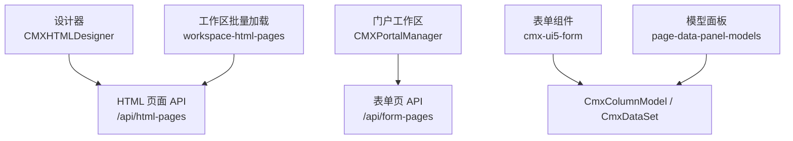
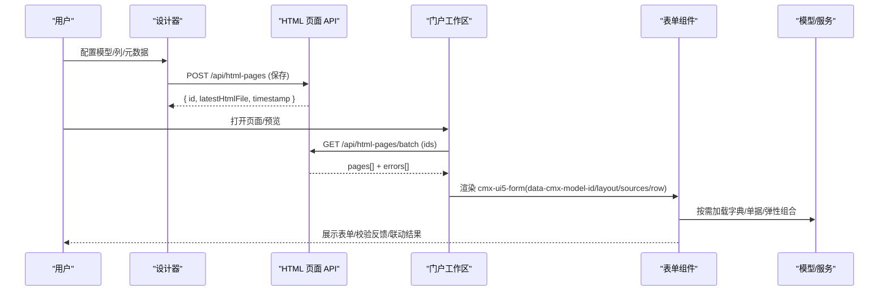
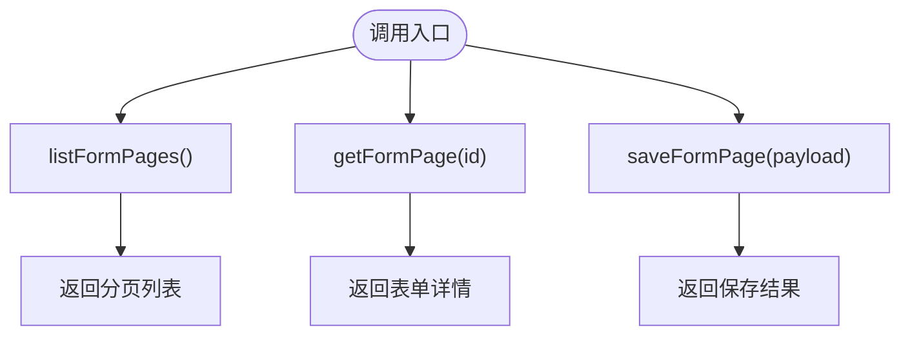
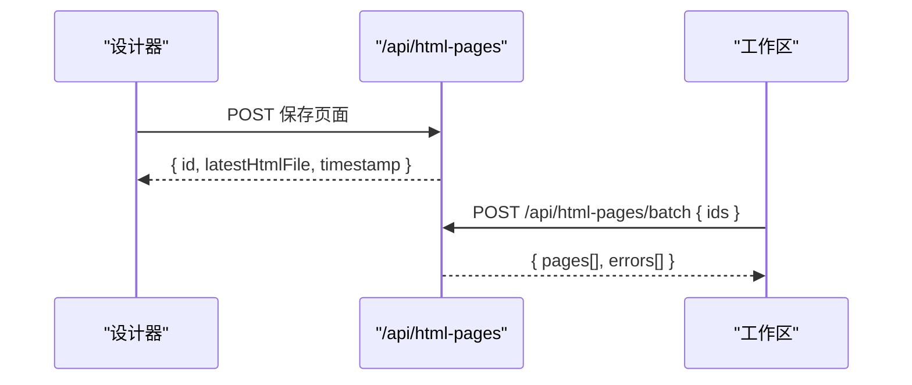
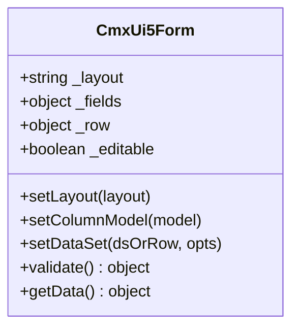
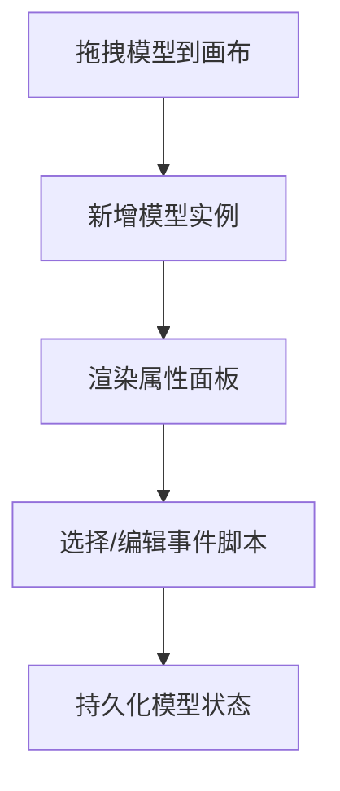
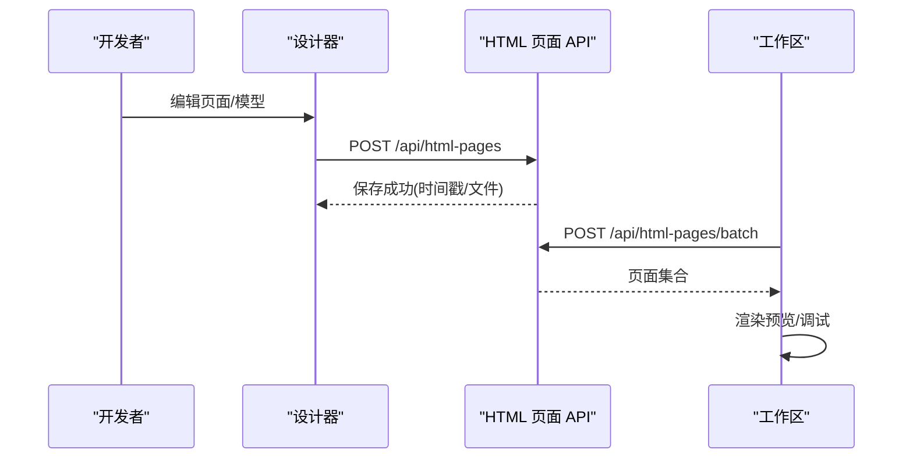
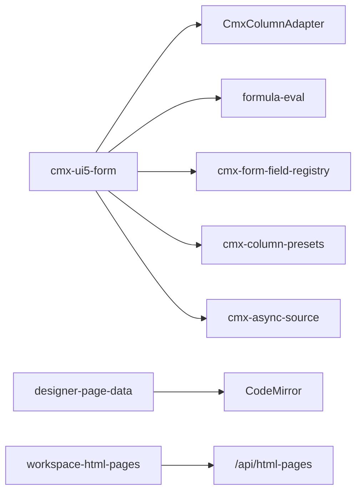

# 表单页面 API

<cite>
**本文引用的文件**
- [form-pages-api.js](file://CMXPortalManager/src/api/form-pages-api.js)
- [html-pages-api.js](file://CMXHTMLDesigner/src/api/html-pages-api.js)
- [cmx-ui5-form.js](file://packages/cmx-data-comp/src/components/cmx-ui5-form.js)
- [page-data-panel-models.js](file://CMXHTMLDesigner/src/components/designer-page-data/page-data-panel-models.js)
- [workspace-html-pages.js](file://CMXPortalManager/src/lib/workspace-html-pages.js)
- [16-后端API详解.md](file://docs/CMXPortalManager+CMXHTMLDesigner-模型体系文档/16-后端API详解.md)
- [page-assembly.md](file://.agents/skills/html-page-generator/references/page-assembly.md)
</cite>

## 目录
1. [简介](#简介)
2. [项目结构](#项目结构)
3. [核心组件](#核心组件)
4. [架构总览](#架构总览)
5. [详细组件分析](#详细组件分析)
6. [依赖关系分析](#依赖关系分析)
7. [性能考虑](#性能考虑)
8. [故障排查指南](#故障排查指南)
9. [结论](#结论)
10. [附录](#附录)

## 简介
本文件面向“表单页面”的设计、配置与运行期能力，聚焦以下目标：
- 表单页面的定义、布局配置、组件绑定与数据交互
- 页面创建、预览、调试与发布流程
- 表单验证规则、条件显示、联动逻辑与权限控制
- 响应式表单设计、复杂表单布局与性能优化实践

该文档基于仓库中的前端 API、设计器与运行时组件实现进行说明，所有技术细节均来源于代码与配套文档。

## 项目结构
与表单页面相关的核心位置包括：
- 表单页 REST 客户端（门户端）：CMXPortalManager/src/api/form-pages-api.js
- HTML 页面 REST 客户端（设计器端）：CMXHTMLDesigner/src/api/html-pages-api.js
- 表单运行时组件：packages/cmx-data-comp/src/components/cmx-ui5-form.js
- 设计器模型面板：CMXHTMLDesigner/src/components/designer-page-data/page-data-panel-models.js
- 工作区批量加载与预览渲染：CMXPortalManager/src/lib/workspace-html-pages.js
- 模型体系与后端 API 参考：docs/.../16-后端API详解.md
- 页面装配与通用响应信封：.agents/skills/html-page-generator/references/page-assembly.md

图表来源
- [html-pages-api.js:25-78](file://CMXHTMLDesigner/src/api/html-pages-api.js#L25-L78)
- [form-pages-api.js:21-58](file://CMXPortalManager/src/api/form-pages-api.js#L21-L58)
- [cmx-ui5-form.js:69-122](file://packages/cmx-data-comp/src/components/cmx-ui5-form.js#L69-L122)
- [page-data-panel-models.js:35-95](file://CMXHTMLDesigner/src/components/designer-page-data/page-data-panel-models.js#L35-L95)
- [workspace-html-pages.js:86-96](file://CMXPortalManager/src/lib/workspace-html-pages.js#L86-L96)

章节来源
- [html-pages-api.js:1-94](file://CMXHTMLDesigner/src/api/html-pages-api.js#L1-L94)
- [form-pages-api.js:1-59](file://CMXPortalManager/src/api/form-pages-api.js#L1-L59)
- [cmx-ui5-form.js:1-200](file://packages/cmx-data-comp/src/components/cmx-ui5-form.js#L1-L200)
- [page-data-panel-models.js:1-16](file://CMXHTMLDesigner/src/components/designer-page-data/page-data-panel-models.js#L1-L16)
- [workspace-html-pages.js:86-96](file://CMXPortalManager/src/lib/workspace-html-pages.js#L86-L96)

## 核心组件
- 表单页 REST 客户端（/api/form-pages）
  - 列表查询、按 ID 获取详情、保存（upsert）
  - 错误信息统一读取并抛出
- HTML 页面 REST 客户端（/api/html-pages）
  - 分页列表（支持 domain/app/module/keyword 过滤）
  - 单条获取（含 html、坐标、版本等）
  - 保存（upsert，支持可选的 domain/app/module 透传）
  - 批量获取（/batch）
- 表单组件 cmx-ui5-form
  - 声明式属性驱动：data-cmx-model-id、data-cmx-layout、data-cmx-sources、data-cmx-row 等
  - 响应式布局：S/M/L/XL 四档列数
  - 字段类型丰富：text/number/select/readonly/date/textarea/checkbox
  - 校验：required/requiredWhen/validate/validateWhen；表达式求值与数组规则
  - 事件：cmx-ui5-form-changed、cmx-ui5-form-invalid
  - 皮肤：neo/plain/default/none，支持强调色与页面样式注入
- 设计器模型面板
  - 拖拽添加模型实例（CmxDataSet/CmxMasterSlave/CmxColumnModel/CmxDCTMeta/CmxDOCMeta/FlexibleCombination）
  - 属性编辑与事件脚本绑定（CodeMirror 编辑器）
  - 默认属性与事件预设提示

章节来源
- [form-pages-api.js:21-58](file://CMXPortalManager/src/api/form-pages-api.js#L21-L58)
- [html-pages-api.js:25-93](file://CMXHTMLDesigner/src/api/html-pages-api.js#L25-L93)
- [cmx-ui5-form.js:1-200](file://packages/cmx-data-comp/src/components/cmx-ui5-form.js#L1-L200)
- [page-data-panel-models.js:35-95](file://CMXHTMLDesigner/src/components/designer-page-data/page-data-panel-models.js#L35-L95)

## 架构总览
表单页面从设计到运行的整体链路如下：
- 设计阶段：在设计器中通过模型面板配置数据模型、列模型、元数据与弹性组合；生成或编辑页面 HTML/脚本。
- 发布阶段：保存页面至后端（/api/html-pages），获得最新 HTML 与时间戳；或通过表单页 API（/api/form-pages）持久化表单定义。
- 运行阶段：门户工作区批量拉取页面（/api/html-pages/batch），在预览或实际页面中渲染 cmx-ui5-form，绑定 CmxColumnModel/CmxDataSet，执行校验与联动。

图表来源
- [html-pages-api.js:25-93](file://CMXHTMLDesigner/src/api/html-pages-api.js#L25-L93)
- [workspace-html-pages.js:86-96](file://CMXPortalManager/src/lib/workspace-html-pages.js#L86-L96)
- [cmx-ui5-form.js:69-122](file://packages/cmx-data-comp/src/components/cmx-ui5-form.js#L69-L122)
- [16-后端API详解.md:832-873](file://docs/CMXPortalManager+CMXHTMLDesigner-模型体系文档/16-后端API详解.md#L832-L873)

## 详细组件分析

### 表单页 REST API（/api/form-pages）
- listFormPages(page, pageSize)
  - 请求：GET /api/form-pages?page=…&pageSize=…
  - 响应：分页列表
  - 错误：非 2xx 时解析 error 字符串并抛错
- getFormPage(id)
  - 请求：GET /api/form-pages/{id}
  - 响应：{ id, name, details, form }
- saveFormPage(payload)
  - 请求：POST /api/form-pages
  - 载荷：{ id, name?, details?, form }
  - 语义：按 id upsert 表单定义

图表来源
- [form-pages-api.js:21-58](file://CMXPortalManager/src/api/form-pages-api.js#L21-L58)

章节来源
- [form-pages-api.js:1-59](file://CMXPortalManager/src/api/form-pages-api.js#L1-L59)

### HTML 页面 REST API（/api/html-pages）
- listHtmlPages(page, pageSize, filter)
  - 支持 domain/app/module 三级 DAM 过滤与 keyword 模糊匹配
- getHtmlPage(id)
  - 返回完整页面定义（含 html、坐标、版本、时间戳等）
- saveHtmlPage(payload)
  - 支持可选的 domain/app/module 透传，避免覆盖后端自动解析
- getHtmlPagesBatch(ids)
  - 批量获取多个页面定义，便于工作区预加载

图表来源
- [html-pages-api.js:25-93](file://CMXHTMLDesigner/src/api/html-pages-api.js#L25-L93)

章节来源
- [html-pages-api.js:1-94](file://CMXHTMLDesigner/src/api/html-pages-api.js#L1-L94)

### 表单组件 cmx-ui5-form
- 声明式属性
  - data-cmx-model-id：关联 CmxColumnModel（字段定义唯一入口）
  - data-cmx-layout：响应式布局，如 'S1 M2 L3 XL3'
  - data-cmx-sources：JSON 数据源集
  - data-cmx-row：绑定的单行对象
  - data-cmx-skin：皮肤 neo/plain/default/none
  - data-cmx-style-id：页面级样式覆盖
- 运行时能力
  - setColumnModel(model)、setLayout(layout)、setHeaderText(text)
  - setDataSet(dsOrRow, opts?)、getData()
  - 校验 validate()：支持 required/requiredWhen/validate/validateWhen，表达式求值与规则数组
  - 事件：cmx-ui5-form-changed、cmx-ui5-form-invalid
- 布局与渲染
  - 行优先（row）与列优先（col）两种流向
  - 分组渲染（group → card/bar）
  - 语言切换时仅重解析 caption，不重建字段

图表来源
- [cmx-ui5-form.js:69-122](file://packages/cmx-data-comp/src/components/cmx-ui5-form.js#L69-L122)
- [cmx-ui5-form.js:485-554](file://packages/cmx-data-comp/src/components/cmx-ui5-form.js#L485-L554)

章节来源
- [cmx-ui5-form.js:1-200](file://packages/cmx-data-comp/src/components/cmx-ui5-form.js#L1-L200)
- [cmx-ui5-form.js:485-554](file://packages/cmx-data-comp/src/components/cmx-ui5-form.js#L485-L554)

### 设计器模型面板与事件脚本
- 模型类型与默认属性
  - CmxDataSet、CmxMasterSlave、CmxColumnModel、CmxDCTMeta、CmxDOCMeta、FlexibleCombination
  - 各模型提供默认 props（如 dataSource、loadKind、metaModelId、scenario 等）
- 事件脚本
  - 内置事件预设与自定义事件
  - CodeMirror 编辑器，支持插入 debugger、自动补全（$data、host、event、其他模型实例、页面函数与服务）
- 状态持久化
  - getModelsState/setModelsState 用于序列化/恢复模型面板状态

图表来源
- [page-data-panel-models.js:35-95](file://CMXHTMLDesigner/src/components/designer-page-data/page-data-panel-models.js#L35-L95)
- [page-data-panel-models.js:278-464](file://CMXHTMLDesigner/src/components/designer-page-data/page-data-panel-models.js#L278-L464)
- [page-data-panel-models.js:528-549](file://CMXHTMLDesigner/src/components/designer-page-data/page-data-panel-models.js#L528-L549)

章节来源
- [page-data-panel-models.js:1-16](file://CMXHTMLDesigner/src/components/designer-page-data/page-data-panel-models.js#L1-L16)
- [page-data-panel-models.js:35-95](file://CMXHTMLDesigner/src/components/designer-page-data/page-data-panel-models.js#L35-L95)
- [page-data-panel-models.js:278-464](file://CMXHTMLDesigner/src/components/designer-page-data/page-data-panel-models.js#L278-L464)
- [page-data-panel-models.js:528-549](file://CMXHTMLDesigner/src/components/designer-page-data/page-data-panel-models.js#L528-L549)

### 页面创建、预览、调试与发布流程
- 创建：在设计器中通过模型面板配置数据模型与列模型，生成或编辑页面 HTML/脚本
- 保存：调用 /api/html-pages 保存页面，返回最新 HTML 文件与时间戳
- 预览：工作区通过 /api/html-pages/batch 批量拉取页面，嵌入 iframe 或插槽进行预览
- 调试：事件脚本支持 debugger 插入；未启用接口有默认实现并可触发可取消事件由宿主处理
- 发布：将页面资产纳入工作区视图，供运行时加载与渲染

图表来源
- [html-pages-api.js:25-93](file://CMXHTMLDesigner/src/api/html-pages-api.js#L25-L93)
- [workspace-html-pages.js:86-96](file://CMXPortalManager/src/lib/workspace-html-pages.js#L86-L96)

章节来源
- [html-pages-api.js:25-93](file://CMXHTMLDesigner/src/api/html-pages-api.js#L25-L93)
- [workspace-html-pages.js:86-96](file://CMXPortalManager/src/lib/workspace-html-pages.js#L86-L96)

## 依赖关系分析
- 表单组件依赖
  - CmxColumnAdapter：将 CmxColumnModel 转换为 UI 描述
  - formula-eval：表达式求值（用于 validateWhen、requiredWhen 等）
  - cmx-form-field-registry：字段类型注册
  - cmx-column-presets：预设字段行为
  - cmx-async-source：异步数据源搜索/去抖
- 设计器依赖
  - CodeMirror：事件脚本编辑与自动补全
  - TabManager：属性/事件面板切换
- 工作区依赖
  - workspace-html-pages：批量加载与错误标记
  - 后端 API：definitions/config、flexible-combination/resolve 等

图表来源
- [cmx-ui5-form.js:46-66](file://packages/cmx-data-comp/src/components/cmx-ui5-form.js#L46-L66)
- [page-data-panel-models.js:439-464](file://CMXHTMLDesigner/src/components/designer-page-data/page-data-panel-models.js#L439-L464)
- [workspace-html-pages.js:86-96](file://CMXPortalManager/src/lib/workspace-html-pages.js#L86-L96)

章节来源
- [cmx-ui5-form.js:46-66](file://packages/cmx-data-comp/src/components/cmx-ui5-form.js#L46-L66)
- [page-data-panel-models.js:439-464](file://CMXHTMLDesigner/src/components/designer-page-data/page-data-panel-models.js#L439-L464)
- [workspace-html-pages.js:86-96](file://CMXPortalManager/src/lib/workspace-html-pages.js#L86-L96)

## 性能考虑
- 批量加载页面：使用 /api/html-pages/batch 减少网络往返，提升工作区启动速度
- 表单渲染优化：
  - 行优先（row）模式使用 CSS Grid，避免 ui5-form 的列优先导致末位字段落单
  - 分组渲染减少重复表单容器开销
  - 语言切换仅重解析 caption，不重建字段，降低重排成本
- 数据源优化：
  - 使用异步数据源与去抖（debounceForSource）减少频繁请求
  - 合理设置 limit/filter/depth，避免一次性加载过多数据
- 错误与降级：
  - 批量加载失败时，为各视图写入错误占位，避免静默失败
  - 页面过大（超过阈值）时，在预览中给出提示

章节来源
- [html-pages-api.js:80-93](file://CMXHTMLDesigner/src/api/html-pages-api.js#L80-L93)
- [workspace-html-pages.js:318-338](file://CMXPortalManager/src/lib/workspace-html-pages.js#L318-L338)
- [cmx-ui5-form.js:918-950](file://packages/cmx-data-comp/src/components/cmx-ui5-form.js#L918-L950)

## 故障排查指南
- 表单校验失败
  - 检查 required/requiredWhen 与 validate/validateWhen 表达式是否正确
  - 查看 cmx-ui5-form-invalid 事件的 errors 列表定位问题字段
- 页面无法预览
  - 检查工作区是否成功批量加载页面（/api/html-pages/batch）
  - 若存在错误，查看对应视图的错误占位信息
- 事件脚本无效
  - 确认事件已绑定且脚本非空
  - 使用 CodeMirror 的 debugger 插入功能进行断点调试
- 数据源加载异常
  - 检查 CmxDataSet/CmxMasterSlave 的 dataSource、filter、limit 配置
  - 核对 definitions/config 与 flexible-combination/resolve 的返回格式

章节来源
- [cmx-ui5-form.js:672-724](file://packages/cmx-data-comp/src/components/cmx-ui5-form.js#L672-L724)
- [workspace-html-pages.js:86-96](file://CMXPortalManager/src/lib/workspace-html-pages.js#L86-L96)
- [page-data-panel-models.js:382-391](file://CMXHTMLDesigner/src/components/designer-page-data/page-data-panel-models.js#L382-L391)

## 结论
本项目的表单页面体系以“设计器配置 + 运行时组件 + 标准化 API”为核心：
- 设计器通过模型面板管理数据模型与列模型，生成页面 HTML/脚本
- 运行时通过 cmx-ui5-form 提供响应式、可校验、可联动的表单能力
- API 层提供统一的页面与表单定义存取与批量加载，支撑预览与发布
- 通过表达式求值、预设规则与事件机制，满足复杂业务场景

## 附录

### 表单验证规则与联动
- 必填与条件必填：required、requiredWhen
- 校验规则：validate（函数/表达式/规则数组）、validateWhen（闸门）
- 联动：onChange 与 dependents（由列模型驱动）
- 事件：cmx-ui5-form-invalid 携带 errors 与当前行

章节来源
- [cmx-ui5-form.js:672-724](file://packages/cmx-data-comp/src/components/cmx-ui5-form.js#L672-L724)

### 条件显示与权限控制
- 条件显示：通过列模型的可见性/只读性与表达式求值控制
- 权限控制：结合角色/资源访问策略（由宿主或后端决定），在列模型或页面脚本中判断后设置 readonly/visible

章节来源
- [16-后端API详解.md:832-873](file://docs/CMXPortalManager+CMXHTMLDesigner-模型体系文档/16-后端API详解.md#L832-L873)

### 响应式表单设计与复杂布局
- 响应式布局：'S1 M2 L3 XL3' 四档断点列数
- 流向：row（行优先）与 col（列优先）
- 分组：card/bar 风格分组，提升可读性

章节来源
- [cmx-ui5-form.js:69-122](file://packages/cmx-data-comp/src/components/cmx-ui5-form.js#L69-L122)
- [cmx-ui5-form.js:485-554](file://packages/cmx-data-comp/src/components/cmx-ui5-form.js#L485-L554)

### 页面装配与通用响应信封
- 通用响应信封：{ code: 0, ok: true, data: ... } 或 { code: 422, ok: false, msg: ... }
- 身份头：Authorization、x-cmx-db-id、x-cmx-trace-id
- 常用模型调用：CmxDataSet、CmxColumnModel、CmxDCTMeta、CmxDOCMeta、FlexibleCombination

章节来源
- [page-assembly.md:292-340](file://.agents/skills/html-page-generator/references/page-assembly.md#L292-L340)