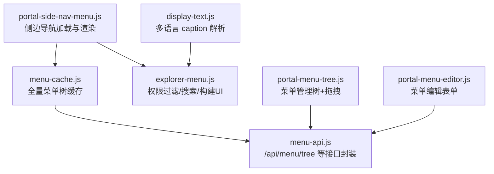
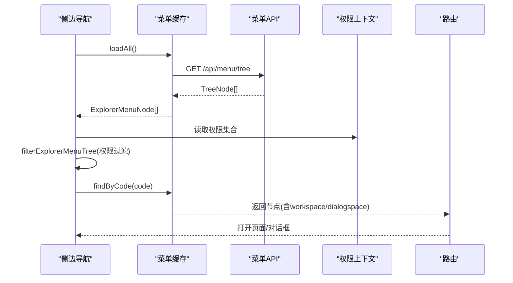
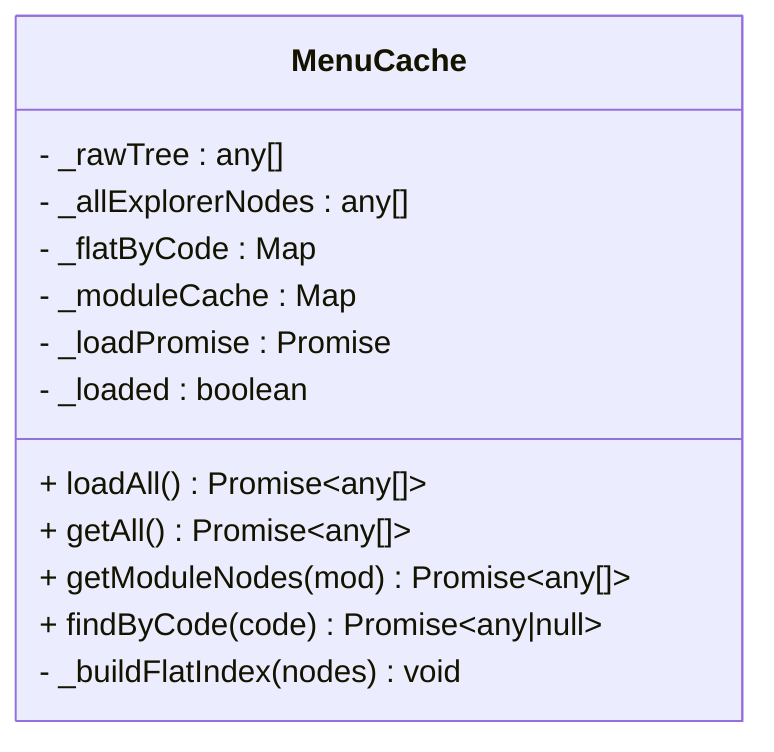
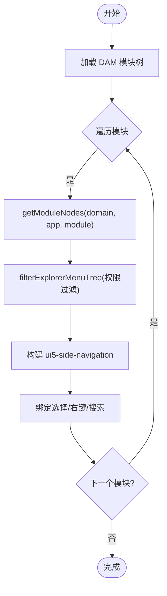
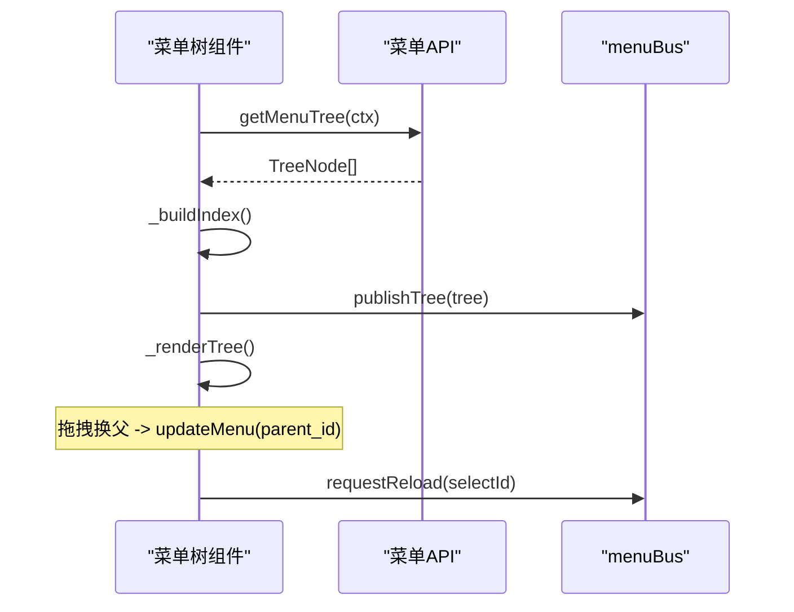
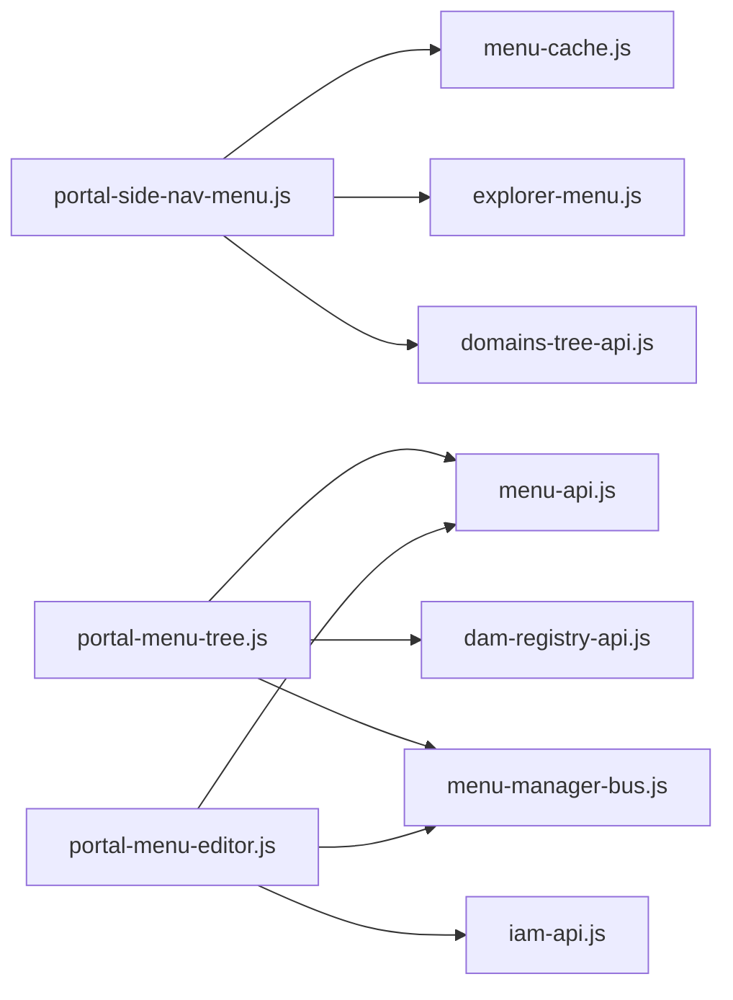

# 菜单 API

<cite>
**本文引用的文件**
- [menu-api.js](file://CMXPortalManager/src/api/menu-api.js)
- [menu-cache.js](file://CMXPortalManager/src/lib/menu-cache.js)
- [portal-side-nav-menu.js](file://CMXPortalManager/src/components/portal-side-nav-menu.js)
- [portal-menu-tree.js](file://CMXPortalManager/src/components/portal-menu-tree.js)
- [portal-menu-editor.js](file://CMXPortalManager/src/components/portal-menu-editor.js)
- [explorer-menu.js](file://CMXPortalManager/src/lib/explorer-menu.js)
- [display-text.js](file://CMXPortalManager/src/lib/display-text.js)
- [20260716_menu_菜单数据库化方案.md](file://documents/20260716_menu_菜单数据库化方案.md)
- [20260726_cmx-portal_菜单页面确定性路由实现总结.md](file://documents/20260726_cmx-portal_菜单页面确定性路由实现总结.md)
</cite>

## 目录
1. [简介](#简介)
2. [项目结构](#项目结构)
3. [核心组件](#核心组件)
4. [架构总览](#架构总览)
5. [详细组件分析](#详细组件分析)
6. [依赖关系分析](#依赖关系分析)
7. [性能与缓存](#性能与缓存)
8. [权限控制与国际化](#权限控制与国际化)
9. [配置示例与集成指南](#配置示例与集成指南)
10. [故障排查](#故障排查)
11. [结论](#结论)

## 简介
本文件面向企业门户的“菜单 API”能力，覆盖菜单树结构管理、动态加载、权限控制、国际化支持、菜单项配置、路由映射、图标管理、层级关系、缓存机制、性能优化以及用户个性化定制。文档基于前端代码与相关设计文档进行梳理，帮助开发者理解并正确集成菜单系统。

## 项目结构
菜单能力由以下关键模块构成：
- API 封装层：统一调用后端 /api/menu/* 接口，负责鉴权、错误处理与响应解包
- 缓存层：单例全量菜单树缓存，按域/应用/模块过滤，提供 code 索引查找
- 侧边导航渲染：将缓存数据转换为 UI5 SideNavigation 节点，绑定交互事件
- 菜单管理界面：树形展示、拖拽换父、搜索、新增/编辑/删除
- 权限与国际化：基于 permissionId 的可见性过滤；caption/name 的多语言显示

图表来源
- [portal-side-nav-menu.js:600-697](file://CMXPortalManager/src/components/portal-side-nav-menu.js#L600-L697)
- [menu-cache.js:148-274](file://CMXPortalManager/src/lib/menu-cache.js#L148-L274)
- [menu-api.js:12-66](file://CMXPortalManager/src/api/menu-api.js#L12-L66)
- [explorer-menu.js:94-142](file://CMXPortalManager/src/lib/explorer-menu.js#L94-L142)
- [portal-menu-tree.js:240-260](file://CMXPortalManager/src/components/portal-menu-tree.js#L240-L260)
- [portal-menu-editor.js:334-370](file://CMXPortalManager/src/components/portal-menu-editor.js#L334-L370)
- [display-text.js:1-16](file://CMXPortalManager/src/lib/display-text.js#L1-L16)

章节来源
- [menu-api.js:12-66](file://CMXPortalManager/src/api/menu-api.js#L12-L66)
- [menu-cache.js:148-274](file://CMXPortalManager/src/lib/menu-cache.js#L148-L274)
- [portal-side-nav-menu.js:600-697](file://CMXPortalManager/src/components/portal-side-nav-menu.js#L600-L697)
- [portal-menu-tree.js:240-260](file://CMXPortalManager/src/components/portal-menu-tree.js#L240-L260)
- [portal-menu-editor.js:334-370](file://CMXPortalManager/src/components/portal-menu-editor.js#L334-L370)
- [explorer-menu.js:94-142](file://CMXPortalManager/src/lib/explorer-menu.js#L94-L142)
- [display-text.js:1-16](file://CMXPortalManager/src/lib/display-text.js#L1-L16)

## 核心组件
- 菜单 API 封装：提供 getMenuTree/getMenu/createMenu/updateMenu/deleteMenu，统一错误处理与 JSON 信封解包
- 菜单缓存：单例 MenuCache，一次拉取全量树，前端按 domain/application/module 过滤，并提供 findByCode
- 侧边导航：从 DAM 派生模块骨架，结合缓存中的业务菜单，构建 ui5-side-navigation，绑定选择/右键/搜索
- 菜单管理：portal-menu-tree 提供树展示、拖拽换父、搜索；portal-menu-editor 提供新增/编辑/删除与功能码选择
- 权限与国际化：基于 permissionId 的可见性过滤；caption/name 的多语言解析

章节来源
- [menu-api.js:12-66](file://CMXPortalManager/src/api/menu-api.js#L12-L66)
- [menu-cache.js:148-274](file://CMXPortalManager/src/lib/menu-cache.js#L148-L274)
- [portal-side-nav-menu.js:600-697](file://CMXPortalManager/src/components/portal-side-nav-menu.js#L600-L697)
- [portal-menu-tree.js:240-260](file://CMXPortalManager/src/components/portal-menu-tree.js#L240-L260)
- [portal-menu-editor.js:334-370](file://CMXPortalManager/src/components/portal-menu-editor.js#L334-L370)
- [explorer-menu.js:94-142](file://CMXPortalManager/src/lib/explorer-menu.js#L94-L142)
- [display-text.js:1-16](file://CMXPortalManager/src/lib/display-text.js#L1-L16)

## 架构总览
菜单数据流：
- 首次进入门户或切换活动页时，通过 menu-cache.loadAll() 一次性获取 /api/menu/tree
- 侧边导航按 DAM 模块分组，对每个模块调用 getModuleNodes({domain, application, module}) 获取该模块菜单
- explorer-menu 根据 permissionId 与当前权限上下文过滤菜单树
- 用户点击菜单项后，通过 code 在缓存中查找对应节点，驱动路由打开页面

图表来源
- [menu-cache.js:170-205](file://CMXPortalManager/src/lib/menu-cache.js#L170-L205)
- [menu-cache.js:221-241](file://CMXPortalManager/src/lib/menu-cache.js#L221-L241)
- [portal-side-nav-menu.js:644-660](file://CMXPortalManager/src/components/portal-side-nav-menu.js#L644-L660)
- [explorer-menu.js:36-54](file://CMXPortalManager/src/lib/explorer-menu.js#L36-L54)

## 详细组件分析

### 菜单 API 封装（/api/menu/*）
- 接口列表
  - GET /api/menu/tree?domain_code=&application_code=&module_code=：按域/应用/模块加载菜单树
  - GET /api/menu/get?id=：获取单个菜单（含 definition）
  - POST /api/menu/create：新增菜单节点
  - POST /api/menu/update：更新菜单节点
  - POST /api/menu/delete：删除菜单节点（ids 数组）
- 特性
  - 自动加 Bearer 鉴权（通过全局 fetch 拦截器）
  - 透明拆 ApiResp 信封，code===0 时直接返回 data
  - 统一错误信息读取（statusText、error、msg）

章节来源
- [menu-api.js:12-66](file://CMXPortalManager/src/api/menu-api.js#L12-L66)

### 菜单缓存（MenuCache）
- 职责
  - 全量菜单树缓存（原始树 + 转换后的 ExplorerMenuNode[]）
  - 扁平索引：code → ExplorerMenuNode（供路由快速查找）
  - 模块缓存：按 (domain|app|module) 缓存过滤结果
- 关键方法
  - loadAll()：幂等拉取全量树，失败不置已加载标记，下次重试并提示
  - getModuleNodes(mod)：前端过滤原始树并重建树，语义等价于后端 tree 过滤
  - findByCode(code)：按 code 查找节点（含 children）
- 数据结构
  - _rawTree：原始树（保留所有字段）
  - _allExplorerNodes：转换后的完整树
  - _flatByCode：扁平索引 Map
  - _moduleCache：模块级缓存 Map

图表来源
- [menu-cache.js:148-274](file://CMXPortalManager/src/lib/menu-cache.js#L148-L274)

章节来源
- [menu-cache.js:148-274](file://CMXPortalManager/src/lib/menu-cache.js#L148-L274)

### 侧边导航菜单（portal-side-nav-menu.js）
- 加载流程
  - 从 DAM 派生模块骨架（ensureDomainTreeLoaded + treeToModules）
  - 对每个模块调用 menuCache.getModuleNodes(...) 获取业务菜单
  - 使用 explorer-menu 的 filterExplorerMenuTree 做权限过滤
  - 构建 ui5-side-navigation 并绑定 selection-change/click/contextmenu
- 交互
  - 搜索框实时过滤菜单
  - 键盘快捷键 Alt+S 或 / 聚焦搜索
  - 右键菜单可编辑选中节点
  - 同步选中态（深链/刷新/切 activity）

图表来源
- [portal-side-nav-menu.js:600-697](file://CMXPortalManager/src/components/portal-side-nav-menu.js#L600-L697)
- [explorer-menu.js:94-142](file://CMXPortalManager/src/lib/explorer-menu.js#L94-L142)

章节来源
- [portal-side-nav-menu.js:600-697](file://CMXPortalManager/src/components/portal-side-nav-menu.js#L600-L697)
- [explorer-menu.js:94-142](file://CMXPortalManager/src/lib/explorer-menu.js#L94-L142)

### 菜单管理界面（portal-menu-tree.js）
- 功能
  - 三段式 DAM 选择（域/应用/模块）
  - 菜单树展示、搜索、展开/折叠
  - 拖拽换父（parent_id 更新），环检测保护
  - 新增根节点、编辑 workspace、删除
- 数据流
  - 通过 getMenuTree(ctx) 拉取当前模块菜单树
  - 建立 id→data 与 id→parent_id 索引，用于祖先判定
  - CRUD 成功后触发 reload，保持选中并展开新父

图表来源
- [portal-menu-tree.js:240-260](file://CMXPortalManager/src/components/portal-menu-tree.js#L240-L260)
- [portal-menu-tree.js:432-458](file://CMXPortalManager/src/components/portal-menu-tree.js#L432-L458)

章节来源
- [portal-menu-tree.js:240-260](file://CMXPortalManager/src/components/portal-menu-tree.js#L240-L260)
- [portal-menu-tree.js:432-458](file://CMXPortalManager/src/components/portal-menu-tree.js#L432-L458)

### 菜单编辑器（portal-menu-editor.js）
- 功能
  - 新增/编辑菜单节点（编码、名称、图标、排序、可见性、打开方式、父节点）
  - 功能码选择器（软过滤、搜索、表格单选）
  - 删除确认与状态反馈
- 数据流
  - createMenu/updateMenu/deleteMenu 调用后端
  - 成功之后通过 menuBus.requestReload 刷新树，并尽量定位新建节点主键

章节来源
- [portal-menu-editor.js:334-370](file://CMXPortalManager/src/components/portal-menu-editor.js#L334-L370)
- [portal-menu-editor.js:389-409](file://CMXPortalManager/src/components/portal-menu-editor.js#L389-L409)

## 依赖关系分析
- portal-side-nav-menu.js 依赖：
  - menu-cache.js：获取模块菜单
  - explorer-menu.js：权限过滤、搜索、构建 UI
  - domains-tree-api.js：DAM 模块树
- portal-menu-tree.js 依赖：
  - menu-api.js：菜单树 CRUD
  - dam-registry-api.js：DAM 注册表
  - menu-manager-bus.js：与编辑器通信
- portal-menu-editor.js 依赖：
  - menu-api.js：CRUD
  - iam-api.js：功能码列表
  - menu-manager-bus.js：与树组件通信

图表来源
- [portal-side-nav-menu.js:600-697](file://CMXPortalManager/src/components/portal-side-nav-menu.js#L600-L697)
- [portal-menu-tree.js:12-15](file://CMXPortalManager/src/components/portal-menu-tree.js#L12-L15)
- [portal-menu-editor.js:16-20](file://CMXPortalManager/src/components/portal-menu-editor.js#L16-L20)

章节来源
- [portal-side-nav-menu.js:600-697](file://CMXPortalManager/src/components/portal-side-nav-menu.js#L600-L697)
- [portal-menu-tree.js:12-15](file://CMXPortalManager/src/components/portal-menu-tree.js#L12-L15)
- [portal-menu-editor.js:16-20](file://CMXPortalManager/src/components/portal-menu-editor.js#L16-L20)

## 性能与缓存
- 全量缓存策略
  - 一次 GET /api/menu/tree，多处复用（侧边导航与路由）
  - 前端按 (domain|app|module) 过滤，避免重复请求
  - 失败兜底：缓存空数组并提示，避免反复打挂后端
- 模块级缓存
  - getModuleNodes 对同一模块多次调用命中内存缓存
- 路由查找
  - findByCode 使用扁平索引 Map，O(1) 查找
- 性能对比
  - 登录首屏：N+1 次 → 1 次
  - 切换 activity：1+N 次 → 0 次
  - 全程：持续累积 → 1 次

章节来源
- [menu-cache.js:170-205](file://CMXPortalManager/src/lib/menu-cache.js#L170-L205)
- [20260726_cmx-portal_菜单页面确定性路由实现总结.md:141-167](file://documents/20260726_cmx-portal_菜单页面确定性路由实现总结.md#L141-L167)

## 权限控制与国际化
- 权限控制
  - 菜单项携带 permissionId（fun_code），通过 __PORTAL_PERMISSION_IDS 设置当前用户权限集合
  - filterExplorerMenuTree 递归过滤无权限节点及其子树
  - visible=0 的节点整枝剪除，不出现在侧边菜单与 router 索引
- 国际化支持
  - caption/name 支持多语言对象（如 zh_CN/en_US），portalDisplayText 按优先级解析
  - 当前界面语言来自 UI5 运行时 getLanguage，回退到 zh_CN 等兜底
  - 菜单项显示优先使用 definition.caption，其次 name/id

章节来源
- [explorer-menu.js:36-54](file://CMXPortalManager/src/lib/explorer-menu.js#L36-L54)
- [explorer-menu.js:94-142](file://CMXPortalManager/src/lib/explorer-menu.js#L94-L142)
- [display-text.js:1-16](file://CMXPortalManager/src/lib/display-text.js#L1-L16)
- [menu-cache.js:36-64](file://CMXPortalManager/src/lib/menu-cache.js#L36-L64)

## 配置示例与集成指南
- 菜单项配置要点
  - 归属：domain_code/application_code/module_code（三级定位）
  - 树形：parent_id/code_path/id_path/depth/leaf（后端计算）
  - 元信息：code/name/icon/fun_code/sort_order/visible/open_type/status
  - 富数据：definition（JSONB，包含 workspace/dialogspace/expanded/type 等）
- 路由映射
  - URL 为页面身份标识（/view/<code>），参数通过 URL query 注入 initialContext
  - 未授权菜单的深链被前端过滤，显示“页面不存在”
  - 多 tab 不持久化，URL 仅反映当前激活 tab
- 图标管理
  - icon 字段支持 ui5 标准名与 collection/name 形式，非法则回退默认图标
- 用户个性化定制
  - 通过 definition.workspace 配置内容区、资源管理器、属性区、底部区视图
  - dialogspace/dialogWorkspace 支持弹窗/抽屉/全屏等打开方式
  - expanded 控制默认展开状态

章节来源
- [20260716_menu_菜单数据库化方案.md:46-71](file://documents/20260716_menu_菜单数据库化方案.md#L46-L71)
- [20260726_cmx-portal_菜单页面确定性路由实现总结.md:170-307](file://documents/20260726_cmx-portal_菜单页面确定性路由实现总结.md#L170-L307)
- [portal-menu-tree.js:408-412](file://CMXPortalManager/src/components/portal-menu-tree.js#L408-L412)

## 故障排查
- 菜单加载失败
  - 现象：侧边栏为空或提示“业务菜单加载失败”
  - 原因：/api/menu/tree HTTP 错误或网络异常
  - 处理：缓存空数组并提示，下次调用会重试；检查后端服务与鉴权
- 权限导致菜单不可见
  - 现象：菜单不在侧边栏，但可通过深链访问
  - 原因：permissionId 不在当前用户权限集合
  - 处理：检查 __PORTAL_PERMISSION_IDS 配置与后端权限分配
- 拖拽换父失败
  - 现象：无法移动到自身或其子孙节点下
  - 原因：环检测保护生效
  - 处理：调整目标父节点，确保不构成环
- 功能码选择器为空
  - 现象：选择器无匹配项
  - 原因：当前模块下无匹配功能码，已展示全部菜单功能码
  - 处理：检查 DAM 上下文与功能码归属

章节来源
- [menu-cache.js:170-205](file://CMXPortalManager/src/lib/menu-cache.js#L170-L205)
- [portal-menu-tree.js:432-458](file://CMXPortalManager/src/components/portal-menu-tree.js#L432-L458)
- [portal-menu-editor.js:422-541](file://CMXPortalManager/src/components/portal-menu-editor.js#L422-L541)

## 结论
本菜单 API 体系通过“一次全量加载 + 前端过滤 + 模块级缓存”的策略，显著降低了后端压力并提升了用户体验。权限控制与国际化能力确保了菜单的安全性与多语言适配。配合 DAM 模块体系与定义化的 workspace，菜单系统具备高度的可扩展性与可维护性。建议在生产环境中合理配置权限集合与语言环境，充分利用缓存机制以获得最佳性能。