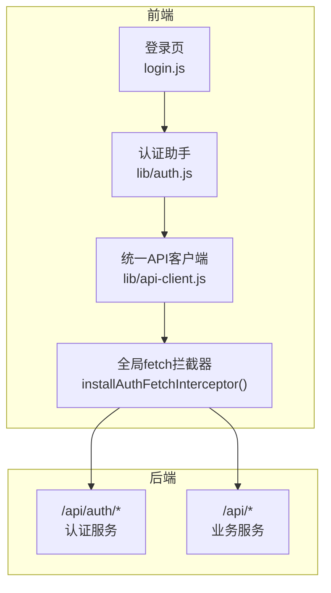
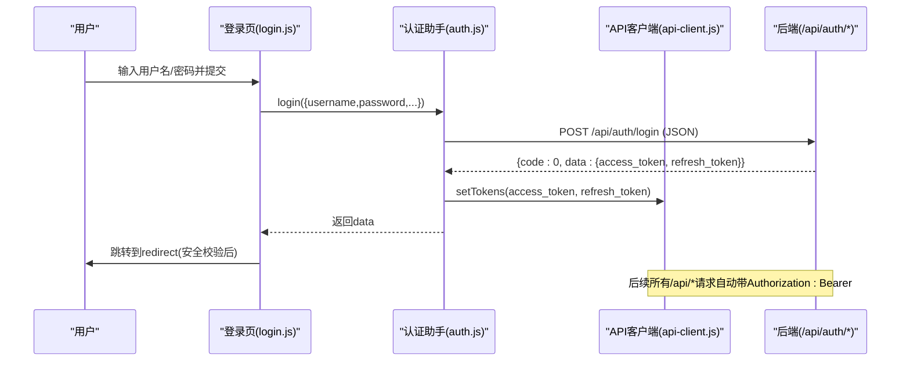
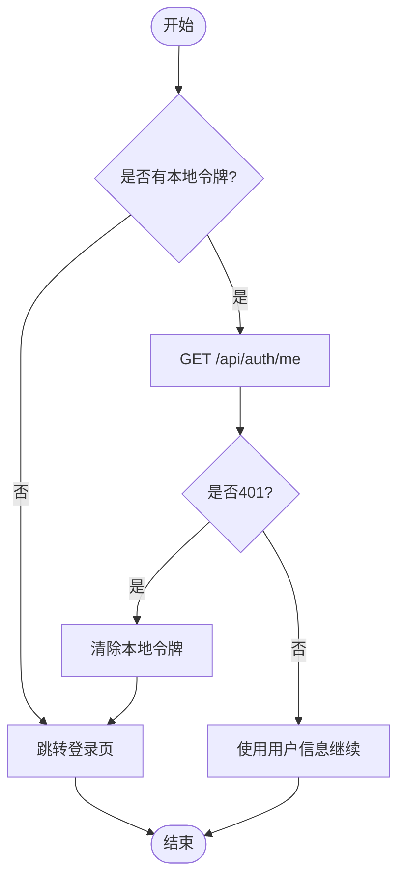
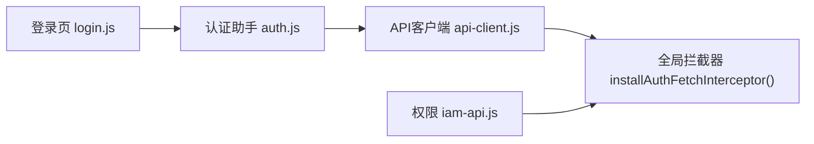

# 认证 API

<cite>
**本文引用的文件**
- [CMXHTMLDesigner/src/lib/auth.js](file://CMXHTMLDesigner/src/lib/auth.js)
- [CMXPortalManager/src/lib/auth.js](file://CMXPortalManager/src/lib/auth.js)
- [CMXHTMLDesigner/src/lib/api-client.js](file://CMXHTMLDesigner/src/lib/api-client.js)
- [CMXPortalManager/src/lib/api-client.js](file://CMXPortalManager/src/lib/api-client.js)
- [CMXHTMLDesigner/src/login.js](file://CMXHTMLDesigner/src/login.js)
- [CMXPortalManager/src/login.js](file://CMXPortalManager/src/login.js)
- [CMXPortalManager/src/api/iam-api.js](file://CMXPortalManager/src/api/iam-api.js)
</cite>

## 目录
1. [简介](#简介)
2. [项目结构](#项目结构)
3. [核心组件](#核心组件)
4. [架构总览](#架构总览)
5. [详细组件分析](#详细组件分析)
6. [依赖关系分析](#依赖关系分析)
7. [性能与安全考量](#性能与安全考量)
8. [故障排查指南](#故障排查指南)
9. [结论](#结论)
10. [附录：端点与示例](#附录端点与示例)

## 简介
本文件面向前后端开发者，系统化梳理企业门户的认证 API 与前端鉴权机制。内容覆盖用户登录、登出、会话管理、权限验证、JWT Token 处理、错误处理与安全最佳实践，并提供端到端的请求/响应示例与流程图，帮助快速集成与排障。

## 项目结构
认证能力由“前端认证助手 + 统一 API 客户端 + 全局拦截器”三部分构成，并配合登录页完成完整流程。两个前端应用（设计器与门户管理器）共享相同模式：通过 /api/auth/* 进行认证，通过统一的 apiFetch 或全局 fetch 拦截器自动携带 Bearer Token，并在 401 时统一跳转登录。

图表来源
- [CMXHTMLDesigner/src/lib/auth.js:1-100](file://CMXHTMLDesigner/src/lib/auth.js#L1-L100)
- [CMXPortalManager/src/lib/auth.js:1-121](file://CMXPortalManager/src/lib/auth.js#L1-L121)
- [CMXHTMLDesigner/src/lib/api-client.js:1-245](file://CMXHTMLDesigner/src/lib/api-client.js#L1-L245)
- [CMXPortalManager/src/lib/api-client.js:1-259](file://CMXPortalManager/src/lib/api-client.js#L1-L259)
- [CMXHTMLDesigner/src/login.js:1-47](file://CMXHTMLDesigner/src/login.js#L1-L47)
- [CMXPortalManager/src/login.js:1-47](file://CMXPortalManager/src/login.js#L1-L47)

章节来源
- [CMXHTMLDesigner/src/lib/auth.js:1-100](file://CMXHTMLDesigner/src/lib/auth.js#L1-L100)
- [CMXPortalManager/src/lib/auth.js:1-121](file://CMXPortalManager/src/lib/auth.js#L1-L121)
- [CMXHTMLDesigner/src/lib/api-client.js:1-245](file://CMXHTMLDesigner/src/lib/api-client.js#L1-L245)
- [CMXPortalManager/src/lib/api-client.js:1-259](file://CMXPortalManager/src/lib/api-client.js#L1-L259)
- [CMXHTMLDesigner/src/login.js:1-47](file://CMXHTMLDesigner/src/login.js#L1-L47)
- [CMXPortalManager/src/login.js:1-47](file://CMXPortalManager/src/login.js#L1-L47)

## 核心组件
- 认证助手（auth.js）
  - 提供 login/logout/fetchCurrentUser/isLoggedIn/gotoLogin/requireAuthOrRedirect 等能力，封装对 /api/auth/* 的调用与本地令牌存取。
  - 解析后端 ApiResp 信封，成功返回 data，失败抛错。
- 统一 API 客户端（api-client.js）
  - 提供 getToken/setTokens/clearTokens、apiFetch/apiGet/apiPost/apiDelete。
  - 自动注入 Authorization: Bearer <token>，解析 ApiResp 信封，401 时清 token 并跳转登录。
  - 提供 installAuthFetchInterceptor()，为所有 /api/* 请求自动加鉴权头、统一拆信封与 401 处理。
- 登录页（login.js）
  - 表单提交 → 调用 auth.login → 成功后回跳 redirect（防开放重定向）。
- 权限查询（iam-api.js）
  - 调用 /api/iam/permissions/list 获取功能码列表，用于菜单绑定与权限展示。

章节来源
- [CMXHTMLDesigner/src/lib/auth.js:1-100](file://CMXHTMLDesigner/src/lib/auth.js#L1-L100)
- [CMXPortalManager/src/lib/auth.js:1-121](file://CMXPortalManager/src/lib/auth.js#L1-L121)
- [CMXHTMLDesigner/src/lib/api-client.js:1-245](file://CMXHTMLDesigner/src/lib/api-client.js#L1-L245)
- [CMXPortalManager/src/lib/api-client.js:1-259](file://CMXPortalManager/src/lib/api-client.js#L1-L259)
- [CMXHTMLDesigner/src/login.js:1-47](file://CMXHTMLDesigner/src/login.js#L1-L47)
- [CMXPortalManager/src/login.js:1-47](file://CMXPortalManager/src/login.js#L1-L47)
- [CMXPortalManager/src/api/iam-api.js:1-50](file://CMXPortalManager/src/api/iam-api.js#L1-L50)

## 架构总览
认证与鉴权的关键路径如下：
- 登录：登录页收集用户名/密码 → 调用 /api/auth/login → 服务端校验并返回 access_token/refresh_token → 前端写入 localStorage → 跳转目标页面。
- 鉴权：后续所有 /api/* 请求由 apiFetch 或全局拦截器自动附加 Authorization 头；服务端校验 JWT，未通过返回 401 → 前端清 token 并跳转登录。
- 会话：access_token 短期有效，refresh_token 用于刷新；当前用户信息通过 /api/auth/me 获取。
- 权限：通过 /api/iam/permissions/list 拉取功能码，结合菜单与路由实现多角色控制。

图表来源
- [CMXHTMLDesigner/src/login.js:26-46](file://CMXHTMLDesigner/src/login.js#L26-L46)
- [CMXHTMLDesigner/src/lib/auth.js:33-47](file://CMXHTMLDesigner/src/lib/auth.js#L33-L47)
- [CMXHTMLDesigner/src/lib/api-client.js:43-49](file://CMXHTMLDesigner/src/lib/api-client.js#L43-L49)
- [CMXPortalManager/src/lib/api-client.js:43-49](file://CMXPortalManager/src/lib/api-client.js#L43-L49)

## 详细组件分析

### 认证端点与交互
- 登录
  - 方法：POST
  - URL：/api/auth/login
  - 请求体：包含 username、password、可选 device_type、device_id
  - 响应：ApiResp 信封，code=0 时 data 包含 access_token、refresh_token
  - 行为：成功后前端写入本地令牌，随后跳转
- 登出
  - 方法：POST
  - URL：/api/auth/logout
  - 请求头：Authorization: Bearer <access_token>
  - 响应：标准信封；前端在 finally 中清理本地令牌
- 当前用户
  - 方法：GET
  - URL：/api/auth/me
  - 请求头：Authorization: Bearer <access_token>
  - 响应：ApiResp 信封，code=0 时 data 包含 user_id、username 等身份信息
  - 行为：401 时清除本地令牌并返回 null

图表来源
- [CMXHTMLDesigner/src/lib/auth.js:64-77](file://CMXHTMLDesigner/src/lib/auth.js#L64-L77)
- [CMXPortalManager/src/lib/auth.js:85-98](file://CMXPortalManager/src/lib/auth.js#L85-L98)
- [CMXHTMLDesigner/src/lib/api-client.js:95-100](file://CMXHTMLDesigner/src/lib/api-client.js#L95-L100)
- [CMXPortalManager/src/lib/api-client.js:103-108](file://CMXPortalManager/src/lib/api-client.js#L103-L108)

章节来源
- [CMXHTMLDesigner/src/lib/auth.js:33-77](file://CMXHTMLDesigner/src/lib/auth.js#L33-L77)
- [CMXPortalManager/src/lib/auth.js:33-98](file://CMXPortalManager/src/lib/auth.js#L33-L98)
- [CMXHTMLDesigner/src/lib/api-client.js:95-100](file://CMXHTMLDesigner/src/lib/api-client.js#L95-L100)
- [CMXPortalManager/src/lib/api-client.js:103-108](file://CMXPortalManager/src/lib/api-client.js#L103-L108)

### 会话管理与令牌存储
- 令牌键名：cmx_access_token、cmx_refresh_token
- 存取函数：getToken/setTokens/clearTokens
- 登录成功后立即写入；登出或在 401 时清除
- Portal 管理器在登录后还会同步 cmx_user_id/cmx_username 到 localStorage，供待办中心等模块按人过滤

章节来源
- [CMXHTMLDesigner/src/lib/api-client.js:38-57](file://CMXHTMLDesigner/src/lib/api-client.js#L38-L57)
- [CMXPortalManager/src/lib/api-client.js:38-57](file://CMXPortalManager/src/lib/api-client.js#L38-L57)
- [CMXPortalManager/src/lib/auth.js:46-64](file://CMXPortalManager/src/lib/auth.js#L46-L64)

### 全局鉴权拦截与信封透明化
- 安装拦截器：installAuthFetchInterceptor()
- 作用范围：同源 /api/* 请求
- 自动行为：
  - 注入 Authorization: Bearer <token>（排除 /api/auth/*）
  - 401 时清除本地令牌并跳转登录页
  - 对 JSON 响应透明拆分 ApiResp：成功返回 data；业务错误映射为非 2xx 并附带 error/msg/code，必要时透传 data（如 violations）
- 跨域支持：当配置 VITE_API_BASE 时，将相对 /api/* 重写至后端域名

章节来源
- [CMXHTMLDesigner/src/lib/api-client.js:167-245](file://CMXHTMLDesigner/src/lib/api-client.js#L167-L245)
- [CMXPortalManager/src/lib/api-client.js:175-259](file://CMXPortalManager/src/lib/api-client.js#L175-L259)

### 权限验证与多角色控制
- 权限数据源：/api/iam/permissions/list（POST），返回资源类型为 menu 的功能码列表
- 客户端软过滤：由于权限表编码与菜单树 DAM 编码大小写不一致，先拉全量再在客户端做不敏感过滤；若过滤为空则回退全量并标记 _unfiltered
- 典型用途：菜单渲染、按钮可见性、路由级权限控制

章节来源
- [CMXPortalManager/src/api/iam-api.js:1-50](file://CMXPortalManager/src/api/iam-api.js#L1-L50)

### 登录流程与回跳安全
- 登录页收集表单 → 调用 auth.login → 成功后安全回跳
- 安全策略：仅允许站内绝对路径（以单个 / 开头，拒绝 //host 或 http(s)://），避免开放重定向风险

章节来源
- [CMXHTMLDesigner/src/login.js:11-19](file://CMXHTMLDesigner/src/login.js#L11-L19)
- [CMXPortalManager/src/login.js:11-19](file://CMXPortalManager/src/login.js#L11-L19)

## 依赖关系分析
- 登录页依赖认证助手
- 认证助手依赖统一 API 客户端（令牌存取）
- 统一 API 客户端提供全局拦截器，被各业务模块间接依赖
- 权限模块依赖统一鉴权（通过全局拦截器自动携带令牌）

图表来源
- [CMXHTMLDesigner/src/login.js:1-47](file://CMXHTMLDesigner/src/login.js#L1-L47)
- [CMXHTMLDesigner/src/lib/auth.js:1-100](file://CMXHTMLDesigner/src/lib/auth.js#L1-L100)
- [CMXHTMLDesigner/src/lib/api-client.js:167-245](file://CMXHTMLDesigner/src/lib/api-client.js#L167-L245)
- [CMXPortalManager/src/api/iam-api.js:1-50](file://CMXPortalManager/src/api/iam-api.js#L1-L50)

## 性能与安全考量
- 性能
  - 全局拦截器仅在首次安装一次，避免重复开销
  - 非 JSON 响应（下载/SSE）直接透传，减少不必要解析
  - 401 风暴防护：回跳地址长度限制与去重，防止 URI 过长导致 414
- 安全
  - 登录回跳严格白名单校验，防止开放重定向
  - 401 统一处理，避免泄露敏感状态
  - 令牌最小化暴露：仅在同源 /api/* 注入，认证端点不强制注入
  - 建议：生产环境启用 HTTPS、设置合理的 Token 过期时间、在服务端校验 JWT 签名与受众

[本节为通用指导，无需具体文件引用]

## 故障排查指南
- 现象：登录后仍频繁跳转登录页
  - 检查是否已安装全局拦截器并确保其幂等执行
  - 确认本地是否存在 cmx_access_token
  - 查看后端是否返回 401 或业务 code 非 0
- 现象：登录后无法访问受保护页面
  - 确认 /api/auth/me 是否可正常返回用户信息
  - 检查拦截器是否正确注入 Authorization 头
- 现象：权限列表为空
  - 确认 /api/iam/permissions/list 是否返回数据
  - 注意大小写差异导致的客户端软过滤结果

章节来源
- [CMXHTMLDesigner/src/lib/api-client.js:95-100](file://CMXHTMLDesigner/src/lib/api-client.js#L95-L100)
- [CMXPortalManager/src/lib/api-client.js:103-108](file://CMXPortalManager/src/lib/api-client.js#L103-L108)
- [CMXPortalManager/src/api/iam-api.js:22-48](file://CMXPortalManager/src/api/iam-api.js#L22-L48)

## 结论
本项目采用“认证助手 + 统一 API 客户端 + 全局拦截器”的清晰分层，实现了统一的登录/登出、会话管理、JWT 鉴权与权限查询。前端对后端 ApiResp 信封的透明化处理降低了接入成本，同时提供了完善的 401 处理与回跳安全策略。建议在后续迭代中持续强化服务端授权校验与细粒度权限控制。

[本节为总结，无需具体文件引用]

## 附录：端点与示例

### 端点一览
- 登录
  - 方法：POST
  - URL：/api/auth/login
  - 请求体字段：username、password、device_type（可选）、device_id（可选）
  - 响应：{ code: 0, data: { access_token, refresh_token } }
- 登出
  - 方法：POST
  - URL：/api/auth/logout
  - 请求头：Authorization: Bearer <access_token>
  - 响应：标准信封
- 当前用户
  - 方法：GET
  - URL：/api/auth/me
  - 请求头：Authorization: Bearer <access_token>
  - 响应：{ code: 0, data: { user_id, username, ... } }
- 权限列表
  - 方法：POST
  - URL：/api/iam/permissions/list
  - 请求体：filters 数组（例如 resource_type=$eq:'menu'）
  - 响应：数组形式的权限项

章节来源
- [CMXHTMLDesigner/src/lib/auth.js:33-47](file://CMXHTMLDesigner/src/lib/auth.js#L33-L47)
- [CMXPortalManager/src/lib/auth.js:33-51](file://CMXPortalManager/src/lib/auth.js#L33-L51)
- [CMXHTMLDesigner/src/lib/auth.js:64-77](file://CMXHTMLDesigner/src/lib/auth.js#L64-L77)
- [CMXPortalManager/src/lib/auth.js:85-98](file://CMXPortalManager/src/lib/auth.js#L85-L98)
- [CMXPortalManager/src/api/iam-api.js:10-20](file://CMXPortalManager/src/api/iam-api.js#L10-L20)

### 请求与响应示例（示意）
- 登录请求
  - 方法：POST
  - URL：/api/auth/login
  - 请求体：{ "username": "user@example.com", "password": "your_password", "device_type": "web", "device_id": "web-xxxxxx" }
  - 响应：{ "code": 0, "data": { "access_token": "...", "refresh_token": "..." } }
- 登出请求
  - 方法：POST
  - URL：/api/auth/logout
  - 请求头：Authorization: Bearer <access_token>
  - 响应：{ "code": 0, "data": null }
- 当前用户请求
  - 方法：GET
  - URL：/api/auth/me
  - 请求头：Authorization: Bearer <access_token>
  - 响应：{ "code": 0, "data": { "user_id": 123, "username": "user@example.com" } }
- 权限列表请求
  - 方法：POST
  - URL：/api/iam/permissions/list
  - 请求体：{ "filters": [{ "resource_type": { "$eq": "menu" } }] }
  - 响应：[ { "code": "menu:finance:view", "name": "财务视图", "resource_type": "menu" }, ... ]

章节来源
- [CMXHTMLDesigner/src/lib/auth.js:33-47](file://CMXHTMLDesigner/src/lib/auth.js#L33-L47)
- [CMXPortalManager/src/lib/auth.js:33-51](file://CMXPortalManager/src/lib/auth.js#L33-L51)
- [CMXPortalManager/src/api/iam-api.js:10-20](file://CMXPortalManager/src/api/iam-api.js#L10-L20)

### 错误处理约定
- HTTP 层失败：优先读取信封 msg 或裸 error，否则返回 HTTP 状态码
- 业务错误：code !== 0 时抛出错误，消息取自 msg；部分错误会透传 data（如 violations）
- 未授权：401 时清除本地令牌并跳转登录页

章节来源
- [CMXHTMLDesigner/src/lib/api-client.js:109-121](file://CMXHTMLDesigner/src/lib/api-client.js#L109-L121)
- [CMXPortalManager/src/lib/api-client.js:117-129](file://CMXPortalManager/src/lib/api-client.js#L117-L129)
- [CMXHTMLDesigner/src/lib/api-client.js:231-241](file://CMXHTMLDesigner/src/lib/api-client.js#L231-L241)
- [CMXPortalManager/src/lib/api-client.js:237-255](file://CMXPortalManager/src/lib/api-client.js#L237-L255)