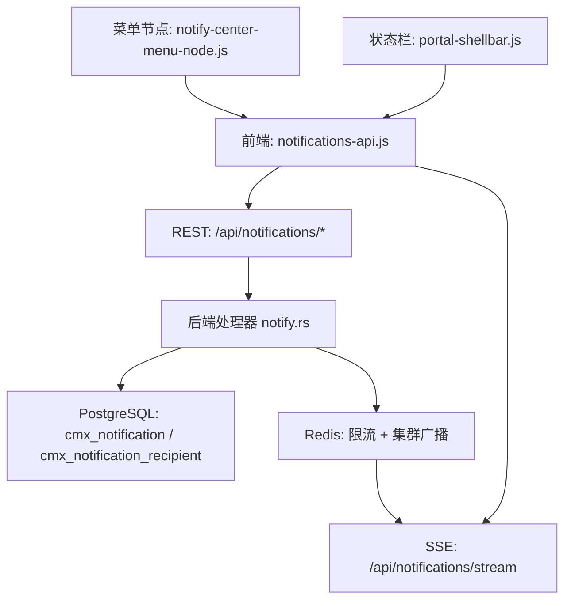
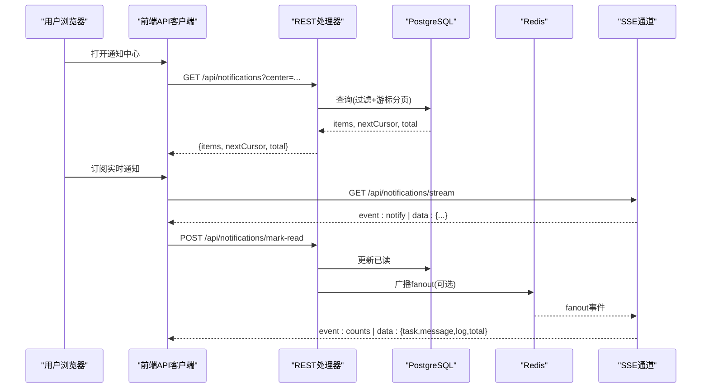
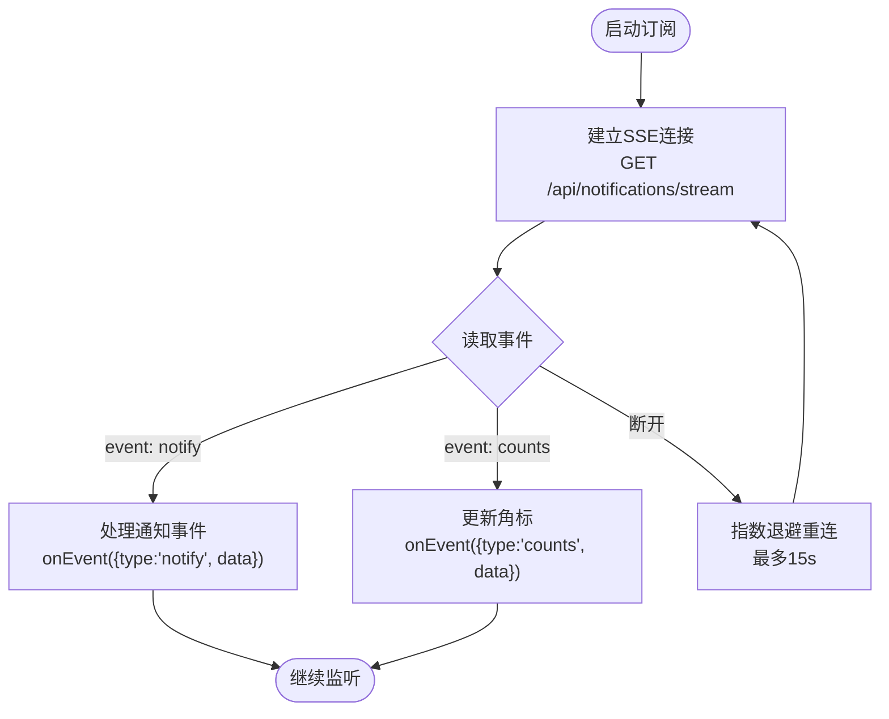
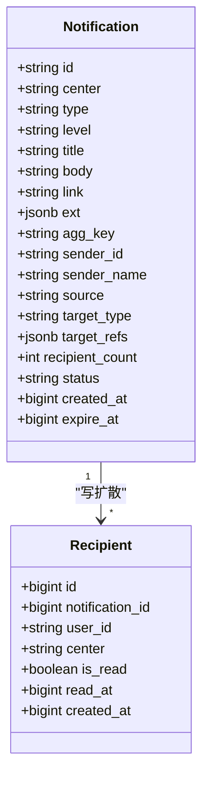
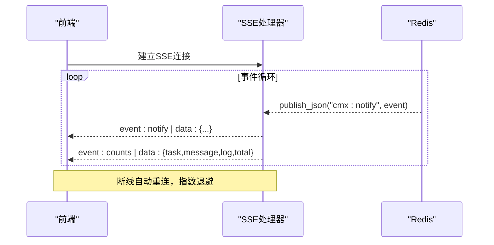
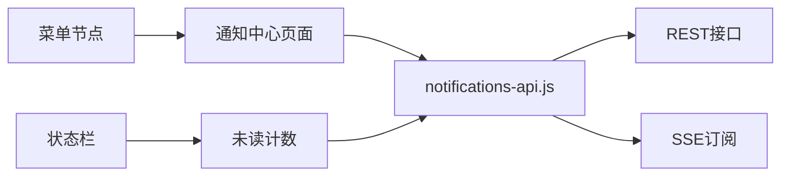
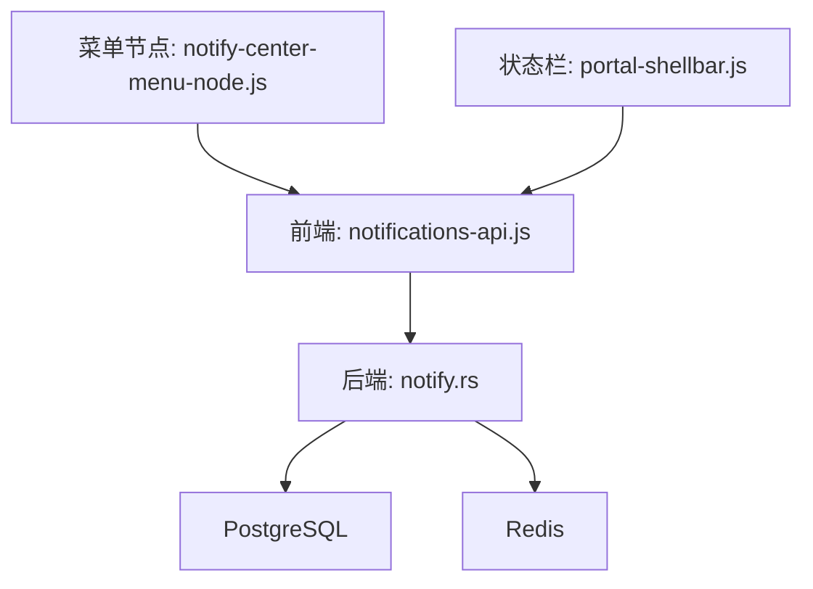

# 通知中心 API

<cite>
**本文引用的文件**
- [CMXPortalManager/src/api/notifications-api.js](file://CMXPortalManager/src/api/notifications-api.js)
- [documents/plans/20260826_cmx-portal_通知中心数据库化与群发改造方案.md](file://documents/plans/20260826_cmx-portal_通知中心数据库化与群发改造方案.md)
- [CMXPortalManager/src/lib/notify-center-menu-node.js](file://CMXPortalManager/src/lib/notify-center-menu-node.js)
- [CMXPortalManager/src/components/portal-shellbar.js](file://CMXPortalManager/src/components/portal-shellbar.js)
- [CMXPortalManager/src/components/portal-status-bar.js](file://CMXPortalManager/src/components/portal-status-bar.js)
</cite>

## 目录
1. [简介](#简介)
2. [项目结构](#项目结构)
3. [核心组件](#核心组件)
4. [架构总览](#架构总览)
5. [详细组件分析](#详细组件分析)
6. [依赖关系分析](#依赖关系分析)
7. [性能考量](#性能考量)
8. [故障排查指南](#故障排查指南)
9. [结论](#结论)
10. [附录](#附录)

## 简介
本文件为“通知中心 API”的完整技术文档，覆盖消息推送、订阅管理、模板与渠道扩展点、实时通知（SSE）、离线消息（数据库持久化）、消息优先级（level）、用户偏好预留、WebSocket/SSE 连接管理、消息队列与异步展开、以及性能优化策略。同时提供前端集成示例与最佳实践，帮助快速接入并稳定运行。

## 项目结构
通知中心在门户前端通过统一的 API 客户端暴露 REST 能力与 SSE 订阅；后端基于 PostgreSQL 持久化，结合 Redis 进行集群广播与限流，支持多实例部署与水平扩展。前端菜单节点将任务/消息/日志三中心统一挂载到工作区，状态栏展示未读角标。

图表来源
- [CMXPortalManager/src/api/notifications-api.js:1-117](file://CMXPortalManager/src/api/notifications-api.js#L1-L117)
- [documents/plans/20260826_cmx-portal_通知中心数据库化与群发改造方案.md:150-162](file://documents/plans/20260826_cmx-portal_通知中心数据库化与群发改造方案.md#L150-L162)
- [documents/plans/20260826_cmx-portal_通知中心数据库化与群发改造方案.md:142-148](file://documents/plans/20260826_cmx-portal_通知中心数据库化与群发改造方案.md#L142-L148)

章节来源
- [CMXPortalManager/src/api/notifications-api.js:1-117](file://CMXPortalManager/src/api/notifications-api.js#L1-L117)
- [documents/plans/20260826_cmx-portal_通知中心数据库化与群发改造方案.md:150-162](file://documents/plans/20260826_cmx-portal_通知中心数据库化与群发改造方案.md#L150-L162)

## 核心组件
- 前端 API 客户端：封装 REST 调用与 SSE 订阅，提供自动重连、指数退避、事件解析。
- 后端处理器：实现列表查询（过滤+游标分页）、计数聚合、发布矩阵（权限/限流/聚合/异步展开）、已读标记、SSE 广播。
- 数据层：两表设计（主体表与收件明细表），索引优化，清理任务与异步展开任务。
- 集群广播：Redis pub/sub 跨实例广播，SSE handler 接收 fanout 事件后向当前连接用户推送 counts。
- 前端集成：菜单节点、状态栏角标、通知中心页面（筛选/分页/link 跳转）。

章节来源
- [CMXPortalManager/src/api/notifications-api.js:1-117](file://CMXPortalManager/src/api/notifications-api.js#L1-L117)
- [documents/plans/20260826_cmx-portal_通知中心数据库化与群发改造方案.md:47-93](file://documents/plans/20260826_cmx-portal_通知中心数据库化与群发改造方案.md#L47-L93)
- [documents/plans/20260826_cmx-portal_通知中心数据库化与群发改造方案.md:131-148](file://documents/plans/20260826_cmx-portal_通知中心数据库化与群发改造方案.md#L131-L148)

## 架构总览
通知中心采用“REST + SSE”的组合模式：
- REST 负责拉取列表、计数、发布、标记已读等请求式操作。
- SSE 用于服务端主动推送新通知与角标刷新，具备自动重连与指数退避。
- 后端使用 PostgreSQL 持久化，Redis 做限流与集群广播，保证多实例一致性。
- 前端通过菜单节点与工作区视图加载通知中心页面，状态栏显示未读数。

图表来源
- [CMXPortalManager/src/api/notifications-api.js:20-48](file://CMXPortalManager/src/api/notifications-api.js#L20-L48)
- [CMXPortalManager/src/api/notifications-api.js:56-88](file://CMXPortalManager/src/api/notifications-api.js#L56-L88)
- [documents/plans/20260826_cmx-portal_通知中心数据库化与群发改造方案.md:131-162](file://documents/plans/20260826_cmx-portal_通知中心数据库化与群发改造方案.md#L131-L162)
- [documents/plans/20260826_cmx-portal_通知中心数据库化与群发改造方案.md:142-148](file://documents/plans/20260826_cmx-portal_通知中心数据库化与群发改造方案.md#L142-L148)

## 详细组件分析

### 前端 API 客户端（notifications-api.js）
- 功能要点
  - 获取通知中心元信息、计数、列表、标记已读、发布通知。
  - SSE 订阅：使用 fetch + 流读取 text/event-stream，解析 event/data，回调 onEvent({ type, data })。
  - 自动重连：指数退避，最长 15s；支持 stop() 停止。
- 关键路径
  - 列表：GET /api/notifications?center=...
  - 计数：GET /api/notifications/counts
  - 发布：POST /api/notifications/publish
  - 已读：POST /api/notifications/mark-read
  - 实时：GET /api/notifications/stream

图表来源
- [CMXPortalManager/src/api/notifications-api.js:56-117](file://CMXPortalManager/src/api/notifications-api.js#L56-L117)

章节来源
- [CMXPortalManager/src/api/notifications-api.js:1-117](file://CMXPortalManager/src/api/notifications-api.js#L1-L117)

### 后端处理器与数据模型（notify.rs 与 SQL）
- 路由与契约
  - GET /api/notifications：支持 type/level/isRead/limit/cursor 过滤，返回 {items, nextCursor, total(仅首页)}。
  - GET /api/notifications/centers：静态三元组 {task, message, log}。
  - GET /api/notifications/counts：{task, message, log, total}。
  - POST /api/notifications/publish：body 扩展 type/targets/expireAt/aggKey/source。
  - POST /api/notifications/mark-read：不变（center 兼容保留）。
  - GET /api/notifications/stream：新增 fanout 事件内部处理。
- 数据表
  - cmx_notification：通知主体（id, center, type, level, title, body, link, ext, agg_key, sender_id, sender_name, source, target_type, target_refs, recipient_count, status, created_at, expire_at）。
  - cmx_notification_recipient：收件明细（id, notification_id, user_id, center, is_read, read_at, created_at）。
- 后台任务
  - 清理任务：按 retention_days/retention_read_days 删除过期与已读超期数据。
  - 异步展开任务：对大收件量场景，pending 主体异步展开，分批 INSERT，幂等回写 recipient_count。
- 权限与限流
  - 群发（orgIds/roleCodes/all）限管理员；空身份服务需显式 targets。
  - Redis 限流：每用户每分钟上限（默认 30），空身份按 source 维度键。
- 聚合防刷屏
  - 同 aggKey、同收件人集、1h 窗口内命中则原子合并计数，不新增行。

图表来源
- [documents/plans/20260826_cmx-portal_通知中心数据库化与群发改造方案.md:47-93](file://documents/plans/20260826_cmx-portal_通知中心数据库化与群发改造方案.md#L47-L93)
- [documents/plans/20260826_cmx-portal_通知中心数据库化与群发改造方案.md:131-148](file://documents/plans/20260826_cmx-portal_通知中心数据库化与群发改造方案.md#L131-L148)

章节来源
- [documents/plans/20260826_cmx-portal_通知中心数据库化与群发改造方案.md:150-162](file://documents/plans/20260826_cmx-portal_通知中心数据库化与群发改造方案.md#L150-L162)
- [documents/plans/20260826_cmx-portal_通知中心数据库化与群发改造方案.md:47-93](file://documents/plans/20260826_cmx-portal_通知中心数据库化与群发改造方案.md#L47-L93)

### 实时通知与 SSE 连接管理
- 前端使用 fetch 流式读取 SSE，解析 event/data，支持自动重连与指数退避。
- 后端通过 Redis 广播 fanout 事件，SSE handler 收到后向当前连接用户推送 counts，确保多实例一致。
- 错误处理：网络异常或断线时自动重试；最大退避时间 15s。

图表来源
- [CMXPortalManager/src/api/notifications-api.js:56-117](file://CMXPortalManager/src/api/notifications-api.js#L56-L117)
- [documents/plans/20260826_cmx-portal_通知中心数据库化与群发改造方案.md:142-148](file://documents/plans/20260826_cmx-portal_通知中心数据库化与群发改造方案.md#L142-L148)

章节来源
- [CMXPortalManager/src/api/notifications-api.js:56-117](file://CMXPortalManager/src/api/notifications-api.js#L56-L117)
- [documents/plans/20260826_cmx-portal_通知中心数据库化与群发改造方案.md:142-148](file://documents/plans/20260826_cmx-portal_通知中心数据库化与群发改造方案.md#L142-L148)

### 离线消息与持久化
- 所有通知写入 PostgreSQL，支持分页、过滤、统计。
- 清理任务定期删除过期与已读超期数据，控制表增长。
- 异步展开任务保障数万收件人场景下的吞吐与稳定性。

章节来源
- [documents/plans/20260826_cmx-portal_通知中心数据库化与群发改造方案.md:137-141](file://documents/plans/20260826_cmx-portal_通知中心数据库化与群发改造方案.md#L137-L141)

### 消息优先级与用户偏好
- 优先级：level 字段支持 info/success/warning/error，便于前端差异化展示。
- 用户偏好：预留扩展点 cmx_notification_preference(user_id, type, channel, enabled)，后续可支持免打扰与渠道开关。

章节来源
- [documents/plans/20260826_cmx-portal_通知中心数据库化与群发改造方案.md:50-69](file://documents/plans/20260826_cmx-portal_通知中心数据库化与群发改造方案.md#L50-L69)
- [documents/plans/20260826_cmx-portal_通知中心数据库化与群发改造方案.md:213-222](file://documents/plans/20260826_cmx-portal_通知中心数据库化与群发改造方案.md#L213-L222)

### 模板引擎与渠道分发
- 模板引擎：当前以结构化字段（title/body/link/ext）为主，ext 支持业务扩展负载；未来可扩展模板渲染。
- 渠道分发：预留独立 outbox 表 cmx_notification_delivery(recipient_id, channel, address, status, attempts...)，支持邮件/webhook 等外部渠道投递，与站内通知正交。

章节来源
- [documents/plans/20260826_cmx-portal_通知中心数据库化与群发改造方案.md:213-222](file://documents/plans/20260826_cmx-portal_通知中心数据库化与群发改造方案.md#L213-L222)

### WebSocket 与替代方案说明
- 当前实现采用 SSE 而非 WebSocket；SSE 具备自动重连、简单事件协议，适合服务器推送到浏览器的场景。
- 若需双向通信，可在现有 SSE 基础上叠加 WebSocket 通道，但需注意鉴权与会话一致性。

章节来源
- [CMXPortalManager/src/api/notifications-api.js:56-117](file://CMXPortalManager/src/api/notifications-api.js#L56-L117)

### 前端集成与菜单节点
- 菜单节点：createNotifyCenterMenuNode 根据 center（task/message/log）生成工作区节点，打开同一 native_page 并通过 props.center 区分。
- 状态栏：设置通知中心元信息与未读计数，驱动 UI5 ShellBar 角标。
- 通知中心页面：支持筛选（type/level/仅未读）、分页（nextCursor）、角标（counts）、link 跳转（node/menu/https）。

图表来源
- [CMXPortalManager/src/lib/notify-center-menu-node.js:1-39](file://CMXPortalManager/src/lib/notify-center-menu-node.js#L1-L39)
- [CMXPortalManager/src/components/portal-shellbar.js:161-182](file://CMXPortalManager/src/components/portal-shellbar.js#L161-L182)
- [CMXPortalManager/src/api/notifications-api.js:20-48](file://CMXPortalManager/src/api/notifications-api.js#L20-L48)

章节来源
- [CMXPortalManager/src/lib/notify-center-menu-node.js:1-39](file://CMXPortalManager/src/lib/notify-center-menu-node.js#L1-L39)
- [CMXPortalManager/src/components/portal-shellbar.js:161-182](file://CMXPortalManager/src/components/portal-shellbar.js#L161-L182)
- [CMXPortalManager/src/components/portal-status-bar.js:1-231](file://CMXPortalManager/src/components/portal-status-bar.js#L1-L231)

## 依赖关系分析
- 前端依赖
  - notifications-api.js：统一封装 REST 与 SSE。
  - notify-center-menu-node.js：工作区菜单节点。
  - portal-shellbar.js：角标与通知中心入口。
- 后端依赖
  - notify.rs：处理器与业务逻辑。
  - PostgreSQL：持久化存储。
  - Redis：限流与集群广播。
- 配置项
  - retention_days/retention_read_days：数据保留策略。
  - async_fanout_threshold：异步展开阈值。
  - rate_limit_per_min：发布限流。

图表来源
- [CMXPortalManager/src/api/notifications-api.js:1-117](file://CMXPortalManager/src/api/notifications-api.js#L1-L117)
- [documents/plans/20260826_cmx-portal_通知中心数据库化与群发改造方案.md:150-162](file://documents/plans/20260826_cmx-portal_通知中心数据库化与群发改造方案.md#L150-L162)
- [CMXPortalManager/src/lib/notify-center-menu-node.js:1-39](file://CMXPortalManager/src/lib/notify-center-menu-node.js#L1-L39)
- [CMXPortalManager/src/components/portal-shellbar.js:161-182](file://CMXPortalManager/src/components/portal-shellbar.js#L161-L182)

章节来源
- [CMXPortalManager/src/api/notifications-api.js:1-117](file://CMXPortalManager/src/api/notifications-api.js#L1-L117)
- [documents/plans/20260826_cmx-portal_通知中心数据库化与群发改造方案.md:150-162](file://documents/plans/20260826_cmx-portal_通知中心数据库化与群发改造方案.md#L150-L162)

## 性能考量
- 分页与过滤：keyset 分页（cursor=(created_at,id)），避免深翻页性能问题。
- 异步展开：收件人超过阈值（默认 2000）时转为后台任务，分批插入，降低同步阻塞。
- 聚合防刷屏：同 aggKey 与收件人集在 1h 窗口内合并计数，减少重复通知。
- 清理任务：按保留策略定时清理，控制表增长。
- 限流：Redis 限流保护后端，防止滥用。
- 集群广播：Redis pub/sub 保证多实例一致性，SSE 推送 counts 实时更新角标。

章节来源
- [documents/plans/20260826_cmx-portal_通知中心数据库化与群发改造方案.md:125-141](file://documents/plans/20260826_cmx-portal_通知中心数据库化与群发改造方案.md#L125-L141)
- [documents/plans/20260826_cmx-portal_通知中心数据库化与群发改造方案.md:142-148](file://documents/plans/20260826_cmx-portal_通知中心数据库化与群发改造方案.md#L142-L148)

## 故障排查指南
- SSE 连接失败
  - 检查网络与鉴权头；确认 /api/notifications/stream 可达。
  - 观察前端自动重连日志与退避策略。
- 角标不更新
  - 确认 SSE 事件类型包含 counts；检查 Redis 广播是否正常。
  - 验证后端 counts 接口返回形状 {task, message, log, total}。
- 发布失败
  - 400：收件人为空或服务身份缺少 targets。
  - 403：非管理员尝试群发。
  - 429：触发限流，检查 rate_limit_per_min 配置。
- 数据膨胀
  - 检查清理任务是否正常运行；确认 retention_days/retention_read_days 配置合理。
- MDM 死信通知
  - 确保 camelCase 字段与 targets 双数组防御；补充 type/aggKey/expireAt。

章节来源
- [CMXPortalManager/src/api/notifications-api.js:56-117](file://CMXPortalManager/src/api/notifications-api.js#L56-L117)
- [documents/plans/20260826_cmx-portal_通知中心数据库化与群发改造方案.md:125-162](file://documents/plans/20260826_cmx-portal_通知中心数据库化与群发改造方案.md#L125-L162)

## 结论
通知中心 API 通过 REST + SSE 的组合，实现了高可用、可扩展的企业级通知能力。基于 PostgreSQL 的持久化与 Redis 的集群广播，保障了多实例一致性与实时性。前端集成简洁，支持筛选、分页、角标与链接跳转。通过限流、聚合、异步展开与清理任务，系统在高并发与大数据量下保持稳定。预留的用户偏好与渠道分发扩展点为未来演进奠定基础。

## 附录

### API 参考（摘要）
- GET /api/notifications：列表查询（支持 type/level/isRead/limit/cursor）
- GET /api/notifications/centers：中心元信息
- GET /api/notifications/counts：未读计数
- POST /api/notifications/publish：发布通知（支持 type/targets/expireAt/aggKey/source）
- POST /api/notifications/mark-read：标记已读
- GET /api/notifications/stream：SSE 实时推送（event: notify/counts）

章节来源
- [documents/plans/20260826_cmx-portal_通知中心数据库化与群发改造方案.md:150-162](file://documents/plans/20260826_cmx-portal_通知中心数据库化与群发改造方案.md#L150-L162)

### 前端集成示例（步骤）
- 引入 notifications-api.js 提供的函数：fetchNotifyCenters、fetchNotifyCounts、fetchNotifications、publishNotification、markNotificationRead、subscribeNotifyStream。
- 初始化菜单节点：createNotifyCenterMenuNode(center)。
- 设置状态栏角标：setNotifyCenters、setNotifyCounts。
- 订阅 SSE：subscribeNotifyStream(onEvent)，处理 notify/counts 事件。

章节来源
- [CMXPortalManager/src/api/notifications-api.js:20-48](file://CMXPortalManager/src/api/notifications-api.js#L20-L48)
- [CMXPortalManager/src/lib/notify-center-menu-node.js:1-39](file://CMXPortalManager/src/lib/notify-center-menu-node.js#L1-L39)
- [CMXPortalManager/src/components/portal-shellbar.js:161-182](file://CMXPortalManager/src/components/portal-shellbar.js#L161-L182)