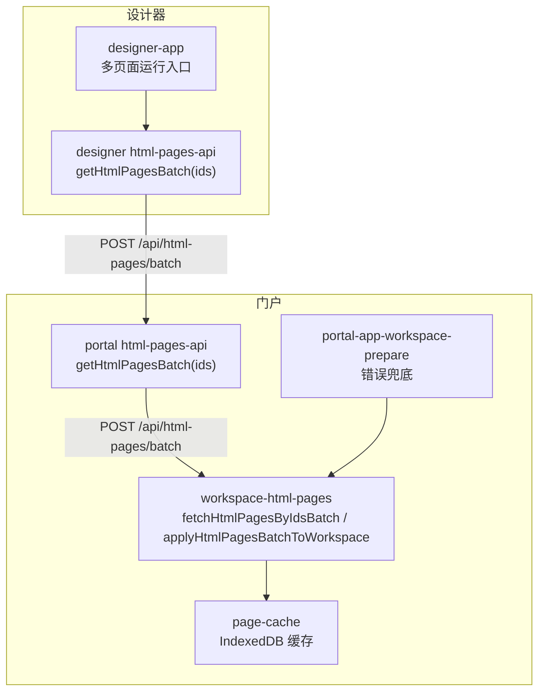
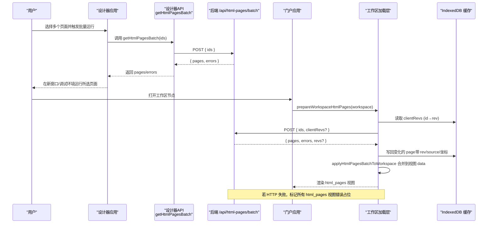
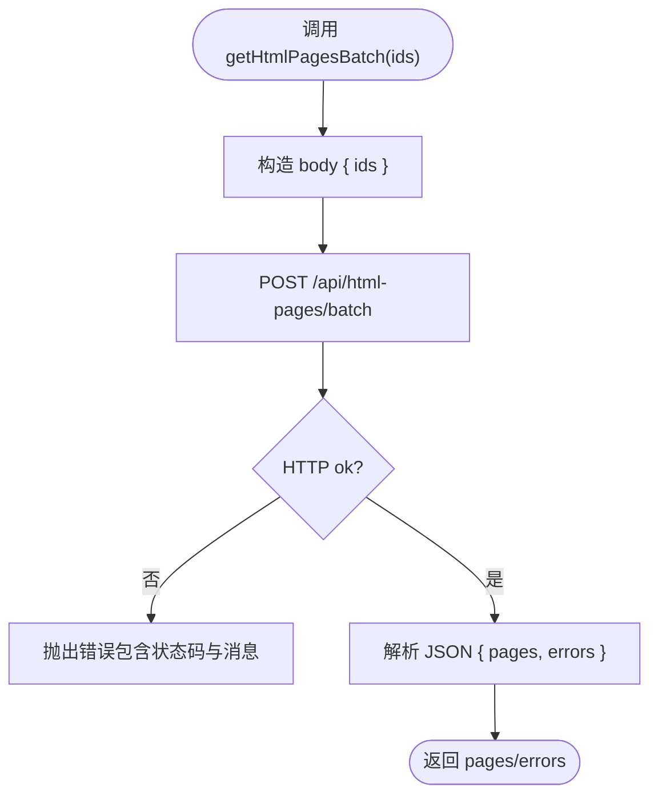
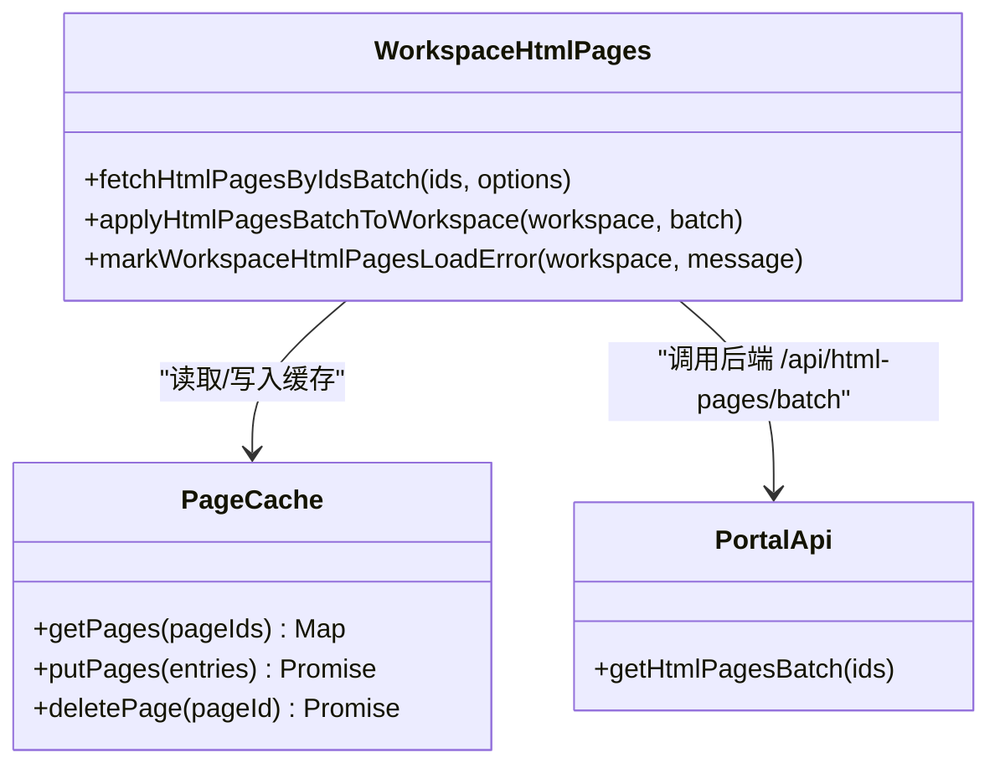
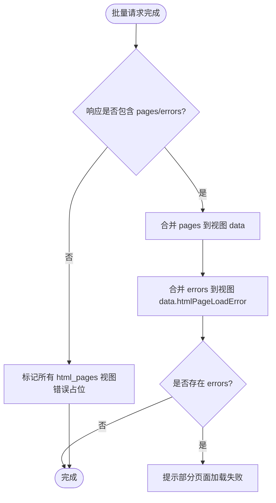
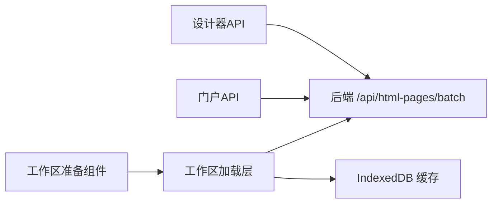

# 批量操作接口

<cite>
**本文引用的文件**
- [CMXHTMLDesigner/src/api/html-pages-api.js](file://CMXHTMLDesigner/src/api/html-pages-api.js)
- [CMXPortalManager/src/api/html-pages-api.js](file://CMXPortalManager/src/api/html-pages-api.js)
- [CMXPortalManager/src/lib/workspace-html-pages.js](file://CMXPortalManager/src/lib/workspace-html-pages.js)
- [CMXPortalManager/src/components/portal-app-workspace-prepare.js](file://CMXPortalManager/src/components/portal-app-workspace-prepare.js)
- [CMXPortalManager/src/lib/page-cache.js](file://CMXPortalManager/src/lib/page-cache.js)
- [CMXHTMLDesigner/src/components/designer-app.js](file://CMXHTMLDesigner/src/components/designer-app.js)
</cite>

## 目录
1. [简介](#简介)
2. [项目结构](#项目结构)
3. [核心组件](#核心组件)
4. [架构总览](#架构总览)
5. [详细组件分析](#详细组件分析)
6. [依赖关系分析](#依赖关系分析)
7. [性能考虑](#性能考虑)
8. [故障排查指南](#故障排查指南)
9. [结论](#结论)
10. [附录：集成示例与最佳实践](#附录：集成示例与最佳实践)

## 简介
本文件聚焦于“批量获取页面完整定义”的接口与前端实现，重点说明 getHtmlPagesBatch 方法的设计、参数格式、响应结构（pages 数组与 errors 数组）的处理方式，以及在设计器与门户中的实际使用场景与性能优化建议。同时给出错误处理策略，覆盖部分成功的情况，并提供完整的集成示例，帮助你在设计器和门户中高效地批量加载页面数据。

## 项目结构
围绕批量页面加载的关键代码分布在以下模块：
- 设计器侧 API 封装：CMXHTMLDesigner/src/api/html-pages-api.js
- 门户侧 API 封装：CMXPortalManager/src/api/html-pages-api.js
- 工作区 HTML 页加载层（含差异同步、缓存、渲染）：CMXPortalManager/src/lib/workspace-html-pages.js
- 工作区准备与错误兜底：CMXPortalManager/src/components/portal-app-workspace-prepare.js
- 页面源码 IndexedDB 持久缓存：CMXPortalManager/src/lib/page-cache.js
- 设计器多页面运行入口：CMXHTMLDesigner/src/components/designer-app.js

图表来源
- [CMXHTMLDesigner/src/api/html-pages-api.js:80-93](file://CMXHTMLDesigner/src/api/html-pages-api.js#L80-L93)
- [CMXPortalManager/src/api/html-pages-api.js:44-51](file://CMXPortalManager/src/api/html-pages-api.js#L44-L51)
- [CMXPortalManager/src/lib/workspace-html-pages.js:163-270](file://CMXPortalManager/src/lib/workspace-html-pages.js#L163-L270)
- [CMXPortalManager/src/lib/page-cache.js:100-133](file://CMXPortalManager/src/lib/page-cache.js#L100-L133)
- [CMXPortalManager/src/components/portal-app-workspace-prepare.js:16-33](file://CMXPortalManager/src/components/portal-app-workspace-prepare.js#L16-L33)

章节来源
- [CMXHTMLDesigner/src/api/html-pages-api.js:1-94](file://CMXHTMLDesigner/src/api/html-pages-api.js#L1-L94)
- [CMXPortalManager/src/api/html-pages-api.js:1-52](file://CMXPortalManager/src/api/html-pages-api.js#L1-L52)
- [CMXPortalManager/src/lib/workspace-html-pages.js:1-423](file://CMXPortalManager/src/lib/workspace-html-pages.js#L1-L423)
- [CMXPortalManager/src/lib/page-cache.js:1-293](file://CMXPortalManager/src/lib/page-cache.js#L1-L293)
- [CMXPortalManager/src/components/portal-app-workspace-prepare.js:1-140](file://CMXPortalManager/src/components/portal-app-workspace-prepare.js#L1-L140)
- [CMXHTMLDesigner/src/components/designer-app.js:150-185](file://CMXHTMLDesigner/src/components/designer-app.js#L150-L185)

## 核心组件
- 设计器批量接口封装：提供 getHtmlPagesBatch(ids)，直接 POST /api/html-pages/batch，返回 { pages, errors }。
- 门户批量接口封装：同样暴露 getHtmlPagesBatch(ids)，通过统一 apiPost 调用后端，自动携带认证并解包信封。
- 工作区加载层：负责收集需要加载的页面 ID、构建 clientRevs、发起 batch 请求、合并响应到 workspace 视图、处理差异命中与缓存回补。
- 页面缓存：基于 IndexedDB 的 LRU 缓存，支持批量读取/写入、配额超限淘汰、持久化存储请求。
- 错误兜底：当 batch 整体失败时，为所有 html_pages 视图写入错误占位，避免误认为未配置。

章节来源
- [CMXHTMLDesigner/src/api/html-pages-api.js:80-93](file://CMXHTMLDesigner/src/api/html-pages-api.js#L80-L93)
- [CMXPortalManager/src/api/html-pages-api.js:44-51](file://CMXPortalManager/src/api/html-pages-api.js#L44-L51)
- [CMXPortalManager/src/lib/workspace-html-pages.js:103-124](file://CMXPortalManager/src/lib/workspace-html-pages.js#L103-L124)
- [CMXPortalManager/src/lib/page-cache.js:100-133](file://CMXPortalManager/src/lib/page-cache.js#L100-L133)
- [CMXPortalManager/src/components/portal-app-workspace-prepare.js:21-33](file://CMXPortalManager/src/components/portal-app-workspace-prepare.js#L21-L33)

## 架构总览
批量加载的核心流程如下：
- 设计器侧：选择多个页面 → 调用 getHtmlPagesBatch(ids) → 获得 pages/errors → 在新窗口或调试环境中运行这些页面。
- 门户侧：打开工作区节点 → 收集 html_pages 视图的 id 列表 → 构建 clientRevs（从 IndexedDB 读取）→ 发起 POST /api/html-pages/batch → 将 pages 和 errors 合并进 workspace 各视图 data → 渲染 html_pages 视图；若整体失败，标记错误占位。

图表来源
- [CMXHTMLDesigner/src/api/html-pages-api.js:80-93](file://CMXHTMLDesigner/src/api/html-pages-api.js#L80-L93)
- [CMXPortalManager/src/lib/workspace-html-pages.js:163-270](file://CMXPortalManager/src/lib/workspace-html-pages.js#L163-L270)
- [CMXPortalManager/src/lib/page-cache.js:100-133](file://CMXPortalManager/src/lib/page-cache.js#L100-L133)
- [CMXPortalManager/src/components/portal-app-workspace-prepare.js:21-33](file://CMXPortalManager/src/components/portal-app-workspace-prepare.js#L21-L33)

## 详细组件分析

### 设计器端批量接口：getHtmlPagesBatch
- 功能：按页面 ID 批量获取完整定义（包含 html）。
- 请求：POST /api/html-pages/batch，body 为 { ids: string[] }。
- 响应：{ pages: object[], errors: { id: string, error: string }[] }。
- 错误处理：HTTP 非 2xx 抛错；调用方在多处捕获并提示“部分页面加载失败”。

图表来源
- [CMXHTMLDesigner/src/api/html-pages-api.js:80-93](file://CMXHTMLDesigner/src/api/html-pages-api.js#L80-L93)

章节来源
- [CMXHTMLDesigner/src/api/html-pages-api.js:80-93](file://CMXHTMLDesigner/src/api/html-pages-api.js#L80-L93)
- [CMXHTMLDesigner/src/components/designer-app.js:150-185](file://CMXHTMLDesigner/src/components/designer-app.js#L150-L185)

### 门户端批量接口与工作区加载层
- 门户 API：getHtmlPagesBatch(ids) 通过统一 apiPost 调用后端，自动携带登录令牌并解包信封。
- 工作区加载层：
  - 收集需要加载的页面 ID。
  - 构建 clientRevs（从 IndexedDB 读取），用于差异同步。
  - 发起 POST /api/html-pages/batch，body 可能包含 clientRevs。
  - 合并响应：
    - pages：更新对应视图 data.htmlPage 等字段。
    - errors：映射到视图 data.htmlPageLoadError。
  - 差异命中：若服务端省略了 body（diff 命中），从 IndexedDB 恢复 source 并注入 pages，保证下游逻辑一致。
  - 写回缓存：变化的 page 写回 IndexedDB，附带 rev/source/坐标。

图表来源
- [CMXPortalManager/src/lib/workspace-html-pages.js:163-270](file://CMXPortalManager/src/lib/workspace-html-pages.js#L163-L270)
- [CMXPortalManager/src/lib/page-cache.js:100-133](file://CMXPortalManager/src/lib/page-cache.js#L100-L133)
- [CMXPortalManager/src/api/html-pages-api.js:44-51](file://CMXPortalManager/src/api/html-pages-api.js#L44-L51)

章节来源
- [CMXPortalManager/src/api/html-pages-api.js:44-51](file://CMXPortalManager/src/api/html-pages-api.js#L44-L51)
- [CMXPortalManager/src/lib/workspace-html-pages.js:103-124](file://CMXPortalManager/src/lib/workspace-html-pages.js#L103-L124)
- [CMXPortalManager/src/lib/workspace-html-pages.js:163-270](file://CMXPortalManager/src/lib/workspace-html-pages.js#L163-L270)
- [CMXPortalManager/src/lib/page-cache.js:100-133](file://CMXPortalManager/src/lib/page-cache.js#L100-L133)

### 错误处理策略（部分成功）
- 部分失败：errors 数组中包含失败的 id 及错误信息；调用方可根据 errors 进行提示或降级处理。
- 整体失败：当 HTTP 层失败（无法拿到 per-id errors）时，工作区加载层会为所有 html_pages 视图写入错误占位，避免误认为未配置。
- 设计器侧：对 errors 进行聚合提示，并在无有效 pages 时抛出错误，阻止后续运行。

图表来源
- [CMXPortalManager/src/lib/workspace-html-pages.js:103-124](file://CMXPortalManager/src/lib/workspace-html-pages.js#L103-L124)
- [CMXPortalManager/src/components/portal-app-workspace-prepare.js:21-33](file://CMXPortalManager/src/components/portal-app-workspace-prepare.js#L21-L33)
- [CMXHTMLDesigner/src/components/designer-app.js:150-185](file://CMXHTMLDesigner/src/components/designer-app.js#L150-L185)

章节来源
- [CMXPortalManager/src/lib/workspace-html-pages.js:103-124](file://CMXPortalManager/src/lib/workspace-html-pages.js#L103-L124)
- [CMXPortalManager/src/components/portal-app-workspace-prepare.js:21-33](file://CMXPortalManager/src/components/portal-app-workspace-prepare.js#L21-L33)
- [CMXHTMLDesigner/src/components/designer-app.js:150-185](file://CMXHTMLDesigner/src/components/designer-app.js#L150-L185)

## 依赖关系分析
- 设计器 API 与门户 API 均依赖后端 /api/html-pages/batch。
- 工作区加载层依赖 IndexedDB 缓存以支持差异同步与离线回退。
- 门户工作区准备组件在工作区加载层失败时进行错误兜底，确保用户体验。

图表来源
- [CMXHTMLDesigner/src/api/html-pages-api.js:80-93](file://CMXHTMLDesigner/src/api/html-pages-api.js#L80-L93)
- [CMXPortalManager/src/api/html-pages-api.js:44-51](file://CMXPortalManager/src/api/html-pages-api.js#L44-L51)
- [CMXPortalManager/src/lib/workspace-html-pages.js:163-270](file://CMXPortalManager/src/lib/workspace-html-pages.js#L163-L270)
- [CMXPortalManager/src/lib/page-cache.js:100-133](file://CMXPortalManager/src/lib/page-cache.js#L100-L133)
- [CMXPortalManager/src/components/portal-app-workspace-prepare.js:21-33](file://CMXPortalManager/src/components/portal-app-workspace-prepare.js#L21-L33)

章节来源
- [CMXHTMLDesigner/src/api/html-pages-api.js:80-93](file://CMXHTMLDesigner/src/api/html-pages-api.js#L80-L93)
- [CMXPortalManager/src/api/html-pages-api.js:44-51](file://CMXPortalManager/src/api/html-pages-api.js#L44-L51)
- [CMXPortalManager/src/lib/workspace-html-pages.js:163-270](file://CMXPortalManager/src/lib/workspace-html-pages.js#L163-L270)
- [CMXPortalManager/src/lib/page-cache.js:100-133](file://CMXPortalManager/src/lib/page-cache.js#L100-L133)
- [CMXPortalManager/src/components/portal-app-workspace-prepare.js:21-33](file://CMXPortalManager/src/components/portal-app-workspace-prepare.js#L21-L33)

## 性能考虑
- 差异同步：通过 clientRevs 减少不必要的 body 传输，仅返回变化的页面，显著降低网络开销。
- 本地缓存：IndexedDB 作为持久化缓存，支持 LRU 上限（默认 500 条），避免内存压力与 localStorage 容量限制。
- CE 复用：已注册的自定义元素可直接复用模板，无需再次拉取 HTML，提升渲染性能。
- 批量 IO：批量读取/写入 IndexedDB，减少事务往返，提高吞吐。
- 配额管理：检测到 QuotaExceededError 时主动淘汰最旧条目并重试，保障写入稳定性。

章节来源
- [CMXPortalManager/src/lib/workspace-html-pages.js:163-270](file://CMXPortalManager/src/lib/workspace-html-pages.js#L163-L270)
- [CMXPortalManager/src/lib/page-cache.js:1-293](file://CMXPortalManager/src/lib/page-cache.js#L1-L293)

## 故障排查指南
- 批量请求整体失败：检查 HTTP 状态码与响应体；工作区会标记所有 html_pages 视图错误占位，便于定位问题。
- 部分页面失败：查看 errors 数组，按 id 定位具体失败原因；设计器侧会聚合提示。
- 缓存异常：确认 IndexedDB 可用性与配额；必要时清空缓存或强制刷新（bustCache）以获取最新版本。
- 差异命中导致缺失：若 diff 命中且服务端省略 body，工作区会从 IndexedDB 恢复 source；如仍缺失，检查缓存记录是否完整。

章节来源
- [CMXPortalManager/src/components/portal-app-workspace-prepare.js:21-33](file://CMXPortalManager/src/components/portal-app-workspace-prepare.js#L21-L33)
- [CMXHTMLDesigner/src/components/designer-app.js:150-185](file://CMXHTMLDesigner/src/components/designer-app.js#L150-L185)
- [CMXPortalManager/src/lib/page-cache.js:177-180](file://CMXPortalManager/src/lib/page-cache.js#L177-L180)

## 结论
getHtmlPagesBatch 提供了高效的批量页面加载能力，结合差异同步与 IndexedDB 缓存，显著降低了网络与渲染开销。设计器与门户两端均具备完善的错误处理策略，能够优雅应对部分成功与整体失败的场景。通过合理的使用与优化，可在设计器和门户中实现高性能的批量页面加载体验。

## 附录：集成示例与最佳实践
- 设计器集成：
  - 在多页面运行对话框中，收集选中页面的 ids，调用 getHtmlPagesBatch(ids)。
  - 处理返回的 pages 与 errors：对 errors 进行提示；若无有效 pages，抛出错误并阻止运行。
  - 参考路径：[designer-app.js:150-185](file://CMXHTMLDesigner/src/components/designer-app.js#L150-L185)

- 门户集成：
  - 打开工作区节点前，调用 prepareWorkspaceHtmlPages 收集 ids 并批量加载。
  - 若整体失败，调用 markWorkspaceHtmlPagesLoadError 标记错误占位，并提示用户。
  - 参考路径：
    - [workspace-html-pages.js:353-410](file://CMXPortalManager/src/lib/workspace-html-pages.js#L353-L410)
    - [portal-app-workspace-prepare.js:16-33](file://CMXPortalManager/src/components/portal-app-workspace-prepare.js#L16-L33)

- 最佳实践：
  - 优先使用批量接口而非多次单条请求，减少网络往返。
  - 利用 clientRevs 进行差异同步，仅在内容变化时传输 body。
  - 合理使用缓存与 CE 复用，避免重复解析与实例化。
  - 对 errors 进行聚合提示，提升用户体验。
  - 在配额不足时主动淘汰旧缓存，保障写入稳定性。

章节来源
- [CMXHTMLDesigner/src/components/designer-app.js:150-185](file://CMXHTMLDesigner/src/components/designer-app.js#L150-L185)
- [CMXPortalManager/src/lib/workspace-html-pages.js:353-410](file://CMXPortalManager/src/lib/workspace-html-pages.js#L353-L410)
- [CMXPortalManager/src/components/portal-app-workspace-prepare.js:16-33](file://CMXPortalManager/src/components/portal-app-workspace-prepare.js#L16-L33)