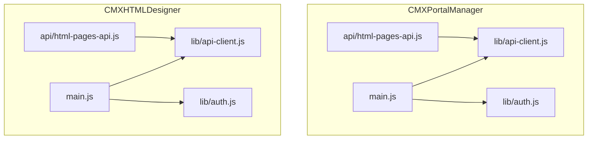
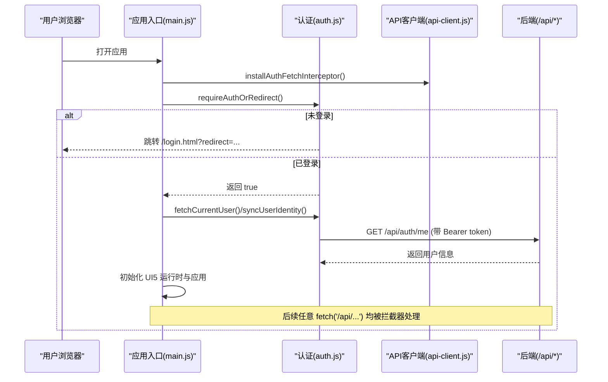
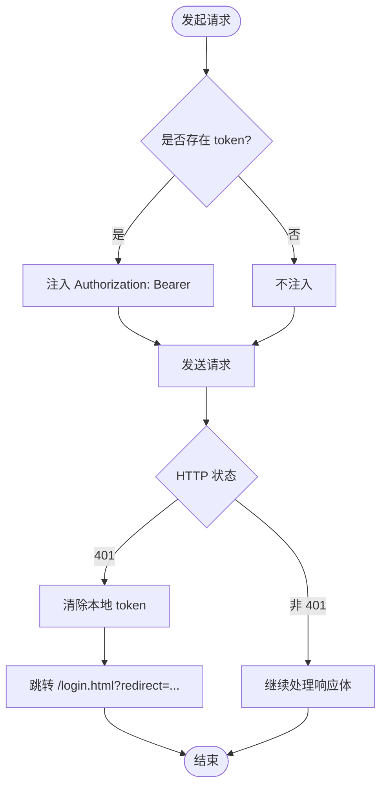
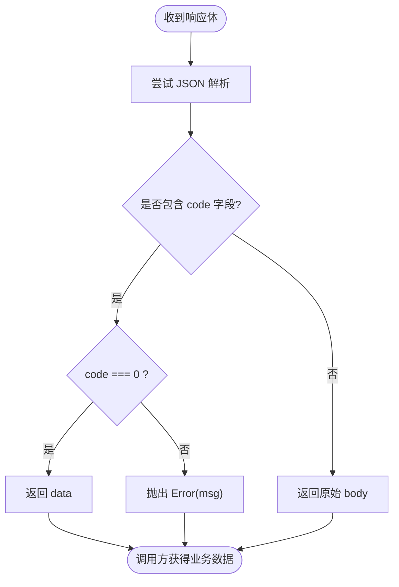
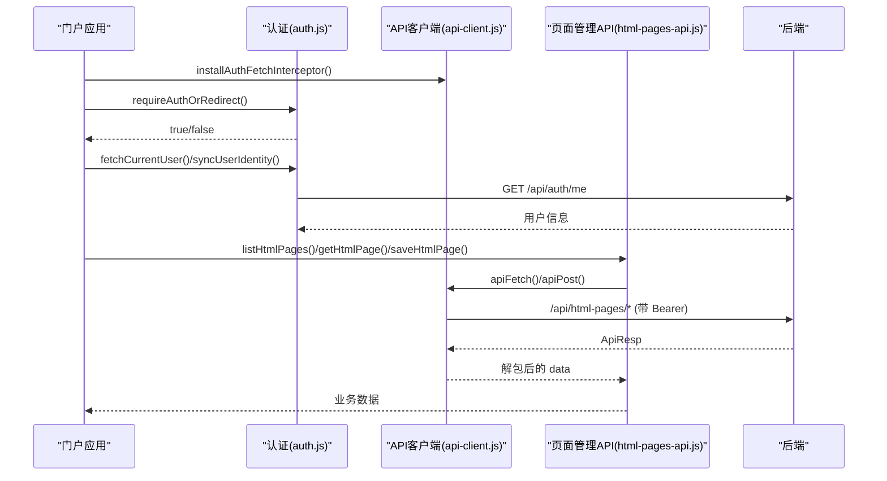
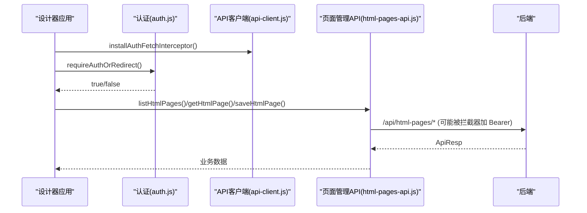
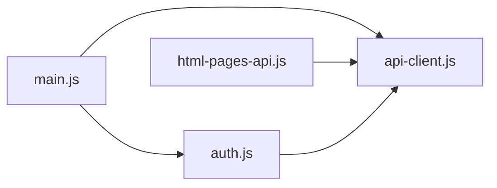

# 认证与集成

<cite>
**本文引用的文件**
- [CMXPortalManager/src/lib/api-client.js](file://CMXPortalManager/src/lib/api-client.js)
- [CMXHTMLDesigner/src/lib/api-client.js](file://CMXHTMLDesigner/src/lib/api-client.js)
- [CMXPortalManager/src/lib/auth.js](file://CMXPortalManager/src/lib/auth.js)
- [CMXHTMLDesigner/src/lib/auth.js](file://CMXHTMLDesigner/src/lib/auth.js)
- [CMXPortalManager/src/main.js](file://CMXPortalManager/src/main.js)
- [CMXHTMLDesigner/src/main.js](file://CMXHTMLDesigner/src/main.js)
- [CMXPortalManager/src/api/html-pages-api.js](file://CMXPortalManager/src/api/html-pages-api.js)
- [CMXHTMLDesigner/src/api/html-pages-api.js](file://CMXHTMLDesigner/src/api/html-pages-api.js)
- [CMXPortalManager/vite.config.js](file://CMXPortalManager/vite.config.js)
- [CMXHTMLDesigner/vite.config.js](file://CMXHTMLDesigner/vite.config.js)
</cite>

## 目录
1. [简介](#简介)
2. [项目结构](#项目结构)
3. [核心组件](#核心组件)
4. [架构总览](#架构总览)
5. [详细组件分析](#详细组件分析)
6. [依赖关系分析](#依赖关系分析)
7. [性能考虑](#性能考虑)
8. [故障排查指南](#故障排查指南)
9. [结论](#结论)
10. [附录：环境配置与跨域安全](#附录：环境配置与跨域安全)

## 简介
本文件面向页面管理 API 的认证与集成，聚焦以下目标：
- 说明 apiFetch 与 apiPost 的自动认证机制、令牌管理与 401 未授权跳转逻辑。
- 解释 ApiResp 信封的解包过程与数据提取方式。
- 给出开发、测试、生产环境的配置示例与跨域处理方案。
- 提供在 CMXPortalManager 与 CMXHTMLDesigner 中的完整集成步骤与最佳实践。

## 项目结构
两个前端应用（门户管理器与 HTML 设计器）共享相同的认证与 API 客户端模式：
- 统一入口安装全局 fetch 拦截器，为所有 /api/* 请求注入 Authorization 头并统一处理 401。
- 登录流程通过 /api/auth/* 完成，成功后将 access_token 与 refresh_token 写入 localStorage。
- 业务 API 调用优先使用 apiFetch/apiPost 等封装方法；若直接使用 fetch，也会被拦截器覆盖。

**图表来源**
- [CMXPortalManager/src/main.js:1-49](file://CMXPortalManager/src/main.js#L1-L49)
- [CMXHTMLDesigner/src/main.js:1-29](file://CMXHTMLDesigner/src/main.js#L1-L29)
- [CMXPortalManager/src/lib/api-client.js:175-259](file://CMXPortalManager/src/lib/api-client.js#L175-L259)
- [CMXHTMLDesigner/src/lib/api-client.js:167-245](file://CMXHTMLDesigner/src/lib/api-client.js#L167-L245)
- [CMXPortalManager/src/api/html-pages-api.js:1-52](file://CMXPortalManager/src/api/html-pages-api.js#L1-L52)
- [CMXHTMLDesigner/src/api/html-pages-api.js:1-94](file://CMXHTMLDesigner/src/api/html-pages-api.js#L1-L94)

**章节来源**
- [CMXPortalManager/src/main.js:1-49](file://CMXPortalManager/src/main.js#L1-L49)
- [CMXHTMLDesigner/src/main.js:1-29](file://CMXHTMLDesigner/src/main.js#L1-L29)

## 核心组件
- 统一 API 客户端（api-client.js）
  - 提供 getToken/setTokens/clearTokens 管理本地令牌。
  - 提供 apiFetch/apiGet/apiPost/apiDelete 封装，自动注入 Authorization、解析 ApiResp 信封、处理 401。
  - 提供 installAuthFetchInterceptor() 全局拦截器，对 window.fetch 进行增强。
- 认证助手（auth.js）
  - 对接 /api/auth/*，实现 login/logout/fetchCurrentUser/requireAuthOrRedirect 等。
  - 登录成功后写入 access_token 与 refresh_token，并可选同步用户身份到 localStorage。
- 页面管理 API（html-pages-api.js）
  - 列表、获取、保存、批量获取页面定义等接口封装，统一走 apiFetch/apiPost。

**章节来源**
- [CMXPortalManager/src/lib/api-client.js:1-166](file://CMXPortalManager/src/lib/api-client.js#L1-L166)
- [CMXHTMLDesigner/src/lib/api-client.js:1-158](file://CMXHTMLDesigner/src/lib/api-client.js#L1-L158)
- [CMXPortalManager/src/lib/auth.js:1-121](file://CMXPortalManager/src/lib/auth.js#L1-L121)
- [CMXHTMLDesigner/src/lib/auth.js:1-100](file://CMXHTMLDesigner/src/lib/auth.js#L1-L100)
- [CMXPortalManager/src/api/html-pages-api.js:1-52](file://CMXPortalManager/src/api/html-pages-api.js#L1-L52)
- [CMXHTMLDesigner/src/api/html-pages-api.js:1-94](file://CMXHTMLDesigner/src/api/html-pages-api.js#L1-L94)

## 架构总览
下图展示了从页面加载到 API 调用的完整链路，包括全局拦截器的安装、登录校验、令牌注入、信封解包与 401 跳转。

**图表来源**
- [CMXPortalManager/src/main.js:16-43](file://CMXPortalManager/src/main.js#L16-L43)
- [CMXHTMLDesigner/src/main.js:11-23](file://CMXHTMLDesigner/src/main.js#L11-L23)
- [CMXPortalManager/src/lib/auth.js:85-121](file://CMXPortalManager/src/lib/auth.js#L85-L121)
- [CMXHTMLDesigner/src/lib/auth.js:64-99](file://CMXHTMLDesigner/src/lib/auth.js#L64-L99)
- [CMXPortalManager/src/lib/api-client.js:175-259](file://CMXPortalManager/src/lib/api-client.js#L175-L259)
- [CMXHTMLDesigner/src/lib/api-client.js:167-245](file://CMXHTMLDesigner/src/lib/api-client.js#L167-L245)

## 详细组件分析

### 自动认证机制与 401 跳转
- 令牌存储
  - 访问令牌键名：cmx_access_token
  - 刷新令牌键名：cmx_refresh_token
  - 读写由 getToken/setTokens/clearTokens 统一管理，异常时静默降级。
- 自动注入 Authorization
  - apiFetch 在发起请求前读取本地 token，若存在且未显式设置 Authorization，则自动添加 Bearer token。
  - 全局拦截器会对所有同源 /api/* 请求注入 Authorization，并对 /api/auth/* 跳过注入（登录/刷新本身不需要）。
- 401 未授权处理
  - 当响应状态为 401 且非认证端点时，清除本地 token 并跳转到登录页，携带当前路径作为回跳参数。
  - 登录页地址基于 BASE_URL 计算，避免 base-aware 部署下的 404 白屏问题。
- 幂等安装
  - 全局拦截器仅安装一次，重复调用不会重复 patch。

**图表来源**
- [CMXPortalManager/src/lib/api-client.js:83-130](file://CMXPortalManager/src/lib/api-client.js#L83-L130)
- [CMXHTMLDesigner/src/lib/api-client.js:75-122](file://CMXHTMLDesigner/src/lib/api-client.js#L75-L122)
- [CMXPortalManager/src/lib/api-client.js:175-259](file://CMXPortalManager/src/lib/api-client.js#L175-L259)
- [CMXHTMLDesigner/src/lib/api-client.js:167-245](file://CMXHTMLDesigner/src/lib/api-client.js#L167-L245)

**章节来源**
- [CMXPortalManager/src/lib/api-client.js:15-73](file://CMXPortalManager/src/lib/api-client.js#L15-L73)
- [CMXHTMLDesigner/src/lib/api-client.js:15-65](file://CMXHTMLDesigner/src/lib/api-client.js#L15-L65)

### ApiResp 信封解包与数据提取
- 信封格式
  - 成功：{ code: 0, msg: string, data: T }
  - 失败：code !== 0，msg 描述错误信息
- 解包策略
  - apiFetch/apiPost 等封装方法：若 code === 0，直接返回 data；否则抛出 Error，消息取自 msg。
  - 兼容老后端裸错误：若响应体包含 error 字段，也会作为错误消息。
  - 全局拦截器透明拆信封：对于 JSON 响应，成功时将内层 data 包装成新的 Response，使 res.json() 直接拿到 data；业务错误映射为非 2xx + { error, msg, code }，保持 res.ok=false 便于上层捕获。
- 特殊场景
  - rawResponse=true：用于下载或二进制流，不拆信封，但 401 仍会触发跳转。
  - 非 JSON 响应：原样透传，不进行信封处理。

**图表来源**
- [CMXPortalManager/src/lib/api-client.js:110-130](file://CMXPortalManager/src/lib/api-client.js#L110-L130)
- [CMXHTMLDesigner/src/lib/api-client.js:102-122](file://CMXHTMLDesigner/src/lib/api-client.js#L102-L122)
- [CMXPortalManager/src/lib/api-client.js:220-259](file://CMXPortalManager/src/lib/api-client.js#L220-L259)
- [CMXHTMLDesigner/src/lib/api-client.js:216-245](file://CMXHTMLDesigner/src/lib/api-client.js#L216-L245)

**章节来源**
- [CMXPortalManager/src/lib/api-client.js:1-166](file://CMXPortalManager/src/lib/api-client.js#L1-L166)
- [CMXHTMLDesigner/src/lib/api-client.js:1-158](file://CMXHTMLDesigner/src/lib/api-client.js#L1-L158)

### 在不同环境下的配置示例
- 环境变量
  - VITE_API_BASE：前后端不同源时，将所有 /api/* 相对路径重写至指定后端域名。默认空字符串表示同源。
  - BASE_URL：应用基础路径，影响登录页地址与资源路径。
- 开发环境
  - 建议设置 VITE_API_BASE 为空，使用 Vite 代理转发 /api/* 到本地后端（如 8080）。
  - 门户管理器 vite.config.js 中已配置 /api 代理到 CMX_VITE_BACKEND（默认 http://127.0.0.1:8080）。
- 测试环境
  - 设置 VITE_API_BASE 指向测试后端域名，确保跨域请求可被正确重写。
  - 若使用反向代理，确保 /api/* 路由到测试后端，并允许必要的 CORS。
- 生产环境
  - 设置 VITE_API_BASE 指向生产后端域名，或通过网关/Nginx 反代 /api/*。
  - 确保 BASE_URL 与实际部署路径一致（例如 /portal/ 或 /html/），避免登录页 404。

**章节来源**
- [CMXPortalManager/vite.config.js:27-95](file://CMXPortalManager/vite.config.js#L27-L95)
- [CMXHTMLDesigner/vite.config.js:15-27](file://CMXHTMLDesigner/vite.config.js#L15-L27)
- [CMXPortalManager/src/lib/api-client.js:25-36](file://CMXPortalManager/src/lib/api-client.js#L25-L36)
- [CMXHTMLDesigner/src/lib/api-client.js:25-36](file://CMXHTMLDesigner/src/lib/api-client.js#L25-L36)

### 跨域请求的处理与安全考虑
- 同源 vs 跨域
  - 同源：VITE_API_BASE 为空，fetch('/api/...') 直接命中同站后端或 Nginx 反代。
  - 跨域：设置 VITE_API_BASE 为后端域名，拦截器会将相对路径重写为绝对 URL。
- 预检与凭证
  - 跨域请求可能触发 OPTIONS 预检；需后端或网关允许相关方法与头部。
  - 若需携带 Cookie 或凭据，应确保后端开启相应 CORS 配置；当前实现主要依赖 Bearer token。
- 安全建议
  - 生产环境务必启用 HTTPS。
  - 限制允许的 Origin，最小化暴露面。
  - 对敏感操作增加服务端鉴权与审计。
  - 避免在日志中记录 token 与敏感参数。

**章节来源**
- [CMXPortalManager/src/lib/api-client.js:25-36](file://CMXPortalManager/src/lib/api-client.js#L25-L36)
- [CMXHTMLDesigner/src/lib/api-client.js:25-36](file://CMXHTMLDesigner/src/lib/api-client.js#L25-L36)
- [CMXPortalManager/vite.config.js:84-95](file://CMXPortalManager/vite.config.js#L84-L95)

### 在 CMXPortalManager 中的集成指南
- 启动顺序
  - 安装全局 fetch 拦截器。
  - 检查登录态，未登录跳转登录页。
  - 拉取当前用户信息并同步到 localStorage。
  - 初始化 UI5 运行时与应用。
- 调用页面管理 API
  - 使用 html-pages-api.js 中的 listHtmlPages/getHtmlPage/saveHtmlPage/getHtmlPagesBatch。
  - 这些方法内部已统一走 apiFetch/apiPost，自动带 token、解包信封、处理 401。

**图表来源**
- [CMXPortalManager/src/main.js:16-43](file://CMXPortalManager/src/main.js#L16-L43)
- [CMXPortalManager/src/lib/auth.js:85-121](file://CMXPortalManager/src/lib/auth.js#L85-L121)
- [CMXPortalManager/src/api/html-pages-api.js:1-52](file://CMXPortalManager/src/api/html-pages-api.js#L1-L52)
- [CMXPortalManager/src/lib/api-client.js:83-130](file://CMXPortalManager/src/lib/api-client.js#L83-L130)

**章节来源**
- [CMXPortalManager/src/main.js:16-43](file://CMXPortalManager/src/main.js#L16-L43)
- [CMXPortalManager/src/api/html-pages-api.js:1-52](file://CMXPortalManager/src/api/html-pages-api.js#L1-L52)

### 在 CMXHTMLDesigner 中的集成指南
- 启动顺序
  - 安装全局 fetch 拦截器。
  - 检查登录态，未登录跳转登录页。
  - 初始化 UI5 运行时与设计器主题。
- 调用页面管理 API
  - 使用 html-pages-api.js 中的 listHtmlPages/getHtmlPage/saveHtmlPage/getHtmlPagesBatch。
  - 注意：该模块目前直接使用 fetch，未走 apiFetch；如需统一行为，请迁移到 apiFetch/apiPost。

**图表来源**
- [CMXHTMLDesigner/src/main.js:11-23](file://CMXHTMLDesigner/src/main.js#L11-L23)
- [CMXHTMLDesigner/src/api/html-pages-api.js:25-93](file://CMXHTMLDesigner/src/api/html-pages-api.js#L25-L93)
- [CMXHTMLDesigner/src/lib/api-client.js:167-245](file://CMXHTMLDesigner/src/lib/api-client.js#L167-L245)

**章节来源**
- [CMXHTMLDesigner/src/main.js:11-23](file://CMXHTMLDesigner/src/main.js#L11-L23)
- [CMXHTMLDesigner/src/api/html-pages-api.js:25-93](file://CMXHTMLDesigner/src/api/html-pages-api.js#L25-L93)

## 依赖关系分析
- 模块耦合
  - main.js 依赖 auth.js 与 api-client.js，负责启动门与全局拦截。
  - html-pages-api.js 依赖 api-client.js，统一封装页面管理 API。
  - auth.js 依赖 api-client.js 的令牌存取与登录页地址。
- 外部依赖
  - Vite 构建期环境变量控制应用基础路径与后端重写。
  - 浏览器 fetch API 被全局拦截以增强认证与信封处理。

**图表来源**
- [CMXPortalManager/src/main.js:12-18](file://CMXPortalManager/src/main.js#L12-L18)
- [CMXHTMLDesigner/src/main.js:7-12](file://CMXHTMLDesigner/src/main.js#L7-L12)
- [CMXPortalManager/src/api/html-pages-api.js:8-52](file://CMXPortalManager/src/api/html-pages-api.js#L8-L52)
- [CMXHTMLDesigner/src/api/html-pages-api.js:1-94](file://CMXHTMLDesigner/src/api/html-pages-api.js#L1-L94)

**章节来源**
- [CMXPortalManager/src/main.js:12-18](file://CMXPortalManager/src/main.js#L12-L18)
- [CMXHTMLDesigner/src/main.js:7-12](file://CMXHTMLDesigner/src/main.js#L7-L12)

## 性能考虑
- 首屏优化
  - 生产构建使用绝对 base，避免资源路径解析错误。
  - 通过 manualChunks/codeSplitting 拆分重型第三方库，减少首屏体积。
- 网络优化
  - 使用 Vite 代理在开发环境减少跨域开销。
  - 生产环境建议使用同源反代，降低预检与跨域复杂度。
- 缓存策略
  - 独立 chunk 支持内容哈希与永久缓存，提升重复访问性能。

**章节来源**
- [CMXPortalManager/vite.config.js:97-169](file://CMXPortalManager/vite.config.js#L97-L169)

## 故障排查指南
- 401 未授权
  - 检查本地是否存在 cmx_access_token。
  - 确认登录页地址是否正确（BASE_URL 与登录页文件名）。
  - 查看后端是否返回 401 或无效 token。
- 白屏或登录页 404
  - 检查 BASE_URL 是否与部署路径一致。
  - 确认多入口构建产物包含 login.html。
- 信封解包异常
  - 确认后端返回的响应体包含 code/msg/data。
  - 对于非 JSON 响应，不会被拆信封，需单独处理。
- 跨域问题
  - 检查 VITE_API_BASE 设置与后端 CORS 配置。
  - 确认网关/Nginx 正确转发 /api/*。

**章节来源**
- [CMXPortalManager/src/lib/api-client.js:59-73](file://CMXPortalManager/src/lib/api-client.js#L59-L73)
- [CMXHTMLDesigner/src/lib/api-client.js:59-65](file://CMXHTMLDesigner/src/lib/api-client.js#L59-L65)
- [CMXPortalManager/vite.config.js:107-116](file://CMXPortalManager/vite.config.js#L107-L116)

## 结论
通过统一的 API 客户端与全局拦截器，CMXPortalManager 与 CMXHTMLDesigner 实现了自动认证、信封解包与 401 跳转的一致性体验。结合环境变量与构建配置，可在不同环境下灵活部署与跨域访问。建议在 CMXHTMLDesigner 中逐步迁移到 apiFetch/apiPost，以获得更一致的认证与错误处理行为。

## 附录：环境配置与跨域安全
- 环境变量
  - VITE_API_BASE：后端基础地址，用于跨域重写 /api/*。
  - BASE_URL：应用基础路径，影响登录页与资源路径。
- 开发环境
  - 使用 Vite 代理转发 /api/* 到本地后端。
- 测试/生产环境
  - 设置 VITE_API_BASE 指向对应后端域名，或通过网关/Nginx 反代。
- 安全建议
  - 启用 HTTPS，限制 CORS Origin。
  - 避免在日志中记录敏感信息。
  - 定期轮换 token 并监控异常登录。

**章节来源**
- [CMXPortalManager/vite.config.js:27-95](file://CMXPortalManager/vite.config.js#L27-L95)
- [CMXHTMLDesigner/vite.config.js:15-27](file://CMXHTMLDesigner/vite.config.js#L15-L27)
- [CMXPortalManager/src/lib/api-client.js:25-36](file://CMXPortalManager/src/lib/api-client.js#L25-L36)
- [CMXHTMLDesigner/src/lib/api-client.js:25-36](file://CMXHTMLDesigner/src/lib/api-client.js#L25-L36)