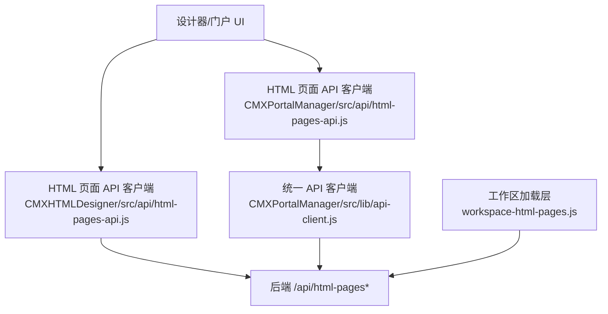
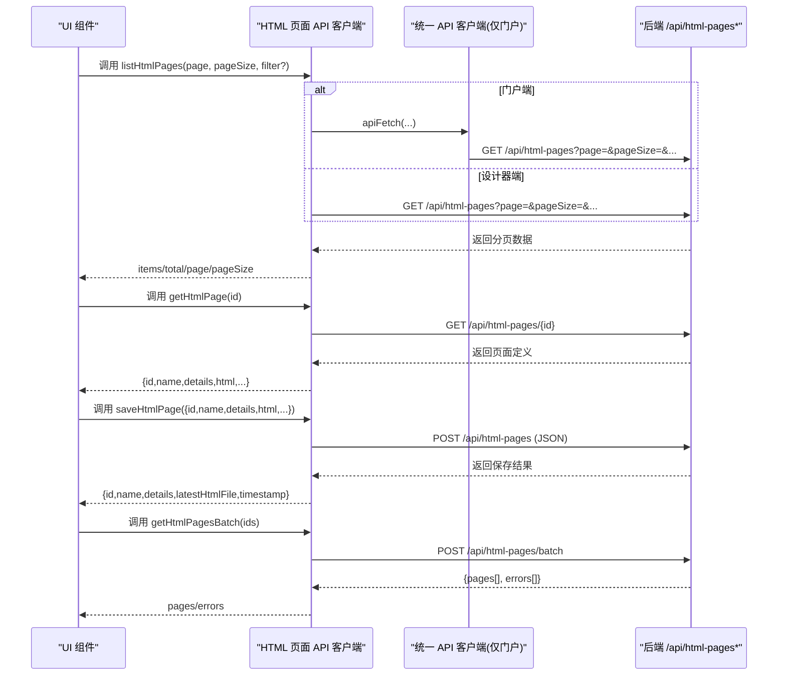
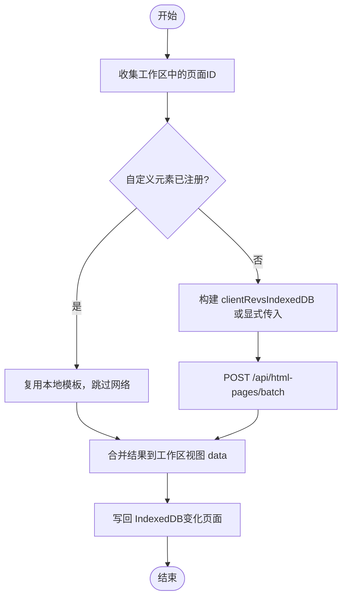
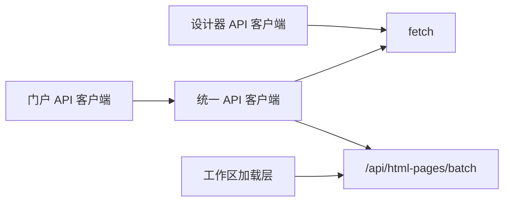

# 页面基础 CRUD 操作

<cite>
**本文引用的文件**
- [CMXHTMLDesigner/src/api/html-pages-api.js](file://CMXHTMLDesigner/src/api/html-pages-api.js)
- [CMXPortalManager/src/api/html-pages-api.js](file://CMXPortalManager/src/api/html-pages-api.js)
- [CMXPortalManager/src/lib/workspace-html-pages.js](file://CMXPortalManager/src/lib/workspace-html-pages.js)
- [CMXPortalManager/src/components/portal-side-nav-html-pages.js](file://CMXPortalManager/src/components/portal-side-nav-html-pages.js)
- [CMXPortalManager/src/lib/api-client.js](file://CMXPortalManager/src/lib/api-client.js)
- [CMXPortalManager/src/components/portal-custom-page-designer.js](file://CMXPortalManager/src/components/portal-custom-page-designer.js)
</cite>

## 目录
1. [简介](#简介)
2. [项目结构](#项目结构)
3. [核心组件](#核心组件)
4. [架构总览](#架构总览)
5. [详细组件分析](#详细组件分析)
6. [依赖关系分析](#依赖关系分析)
7. [性能考虑](#性能考虑)
8. [故障排查指南](#故障排查指南)
9. [结论](#结论)
10. [附录](#附录)

## 简介
本章节面向“HTML 页面”的基础 CRUD 能力，围绕以下接口展开：
- 列表查询：listHtmlPages（支持分页与过滤）
- 单个获取：getHtmlPage（按页面 id 获取完整定义）
- 保存或更新：saveHtmlPage（按 id upsert）
- 批量获取：getHtmlPagesBatch（批量拉取完整定义）

文档将说明每个接口的请求参数、响应格式、错误处理与状态码，并提供调用示例与最佳实践。同时解释页面元数据结构字段 id、name、details、html 的含义与使用方式。

## 项目结构
前端存在两套 HTML 页面 API 客户端实现：
- CMXHTMLDesigner 侧：直接基于 fetch 封装，提供 listHtmlPages/getHtmlPage/saveHtmlPage/getHtmlPagesBatch。
- CMXPortalManager 侧：通过统一 api-client 进行鉴权与信封解包，再暴露相同语义的 listHtmlPages/getHtmlPage/saveHtmlPage。

工作区加载层 workspace-html-pages.js 负责批量拉取、差异同步、缓存写入以及将 batch 结果注入到工作区视图数据中。

图表来源
- [CMXHTMLDesigner/src/api/html-pages-api.js:1-94](file://CMXHTMLDesigner/src/api/html-pages-api.js#L1-L94)
- [CMXPortalManager/src/api/html-pages-api.js:1-52](file://CMXPortalManager/src/api/html-pages-api.js#L1-L52)
- [CMXPortalManager/src/lib/workspace-html-pages.js:175-270](file://CMXPortalManager/src/lib/workspace-html-pages.js#L175-L270)
- [CMXPortalManager/src/lib/api-client.js:83-140](file://CMXPortalManager/src/lib/api-client.js#L83-L140)

章节来源
- [CMXHTMLDesigner/src/api/html-pages-api.js:1-94](file://CMXHTMLDesigner/src/api/html-pages-api.js#L1-L94)
- [CMXPortalManager/src/api/html-pages-api.js:1-52](file://CMXPortalManager/src/api/html-pages-api.js#L1-L52)
- [CMXPortalManager/src/lib/workspace-html-pages.js:175-270](file://CMXPortalManager/src/lib/workspace-html-pages.js#L175-L270)
- [CMXPortalManager/src/lib/api-client.js:83-140](file://CMXPortalManager/src/lib/api-client.js#L83-L140)

## 核心组件
- 列表查询 listHtmlPages
  - 设计器端：GET /api/html-pages?page=...&pageSize=...&domain?...&app?...&module?...&keyword?...
  - 门户端：GET /api/html-pages?page=...&pageSize=...（由 apiFetch 自动带令牌并解包信封）
- 单个获取 getHtmlPage
  - GET /api/html-pages/{id}
- 保存或更新 saveHtmlPage
  - POST /api/html-pages，body 包含 id、name、details、html；可选 domain/app/module
- 批量获取 getHtmlPagesBatch
  - POST /api/html-pages/batch，body { ids }

页面元数据结构关键字段：
- id：页面唯一标识（命名空间可含点，用于域/应用/模块解析）
- name：页面名称（用于展示与 Tab 标签美化）
- details：页面描述信息
- html：页面完整 HTML 源码（运行时渲染与执行）

章节来源
- [CMXHTMLDesigner/src/api/html-pages-api.js:16-38](file://CMXHTMLDesigner/src/api/html-pages-api.js#L16-L38)
- [CMXHTMLDesigner/src/api/html-pages-api.js:40-52](file://CMXHTMLDesigner/src/api/html-pages-api.js#L40-L52)
- [CMXHTMLDesigner/src/api/html-pages-api.js:54-78](file://CMXHTMLDesigner/src/api/html-pages-api.js#L54-L78)
- [CMXHTMLDesigner/src/api/html-pages-api.js:80-94](file://CMXHTMLDesigner/src/api/html-pages-api.js#L80-L94)
- [CMXPortalManager/src/api/html-pages-api.js:16-21](file://CMXPortalManager/src/api/html-pages-api.js#L16-L21)
- [CMXPortalManager/src/api/html-pages-api.js:27-29](file://CMXPortalManager/src/api/html-pages-api.js#L27-L29)
- [CMXPortalManager/src/api/html-pages-api.js:35-42](file://CMXPortalManager/src/api/html-pages-api.js#L35-L42)

## 架构总览
下图展示了从 UI 到后端的典型调用链，包括分页列表、单页获取、保存与批量获取。

图表来源
- [CMXHTMLDesigner/src/api/html-pages-api.js:16-38](file://CMXHTMLDesigner/src/api/html-pages-api.js#L16-L38)
- [CMXHTMLDesigner/src/api/html-pages-api.js:40-52](file://CMXHTMLDesigner/src/api/html-pages-api.js#L40-L52)
- [CMXHTMLDesigner/src/api/html-pages-api.js:54-78](file://CMXHTMLDesigner/src/api/html-pages-api.js#L54-L78)
- [CMXHTMLDesigner/src/api/html-pages-api.js:80-94](file://CMXHTMLDesigner/src/api/html-pages-api.js#L80-L94)
- [CMXPortalManager/src/api/html-pages-api.js:16-21](file://CMXPortalManager/src/api/html-pages-api.js#L16-L21)
- [CMXPortalManager/src/api/html-pages-api.js:27-29](file://CMXPortalManager/src/api/html-pages-api.js#L27-L29)
- [CMXPortalManager/src/api/html-pages-api.js:35-42](file://CMXPortalManager/src/api/html-pages-api.js#L35-L42)
- [CMXPortalManager/src/lib/api-client.js:83-140](file://CMXPortalManager/src/lib/api-client.js#L83-L140)

## 详细组件分析

### 列表查询：listHtmlPages
- 请求
  - 方法：GET
  - 路径：/api/html-pages
  - 查询参数：
    - page：页码，默认 1
    - pageSize：每页条数，默认 10
    - domain/app/module：DAM 三级过滤（任一非空即生效，基于 id 点分解析）
    - keyword：对 id/name/details 不区分大小写包含匹配
- 响应
  - items：数组，每项包含 id、name、details、latestHtmlFile、timestamp，可能包含 domain/app/module/relPath
  - total：总数
  - page：当前页
  - pageSize：每页条数
- 错误处理
  - HTTP 非 2xx：抛出错误，错误消息来自响应体 error/msg 或 HTTP 状态
  - 门户端经 apiFetch 会解包 ApiResp 信封，业务错误 code≠0 抛错
- 使用建议
  - 列表用于选择与分页浏览；如需完整 html 内容请使用 getHtmlPage 或批量接口

章节来源
- [CMXHTMLDesigner/src/api/html-pages-api.js:16-38](file://CMXHTMLDesigner/src/api/html-pages-api.js#L16-L38)
- [CMXPortalManager/src/api/html-pages-api.js:16-21](file://CMXPortalManager/src/api/html-pages-api.js#L16-L21)
- [CMXPortalManager/src/lib/api-client.js:83-140](file://CMXPortalManager/src/lib/api-client.js#L83-L140)

### 单个获取：getHtmlPage
- 请求
  - 方法：GET
  - 路径：/api/html-pages/{id}
- 响应
  - 包含 id、name、details、domain/app/module/doc（行字段业务坐标）、rev、latestHtmlFile、timestamp、html 等
- 错误处理
  - HTTP 非 2xx：抛出错误，错误消息来自响应体
- 使用建议
  - 打开已有页时应透传 domain/app/module/doc 给保存流程，避免丢失坐标

章节来源
- [CMXHTMLDesigner/src/api/html-pages-api.js:40-52](file://CMXHTMLDesigner/src/api/html-pages-api.js#L40-L52)

### 保存或更新：saveHtmlPage
- 请求
  - 方法：POST
  - 路径：/api/html-pages
  - 请求体：
    - id：必填
    - name：可选，默认空串
    - details：可选，默认空串
    - html：必填
    - domain/app/module：可选；未传时后端从 id 命名空间自动解析（不含点的 id → _legacy 域）
- 响应
  - 返回 id、name、details、latestHtmlFile、timestamp
- 错误处理
  - HTTP 非 2xx：抛出错误，错误消息来自响应体
- 使用建议
  - 新建页面时，name 可由 id 推导；details 用于描述；html 为完整页面源码
  - 若需保留业务坐标，显式传入 domain/app/module/doc

章节来源
- [CMXHTMLDesigner/src/api/html-pages-api.js:54-78](file://CMXHTMLDesigner/src/api/html-pages-api.js#L54-L78)
- [CMXPortalManager/src/api/html-pages-api.js:35-42](file://CMXPortalManager/src/api/html-pages-api.js#L35-L42)
- [CMXPortalManager/src/components/portal-custom-page-designer.js:133-167](file://CMXPortalManager/src/components/portal-custom-page-designer.js#L133-L167)

### 批量获取：getHtmlPagesBatch
- 请求
  - 方法：POST
  - 路径：/api/html-pages/batch
  - 请求体：{ ids: string[] }
- 响应
  - pages：页面完整定义数组（结构与单条一致）
  - errors：失败项数组，每项包含 id 与 error
- 错误处理
  - HTTP 非 2xx：抛出错误
- 使用建议
  - 适合一次性加载多个页面，减少网络往返
  - 工作区加载层会结合本地 IndexedDB 做差异同步（clientRevs），命中则只返回变更项

章节来源
- [CMXHTMLDesigner/src/api/html-pages-api.js:80-94](file://CMXHTMLDesigner/src/api/html-pages-api.js#L80-L94)
- [CMXPortalManager/src/lib/workspace-html-pages.js:175-270](file://CMXPortalManager/src/lib/workspace-html-pages.js#L175-L270)

### 工作区加载与差异同步（补充）
- 作用
  - 收集工作区中所有 html_pages 视图的 id
  - 检测自定义元素是否已注册，已注册则跳过网络请求
  - 调用批量接口并合并结果到工作区视图 data
  - 将变化的页面写回 IndexedDB，并维护 rev 清单
- 关键流程
  - 构建 clientRevs（优先显式传入，否则从 IndexedDB 读取）
  - 发起 POST /api/html-pages/batch
  - 将 pages/errors 合并进工作区视图 data
  - 差异命中时从 IndexedDB 补全缺失页面

图表来源
- [CMXPortalManager/src/lib/workspace-html-pages.js:353-410](file://CMXPortalManager/src/lib/workspace-html-pages.js#L353-L410)
- [CMXPortalManager/src/lib/workspace-html-pages.js:175-270](file://CMXPortalManager/src/lib/workspace-html-pages.js#L175-L270)

章节来源
- [CMXPortalManager/src/lib/workspace-html-pages.js:353-410](file://CMXPortalManager/src/lib/workspace-html-pages.js#L353-L410)
- [CMXPortalManager/src/lib/workspace-html-pages.js:175-270](file://CMXPortalManager/src/lib/workspace-html-pages.js#L175-L270)

## 依赖关系分析
- 设计器端 API 客户端直接基于 fetch，错误处理通过 readErrorMessage 提取 error/msg。
- 门户端 API 客户端通过 api-client 统一处理：
  - 自动注入 Authorization 令牌
  - 解包 ApiResp 信封（code=0 成功，否则抛错）
  - 401 跳转登录
  - 兼容裸错误对象
- 工作区加载层依赖批量接口与本地缓存（IndexedDB）实现差异同步。

图表来源
- [CMXHTMLDesigner/src/api/html-pages-api.js:1-94](file://CMXHTMLDesigner/src/api/html-pages-api.js#L1-L94)
- [CMXPortalManager/src/api/html-pages-api.js:1-52](file://CMXPortalManager/src/api/html-pages-api.js#L1-L52)
- [CMXPortalManager/src/lib/api-client.js:83-140](file://CMXPortalManager/src/lib/api-client.js#L83-L140)
- [CMXPortalManager/src/lib/workspace-html-pages.js:175-270](file://CMXPortalManager/src/lib/workspace-html-pages.js#L175-L270)

章节来源
- [CMXHTMLDesigner/src/api/html-pages-api.js:1-94](file://CMXHTMLDesigner/src/api/html-pages-api.js#L1-L94)
- [CMXPortalManager/src/api/html-pages-api.js:1-52](file://CMXPortalManager/src/api/html-pages-api.js#L1-L52)
- [CMXPortalManager/src/lib/api-client.js:83-140](file://CMXPortalManager/src/lib/api-client.js#L83-L140)
- [CMXPortalManager/src/lib/workspace-html-pages.js:175-270](file://CMXPortalManager/src/lib/workspace-html-pages.js#L175-L270)

## 性能考虑
- 列表分页：合理设置 pageSize，避免单次返回过多数据。
- 批量获取：优先使用 batch 接口减少网络往返；工作区加载层已内置差异同步，命中缓存可显著降低带宽与延迟。
- 自定义元素复用：若页面已在当前文档注册，可直接复用本地模板，无需再次拉取。
- 大页面保护：工作区渲染时对 runnableDoc 长度进行限制，避免超大页面导致卡顿。

[本节为通用指导，不直接分析具体文件]

## 故障排查指南
- 401 未授权
  - 现象：请求被拦截，跳转到登录页
  - 原因：token 缺失或过期
  - 处理：重新登录后重试
- 业务错误（ApiResp code≠0）
  - 现象：抛出错误，错误消息来自 msg/error
  - 处理：根据错误提示修正请求参数或页面内容
- 批量接口部分失败
  - 现象：返回 { pages[], errors[] }，errors 中包含失败 id 与错误信息
  - 处理：检查对应 id 是否存在、权限是否足够
- 工作区加载失败
  - 现象：活动侧栏显示错误消息或占位文本
  - 处理：查看批量接口返回的 errors，确认页面 ID 与权限

章节来源
- [CMXPortalManager/src/lib/api-client.js:83-140](file://CMXPortalManager/src/lib/api-client.js#L83-L140)
- [CMXPortalManager/src/components/portal-side-nav-html-pages.js:17-89](file://CMXPortalManager/src/components/portal-side-nav-html-pages.js#L17-L89)

## 结论
- 列表、单条、保存、批量四个接口覆盖了 HTML 页面的基础 CRUD。
- 设计器端与门户端均提供一致的 API 语义，门户端通过统一客户端增强鉴权与信封处理。
- 工作区加载层提供差异同步与缓存机制，提升加载性能与稳定性。
- 建议在开发中合理使用分页与批量接口，并注意页面元数据字段的含义与传递。

[本节为总结性内容，不直接分析具体文件]

## 附录

### 接口速查表
- 列表查询
  - 方法：GET
  - 路径：/api/html-pages
  - 参数：page、pageSize、domain、app、module、keyword
  - 响应：items、total、page、pageSize
- 单个获取
  - 方法：GET
  - 路径：/api/html-pages/{id}
  - 响应：id、name、details、html、domain/app/module/doc、rev、latestHtmlFile、timestamp
- 保存或更新
  - 方法：POST
  - 路径：/api/html-pages
  - 请求体：id、name、details、html、domain/app/module（可选）
  - 响应：id、name、details、latestHtmlFile、timestamp
- 批量获取
  - 方法：POST
  - 路径：/api/html-pages/batch
  - 请求体：ids
  - 响应：pages、errors

章节来源
- [CMXHTMLDesigner/src/api/html-pages-api.js:16-38](file://CMXHTMLDesigner/src/api/html-pages-api.js#L16-L38)
- [CMXHTMLDesigner/src/api/html-pages-api.js:40-52](file://CMXHTMLDesigner/src/api/html-pages-api.js#L40-L52)
- [CMXHTMLDesigner/src/api/html-pages-api.js:54-78](file://CMXHTMLDesigner/src/api/html-pages-api.js#L54-L78)
- [CMXHTMLDesigner/src/api/html-pages-api.js:80-94](file://CMXHTMLDesigner/src/api/html-pages-api.js#L80-L94)
- [CMXPortalManager/src/api/html-pages-api.js:16-21](file://CMXPortalManager/src/api/html-pages-api.js#L16-L21)
- [CMXPortalManager/src/api/html-pages-api.js:27-29](file://CMXPortalManager/src/api/html-pages-api.js#L27-L29)
- [CMXPortalManager/src/api/html-pages-api.js:35-42](file://CMXPortalManager/src/api/html-pages-api.js#L35-L42)

### 调用示例（路径引用）
- 分页查询
  - 设计器端：[listHtmlPages:16-38](file://CMXHTMLDesigner/src/api/html-pages-api.js#L16-L38)
  - 门户端：[listHtmlPages:16-21](file://CMXPortalManager/src/api/html-pages-api.js#L16-L21)
- 单个页面获取
  - 设计器端：[getHtmlPage:40-52](file://CMXHTMLDesigner/src/api/html-pages-api.js#L40-L52)
  - 门户端：[getHtmlPage:27-29](file://CMXPortalManager/src/api/html-pages-api.js#L27-L29)
- 页面保存
  - 设计器端：[saveHtmlPage:54-78](file://CMXHTMLDesigner/src/api/html-pages-api.js#L54-L78)
  - 门户端：[saveHtmlPage:35-42](file://CMXPortalManager/src/api/html-pages-api.js#L35-L42)
  - 自定义页面创建表单提交：[portal-custom-page-designer:133-167](file://CMXPortalManager/src/components/portal-custom-page-designer.js#L133-L167)
- 批量获取
  - 设计器端：[getHtmlPagesBatch:80-94](file://CMXHTMLDesigner/src/api/html-pages-api.js#L80-L94)
  - 工作区加载层差异同步：[fetchHtmlPagesByIdsBatch:175-270](file://CMXPortalManager/src/lib/workspace-html-pages.js#L175-L270)

### 页面元数据字段说明
- id：页面唯一标识，可用于命名空间解析（如 domain.app.module）
- name：页面名称，用于展示与 Tab 标签美化
- details：页面描述信息，便于管理与检索
- html：页面完整 HTML 源码，运行时渲染与执行

章节来源
- [CMXHTMLDesigner/src/api/html-pages-api.js:40-52](file://CMXHTMLDesigner/src/api/html-pages-api.js#L40-L52)
- [CMXHTMLDesigner/src/api/html-pages-api.js:54-78](file://CMXHTMLDesigner/src/api/html-pages-api.js#L54-L78)
- [CMXPortalManager/src/components/portal-side-nav-html-pages.js:43-54](file://CMXPortalManager/src/components/portal-side-nav-html-pages.js#L43-L54)