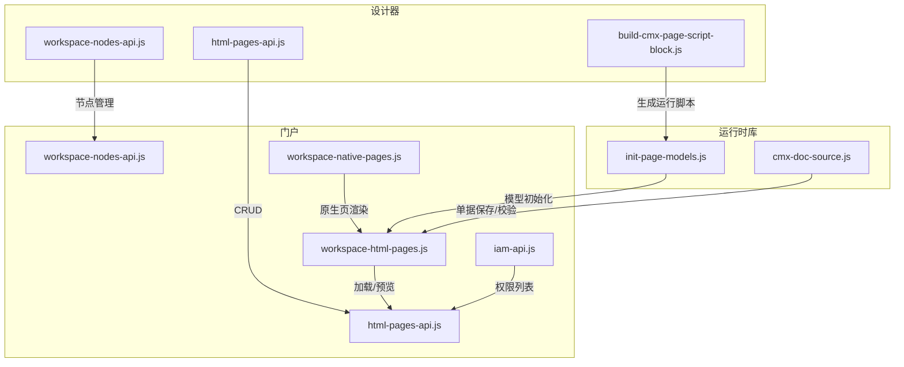
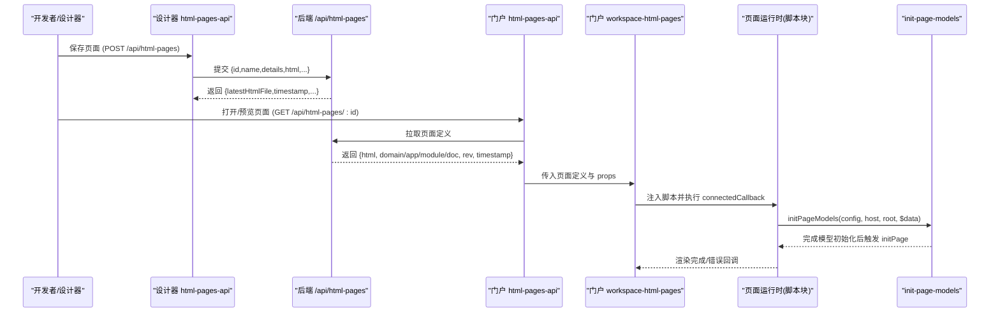
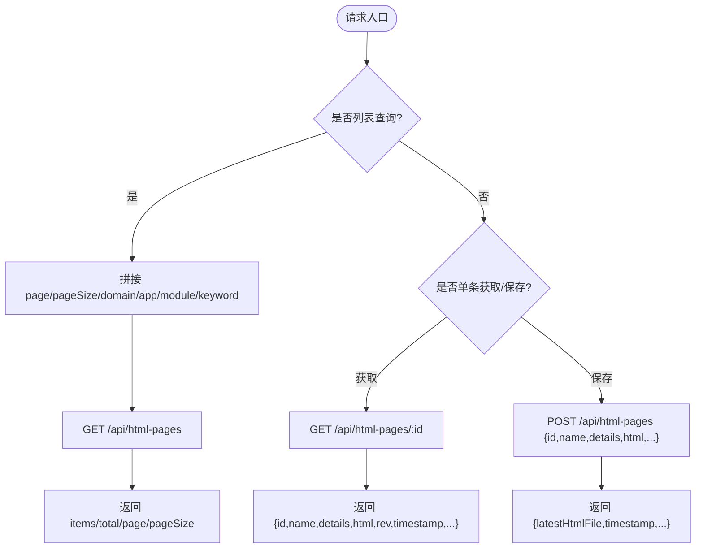
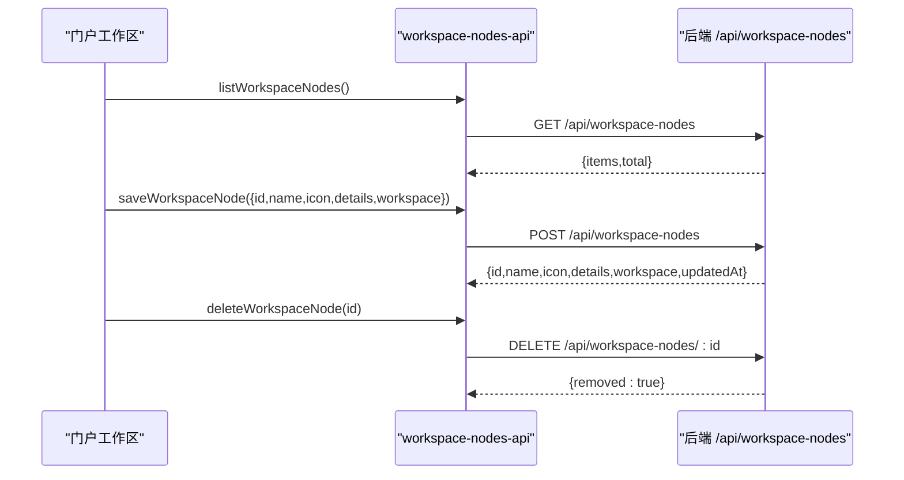
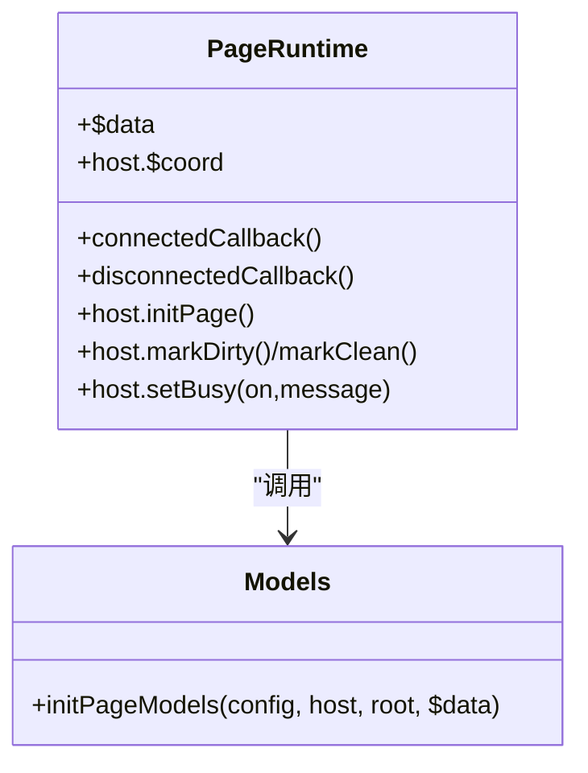
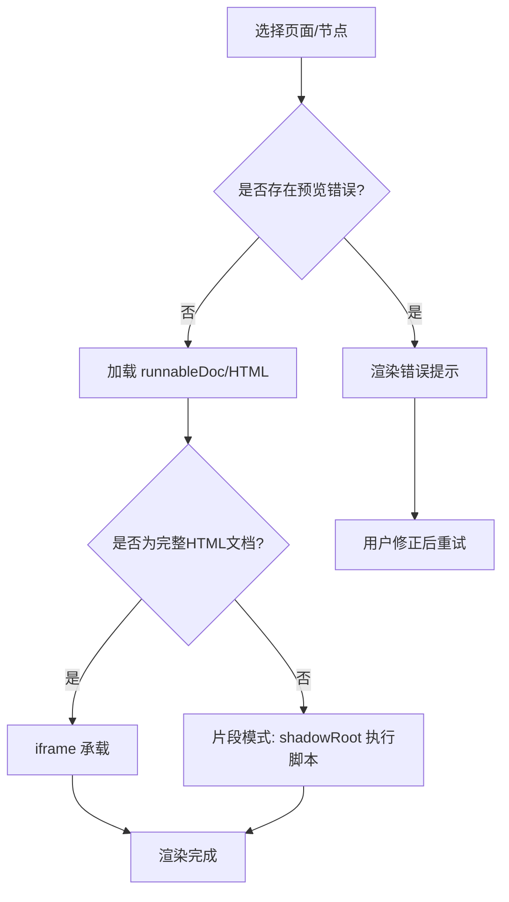
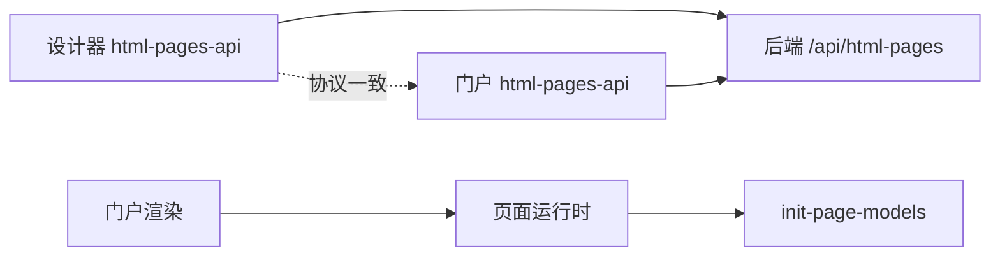

# 页面管理 API

<cite>
**本文引用的文件**
- [CMXHTMLDesigner/src/api/html-pages-api.js](file://CMXHTMLDesigner/src/api/html-pages-api.js)
- [CMXPortalManager/src/api/html-pages-api.js](file://CMXPortalManager/src/api/html-pages-api.js)
- [CMXHTMLDesigner/src/api/workspace-nodes-api.js](file://CMXHTMLDesigner/src/api/workspace-nodes-api.js)
- [CMXPortalManager/src/api/workspace-nodes-api.js](file://CMXPortalManager/src/api/workspace-nodes-api.js)
- [CMXHTMLDesigner/src/utils/build-cmx-page-script-block.js](file://CMXHTMLDesigner/src/utils/build-cmx-page-script-block.js)
- [packages/cmx-data-comp/src/lib/init-page-models.js](file://packages/cmx-data-comp/src/lib/init-page-models.js)
- [packages/cmx-data-comp/src/lib/cmx-doc-source.js](file://packages/cmx-data-comp/src/lib/cmx-doc-source.js)
- [CMXPortalManager/src/lib/workspace-html-pages.js](file://CMXPortalManager/src/lib/workspace-html-pages.js)
- [CMXPortalManager/src/lib/workspace-native-pages.js](file://CMXPortalManager/src/lib/workspace-native-pages.js)
- [CMXPortalManager/src/api/iam-api.js](file://CMXPortalManager/src/api/iam-api.js)
- [CMXPortalManager/docs/mainapp-workspace-api.md](file://CMXPortalManager/docs/mainapp-workspace-api.md)
</cite>

## 目录
1. [简介](#简介)
2. [项目结构](#项目结构)
3. [核心组件](#核心组件)
4. [架构总览](#架构总览)
5. [详细组件分析](#详细组件分析)
6. [依赖关系分析](#依赖关系分析)
7. [性能考虑](#性能考虑)
8. [故障排查指南](#故障排查指南)
9. [结论](#结论)
10. [附录](#附录)

## 简介
本文件面向“页面管理”能力，系统化说明 HTML 页面与门户工作区节点的 CRUD、版本与发布流程、预览机制、页面元数据（组件配置、数据绑定、事件脚本）的管理接口，以及批量操作、导入导出、权限控制与审计日志的集成方式。文档同时提供页面生命周期管理的完整示例与集成指引，帮助前后端开发者快速对接 cmx-container 提供的 REST 服务。

## 项目结构
- 前端设计器与门户均通过各自的 API 客户端封装访问后端 /api/html-pages 与 /api/workspace-nodes。
- 页面运行时由设计器生成的脚本块驱动，负责数据绑定、事件脚本、模型初始化与服务调用。
- 门户侧负责页面加载、预览渲染、错误处理与宿主上下文注入。

图示来源
- [CMXHTMLDesigner/src/api/html-pages-api.js:1-94](file://CMXHTMLDesigner/src/api/html-pages-api.js#L1-L94)
- [CMXPortalManager/src/api/html-pages-api.js:1-52](file://CMXPortalManager/src/api/html-pages-api.js#L1-L52)
- [CMXHTMLDesigner/src/api/workspace-nodes-api.js:1-69](file://CMXHTMLDesigner/src/api/workspace-nodes-api.js#L1-L69)
- [CMXPortalManager/src/api/workspace-nodes-api.js:1-70](file://CMXPortalManager/src/api/workspace-nodes-api.js#L1-L70)
- [CMXHTMLDesigner/src/utils/build-cmx-page-script-block.js:1-313](file://CMXHTMLDesigner/src/utils/build-cmx-page-script-block.js#L1-L313)
- [packages/cmx-data-comp/src/lib/init-page-models.js:700-724](file://packages/cmx-data-comp/src/lib/init-page-models.js#L700-L724)
- [packages/cmx-data-comp/src/lib/cmx-doc-source.js:208-309](file://packages/cmx-data-comp/src/lib/cmx-doc-source.js#L208-L309)
- [CMXPortalManager/src/lib/workspace-html-pages.js:299-321](file://CMXPortalManager/src/lib/workspace-html-pages.js#L299-L321)
- [CMXPortalManager/src/lib/workspace-native-pages.js:142-168](file://CMXPortalManager/src/lib/workspace-native-pages.js#L142-L168)
- [CMXPortalManager/src/api/iam-api.js:1-49](file://CMXPortalManager/src/api/iam-api.js#L1-L49)

章节来源
- [CMXHTMLDesigner/src/api/html-pages-api.js:1-94](file://CMXHTMLDesigner/src/api/html-pages-api.js#L1-L94)
- [CMXPortalManager/src/api/html-pages-api.js:1-52](file://CMXPortalManager/src/api/html-pages-api.js#L1-L52)
- [CMXHTMLDesigner/src/api/workspace-nodes-api.js:1-69](file://CMXHTMLDesigner/src/api/workspace-nodes-api.js#L1-L69)
- [CMXPortalManager/src/api/workspace-nodes-api.js:1-70](file://CMXPortalManager/src/api/workspace-nodes-api.js#L1-L70)

## 核心组件
- HTML 页面 API：提供分页查询、按 ID 获取、保存/更新（upsert）、批量获取等能力。
- 工作区节点 API：提供节点列表、详情、保存、删除，用于将页面挂载到门户工作区。
- 页面脚本构建器：将页面元数据（pageData/pageFns/pageServices/models）编译为可运行的 Web Component 脚本，实现数据绑定、事件脚本、服务调用与模型初始化。
- 门户页面容器：负责加载页面定义、渲染预览、错误展示与宿主上下文注入。
- 权限与菜单：提供功能码列表，供菜单与页面访问控制使用。

章节来源
- [CMXHTMLDesigner/src/api/html-pages-api.js:16-93](file://CMXHTMLDesigner/src/api/html-pages-api.js#L16-L93)
- [CMXPortalManager/src/api/html-pages-api.js:16-51](file://CMXPortalManager/src/api/html-pages-api.js#L16-L51)
- [CMXHTMLDesigner/src/utils/build-cmx-page-script-block.js:28-313](file://CMXHTMLDesigner/src/utils/build-cmx-page-script-block.js#L28-L313)
- [CMXPortalManager/src/lib/workspace-html-pages.js:299-321](file://CMXPortalManager/src/lib/workspace-html-pages.js#L299-L321)
- [CMXPortalManager/src/api/iam-api.js:10-49](file://CMXPortalManager/src/api/iam-api.js#L10-L49)

## 架构总览
页面从设计器编辑保存，到门户加载预览的生命周期如下：

图示来源
- [CMXHTMLDesigner/src/api/html-pages-api.js:54-93](file://CMXHTMLDesigner/src/api/html-pages-api.js#L54-L93)
- [CMXPortalManager/src/api/html-pages-api.js:27-51](file://CMXPortalManager/src/api/html-pages-api.js#L27-L51)
- [CMXHTMLDesigner/src/utils/build-cmx-page-script-block.js:284-309](file://CMXHTMLDesigner/src/utils/build-cmx-page-script-block.js#L284-L309)
- [packages/cmx-data-comp/src/lib/init-page-models.js:700-724](file://packages/cmx-data-comp/src/lib/init-page-models.js#L700-L724)
- [CMXPortalManager/src/lib/workspace-html-pages.js:299-321](file://CMXPortalManager/src/lib/workspace-html-pages.js#L299-L321)

## 详细组件分析

### HTML 页面 API（CRUD、批量、过滤）
- 列表查询：支持分页与 DAM 三级过滤（domain/app/module），以及关键字搜索（id/name/details）。
- 单条获取：返回页面元数据与最新 HTML 片段，包含业务坐标（domain/app/module/doc）、版本号与时间戳。
- 保存/更新：按 id upsert；可选透传 v2 字段 domain/app/module，未显式提供时由后端从 id 推导。
- 批量获取：按 ids 批量拉取完整定义，便于多页联动或批量预览。

图示来源
- [CMXHTMLDesigner/src/api/html-pages-api.js:16-93](file://CMXHTMLDesigner/src/api/html-pages-api.js#L16-L93)
- [CMXPortalManager/src/api/html-pages-api.js:16-51](file://CMXPortalManager/src/api/html-pages-api.js#L16-L51)

章节来源
- [CMXHTMLDesigner/src/api/html-pages-api.js:16-93](file://CMXHTMLDesigner/src/api/html-pages-api.js#L16-L93)
- [CMXPortalManager/src/api/html-pages-api.js:16-51](file://CMXPortalManager/src/api/html-pages-api.js#L16-L51)

### 工作区节点 API（页面挂载与编排）
- 列表/详情/保存/删除：用于在工作区中创建、编辑、移除节点，节点可绑定 HTML 页面或原生页面。
- 典型用途：将已保存的 HTML 页面以节点形式挂载到门户工作区，支持图标、描述与 workspace 配置。

图示来源
- [CMXHTMLDesigner/src/api/workspace-nodes-api.js:16-69](file://CMXHTMLDesigner/src/api/workspace-nodes-api.js#L16-L69)
- [CMXPortalManager/src/api/workspace-nodes-api.js:17-70](file://CMXPortalManager/src/api/workspace-nodes-api.js#L17-L70)

章节来源
- [CMXHTMLDesigner/src/api/workspace-nodes-api.js:16-69](file://CMXHTMLDesigner/src/api/workspace-nodes-api.js#L16-L69)
- [CMXPortalManager/src/api/workspace-nodes-api.js:17-70](file://CMXPortalManager/src/api/workspace-nodes-api.js#L17-L70)

### 页面元数据与运行时（组件配置、数据绑定、事件脚本）
- 元数据结构：
  - pageData：声明页面级数据变量及默认值，运行时通过 Proxy 实现 data-bind-* 双向绑定。
  - pageFns：页面函数，作为组件实例方法注入，支持参数与调试 sourceURL。
  - pageServices：页面服务（REST/JSON-RPC/GraphQL/WebSocket），支持 responseTo 自动写回 $data 与响应转换。
  - models/dataFlow/dataSources：委托给 cmx-data-comp 进行模型初始化与列填充。
- 事件脚本：通过 __hydrateEvents 扫描 data-event* 属性并注册监听，回调在 with(host) 作用域执行表达式。
- 生命周期：connectedCallback 中完成模板克隆、$coord 注入、$data 初始化、fns/svcs 注册、事件绑定与模型初始化；disconnectedCallback 触发 onDispose/__cmxDispose 清理。

图示来源
- [CMXHTMLDesigner/src/utils/build-cmx-page-script-block.js:84-309](file://CMXHTMLDesigner/src/utils/build-cmx-page-script-block.js#L84-L309)
- [packages/cmx-data-comp/src/lib/init-page-models.js:700-724](file://packages/cmx-data-comp/src/lib/init-page-models.js#L700-L724)
- [CMXPortalManager/docs/mainapp-workspace-api.md:327-342](file://CMXPortalManager/docs/mainapp-workspace-api.md#L327-L342)

章节来源
- [CMXHTMLDesigner/src/utils/build-cmx-page-script-block.js:28-313](file://CMXHTMLDesigner/src/utils/build-cmx-page-script-block.js#L28-L313)
- [packages/cmx-data-comp/src/lib/init-page-models.js:700-724](file://packages/cmx-data-comp/src/lib/init-page-models.js#L700-L724)
- [CMXPortalManager/docs/mainapp-workspace-api.md:327-342](file://CMXPortalManager/docs/mainapp-workspace-api.md#L327-L342)

### 预览与发布流程
- 预览：门户根据页面定义中的 runnableDoc/previewError 等字段决定是否直接渲染或显示错误；若存在错误则展示错误信息。
- 发布：保存页面后返回 latestHtmlFile 与 timestamp，可用于标识最新版本；结合工作区节点将页面挂载至门户。
- 原生页面：支持整页 HTML（iframe 隔离）与片段模式（shadowRoot 内执行脚本），统一由门户渲染逻辑处理。

图示来源
- [CMXPortalManager/src/lib/workspace-html-pages.js:299-321](file://CMXPortalManager/src/lib/workspace-html-pages.js#L299-L321)
- [CMXPortalManager/src/lib/workspace-native-pages.js:142-168](file://CMXPortalManager/src/lib/workspace-native-pages.js#L142-L168)

章节来源
- [CMXPortalManager/src/lib/workspace-html-pages.js:299-321](file://CMXPortalManager/src/lib/workspace-html-pages.js#L299-L321)
- [CMXPortalManager/src/lib/workspace-native-pages.js:142-168](file://CMXPortalManager/src/lib/workspace-native-pages.js#L142-L168)

### 批量操作、导入导出
- 批量获取：通过 /api/html-pages/batch 按 ids 批量拉取页面定义，适合批量预览或迁移。
- 导入导出：可将页面 HTML 与元数据导出为文本/文件，再在新环境导入；注意保留 domain/app/module/doc 坐标以避免引擎推导偏差。
- 工作区节点批量：可通过多次调用保存/删除接口完成批量编排。

章节来源
- [CMXHTMLDesigner/src/api/html-pages-api.js:80-93](file://CMXHTMLDesigner/src/api/html-pages-api.js#L80-L93)
- [CMXPortalManager/src/api/html-pages-api.js:44-51](file://CMXPortalManager/src/api/html-pages-api.js#L44-L51)

### 权限控制
- 功能码列表：通过 /api/iam/permissions/list 获取菜单类权限，支持客户端软过滤与全量回退策略，便于菜单与页面访问控制。
- 建议：在菜单节点或页面路由层结合功能码进行鉴权，确保只有具备权限的用户可见/可访问页面。

章节来源
- [CMXPortalManager/src/api/iam-api.js:10-49](file://CMXPortalManager/src/api/iam-api.js#L10-L49)

### 审计日志与版本追溯
- 单据级版本化：通过 docMeta.versioning 开关启用，每次保存产生不可变历史版本，支持查询、对比与审计。
- 审计字段：插入/更新时自动填充 create_by/create_time/update_by/update_time/delete_flag，并在冲突时保持不可变审计列。
- 建议：对关键页面关联的单据开启版本化，以便追踪变更与审计。

章节来源
- [packages/cmx-data-comp/src/lib/cmx-doc-source.js:208-309](file://packages/cmx-data-comp/src/lib/cmx-doc-source.js#L208-L309)
- [docs/三元定义体系架构文档.md:1553-1573](file://docs/三元定义体系架构文档.md#L1553-L1573)

## 依赖关系分析
- 设计器与门户共用同一套 REST 约定（/api/html-pages、/api/workspace-nodes），保证行为一致。
- 页面运行时依赖 cmx-data-comp 的模型初始化能力，确保数据流与组件绑定正确。
- 门户渲染层依赖页面定义的 runnableDoc/previewError 等字段决定渲染路径。

图示来源
- [CMXHTMLDesigner/src/api/html-pages-api.js:1-94](file://CMXHTMLDesigner/src/api/html-pages-api.js#L1-L94)
- [CMXPortalManager/src/api/html-pages-api.js:1-52](file://CMXPortalManager/src/api/html-pages-api.js#L1-L52)
- [packages/cmx-data-comp/src/lib/init-page-models.js:700-724](file://packages/cmx-data-comp/src/lib/init-page-models.js#L700-L724)

章节来源
- [CMXHTMLDesigner/src/api/html-pages-api.js:1-94](file://CMXHTMLDesigner/src/api/html-pages-api.js#L1-L94)
- [CMXPortalManager/src/api/html-pages-api.js:1-52](file://CMXPortalManager/src/api/html-pages-api.js#L1-L52)
- [packages/cmx-data-comp/src/lib/init-page-models.js:700-724](file://packages/cmx-data-comp/src/lib/init-page-models.js#L700-L724)

## 性能考虑
- 批量获取：优先使用 /api/html-pages/batch 减少网络往返。
- 懒加载模型：initPageModels 异步加载元数据与列，避免阻塞首屏。
- 预览优化：区分完整 HTML 与片段模式，片段模式在 shadowRoot 中执行以减少开销。
- 缓存策略：利用 latestHtmlFile 与 timestamp 做资源版本化，配合浏览器缓存提升加载速度。

## 故障排查指南
- 预览错误：检查页面定义中的 previewError 字段，确认 runnableDoc 是否有效。
- 模型初始化失败：查看控制台警告，确认 models/dataFlow/dataSources 配置是否正确。
- 权限问题：确认菜单/页面绑定的功能码是否在权限列表中可用。
- 保存失败：检查 domain/app/module 坐标是否缺失导致后端推导异常，必要时显式传递。

章节来源
- [CMXPortalManager/src/lib/workspace-html-pages.js:299-321](file://CMXPortalManager/src/lib/workspace-html-pages.js#L299-L321)
- [CMXHTMLDesigner/src/utils/build-cmx-page-script-block.js:284-309](file://CMXHTMLDesigner/src/utils/build-cmx-page-script-block.js#L284-L309)
- [CMXPortalManager/src/api/iam-api.js:10-49](file://CMXPortalManager/src/api/iam-api.js#L10-L49)

## 结论
页面管理 API 围绕 HTML 页面与工作区节点提供了完整的 CRUD、批量操作与预览能力；通过脚本构建器与模型初始化实现了灵活的数据绑定、事件脚本与服务调用；结合权限与审计机制，满足企业级页面的安全与合规需求。建议在生产环境中启用版本化与审计，并使用批量接口优化性能。

## 附录
- 常用接口速查：
  - 列表：GET /api/html-pages?page=...&pageSize=...&domain=...&app=...&module=...&keyword=...
  - 获取：GET /api/html-pages/:id
  - 保存：POST /api/html-pages {id,name,details,html,domain?,app?,module?}
  - 批量：POST /api/html-pages/batch {ids[]}
  - 节点：GET/POST/DELETE /api/workspace-nodes
  - 权限：POST /api/iam/permissions/list {filters:[{resource_type:"menu"}]}

章节来源
- [CMXHTMLDesigner/src/api/html-pages-api.js:16-93](file://CMXHTMLDesigner/src/api/html-pages-api.js#L16-L93)
- [CMXPortalManager/src/api/html-pages-api.js:16-51](file://CMXPortalManager/src/api/html-pages-api.js#L16-L51)
- [CMXHTMLDesigner/src/api/workspace-nodes-api.js:16-69](file://CMXHTMLDesigner/src/api/workspace-nodes-api.js#L16-L69)
- [CMXPortalManager/src/api/workspace-nodes-api.js:17-70](file://CMXPortalManager/src/api/workspace-nodes-api.js#L17-L70)
- [CMXPortalManager/src/api/iam-api.js:10-49](file://CMXPortalManager/src/api/iam-api.js#L10-L49)