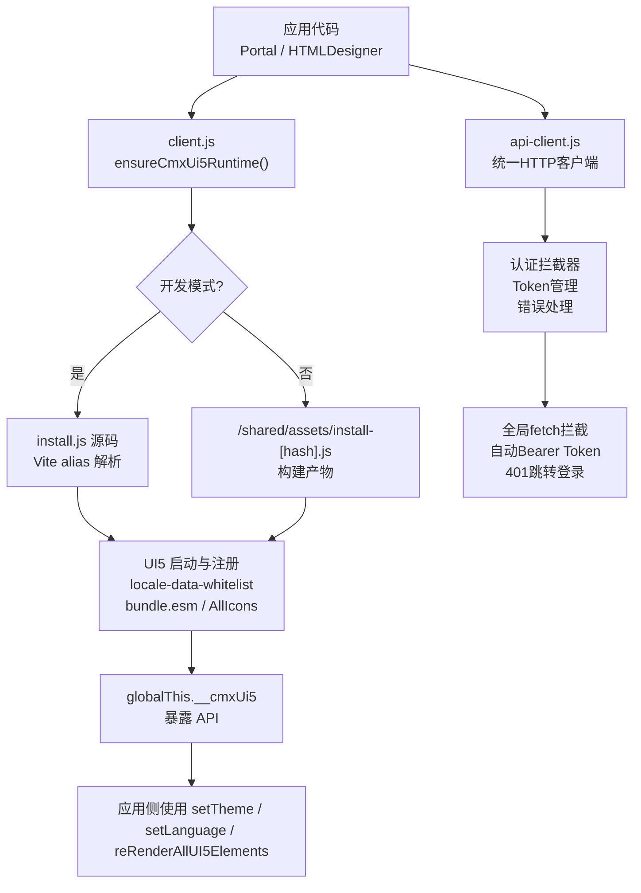
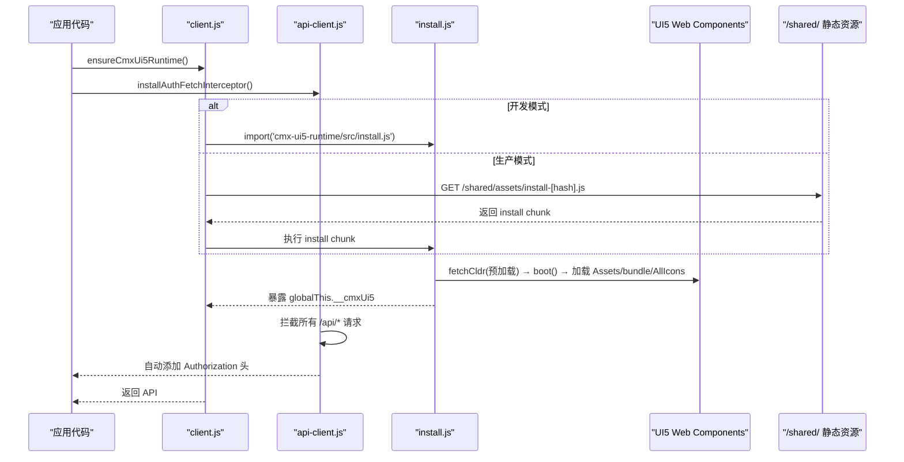
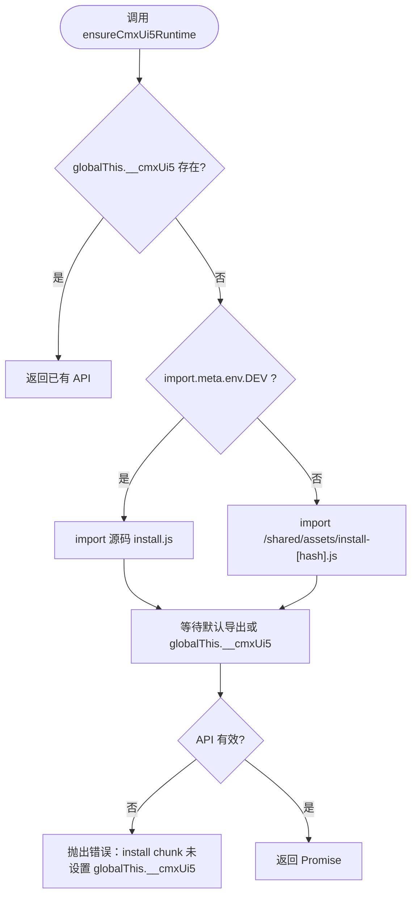
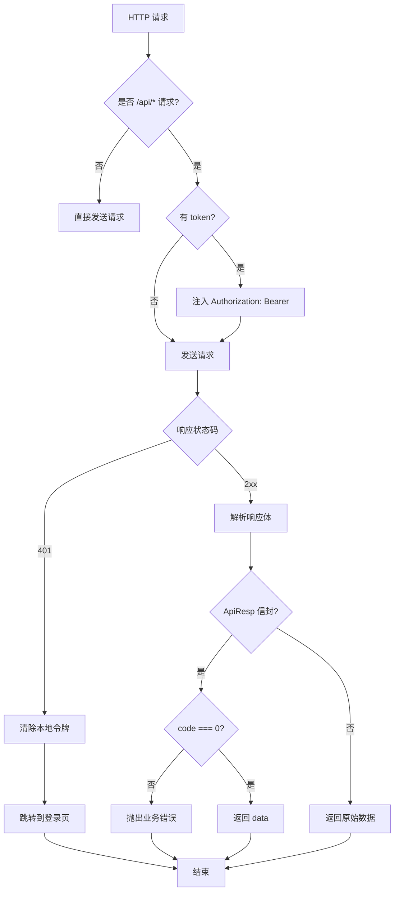
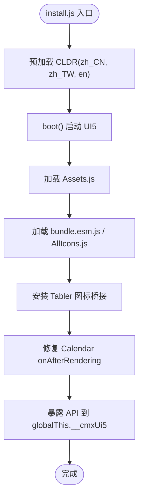
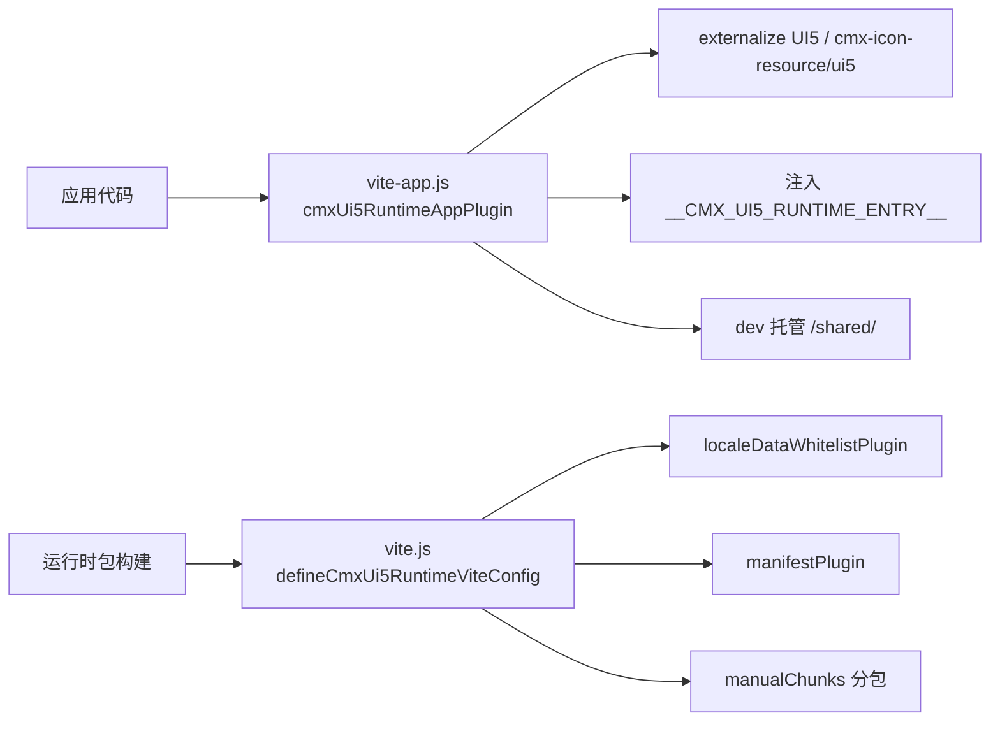
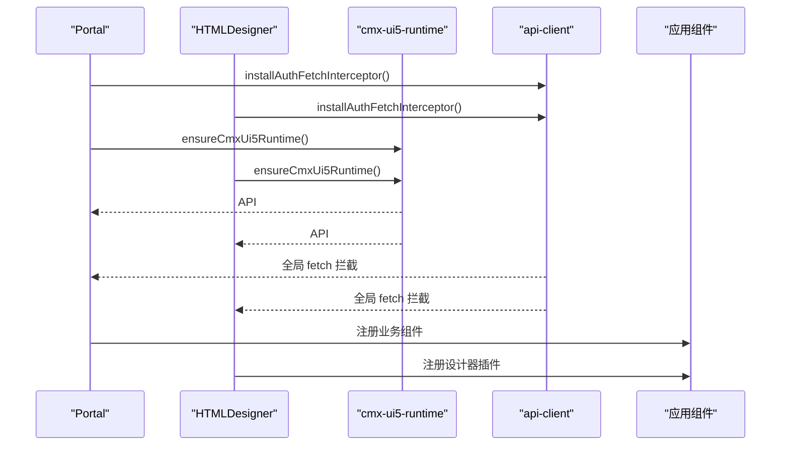
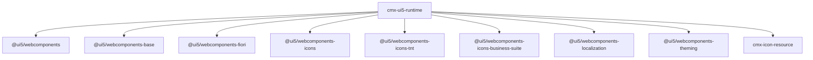

# UI5 运行时 (cmx-ui5-runtime)

<cite>
**本文引用的文件**
- [packages/cmx-ui5-runtime/package.json](file://packages/cmx-ui5-runtime/package.json)
- [packages/cmx-ui5-runtime/vite.config.js](file://packages/cmx-ui5-runtime/vite.config.js)
- [packages/cmx-ui5-runtime/vite.js](file://packages/cmx-ui5-runtime/vite.js)
- [packages/cmx-ui5-runtime/vite-app.js](file://packages/cmx-ui5-runtime/vite-app.js)
- [packages/cmx-ui5-runtime/src/client.js](file://packages/cmx-ui5-runtime/src/client.js)
- [packages/cmx-ui5-runtime/src/api-client.js](file://packages/cmx-ui5-runtime/src/api-client.js)
- [packages/cmx-ui5-runtime/src/install.js](file://packages/cmx-ui5-runtime/src/install.js)
- [packages/cmx-ui5-runtime/src/runtime-api.js](file://packages/cmx-ui5-runtime/src/runtime-api.js)
- [packages/cmx-ui5-runtime/src/locale-data-whitelist.js](file://packages/cmx-ui5-runtime/src/locale-data-whitelist.js)
- [packages/cmx-ui5-runtime/src/ui5-side-effect-shim.js](file://packages/cmx-ui5-runtime/src/ui5-side-effect-shim.js)
- [CMXPortalManager/src/import-ui5-and-app.js](file://CMXPortalManager/src/import-ui5-and-app.js)
- [CMXHTMLDesigner/src/import-ui5-and-app.js](file://CMXHTMLDesigner/src/import-ui5-and-app.js)
</cite>

## 更新摘要
**变更内容**
- 新增 api-client 模块导出，提供统一的 API 客户端功能
- 更新 package.json exports 配置以支持新的 api-client 入口
- 在 Portal 和 HTMLDesigner 中集成新的 API 客户端功能
- 增强认证拦截器和统一错误处理机制

## 目录
1. [简介](#简介)
2. [项目结构](#项目结构)
3. [核心组件](#核心组件)
4. [架构总览](#架构总览)
5. [详细组件分析](#详细组件分析)
6. [依赖关系与版本管理](#依赖关系与版本管理)
7. [性能考量](#性能考量)
8. [故障排查指南](#故障排查指南)
9. [结论](#结论)
10. [附录：在 Vite 项目中集成示例](#附录：在-vite-项目中集成示例)

## 简介
本包为 Portal 与 HTMLDesigner 共享的 UI5 + Tabler 运行时，负责统一初始化 UI5 Web Components、主题与国际化，并提供最小化的 API 暴露给应用侧使用。通过 Vite 插件体系，将运行时独立构建并托管于 /shared/，由应用按需动态加载，避免双实例问题，同时保证开发期源码共享与生产期资源缓存优化。

**新增功能**：本包现已包含统一的 API 客户端模块（api-client），提供跨应用的 HTTP 请求封装、认证令牌管理、错误处理和登录状态同步等功能。

## 项目结构
- 运行时入口与客户端加载器
  - src/install.js：UI5 启动、预加载 CLDR、注册图标与组件聚合、暴露运行时 API
  - src/client.js：应用侧统一加载器，区分 dev/build 模式选择安装路径
  - src/api-client.js：**新增** 统一 API 客户端，提供 HTTP 请求封装、认证管理和错误处理
  - src/runtime-api.js：类型定义（JSDoc），描述对外暴露的 API 契约
  - src/locale-data-whitelist.js：仅加载 zh_CN/zh_TW/en 的本地化数据 shim
  - src/ui5-side-effect-shim.js：生产环境对 side-effect 组件导入的空操作 shim
- Vite 配置与插件
  - vite.js：运行时包的 Vite 配置，包含 locale data 白名单、manifest 生成、分包策略等
  - vite.config.js：运行时包自身的 Vite 入口
  - vite-app.js：面向应用侧的 Vite 插件，externalize UI5、注入 runtime entry URL、dev 托管 /shared/
- 应用集成点
  - CMXPortalManager/src/import-ui5-and-app.js：Portal 业务组件注册
  - CMXHTMLDesigner/src/import-ui5-and-app.js：设计器业务模块注册

**图示来源**
- [packages/cmx-ui5-runtime/src/client.js:14-34](file://packages/cmx-ui5-runtime/src/client.js#L14-L34)
- [packages/cmx-ui5-runtime/src/install.js:10-53](file://packages/cmx-ui5-runtime/src/install.js#L10-L53)
- [packages/cmx-ui5-runtime/src/api-client.js:178-263](file://packages/cmx-ui5-runtime/src/api-client.js#L178-L263)

**章节来源**
- [packages/cmx-ui5-runtime/src/client.js:1-42](file://packages/cmx-ui5-runtime/src/client.js#L1-L42)
- [packages/cmx-ui5-runtime/src/api-client.js:1-264](file://packages/cmx-ui5-runtime/src/api-client.js#L1-L264)
- [packages/cmx-ui5-runtime/src/install.js:1-136](file://packages/cmx-ui5-runtime/src/install.js#L1-L136)
- [packages/cmx-ui5-runtime/vite.js:85-159](file://packages/cmx-ui5-runtime/vite.js#L85-L159)
- [packages/cmx-ui5-runtime/vite-app.js:134-214](file://packages/cmx-ui5-runtime/vite-app.js#L134-L214)

## 核心组件
- 客户端加载器 client.js
  - ensureCmxUi5Runtime：单例加载，dev 走源码 install.js，build 走 /shared/assets/install-[hash].js
  - getCmxUi5RuntimeSync：同步获取已安装的运行时 API
- **新增** API 客户端 api-client.js
  - apiFetch：统一的 HTTP 请求方法，自动处理认证和错误响应
  - installAuthFetchInterceptor：全局 fetch 拦截器，自动注入 Authorization 头
  - getToken/setTokens/clearTokens：令牌管理工具函数
  - LOGIN_PATH：基于应用 base 的动态登录页路径
- 运行时安装器 install.js
  - 预加载 zh_CN/zh_TW/en 的 CLDR 数据
  - 调用 boot() 启动 UI5
  - 并行加载 Assets、bundle.esm、AllIcons 等关键聚合
  - 安装 Tabler 图标桥接
  - 修复 Calendar onAfterRendering 在 dev 模式下可能永久挂起的问题
  - 暴露 API 到 globalThis.__cmxUi5
- Vite 插件
  - defineCmxUi5RuntimeViteConfig：运行时包构建配置，含 locale 白名单、manifest 生成、分包策略
  - cmxUi5RuntimeAppPlugin：应用侧构建时 externalize UI5、注入 runtime entry URL、dev 托管 /shared/
  - cmxUi5SideEffectShimPlugin：生产环境将 side-effect 组件导入替换为空操作，避免重复注册

**章节来源**
- [packages/cmx-ui5-runtime/src/client.js:14-41](file://packages/cmx-ui5-runtime/src/client.js#L14-L41)
- [packages/cmx-ui5-runtime/src/api-client.js:42-148](file://packages/cmx-ui5-runtime/src/api-client.js#L42-L148)
- [packages/cmx-ui5-runtime/src/install.js:21-53](file://packages/cmx-ui5-runtime/src/install.js#L21-L53)
- [packages/cmx-ui5-runtime/src/install.js:55-120](file://packages/cmx-ui5-runtime/src/install.js#L55-L120)
- [packages/cmx-ui5-runtime/src/install.js:122-135](file://packages/cmx-ui5-runtime/src/install.js#L122-L135)
- [packages/cmx-ui5-runtime/vite.js:16-33](file://packages/cmx-ui5-runtime/vite.js#L16-L33)
- [packages/cmx-ui5-runtime/vite.js:35-83](file://packages/cmx-ui5-runtime/vite.js#L35-L83)
- [packages/cmx-ui5-runtime/vite.js:85-159](file://packages/cmx-ui5-runtime/vite.js#L85-L159)
- [packages/cmx-ui5-runtime/vite-app.js:59-70](file://packages/cmx-ui5-runtime/vite-app.js#L59-L70)
- [packages/cmx-ui5-runtime/vite-app.js:134-214](file://packages/cmx-ui5-runtime/vite-app.js#L134-L214)

## 架构总览
运行时以"独立构建 + 动态加载"的方式被 Portal 与 HTMLDesigner 共享。应用侧通过 client.js 统一加载，确保只有一份 UI5 实例；构建期通过 manifest 与插件注入正确的 runtime entry URL，并在生产环境 externalize UI5，避免重复打包。**新增的 API 客户端模块**为两个应用提供统一的 HTTP 请求封装和认证管理。

**图示来源**
- [packages/cmx-ui5-runtime/src/client.js:14-34](file://packages/cmx-ui5-runtime/src/client.js#L14-L34)
- [packages/cmx-ui5-runtime/src/api-client.js:178-263](file://packages/cmx-ui5-runtime/src/api-client.js#L178-L263)
- [packages/cmx-ui5-runtime/src/install.js:21-53](file://packages/cmx-ui5-runtime/src/install.js#L21-L53)
- [packages/cmx-ui5-runtime/vite-app.js:158-204](file://packages/cmx-ui5-runtime/vite-app.js#L158-L204)

## 详细组件分析

### 客户端加载器 client.js
- 职责：统一入口，保证单例加载，区分 dev/build 模式选择安装路径
- 关键点：
  - 优先检查 globalThis.__cmxUi5，避免重复加载
  - dev 模式直接 import 源码 install.js，与应用共享 ES module 实例
  - build 模式通过 __CMX_UI5_RUNTIME_ENTRY__ 指向 /shared/assets/install-[hash].js
  - 若 install chunk 未设置 globalThis.__cmxUi5，抛出错误提示

**图示来源**
- [packages/cmx-ui5-runtime/src/client.js:14-34](file://packages/cmx-ui5-runtime/src/client.js#L14-L34)

**章节来源**
- [packages/cmx-ui5-runtime/src/client.js:1-42](file://packages/cmx-ui5-runtime/src/client.js#L1-L42)

### **新增** API 客户端 api-client.js
- 职责：提供统一的 HTTP 请求封装、认证管理和错误处理
- 核心功能：
  - **apiFetch**：统一的 HTTP 请求方法，自动处理 ApiResp 信封格式
  - **installAuthFetchInterceptor**：全局 fetch 拦截器，自动注入 Authorization 头
  - **令牌管理**：getToken/setTokens/clearTokens 管理 localStorage 中的访问令牌
  - **智能重定向**：401 未授权时自动跳转到登录页，带回跳参数
  - **兼容模式**：支持新旧后端格式，兼容裸错误响应

**图示来源**
- [packages/cmx-ui5-runtime/src/api-client.js:86-133](file://packages/cmx-ui5-runtime/src/api-client.js#L86-L133)
- [packages/cmx-ui5-runtime/src/api-client.js:178-263](file://packages/cmx-ui5-runtime/src/api-client.js#L178-L263)

**章节来源**
- [packages/cmx-ui5-runtime/src/api-client.js:1-264](file://packages/cmx-ui5-runtime/src/api-client.js#L1-L264)

### 运行时安装器 install.js
- 职责：启动 UI5、预加载本地化数据、注册组件与图标、暴露 API
- 关键点：
  - 在 boot() 之前预加载 zh_CN/zh_TW/en 的 CLDR 数据，避免 LocaleData 缓存空数据导致日历头显示异常
  - 并行加载 Assets、bundle.esm、AllIcons 等关键聚合
  - 安装 Tabler 图标桥接
  - 修复 Calendar onAfterRendering 在 dev 模式下可能永久挂起的问题，确保 header 文本设置逻辑一定执行
  - 暴露 API 到 globalThis.__cmxUi5，供应用侧使用

**图示来源**
- [packages/cmx-ui5-runtime/src/install.js:21-53](file://packages/cmx-ui5-runtime/src/install.js#L21-L53)
- [packages/cmx-ui5-runtime/src/install.js:55-120](file://packages/cmx-ui5-runtime/src/install.js#L55-L120)
- [packages/cmx-ui5-runtime/src/install.js:122-135](file://packages/cmx-ui5-runtime/src/install.js#L122-L135)

**章节来源**
- [packages/cmx-ui5-runtime/src/install.js:1-136](file://packages/cmx-ui5-runtime/src/install.js#L1-L136)

### Vite 插件与构建配置
- 运行时包构建配置（vite.js）
  - localeDataWhitelistPlugin：将全量 LocaleData.js 重定向到仅含 zh_CN/zh_TW/en 的 shim，减少体积
  - manifestPlugin：生成 manifest.json 与 index.html，记录 entry 与构建时间
  - 分包策略：按 @ui5/webcomponents-* 拆分 chunk，提升缓存命中率
  - optimizeDeps.exclude：排除 UI5 相关包，避免预构建影响
- 应用侧插件（vite-app.js）
  - cmxUi5SideEffectShimPlugin：生产环境将 side-effect 组件导入替换为空操作，避免重复注册
  - cmxUi5RuntimeAppPlugin：
    - 构建时读取 dist/manifest.json，注入 runtime entry URL
    - externalize UI5 与 cmx-icon-resource/ui5，避免重复打包
    - dev 模式托管 /shared/ 静态资源

**图示来源**
- [packages/cmx-ui5-runtime/vite.js:16-33](file://packages/cmx-ui5-runtime/vite.js#L16-L33)
- [packages/cmx-ui5-runtime/vite.js:35-83](file://packages/cmx-ui5-runtime/vite.js#L35-L83)
- [packages/cmx-ui5-runtime/vite.js:85-159](file://packages/cmx-ui5-runtime/vite.js#L85-L159)
- [packages/cmx-ui5-runtime/vite-app.js:59-70](file://packages/cmx-ui5-runtime/vite-app.js#L59-L70)
- [packages/cmx-ui5-runtime/vite-app.js:134-214](file://packages/cmx-ui5-runtime/vite-app.js#L134-L214)

**章节来源**
- [packages/cmx-ui5-runtime/vite.js:85-159](file://packages/cmx-ui5-runtime/vite.js#L85-L159)
- [packages/cmx-ui5-runtime/vite-app.js:134-214](file://packages/cmx-ui5-runtime/vite-app.js#L134-L214)

### 应用集成方式
- **Portal**
  - 在 main.js 中安装全局 fetch 拦截器：`installAuthFetchInterceptor()`
  - 在 import-ui5-and-app.js 中注册业务组件，UI5/Tabler 由运行时提供
- **HTMLDesigner**
  - 在 main.js 中安装全局 fetch 拦截器：`installAuthFetchInterceptor()`
  - 在 import-ui5-and-app.js 中注册设计器插件与组件，UI5/Tabler 由运行时提供

**图示来源**
- [CMXPortalManager/src/main.js:13-18](file://CMXPortalManager/src/main.js#L13-L18)
- [CMXHTMLDesigner/src/main.js:8-12](file://CMXHTMLDesigner/src/main.js#L8-L12)
- [packages/cmx-ui5-runtime/src/client.js:14-34](file://packages/cmx-ui5-runtime/src/client.js#L14-L34)

**章节来源**
- [CMXPortalManager/src/main.js:10-49](file://CMXPortalManager/src/main.js#L10-L49)
- [CMXHTMLDesigner/src/main.js:5-29](file://CMXHTMLDesigner/src/main.js#L5-L29)
- [CMXPortalManager/src/import-ui5-and-app.js:1-45](file://CMXPortalManager/src/import-ui5-and-app.js#L1-L45)
- [CMXHTMLDesigner/src/import-ui5-and-app.js:1-12](file://CMXHTMLDesigner/src/import-ui5-and-app.js#L1-L12)

## 依赖关系与版本管理
- 运行时依赖
  - @ui5/webcomponents 系列包：webcomponents、base、fiori、icons、icons-tnt、icons-business-suite、localization、theming
  - cmx-icon-resource：图标资源与 Tabler 桥接
- 版本管理策略
  - package.json 中固定 @ui5/webcomponents 系列主版本为 ^2.23.2，保持语义化版本兼容
  - 运行时包自身版本 0.1.0，私有包用于共享 dist
  - 通过 Vite 的 dedupe 列表确保 UI5 相关包去重，避免多实例
  - 构建期通过 manifest.json 记录 entry 与构建时间，便于缓存与回滚

**图示来源**
- [packages/cmx-ui5-runtime/package.json:16-26](file://packages/cmx-ui5-runtime/package.json#L16-L26)
- [packages/cmx-ui5-runtime/vite.js:102-112](file://packages/cmx-ui5-runtime/vite.js#L102-L112)

**章节来源**
- [packages/cmx-ui5-runtime/package.json:1-32](file://packages/cmx-ui5-runtime/package.json#L1-L32)
- [packages/cmx-ui5-runtime/vite.js:102-112](file://packages/cmx-ui5-runtime/vite.js#L102-L112)

## 性能考量
- 本地化数据裁剪：通过 locale-data-whitelist 仅加载 zh_CN/zh_TW/en，显著减少体积
- 分包策略：按 UI5 子包拆分 chunk，提高缓存命中率与并行加载效率
- 避免重复注册：生产环境将 side-effect 组件导入 shim 为空操作，避免重复自定义元素注册
- 预加载 CLDR：在 boot() 之前预加载必要 locale 数据，避免渲染期阻塞与缓存空数据问题
- 外部化 UI5：应用侧构建时 externalize UI5，避免重复打包，减小应用包体积
- **新增**：API 客户端拦截器仅在首次调用时安装，避免重复开销

## 故障排查指南
- 双实例问题
  - 现象：Multiple UI5 Web Components instances detected
  - 原因：应用侧与运行时各自加载了 UI5 组件注册逻辑
  - 解决：确保应用侧构建时使用 cmxUi5RuntimeAppPlugin externalize UI5，并使用 client.js 统一加载运行时
- 日历头月份/年份显示 undefined
  - 现象：DatePicker/Calendar 头部文本异常
  - 原因：LocaleData 缓存空数据或 renderFinished 在 dev 模式下永久挂起
  - 解决：确保在 boot() 之前预加载 CLDR，并已应用 Calendar onAfterRendering 修复
- 构建后无法找到 runtime entry
  - 现象：ReferenceError 或 failed to resolve import
  - 原因：dist/manifest.json 缺失或未正确读取
  - 解决：先执行 npm run build -w cmx-ui5-runtime，确保 manifest.json 存在并被应用侧读取
- **新增**：API 请求 401 无限循环
  - 现象：登录后仍不断跳转到登录页
  - 原因：LOGIN_PATH 计算错误或回环检测失败
  - 解决：确保 BASE_URL 正确配置，检查登录页路径是否正确

**章节来源**
- [packages/cmx-ui5-runtime/src/install.js:21-37](file://packages/cmx-ui5-runtime/src/install.js#L21-L37)
- [packages/cmx-ui5-runtime/src/install.js:55-120](file://packages/cmx-ui5-runtime/src/install.js#L55-L120)
- [packages/cmx-ui5-runtime/vite-app.js:164-179](file://packages/cmx-ui5-runtime/vite-app.js#L164-L179)
- [packages/cmx-ui5-runtime/src/api-client.js:63-76](file://packages/cmx-ui5-runtime/src/api-client.js#L63-L76)

## 结论
cmx-ui5-runtime 通过统一的客户端加载器、独立的运行时构建与 Vite 插件体系，实现了 Portal 与 HTMLDesigner 共享 UI5 + Tabler 运行时的目标。**新增的 API 客户端模块**进一步提供了统一的 HTTP 请求封装、认证管理和错误处理，使两个应用能够共享相同的后端通信逻辑。其设计重点在于避免双实例、裁剪本地化数据、合理分包与外部化依赖，从而在保证功能完整性的同时优化构建与运行时性能。

## 附录：在 Vite 项目中集成示例
- 开发环境
  - 在应用 Vite 配置中引入 cmxUi5RuntimeAppPlugin，无需额外配置即可使用 client.js 加载运行时源码
  - 在应用入口文件中安装全局 fetch 拦截器：`installAuthFetchInterceptor()`
  - 调用 ensureCmxUi5Runtime() 获取 API，随后使用 setTheme/setLanguage/reRenderAllUI5Elements
- 生产环境
  - 先构建运行时包：npm run build -w cmx-ui5-runtime，生成 dist/manifest.json
  - 在应用构建时，插件会读取 manifest.json 并注入 runtime entry URL
  - 确保 /shared/ 可被静态资源服务器托管，以便浏览器加载 /shared/assets/install-[hash].js
- **新增** API 客户端使用示例
  - 基本请求：`const data = await apiGet('/api/domains')`
  - 带参数的 POST：`await apiPost('/api/users', { name: 'John' })`
  - 下载文件：`const response = await apiFetch('/api/export', { rawResponse: true })`
  - 令牌管理：`setTokens(accessToken, refreshToken)` 和 `clearTokens()`
- 示例步骤（无代码片段）
  - 在应用的 main.js 或入口文件中引入并确保运行时已加载
  - 安装全局 fetch 拦截器以启用自动认证
  - 在需要时调用 API 设置主题与语言
  - 使用统一的 API 客户端进行后端通信
  - 在构建流程中确保运行时包先构建，再构建应用