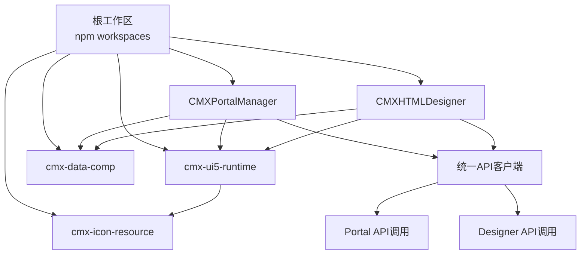
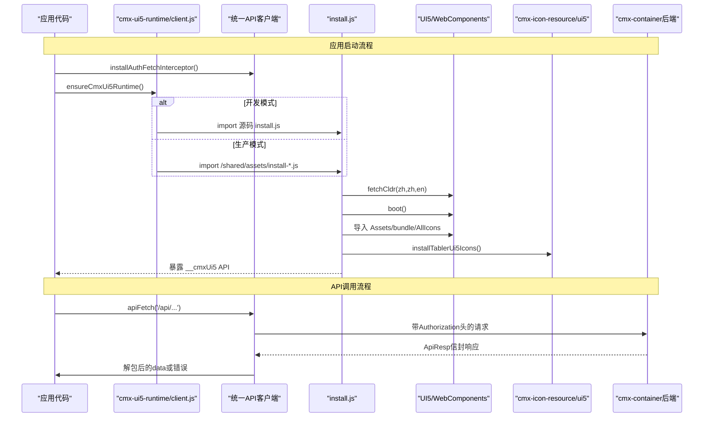
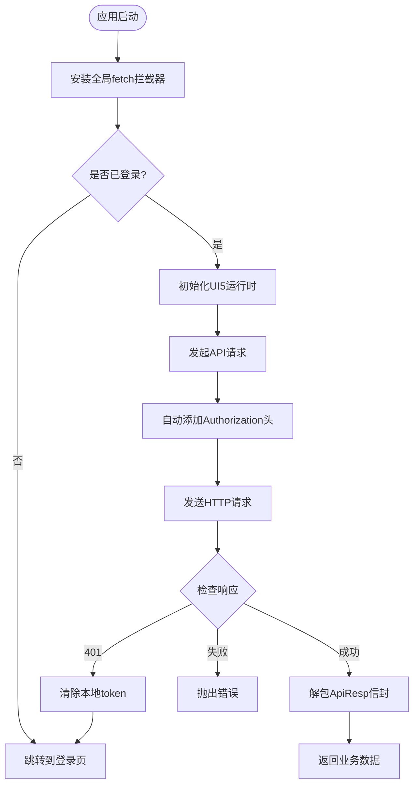
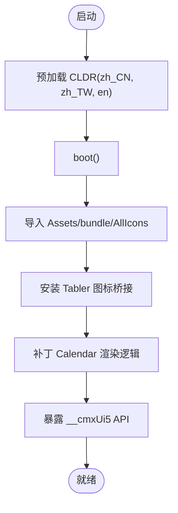
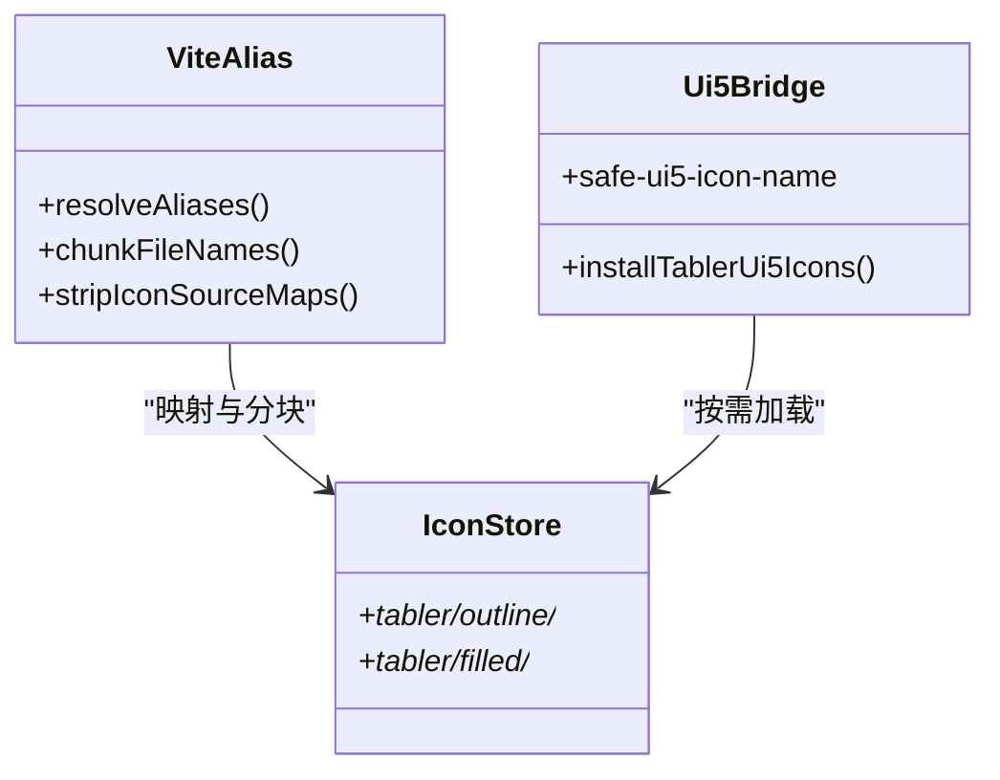
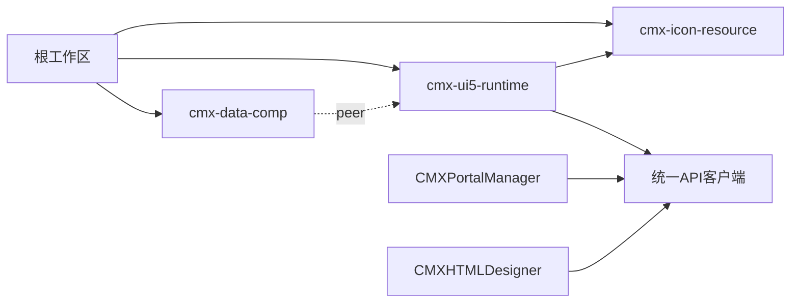

# 共享包

<cite>
**本文引用的文件**
- [package.json](file://package.json)
- [README.md](file://README.md)
- [cmx-ui5-runtime/package.json](file://packages/cmx-ui5-runtime/package.json)
- [cmx-icon-resource/package.json](file://packages/cmx-icon-resource/package.json)
- [cmx-data-comp/package.json](file://packages/cmx-data-comp/package.json)
- [cmx-ui5-runtime/vite.js](file://packages/cmx-ui5-runtime/vite.js)
- [cmx-ui5-runtime/vite-app.js](file://packages/cmx-ui5-runtime/vite-app.js)
- [cmx-ui5-runtime/src/install.js](file://packages/cmx-ui5-runtime/src/install.js)
- [cmx-ui5-runtime/src/client.js](file://packages/cmx-ui5-runtime/src/client.js)
- [cmx-ui5-runtime/src/runtime-api.js](file://packages/cmx-ui5-runtime/src/runtime-api.js)
- [cmx-ui5-runtime/src/locale-data-whitelist.js](file://packages/cmx-ui5-runtime/src/locale-data-whitelist.js)
- [cmx-ui5-runtime/src/api-client.js](file://packages/cmx-ui5-runtime/src/api-client.js)
- [cmx-icon-resource/README.md](file://packages/cmx-icon-resource/README.md)
- [cmx-icon-resource/vite.js](file://packages/cmx-icon-resource/vite.js)
- [CMXPortalManager/src/main.js](file://CMXPortalManager/src/main.js)
- [CMXHTMLDesigner/src/main.js](file://CMXHTMLDesigner/src/main.js)
- [CMXPortalManager/src/lib/auth.js](file://CMXPortalManager/src/lib/auth.js)
- [CMXHTMLDesigner/src/lib/auth.js](file://CMXHTMLDesigner/src/lib/auth.js)
- [CMXPortalManager/src/api/html-pages-api.js](file://CMXPortalManager/src/api/html-pages-api.js)
- [CMXPortalManager/src/api/activities-api.js](file://CMXPortalManager/src/api/activities-api.js)
- [CMXPortalManager/src/ai-workbench/lib/ai-api.js](file://CMXPortalManager/src/ai-workbench/lib/ai-api.js)
</cite>

## 更新摘要
**变更内容**
- 新增统一 API 客户端模块，提供 Portal 与 Designer 共享的后端通信能力
- 消除两个应用间的 API 调用代码重复，实现统一的认证、错误处理和响应封装
- 新增全局 fetch 拦截器，自动注入 Authorization 头并处理 401 未授权场景
- 支持 ApiResp 信封解析和向后兼容老后端裸错误格式
- 更新应用启动流程，在运行时初始化前安装 API 客户端拦截器

## 目录
1. [简介](#简介)
2. [项目结构](#项目结构)
3. [核心组件](#核心组件)
4. [架构总览](#架构总览)
5. [详细组件分析](#详细组件分析)
6. [依赖关系分析](#依赖关系分析)
7. [性能与体积优化](#性能与体积优化)
8. [构建、发布与最佳实践](#构建发布与最佳实践)
9. [故障排查指南](#故障排查指南)
10. [结论](#结论)
11. [附录：在不同应用中引用与使用](#附录在不同应用中引用与使用)

## 简介
本仓库为 CMX 前端 monorepo，包含门户运行时、可视化设计器以及多个共享包。本文聚焦三个共享包：
- cmx-ui5-runtime：UI5 + Tabler 的共享运行时，负责 UI5 初始化、主题切换、国际化数据裁剪与语言切换，并提供统一的 API 客户端。
- cmx-icon-resource：集中管理图标资源（含 Tabler），提供 Vite 别名、按需懒加载与 UI5 图标注册桥接。
- cmx-data-comp：数据层 Web Components 集合，提供主从协调、列模型、数据集、表单/表格等能力。

这些共享包被 CMXPortalManager 与 CMXHTMLDesigner 复用，通过统一的 /shared/ 路径托管与动态加载机制集成到应用。**新增的统一 API 客户端消除了两个应用间的代码重复问题**。

**章节来源**
- [README.md:1-73](file://README.md#L1-L73)
- [package.json:1-39](file://package.json#L1-L39)

## 项目结构
CMX 采用 npm workspaces 组织多子项目：
- packages/cmx-ui5-runtime：共享 UI5 运行时，对外暴露 client、vite、vite-app 三种入口，新增 api-client 统一 API 客户端。
- packages/cmx-icon-resource：图标资源与 Vite 插件工具，提供 tabler 与 ui5 桥接。
- packages/cmx-data-comp：数据组件库，导出大量组件与 lib。

根 package.json 定义了 workspace、脚本与全局覆盖依赖；各子包独立维护版本与依赖。



**图表来源**
- [package.json:1-39](file://package.json#L1-L39)
- [cmx-ui5-runtime/package.json:1-31](file://packages/cmx-ui5-runtime/package.json#L1-L31)
- [cmx-icon-resource/package.json:1-24](file://packages/cmx-icon-resource/package.json#L1-L24)
- [cmx-data-comp/package.json:1-102](file://packages/cmx-data-comp/package.json#L1-L102)

**章节来源**
- [package.json:1-39](file://package.json#L1-L39)
- [README.md:1-73](file://README.md#L1-L73)

## 核心组件
- cmx-ui5-runtime
  - 职责：统一初始化 UI5、预加载 CLDR 本地化数据、注册 UI5 组件与图标、安装 Tabler 图标桥接、暴露 setTheme/setLanguage/reRenderAllUI5Elements 等 API。
  - 关键入口：client.js（应用侧加载）、install.js（运行时初始化）、locale-data-whitelist.js（仅保留 zh_CN/zh_TW/en）。
  - **新增功能**：api-client.js（统一 API 客户端，提供认证、请求封装、错误处理）。
  - 构建配置：vite.js 定义 base=/shared/、分块策略、manifest/index.html 生成；vite-app.js 为消费方提供外部化 UI5、注入 runtime entry、dev 托管 /shared/。
- cmx-icon-resource
  - 职责：集中存放 SVG/PNG 图标，提供 Vite alias 将 tabler/* 映射到实际资源；按需懒加载；向 UI5 注册 tabler 图标名称。
  - 关键能力：Vite 别名、Rollup chunk 命名规则、去除图标 source map、safe-ui5-icon-name 工具。
- cmx-data-comp
  - 职责：提供丰富的数据展示与编辑组件（表格、树、表单、弹窗、过滤栏、KPI 卡片等）及底层模型（列模型、主从协调、数据集、公式计算等）。
  - 依赖：Ignite UI、Tabulator、RevoGrid、SpreadJS（商业）、UI5 peer 依赖。

**章节来源**
- [cmx-ui5-runtime/src/install.js:1-136](file://packages/cmx-ui5-runtime/src/install.js#L1-L136)
- [cmx-ui5-runtime/src/client.js:1-42](file://packages/cmx-ui5-runtime/src/client.js#L1-L42)
- [cmx-ui5-runtime/src/locale-data-whitelist.js:1-20](file://packages/cmx-ui5-runtime/src/locale-data-whitelist.js#L1-L20)
- [cmx-ui5-runtime/src/api-client.js:1-264](file://packages/cmx-ui5-runtime/src/api-client.js#L1-L264)
- [cmx-ui5-runtime/vite.js:1-159](file://packages/cmx-ui5-runtime/vite.js#L1-L159)
- [cmx-ui5-runtime/vite-app.js:1-214](file://packages/cmx-ui5-runtime/vite-app.js#L1-L214)
- [cmx-icon-resource/README.md:1-63](file://packages/cmx-icon-resource/README.md#L1-L63)
- [cmx-icon-resource/vite.js:1-82](file://packages/cmx-icon-resource/vite.js#L1-L82)
- [cmx-data-comp/package.json:1-102](file://packages/cmx-data-comp/package.json#L1-L102)

## 架构总览
共享运行时由应用通过 client.js 动态加载，生产环境加载 /shared/assets/install-*.js，开发环境直接 import 源码以共享模块实例避免双实例。运行时完成 UI5 boot、CLDR 预加载、组件与图标聚合、Tabler 桥接后暴露 API 供上层调用。

**新增统一 API 客户端架构**：Portal 和 Designer 应用现在共享同一个 API 客户端模块，消除了之前的代码重复问题。



**图表来源**
- [cmx-ui5-runtime/src/client.js:1-42](file://packages/cmx-ui5-runtime/src/client.js#L1-L42)
- [cmx-ui5-runtime/src/install.js:1-136](file://packages/cmx-ui5-runtime/src/install.js#L1-L136)
- [cmx-ui5-runtime/src/api-client.js:1-264](file://packages/cmx-ui5-runtime/src/api-client.js#L1-L264)
- [cmx-icon-resource/README.md:1-63](file://packages/cmx-icon-resource/README.md#L1-L63)

## 详细组件分析

### 统一 API 客户端（新增）
- **核心职责**
  - 自动注入 `Authorization: Bearer <token>` 请求头（token 存于 localStorage）
  - 解析 ApiResp 信封：`{ code: number, msg: string, data: T }`，code === 0 表示成功
  - 401 未授权时清除本地 token 并跳转登录页
  - 兼容老后端的裸错误 `{ error }` 格式（迁移过渡期）
  - 提供全局 fetch 拦截器，为所有 `/api/*` 请求自动添加认证信息

- **主要功能**
  - `apiFetch(path, options)`：通用请求方法，返回解包后的业务数据
  - `apiGet(path, options)`：GET 请求便捷方法
  - `apiPost(path, jsonBody, options)`：POST JSON 请求便捷方法  
  - `apiDelete(path, options)`：DELETE 请求便捷方法
  - `installAuthFetchInterceptor()`：安装全局 fetch 拦截器
  - `getToken()/setTokens()/clearTokens()`：令牌管理

- **应用集成**
  - Portal 和 Designer 在应用启动时调用 `installAuthFetchInterceptor()`
  - 所有 API 调用统一通过 `apiFetch` 或便捷方法
  - 认证逻辑集中在 `src/lib/auth.js`，复用统一客户端



**图表来源**
- [cmx-ui5-runtime/src/api-client.js:1-264](file://packages/cmx-ui5-runtime/src/api-client.js#L1-L264)
- [CMXPortalManager/src/main.js:1-49](file://CMXPortalManager/src/main.js#L1-L49)
- [CMXHTMLDesigner/src/main.js:1-29](file://CMXHTMLDesigner/src/main.js#L1-L29)

**章节来源**
- [cmx-ui5-runtime/src/api-client.js:1-264](file://packages/cmx-ui5-runtime/src/api-client.js#L1-L264)
- [CMXPortalManager/src/main.js:1-49](file://CMXPortalManager/src/main.js#L1-L49)
- [CMXHTMLDesigner/src/main.js:1-29](file://CMXHTMLDesigner/src/main.js#L1-L29)
- [CMXPortalManager/src/lib/auth.js:1-121](file://CMXPortalManager/src/lib/auth.js#L1-L121)
- [CMXHTMLDesigner/src/lib/auth.js:1-100](file://CMXHTMLDesigner/src/lib/auth.js#L1-L100)

### UI5 运行时（cmx-ui5-runtime）
- 初始化流程
  - 在 boot() 之前预加载 zh_CN、zh_TW、en 的 CLDR 数据，确保日历/日期格式化同步可用。
  - 执行 boot()，随后并行导入 Assets、bundle.esm 与 AllIcons，完成 UI5 组件与图标注册。
  - 安装 Tabler 图标桥接，使 <ui5-icon name="tabler-outline/home"> 等可直接使用。
  - 对 Calendar onAfterRendering 进行补丁，避免 dev 模式下渲染队列挂起导致头部文本未设置。
  - 暴露 API：boot、setTheme、setLanguage、getLanguage、attach/detachLanguageChange、reRenderAllUI5Elements。
- 主题管理
  - 通过 setTheme 切换主题；运行时已引入 theming 相关依赖，支持多主题切换。
- 国际化支持
  - 通过 locale-data-whitelist 仅保留 zh_CN/zh_TW/en，减少体积。
  - 提供 attachLanguageChange 监听语言变化，配合 setLanguage 实现运行时切换。
- 构建与分块
  - 按 UI5 功能域拆分 chunk（base、localization、fiori、icons-core/tnt/bs、theming、lit）。
  - 生成 manifest.json 与 index.html，便于调试与版本追踪。
  - 通过 dedupe 去重 UI5 依赖，避免重复实例。



**图表来源**
- [cmx-ui5-runtime/src/install.js:1-136](file://packages/cmx-ui5-runtime/src/install.js#L1-L136)
- [cmx-ui5-runtime/src/locale-data-whitelist.js:1-20](file://packages/cmx-ui5-runtime/src/locale-data-whitelist.js#L1-L20)

**章节来源**
- [cmx-ui5-runtime/src/install.js:1-136](file://packages/cmx-ui5-runtime/src/install.js#L1-L136)
- [cmx-ui5-runtime/src/client.js:1-42](file://packages/cmx-ui5-runtime/src/client.js#L1-L42)
- [cmx-ui5-runtime/src/runtime-api.js:1-13](file://packages/cmx-ui5-runtime/src/runtime-api.js#L1-L13)
- [cmx-ui5-runtime/src/locale-data-whitelist.js:1-20](file://packages/cmx-ui5-runtime/src/locale-data-whitelist.js#L1-L20)
- [cmx-ui5-runtime/vite.js:1-159](file://packages/cmx-ui5-runtime/vite.js#L1-L159)

### 图标资源包（cmx-icon-resource）
- 使用规范
  - 在应用启动时安装 Tabler 桥接后，可在 UI5 组件上直接使用 tabler-* 名称。
  - 支持三段式写法（如 tabler/outline/home），内部会规范化。
  - 静态 import 支持 .svg 与 ?raw 获取原始内容。
- 自定义图标添加
  - 将新图标放入 src/icons/tabler/{outline,filled} 对应目录，遵循文件名即图标名的约定。
  - 若需新增样式或别名，可在 vite.js 的别名中扩展映射。
- 按需懒加载
  - 通过 import.meta.glob ?raw 与 Rollup chunk 策略，仅打包页面实际使用的图标。
  - 构建时剥离 images/ 下图标 chunk 的 source map，减小产物体积。



**图表来源**
- [cmx-icon-resource/vite.js:1-82](file://packages/cmx-icon-resource/vite.js#L1-L82)
- [cmx-icon-resource/README.md:1-63](file://packages/cmx-icon-resource/README.md#L1-L63)

**章节来源**
- [cmx-icon-resource/README.md:1-63](file://packages/cmx-icon-resource/README.md#L1-L63)
- [cmx-icon-resource/vite.js:1-82](file://packages/cmx-icon-resource/vite.js#L1-L82)

### 数据组件包（cmx-data-comp）
- 版本管理与依赖
  - 明确声明业务组件与第三方库版本（Ignite UI、Tabulator、RevoGrid、SpreadJS 等）。
  - 通过 peerDependencies 声明与 UI5 的版本兼容范围，避免版本冲突。
- 功能概览
  - 组件：表格、树、表单、弹窗、面板、工具栏、状态标签、空态、过滤栏、KPI 卡片等。
  - 库：主从协调、列模型、数据集、异步数据源、字典数据源、公式计算、弹性组合引擎等。
- 使用建议
  - 在需要复杂表格/表单场景优先选用该包提供的组件，保证风格一致性与可维护性。
  - 注意 SpreadJS 为商业依赖，需自备授权；非报表链路不影响其他功能。

**章节来源**
- [cmx-data-comp/package.json:1-102](file://packages/cmx-data-comp/package.json#L1-L102)

## 依赖关系分析
- 根工作区
  - 通过 workspaces 统一管理 packages/* 与两个应用子项目。
  - 提供统一脚本构建 runtime、portal、html designer。
- cmx-ui5-runtime
  - 依赖 @ui5/webcomponents* 系列与 cmx-icon-resource。
  - 通过 vite.js 与 vite-app.js 为消费方提供构建期与运行期集成能力。
  - **新增**：api-client.js 被 Portal 和 Designer 共同依赖，消除重复代码。
- cmx-icon-resource
  - 无强依赖，peer 依赖 @ui5/webcomponents-base，用于 UI5 图标注册。
- cmx-data-comp
  - 依赖 Ignite UI、Tabulator、RevoGrid、SpreadJS 等，peer 依赖 UI5。



**图表来源**
- [package.json:1-39](file://package.json#L1-L39)
- [cmx-ui5-runtime/package.json:1-31](file://packages/cmx-ui5-runtime/package.json#L1-L31)
- [cmx-icon-resource/package.json:1-24](file://packages/cmx-icon-resource/package.json#L1-L24)
- [cmx-data-comp/package.json:1-102](file://packages/cmx-data-comp/package.json#L1-L102)

**章节来源**
- [package.json:1-39](file://package.json#L1-L39)
- [cmx-ui5-runtime/package.json:1-31](file://packages/cmx-ui5-runtime/package.json#L1-L31)
- [cmx-icon-resource/package.json:1-24](file://packages/cmx-icon-resource/package.json#L1-L24)
- [cmx-data-comp/package.json:1-102](file://packages/cmx-data-comp/package.json#L1-L102)

## 性能与体积优化
- 国际化数据裁剪
  - 通过 locale-data-whitelist 仅保留 zh_CN/zh_TW/en，显著减少 LocaleData 体积。
- 图标按需加载
  - 基于 import.meta.glob ?raw 与 Rollup chunk 策略，只打包实际使用的 Tabler 图标。
  - 构建时剥离 images/ 下图标 chunk 的 source map，进一步减小产物。
- UI5 依赖去重
  - 通过 dedupe 列表确保 UI5 相关依赖只有一份实例，避免双实例问题与内存浪费。
- 分块策略
  - 将 UI5 的功能域拆分为 base、localization、fiori、icons-core/tnt/bs、theming、lit，提升缓存命中与并行加载效率。
- **新增 API 客户端优化**
  - 统一认证处理减少重复代码，降低整体包体积。
  - 智能请求拦截避免不必要的 token 注入和重复处理。

[本节为通用指导，不直接分析具体文件]

## 构建、发布与最佳实践
- 构建命令
  - 根脚本：build:runtime、build:apps 等，统一编排子项目构建顺序。
  - cmx-ui5-runtime：npm run build 产出 /shared/assets/install-*.js 与 manifest.json。
- 发布流程
  - 当前各包标记为 private，适合在 monorepo 内复用；如需独立发布，请调整 package.json 的 private 字段与发布脚本。
  - 发布前确保 UI5 与图标资源版本稳定，并在应用侧验证 theme/locale 行为。
- 最佳实践
  - 应用侧统一通过 cmx-ui5-runtime/client.ensureCmxUi5Runtime() 加载运行时，避免重复初始化。
  - **新增**：在应用启动时立即调用 `installAuthFetchInterceptor()` 安装全局 API 拦截器。
  - 主题切换使用 setTheme，语言切换使用 setLanguage 并监听语言变化事件。
  - 图标使用 tabler-* 名称，新增图标放入指定目录并按需引用。
  - 数据组件优先复用 cmx-data-comp 提供的组件与 lib，保持风格与交互一致性。
  - **新增**：所有 API 调用统一使用 `apiFetch` 或便捷方法，避免直接使用 fetch。

**章节来源**
- [package.json:1-39](file://package.json#L1-L39)
- [cmx-ui5-runtime/vite.js:1-159](file://packages/cmx-ui5-runtime/vite.js#L1-L159)
- [cmx-ui5-runtime/vite-app.js:1-214](file://packages/cmx-ui5-runtime/vite-app.js#L1-L214)
- [cmx-icon-resource/README.md:1-63](file://packages/cmx-icon-resource/README.md#L1-L63)
- [CMXPortalManager/src/main.js:1-49](file://CMXPortalManager/src/main.js#L1-L49)
- [CMXHTMLDesigner/src/main.js:1-29](file://CMXHTMLDesigner/src/main.js#L1-L29)

## 故障排查指南
- 双实例问题
  - 现象：Multiple UI5 Web Components instances detected。
  - 原因：应用与 runtime 各自加载了不同的 UI5 实例。
  - 解决：确保应用侧通过 client.js 加载运行时；构建模式下 external UI5，dev 模式走 Vite alias 共享实例。
- 日历头部文本 undefined
  - 现象：DatePicker/Calendar 头部月份/年份显示异常。
  - 原因：LocaleData 同步读取时机不当。
  - 解决：已在 install.js 中预加载 CLDR 并对 Calendar onAfterRendering 打补丁。
- 图标未生效
  - 现象：<ui5-icon name="tabler-..."> 不显示。
  - 原因：未安装 Tabler 桥接或资源路径不正确。
  - 解决：确保安装桥接并使用正确的 tabler-* 名称；检查 Vite alias 与 chunk 输出。
- 构建产物缺失
  - 现象：应用找不到 /shared/assets/install-*.js。
  - 原因：未先构建 cmx-ui5-runtime。
  - 解决：先执行 npm run build -w cmx-ui5-runtime，再构建应用。
- **新增 API 客户端相关问题**
  - 现象：API 请求缺少 Authorization 头或 401 循环跳转。
  - 原因：未正确安装全局拦截器或登录状态异常。
  - 解决：确保在应用启动时调用 `installAuthFetchInterceptor()`；检查 localStorage 中的 token 状态。
  - 现象：ApiResp 信封解析失败。
  - 原因：后端响应格式不符合预期。
  - 解决：检查后端是否正确返回 `{ code, msg, data }` 格式；确认迁移过渡期的兼容性处理。

**章节来源**
- [cmx-ui5-runtime/src/install.js:1-136](file://packages/cmx-ui5-runtime/src/install.js#L1-L136)
- [cmx-ui5-runtime/vite-app.js:1-214](file://packages/cmx-ui5-runtime/vite-app.js#L1-L214)
- [cmx-icon-resource/README.md:1-63](file://packages/cmx-icon-resource/README.md#L1-L63)
- [cmx-ui5-runtime/src/api-client.js:1-264](file://packages/cmx-ui5-runtime/src/api-client.js#L1-L264)

## 结论
CMX 共享包通过统一的运行时与资源管理，实现了 UI5 初始化、主题与国际化的一致体验，同时提供了高效的图标资源管理与丰富的数据组件能力。**新增的统一 API 客户端进一步消除了 Portal 和 Designer 两个应用间的代码重复问题**，提供了统一的认证、错误处理和响应封装机制。借助 Vite 插件与构建策略，项目在开发与生产环境下均能保持良好的性能与可维护性。建议在所有应用中统一引用这些共享包，以确保风格、行为与性能的一致性。

[本节为总结，不直接分析具体文件]

## 附录：在不同应用中引用与使用
- 在 CMXPortalManager 与 CMXHTMLDesigner 中
  - 通过根脚本构建 runtime 与应用，确保 /shared/ 路径可用。
  - 应用侧调用 ensureCmxUi5Runtime() 获取 API，然后使用 setTheme/setLanguage 等能力。
  - **新增**：在应用启动时立即调用 `installAuthFetchInterceptor()` 安装全局 API 拦截器。
- 在其他 Vite 应用中
  - 安装 cmx-icon-resource 并合并其 Vite alias。
  - 在 UI5 bundle 加载后安装 Tabler 桥接。
  - 通过 cmx-ui5-runtime/vite-app 插件 external 化 UI5，注入 runtime entry。
  - **新增**：导入并使用 `cmx-ui5-runtime/api-client` 中的统一 API 客户端。
- 图标使用
  - 直接使用 tabler-* 名称；静态资源可通过 import 获取 URL 或 raw 内容。
- 数据组件
  - 按需引入所需组件与 lib，遵循其导出路径与用法说明。
- **新增 API 客户端使用示例**
  ```javascript
  // 基本 GET 请求
  import { apiGet } from 'cmx-ui5-runtime/api-client'
  const data = await apiGet('/api/domains')
  
  // POST JSON 请求
  import { apiPost } from 'cmx-ui5-runtime/api-client'
  const result = await apiPost('/api/html-pages', { id: 'page1', html: '<div>Hello</div>' })
  
  // 删除请求
  import { apiDelete } from 'cmx-ui5-runtime/api-client'
  await apiDelete('/api/html-pages/page1')
  
  // 通用请求
  import { apiFetch } from 'cmx-ui5-runtime/api-client'
  const response = await apiFetch('/api/custom-endpoint', { method: 'PUT', body: JSON.stringify(data) })
  ```

**章节来源**
- [cmx-ui5-runtime/vite-app.js:1-214](file://packages/cmx-ui5-runtime/vite-app.js#L1-L214)
- [cmx-icon-resource/README.md:1-63](file://packages/cmx-icon-resource/README.md#L1-L63)
- [cmx-data-comp/package.json:1-102](file://packages/cmx-data-comp/package.json#L1-L102)
- [cmx-ui5-runtime/src/api-client.js:1-264](file://packages/cmx-ui5-runtime/src/api-client.js#L1-L264)
- [CMXPortalManager/src/api/html-pages-api.js:1-52](file://CMXPortalManager/src/api/html-pages-api.js#L1-L52)
- [CMXPortalManager/src/api/activities-api.js:1-233](file://CMXPortalManager/src/api/activities-api.js#L1-L233)
- [CMXPortalManager/src/ai-workbench/lib/ai-api.js:1-93](file://CMXPortalManager/src/ai-workbench/lib/ai-api.js#L1-L93)