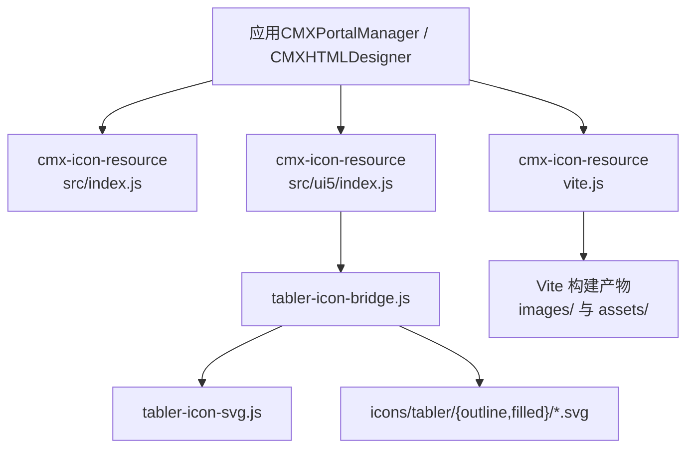
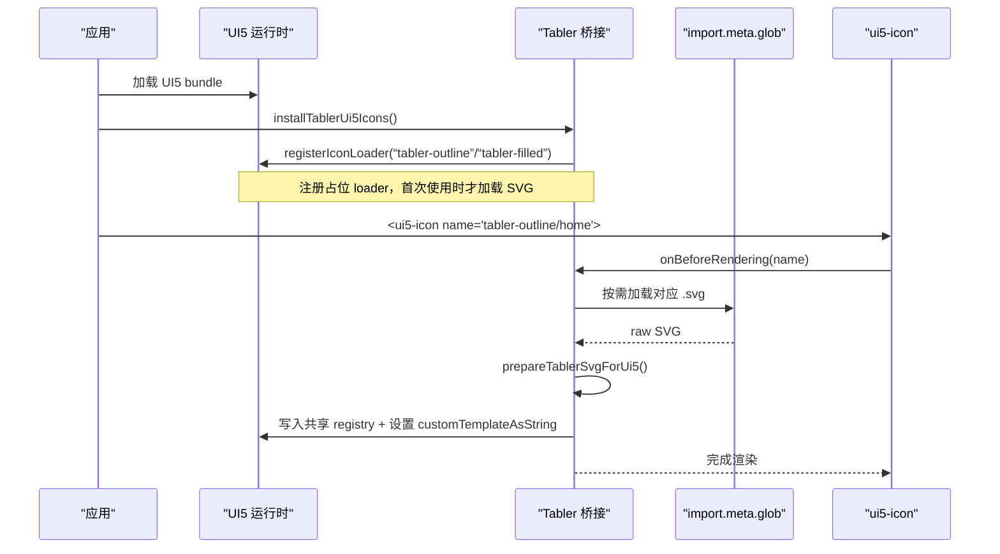
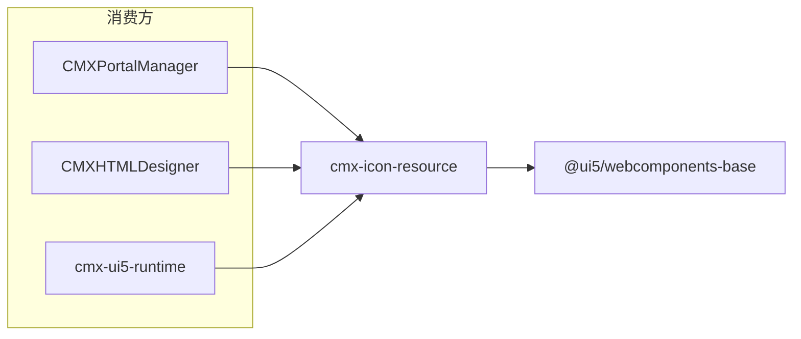

# 图标资源 (cmx-icon-resource)

<cite>
**本文引用的文件**
- [packages/cmx-icon-resource/package.json](file://packages/cmx-icon-resource/package.json)
- [packages/cmx-icon-resource/README.md](file://packages/cmx-icon-resource/README.md)
- [packages/cmx-icon-resource/src/index.js](file://packages/cmx-icon-resource/src/index.js)
- [packages/cmx-icon-resource/vite.js](file://packages/cmx-icon-resource/vite.js)
- [packages/cmx-icon-resource/src/ui5/index.js](file://packages/cmx-icon-resource/src/ui5/index.js)
- [packages/cmx-icon-resource/src/ui5/tabler-icon-bridge.js](file://packages/cmx-icon-resource/src/ui5/tabler-icon-bridge.js)
- [packages/cmx-icon-resource/src/ui5/tabler-icon-svg.js](file://packages/cmx-icon-resource/src/ui5/tabler-icon-svg.js)
- [packages/cmx-icon-resource/src/ui5/safe-ui5-icon-name.js](file://packages/cmx-icon-resource/src/ui5/safe-ui5-icon-name.js)
- [packages/cmx-ui5-runtime/vite.js](file://packages/cmx-ui5-runtime/vite.js)
- [packages/cmx-ui5-runtime/src/install.js](file://packages/cmx-ui5-runtime/src/install.js)
- [CMXPortalManager/src/main.js](file://CMXPortalManager/src/main.js)
</cite>

## 目录
1. [简介](#简介)
2. [项目结构](#项目结构)
3. [核心组件](#核心组件)
4. [架构总览](#架构总览)
5. [详细组件分析](#详细组件分析)
6. [依赖关系分析](#依赖关系分析)
7. [性能与缓存](#性能与缓存)
8. [故障排查](#故障排查)
9. [结论](#结论)
10. [附录：使用清单与最佳实践](#附录使用清单与最佳实践)

## 简介
本指南面向在 CMX 系列项目中统一使用图标资源的开发者，说明 cmx-icon-resource 作为集中式图标资源包的作用、组织结构、命名规范、分类体系，以及在 UI5 环境中的集成方式。同时提供静态引用与动态加载两种用法、自定义图标的添加流程与格式要求、性能优化与缓存策略，以及与 UI5 图标系统的兼容注意事项。

## 项目结构
cmx-icon-resource 是一个独立的 npm 包，通过 exports 暴露多种入口，供不同消费方按需引入：
- 根入口：导出安装函数、路径工具与常量
- ui5 入口：提供 Tabler → UI5 的桥接能力
- vite 插件：提供别名解析、chunk 命名与 source map 裁剪
- 图标资源：icons/tabler/{outline,filled} 存放 SVG 源文件

图表来源
- [packages/cmx-icon-resource/src/index.js:1-33](file://packages/cmx-icon-resource/src/index.js#L1-L33)
- [packages/cmx-icon-resource/vite.js:1-82](file://packages/cmx-icon-resource/vite.js#L1-L82)
- [packages/cmx-icon-resource/src/ui5/index.js:1-11](file://packages/cmx-icon-resource/src/ui5/index.js#L1-L11)
- [packages/cmx-icon-resource/src/ui5/tabler-icon-bridge.js:1-221](file://packages/cmx-icon-resource/src/ui5/tabler-icon-bridge.js#L1-L221)
- [packages/cmx-icon-resource/src/ui5/tabler-icon-svg.js:1-87](file://packages/cmx-icon-resource/src/ui5/tabler-icon-svg.js#L1-L87)

章节来源
- [packages/cmx-icon-resource/package.json:1-23](file://packages/cmx-icon-resource/package.json#L1-L23)
- [packages/cmx-icon-resource/README.md:1-63](file://packages/cmx-icon-resource/README.md#L1-L63)

## 核心组件
- 资源入口 index.js：统一导出安装函数、名称格式化与路径工具，并声明支持的变体集合
- Vite 工具 vite.js：提供 resolve.alias、chunk 命名规则、source map 裁剪，确保图标懒加载与产物隔离
- UI5 桥接 ui5/index.js：对外暴露安装与校验工具
- 桥接实现 tabler-icon-bridge.js：基于 import.meta.glob 按需加载 SVG，注入 UI5 共享注册表，并在 onBeforeRendering 中动态渲染
- SVG 处理 tabler-icon-svg.js：解析/规范化名称、提取 viewBox、清理占位 path、为 outline 补 stroke 组与 fill="none"
- 安全白名单 safe-ui5-icon-name.js：对 name 属性进行白名单校验，防止非法值进入 UI5

章节来源
- [packages/cmx-icon-resource/src/index.js:1-33](file://packages/cmx-icon-resource/src/index.js#L1-L33)
- [packages/cmx-icon-resource/vite.js:1-82](file://packages/cmx-icon-resource/vite.js#L1-L82)
- [packages/cmx-icon-resource/src/ui5/index.js:1-11](file://packages/cmx-icon-resource/src/ui5/index.js#L1-L11)
- [packages/cmx-icon-resource/src/ui5/tabler-icon-bridge.js:1-221](file://packages/cmx-icon-resource/src/ui5/tabler-icon-bridge.js#L1-L221)
- [packages/cmx-icon-resource/src/ui5/tabler-icon-svg.js:1-87](file://packages/cmx-icon-resource/src/ui5/tabler-icon-svg.js#L1-L87)
- [packages/cmx-icon-resource/src/ui5/safe-ui5-icon-name.js:1-20](file://packages/cmx-icon-resource/src/ui5/safe-ui5-icon-name.js#L1-L20)

## 架构总览
下图展示从应用到 UI5 渲染的完整链路，包括启动时安装、运行时按需加载与渲染。

图表来源
- [packages/cmx-icon-resource/src/ui5/tabler-icon-bridge.js:186-221](file://packages/cmx-icon-resource/src/ui5/tabler-icon-bridge.js#L186-L221)
- [packages/cmx-icon-resource/src/ui5/tabler-icon-svg.js:61-87](file://packages/cmx-icon-resource/src/ui5/tabler-icon-svg.js#L61-L87)

## 详细组件分析

### 命名规范与分类体系
- 分类：当前支持 outline（线框）与 filled（实心）两套风格
- 命名：
  - 两段式：tabler-outline/xxx、tabler-filled/xxx
  - 三段式：tabler/outline/xxx、tabler/filled/xxx（会被规范化为两段式）
- 图标名：对应 Tabler 文件名（不含 .svg），如 home、arrow-right、brand-github

章节来源
- [packages/cmx-icon-resource/README.md:20-28](file://packages/cmx-icon-resource/README.md#L20-L28)
- [packages/cmx-icon-resource/src/ui5/tabler-icon-svg.js:9-21](file://packages/cmx-icon-resource/src/ui5/tabler-icon-svg.js#L9-L21)

### 在应用中启用与引用
- 在 Vite 项目中合并别名：引入 cmxIconResourceResolveAliases 并加入 resolve.alias
- 在 UI5 bundle 加载后调用 installTablerUi5Icons 一次即可
- 静态引用：通过别名直接 import 具体 SVG（URL 或 ?raw）
- 在 UI5 组件中使用：name 写 tabler-outline/xxx 或 tabler-filled/xxx

章节来源
- [packages/cmx-icon-resource/README.md:30-50](file://packages/cmx-icon-resource/README.md#L30-L50)
- [packages/cmx-icon-resource/vite.js:62-81](file://packages/cmx-icon-resource/vite.js#L62-L81)
- [packages/cmx-icon-resource/src/index.js:1-33](file://packages/cmx-icon-resource/src/index.js#L1-L33)

### UI5 集成与兼容性
- 通过注册 icon loader 与 patch ui5-icon.onBeforeRendering，实现“像 SAP Icons 一样”的字符串 name 写法
- 自动将 name 规范化为 tabler-{variant}/iconName
- 对 outline 样式进行增强：去除占位 path、补充 stroke 组与 fill="none"，避免 currentColor 导致的黑块问题
- 与现有 SAP 图标共存：safeUi5IconName 允许 tnt/business-suite 等前缀

章节来源
- [packages/cmx-icon-resource/src/ui5/tabler-icon-bridge.js:186-221](file://packages/cmx-icon-resource/src/ui5/tabler-icon-bridge.js#L186-L221)
- [packages/cmx-icon-resource/src/ui5/tabler-icon-svg.js:34-59](file://packages/cmx-icon-resource/src/ui5/tabler-icon-svg.js#L34-L59)
- [packages/cmx-icon-resource/src/ui5/safe-ui5-icon-name.js:1-20](file://packages/cmx-icon-resource/src/ui5/safe-ui5-icon-name.js#L1-L20)

### 自定义图标添加流程
- 新增图标：将 SVG 放入 src/icons/tabler/{outline,filled} 对应目录，文件名即图标名（不含 .svg）
- 若需新变体：扩展 TABLER_VARIANTS 与 svgLoaders 映射，并在命名解析/格式化逻辑中增加支持
- 重新构建：Vite 会通过 import.meta.glob 发现新文件并纳入懒加载 chunk

章节来源
- [packages/cmx-icon-resource/src/index.js:22-32](file://packages/cmx-icon-resource/src/index.js#L22-L32)
- [packages/cmx-icon-resource/src/ui5/tabler-icon-bridge.js:20-30](file://packages/cmx-icon-resource/src/ui5/tabler-icon-bridge.js#L20-L30)

### 构建期优化与产物组织
- 图标 chunk 输出至 images/，其余 JS 输出至 assets/，便于区分与缓存
- 图标 chunk 不生成 source map，减少产物体积
- 通过 isCmxIconRollupChunk 识别包含 Tabler SVG 的 chunk

章节来源
- [packages/cmx-icon-resource/vite.js:15-60](file://packages/cmx-icon-resource/vite.js#L15-L60)

## 依赖关系分析
- 运行期依赖：@ui5/webcomponents-base（用于共享注册表与图标 API）
- 构建期依赖：Vite/Rollup（别名、glob、chunk 命名）
- 消费方：CMXPortalManager、CMXHTMLDesigner、cmx-ui5-runtime 均通过别名与安装流程接入

图表来源
- [packages/cmx-icon-resource/package.json:17-18](file://packages/cmx-icon-resource/package.json#L17-L18)
- [packages/cmx-ui5-runtime/vite.js:94-112](file://packages/cmx-ui5-runtime/vite.js#L94-L112)
- [packages/cmx-ui5-runtime/src/install.js:52-53](file://packages/cmx-ui5-runtime/src/install.js#L52-L53)

章节来源
- [packages/cmx-icon-resource/package.json:1-23](file://packages/cmx-icon-resource/package.json#L1-L23)
- [packages/cmx-ui5-runtime/vite.js:85-115](file://packages/cmx-ui5-runtime/vite.js#L85-L115)
- [packages/cmx-ui5-runtime/src/install.js:52-53](file://packages/cmx-ui5-runtime/src/install.js#L52-L53)
- [CMXPortalManager/src/main.js:22-43](file://CMXPortalManager/src/main.js#L22-L43)

## 性能与缓存
- 按需懒加载：仅当页面实际使用某个 Tabler 图标时才加载对应 SVG，避免一次性下载全部图标
- 请求去重：inflight Map 保证同一图标并发请求只发起一次
- 内存缓存：svgRawCache 缓存已加载的原始 SVG，避免重复解析
- 产物隔离：图标 chunk 输出到 images/，可独立缓存；主包输出到 assets/
- Source map 裁剪：图标 chunk 不产出 .map，减小产物体积
- 渲染优化：prepareTablerSvgForUi5 移除多余占位 path，并为 outline 补充必要属性，减少渲染异常与重绘

章节来源
- [packages/cmx-icon-resource/src/ui5/tabler-icon-bridge.js:32-35](file://packages/cmx-icon-resource/src/ui5/tabler-icon-bridge.js#L32-L35)
- [packages/cmx-icon-resource/src/ui5/tabler-icon-bridge.js:116-134](file://packages/cmx-icon-resource/src/ui5/tabler-icon-bridge.js#L116-L134)
- [packages/cmx-icon-resource/src/ui5/tabler-icon-svg.js:34-87](file://packages/cmx-icon-resource/src/ui5/tabler-icon-svg.js#L34-L87)
- [packages/cmx-icon-resource/vite.js:32-60](file://packages/cmx-icon-resource/vite.js#L32-L60)

## 故障排查
- 未安装桥接导致 name 无效：确保在 UI5 bundle 加载后调用 installTablerUi5Icons
- ui5-icon 未定义：若 ui5-icon 尚未定义，install 会等待其定义后再 patch
- 找不到图标：控制台会输出警告，检查文件名与变体是否匹配
- 名称不规范：使用 safeUi5IconName 对 name 做白名单校验，非法值回退为默认图标
- 构建产物过大：确认已启用 cmxIconResourceStripIconSourceMapsPlugin，且别名正确

章节来源
- [packages/cmx-icon-resource/src/ui5/tabler-icon-bridge.js:186-221](file://packages/cmx-icon-resource/src/ui5/tabler-icon-bridge.js#L186-L221)
- [packages/cmx-icon-resource/src/ui5/tabler-icon-bridge.js:116-134](file://packages/cmx-icon-resource/src/ui5/tabler-icon-bridge.js#L116-L134)
- [packages/cmx-icon-resource/src/ui5/safe-ui5-icon-name.js:1-20](file://packages/cmx-icon-resource/src/ui5/safe-ui5-icon-name.js#L1-L20)
- [packages/cmx-icon-resource/vite.js:43-60](file://packages/cmx-icon-resource/vite.js#L43-L60)

## 结论
cmx-icon-resource 以“集中资源 + 按需加载 + UI5 友好”的方式，为 CMX 系列项目提供了统一的图标解决方案。通过规范的命名与分类、完善的构建期优化与运行时缓存机制，既保证了开发体验，也兼顾了性能与可维护性。配合 safeUi5IconName 与现有 SAP 图标体系，可在不破坏既有代码的前提下平滑接入。

## 附录：使用清单与最佳实践
- 启用步骤
  - 在 Vite 配置中合并 cmxIconResourceResolveAliases
  - 在 UI5 bundle 加载后调用 installTablerUi5Icons
- 引用方式
  - UI5 组件：name 使用 tabler-outline/xxx 或 tabler-filled/xxx
  - 静态资源：import 'tabler/outline/home.svg' 或 '?raw'
- 自定义图标
  - 将 SVG 放入 icons/tabler/{outline,filled} 对应目录
  - 如需新变体，扩展 TABLER_VARIANTS 与相关逻辑
- 最佳实践
  - 优先使用 outline 风格，保持视觉一致性
  - 使用 safeUi5IconName 对所有 name 做白名单校验
  - 关注首屏图标数量，避免过多不同图标导致网络抖动
  - 利用 images/ 与 assets/ 的分离缓存策略提升复用率

章节来源
- [packages/cmx-icon-resource/README.md:30-50](file://packages/cmx-icon-resource/README.md#L30-L50)
- [packages/cmx-icon-resource/src/ui5/safe-ui5-icon-name.js:1-20](file://packages/cmx-icon-resource/src/ui5/safe-ui5-icon-name.js#L1-L20)
- [packages/cmx-icon-resource/vite.js:62-81](file://packages/cmx-icon-resource/vite.js#L62-L81)
- [packages/cmx-ui5-runtime/vite.js:85-115](file://packages/cmx-ui5-runtime/vite.js#L85-L115)
- [packages/cmx-ui5-runtime/src/install.js:52-53](file://packages/cmx-ui5-runtime/src/install.js#L52-L53)
- [CMXPortalManager/src/main.js:22-43](file://CMXPortalManager/src/main.js#L22-L43)