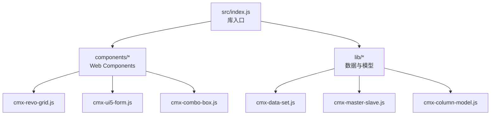
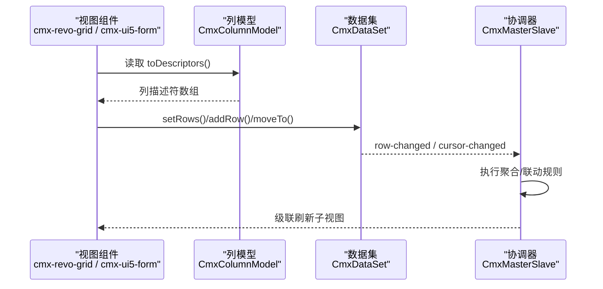
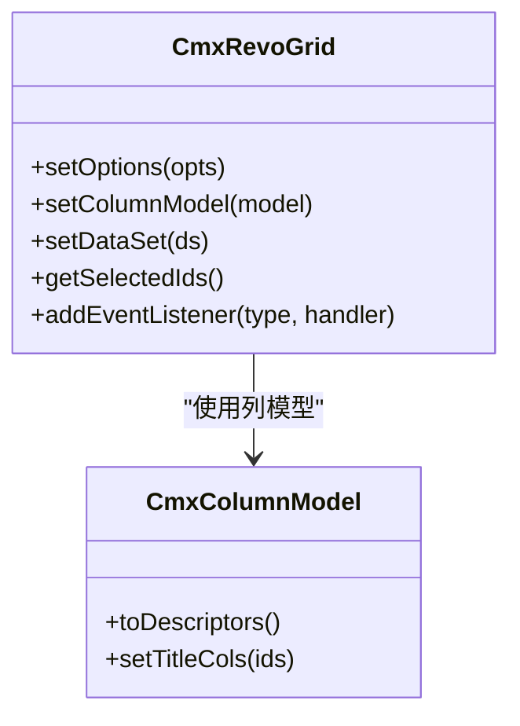
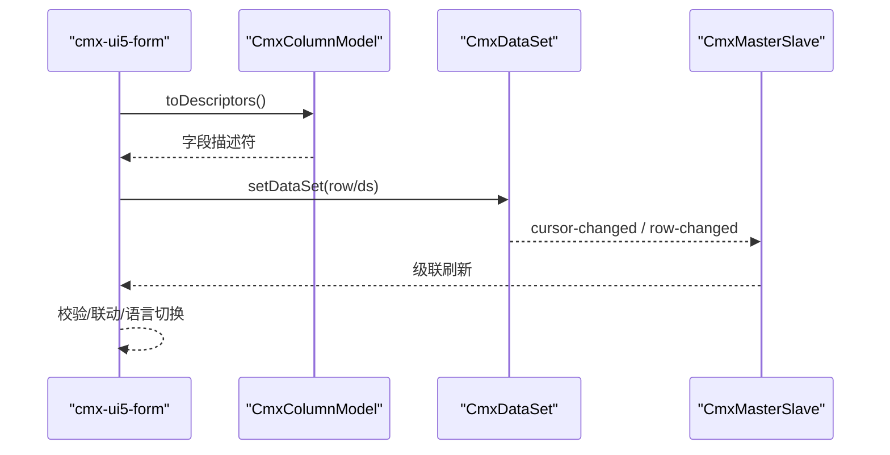
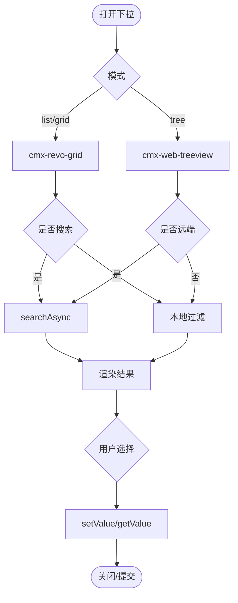
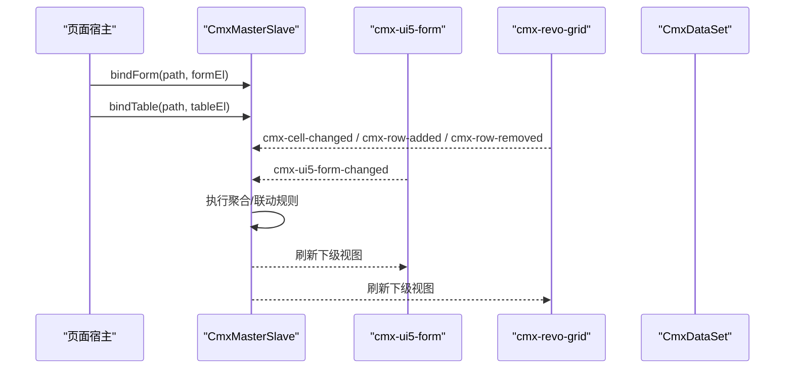
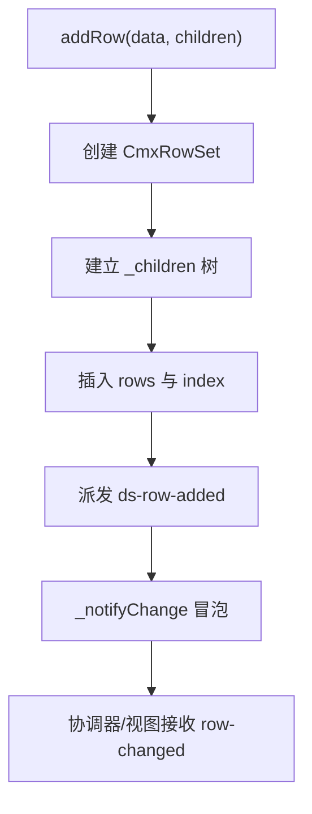
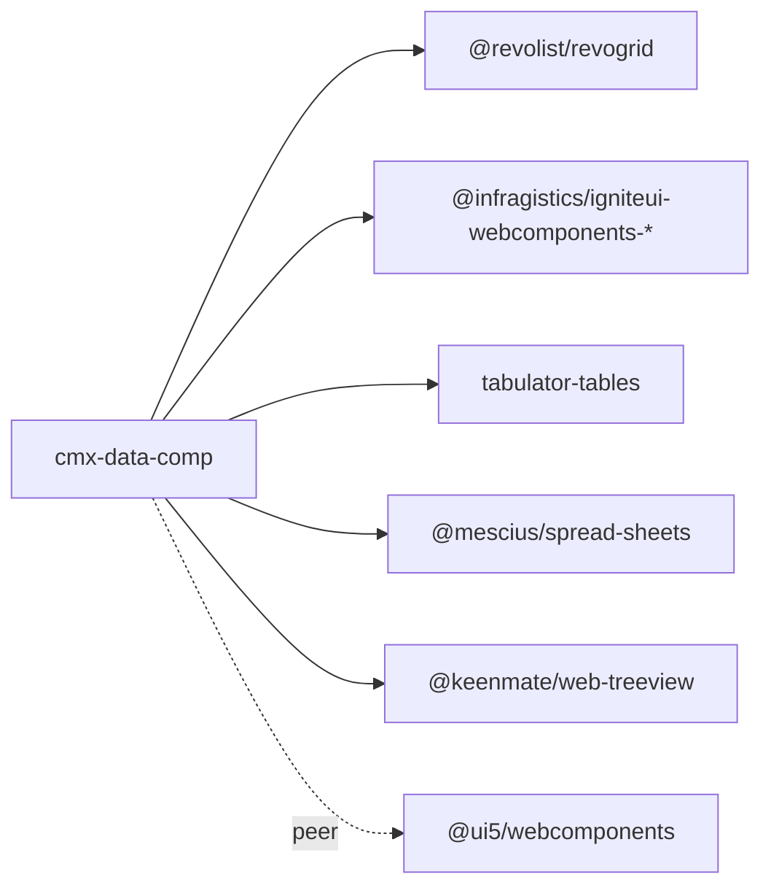

# 数据组件库 (cmx-data-comp)

<cite>
**本文引用的文件**
- [package.json](file://packages/cmx-data-comp/package.json)
- [README.md](file://packages/cmx-data-comp/README.md)
- [index.js](file://packages/cmx-data-comp/src/index.js)
- [cmx-revo-grid.js](file://packages/cmx-data-comp/src/components/cmx-revo-grid.js)
- [cmx-ui5-form.js](file://packages/cmx-data-comp/src/components/cmx-ui5-form.js)
- [cmx-combo-box.js](file://packages/cmx-data-comp/src/components/cmx-combo-box.js)
- [cmx-master-slave.js](file://packages/cmx-data-comp/src/lib/cmx-master-slave.js)
- [cmx-data-set.js](file://packages/cmx-data-comp/src/lib/cmx-data-set.js)
- [cmx-column-model.js](file://packages/cmx-data-comp/src/lib/cmx-column-model.js)
</cite>

## 目录
1. [简介](#简介)
2. [项目结构](#项目结构)
3. [核心组件](#核心组件)
4. [架构总览](#架构总览)
5. [详细组件分析](#详细组件分析)
6. [依赖关系分析](#依赖关系分析)
7. [性能考虑](#性能考虑)
8. [故障排查指南](#故障排查指南)
9. [结论](#结论)
10. [附录](#附录)

## 简介
本包为企业级数据组件集合，提供表单、表格、组合框等常用 UI 组件，以及统一的数据模型与协调器能力。其核心价值在于：
- 统一的列模型与字段定义，驱动多种渲染后端（RevoGrid、UI5 Form、Tabulator、Web Treeview 等）
- 主从多表数据协调器，管理父子视图联动、聚合计算与事件传播
- 数据集与行集抽象，提供增删改查、游标定位、变更通知与树形嵌套
- 可插拔的字段类型注册机制与公式/表达式计算
- 通过 ESM 按需引入，避免首屏体积膨胀；对重型组件（如 SpreadJS）采用懒加载

## 项目结构
- src/components：各类 Web Components（表格、表单、组合框、面板、工具栏、状态标签、空态、描述列表、过滤栏、KPI 卡片等）
- src/lib：数据层与模型（CmxDataSet、CmxRowSet、CmxColumnModel、CmxMasterSlave、字典/单据元数据、灵活组合、公式计算、消息与 Toast、皮肤运行时等）
- src/index.js：库入口，负责批量注册组件、导出公共 API、懒加载重型组件

图表来源
- [index.js:1-120](file://packages/cmx-data-comp/src/index.js#L1-L120)

章节来源
- [README.md:1-31](file://packages/cmx-data-comp/README.md#L1-L31)
- [package.json:1-102](file://packages/cmx-data-comp/package.json#L1-L102)
- [index.js:1-195](file://packages/cmx-data-comp/src/index.js#L1-L195)

## 核心组件
- 表格组件 cmx-revo-grid：基于 RevoGrid 封装，支持虚拟滚动、选择模式、合计行、Neo 皮肤、单元格编辑、文本选择、Tooltip、自适应拉伸等；列定义统一通过 CmxColumnModel 注入。
- 表单组件 cmx-ui5-form：基于 UI5 Form 的单行编辑表单，响应式布局，字段类型丰富，支持联动、校验、语言切换重渲染 label。
- 组合框 cmx-combo-box：数据模型驱动的下拉/树/网格选择器，支持本地与远端数据源、分页、搜索、扩展按钮、弹出层模式切换。
- 主从协调器 CmxMasterSlave：维护递归主从数据树，绑定表单/表格视图，管理当前选中行与级联刷新，监听编辑/增删事件并执行聚合规则。
- 数据集 CmxDataSet：多级数据集，内部以 CmxRowSet 数组存储，支持行增删改、游标导航、变更事件冒泡、JSON 序列化。
- 列模型 CmxColumnModel：纯元数据的列配置方案，输出通用描述符供适配器转换为具体 grid/form 列定义。

章节来源
- [cmx-revo-grid.js:1-200](file://packages/cmx-data-comp/src/components/cmx-revo-grid.js#L1-L200)
- [cmx-ui5-form.js:1-200](file://packages/cmx-data-comp/src/components/cmx-ui5-form.js#L1-L200)
- [cmx-combo-box.js:1-200](file://packages/cmx-data-comp/src/components/cmx-combo-box.js#L1-L200)
- [cmx-master-slave.js:1-200](file://packages/cmx-data-comp/src/lib/cmx-master-slave.js#L1-L200)
- [cmx-data-set.js:1-200](file://packages/cmx-data-comp/src/lib/cmx-data-set.js#L1-L200)
- [cmx-column-model.js:1-200](file://packages/cmx-data-comp/src/lib/cmx-column-model.js#L1-L200)

## 架构总览
组件与数据层的协作关系如下：
- 视图层（Web Components）通过 CmxColumnModel 获取列定义，由适配器转换为具体 grid/form 所需格式
- 数据层（CmxDataSet/CmxRowSet）承载行数据与层级关系，派发变更事件
- 协调器（CmxMasterSlave）绑定多个视图与数据集，维护路径与当前行，触发聚合与联动
- 入口 index.js 负责组件注册与按需懒加载重型组件，保证首屏性能

图表来源
- [cmx-revo-grid.js:1-200](file://packages/cmx-data-comp/src/components/cmx-revo-grid.js#L1-L200)
- [cmx-ui5-form.js:1-200](file://packages/cmx-data-comp/src/components/cmx-ui5-form.js#L1-L200)
- [cmx-data-set.js:1-200](file://packages/cmx-data-comp/src/lib/cmx-data-set.js#L1-L200)
- [cmx-master-slave.js:1-200](file://packages/cmx-data-comp/src/lib/cmx-master-slave.js#L1-L200)
- [cmx-column-model.js:1-200](file://packages/cmx-data-comp/src/lib/cmx-column-model.js#L1-L200)

## 详细组件分析

### 表格组件 cmx-revo-grid
- 统一列定义：仅通过 CmxColumnModel 设置列，不再暴露 setColumns/setHeaderGroups 等自有 API
- 事件体系：单选/多选变化、单元格编辑完成、行增删等事件，便于协调器捕获
- 外观定制：Neo 皮肤、强调色、同页样式覆盖、内嵌模式、旧版 neo 兼容
- 性能特性：虚拟滚动、最小渲染行数、列宽自适应、只读文本选择、Tooltip 悬浮提示

图表来源
- [cmx-revo-grid.js:1-200](file://packages/cmx-data-comp/src/components/cmx-revo-grid.js#L1-L200)
- [cmx-column-model.js:1-200](file://packages/cmx-data-comp/src/lib/cmx-column-model.js#L1-L200)

章节来源
- [cmx-revo-grid.js:1-200](file://packages/cmx-data-comp/src/components/cmx-revo-grid.js#L1-L200)

### 表单组件 cmx-ui5-form
- 字段定义：唯一入口为 CmxColumnModel，支持 text/number/select/readonly/date/textarea/checkbox 等
- 布局与交互：响应式布局（S/M/L/XL），行优先或列优先流式布局，字段联动与校验
- 事件与 API：变更事件、校验失败事件；setColumnModel/setLayout/setHeaderText/setDataSet/getData
- 国际化：语言切换时就地更新 label，不重建编辑器实例

图表来源
- [cmx-ui5-form.js:1-200](file://packages/cmx-data-comp/src/components/cmx-ui5-form.js#L1-L200)
- [cmx-data-set.js:1-200](file://packages/cmx-data-comp/src/lib/cmx-data-set.js#L1-L200)
- [cmx-master-slave.js:1-200](file://packages/cmx-data-comp/src/lib/cmx-master-slave.js#L1-L200)
- [cmx-column-model.js:1-200](file://packages/cmx-data-comp/src/lib/cmx-column-model.js#L1-L200)

章节来源
- [cmx-ui5-form.js:1-200](file://packages/cmx-data-comp/src/components/cmx-ui5-form.js#L1-L200)

### 组合框 cmx-combo-box
- 模式：list/tree/grid 三种弹出层形式，复用表格与树组件
- 数据源：本地 CmxDataSet 或远端 DataSource（search/loadByKeys/keyField/labelField）
- 功能：搜索、分页、清空、扩展按钮、显示文本异步回填、只读控制
- 集成：可通过 field-type 注册为 form/grid 的编辑器

图表来源
- [cmx-combo-box.js:1-200](file://packages/cmx-data-comp/src/components/cmx-combo-box.js#L1-L200)

章节来源
- [cmx-combo-box.js:1-200](file://packages/cmx-data-comp/src/components/cmx-combo-box.js#L1-L200)

### 主从协调器 CmxMasterSlave
- 职责：持有递归主从数据树，按 path 绑定表单/表格视图，管理当前选中行与级联刷新
- 聚合语义：支持 sum/avg/min/max/count，按 from/to 路径与上下文范围计算
- 触发时机：setData 后预热；监听 cmx-cell-changed / cmx-ui5-form-changed / cmx-row-added / cmx-row-removed
- 生命周期：提供 destroy 方法解绑 DOM 事件与 ds 监听，防止内存泄漏

图表来源
- [cmx-master-slave.js:1-200](file://packages/cmx-data-comp/src/lib/cmx-master-slave.js#L1-L200)
- [cmx-ui5-form.js:1-200](file://packages/cmx-data-comp/src/components/cmx-ui5-form.js#L1-L200)
- [cmx-revo-grid.js:1-200](file://packages/cmx-data-comp/src/components/cmx-revo-grid.js#L1-L200)

章节来源
- [cmx-master-slave.js:1-200](file://packages/cmx-data-comp/src/lib/cmx-master-slave.js#L1-L200)

### 数据集 CmxDataSet
- 数据结构：以 CmxRowSet 数组存储，每行可挂 _children[childId] = CmxDataSet 形成树
- 变更通知：row.set(key,value) → _notifyChange → 派发 row-changed；协调器在 setDataSet 时递归注册监听
- 游标管理：moveFirst/moveLast/moveNext/movePrev/moveToId，cursor-changed 事件携带前后索引与当前行
- 序列化：toJSON/fromJSON，toPlainRows(includeChildren?)

图表来源
- [cmx-data-set.js:1-200](file://packages/cmx-data-comp/src/lib/cmx-data-set.js#L1-L200)

章节来源
- [cmx-data-set.js:1-200](file://packages/cmx-data-comp/src/lib/cmx-data-set.js#L1-L200)

### 列模型 CmxColumnModel
- 元数据组织：将 CmxColumn 与 CmxColumnGroup 组织为完整列配置方案
- 动态构建：fromMeta 可从 CmxDCTMeta/CmxDOCMeta 构建列，自动补全 refDict 坐标与业务属性
- 描述符输出：toDescriptors 输出通用中间格式，供适配器转换为具体 grid/form 列定义
- 标题与图标：toTitleCols/iconCol 用于可视组件展示标题与图标

章节来源
- [cmx-column-model.js:1-200](file://packages/cmx-data-comp/src/lib/cmx-column-model.js#L1-L200)

## 依赖关系分析
- 外部依赖：RevoGrid、Ignite UI WebComponents、SpreadJS、Tabulator、Treeview 等
- 对消费方要求：UI5 与 Vite 打包由应用侧负责；本包以源码 ESM 形式被引用
- 懒加载策略：spreadsheet/spreadjs 相关组件仅在首次出现对应标签时动态 import，避免首屏污染

图表来源
- [package.json:75-92](file://packages/cmx-data-comp/package.json#L75-L92)

章节来源
- [package.json:1-102](file://packages/cmx-data-comp/package.json#L1-L102)
- [README.md:19-31](file://packages/cmx-data-comp/README.md#L19-L31)

## 性能考虑
- 虚拟滚动与最小渲染行数：大数据量场景务必开启虚拟滚动，合理设置最小渲染行数避免表格过矮
- 懒加载重型组件：spreadsheet/spreadjs 通过 MutationObserver 监听首次出现再动态 import，显著降低首屏体积
- 列定义与渲染：统一通过 CmxColumnModel 减少重复配置，利用适配器转换提升渲染效率
- 事件与监听：协调器与组件在销毁时解绑事件与监听，避免内存泄漏与无效回调
- 文本选择与 Tooltip：只读展示页建议开启文本选择，Tooltip 默认启用但可关闭以减少浮层开销

[本节为通用指导，无需特定文件来源]

## 故障排查指南
- 列模型未匹配 schema：当 setColumnModel 的 datasetId 与协调器 schema path 不一致时会发出警告，需检查路径映射
- 主键类型不一致：删除行时使用 String(id) 查找，确保主键类型一致，避免 number/string 混用导致找不到行
- 语言切换失效：确认共享运行时已暴露 attachLanguageChange/detachLanguageChange，并在组件中正确订阅
- 重型组件未加载：若页面使用 <cmx-spreadsheet>/<cmx-spreadjs-sheet> 但未触发懒加载，可主动调用 preloadSheetComponents 预加载
- 聚合结果为 0：检查聚合规则 from/to 路径与 scope 设置，确认数据树结构与父级 list 祖先是否正确

章节来源
- [cmx-master-slave.js:180-200](file://packages/cmx-data-comp/src/lib/cmx-master-slave.js#L180-L200)
- [cmx-data-set.js:110-148](file://packages/cmx-data-comp/src/lib/cmx-data-set.js#L110-L148)
- [cmx-ui5-form.js:145-193](file://packages/cmx-data-comp/src/components/cmx-ui5-form.js#L145-L193)
- [index.js:28-57](file://packages/cmx-data-comp/src/index.js#L28-L57)

## 结论
cmx-data-comp 提供了企业级数据组件的统一接口与数据模型，通过 CmxColumnModel 与 CmxMasterSlave 将表单、表格、组合框等组件与数据集紧密耦合，实现跨组件的联动与聚合。配合懒加载与虚拟滚动，兼顾了功能完整性与性能表现。建议在复杂主从场景中优先使用协调器管理状态，并通过列模型集中维护字段定义，以获得一致的体验与可维护性。

[本节为总结，无需特定文件来源]

## 附录
- 使用方式：推荐按需 import 子路径，避免全量引入；重型组件通过懒加载机制按需加载
- 扩展开发：通过字段类型注册机制扩展编辑器；通过列模型 with fromMeta 动态生成列；通过协调器扩展聚合规则
- 最佳实践：统一使用 data-cmx-* 声明式属性；在 SPA 中注意组件销毁时的资源释放；谨慎设置 editable/readonly 以避免冲突

[本节为补充说明，无需特定文件来源]