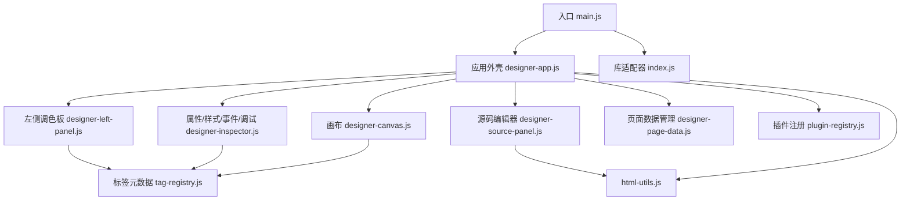
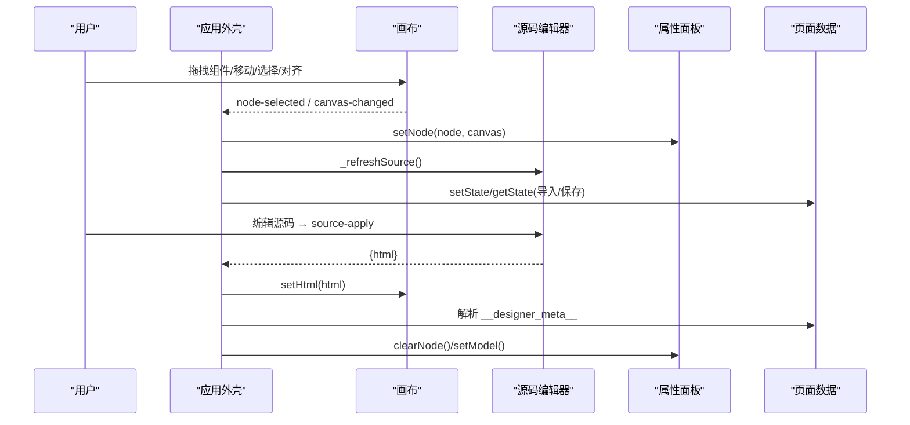
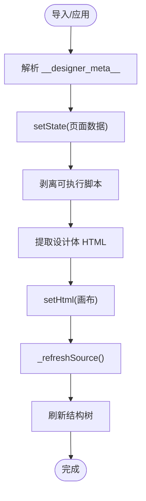
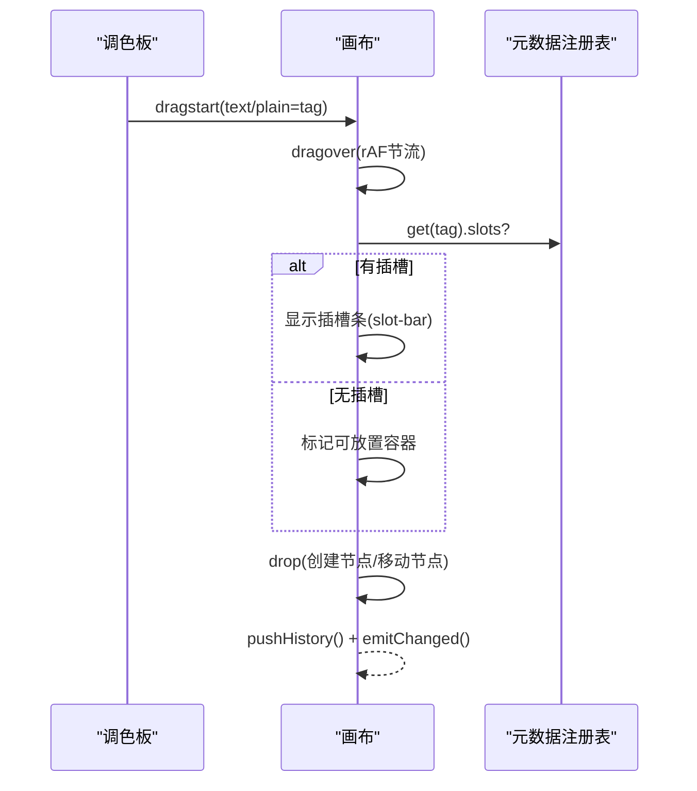
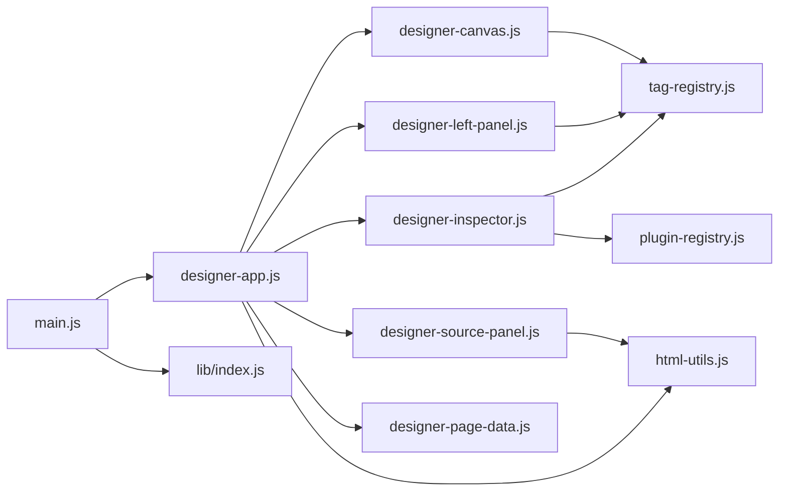

# 可视化设计器 (CMXHTMLDesigner)

<cite>
**本文引用的文件**
- [package.json](file://CMXHTMLDesigner/package.json)
- [main.js](file://CMXHTMLDesigner/src/main.js)
- [designer-app.js](file://CMXHTMLDesigner/src/components/designer-app.js)
- [designer-canvas.js](file://CMXHTMLDesigner/src/components/designer-canvas.js)
- [designer-left-panel.js](file://CMXHTMLDesigner/src/components/designer-left-panel.js)
- [designer-inspector.js](file://CMXHTMLDesigner/src/components/designer-inspector.js)
- [designer-source-panel.js](file://CMXHTMLDesigner/src/components/designer-source-panel.js)
- [designer-page-data.js](file://CMXHTMLDesigner/src/components/designer-page-data.js)
- [tag-registry.js](file://CMXHTMLDesigner/src/metadata/tag-registry.js)
- [groups.js](file://CMXHTMLDesigner/src/metadata/groups.js)
- [plugin-registry.js](file://CMXHTMLDesigner/src/lib/plugin-registry.js)
- [html-utils.js](file://CMXHTMLDesigner/src/utils/html-utils.js)
- [index.js](file://CMXHTMLDesigner/src/lib/index.js)
</cite>

## 更新摘要
**变更内容**
- 更新了组件特定文档的引用方式，从本地文件迁移到集中式Wiki系统
- 添加了Wiki系统导航和参考链接
- 保持了现有文档结构的完整性
- 更新了组件开发指南以反映新的文档组织方式

## 目录
1. [简介](#简介)
2. [项目结构](#项目结构)
3. [核心组件](#核心组件)
4. [架构总览](#架构总览)
5. [详细组件分析](#详细组件分析)
6. [依赖关系分析](#依赖关系分析)
7. [性能考量](#性能考量)
8. [故障排查指南](#故障排查指南)
9. [结论](#结论)
10. [附录](#附录)

## 简介
本文件为 CMX HTML 可视化设计器的开发文档，面向希望扩展、定制与集成该设计器的开发者。内容覆盖：
- 设计器整体架构与模块职责
- 拖拽编辑机制（调色板到画布、画布内移动、插槽定位）
- 实时预览与源码同步（画布↔源码↔属性面板↔页面数据）
- 组件注册机制、元数据管理与事件绑定系统
- 自定义组件开发指南、插件扩展方法与主题定制方案
- 与设计器相关的 API 接口、调试工具与性能优化技巧
- 实际开发案例与最佳实践

**重要更新**：组件特定的详细文档已迁移至集中式Wiki系统，提供更完善的组件使用指南和最佳实践。

## 项目结构
CMXHTMLDesigner 采用基于 Web Components 的模块化设计，核心由"应用外壳 + 画布 + 左侧调色板 + 右侧属性/样式/事件/调试面板 + 源码编辑器 + 页面数据管理"构成。构建与运行通过 Vite，UI 基于 SAP UI5 Web Components，代码编辑器使用 CodeMirror 6。

图表来源
- [main.js:1-29](file://CMXHTMLDesigner/src/main.js#L1-L29)
- [designer-app.js:1-636](file://CMXHTMLDesigner/src/components/designer-app.js#L1-L636)
- [designer-canvas.js:1-800](file://CMXHTMLDesigner/src/components/designer-canvas.js#L1-L800)
- [designer-left-panel.js:1-326](file://CMXHTMLDesigner/src/components/designer-left-panel.js#L1-L326)
- [designer-inspector.js:1-800](file://CMXHTMLDesigner/src/components/designer-inspector.js#L1-L800)
- [designer-source-panel.js:1-335](file://CMXHTMLDesigner/src/components/designer-source-panel.js#L1-L335)
- [designer-page-data.js:1-305](file://CMXHTMLDesigner/src/components/designer-page-data.js#L1-L305)
- [tag-registry.js:1-149](file://CMXHTMLDesigner/src/metadata/tag-registry.js#L1-L149)
- [html-utils.js:1-490](file://CMXHTMLDesigner/src/utils/html-utils.js#L1-L490)
- [plugin-registry.js:1-95](file://CMXHTMLDesigner/src/lib/plugin-registry.js#L1-L95)
- [index.js:1-8](file://CMXHTMLDesigner/src/lib/index.js#L1-L8)

章节来源
- [package.json:1-39](file://CMXHTMLDesigner/package.json#L1-L39)
- [main.js:1-29](file://CMXHTMLDesigner/src/main.js#L1-L29)

## 核心组件
- 应用外壳（designer-app.js）：协调各子组件通信、布局、导入导出、预览/运行、事件总线与刷新调度。
- 画布（designer-canvas.js）：承载设计区，实现拖放、选择、缩放、对齐、撤销重做、插槽指示、事件水合等。
- 左侧调色板（designer-left-panel.js）：按分组展示可拖拽的标签项，支持搜索与模型专用条目。
- 属性/样式/事件/调试（designer-inspector.js）：渲染选中节点的属性、样式、事件脚本与调试日志，支持插件自定义 Inspector。
- 源码编辑器（designer-source-panel.js）：基于 CodeMirror 6 的 HTML/JS 编辑，支持格式化、缩进、复制粘贴、源码→画布应用。
- 页面数据（designer-page-data.js）：管理页面级数据、函数、服务、依赖、接口、数据流与模型，提供脚本块生成与预览。
- 元数据注册表（tag-registry.js）：加载并维护标签元数据（属性、样式组、事件预设、默认值），支持插件动态注册。
- 插件注册（plugin-registry.js）：统一注册自定义组件与自定义 Inspector，派发 cmx:plugin-registered 事件。
- HTML 工具（html-utils.js）：序列化/反序列化设计区、提取模板、剥离脚本、生成完整 HTML 文档、主题变量注入等。

章节来源
- [designer-app.js:1-636](file://CMXHTMLDesigner/src/components/designer-app.js#L1-L636)
- [designer-canvas.js:1-800](file://CMXHTMLDesigner/src/components/designer-canvas.js#L1-L800)
- [designer-left-panel.js:1-326](file://CMXHTMLDesigner/src/components/designer-left-panel.js#L1-L326)
- [designer-inspector.js:1-800](file://CMXHTMLDesigner/src/components/designer-inspector.js#L1-L800)
- [designer-source-panel.js:1-335](file://CMXHTMLDesigner/src/components/designer-source-panel.js#L1-L335)
- [designer-page-data.js:1-305](file://CMXHTMLDesigner/src/components/designer-page-data.js#L1-L305)
- [tag-registry.js:1-149](file://CMXHTMLDesigner/src/metadata/tag-registry.js#L1-L149)
- [plugin-registry.js:1-95](file://CMXHTMLDesigner/src/lib/plugin-registry.js#L1-L95)
- [html-utils.js:1-490](file://CMXHTMLDesigner/src/utils/html-utils.js#L1-L490)

## 架构总览
设计器以"事件驱动 + 状态集中"的方式组织：
- 入口初始化认证、主题与应用壳，再异步加载 UI5 运行时与主应用。
- 应用外壳负责：
  - 布局与窗口尺寸调整
  - 导入/导出/预览/运行工作流
  - 画布、源码、属性面板、页面数据之间的双向同步
  - 刷新调度（合并同帧多次变更，降低卡顿）
- 画布是交互中心：接收调色板拖入、内部节点移动、选择、缩放、对齐、撤销重做、插槽定位。
- 属性面板根据选中节点或模型动态渲染，支持插件自定义 Inspector。
- 源码编辑器与画布解耦：应用层在需要时同步，避免频繁 DOM 操作。
- 页面数据作为"脚本与数据"的中央存储，导出/运行期生成完整脚本块。

图表来源
- [designer-app.js:262-495](file://CMXHTMLDesigner/src/components/designer-app.js#L262-L495)
- [designer-canvas.js:206-227](file://CMXHTMLDesigner/src/components/designer-canvas.js#L206-L227)
- [designer-source-panel.js:192-241](file://CMXHTMLDesigner/src/components/designer-source-panel.js#L192-L241)
- [designer-page-data.js:109-167](file://CMXHTMLDesigner/src/components/designer-page-data.js#L109-L167)

## 详细组件分析

### 应用外壳（designer-app.js）
职责：
- 初始化布局、对话框、控制台镜像、顶栏事件、页签切换。
- 处理导入/导出/多页运行/服务器导入/工作区节点选择。
- 管理画布与源码的同步策略：
  - 画布变化仅刷新结构树（避免整段 innerHTML）。
  - 属性/样式/事件变更触发源码刷新（节流合并）。
  - 源码应用时先解析 __designer_meta__，再剥离脚本写入画布。
- 提供导出/运行上下文（getPageId、getDesignBodyHtmlForExportAndRun、pageData）。

关键流程：
- 导入 HTML：解析 __designer_meta__ → 设置页面数据 → 剥离脚本 → 写入画布 → 刷新源码与结构树。
- 源码应用：可选保留 script/meta → 解析 meta → 提取设计体 → 剥离脚本 → 写入画布。
- 刷新调度：requestAnimationFrame 合并同帧多次 source/tree 刷新。

图表来源
- [designer-app.js:320-345](file://CMXHTMLDesigner/src/components/designer-app.js#L320-L345)
- [designer-app.js:463-495](file://CMXHTMLDesigner/src/components/designer-app.js#L463-L495)
- [designer-app.js:586-618](file://CMXHTMLDesigner/src/components/designer-app.js#L586-L618)

章节来源
- [designer-app.js:1-636](file://CMXHTMLDesigner/src/components/designer-app.js#L1-L636)

### 画布（designer-canvas.js）
能力：
- 拖放：从调色板拖入新节点；画布内移动节点；识别容器与插槽区域。
- 选择与高亮：点击选择、键盘删除、选择框拖动移动。
- 缩放与对齐：缩放比例控制、网格开关、水平/垂直对齐。
- 撤销/重做：历史记录栈限制步数。
- 事件水合：将 data-event* 属性转换为运行时事件处理器，支持调试模式注入 debugger。
- 序列化：输出干净 HTML（去除设计器内部属性）、带 ID 的 HTML（用于源码定位）。

拖放与插槽逻辑要点：
- dragover 经 rAF 节流，只处理最后一帧命中结果。
- 若目标容器声明 slots，显示插槽条（slot-bar），支持 slot 名称与默认内容。
- 移动节点时根据 slot 名称设置属性，必要时自动 margin-left:auto（如 header 槽）。

图表来源
- [designer-canvas.js:531-608](file://CMXHTMLDesigner/src/components/designer-canvas.js#L531-L608)
- [designer-canvas.js:474-529](file://CMXHTMLDesigner/src/components/designer-canvas.js#L474-L529)
- [designer-canvas.js:734-779](file://CMXHTMLDesigner/src/components/designer-canvas.js#L734-L779)

章节来源
- [designer-canvas.js:1-800](file://CMXHTMLDesigner/src/components/designer-canvas.js#L1-L800)

### 左侧调色板（designer-left-panel.js）
能力：
- 按分组渲染标签项，支持图标、计数、折叠/展开。
- 搜索过滤：按标签名与描述匹配。
- 拖拽：普通条目携带 text/plain=tag；模型专用条目携带 cmx-model-type（画布拒绝接受）。
- 监听 cmx:plugin-registered 事件，动态刷新分组与条目。

章节来源
- [designer-left-panel.js:1-326](file://CMXHTMLDesigner/src/components/designer-left-panel.js#L1-L326)

### 属性/样式/事件/调试（designer-inspector.js）
能力：
- 属性面板：渲染元数据属性、文本内容、自定义属性设置/删除、UI5 Slot 设置。
- 样式面板：分组样式编辑、原始 style 输入与应用。
- 事件面板：事件列表、自定义事件、CodeMirror 编辑器、插入 debugger、绑定/移除事件。
- 调试日志：时间戳、级别着色、字符上限清理。
- 插件钩子：支持为特定 tag 提供 customInspector 渲染函数。

事件绑定流程：
- 点击事件芯片打开编辑器，编辑后调用 canvas.attachHandler/detachHandler 更新节点 data-event* 属性。
- 属性/样式/事件变更派发 inspector-change，应用外壳据此刷新源码与结构树。

章节来源
- [designer-inspector.js:1-800](file://CMXHTMLDesigner/src/components/designer-inspector.js#L1-L800)

### 源码编辑器（designer-source-panel.js）
能力：
- CodeMirror 6 编辑器：HTML/JS 语法、主题、行包裹、自动补全（$data、event、console.log、fetch、页面函数/服务）。
- 工具栏：应用源码到画布、复制/粘贴、缩进/反缩进、格式化 HTML。
- 显示脚本开关：控制是否显示 <script>；保存/导入始终为完整内容。
- 光标定位：根据 data-node-id 高亮对应标签。

章节来源
- [designer-source-panel.js:1-335](file://CMXHTMLDesigner/src/components/designer-source-panel.js#L1-L335)

### 页面数据（designer-page-data.js）
能力：
- 管理页面数据、函数、服务、依赖、接口、数据流与模型。
- 视图切换：data/fn/svc/flow/test/deps/models。
- 状态持久化：getState/setState 序列化/恢复页面数据。
- 脚本块生成：导出/运行期生成完整 Web Component 封装脚本；源码区预览直接函数+注释。
- 从设计脚本解析函数声明（兼容老格式页面）。

章节来源
- [designer-page-data.js:1-305](file://CMXHTMLDesigner/src/components/designer-page-data.js#L1-L305)

### 元数据注册表（tag-registry.js）与分组（groups.js）
能力：
- 加载 common-attrs/style-groups/event-presets/tag-index，并注册所有标签元数据。
- 支持插件动态注册组与组件元数据。
- 为未知标签提供默认元数据（通用事件、默认文本、可嵌套等）。
- 组合样式组与事件预设，支持 extraEvents。

章节来源
- [tag-registry.js:1-149](file://CMXHTMLDesigner/src/metadata/tag-registry.js#L1-L149)
- [groups.js:1-32](file://CMXHTMLDesigner/src/metadata/groups.js#L1-L32)

### 插件注册（plugin-registry.js）
能力：
- definePlugin：注册自定义组、组件元数据、customInspectors。
- 重复注册（HMR）：按 tag 覆盖元数据与 Inspector，保证热更新生效。
- 派发 cmx:plugin-registered 事件，调色板自动刷新。

章节来源
- [plugin-registry.js:1-95](file://CMXHTMLDesigner/src/lib/plugin-registry.js#L1-L95)

### HTML 工具（html-utils.js）
能力：
- prettyFormatHtml：格式化 HTML。
- serializeDesignArea/serializeDesignAreaWithIds：输出干净 HTML（去除设计器内部属性），可选择保留 data-node-id。
- extractCmxPageDesignBodyFromScalerHtml：从误含整页模板的结构中提取真实设计体。
- stripDesignScriptsFromHtmlFragment：剥离可执行脚本与 __designer_meta__。
- wrapHtmlDocument：生成完整 HTML 文档（含 importmap、UI5 依赖、主题 CSS、事件水合脚本）。
- 辅助：escapeAttr/escapeHtml、getStyleValue、slug/tagName/class 生成、调试会话解析。

章节来源
- [html-utils.js:1-490](file://CMXHTMLDesigner/src/utils/html-utils.js#L1-L490)

## 依赖关系分析
- 入口 main.js 依赖认证、API 拦截、全局错误提示、UI5 运行时与主题。
- 应用外壳依赖各子组件与工具：拖拽调整、HTML 工具、TabManager、对话框绑定、控制台镜像。
- 画布依赖元数据注册表与 HTML 工具，以及用户代码调试工具。
- 属性面板依赖元数据注册表、插件注册、HTML 工具与 TabManager。
- 源码编辑器依赖 CodeMirror 加载器与主题扩展。
- 页面数据依赖多个子面板与工具：函数解析、脚本块构建、界面注册、模型状态。

图表来源
- [main.js:1-29](file://CMXHTMLDesigner/src/main.js#L1-L29)
- [designer-app.js:1-636](file://CMXHTMLDesigner/src/components/designer-app.js#L1-L636)
- [designer-canvas.js:1-800](file://CMXHTMLDesigner/src/components/designer-canvas.js#L1-L800)
- [designer-left-panel.js:1-326](file://CMXHTMLDesigner/src/components/designer-left-panel.js#L1-L326)
- [designer-inspector.js:1-800](file://CMXHTMLDesigner/src/components/designer-inspector.js#L1-L800)
- [designer-source-panel.js:1-335](file://CMXHTMLDesigner/src/components/designer-source-panel.js#L1-L335)
- [designer-page-data.js:1-305](file://CMXHTMLDesigner/src/components/designer-page-data.js#L1-L305)
- [tag-registry.js:1-149](file://CMXHTMLDesigner/src/metadata/tag-registry.js#L1-L149)
- [plugin-registry.js:1-95](file://CMXHTMLDesigner/src/lib/plugin-registry.js#L1-L95)
- [html-utils.js:1-490](file://CMXHTMLDesigner/src/utils/html-utils.js#L1-L490)
- [index.js:1-8](file://CMXHTMLDesigner/src/lib/index.js#L1-L8)

章节来源
- [designer-app.js:1-636](file://CMXHTMLDesigner/src/components/designer-app.js#L1-L636)
- [designer-canvas.js:1-800](file://CMXHTMLDesigner/src/components/designer-canvas.js#L1-L800)
- [designer-left-panel.js:1-326](file://CMXHTMLDesigner/src/components/designer-left-panel.js#L1-L326)
- [designer-inspector.js:1-800](file://CMXHTMLDesigner/src/components/designer-inspector.js#L1-L800)
- [designer-source-panel.js:1-335](file://CMXHTMLDesigner/src/components/designer-source-panel.js#L1-L335)
- [designer-page-data.js:1-305](file://CMXHTMLDesigner/src/components/designer-page-data.js#L1-L305)
- [tag-registry.js:1-149](file://CMXHTMLDesigner/src/metadata/tag-registry.js#L1-L149)
- [plugin-registry.js:1-95](file://CMXHTMLDesigner/src/lib/plugin-registry.js#L1-L95)
- [html-utils.js:1-490](file://CMXHTMLDesigner/src/utils/html-utils.js#L1-L490)
- [index.js:1-8](file://CMXHTMLDesigner/src/lib/index.js#L1-L8)

## 性能考量
- 刷新合并：应用外壳使用 requestAnimationFrame 合并同帧多次 source/tree 刷新，显著降低拖拽与连续编辑时的卡顿。
- 拖放节流：画布的 dragover 使用 rAF 节流，只处理最后一帧命中结果，避免频繁计算。
- 选择路径优化：画布通过 composedPath() 快速查找设计节点，避免强制布局与几何回退。
- 历史栈限制：撤销/重做历史最大步数限制，防止内存增长。
- 源码编辑器懒加载：CodeMirror 按需加载 HTML bundle，减少初始包体积。
- 主题与依赖：导出页面通过 importmap 与 CDN 加载 UI5 依赖，避免重复打包。

[本节为通用性能建议，不直接分析具体文件]

## 故障排查指南
常见问题与定位：
- 导入失败：检查 URL 中的 pageId 是否合法，查看后端返回的 html 与元数据；应用外壳会捕获并提示错误。
- 画布无响应：确认 mutationLocked 状态（页内运行期间锁定），检查是否有未释放的事件监听。
- 事件未生效：确认 data-event* 属性存在且代码合法；调试模式下会在首行注入 debugger；检查事件水合脚本是否正确生成。
- 源码应用无效：检查 __designer_meta__ 是否存在且可解析；确认剥离脚本逻辑正确；查看控制台日志。
- 插件未生效：确认 definePlugin 已调用且 id 唯一；检查 cmx:plugin-registered 事件是否派发；调色板是否刷新。

章节来源
- [designer-app.js:235-260](file://CMXHTMLDesigner/src/components/designer-app.js#L235-L260)
- [designer-canvas.js:183-198](file://CMXHTMLDesigner/src/components/designer-canvas.js#L183-L198)
- [html-utils.js:123-148](file://CMXHTMLDesigner/src/utils/html-utils.js#L123-L148)
- [plugin-registry.js:60-89](file://CMXHTMLDesigner/src/lib/plugin-registry.js#L60-L89)

## 结论
CMXHTMLDesigner 提供了完整的可视化设计体验：拖拽编辑、实时预览、源码同步、属性/样式/事件配置、页面数据管理与插件扩展。其架构清晰、职责分明，适合企业级门户页面的快速搭建与定制。通过插件机制与元数据管理，开发者可以灵活扩展组件与 Inspector，满足多样化业务需求。

**重要更新**：组件特定的详细文档现已迁移至集中式Wiki系统，提供更完善的组件使用指南和最佳实践参考。

## 附录

### Wiki系统导航
**新增** 组件特定文档已迁移至集中式Wiki系统，提供更好的文档组织和检索体验：

- **可视化设计器Wiki**：包含拖拽编辑系统、属性面板系统、插件扩展系统等专题文档
- **组件调色板系统**：详细的组件注册机制、元数据管理、属性系统说明
- **cmx-components-guide技能**：96个自定义元素的配置项、API方法、事件、slot、使用配方

访问路径：
- `.qoder/repowiki/zh/content/可视化设计器 (CMXHTMLDesigner)/` - 设计器专题Wiki
- `.agents/skills/cmx-components-guide/references/` - 组件使用手册

### 自定义组件开发指南
步骤：
1. 定义组件元数据：包含 tag、group、label、description、canNest、isVoid、attrs、styleGroups、eventPreset、extraEvents、defaults 等。
2. 通过 definePlugin 注册组件与可选的 customInspector。
3. 在调色板中可见并可拖拽到画布。
4. 在属性面板中渲染自定义 Inspector（可选）。
5. 发布后监听 cmx:plugin-registered 事件确保 UI 刷新。

**更新**：详细的组件开发指南请参考Wiki系统中的组件调色板系统和cmx-components-guide技能。

参考路径
- [plugin-registry.js:1-95](file://CMXHTMLDesigner/src/lib/plugin-registry.js#L1-L95)
- [tag-registry.js:1-149](file://CMXHTMLDesigner/src/metadata/tag-registry.js#L1-L149)

### 插件扩展方法
- 新增分组：registerGroup，指定 id、label、iconName、order、collapsed。
- 新增组件：components 数组，每个元素为组件元数据。
- 自定义 Inspector：customInspectors 映射，键为 tag，值为渲染函数。
- 热更新：重复注册会覆盖现有元数据与 Inspector，便于开发调试。

参考路径
- [plugin-registry.js:60-89](file://CMXHTMLDesigner/src/lib/plugin-registry.js#L60-L89)
- [designer-left-panel.js:230-241](file://CMXHTMLDesigner/src/components/designer-left-panel.js#L230-L241)

### 主题定制方案
- 入口应用主题：main.js 中读取 sessionStorage 中的主题并应用。
- 导出页面主题：html-utils.js 中通过 THEME_CSS_MAP 注入主题 CSS 变量。
- 运行时主题：UI5 通过 importmap 与 CDN 加载，支持多主题切换。

参考路径
- [main.js:16-23](file://CMXHTMLDesigner/src/main.js#L16-L23)
- [html-utils.js:237-316](file://CMXHTMLDesigner/src/utils/html-utils.js#L237-L316)

### API 接口与调试工具
- 公开方法：
  - DesignerCanvas：setHtml、clear、selectNodeById、getHtml、getExportHtml、getHtmlWithIds、setMutationLocked、setPageIdProvider、rehydrateEvents。
  - DesignerInspector：setNode、clearNode、log、setModel、setModelColumn。
  - DesignerSourcePanel：setContent、getContent、setMutationLocked、syncShowScriptSwitch、highlightNode。
  - DesignerPageData：setState、getState、getScriptBlock、getSourceScriptPreview、mergeFnsFromDesignScript、setDataSources、setDataFlow。
- 调试工具：
  - 调试日志面板：记录 log/warn/error，支持清空与级别镜像。
  - 调试模式：顶部工具栏切换，注入 debugger; 到事件首行。
  - 源码定位：根据 data-node-id 高亮源码中的标签。

参考路径
- [designer-canvas.js:172-198](file://CMXHTMLDesigner/src/components/designer-canvas.js#L172-L198)
- [designer-inspector.js:76-135](file://CMXHTMLDesigner/src/components/designer-inspector.js#L76-L135)
- [designer-source-panel.js:244-291](file://CMXHTMLDesigner/src/components/designer-source-panel.js#L244-L291)
- [designer-page-data.js:236-288](file://CMXHTMLDesigner/src/components/designer-page-data.js#L236-L288)

### 实际开发案例与最佳实践
- 案例：添加一个自定义表单组件
  - 定义元数据：tag="cmx-form-input"，attrs 包含 name、placeholder、type、disabled 等。
  - 注册插件：definePlugin({ id: 'form-components', components: [...] })。
  - 自定义 Inspector：为 cmx-form-input 提供属性面板，支持绑定数据变量。
  - 拖拽使用：从调色板拖入画布，设置属性与事件。
  - 导出运行：生成完整 HTML，事件水合生效。
- 最佳实践：
  - 使用元数据驱动属性面板，避免硬编码。
  - 通过插件机制扩展组件与 Inspector，保持核心代码稳定。
  - 利用刷新调度与拖放节流提升性能。
  - 在导出页面中使用 importmap 与 CDN 加载 UI5 依赖，减少包体积。
  - 使用调试模式与日志面板快速定位问题。
  - **新增**：充分利用Wiki系统中的组件使用指南和最佳实践文档。

[本节为概念性指导，不直接分析具体文件]