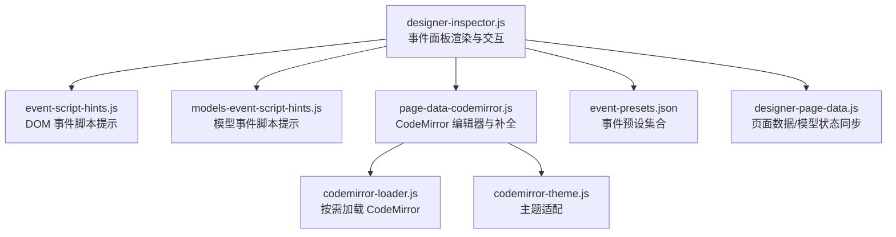
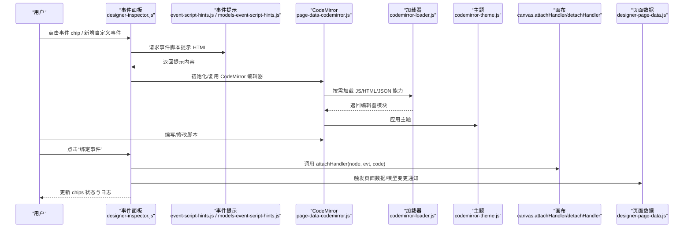
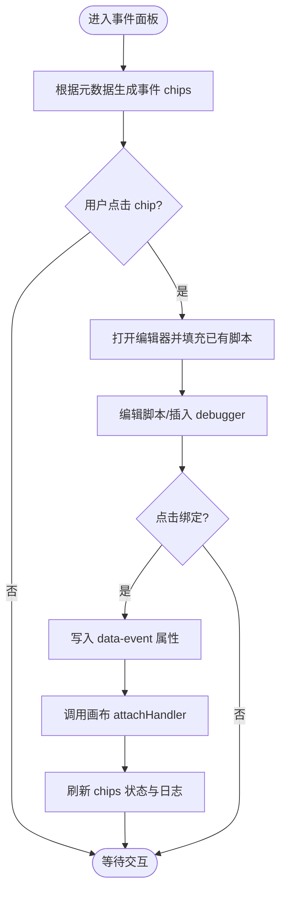
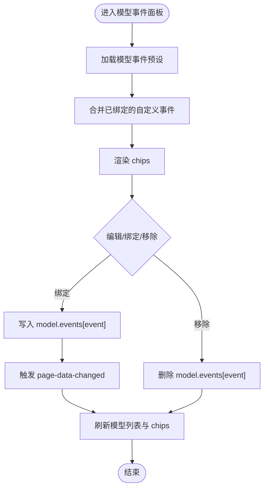
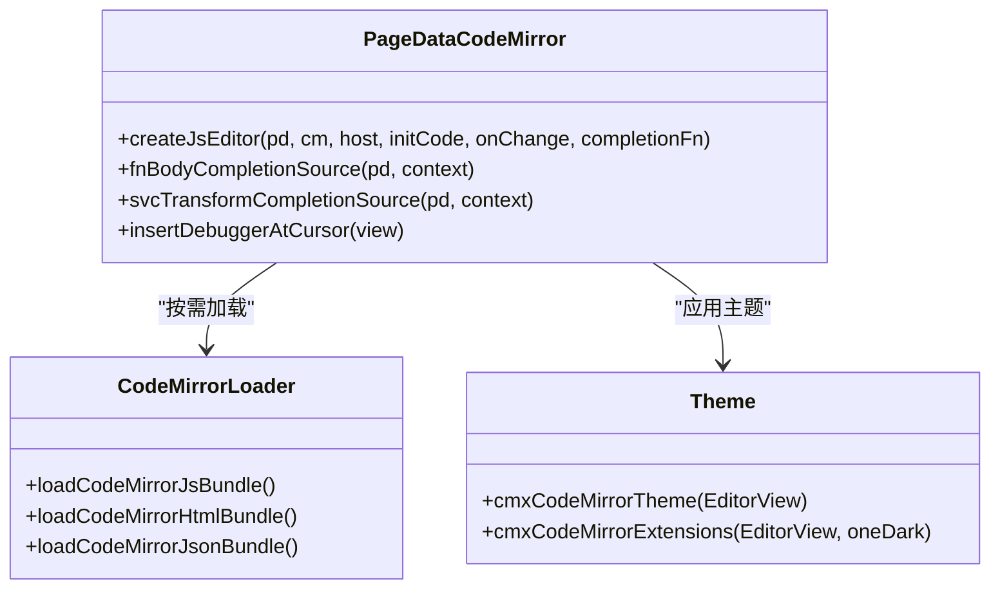
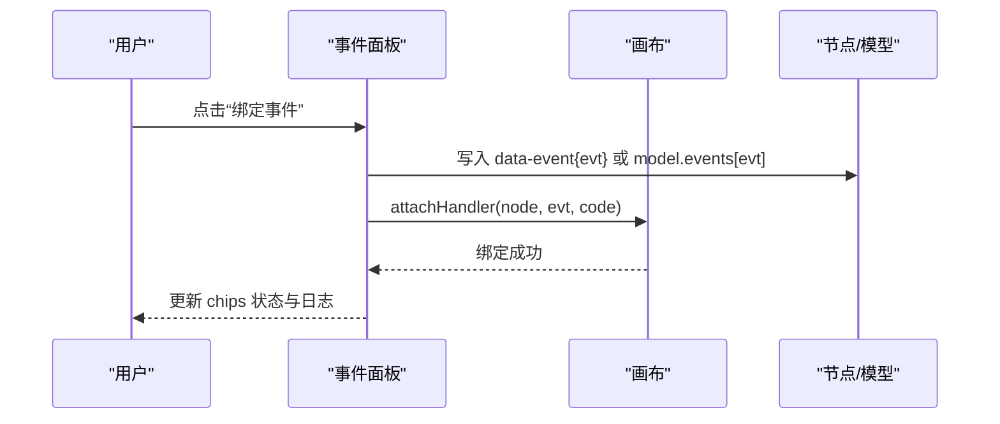
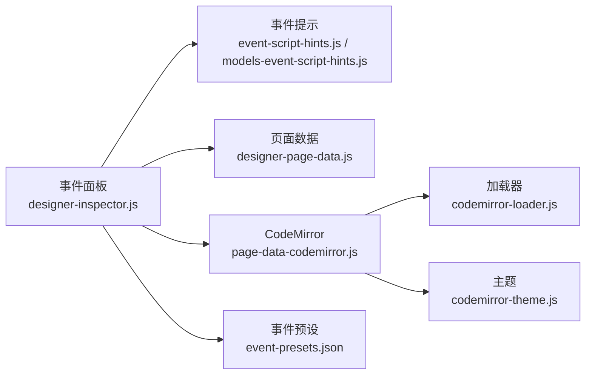

# 事件编辑面板

<cite>
**本文引用的文件**
- [designer-inspector.js](file://CMXHTMLDesigner/src/components/designer-inspector.js)
- [event-script-hints.js](file://CMXHTMLDesigner/src/components/designer-inspector/event-script-hints.js)
- [models-event-script-hints.js](file://CMXHTMLDesigner/src/components/designer-page-data/models-event-script-hints.js)
- [page-data-codemirror.js](file://CMXHTMLDesigner/src/components/designer-page-data/page-data-codemirror.js)
- [codemirror-loader.js](file://CMXHTMLDesigner/src/lib/codemirror-loader.js)
- [codemirror-theme.js](file://CMXHTMLDesigner/src/utils/codemirror-theme.js)
- [event-presets.json](file://CMXHTMLDesigner/src/metadata/event-presets.json)
- [designer-page-data.js](file://CMXHTMLDesigner/src/components/designer-page-data.js)
</cite>

## 目录
1. [简介](#简介)
2. [项目结构](#项目结构)
3. [核心组件](#核心组件)
4. [架构总览](#架构总览)
5. [详细组件分析](#详细组件分析)
6. [依赖关系分析](#依赖关系分析)
7. [性能考虑](#性能考虑)
8. [故障排查指南](#故障排查指南)
9. [结论](#结论)
10. [附录](#附录)

## 简介
本技术文档聚焦“事件编辑面板”，系统性说明事件脚本编辑器的实现机制与交互流程，包括：
- CodeMirror 集成、语法高亮与智能提示
- 事件芯片列表的动态生成与状态管理
- 自定义事件支持与绑定/删除流程
- 事件脚本的插入、调试（debugger）、验证与日志记录
- 事件处理器注册机制（画布侧）与错误处理
- 模型事件的事件清单、event.detail 形状与上下文变量
- 最佳实践与调试技巧

## 项目结构
事件编辑能力由设计器右侧属性面板（inspector）驱动，结合页面数据面板（page-data）提供的代码编辑器与补全能力，以及元数据中的事件预设。关键路径如下：
- 右侧事件面板渲染与交互：designer-inspector.js
- 事件脚本提示与模型事件提示：event-script-hints.js、models-event-script-hints.js
- CodeMirror 编辑器创建与补全：page-data-codemirror.js
- CodeMirror 按需加载与主题：codemirror-loader.js、codemirror-theme.js
- 事件预设来源：event-presets.json
- 页面数据与模型状态同步：designer-page-data.js

**图表来源**
- [designer-inspector.js:600-800](file://CMXHTMLDesigner/src/components/designer-inspector.js#L600-L800)
- [event-script-hints.js:1-101](file://CMXHTMLDesigner/src/components/designer-inspector/event-script-hints.js#L1-L101)
- [models-event-script-hints.js:1-92](file://CMXHTMLDesigner/src/components/designer-page-data/models-event-script-hints.js#L1-L92)
- [page-data-codemirror.js:74-199](file://CMXHTMLDesigner/src/components/designer-page-data/page-data-codemirror.js#L74-L199)
- [codemirror-loader.js:1-87](file://CMXHTMLDesigner/src/lib/codemirror-loader.js#L1-L87)
- [codemirror-theme.js:1-85](file://CMXHTMLDesigner/src/utils/codemirror-theme.js#L1-L85)
- [event-presets.json:1-72](file://CMXHTMLDesigner/src/metadata/event-presets.json#L1-L72)
- [designer-page-data.js:35-107](file://CMXHTMLDesigner/src/components/designer-page-data.js#L35-L107)

**章节来源**
- [designer-inspector.js:600-800](file://CMXHTMLDesigner/src/components/designer-inspector.js#L600-L800)
- [event-script-hints.js:1-101](file://CMXHTMLDesigner/src/components/designer-inspector/event-script-hints.js#L1-L101)
- [models-event-script-hints.js:1-92](file://CMXHTMLDesigner/src/components/designer-page-data/models-event-script-hints.js#L1-L92)
- [page-data-codemirror.js:74-199](file://CMXHTMLDesigner/src/components/designer-page-data/page-data-codemirror.js#L74-L199)
- [codemirror-loader.js:1-87](file://CMXHTMLDesigner/src/lib/codemirror-loader.js#L1-L87)
- [codemirror-theme.js:1-85](file://CMXHTMLDesigner/src/utils/codemirror-theme.js#L1-L85)
- [event-presets.json:1-72](file://CMXHTMLDesigner/src/metadata/event-presets.json#L1-L72)
- [designer-page-data.js:35-107](file://CMXHTMLDesigner/src/components/designer-page-data.js#L35-L107)

## 核心组件
- 事件面板（designer-inspector.js）
  - 负责渲染 DOM 元素事件与模型事件两个场景的 chips 列表、编辑器与操作按钮
  - 维护当前选中事件名、已知事件集、CodeMirror 视图实例的生命周期
  - 提供绑定/移除事件、插入 debugger、写入调试日志等能力
- 事件脚本提示（event-script-hints.js、models-event-script-hints.js）
  - 为 DOM 事件与模型事件分别提供 event 对象成员说明、event.detail 字段说明与上下文变量说明
  - 支持自定义事件名的提示回退
- CodeMirror 编辑器（page-data-codemirror.js + codemirror-loader.js + codemirror-theme.js）
  - 按需加载 JS/HTML/JSON 编辑器能力
  - 提供函数体补全（$data、workspace、mainapp、页面函数/服务）与服务响应补全
  - 统一主题适配 UI5 明暗主题
- 事件预设（event-presets.json）
  - 定义不同标签类别的推荐事件集合，用于 chips 列表展示
- 页面数据与模型（designer-page-data.js）
  - 维护页面数据、函数、服务、模型等状态，并在事件绑定后触发刷新与变更通知

**章节来源**
- [designer-inspector.js:600-800](file://CMXHTMLDesigner/src/components/designer-inspector.js#L600-L800)
- [event-script-hints.js:1-101](file://CMXHTMLDesigner/src/components/designer-inspector/event-script-hints.js#L1-L101)
- [models-event-script-hints.js:1-92](file://CMXHTMLDesigner/src/components/designer-page-data/models-event-script-hints.js#L1-L92)
- [page-data-codemirror.js:74-199](file://CMXHTMLDesigner/src/components/designer-page-data/page-data-codemirror.js#L74-L199)
- [codemirror-loader.js:1-87](file://CMXHTMLDesigner/src/lib/codemirror-loader.js#L1-L87)
- [codemirror-theme.js:1-85](file://CMXHTMLDesigner/src/utils/codemirror-theme.js#L1-L85)
- [event-presets.json:1-72](file://CMXHTMLDesigner/src/metadata/event-presets.json#L1-L72)
- [designer-page-data.js:35-107](file://CMXHTMLDesigner/src/components/designer-page-data.js#L35-L107)

## 架构总览
事件编辑面板采用“面板驱动 + 编辑器复用 + 元数据驱动”的架构：
- 面板层：根据当前选中节点或模型类型，动态生成事件 chips 与编辑器容器
- 编辑器层：通过 CodeMirror 按需加载 JS/HTML/JSON 能力，注入主题与补全
- 元数据层：从 tag 元数据或模型事件预设中获取事件清单，并生成提示文案
- 运行时层：绑定事件时调用画布的 attachHandler/detachHandler，将脚本以字符串形式持久化到节点属性或模型配置

**图表来源**
- [designer-inspector.js:600-800](file://CMXHTMLDesigner/src/components/designer-inspector.js#L600-L800)
- [event-script-hints.js:72-101](file://CMXHTMLDesigner/src/components/designer-inspector/event-script-hints.js#L72-L101)
- [models-event-script-hints.js:58-92](file://CMXHTMLDesigner/src/components/designer-page-data/models-event-script-hints.js#L58-L92)
- [page-data-codemirror.js:74-199](file://CMXHTMLDesigner/src/components/designer-page-data/page-data-codemirror.js#L74-L199)
- [codemirror-loader.js:1-87](file://CMXHTMLDesigner/src/lib/codemirror-loader.js#L1-L87)
- [codemirror-theme.js:1-85](file://CMXHTMLDesigner/src/utils/codemirror-theme.js#L1-L85)
- [designer-page-data.js:291-297](file://CMXHTMLDesigner/src/components/designer-page-data.js#L291-L297)

## 详细组件分析

### 事件面板（DOM 元素事件）
- 事件芯片列表
  - 基于当前节点的元数据 events 数组生成 chips，已绑定的事件显示勾选标记
  - 支持“自定义事件”按钮，输入事件名后打开编辑器
- 编辑器与提示
  - 使用 CodeMirror 编辑器承载函数体；上方提示区显示形参、上下文变量与本事件的 event 常用成员
  - 支持在光标处插入 debugger 语句，便于断点调试
- 绑定与移除
  - 绑定：将脚本字符串写入节点 data-event{eventName} 属性，并调用画布 attachHandler 完成运行时绑定
  - 移除：调用画布 detachHandler，并清除对应属性
- 日志
  - 所有绑定/移除操作均记录到调试日志区域，便于回溯

**图表来源**
- [designer-inspector.js:600-705](file://CMXHTMLDesigner/src/components/designer-inspector.js#L600-L705)

**章节来源**
- [designer-inspector.js:600-705](file://CMXHTMLDesigner/src/components/designer-inspector.js#L600-L705)

### 事件面板（模型事件）
- 事件芯片列表
  - 基于 MODEL_EVENT_PRESETS 与 model.events 中已绑定的自定义事件合并生成 chips
  - 已绑定事件显示勾选标记
- 编辑器与提示
  - 编辑器同样使用 CodeMirror；提示区显示形参（event、host）、上下文变量与 event.detail 字段说明
  - 对未知事件名提供“自定义事件”提示
- 绑定与移除
  - 绑定：将脚本写入 model.events[eventName]，触发页面数据变更通知并刷新模型列表
  - 移除：删除 model.events[eventName]，并刷新界面
- 日志
  - 绑定/移除操作记录到调试日志

**图表来源**
- [designer-inspector.js:707-800](file://CMXHTMLDesigner/src/components/designer-inspector.js#L707-L800)
- [models-event-script-hints.js:11-54](file://CMXHTMLDesigner/src/components/designer-page-data/models-event-script-hints.js#L11-L54)

**章节来源**
- [designer-inspector.js:707-800](file://CMXHTMLDesigner/src/components/designer-inspector.js#L707-L800)
- [models-event-script-hints.js:11-54](file://CMXHTMLDesigner/src/components/designer-page-data/models-event-script-hints.js#L11-L54)

### CodeMirror 集成、语法高亮与智能提示
- 按需加载
  - 通过 loadCodeMirrorJsBundle/loadCodeMirrorHtmlBundle/loadCodeMirrorJsonBundle 按需引入编辑器能力，避免首包体积过大
- 编辑器创建
  - createJsEditor 创建 JS 编辑器，注入 basicSetup、javascript 语言、自动补全、主题与更新监听
- 智能提示
  - fnBodyCompletionSource：在函数体中提供 $data 属性、workspace.context、mainapp、workspace、全局对象、event、console.log、alert、setTimeout、fetch 以及页面函数/服务的补全
  - svcTransformCompletionSource：在服务响应转换中提供 data、return data、$data、JSON.parse、console.log 等补全
- 主题
  - cmxCodeMirrorExtensions 根据 UI5 主题自动切换明暗主题，保证编辑器视觉一致

**图表来源**
- [page-data-codemirror.js:74-199](file://CMXHTMLDesigner/src/components/designer-page-data/page-data-codemirror.js#L74-L199)
- [codemirror-loader.js:1-87](file://CMXHTMLDesigner/src/lib/codemirror-loader.js#L1-L87)
- [codemirror-theme.js:1-85](file://CMXHTMLDesigner/src/utils/codemirror-theme.js#L1-L85)

**章节来源**
- [page-data-codemirror.js:74-199](file://CMXHTMLDesigner/src/components/designer-page-data/page-data-codemirror.js#L74-L199)
- [codemirror-loader.js:1-87](file://CMXHTMLDesigner/src/lib/codemirror-loader.js#L1-L87)
- [codemirror-theme.js:1-85](file://CMXHTMLDesigner/src/utils/codemirror-theme.js#L1-L85)

### 事件处理器注册机制与错误处理
- 注册机制
  - 绑定 DOM 事件时，调用画布的 attachHandler(node, evt, code)，将脚本作为字符串持久化到节点 data-event{evt} 属性
  - 移除时调用 detachHandler(node, evt)，并清理属性
- 错误处理
  - 面板内对插件钩子执行进行 try/catch 保护，避免异常影响主流程
  - 调试日志记录关键操作，便于定位问题
- 日志记录
  - 所有绑定/移除操作、属性设置、样式应用等均输出到调试日志区域，支持清空日志

**章节来源**
- [designer-inspector.js:270-340](file://CMXHTMLDesigner/src/components/designer-inspector.js#L270-L340)
- [designer-inspector.js:673-693](file://CMXHTMLDesigner/src/components/designer-inspector.js#L673-L693)
- [designer-inspector.js:782-800](file://CMXHTMLDesigner/src/components/designer-inspector.js#L782-L800)

### 事件脚本的插入、删除、调试与验证
- 插入
  - 支持在光标位置插入 debugger; 语句，快速进入断点调试
- 删除
  - 移除事件：调用画布 detachHandler 并清除 data-event 属性或 model.events 条目
- 调试
  - 通过插入 debugger 进入浏览器调试器；面板内置调试日志可辅助定位
- 验证
  - 面板侧不执行脚本，仅做基础校验（如事件名非空）；实际运行期由画布执行脚本

**章节来源**
- [designer-inspector.js:695-704](file://CMXHTMLDesigner/src/components/designer-inspector.js#L695-L704)
- [designer-inspector.js:684-693](file://CMXHTMLDesigner/src/components/designer-inspector.js#L684-L693)
- [designer-inspector.js:795-800](file://CMXHTMLDesigner/src/components/designer-inspector.js#L795-L800)

### 事件处理器注册机制（序列图）

**图表来源**
- [designer-inspector.js:673-682](file://CMXHTMLDesigner/src/components/designer-inspector.js#L673-L682)
- [designer-inspector.js:782-793](file://CMXHTMLDesigner/src/components/designer-inspector.js#L782-L793)

## 依赖关系分析
- 事件面板依赖：
  - 元数据事件预设（event-presets.json）
  - 事件脚本提示（event-script-hints.js、models-event-script-hints.js）
  - CodeMirror 编辑器（page-data-codemirror.js）
  - 页面数据与模型状态（designer-page-data.js）
- 编辑器依赖：
  - 按需加载器（codemirror-loader.js）
  - 主题（codemirror-theme.js）

**图表来源**
- [designer-inspector.js:600-800](file://CMXHTMLDesigner/src/components/designer-inspector.js#L600-L800)
- [page-data-codemirror.js:74-199](file://CMXHTMLDesigner/src/components/designer-page-data/page-data-codemirror.js#L74-L199)
- [codemirror-loader.js:1-87](file://CMXHTMLDesigner/src/lib/codemirror-loader.js#L1-L87)
- [codemirror-theme.js:1-85](file://CMXHTMLDesigner/src/utils/codemirror-theme.js#L1-L85)
- [event-presets.json:1-72](file://CMXHTMLDesigner/src/metadata/event-presets.json#L1-L72)

**章节来源**
- [designer-inspector.js:600-800](file://CMXHTMLDesigner/src/components/designer-inspector.js#L600-L800)
- [page-data-codemirror.js:74-199](file://CMXHTMLDesigner/src/components/designer-page-data/page-data-codemirror.js#L74-L199)
- [codemirror-loader.js:1-87](file://CMXHTMLDesigner/src/lib/codemirror-loader.js#L1-L87)
- [codemirror-theme.js:1-85](file://CMXHTMLDesigner/src/utils/codemirror-theme.js#L1-L85)
- [event-presets.json:1-72](file://CMXHTMLDesigner/src/metadata/event-presets.json#L1-L72)

## 性能考虑
- 按需加载 CodeMirror：仅在需要时加载 JS/HTML/JSON 编辑器能力，减少首包体积与初始加载时间
- 编辑器复用与销毁：在面板切换或节点变化时正确销毁旧编辑器并解绑 resize 监听，避免内存泄漏
- 主题自适应：根据 UI5 主题动态选择明暗主题，减少额外样式计算
- 日志长度限制：调试日志按字符上限裁剪，防止 DOM 节点过多导致渲染卡顿

[本节为通用性能建议，无需特定文件引用]

## 故障排查指南
- 事件未生效
  - 检查是否已调用 attachHandler 并写入 data-event 属性或 model.events
  - 查看调试日志确认绑定/移除操作是否成功
- 脚本无法执行
  - 确认事件名非空且脚本语法正确
  - 使用插入 debugger 功能进入断点，逐步排查
- 编辑器无提示
  - 确认已正确加载 CodeMirror 模块与主题
  - 检查补全函数是否被注入（fnBodyCompletionSource/svcTransformCompletionSource）
- 模型事件无效
  - 确认模型类型是否在 MODEL_EVENT_PRESETS 中
  - 自定义事件的 event.detail 形状需由派发方决定，注意运行时兼容性

**章节来源**
- [designer-inspector.js:120-135](file://CMXHTMLDesigner/src/components/designer-inspector.js#L120-L135)
- [designer-inspector.js:673-693](file://CMXHTMLDesigner/src/components/designer-inspector.js#L673-L693)
- [designer-inspector.js:782-800](file://CMXHTMLDesigner/src/components/designer-inspector.js#L782-L800)
- [page-data-codemirror.js:97-199](file://CMXHTMLDesigner/src/components/designer-page-data/page-data-codemirror.js#L97-L199)

## 结论
事件编辑面板通过“面板驱动 + 编辑器复用 + 元数据驱动”的方式，提供了直观的事件绑定与脚本编辑体验。借助 CodeMirror 的按需加载与智能提示，开发者可以高效编写与调试事件脚本；通过画布的处理器注册机制，事件在运行时得以可靠执行。配合完善的日志与错误处理，整体具备较高的可用性与可维护性。

[本节为总结性内容，无需特定文件引用]

## 附录
- 最佳实践
  - 优先使用元数据推荐事件，必要时再添加自定义事件
  - 在脚本中使用 $data、workspace、mainapp 等上下文变量时，遵循补全提示
  - 使用 debugger 进行断点调试，结合调试日志定位问题
  - 保持事件脚本简洁，复杂逻辑应抽取为页面函数或服务
- 调试技巧
  - 在事件脚本开头插入 debugger; 快速进入断点
  - 利用面板日志记录关键步骤，缩小问题范围
  - 对于模型事件，关注 event.detail 的具体字段，确保取值安全

[本节为通用指导，无需特定文件引用]