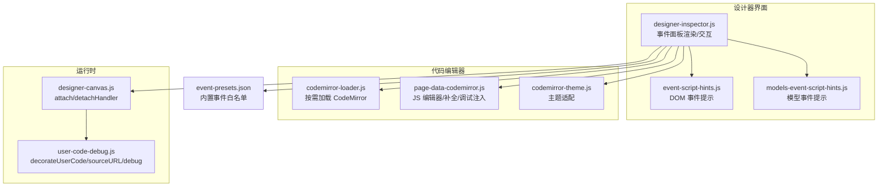
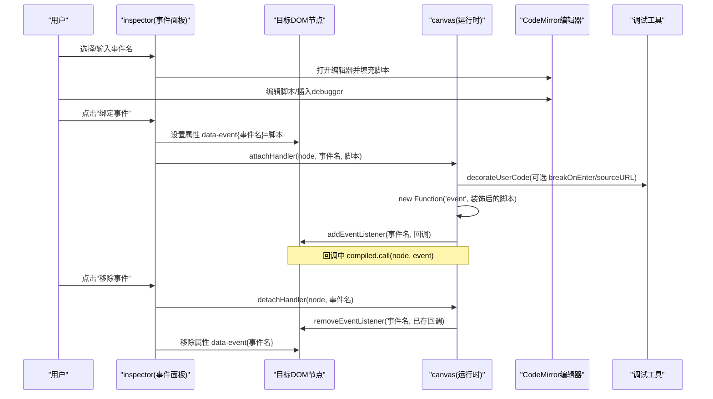
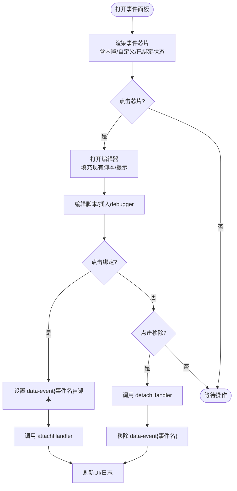
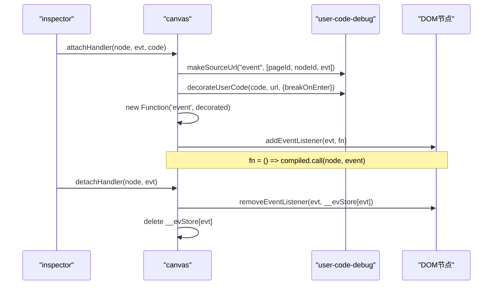
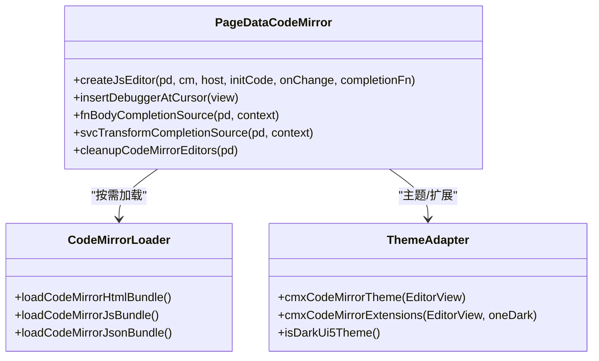
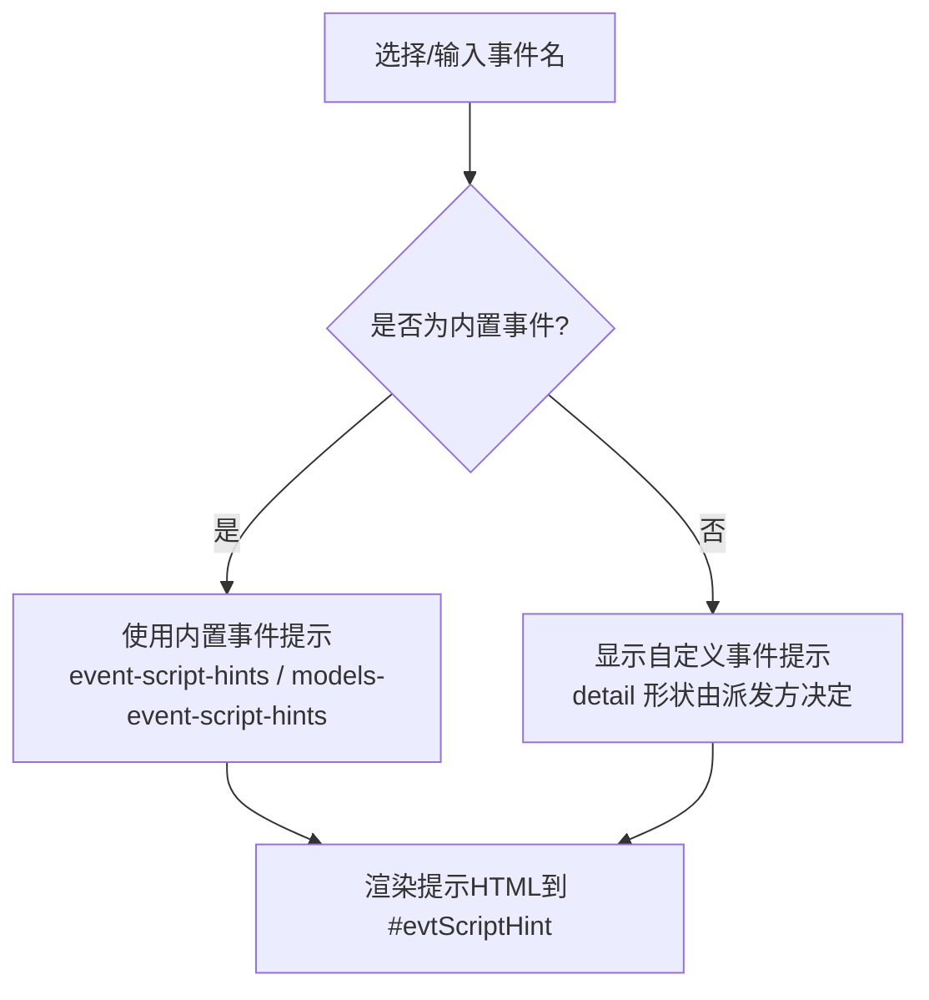
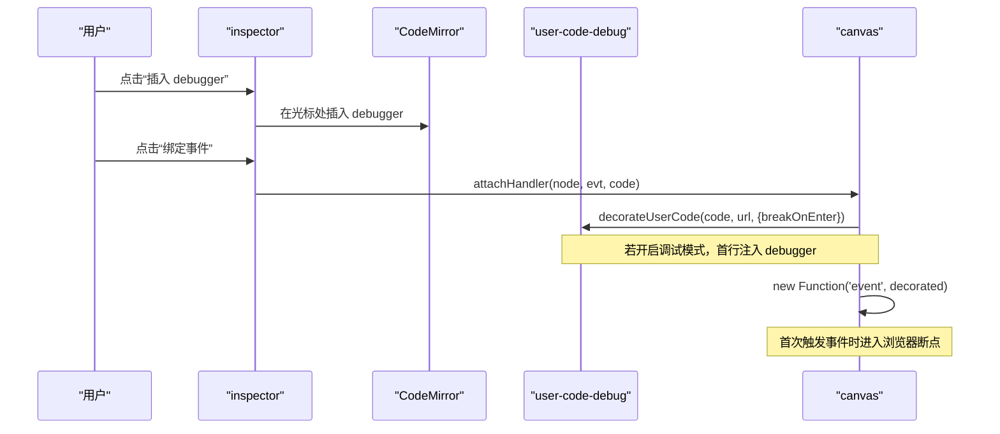
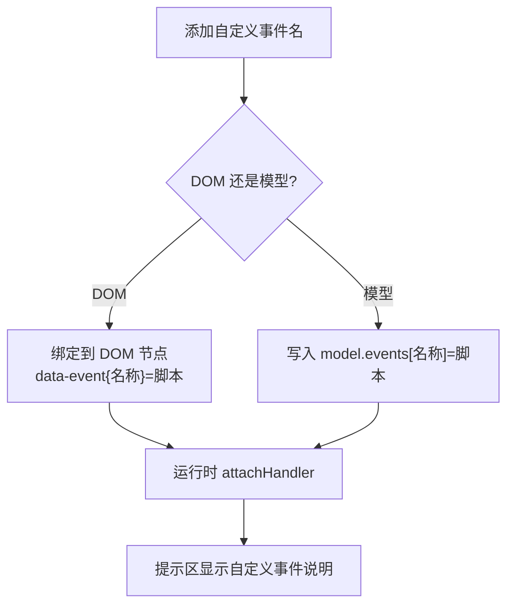
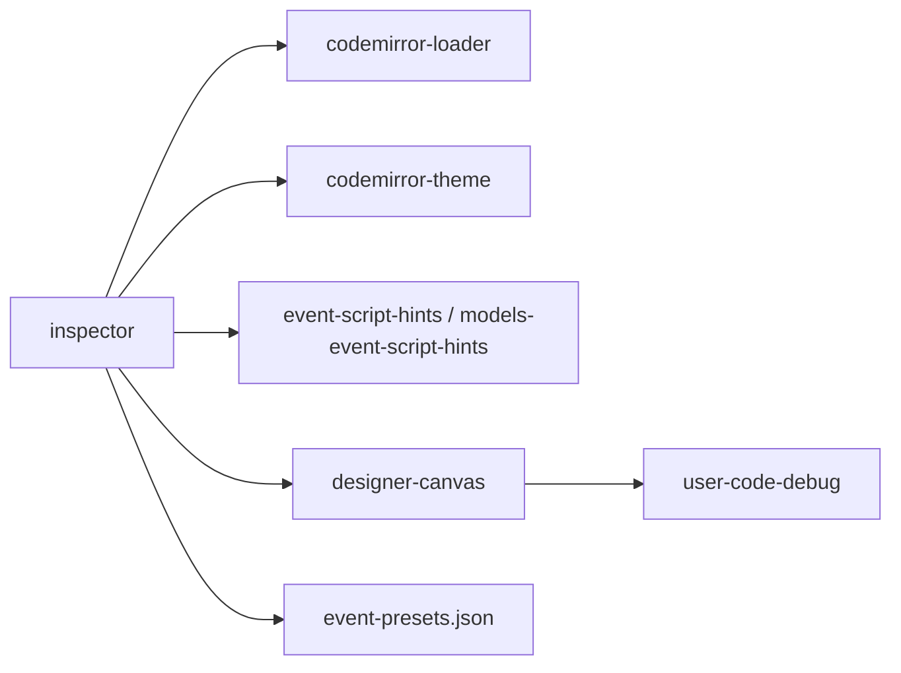

# 事件编辑器

<cite>
**本文引用的文件**
- [designer-inspector.js](file://CMXHTMLDesigner/src/components/designer-inspector.js)
- [designer-canvas.js](file://CMXHTMLDesigner/src/components/designer-canvas.js)
- [event-script-hints.js](file://CMXHTMLDesigner/src/components/designer-inspector/event-script-hints.js)
- [models-event-script-hints.js](file://CMXHTMLDesigner/src/components/designer-page-data/models-event-script-hints.js)
- [page-data-codemirror.js](file://CMXHTMLDesigner/src/components/designer-page-data/page-data-codemirror.js)
- [codemirror-loader.js](file://CMXHTMLDesigner/src/lib/codemirror-loader.js)
- [codemirror-theme.js](file://CMXHTMLDesigner/src/utils/codemirror-theme.js)
- [user-code-debug.js](file://CMXHTMLDesigner/src/utils/user-code-debug.js)
- [event-presets.json](file://CMXHTMLDesigner/src/metadata/event-presets.json)
</cite>

## 目录
1. [简介](#简介)
2. [项目结构](#项目结构)
3. [核心组件](#核心组件)
4. [架构总览](#架构总览)
5. [详细组件分析](#详细组件分析)
6. [依赖关系分析](#依赖关系分析)
7. [性能考虑](#性能考虑)
8. [故障排查指南](#故障排查指南)
9. [结论](#结论)
10. [附录](#附录)

## 简介
本技术文档围绕“事件编辑器”展开，系统性说明事件脚本的编辑与管理机制，包括：
- CodeMirror 集成与语法高亮、自动补全、主题适配
- 事件绑定/解绑流程（data-event* 属性设置与移除）
- 事件提示系统（内置事件提示与自定义事件提示）
- 调试能力（debugger 语句插入、sourceURL 断点持久化、进入即暂停）
- 最佳实践（错误处理、性能优化）
- 扩展机制（自定义事件类型定义方法）

## 项目结构
事件编辑器由“设计器侧面板（inspector）+ 画布运行时（canvas）+ 代码编辑器（CodeMirror）+ 调试工具（user-code-debug）+ 元数据（event-presets）”共同组成。下图展示关键模块与职责：

图表来源
- [designer-inspector.js:600-717](file://CMXHTMLDesigner/src/components/designer-inspector.js#L600-L717)
- [designer-canvas.js:919-949](file://CMXHTMLDesigner/src/components/designer-canvas.js#L919-L949)
- [codemirror-loader.js:1-87](file://CMXHTMLDesigner/src/lib/codemirror-loader.js#L1-L87)
- [page-data-codemirror.js:63-95](file://CMXHTMLDesigner/src/components/designer-page-data/page-data-codemirror.js#L63-L95)
- [codemirror-theme.js:1-85](file://CMXHTMLDesigner/src/utils/codemirror-theme.js#L1-L85)
- [user-code-debug.js:1-60](file://CMXHTMLDesigner/src/utils/user-code-debug.js#L1-L60)
- [event-presets.json:1-72](file://CMXHTMLDesigner/src/metadata/event-presets.json#L1-L72)

章节来源
- [designer-inspector.js:600-717](file://CMXHTMLDesigner/src/components/designer-inspector.js#L600-L717)
- [designer-canvas.js:919-949](file://CMXHTMLDesigner/src/components/designer-canvas.js#L919-L949)
- [codemirror-loader.js:1-87](file://CMXHTMLDesigner/src/lib/codemirror-loader.js#L1-L87)
- [page-data-codemirror.js:63-95](file://CMXHTMLDesigner/src/components/designer-page-data/page-data-codemirror.js#L63-L95)
- [codemirror-theme.js:1-85](file://CMXHTMLDesigner/src/utils/codemirror-theme.js#L1-L85)
- [user-code-debug.js:1-60](file://CMXHTMLDesigner/src/utils/user-code-debug.js#L1-L60)
- [event-presets.json:1-72](file://CMXHTMLDesigner/src/metadata/event-presets.json#L1-L72)

## 核心组件
- 事件面板（inspector）：负责渲染事件芯片、打开编辑器、绑定/移除事件、显示提示、插入 debugger。
- 画布运行时（canvas）：负责将用户脚本编译为函数并 attach/detach DOM 事件监听器，维护 __evStore 避免重复绑定。
- 代码编辑器（CodeMirror）：按需加载 JS/HTML/JSON 包，提供语法高亮、自动补全、主题适配；支持在光标处插入 debugger。
- 调试工具（user-code-debug）：生成稳定 sourceURL，支持进入即暂停（breakOnEnter），读取/写入调试模式开关。
- 事件提示（hints）：为 DOM 事件和模型事件分别提供形参、event.detail、上下文变量说明。
- 事件预设（presets）：按标签类别提供推荐事件列表，用于 UI 快速选择。

章节来源
- [designer-inspector.js:600-717](file://CMXHTMLDesigner/src/components/designer-inspector.js#L600-L717)
- [designer-canvas.js:919-949](file://CMXHTMLDesigner/src/components/designer-canvas.js#L919-L949)
- [page-data-codemirror.js:63-95](file://CMXHTMLDesigner/src/components/designer-page-data/page-data-codemirror.js#L63-L95)
- [user-code-debug.js:1-60](file://CMXHTMLDesigner/src/utils/user-code-debug.js#L1-L60)
- [event-script-hints.js:1-101](file://CMXHTMLDesigner/src/components/designer-inspector/event-script-hints.js#L1-L101)
- [models-event-script-hints.js:1-92](file://CMXHTMLDesigner/src/components/designer-page-data/models-event-script-hints.js#L1-L92)
- [event-presets.json:1-72](file://CMXHTMLDesigner/src/metadata/event-presets.json#L1-L72)

## 架构总览
事件编辑器的整体工作流如下：用户在 inspector 中选择或自定义事件名，编写脚本后点击“绑定事件”，inspector 将事件名与脚本写入节点 data-event* 属性，并调用 canvas.attachHandler 完成运行时绑定；点击“移除事件”则删除属性并 detachHandler。编辑器通过 CodeMirror 提供高亮与补全，调试按钮可插入 debugger，运行期根据调试模式决定是否在进入时暂停。

图表来源
- [designer-inspector.js:673-693](file://CMXHTMLDesigner/src/components/designer-inspector.js#L673-L693)
- [designer-canvas.js:919-949](file://CMXHTMLDesigner/src/components/designer-canvas.js#L919-L949)
- [user-code-debug.js:18-37](file://CMXHTMLDesigner/src/utils/user-code-debug.js#L18-L37)

## 详细组件分析

### 事件面板与交互（designer-inspector.js）
- 事件芯片渲染：从 meta.events 或模型预设事件生成 chips，标记是否已绑定。
- 打开编辑器：_openEvtEditor/_openModelEvtEditor 动态创建/复用 CodeMirror 视图，更新标题与提示。
- 绑定/移除：
  - 绑定：写入 node.setAttribute(`data-event${evt}`, code)，调用 canvas.attachHandler，刷新 UI。
  - 移除：调用 canvas.detachHandler，移除对应 data-event* 属性，刷新 UI。
- 调试注入：提供“插入 debugger”按钮，直接在当前光标位置插入 debugger; 并聚焦编辑器。
- 模型事件：对模型类型（如 DataSet/MasterSlave）提供预设事件与 detail 字段提示，支持自定义事件名。

图表来源
- [designer-inspector.js:600-717](file://CMXHTMLDesigner/src/components/designer-inspector.js#L600-L717)
- [designer-inspector.js:682-817](file://CMXHTMLDesigner/src/components/designer-inspector.js#L682-L817)

章节来源
- [designer-inspector.js:600-717](file://CMXHTMLDesigner/src/components/designer-inspector.js#L600-L717)
- [designer-inspector.js:682-817](file://CMXHTMLDesigner/src/components/designer-inspector.js#L682-L817)

### 运行时事件绑定/解绑（designer-canvas.js）
- 绑定流程：
  - 生成稳定 sourceURL（基于页面ID、节点ID、事件名）。
  - 使用 decorateUserCode 包装脚本（可选首行 debugger 与 sourceURL）。
  - 通过 new Function('event', decorated) 编译回调。
  - 将回调存入 node.__evStore[evt] 并 addEventListener。
  - 执行时以 node 为 this，捕获异常并输出错误信息。
- 解绑流程：
  - 从 node.__evStore 取回回调并 removeEventListener。
  - 清理 __evStore[evt]。

图表来源
- [designer-canvas.js:919-949](file://CMXHTMLDesigner/src/components/designer-canvas.js#L919-L949)
- [user-code-debug.js:18-37](file://CMXHTMLDesigner/src/utils/user-code-debug.js#L18-L37)

章节来源
- [designer-canvas.js:919-949](file://CMXHTMLDesigner/src/components/designer-canvas.js#L919-L949)

### CodeMirror 集成与语法高亮
- 按需加载：通过 codemirror-loader.js 动态 import 编辑器核心、语言包、命令、主题，避免首包体积过大。
- JS 编辑器：page-data-codemirror.js 提供 createJsEditor，启用 basicSetup、javascript 语言、自动补全、主题扩展与变更回调。
- 自动补全：
  - 页面函数/服务、$data、workspace/mainapp 上下文、全局对象等智能建议。
  - 针对 $data.xxx、workspace.context.*、mainapp.* 等路径进行精准补全。
- 调试注入：insertDebuggerAtCursor 在光标处插入 debugger; 并聚焦。
- 主题适配：根据 UI5 主题自动切换深色/浅色样式，保持与设计器一致。

图表来源
- [codemirror-loader.js:1-87](file://CMXHTMLDesigner/src/lib/codemirror-loader.js#L1-L87)
- [page-data-codemirror.js:40-95](file://CMXHTMLDesigner/src/components/designer-page-data/page-data-codemirror.js#L40-L95)
- [page-data-codemirror.js:97-199](file://CMXHTMLDesigner/src/components/designer-page-data/page-data-codemirror.js#L97-L199)
- [codemirror-theme.js:1-85](file://CMXHTMLDesigner/src/utils/codemirror-theme.js#L1-L85)

章节来源
- [codemirror-loader.js:1-87](file://CMXHTMLDesigner/src/lib/codemirror-loader.js#L1-L87)
- [page-data-codemirror.js:40-95](file://CMXHTMLDesigner/src/components/designer-page-data/page-data-codemirror.js#L40-L95)
- [page-data-codemirror.js:97-199](file://CMXHTMLDesigner/src/components/designer-page-data/page-data-codemirror.js#L97-L199)
- [codemirror-theme.js:1-85](file://CMXHTMLDesigner/src/utils/codemirror-theme.js#L1-L85)

### 事件提示系统（内置与自定义）
- DOM 事件提示：event-script-hints.js 维护常见事件（click、keydown、input、媒体事件等）的 event 常用成员说明，并在编辑器上方展示形参、上下文变量说明。
- 模型事件提示：models-event-script-hints.js 维护各模型类型的内置事件清单与 event.detail 字段说明，支持自定义事件名（detail 形状由派发方决定）。
- 提示更新：inspector 在切换事件名时动态更新提示区域内容。

图表来源
- [event-script-hints.js:1-101](file://CMXHTMLDesigner/src/components/designer-inspector/event-script-hints.js#L1-L101)
- [models-event-script-hints.js:1-92](file://CMXHTMLDesigner/src/components/designer-page-data/models-event-script-hints.js#L1-L92)
- [designer-inspector.js:863-867](file://CMXHTMLDesigner/src/components/designer-inspector.js#L863-L867)

章节来源
- [event-script-hints.js:1-101](file://CMXHTMLDesigner/src/components/designer-inspector/event-script-hints.js#L1-L101)
- [models-event-script-hints.js:1-92](file://CMXHTMLDesigner/src/components/designer-page-data/models-event-script-hints.js#L1-L92)
- [designer-inspector.js:863-867](file://CMXHTMLDesigner/src/components/designer-inspector.js#L863-L867)

### 调试功能集成（debugger 与断点）
- 编辑器内插入 debugger：inspector 与 page-data 均提供“插入 debugger”按钮，直接在当前光标位置插入 debugger; 并聚焦。
- 运行期进入即暂停：user-code-debug.js 的 decorateUserCode 支持 breakOnEnter=true，在首行注入 debugger;，配合 getDesignerDebugMode 控制开关。
- 断点持久化：makeSourceUrl 生成稳定的 cmx://... URL，使 DevTools Sources 面板将每条用户代码视为独立虚拟文件，断点可按 URL 持久化。
- 导出/运行页联动：调试模式状态可序列化为字面量注入运行环境，确保行为一致。

图表来源
- [designer-inspector.js:695-704](file://CMXHTMLDesigner/src/components/designer-inspector.js#L695-L704)
- [designer-inspector.js:807-816](file://CMXHTMLDesigner/src/components/designer-inspector.js#L807-L816)
- [page-data-codemirror.js:63-72](file://CMXHTMLDesigner/src/components/designer-page-data/page-data-codemirror.js#L63-L72)
- [user-code-debug.js:18-37](file://CMXHTMLDesigner/src/utils/user-code-debug.js#L18-L37)
- [user-code-debug.js:41-59](file://CMXHTMLDesigner/src/utils/user-code-debug.js#L41-L59)

章节来源
- [designer-inspector.js:695-704](file://CMXHTMLDesigner/src/components/designer-inspector.js#L695-L704)
- [designer-inspector.js:807-816](file://CMXHTMLDesigner/src/components/designer-inspector.js#L807-L816)
- [page-data-codemirror.js:63-72](file://CMXHTMLDesigner/src/components/designer-page-data/page-data-codemirror.js#L63-L72)
- [user-code-debug.js:18-37](file://CMXHTMLDesigner/src/utils/user-code-debug.js#L18-L37)
- [user-code-debug.js:41-59](file://CMXHTMLDesigner/src/utils/user-code-debug.js#L41-L59)

### 事件系统的扩展机制与自定义事件类型
- 自定义 DOM 事件：inspector 支持输入任意事件名（如 scroll、custom-event），绑定后仍走统一 attachHandler 流程。
- 自定义模型事件：模型面板允许添加不在预设中的事件名，运行时由具体模型实例派发，提示区会标注 detail 形状由派发方决定。
- 事件预设扩展：event-presets.json 可按标签类别（common/form/media/ui5/ui5Form）扩展推荐事件，便于 UI 快速选择。

图表来源
- [designer-inspector.js:660-671](file://CMXHTMLDesigner/src/components/designer-inspector.js#L660-L671)
- [designer-inspector.js:769-780](file://CMXHTMLDesigner/src/components/designer-inspector.js#L769-L780)
- [event-presets.json:1-72](file://CMXHTMLDesigner/src/metadata/event-presets.json#L1-L72)

章节来源
- [designer-inspector.js:660-671](file://CMXHTMLDesigner/src/components/designer-inspector.js#L660-L671)
- [designer-inspector.js:769-780](file://CMXHTMLDesigner/src/components/designer-inspector.js#L769-L780)
- [event-presets.json:1-72](file://CMXHTMLDesigner/src/metadata/event-presets.json#L1-L72)

## 依赖关系分析
- inspector 依赖：
  - CodeMirror 加载器（按需加载 JS/HTML/JSON 包）
  - 主题适配器（UI5 主题检测与样式）
  - 事件提示模块（DOM/模型事件提示）
  - 画布运行时（attach/detachHandler）
  - 调试工具（decorateUserCode、调试模式开关）
- 运行时依赖：
  - user-code-debug（sourceURL 与调试注入）
  - DOM API（addEventListener/removeEventListener）

图表来源
- [designer-inspector.js:600-717](file://CMXHTMLDesigner/src/components/designer-inspector.js#L600-L717)
- [designer-canvas.js:919-949](file://CMXHTMLDesigner/src/components/designer-canvas.js#L919-L949)
- [codemirror-loader.js:1-87](file://CMXHTMLDesigner/src/lib/codemirror-loader.js#L1-L87)
- [codemirror-theme.js:1-85](file://CMXHTMLDesigner/src/utils/codemirror-theme.js#L1-L85)
- [event-script-hints.js:1-101](file://CMXHTMLDesigner/src/components/designer-inspector/event-script-hints.js#L1-L101)
- [models-event-script-hints.js:1-92](file://CMXHTMLDesigner/src/components/designer-page-data/models-event-script-hints.js#L1-L92)
- [event-presets.json:1-72](file://CMXHTMLDesigner/src/metadata/event-presets.json#L1-L72)

章节来源
- [designer-inspector.js:600-717](file://CMXHTMLDesigner/src/components/designer-inspector.js#L600-L717)
- [designer-canvas.js:919-949](file://CMXHTMLDesigner/src/components/designer-canvas.js#L919-L949)
- [codemirror-loader.js:1-87](file://CMXHTMLDesigner/src/lib/codemirror-loader.js#L1-L87)
- [codemirror-theme.js:1-85](file://CMXHTMLDesigner/src/utils/codemirror-theme.js#L1-L85)
- [event-script-hints.js:1-101](file://CMXHTMLDesigner/src/components/designer-inspector/event-script-hints.js#L1-L101)
- [models-event-script-hints.js:1-92](file://CMXHTMLDesigner/src/components/designer-page-data/models-event-script-hints.js#L1-L92)
- [event-presets.json:1-72](file://CMXHTMLDesigner/src/metadata/event-presets.json#L1-L72)

## 性能考虑
- 按需加载 CodeMirror：仅在需要时导入语言包与主题，减少首屏体积与初始化时间。
- 编辑器复用与销毁：在面板切换时正确 detach resize 监听并销毁旧视图，避免内存泄漏。
- 事件绑定去重：通过 node.__evStore 缓存回调引用，避免重复 addEventListener。
- 调试模式开关：默认不注入 debugger，仅在显式开启时首行注入，降低运行期开销。
- 自动补全范围控制：仅对匹配到的上下文路径提供补全，减少无关选项带来的渲染压力。

## 故障排查指南
- 事件脚本编译失败：
  - 现象：控制台输出“事件脚本编译失败(...)”。
  - 原因：脚本语法错误或非法表达式。
  - 处理：检查脚本语法，必要时使用“插入 debugger”定位问题。
- 事件脚本运行时错误：
  - 现象：控制台输出“事件脚本错误(...)”。
  - 原因：回调执行抛错（如访问未定义属性）。
  - 处理：结合 sourceURL 在 DevTools 中定位具体行号并修复。
- 事件未生效：
  - 检查是否正确设置了 data-event* 属性。
  - 确认 inspector 已调用 attachHandler，且节点存在对应事件名。
- 调试无法进入断点：
  - 确认调试模式已开启（sessionStorage 标志位）。
  - 确认 decorateUserCode 已注入 debugger 与 sourceURL。
  - 在 DevTools Sources 中查找 cmx://... 虚拟文件并设置断点。

章节来源
- [designer-canvas.js:925-934](file://CMXHTMLDesigner/src/components/designer-canvas.js#L925-L934)
- [designer-inspector.js:673-693](file://CMXHTMLDesigner/src/components/designer-inspector.js#L673-L693)
- [user-code-debug.js:18-37](file://CMXHTMLDesigner/src/utils/user-code-debug.js#L18-L37)
- [user-code-debug.js:41-59](file://CMXHTMLDesigner/src/utils/user-code-debug.js#L41-L59)

## 结论
事件编辑器通过“inspector + canvas + CodeMirror + 调试工具”的协作，提供了直观的事件脚本编辑体验与可靠的运行时绑定能力。其亮点包括：
- 完善的提示系统与自动补全，降低编写门槛
- 稳定的 sourceURL 与进入即暂停调试，提升排障效率
- 灵活的自定义事件扩展，满足多样化业务场景
- 合理的性能优化策略，保障设计器流畅性

## 附录
- 最佳实践
  - 优先使用内置事件与模型事件，减少运行时不确定性
  - 在复杂逻辑中使用“插入 debugger”并结合 sourceURL 精确定位
  - 谨慎使用自定义事件，明确 event.detail 契约
  - 及时移除不再使用的事件，避免内存泄漏
- 扩展方法
  - 在 event-presets.json 中添加新标签类别与事件列表
  - 在 models-event-script-hints.js 中为新模型类型添加预设事件与 detail 说明
  - 在 event-script-hints.js 中补充新事件的 event 成员说明