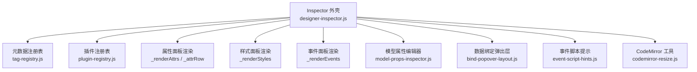
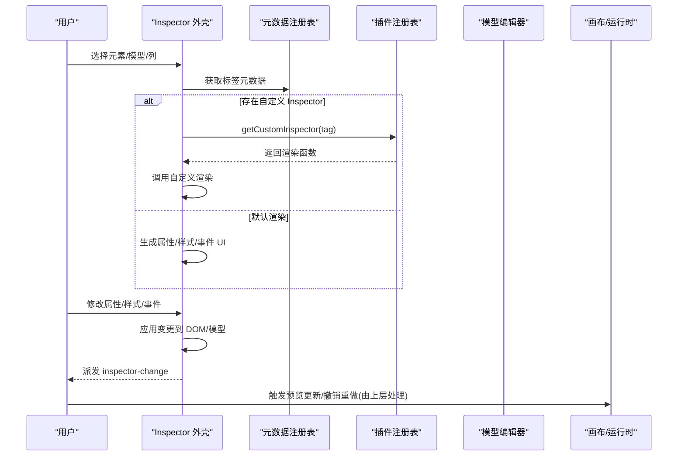
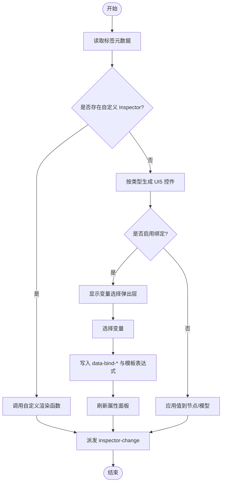
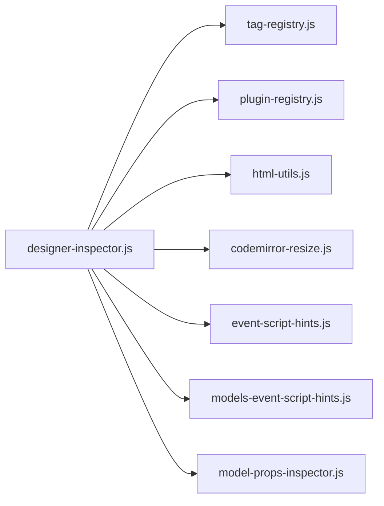

# 属性编辑面板

<cite>
**本文引用的文件**
- [designer-inspector.js](file://CMXHTMLDesigner/src/components/designer-inspector.js)
- [model-props-inspector.js](file://CMXHTMLDesigner/src/components/designer-inspector/model-props-inspector.js)
- [bind-popover-layout.js](file://CMXHTMLDesigner/src/components/designer-inspector/bind-popover-layout.js)
- [portal-property-panel.js](file://CMXHTMLDesigner/src/debug-portal/portal-property-panel.js)
- [tag-registry.js](file://CMXHTMLDesigner/src/metadata/tag-registry.js)
- [plugin-registry.js](file://CMXHTMLDesigner/src/lib/plugin-registry.js)
- [html-utils.js](file://CMXHTMLDesigner/src/utils/html-utils.js)
- [codemirror-resize.js](file://CMXHTMLDesigner/src/utils/codemirror-resize.js)
- [event-script-hints.js](file://CMXHTMLDesigner/src/components/designer-inspector/event-script-hints.js)
- [models-event-script-hints.js](file://CMXHTMLDesigner/src/components/designer-page-data/models-event-script-hints.js)
</cite>

## 目录
1. [简介](#简介)
2. [项目结构](#项目结构)
3. [核心组件](#核心组件)
4. [架构总览](#架构总览)
5. [详细组件分析](#详细组件分析)
6. [依赖关系分析](#依赖关系分析)
7. [性能考量](#性能考量)
8. [故障排查指南](#故障排查指南)
9. [结论](#结论)
10. [附录](#附录)

## 简介
本技术文档围绕“属性编辑面板”展开，聚焦元数据驱动的属性生成机制、编辑器选择与值验证、文本内容编辑、自定义属性设置、UI5 Slot 管理、数据绑定弹出层交互、变量选择器与绑定状态管理、属性变更事件传播、撤销重做支持（扩展点）、实时预览更新以及自定义属性编辑器的开发指南与最佳实践。文档面向设计器用户与二次开发者，既提供高层概览，也给出代码级实现路径与图示。

## 项目结构
属性编辑能力主要由以下模块协作完成：
- 右侧 Inspector 外壳与 Tab 管理：负责属性、样式、事件、调试日志等面板的切换与渲染调度。
- 元数据驱动的属性生成：基于标签元数据注册表动态生成属性表单控件，并处理类型映射与校验。
- 模型属性编辑器：针对页面级模型（数据集、主从、列模型、弹性组合）提供专用编辑界面。
- 数据绑定弹出层：为可绑定属性提供变量选择与绑定状态管理。
- 事件脚本编辑器：集成 CodeMirror，提供事件脚本编写、提示与调试插入。
- 插件钩子：允许为特定标签或模型提供自定义 Inspector 渲染逻辑。

图表来源
- [designer-inspector.js:15-39](file://CMXHTMLDesigner/src/components/designer-inspector.js#L15-L39)
- [designer-inspector.js:182-266](file://CMXHTMLDesigner/src/components/designer-inspector.js#L182-L266)
- [model-props-inspector.js:14-31](file://CMXHTMLDesigner/src/components/designer-inspector/model-props-inspector.js#L14-L31)
- [bind-popover-layout.js:1-7](file://CMXHTMLDesigner/src/components/designer-inspector/bind-popover-layout.js#L1-L7)

章节来源
- [designer-inspector.js:15-39](file://CMXHTMLDesigner/src/components/designer-inspector.js#L15-L39)
- [designer-inspector.js:182-266](file://CMXHTMLDesigner/src/components/designer-inspector.js#L182-L266)

## 核心组件
- DesignerInspector（Inspector 外壳）
  - 职责：管理选中节点/模型/列，渲染属性、样式、事件与调试日志；派发 inspector-change 等事件；集成 CodeMirror 与事件脚本提示。
  - 关键流程：setNode/setModel/setModelColumn → _renderAll → 分支渲染属性/样式/事件或模型属性。
- 元数据属性生成器
  - 职责：根据 tag-registry 中每个标签的 attrs/styles/events/slots 定义，动态生成 UI5 表单控件，并处理类型映射（boolean/select/number/url/text）。
  - 关键点：_attrRow 决定输入控件类型；_slotSection 处理 UI5 Slot；_renderStyles 处理样式分组与原始 style 编辑。
- 模型属性编辑器
  - 职责：为 CmxDataSet、CmxMasterSlave、CmxColumnModel、FlexibleCombination 提供专用编辑界面，支持 JSON 校验、下拉候选、行编辑、状态提示等。
  - 关键点：renderModelPropsInspector 按 modelType 路由到具体渲染器；renderColumnDetailPropsInspector 使用 cmx-data-comp 的字段面板进行细粒度编辑。
- 数据绑定弹出层
  - 职责：点击“绑定”按钮弹出变量列表，选择后将 data-bind-* 与模板表达式写入节点属性，并刷新视图。
  - 关键点：位置计算依据 bind-popover-layout 常量；清除绑定逻辑与已绑定状态高亮。
- 事件脚本编辑器
  - 职责：展示已知事件/模型事件，提供 CodeMirror 编辑器、脚本提示、插入 debugger、绑定/移除事件。
  - 关键点：通过 event-script-hints 与 models-event-script-hints 提供上下文提示；与画布 attachHandler/detachHandler 联动。

章节来源
- [designer-inspector.js:48-118](file://CMXHTMLDesigner/src/components/designer-inspector.js#L48-L118)
- [designer-inspector.js:270-442](file://CMXHTMLDesigner/src/components/designer-inspector.js#L270-L442)
- [designer-inspector.js:523-597](file://CMXHTMLDesigner/src/components/designer-inspector.js#L523-L597)
- [designer-inspector.js:601-705](file://CMXHTMLDesigner/src/components/designer-inspector.js#L601-L705)
- [model-props-inspector.js:14-31](file://CMXHTMLDesigner/src/components/designer-inspector/model-props-inspector.js#L14-L31)
- [model-props-inspector.js:140-424](file://CMXHTMLDesigner/src/components/designer-inspector/model-props-inspector.js#L140-L424)
- [bind-popover-layout.js:1-7](file://CMXHTMLDesigner/src/components/designer-inspector/bind-popover-layout.js#L1-L7)

## 架构总览
属性编辑面板采用“元数据驱动 + 插件扩展”的架构：
- 元数据驱动：标签元数据定义属性、样式、事件、Slot 推荐，Inspector 据此动态生成 UI。
- 插件扩展：通过 plugin-registry 为特定标签提供自定义 Inspector，覆盖默认渲染。
- 模型编辑：对页面级模型提供专用编辑器，统一 onChange 回调以触发页面数据变更与刷新。
- 事件系统：Inspector 派发 inspector-change 事件，上层监听后执行撤销/重做、保存、预览刷新等操作。

图表来源
- [designer-inspector.js:182-266](file://CMXHTMLDesigner/src/components/designer-inspector.js#L182-L266)
- [designer-inspector.js:270-442](file://CMXHTMLDesigner/src/components/designer-inspector.js#L270-L442)
- [designer-inspector.js:601-705](file://CMXHTMLDesigner/src/components/designer-inspector.js#L601-L705)
- [plugin-registry.js:1-200](file://CMXHTMLDesigner/src/lib/plugin-registry.js#L1-L200)

## 详细组件分析

### 元数据驱动的属性生成机制
- 属性类型映射
  - boolean：渲染为 ui5-checkbox，空值表示未设置。
  - select：渲染为 ui5-select，选项来自 meta.options。
  - number/url/text：分别映射为 Number/URL/Text 类型的 ui5-input。
  - 文本内容：直接编辑元素的纯文本节点，保留子元素结构。
- 编辑器选择
  - 优先检查是否存在自定义 Inspector（getCustomInspector），若存在则委托其渲染。
  - 否则按元数据生成标准 UI5 控件。
- 值验证
  - 模型属性编辑器中对 JSON 文本区域进行解析校验，错误时显示错误信息。
  - 数值型输入在失焦/输入时尝试转换为数字，非法值不提交。
- 数据绑定弹出层
  - 点击绑定按钮弹出变量列表，选择后将 data-bind-* 与模板表达式写入节点属性，并刷新属性面板以反映绑定状态。
  - 支持清除绑定，恢复为普通属性。

图表来源
- [designer-inspector.js:270-442](file://CMXHTMLDesigner/src/components/designer-inspector.js#L270-L442)
- [designer-inspector.js:444-473](file://CMXHTMLDesigner/src/components/designer-inspector.js#L444-L473)
- [bind-popover-layout.js:1-7](file://CMXHTMLDesigner/src/components/designer-inspector/bind-popover-layout.js#L1-L7)

章节来源
- [designer-inspector.js:270-442](file://CMXHTMLDesigner/src/components/designer-inspector.js#L270-L442)
- [designer-inspector.js:444-473](file://CMXHTMLDesigner/src/components/designer-inspector.js#L444-L473)
- [model-props-inspector.js:166-186](file://CMXHTMLDesigner/src/components/designer-inspector/model-props-inspector.js#L166-L186)

### 文本内容编辑
- 行为：当元素存在直接文本节点或无子元素时，显示“文本内容”输入框。
- 更新策略：清空所有直接文本节点，再根据新值插入文本节点，保持子元素不变。
- 事件：change 事件触发后派发 inspector-change，供上层进行撤销/重做与预览更新。

章节来源
- [designer-inspector.js:297-351](file://CMXHTMLDesigner/src/components/designer-inspector.js#L297-L351)

### 自定义属性设置
- 功能：提供“属性名/属性值”输入与“设置/删除”按钮，用于添加或删除任意 HTML 属性。
- 反馈：操作成功后记录调试日志，并派发 inspector-change。

章节来源
- [designer-inspector.js:323-439](file://CMXHTMLDesigner/src/components/designer-inspector.js#L323-L439)

### UI5 Slot 管理
- 场景：仅对 ui5-* 标签显示 Slot 管理区。
- 功能：支持手动输入 slot 名称、快捷槽位芯片、设置与清除 slot。
- 事件：变更后派发 inspector-change，并记录调试日志。

章节来源
- [designer-inspector.js:475-521](file://CMXHTMLDesigner/src/components/designer-inspector.js#L475-L521)

### 数据绑定系统的弹出层交互
- 弹出层定位：基于按钮坐标与面板边界计算 top/left，遵循最小宽度与最大高度约束。
- 变量选择：从页面数据源过滤出有效变量，点击后写入 data-bind-* 与模板表达式。
- 绑定状态：已绑定的属性显示高亮边框，并提供“清除绑定”选项。

章节来源
- [designer-inspector.js:353-405](file://CMXHTMLDesigner/src/components/designer-inspector.js#L353-L405)
- [bind-popover-layout.js:1-7](file://CMXHTMLDesigner/src/components/designer-inspector/bind-popover-layout.js#L1-L7)

### 变量选择器与绑定状态管理
- 变量来源：从 pageDataComp._pageData 中筛选 name 非空的变量。
- 状态同步：绑定后重新渲染属性面板，确保“绑定”按钮状态与视觉反馈一致。

章节来源
- [designer-inspector.js:353-405](file://CMXHTMLDesigner/src/components/designer-inspector.js#L353-L405)

### 属性变更的事件传播机制
- 事件类型：inspector-change，detail.type 包括 attr/style/event/model/model-event。
- 传播范围：bubbles=true, composed=true，可穿透 Shadow DOM 被外层容器监听。
- 上层处理：通常用于触发撤销/重做、保存、刷新模型列表与预览。

章节来源
- [designer-inspector.js:12-14](file://CMXHTMLDesigner/src/components/designer-inspector.js#L12-L14)
- [designer-inspector.js:283-287](file://CMXHTMLDesigner/src/components/designer-inspector.js#L283-L287)
- [designer-inspector.js:408-423](file://CMXHTMLDesigner/src/components/designer-inspector.js#L408-L423)
- [designer-inspector.js:673-693](file://CMXHTMLDesigner/src/components/designer-inspector.js#L673-L693)

### 撤销重做支持与实时预览更新
- 撤销/重做：Inspector 本身不实现历史栈，但通过 inspector-change 事件将变更上报给上层。上层可在监听处维护撤销/重做栈，并在需要时回滚或重放变更。
- 实时预览：Inspector 在属性/样式/事件变更后立即应用到 DOM/模型，并通过 _emit('attr'|'style'|'event') 通知画布刷新预览。

章节来源
- [designer-inspector.js:408-423](file://CMXHTMLDesigner/src/components/designer-inspector.js#L408-L423)
- [designer-inspector.js:550-571](file://CMXHTMLDesigner/src/components/designer-inspector.js#L550-L571)
- [designer-inspector.js:673-693](file://CMXHTMLDesigner/src/components/designer-inspector.js#L673-L693)

### 模型属性编辑器详解
- 路由与渲染：根据 modelType 选择对应渲染器（数据集、主从、列模型、弹性组合）。
- 数据校验：JSON 文本区域输入时即时解析，错误时显示错误消息；数值输入限制为合法数字。
- 列详情编辑：使用 cmx-data-comp 的 renderFieldPanel 与 makeFlcAdapter 进行字段级编辑，支持枚举值增删、验证规则增删、录入控件模式切换等。
- 状态提示：为复杂配置（如弹性组合绑定、内联规则）提供状态提示，帮助用户理解当前配置有效性。

章节来源
- [model-props-inspector.js:14-31](file://CMXHTMLDesigner/src/components/designer-inspector/model-props-inspector.js#L14-L31)
- [model-props-inspector.js:37-128](file://CMXHTMLDesigner/src/components/designer-inspector/model-props-inspector.js#L37-L128)
- [model-props-inspector.js:140-424](file://CMXHTMLDesigner/src/components/designer-inspector/model-props-inspector.js#L140-L424)
- [model-props-inspector.js:494-513](file://CMXHTMLDesigner/src/components/designer-inspector/model-props-inspector.js#L494-L513)
- [model-props-inspector.js:520-539](file://CMXHTMLDesigner/src/components/designer-inspector/model-props-inspector.js#L520-L539)

### 事件脚本编辑器与提示
- 事件列表：展示标签已知事件或模型事件，支持自定义事件名。
- 脚本编辑：集成 CodeMirror，支持插入 debugger、脚本提示、绑定/移除事件。
- 提示来源：event-script-hints 与 models-event-script-hints 提供上下文相关提示。

章节来源
- [designer-inspector.js:601-705](file://CMXHTMLDesigner/src/components/designer-inspector.js#L601-L705)
- [designer-inspector.js:707-800](file://CMXHTMLDesigner/src/components/designer-inspector.js#L707-L800)
- [event-script-hints.js:1-200](file://CMXHTMLDesigner/src/components/designer-inspector/event-script-hints.js#L1-L200)
- [models-event-script-hints.js:1-200](file://CMXHTMLDesigner/src/components/designer-page-data/models-event-script-hints.js#L1-L200)

### 工作区属性面板（PortalPropertyPanel）
- 职责：在工作区 property 区内渲染属性视图，支持多视图底部 Tab 切换与关闭动作。
- 特点：顶栏为单颗“工作区”外层签，文案与图标取自包装层 caption/icon；内容区复用缓存根节点以提升切换性能。

章节来源
- [portal-property-panel.js:18-110](file://CMXHTMLDesigner/src/debug-portal/portal-property-panel.js#L18-L110)
- [portal-property-panel.js:117-226](file://CMXHTMLDesigner/src/debug-portal/portal-property-panel.js#L117-L226)

## 依赖关系分析
- 元数据注册表：提供标签元数据（attrs/styles/events/slots），驱动属性面板生成。
- 插件注册表：提供自定义 Inspector 钩子，允许覆盖默认渲染。
- HTML 工具：提供属性转义与样式值读取，保障安全与一致性。
- CodeMirror 工具：提供编辑器尺寸自适应与实例生命周期管理。
- 事件脚本提示：提供上下文相关的脚本提示，提升编辑体验。

图表来源
- [designer-inspector.js:15-39](file://CMXHTMLDesigner/src/components/designer-inspector.js#L15-L39)
- [designer-inspector.js:182-266](file://CMXHTMLDesigner/src/components/designer-inspector.js#L182-L266)

章节来源
- [designer-inspector.js:15-39](file://CMXHTMLDesigner/src/components/designer-inspector.js#L15-L39)
- [designer-inspector.js:182-266](file://CMXHTMLDesigner/src/components/designer-inspector.js#L182-L266)

## 性能考量
- 避免重复渲染：在模型/列属性编辑器中，onChange 触发后按需刷新局部 UI，减少整页重绘。
- CodeMirror 生命周期：每次渲染前销毁旧实例并解绑 resize，防止内存泄漏与布局抖动。
- 弹出层定位：使用最小宽度与最大高度约束，避免溢出与频繁重排。
- 事件节流：样式与属性变更使用 change/input 事件，必要时在上层进行节流或批量提交。

[本节为通用指导，无需引用具体文件]

## 故障排查指南
- 属性未生效
  - 检查是否正确派发 inspector-change 事件，上层是否监听并应用变更。
  - 确认元数据中属性名与节点属性名一致。
- 绑定失效
  - 检查 data-bind-* 与模板表达式是否正确写入。
  - 确认变量存在于 pageData 且 name 非空。
- JSON 校验失败
  - 查看模型属性编辑器中的错误提示，修正 JSON 格式。
- 事件脚本不执行
  - 确认事件已绑定到画布（attachHandler），并移除旧绑定后再重新绑定。
- 弹出层错位
  - 检查面板边界与按钮坐标计算，确认 bind-popover-layout 常量合理。

章节来源
- [designer-inspector.js:353-405](file://CMXHTMLDesigner/src/components/designer-inspector.js#L353-L405)
- [model-props-inspector.js:166-186](file://CMXHTMLDesigner/src/components/designer-inspector/model-props-inspector.js#L166-L186)
- [designer-inspector.js:673-693](file://CMXHTMLDesigner/src/components/designer-inspector.js#L673-L693)

## 结论
属性编辑面板通过元数据驱动与插件扩展实现了高度可配置的编辑体验。结合数据绑定弹出层、事件脚本编辑器与模型属性编辑器，覆盖了从基础属性到复杂业务模型的编辑需求。通过统一的事件传播机制，上层可灵活实现撤销/重做、保存与实时预览。建议遵循本文的最佳实践，确保扩展的可维护性与性能。

[本节为总结，无需引用具体文件]

## 附录

### 自定义属性编辑器开发指南与最佳实践
- 注册自定义 Inspector
  - 通过 plugin-registry 为特定标签注册渲染函数，接收 node、meta、mount、pageData、onChange 参数。
  - 在 onChange 中触发 inspector-change，确保上层能感知变更。
- 类型映射与验证
  - 遵循 boolean/select/number/url/text 的类型约定，使用 UI5 控件保证一致性。
  - 对复杂输入（如 JSON）进行即时校验，提供错误提示。
- 事件与状态
  - 使用 change/input 事件捕获用户输入，避免过度渲染。
  - 对已绑定属性提供视觉反馈（如高亮边框）与清除绑定能力。
- 性能与安全
  - 使用 html-utils 进行属性转义，防止 XSS。
  - 管理 CodeMirror 实例生命周期，避免内存泄漏。
- 可访问性
  - 为重要控件提供 label 与 placeholder，提升可访问性。
  - 使用语义化结构与 aria 属性增强屏幕阅读器支持。

章节来源
- [designer-inspector.js:270-442](file://CMXHTMLDesigner/src/components/designer-inspector.js#L270-L442)
- [designer-inspector.js:601-705](file://CMXHTMLDesigner/src/components/designer-inspector.js#L601-L705)
- [model-props-inspector.js:140-424](file://CMXHTMLDesigner/src/components/designer-inspector/model-props-inspector.js#L140-L424)