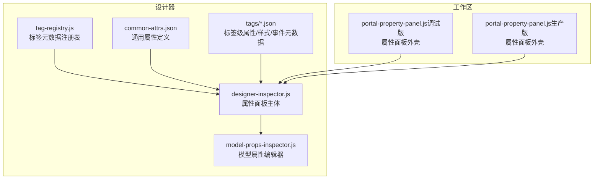
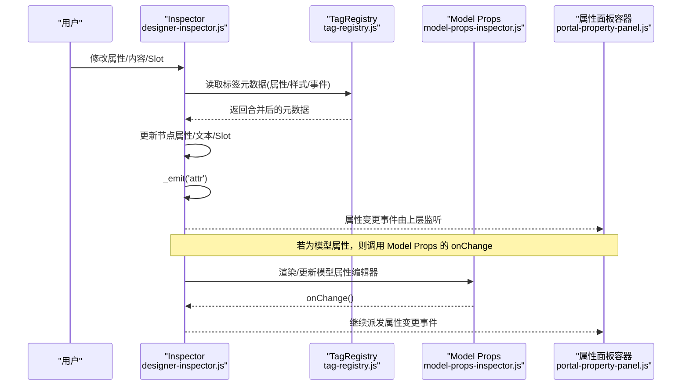
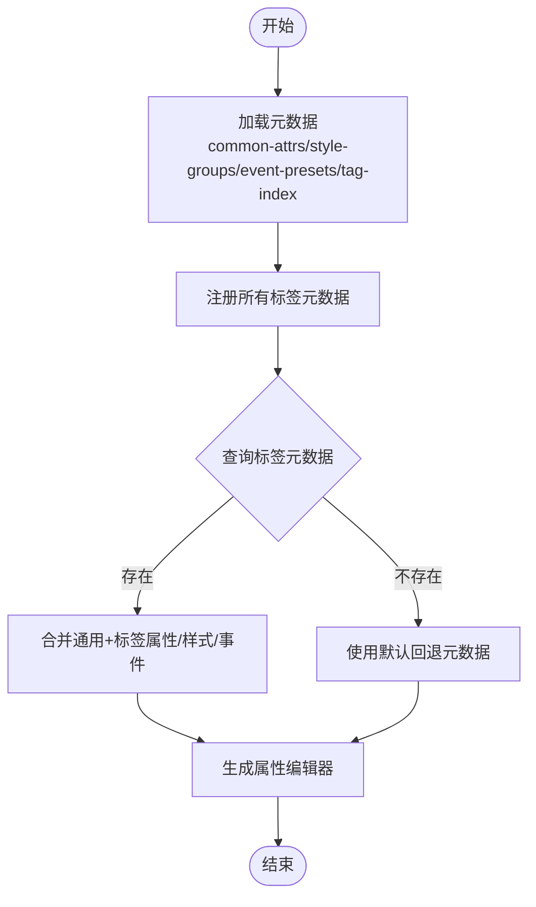
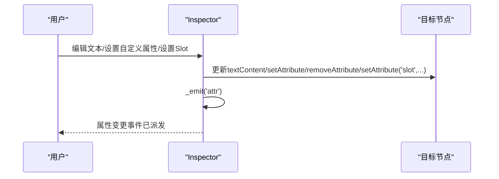
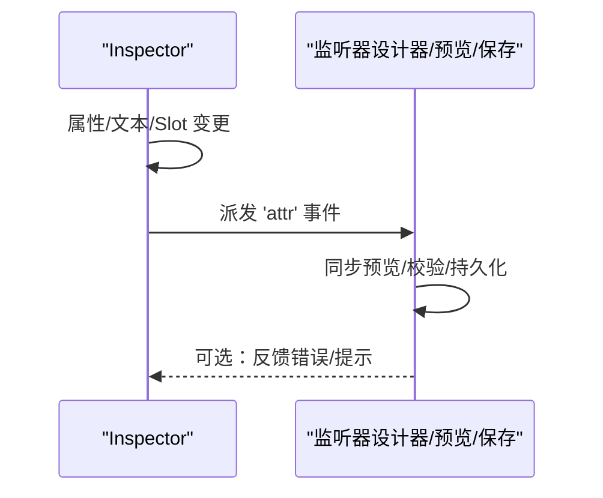
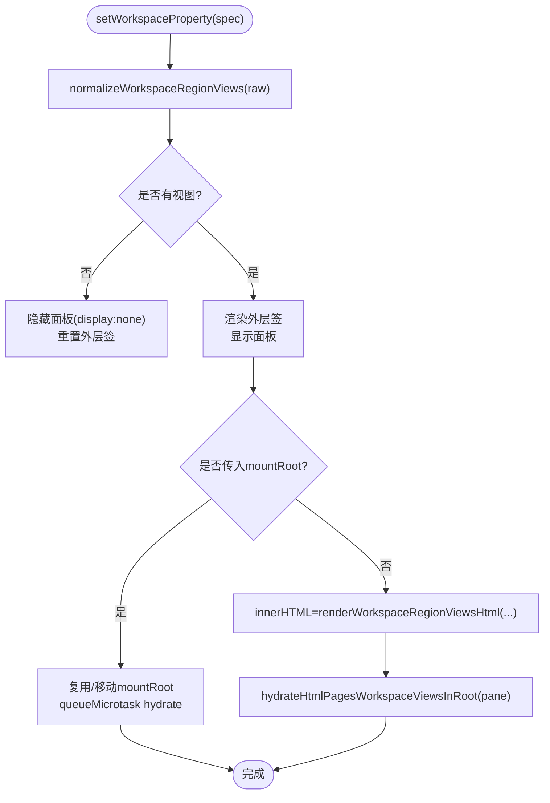
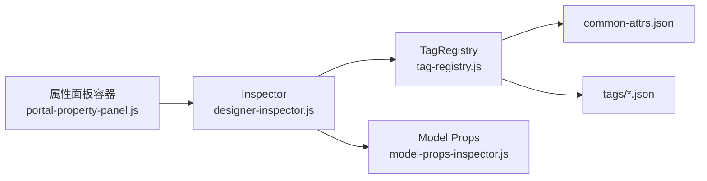

# 属性面板核心机制

<cite>
**本文引用的文件**
- [designer-inspector.js](file://CMXHTMLDesigner/src/components/designer-inspector.js)
- [model-props-inspector.js](file://CMXHTMLDesigner/src/components/designer-inspector/model-props-inspector.js)
- [tag-registry.js](file://CMXHTMLDesigner/src/metadata/tag-registry.js)
- [common-attrs.json](file://CMXHTMLDesigner/src/metadata/common-attrs.json)
- [div.json](file://CMXHTMLDesigner/src/metadata/tags/div.json)
- [portal-property-panel.js（调试版）](file://CMXHTMLDesigner/src/debug-portal/portal-property-panel.js)
- [portal-property-panel.js（生产版）](file://CMXPortalManager/src/components/portal-property-panel.js)
</cite>

## 目录
1. [简介](#简介)
2. [项目结构](#项目结构)
3. [核心组件](#核心组件)
4. [架构总览](#架构总览)
5. [详细组件分析](#详细组件分析)
6. [依赖关系分析](#依赖关系分析)
7. [性能考虑](#性能考虑)
8. [故障排查指南](#故障排查指南)
9. [结论](#结论)
10. [附录：自定义属性编辑器开发指南](#附录自定义属性编辑器开发指南)

## 简介
本技术文档聚焦于“属性面板”的核心机制，围绕元数据驱动的属性生成、类型映射与编辑器选择、值验证、UI5 Slot 管理、以及属性变更事件传播进行深入解析。重点覆盖 _renderAttrs() 的实现原理、渲染流程、状态管理与性能优化策略，并提供可操作的自定义属性编辑器开发指南与最佳实践。

## 项目结构
属性面板能力由两部分协作构成：
- 设计器侧 Inspector：负责根据标签元数据动态生成属性编辑 UI，处理文本内容编辑、自定义属性设置、UI5 Slot 管理，并在变更后触发属性变更事件。
- 工作区属性面板容器：在调试和生产环境中提供统一的属性面板外壳，承载多视图切换、拖拽与上下文菜单等交互。

图表来源
- [designer-inspector.js:426-521](file://CMXHTMLDesigner/src/components/designer-inspector.js#L426-L521)
- [model-props-inspector.js:14-31](file://CMXHTMLDesigner/src/components/designer-inspector/model-props-inspector.js#L14-L31)
- [tag-registry.js:15-149](file://CMXHTMLDesigner/src/metadata/tag-registry.js#L15-L149)
- [common-attrs.json:1-37](file://CMXHTMLDesigner/src/metadata/common-attrs.json#L1-L37)
- [div.json:1-34](file://CMXHTMLDesigner/src/metadata/tags/div.json#L1-L34)
- [portal-property-panel.js（调试版）:22-110](file://CMXHTMLDesigner/src/debug-portal/portal-property-panel.js#L22-L110)
- [portal-property-panel.js（生产版）:19-182](file://CMXPortalManager/src/components/portal-property-panel.js#L19-L182)

章节来源
- [designer-inspector.js:426-521](file://CMXHTMLDesigner/src/components/designer-inspector.js#L426-L521)
- [tag-registry.js:15-149](file://CMXHTMLDesigner/src/metadata/tag-registry.js#L15-L149)
- [portal-property-panel.js（调试版）:22-110](file://CMXHTMLDesigner/src/debug-portal/portal-property-panel.js#L22-L110)
- [portal-property-panel.js（生产版）:19-182](file://CMXPortalManager/src/components/portal-property-panel.js#L19-L182)

## 核心组件
- 设计器属性面板（Inspector）：基于标签元数据渲染属性表单，支持文本内容编辑、布尔/选择/文本输入、自定义属性增删、UI5 Slot 设置与清除，并在每次变更后通过内部事件总线发出属性变更事件。
- 模型属性编辑器：针对复杂模型（数据集、主从、列模型、弹性组合）提供专用编辑器，统一通过 onChange 回调通知上层。
- 标签元数据注册表：集中管理标签的通用属性、样式组、事件预设与默认初始化逻辑，运行时异步加载并缓存。
- 属性面板容器：在工作区右侧提供统一的外壳，支持多视图切换、拖拽放置、右键菜单与可见性控制。

章节来源
- [designer-inspector.js:426-521](file://CMXHTMLDesigner/src/components/designer-inspector.js#L426-L521)
- [model-props-inspector.js:14-31](file://CMXHTMLDesigner/src/components/designer-inspector/model-props-inspector.js#L14-L31)
- [tag-registry.js:15-149](file://CMXHTMLDesigner/src/metadata/tag-registry.js#L15-L149)
- [portal-property-panel.js（生产版）:19-182](file://CMXPortalManager/src/components/portal-property-panel.js#L19-L182)

## 架构总览
属性面板采用“元数据驱动 + 插件化编辑器”的架构：
- 元数据层：common-attrs.json 定义通用属性；每个标签的 JSON（如 div.json）声明其专属属性、样式组、事件预设与默认行为。
- 注册表层：TagRegistry 合并通用属性与标签属性，计算可用样式组与事件集，提供 get/register/getByGroup 等查询接口。
- 渲染层：Inspector 依据当前选中节点的标签元数据，动态生成属性行（文本、布尔、选择等），并绑定输入事件。
- 编辑器层：对复杂模型使用 model-props-inspector 提供的专用编辑器，按模型类型分派渲染函数。
- 事件层：所有属性变更通过 _emit('attr') 上报，供设计器同步 DOM、预览或持久化。

图表来源
- [designer-inspector.js:426-521](file://CMXHTMLDesigner/src/components/designer-inspector.js#L426-L521)
- [tag-registry.js:123-149](file://CMXHTMLDesigner/src/metadata/tag-registry.js#L123-L149)
- [model-props-inspector.js:14-31](file://CMXHTMLDesigner/src/components/designer-inspector/model-props-inspector.js#L14-L31)
- [portal-property-panel.js（生产版）:140-182](file://CMXPortalManager/src/components/portal-property-panel.js#L140-L182)

## 详细组件分析

### 元数据驱动的属性和编辑器选择
- 通用属性：来自 common-attrs.json，包含 id、class、title、hidden、tabindex、lang 等基础属性定义。
- 标签属性：每个标签 JSON（如 div.json）声明其 attrs、styleGroups、eventPreset、extraEvents、defaults 等。
- 注册表合并：TagRegistry.register 将通用属性与标签属性合并，计算 styles/events/defaultSetup，确保未知标签也能回退到通用行为。
- 运行时加载：ensureTagRegistryLoaded 并发拉取 common-attrs、style-groups、event-presets、tag-index，再逐个加载 tags/* 元数据并注册。

图表来源
- [tag-registry.js:15-149](file://CMXHTMLDesigner/src/metadata/tag-registry.js#L15-L149)
- [common-attrs.json:1-37](file://CMXHTMLDesigner/src/metadata/common-attrs.json#L1-L37)
- [div.json:1-34](file://CMXHTMLDesigner/src/metadata/tags/div.json#L1-L34)

章节来源
- [tag-registry.js:15-149](file://CMXHTMLDesigner/src/metadata/tag-registry.js#L15-L149)
- [common-attrs.json:1-37](file://CMXHTMLDesigner/src/metadata/common-attrs.json#L1-L37)
- [div.json:1-34](file://CMXHTMLDesigner/src/metadata/tags/div.json#L1-L34)

### _renderAttrs() 实现原理（文本内容编辑、自定义属性设置、UI5 Slot 管理）
- 文本内容编辑：当节点支持嵌套时，Inspector 会渲染文本编辑区域，用户输入后直接更新节点文本内容，并触发属性变更事件。
- 自定义属性设置：通过输入框填写属性名与值，点击设置按钮写入节点属性；删除按钮移除指定属性。两者均触发属性变更事件。
- UI5 Slot 管理：对于 UI5 组件，Inspector 提供 slot 名称输入与快捷 chip，支持设置/清除 slot，并在变更后触发属性变更事件。

图表来源
- [designer-inspector.js:426-521](file://CMXHTMLDesigner/src/components/designer-inspector.js#L426-L521)

章节来源
- [designer-inspector.js:426-521](file://CMXHTMLDesigner/src/components/designer-inspector.js#L426-L521)

### 属性变更的事件传播机制（_emit('attr') 触发时机与监听器处理）
- 触发时机：任何导致节点属性、文本或 Slot 变化的操作都会调用 _emit('attr')，包括：
  - 文本内容编辑完成
  - 自定义属性设置或删除
  - UI5 Slot 设置或清除
- 监听器处理：上层（如设计器主循环、预览引擎、保存流程）订阅该事件，执行：
  - 同步预览视图
  - 更新中间态模型
  - 触发校验与重渲染
  - 持久化变更

图表来源
- [designer-inspector.js:426-521](file://CMXHTMLDesigner/src/components/designer-inspector.js#L426-L521)

章节来源
- [designer-inspector.js:426-521](file://CMXHTMLDesigner/src/components/designer-inspector.js#L426-L521)

### 属性面板的渲染流程、状态管理与性能优化
- 渲染流程：
  - 容器接收 spec（views[]），归一化后渲染顶部外层签与内容区。
  - 首次渲染或无缓存时，调用 renderWorkspaceRegionViewsHtml 生成属性视图 HTML。
  - 对 html_pages 视图进行 hydrate，确保自定义元素正确挂载。
- 状态管理：
  - 维护 _workspacePropertySpec 作为当前属性配置。
  - 通过 activateWorkspaceRegionViewByIndex / activateWorkspaceRegionViewByViewId 切换子视图。
  - visible 属性控制面板显隐。
- 性能优化：
  - 隐藏时仅设置 display:none，不清空子节点，避免 CE disconnect/connect 风暴。
  - 复用 mountRoot 减少重复创建与闪烁。
  - 仅在必要时重新渲染 pane innerHTML，优先复用缓存根。
  - 使用 queueMicrotask 延迟 hydrate，降低首帧压力。

图表来源
- [portal-property-panel.js（生产版）:140-182](file://CMXPortalManager/src/components/portal-property-panel.js#L140-L182)
- [portal-property-panel.js（调试版）:80-110](file://CMXHTMLDesigner/src/debug-portal/portal-property-panel.js#L80-L110)

章节来源
- [portal-property-panel.js（生产版）:140-182](file://CMXPortalManager/src/components/portal-property-panel.js#L140-L182)
- [portal-property-panel.js（调试版）:80-110](file://CMXHTMLDesigner/src/debug-portal/portal-property-panel.js#L80-L110)

### 模型属性编辑器（CmxDataSet/CmxMasterSlave/CmxColumnModel/FlexibleCombination）
- 分派渲染：根据 model.modelType 选择对应渲染函数，统一通过 onChange 回调通知上层。
- 字段编辑：使用通用 helper（textRow/selectRow/textareaRow/checkboxRow/numberRow）构建表单，并通过 bindInput/bindSelect/bindCheckbox 等绑定输入事件。
- 复杂结构：
  - CmxDataSet：初始数据来源、JSON 数组行数据、子数据集绑定。
  - CmxMasterSlave：自动加载、加载形态、数据源、分页/深度/过滤等。
  - CmxColumnModel：实例名、datasetId、toTitleCols、iconCol、元数据模型绑定。
  - FlexibleCombination：业务场景、目标列模型绑定、取数来源、内联规则。
- 校验与提示：对 JSON 输入进行解析与错误提示，保证属性有效性。

章节来源
- [model-props-inspector.js:14-31](file://CMXHTMLDesigner/src/components/designer-inspector/model-props-inspector.js#L14-L31)
- [model-props-inspector.js:140-220](file://CMXHTMLDesigner/src/components/designer-inspector/model-props-inspector.js#L140-L220)
- [model-props-inspector.js:222-290](file://CMXHTMLDesigner/src/components/designer-inspector/model-props-inspector.js#L222-L290)
- [model-props-inspector.js:292-317](file://CMXHTMLDesigner/src/components/designer-inspector/model-props-inspector.js#L292-L317)
- [model-props-inspector.js:325-424](file://CMXHTMLDesigner/src/components/designer-inspector/model-props-inspector.js#L325-L424)

## 依赖关系分析
- 设计器 Inspector 依赖 TagRegistry 获取标签元数据，从而决定属性编辑器与可用样式/事件。
- 模型属性编辑器依赖页面数据上下文（pageData）以提供 datalist 选项与服务函数列表。
- 属性面板容器依赖工作区工具函数（activate/hydrate/render）来管理视图切换与内容挂载。

图表来源
- [designer-inspector.js:426-521](file://CMXHTMLDesigner/src/components/designer-inspector.js#L426-L521)
- [tag-registry.js:123-149](file://CMXHTMLDesigner/src/metadata/tag-registry.js#L123-L149)
- [portal-property-panel.js（生产版）:140-182](file://CMXPortalManager/src/components/portal-property-panel.js#L140-L182)

章节来源
- [designer-inspector.js:426-521](file://CMXHTMLDesigner/src/components/designer-inspector.js#L426-L521)
- [tag-registry.js:123-149](file://CMXHTMLDesigner/src/metadata/tag-registry.js#L123-L149)
- [portal-property-panel.js（生产版）:140-182](file://CMXPortalManager/src/components/portal-property-panel.js#L140-L182)

## 性能考虑
- 避免频繁销毁/重建：隐藏属性面板时保留 DOM，仅切换 display，减少 CE 生命周期开销。
- 复用挂载点：通过 mountRoot 复用 Content 标签缓存，避免重复创建导致的闪烁与内存抖动。
- 延迟 Hydration：使用 queueMicrotask 推迟 html_pages 视图的 hydrate，降低首帧渲染压力。
- 条件渲染：仅在必要时重新渲染 pane.innerHTML，优先复用已有缓存根。
- 元数据批量加载：TagRegistry 并发拉取多个 JSON，减少网络往返。

[本节为通用性能建议，不直接分析具体文件]

## 故障排查指南
- 属性未生效：检查 _emit('attr') 是否被调用，确认上层监听器是否正确订阅并处理事件。
- Slot 无效：确认目标节点是否为 UI5 组件，且 slot 名称合法；检查设置/清除逻辑是否正确触发事件。
- 模型属性编辑器空白：检查 model.modelType 是否存在对应渲染器；确认 pageData 上下文是否完整。
- 面板不显示：检查 setWorkspaceProperty 的 spec 是否有效；确认 normalizeWorkspaceRegionViews 返回值非空。
- JSON 输入错误：查看错误提示区域，修正 JSON 格式；确保 onChange 被调用以刷新状态。

章节来源
- [designer-inspector.js:426-521](file://CMXHTMLDesigner/src/components/designer-inspector.js#L426-L521)
- [model-props-inspector.js:140-220](file://CMXHTMLDesigner/src/components/designer-inspector/model-props-inspector.js#L140-L220)
- [portal-property-panel.js（生产版）:140-182](file://CMXPortalManager/src/components/portal-property-panel.js#L140-L182)

## 结论
属性面板通过元数据驱动实现了高度可扩展的属性生成与编辑能力。TagRegistry 统一管理标签元数据，Inspector 负责渲染与事件派发，模型属性编辑器提供复杂结构的专用编辑体验，属性面板容器则提供稳定的外壳与性能优化。遵循本文档的流程与实践，可高效扩展新的属性类型与编辑器，并确保良好的用户体验与系统稳定性。

## 附录：自定义属性编辑器开发指南
- 新增属性类型：
  - 在标签元数据中声明新属性的 name、label、type、placeholder 等。
  - 在 Inspector 的 _attrRow 分支中添加对应编辑器渲染与绑定逻辑。
  - 在变更时调用 _emit('attr') 通知上层。
- 复杂模型编辑器：
  - 在 model-props-inspector 中为新模型类型添加渲染函数。
  - 使用通用 helper 构建表单，并通过 onChange 回调提交变更。
  - 对 JSON/数值等输入增加校验与错误提示。
- UI5 Slot 扩展：
  - 在 _bindSlotSection 中增加新的 slot 预设或交互方式。
  - 确保设置/清除 slot 后触发属性变更事件。
- 最佳实践：
  - 保持属性键名稳定，避免破坏向后兼容。
  - 对敏感输入进行转义与校验，防止 XSS 与非法值。
  - 利用 TagRegistry 的样式组与事件预设，保持一致的编辑体验。
  - 在属性面板容器中复用 mountRoot，减少重渲染与闪烁。

章节来源
- [designer-inspector.js:426-521](file://CMXHTMLDesigner/src/components/designer-inspector.js#L426-L521)
- [model-props-inspector.js:14-31](file://CMXHTMLDesigner/src/components/designer-inspector/model-props-inspector.js#L14-L31)
- [tag-registry.js:15-149](file://CMXHTMLDesigner/src/metadata/tag-registry.js#L15-L149)
- [portal-property-panel.js（生产版）:140-182](file://CMXPortalManager/src/components/portal-property-panel.js#L140-L182)