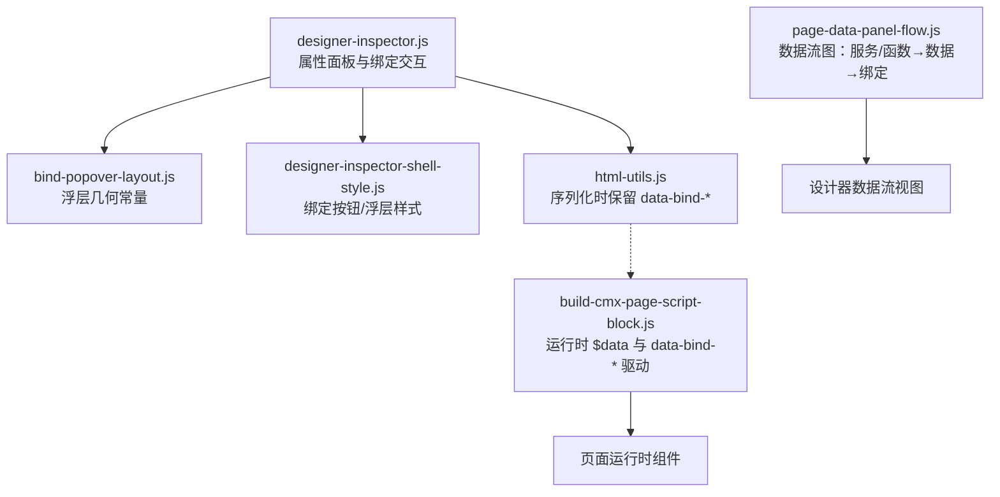
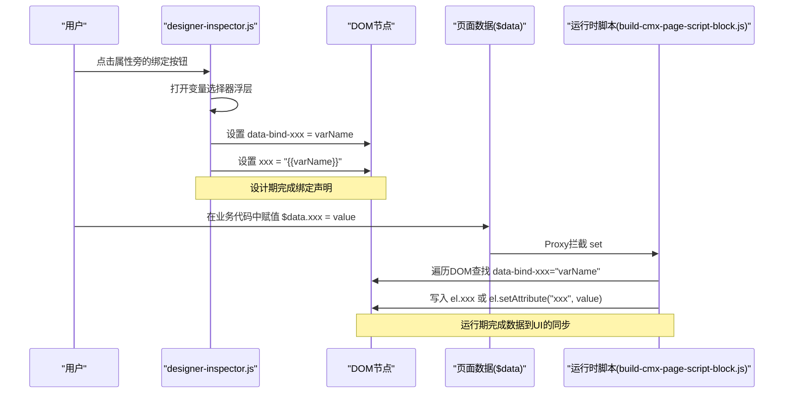
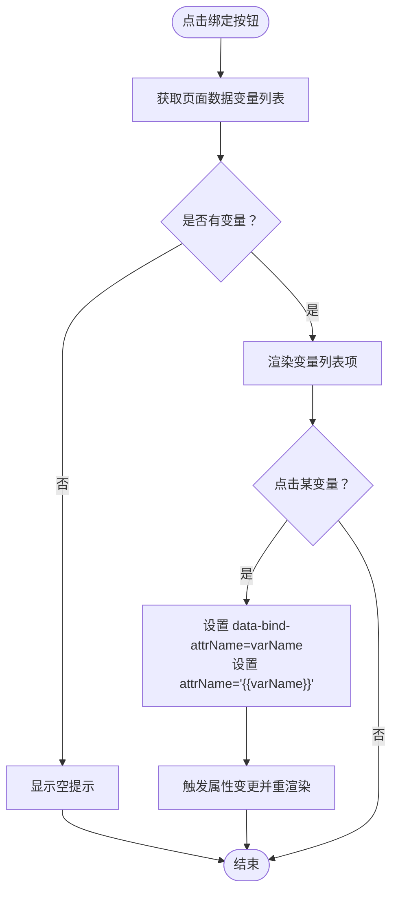
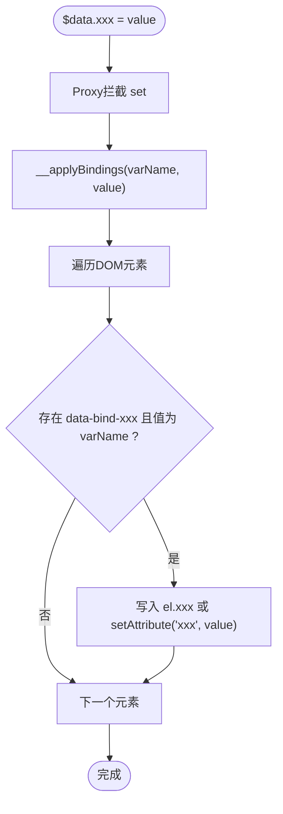
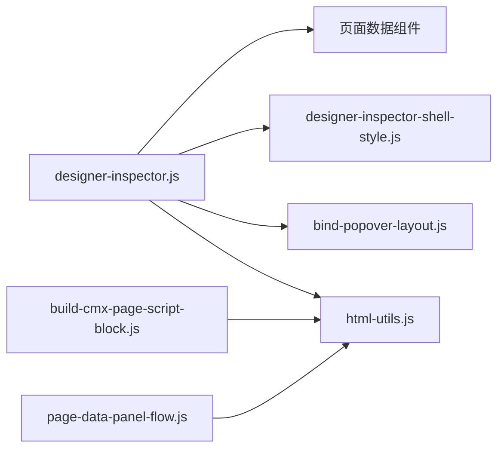

# 数据绑定系统

<cite>
**本文引用的文件**
- [designer-inspector.js](file://CMXHTMLDesigner/src/components/designer-inspector.js)
- [bind-popover-layout.js](file://CMXHTMLDesigner/src/components/designer-inspector/bind-popover-layout.js)
- [designer-inspector-shell-style.js](file://CMXHTMLDesigner/src/components/designer-inspector/designer-inspector-shell-style.js)
- [html-utils.js](file://CMXHTMLDesigner/src/utils/html-utils.js)
- [build-cmx-page-script-block.js](file://CMXHTMLDesigner/src/utils/build-cmx-page-script-block.js)
- [page-data-panel-flow.js](file://CMXHTMLDesigner/src/components/designer-page-data/page-data-panel-flow.js)
</cite>

## 目录
1. [简介](#简介)
2. [项目结构](#项目结构)
3. [核心组件](#核心组件)
4. [架构总览](#架构总览)
5. [详细组件分析](#详细组件分析)
6. [依赖关系分析](#依赖关系分析)
7. [性能考虑](#性能考虑)
8. [故障排查指南](#故障排查指南)
9. [结论](#结论)
10. [附录](#附录)

## 简介
本技术文档聚焦于 CMXHTMLDesigner 中的数据绑定系统，重点解释以下方面：
- 弹出层交互机制：变量选择器与绑定状态管理
- data-bind-* 属性的工作原理：绑定关系的存储、解析与运行时更新
- 绑定按钮的交互逻辑：变量列表获取、绑定设置与清除
- 绑定状态的视觉反馈：边框颜色变化与按钮样式更新
- 最佳实践与常见问题解决方案
- 扩展机制与自定义绑定规则的实现方法

该系统的核心思想是“设计期声明 + 运行期驱动”：在设计器中通过 data-bind-* 属性声明绑定关系，在运行时由生成的脚本根据 $data 的变化自动更新 DOM。

## 项目结构
与数据绑定相关的关键模块分布如下：
- 设计器属性面板与绑定交互：designer-inspector.js
- 绑定浮层布局常量：bind-popover-layout.js
- 绑定 UI 样式：designer-inspector-shell-style.js
- HTML 序列化与导出处理：html-utils.js
- 运行时脚本生成（$data 与 data-bind-* 驱动）：build-cmx-page-script-block.js
- 数据流可视化（服务/函数 → 数据 → 绑定）：page-data-panel-flow.js

图表来源
- [designer-inspector.js:353-405](file://CMXHTMLDesigner/src/components/designer-inspector.js#L353-L405)
- [bind-popover-layout.js:1-6](file://CMXHTMLDesigner/src/components/designer-inspector/bind-popover-layout.js#L1-L6)
- [designer-inspector-shell-style.js:539-606](file://CMXHTMLDesigner/src/components/designer-inspector/designer-inspector-shell-style.js#L539-L606)
- [html-utils.js:58-81](file://CMXHTMLDesigner/src/utils/html-utils.js#L58-L81)
- [build-cmx-page-script-block.js:110-163](file://CMXHTMLDesigner/src/utils/build-cmx-page-script-block.js#L110-L163)
- [page-data-panel-flow.js:11-26](file://CMXHTMLDesigner/src/components/designer-page-data/page-data-panel-flow.js#L11-L26)

章节来源
- [designer-inspector.js:353-405](file://CMXHTMLDesigner/src/components/designer-inspector.js#L353-L405)
- [html-utils.js:58-81](file://CMXHTMLDesigner/src/utils/html-utils.js#L58-L81)
- [build-cmx-page-script-block.js:110-163](file://CMXHTMLDesigner/src/utils/build-cmx-page-script-block.js#L110-L163)
- [page-data-panel-flow.js:11-26](file://CMXHTMLDesigner/src/components/designer-page-data/page-data-panel-flow.js#L11-L26)

## 核心组件
- 属性面板与绑定交互（designer-inspector.js）
  - 渲染每个元数据属性的输入框与绑定按钮
  - 点击绑定按钮弹出变量选择器浮层
  - 从页面数据源读取可用变量列表
  - 设置或清除 data-bind-* 属性并触发重绘
- 绑定浮层布局（bind-popover-layout.js）
  - 定义浮层最小宽度、最大高度、与按钮间距等常量
- 绑定样式（designer-inspector-shell-style.js）
  - 绑定按钮默认态、悬停态、已绑定态样式
  - 绑定浮层容器、选项项、空提示、清除项样式
- HTML 工具（html-utils.js）
  - 序列化设计区时保留 data-bind-* 属性
  - 导出模式清理 {{var}} 占位符但保留 data-bind-*
- 运行时脚本生成（build-cmx-page-script-block.js）
  - 生成 $data Proxy，监听赋值并通过 data-bind-* 将值写入 DOM
  - 初始化时将所有已声明绑定应用至对应元素
- 数据流可视化（page-data-panel-flow.js）
  - 解析画布中的 data-bind-* 属性，构建“服务/函数 → 数据 → 绑定”的关系图

章节来源
- [designer-inspector.js:444-473](file://CMXHTMLDesigner/src/components/designer-inspector.js#L444-L473)
- [designer-inspector-shell-style.js:539-606](file://CMXHTMLDesigner/src/components/designer-inspector/designer-inspector-shell-style.js#L539-L606)
- [html-utils.js:58-81](file://CMXHTMLDesigner/src/utils/html-utils.js#L58-L81)
- [build-cmx-page-script-block.js:110-163](file://CMXHTMLDesigner/src/utils/build-cmx-page-script-block.js#L110-L163)
- [page-data-panel-flow.js:11-26](file://CMXHTMLDesigner/src/components/designer-page-data/page-data-panel-flow.js#L11-L26)

## 架构总览
数据绑定系统分为“设计期”和“运行期”两部分：
- 设计期：用户在属性面板为某个属性选择变量，系统写入 data-bind-* 属性，并在同一属性上写入 {{varName}} 占位用于预览
- 运行期：页面加载后，脚本生成 $data 对象（Proxy），当 $data 字段被赋值时，遍历 DOM 查找 data-bind-* 属性匹配该变量的元素，并将值写入目标属性或 DOM 属性

图表来源
- [designer-inspector.js:353-405](file://CMXHTMLDesigner/src/components/designer-inspector.js#L353-L405)
- [build-cmx-page-script-block.js:110-163](file://CMXHTMLDesigner/src/utils/build-cmx-page-script-block.js#L110-L163)

## 详细组件分析

### 绑定按钮与弹出层交互
- 绑定按钮渲染
  - 每个可绑定的元数据属性都会渲染一个输入框和一个绑定按钮
  - 若当前属性存在 data-bind-* 标记，则输入框边框高亮，按钮显示“已绑定”样式
- 弹出层行为
  - 点击绑定按钮，读取页面数据变量列表
  - 若无变量，显示空提示
  - 若有变量，列出 $data.varName 供选择
  - 若已有绑定，提供“清除绑定”选项
- 绑定设置与清除
  - 选择变量：写入 data-bind-attrName=varName，同时设置 attrName="{{varName}}"
  - 清除绑定：移除 data-bind-attrName，若 attrName 值为 {{...}} 形式则一并移除
  - 每次操作后触发属性变更事件并重渲染属性面板

图表来源
- [designer-inspector.js:353-405](file://CMXHTMLDesigner/src/components/designer-inspector.js#L353-L405)
- [designer-inspector.js:444-473](file://CMXHTMLDesigner/src/components/designer-inspector.js#L444-L473)

章节来源
- [designer-inspector.js:353-405](file://CMXHTMLDesigner/src/components/designer-inspector.js#L353-L405)
- [designer-inspector.js:444-473](file://CMXHTMLDesigner/src/components/designer-inspector.js#L444-L473)

### data-bind-* 属性的工作原理
- 设计期存储
  - 使用 data-bind-attrName 记录绑定关系：属性名去掉前缀即为目标属性名
  - 同时在 attrName 上写入 {{varName}} 占位，便于设计期预览
- 运行期解析与更新
  - 生成 $data Proxy，拦截 set(key, value)
  - 调用内部 __applyBindings(varName, value) 遍历 DOM
  - 对每个元素检查是否存在 data-bind-attrName 且值等于 varName
  - 优先写入 el[attrName]（如 value、checked 等 DOM 属性），否则回退到 setAttribute(attrName, value)
- 导出与序列化
  - 序列化设计区时保留 data-bind-* 属性
  - 导出模式会清理 {{varName}} 占位符，但保留 data-bind-* 供运行时继续工作

图表来源
- [build-cmx-page-script-block.js:110-163](file://CMXHTMLDesigner/src/utils/build-cmx-page-script-block.js#L110-L163)
- [html-utils.js:58-81](file://CMXHTMLDesigner/src/utils/html-utils.js#L58-L81)

章节来源
- [build-cmx-page-script-block.js:110-163](file://CMXHTMLDesigner/src/utils/build-cmx-page-script-block.js#L110-L163)
- [html-utils.js:58-81](file://CMXHTMLDesigner/src/utils/html-utils.js#L58-L81)

### 绑定状态的视觉反馈
- 按钮样式
  - 未绑定：默认边框与颜色
  - 悬停：高亮边框与文字色
  - 已绑定：绿色边框、绿色文字、半透明背景
- 输入框边框
  - 若属性存在 data-bind-* 标记，输入框边框变为正色（绿色）
- 浮层样式
  - 浮层容器：深色背景、高亮边框、滚动条
  - 选项项：等宽字体、悬停高亮
  - 空提示：灰色斜体
  - 清除项：红色文字、顶部分隔线、悬停背景

章节来源
- [designer-inspector-shell-style.js:539-606](file://CMXHTMLDesigner/src/components/designer-inspector/designer-inspector-shell-style.js#L539-L606)
- [designer-inspector.js:463-473](file://CMXHTMLDesigner/src/components/designer-inspector.js#L463-L473)

### 数据流可视化（服务/函数 → 数据 → 绑定）
- 解析绑定
  - 从画布 HTML 中扫描所有 data-bind-* 属性
  - 提取 varName 与目标 tag、attrName，构建映射表
- 绘制流程图
  - 左列：服务（蓝色）、函数（紫色）
  - 中列：数据变量（绿色）
  - 右列：组件绑定（青绿）
  - 箭头表示数据流向：服务/函数写数据，数据再驱动绑定

章节来源
- [page-data-panel-flow.js:11-26](file://CMXHTMLDesigner/src/components/designer-page-data/page-data-panel-flow.js#L11-L26)
- [page-data-panel-flow.js:28-145](file://CMXHTMLDesigner/src/components/designer-page-data/page-data-panel-flow.js#L28-L145)

## 依赖关系分析
- designer-inspector.js 依赖：
  - bind-popover-layout.js：浮层尺寸常量
  - designer-inspector-shell-style.js：绑定按钮与浮层样式
  - html-utils.js：属性转义与序列化策略
  - page-data 组件：获取页面数据变量列表
- build-cmx-page-script-block.js 依赖：
  - html-utils.js：slug 与模板 ID 生成
  - 页面状态：pageData、pageFns、pageServices
- html-utils.js 依赖：
  - 主题配置与库信息
- page-data-panel-flow.js 依赖：
  - html-utils.js：escapeHtml
  - 页面数据与服务/函数列表

图表来源
- [designer-inspector.js:15-35](file://CMXHTMLDesigner/src/components/designer-inspector.js#L15-L35)
- [build-cmx-page-script-block.js:100-163](file://CMXHTMLDesigner/src/utils/build-cmx-page-script-block.js#L100-L163)
- [page-data-panel-flow.js:1-4](file://CMXHTMLDesigner/src/components/designer-page-data/page-data-panel-flow.js#L1-L4)

章节来源
- [designer-inspector.js:15-35](file://CMXHTMLDesigner/src/components/designer-inspector.js#L15-L35)
- [build-cmx-page-script-block.js:100-163](file://CMXHTMLDesigner/src/utils/build-cmx-page-script-block.js#L100-L163)
- [page-data-panel-flow.js:1-4](file://CMXHTMLDesigner/src/components/designer-page-data/page-data-panel-flow.js#L1-L4)

## 性能考虑
- 绑定更新复杂度
  - 每次 $data 赋值都会遍历 DOM 并检查所有元素的 data-bind-* 属性，时间复杂度 O(N×M)，其中 N 为元素数量，M 为属性数量
  - 建议：减少不必要的 $data 赋值；避免在高频回调中频繁修改 $data
- 设计期重渲染
  - 每次绑定变更会触发属性面板重渲染，注意避免在大量元素场景下频繁操作
- 导出与序列化
  - 导出时保留 data-bind-* 但清理 {{var}} 占位符，有助于减小输出体积并避免运行时误解析

[本节为通用指导，不直接分析具体文件]

## 故障排查指南
- 问题：绑定后 UI 未更新
  - 检查是否设置了 data-bind-attrName 且值与 $data 字段一致
  - 确认运行时代码是否正确生成 $data Proxy 与 __applyBindings
  - 查看控制台是否有异常或警告
- 问题：导出后绑定失效
  - 确认导出流程保留了 data-bind-* 属性
  - 确认运行环境包含生成的脚本块
- 问题：变量列表为空
  - 检查页面数据 Tab 是否添加了变量
  - 确认变量名称有效且非空
- 问题：清除绑定无效
  - 检查 data-bind-* 是否被正确移除
  - 若 attrName 仍为 {{...}} 形式，需一并移除

章节来源
- [designer-inspector.js:353-405](file://CMXHTMLDesigner/src/components/designer-inspector.js#L353-L405)
- [html-utils.js:58-81](file://CMXHTMLDesigner/src/utils/html-utils.js#L58-L81)
- [build-cmx-page-script-block.js:110-163](file://CMXHTMLDesigner/src/utils/build-cmx-page-script-block.js#L110-L163)

## 结论
数据绑定系统通过“设计期声明 + 运行期驱动”的方式实现了灵活的 UI 与数据同步。其核心优势包括：
- 直观的设计期交互：变量选择器与清晰的视觉反馈
- 强大的运行期能力：基于 $data Proxy 的自动更新机制
- 良好的可扩展性：支持自定义绑定规则与扩展点

建议在实际使用中遵循最佳实践，避免性能陷阱，充分利用数据流可视化进行调试与维护。

[本节为总结，不直接分析具体文件]

## 附录

### 最佳实践
- 合理命名变量：确保变量名清晰、唯一，便于维护与调试
- 控制更新频率：避免在高频事件中频繁修改 $data
- 利用数据流图：通过可视化视图理解数据流向，快速定位问题
- 谨慎导出：导出前检查绑定关系，确保运行时环境完整

### 常见问题解决方案
- 绑定不生效：检查 data-bind-* 与 $data 字段一致性
- 导出后丢失绑定：确认序列化流程保留 data-bind-*
- 变量列表为空：在页面数据 Tab 添加变量
- 清除绑定失败：确认 data-bind-* 与占位符均已移除

### 扩展机制与自定义绑定规则
- 扩展点
  - 在运行时脚本生成阶段，可通过扩展 __applyBindings 实现自定义绑定逻辑
  - 在设计器中，可通过插件机制扩展属性面板，增加新的绑定类型
- 自定义规则示例思路
  - 支持更复杂的表达式：如 $data.a + $data.b
  - 支持条件绑定：根据上下文决定是否绑定
  - 支持多目标绑定：一个变量绑定到多个属性或元素

[本节为概念性内容，不直接分析具体文件]