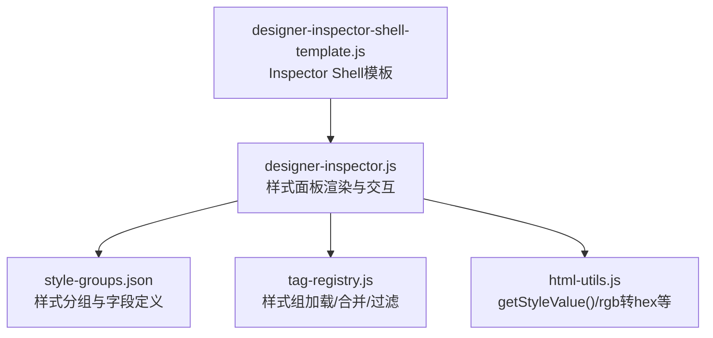
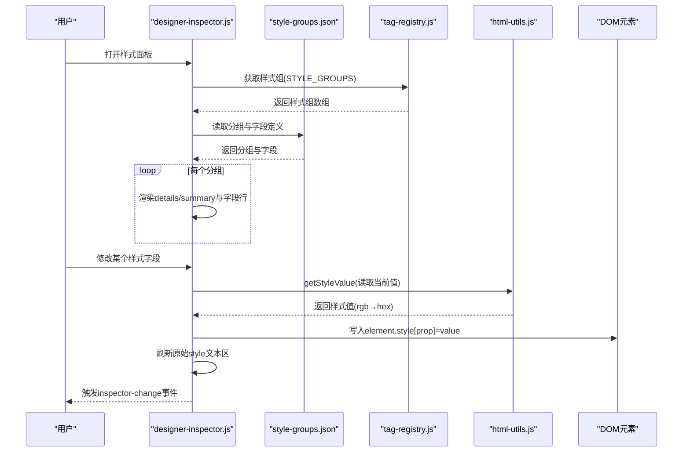
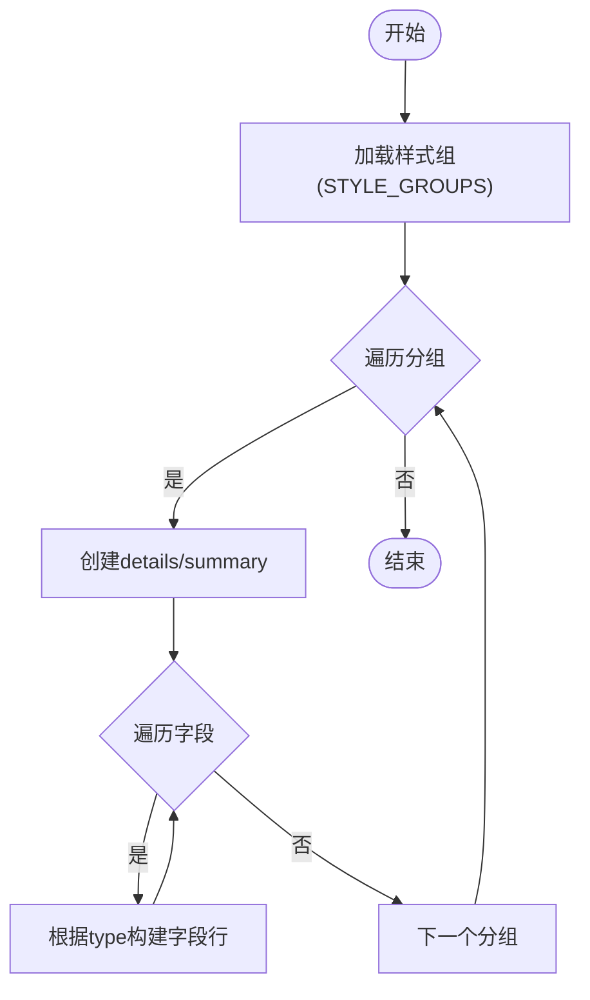
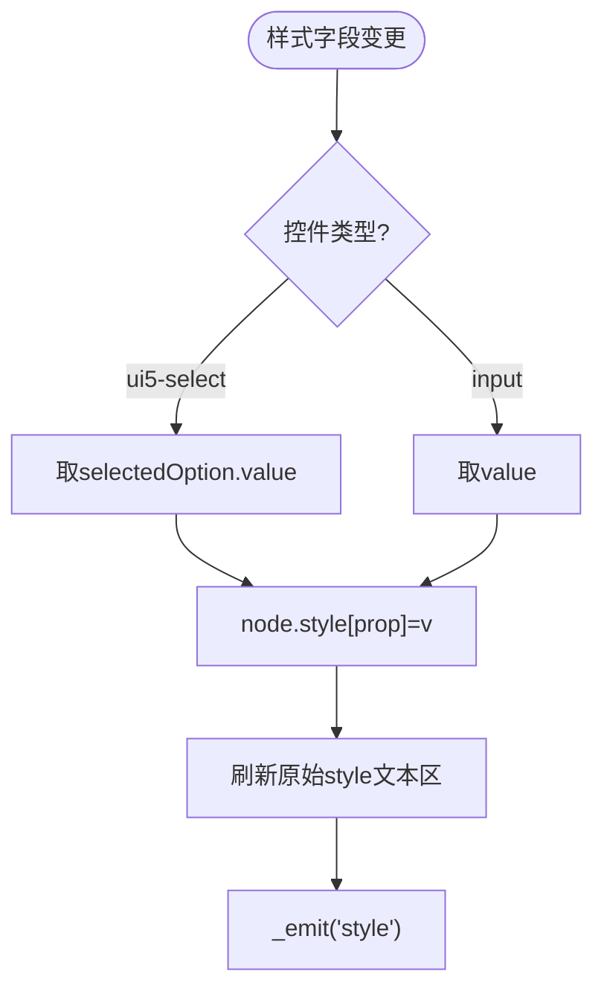
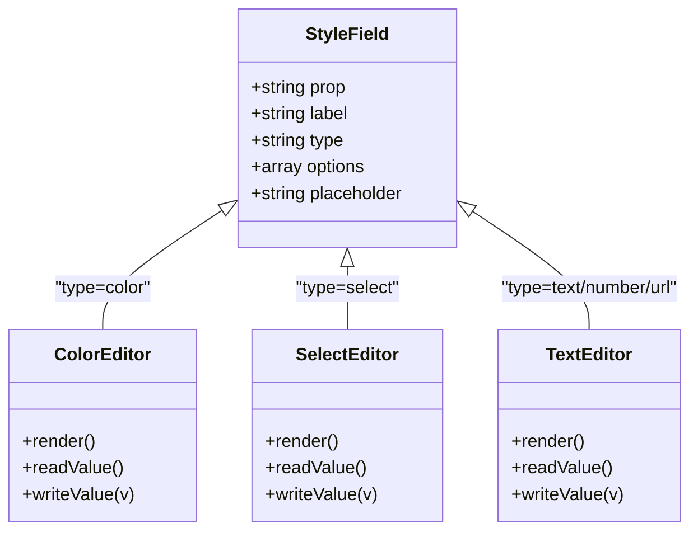
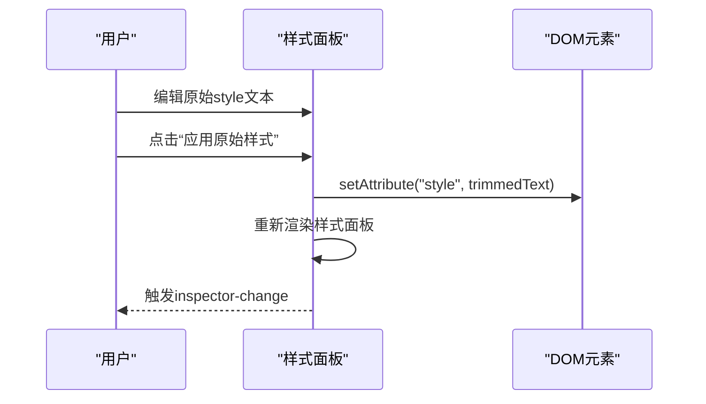
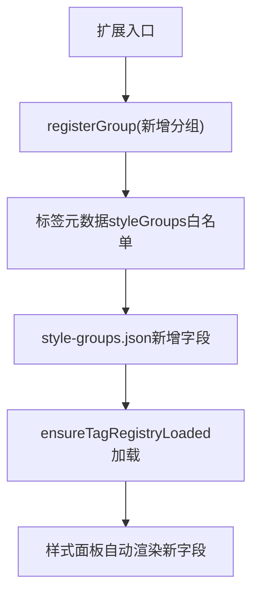
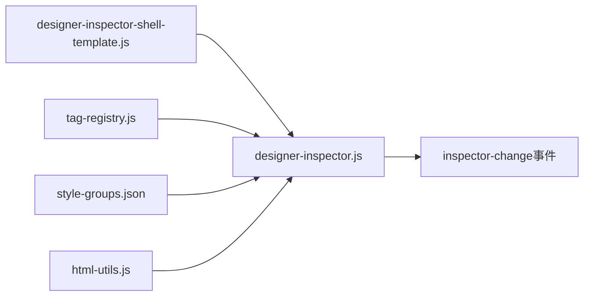

# 样式编辑器

<cite>
**本文引用的文件**
- [designer-inspector.js](file://CMXHTMLDesigner/src/components/designer-inspector.js)
- [html-utils.js](file://CMXHTMLDesigner/src/utils/html-utils.js)
- [style-groups.json](file://CMXHTMLDesigner/src/metadata/style-groups.json)
- [tag-registry.js](file://CMXHTMLDesigner/src/metadata/tag-registry.js)
- [groups.js](file://CMXHTMLDesigner/src/metadata/groups.js)
- [designer-inspector-shell-template.js](file://CMXHTMLDesigner/src/components/designer-inspector/designer-inspector-shell-template.js)
</cite>

## 目录
1. [简介](#简介)
2. [项目结构](#项目结构)
3. [核心组件](#核心组件)
4. [架构总览](#架构总览)
5. [详细组件分析](#详细组件分析)
6. [依赖关系分析](#依赖关系分析)
7. [性能考量](#性能考量)
8. [故障排查指南](#故障排查指南)
9. [结论](#结论)
10. [附录](#附录)

## 简介
本技术文档聚焦于设计器右侧“样式编辑器”的实现与工作机制，覆盖以下主题：
- 样式分组与分类机制（布局样式与其他样式的组织）
- 样式值的读取与写入流程（含 getStyleValue() 的原理）
- 不同样式类型的编辑器选择（颜色选择器、下拉菜单、文本输入框）
- 原始样式编辑器的功能（内联样式的直接编辑与应用）
- 实时预览与防抖策略（当前实现与可扩展优化建议）
- 扩展机制与自定义样式属性的添加方法

## 项目结构
样式编辑器位于右侧 Inspector 面板中，通过标签页切换属性、样式、事件与调试。样式相关逻辑集中在 designer-inspector.js，样式分组定义在 style-groups.json，元数据注册与加载在 tag-registry.js，工具函数（如 getStyleValue）在 html-utils.js。

**图表来源**
- [designer-inspector.js:523-597](file://CMXHTMLDesigner/src/components/designer-inspector.js#L523-L597)
- [style-groups.json:1-407](file://CMXHTMLDesigner/src/metadata/style-groups.json#L1-L407)
- [tag-registry.js:115-149](file://CMXHTMLDesigner/src/metadata/tag-registry.js#L115-L149)
- [html-utils.js:379-392](file://CMXHTMLDesigner/src/utils/html-utils.js#L379-L392)
- [designer-inspector-shell-template.js:1-45](file://CMXHTMLDesigner/src/components/designer-inspector/designer-inspector-shell-template.js#L1-L45)

**章节来源**
- [designer-inspector.js:1-120](file://CMXHTMLDesigner/src/components/designer-inspector.js#L1-L120)
- [designer-inspector-shell-template.js:1-45](file://CMXHTMLDesigner/src/components/designer-inspector/designer-inspector-shell-template.js#L1-L45)

## 核心组件
- 样式面板渲染与交互：负责按分组渲染样式项、绑定事件、将值写回元素内联样式，并同步更新“原始 style”文本区。
- 样式分组元数据：以 JSON 形式声明分组（如布局、弹性盒、文字、盒模型、定位），每个分组包含若干样式字段及其类型、选项和占位提示。
- 元数据注册表：负责从 dist/metadata 加载 common-attrs、style-groups、event-presets、tag-index，并将样式组注入到每个标签的元数据中；同时支持插件扩展分组。
- 工具函数：提供 getStyleValue() 用于读取元素当前样式值，并进行 rgb→hex 转换，便于颜色输入控件显示。

**章节来源**
- [designer-inspector.js:523-597](file://CMXHTMLDesigner/src/components/designer-inspector.js#L523-L597)
- [style-groups.json:1-407](file://CMXHTMLDesigner/src/metadata/style-groups.json#L1-L407)
- [tag-registry.js:15-110](file://CMXHTMLDesigner/src/metadata/tag-registry.js#L15-L110)
- [html-utils.js:379-392](file://CMXHTMLDesigner/src/utils/html-utils.js#L379-L392)

## 架构总览
样式编辑器的数据流如下：
- 渲染阶段：根据选中元素的标签元数据获取样式分组列表，遍历分组渲染为可折叠区域；每个样式项根据类型渲染为颜色选择器、下拉或文本输入。
- 读取阶段：使用 getStyleValue() 读取元素当前样式值，处理 rgb 格式转换为 hex，保证颜色输入控件正确显示。
- 写入阶段：监听 change/input 事件，将新值写入 element.style[prop]，并刷新“原始 style”文本区，触发 inspector-change 事件通知上层刷新。
- 原始样式编辑：提供 ui5-textarea 直接编辑 style 字符串，点击应用后将内容设置到元素 style 属性，再重新渲染样式面板。

**图表来源**
- [designer-inspector.js:523-597](file://CMXHTMLDesigner/src/components/designer-inspector.js#L523-L597)
- [tag-registry.js:115-149](file://CMXHTMLDesigner/src/metadata/tag-registry.js#L115-L149)
- [html-utils.js:379-392](file://CMXHTMLDesigner/src/utils/html-utils.js#L379-L392)
- [style-groups.json:1-407](file://CMXHTMLDesigner/src/metadata/style-groups.json#L1-L407)

## 详细组件分析

### 样式分组与分类机制
- 分组来源：STYLE_GROUPS 由 tag-registry 在 ensureTagRegistryLoaded 时从 style-groups.json 加载并赋值。
- 分组渲染：_renderStyles 遍历 meta.styles 或 STYLE_GROUPS，生成 details/summary 结构；其中 id 为 layout 的分组默认展开。
- 分组内容：每个分组包含多个样式字段，字段定义包括 prop（CSS 属性名）、label（显示名）、type（color/select/text/number）、options（select 选项）、placeholder（提示）。
- 分组扩展：TagRegistry.registerGroup 允许插件注册新的分组；TagRegistry._stylesFromMeta 支持按标签元数据中的 styleGroups 白名单过滤可用分组。

**图表来源**
- [designer-inspector.js:523-548](file://CMXHTMLDesigner/src/components/designer-inspector.js#L523-L548)
- [style-groups.json:1-407](file://CMXHTMLDesigner/src/metadata/style-groups.json#L1-L407)
- [tag-registry.js:15-110](file://CMXHTMLDesigner/src/metadata/tag-registry.js#L15-L110)

**章节来源**
- [designer-inspector.js:523-548](file://CMXHTMLDesigner/src/components/designer-inspector.js#L523-L548)
- [style-groups.json:1-407](file://CMXHTMLDesigner/src/metadata/style-groups.json#L1-L407)
- [tag-registry.js:15-110](file://CMXHTMLDesigner/src/metadata/tag-registry.js#L15-L110)

### 样式值的读取与写入过程
- 读取：_styleRow 调用 getStyleValue(node, meta.prop) 获取当前值；getStyleValue 从 node.style[prop] 取值，若为空则返回空串；若值为 rgb(...) 则转换为 #rrggbb，适配颜色输入控件。
- 写入：_renderStyles 中通过 change/input 事件统一处理，根据目标控件类型取值（ui5-select 取 selectedOption.value，input 取 value），然后写入 node.style[el.dataset.style] = v，并刷新原始 style 文本区。
- 同步：每次写入后触发 _emit('style')，通知父级组件进行画布刷新或其他联动操作。

**图表来源**
- [designer-inspector.js:550-572](file://CMXHTMLDesigner/src/components/designer-inspector.js#L550-L572)
- [html-utils.js:379-392](file://CMXHTMLDesigner/src/utils/html-utils.js#L379-L392)

**章节来源**
- [designer-inspector.js:550-572](file://CMXHTMLDesigner/src/components/designer-inspector.js#L550-L572)
- [html-utils.js:379-392](file://CMXHTMLDesigner/src/utils/html-utils.js#L379-L392)

### 不同样式类型的编辑器选择
- 颜色选择器：当字段 type 为 color 时，渲染原生 input[type=color]，并使用 getStyleValue 将 rgb 转为 hex 以便正确显示当前色值。
- 下拉菜单：当字段 type 为 select 时，渲染 ui5-select，并根据 options 生成选项；当前值匹配 selected。
- 文本输入框：其他类型（text/number/url）渲染 ui5-input，number 类型使用 Number 输入模式；支持 placeholder 提示。

**图表来源**
- [designer-inspector.js:574-597](file://CMXHTMLDesigner/src/components/designer-inspector.js#L574-L597)
- [style-groups.json:1-407](file://CMXHTMLDesigner/src/metadata/style-groups.json#L1-L407)

**章节来源**
- [designer-inspector.js:574-597](file://CMXHTMLDesigner/src/components/designer-inspector.js#L574-L597)
- [style-groups.json:1-407](file://CMXHTMLDesigner/src/metadata/style-groups.json#L1-L407)

### 原始样式编辑器的功能
- 展示：在样式面板底部提供 ui5-textarea，初始值为元素 style 属性字符串。
- 应用：点击“应用原始样式”按钮，将文本区内容 trim 后设置到元素的 style 属性，随后重新渲染样式面板并触发 inspector-change。
- 用途：适合高级用户快速粘贴或批量编辑 CSS 片段，无需逐个字段调整。

**图表来源**
- [designer-inspector.js:537-572](file://CMXHTMLDesigner/src/components/designer-inspector.js#L537-L572)

**章节来源**
- [designer-inspector.js:537-572](file://CMXHTMLDesigner/src/components/designer-inspector.js#L537-L572)

### 实时预览与防抖处理
- 当前实现：样式字段变更通过 change/input 事件立即写入 DOM，并在同一帧内刷新原始 style 文本区；没有显式防抖逻辑。
- 影响：频繁输入可能带来较多重排/重绘；对于复杂页面或大量节点，建议在父级组件层引入防抖（例如对 inspector-change 事件进行节流/防抖），以减少不必要的画布刷新。
- 建议：
  - 在 _emit('style') 前加入防抖，避免高频输入导致多次刷新。
  - 对颜色输入控件的 input 事件做更严格的节流（例如每 100ms 一次）。
  - 对大型画布，考虑增量更新或虚拟滚动优化。

**章节来源**
- [designer-inspector.js:550-572](file://CMXHTMLDesigner/src/components/designer-inspector.js#L550-L572)

### 扩展机制与自定义样式属性的添加方法
- 扩展样式分组：可通过 TagRegistry.registerGroup 注册新的分组（id、label、iconName、order、collapsed），并在 ensureTagRegistryLoaded 后生效。
- 限制标签可用分组：在标签元数据中指定 styleGroups 白名单，TagRegistry._stylesFromMeta 会据此过滤可用分组。
- 新增样式字段：在 style-groups.json 中添加新的分组或字段，定义 prop、label、type、options、placeholder；样式面板会自动渲染对应控件。
- 自定义样式属性：Inspector 的属性面板也支持“自定义属性”区域，可动态设置任意 data-* 或 aria-* 属性，便于扩展非样式属性。

**图表来源**
- [tag-registry.js:15-110](file://CMXHTMLDesigner/src/metadata/tag-registry.js#L15-L110)
- [style-groups.json:1-407](file://CMXHTMLDesigner/src/metadata/style-groups.json#L1-L407)
- [designer-inspector.js:523-548](file://CMXHTMLDesigner/src/components/designer-inspector.js#L523-L548)

**章节来源**
- [tag-registry.js:15-110](file://CMXHTMLDesigner/src/metadata/tag-registry.js#L15-L110)
- [style-groups.json:1-407](file://CMXHTMLDesigner/src/metadata/style-groups.json#L1-L407)
- [designer-inspector.js:523-548](file://CMXHTMLDesigner/src/components/designer-inspector.js#L523-L548)

## 依赖关系分析
- 样式面板依赖样式分组元数据（style-groups.json）与标签元数据注册表（tag-registry.js）。
- 样式值读取依赖 html-utils.js 的 getStyleValue()，确保颜色值正确显示。
- Inspector Shell 模板提供 UI 容器，TabManager 管理标签页切换。
- 事件系统：inspector-change 事件向上传递，供父组件执行画布刷新或状态同步。

**图表来源**
- [designer-inspector-shell-template.js:1-45](file://CMXHTMLDesigner/src/components/designer-inspector/designer-inspector-shell-template.js#L1-L45)
- [designer-inspector.js:1-120](file://CMXHTMLDesigner/src/components/designer-inspector.js#L1-L120)
- [tag-registry.js:115-149](file://CMXHTMLDesigner/src/metadata/tag-registry.js#L115-L149)
- [html-utils.js:379-392](file://CMXHTMLDesigner/src/utils/html-utils.js#L379-L392)
- [style-groups.json:1-407](file://CMXHTMLDesigner/src/metadata/style-groups.json#L1-L407)

**章节来源**
- [designer-inspector.js:1-120](file://CMXHTMLDesigner/src/components/designer-inspector.js#L1-L120)
- [tag-registry.js:115-149](file://CMXHTMLDesigner/src/metadata/tag-registry.js#L115-L149)

## 性能考量
- 即时写入：当前实现为即时写入 DOM，无防抖；在高频输入场景下可能导致频繁重排。
- 建议优化：
  - 在 _emit('style') 处增加防抖，减少画布刷新频率。
  - 对颜色输入控件的 input 事件进行节流。
  - 对大型页面采用增量更新或虚拟化渲染。
  - 避免在样式面板中执行昂贵计算，尽量延迟到防抖回调中。

[本节为通用性能建议，不直接分析具体文件]

## 故障排查指南
- 颜色值显示异常：检查 getStyleValue 是否正确将 rgb 转为 hex；确认浏览器是否返回 rgb 格式。
- 样式未生效：确认写入的 prop 是否为合法 CSS 属性名；检查元素是否被其他样式覆盖。
- 原始样式应用失败：检查文本区内容是否为有效 CSS 字符串；注意 trim 与语法错误。
- 分组未显示：确认 ensureTagRegistryLoaded 已调用；检查 style-groups.json 是否加载成功；验证标签元数据的 styleGroups 白名单。

**章节来源**
- [html-utils.js:379-392](file://CMXHTMLDesigner/src/utils/html-utils.js#L379-L392)
- [designer-inspector.js:537-572](file://CMXHTMLDesigner/src/components/designer-inspector.js#L537-L572)
- [tag-registry.js:115-149](file://CMXHTMLDesigner/src/metadata/tag-registry.js#L115-L149)

## 结论
样式编辑器通过声明式的样式分组元数据与灵活的编辑器类型映射，提供了直观且强大的样式编辑能力。其核心在于：
- 基于 style-groups.json 的分组与字段定义
- 通过 tag-registry 动态加载与过滤样式组
- 使用 getStyleValue 实现稳健的样式值读取
- 提供原始样式编辑以支持高级用法
- 具备扩展机制，便于按需添加分组与字段

在生产环境中，建议结合防抖与增量更新策略，以提升大规模页面的编辑体验。

[本节为总结性内容，不直接分析具体文件]

## 附录
- 样式分组示例：布局、弹性盒、文字、盒模型、定位等常见 CSS 类别。
- 编辑器类型：颜色选择器、下拉菜单、文本输入框，分别对应 color、select、text/number/url。
- 扩展点：TagRegistry.registerGroup、style-groups.json 字段定义、标签元数据 styleGroups 白名单。

[本节为补充信息，不直接分析具体文件]