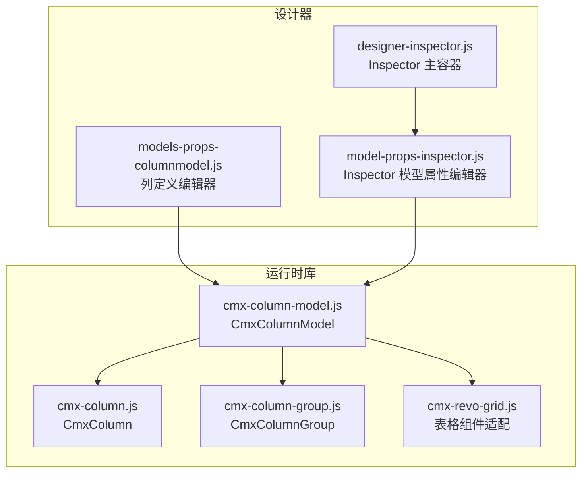
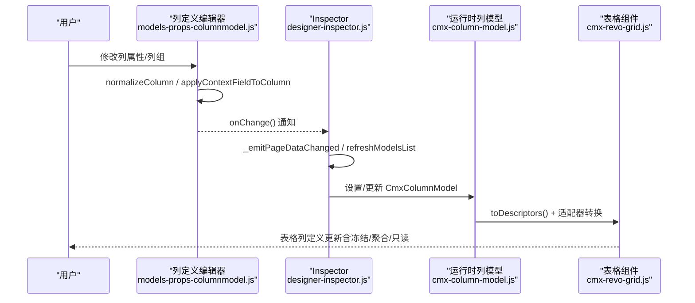
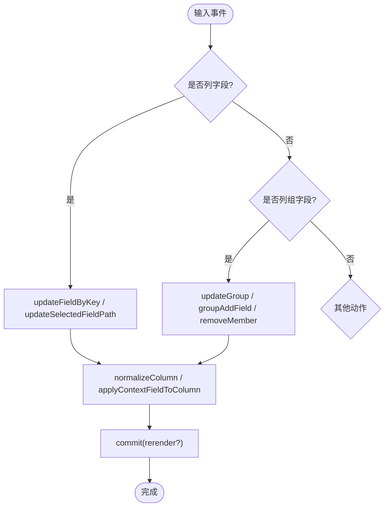
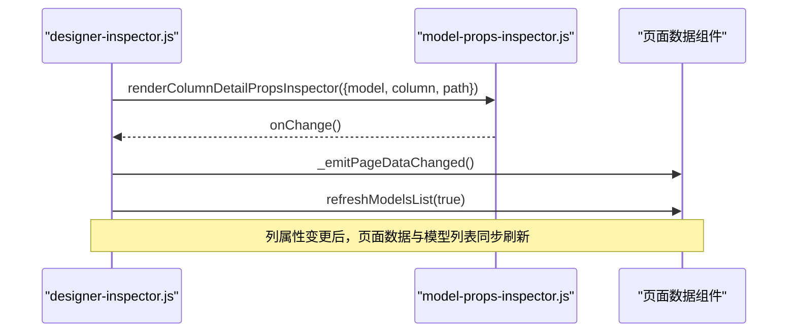
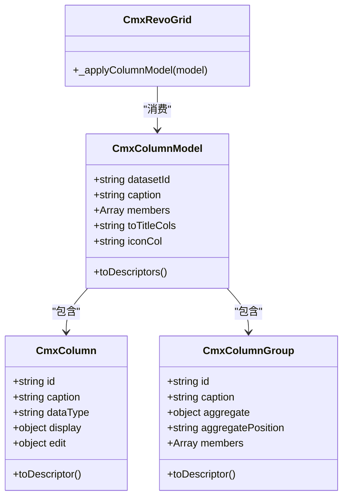
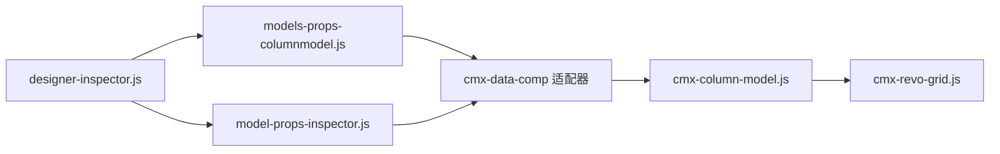

# 模型列属性面板

<cite>
**本文引用的文件**
- [models-props-columnmodel.js](file://CMXHTMLDesigner/src/components/designer-page-data/models-props-columnmodel.js)
- [model-props-inspector.js](file://CMXHTMLDesigner/src/components/designer-inspector/model-props-inspector.js)
- [designer-inspector.js](file://CMXHTMLDesigner/src/components/designer-inspector.js)
- [cmx-column-model.js](file://packages/cmx-data-comp/src/lib/cmx-column-model.js)
- [cmx-column.js](file://packages/cmx-data-comp/src/lib/cmx-column.js)
- [cmx-column-group.js](file://packages/cmx-data-comp/src/lib/cmx-column-group.js)
- [cmx-revo-grid.js](file://packages/cmx-data-comp/src/components/cmx-revo-grid.js)
- [08-列模型-CmxColumnModel.md](file://docs/CMXPortalManager+CMXHTMLDesigner-模型体系文档/08-列模型-CmxColumnModel.md)
</cite>

## 目录
1. [简介](#简介)
2. [项目结构](#项目结构)
3. [核心组件](#核心组件)
4. [架构总览](#架构总览)
5. [详细组件分析](#详细组件分析)
6. [依赖关系分析](#依赖关系分析)
7. [性能考虑](#性能考虑)
8. [故障排查指南](#故障排查指南)
9. [结论](#结论)
10. [附录](#附录)

## 简介
本技术文档围绕“模型列属性面板”展开，聚焦 CmxColumnModel 的属性编辑机制、列配置项的动态生成与校验、列属性与画布元素的关联与数据同步、变更对页面数据的影响（实时更新与依赖刷新）、模型列的特殊处理（只读与计算属性显示），以及扩展机制与自定义列类型的定义方法。文档同时提供架构图、流程图和时序图，帮助读者从设计器到运行时形成完整认知。

## 项目结构
- 设计器侧：
  - 中间“模型”页的列定义编辑器：models-props-columnmodel.js
  - 右侧 Inspector 的模型属性编辑器：model-props-inspector.js
  - Inspector 主容器与渲染调度：designer-inspector.js
- 运行时库：
  - 列模型与列定义：cmx-column-model.js、cmx-column.js、cmx-column-group.js
  - 表格组件适配：cmx-revo-grid.js（将模型转换为具体网格列定义）
- 文档参考：
  - 08-列模型-CmxColumnModel.md（字段速查与说明）

**图表来源**
- [models-props-columnmodel.js:23-108](file://CMXHTMLDesigner/src/components/designer-page-data/models-props-columnmodel.js#L23-L108)
- [model-props-inspector.js:14-31](file://CMXHTMLDesigner/src/components/designer-inspector/model-props-inspector.js#L14-L31)
- [designer-inspector.js:182-266](file://CMXHTMLDesigner/src/components/designer-inspector.js#L182-L266)
- [cmx-column-model.js:20-29](file://packages/cmx-data-comp/src/lib/cmx-column-model.js#L20-L29)
- [cmx-column.js:84-126](file://packages/cmx-data-comp/src/lib/cmx-column.js#L84-L126)
- [cmx-column-group.js:25-40](file://packages/cmx-data-comp/src/lib/cmx-column-group.js#L25-L40)
- [cmx-revo-grid.js:565-592](file://packages/cmx-data-comp/src/components/cmx-revo-grid.js#L565-L592)

**章节来源**
- [models-props-columnmodel.js:23-108](file://CMXHTMLDesigner/src/components/designer-page-data/models-props-columnmodel.js#L23-L108)
- [model-props-inspector.js:14-31](file://CMXHTMLDesigner/src/components/designer-inspector/model-props-inspector.js#L14-L31)
- [designer-inspector.js:182-266](file://CMXHTMLDesigner/src/components/designer-inspector.js#L182-L266)
- [cmx-column-model.js:20-29](file://packages/cmx-data-comp/src/lib/cmx-column-model.js#L20-L29)
- [cmx-column.js:84-126](file://packages/cmx-data-comp/src/lib/cmx-column.js#L84-L126)
- [cmx-column-group.js:25-40](file://packages/cmx-data-comp/src/lib/cmx-column-group.js#L25-L40)
- [cmx-revo-grid.js:565-592](file://packages/cmx-data-comp/src/components/cmx-revo-grid.js#L565-L592)

## 核心组件
- 列定义编辑器（models-props-columnmodel.js）
  - 负责列与列组的可视化编辑、JSON 视图、复制粘贴、枚举值维护、列组聚合开关等。
  - 通过适配器将上下文字段映射为 CmxColumn/CmxColumnGroup 并回写至实例 props。
- Inspector 模型属性编辑器（model-props-inspector.js）
  - 在右侧属性区展示 CmxColumnModel 的元数据来源绑定（datasetId、metaModelId、metaTable 等）。
  - 支持列级详情编辑（renderColumnDetailPropsInspector），包括验证规则与枚举值行编辑。
- Inspector 主容器（designer-inspector.js）
  - 根据选中对象决定渲染模型或节点属性；当选中列时调用 renderColumnDetailPropsInspector。
  - 变更时触发页面数据更新与模型列表刷新。
- 运行时列模型（cmx-column-model.js / cmx-column.js / cmx-column-group.js）
  - 以纯元数据形式组织列与列组，输出通用描述符供适配器转换。
- 表格组件适配（cmx-revo-grid.js）
  - 将 CmxColumnModel 转换为 RevoGrid 列定义，处理冻结列、聚合、只读函数等。

**章节来源**
- [models-props-columnmodel.js:23-108](file://CMXHTMLDesigner/src/components/designer-page-data/models-props-columnmodel.js#L23-L108)
- [model-props-inspector.js:37-128](file://CMXHTMLDesigner/src/components/designer-inspector/model-props-inspector.js#L37-L128)
- [designer-inspector.js:182-266](file://CMXHTMLDesigner/src/components/designer-inspector.js#L182-L266)
- [cmx-column-model.js:20-29](file://packages/cmx-data-comp/src/lib/cmx-column-model.js#L20-L29)
- [cmx-column.js:84-126](file://packages/cmx-data-comp/src/lib/cmx-column.js#L84-L126)
- [cmx-column-group.js:25-40](file://packages/cmx-data-comp/src/lib/cmx-column-group.js#L25-L40)
- [cmx-revo-grid.js:565-592](file://packages/cmx-data-comp/src/components/cmx-revo-grid.js#L565-L592)

## 架构总览
设计器中的列属性面板与运行时列模型通过“列定义”这一契约解耦：
- 设计器侧：用户通过 UI 编辑 columns/columnGroups，内部统一归一化为 CmxColumn/CmxColumnGroup，并持久化到 model.props。
- 运行时侧：CmxColumnModel 持有 datasetId、members（列与列组），toDescriptors() 输出通用描述符，由表格组件适配器转换为具体网格列定义。

**图表来源**
- [models-props-columnmodel.js:81-108](file://CMXHTMLDesigner/src/components/designer-page-data/models-props-columnmodel.js#L81-L108)
- [designer-inspector.js:217-260](file://CMXHTMLDesigner/src/components/designer-inspector.js#L217-L260)
- [cmx-column-model.js:20-29](file://packages/cmx-data-comp/src/lib/cmx-column-model.js#L20-L29)
- [cmx-revo-grid.js:565-592](file://packages/cmx-data-comp/src/components/cmx-revo-grid.js#L565-L592)

## 详细组件分析

### 列定义编辑器（models-props-columnmodel.js）
- 功能要点
  - 双视图：定义视图（表格化列/列组编辑）与 JSON 视图（可格式化/应用）。
  - 列操作：新增、删除、移动、复制粘贴、枚举值增删、列 ID 重命名（同步列组引用）。
  - 列组：支持嵌套分组、成员管理、聚合开关（sum/avg/max/min/count）与位置控制。
  - 数据归一化：normalizeColumnModelProps/normalizeColumn 确保字段结构一致（如 edit/display 块、dataType 默认值）。
  - 上下文字段适配：columnToContextField/contextFieldToColumn 双向转换，保证 UI 与模型一致。
- 关键流程
  - 输入事件：oninput/onchange 捕获字段路径写入，特殊处理 enumValues.* 数组路径。
  - 提交：commit(rerender) 触发 onChange 与可选重渲染。
  - JSON 视图：refreshJson/formatJson/applyJson 保障 JSON 与定义视图一致性。

**图表来源**
- [models-props-columnmodel.js:222-247](file://CMXHTMLDesigner/src/components/designer-page-data/models-props-columnmodel.js#L222-L247)
- [models-props-columnmodel.js:307-334](file://CMXHTMLDesigner/src/components/designer-page-data/models-props-columnmodel.js#L307-L334)
- [models-props-columnmodel.js:435-451](file://CMXHTMLDesigner/src/components/designer-page-data/models-props-columnmodel.js#L435-L451)
- [models-props-columnmodel.js:642-655](file://CMXHTMLDesigner/src/components/designer-page-data/models-props-columnmodel.js#L642-L655)

**章节来源**
- [models-props-columnmodel.js:23-108](file://CMXHTMLDesigner/src/components/designer-page-data/models-props-columnmodel.js#L23-L108)
- [models-props-columnmodel.js:222-247](file://CMXHTMLDesigner/src/components/designer-page-data/models-props-columnmodel.js#L222-L247)
- [models-props-columnmodel.js:307-334](file://CMXHTMLDesigner/src/components/designer-page-data/models-props-columnmodel.js#L307-L334)
- [models-props-columnmodel.js:435-451](file://CMXHTMLDesigner/src/components/designer-page-data/models-props-columnmodel.js#L435-L451)
- [models-props-columnmodel.js:642-655](file://CMXHTMLDesigner/src/components/designer-page-data/models-props-columnmodel.js#L642-L655)

### Inspector 模型属性编辑器（model-props-inspector.js）
- 功能要点
  - 顶部选择器：按 modelType 分发渲染（CmxDataSet/CmxMasterSlave/CmxColumnModel/FlexibleCombination）。
  - CmxColumnModel 属性：实例名、datasetId、toTitleCols、iconCol、元数据来源（metaModelId/metaTable）。
  - 列详情编辑：renderColumnDetailPropsInspector 支持验证规则与枚举值行编辑，edit.mode 切换时重渲染以联动录入控件属性分区。
- 与 Inspector 主容器的协作
  - designer-inspector.js 在 setModelColumn 后调用 renderColumnDetailPropsInspector，并在 onChange 中触发页面数据变更与模型列表刷新。

**图表来源**
- [model-props-inspector.js:37-128](file://CMXHTMLDesigner/src/components/designer-inspector/model-props-inspector.js#L37-L128)
- [designer-inspector.js:217-260](file://CMXHTMLDesigner/src/components/designer-inspector.js#L217-L260)

**章节来源**
- [model-props-inspector.js:37-128](file://CMXHTMLDesigner/src/components/designer-inspector/model-props-inspector.js#L37-L128)
- [designer-inspector.js:217-260](file://CMXHTMLDesigner/src/components/designer-inspector.js#L217-L260)

### 运行时列模型与表格适配
- CmxColumnModel
  - 持有 datasetId、caption、members（CmxColumn/CmxColumnGroup），toTitleCols/iconCol 用于标题与图标列。
- CmxColumn
  - 结构化 display/edit 配置，toDescriptor() 输出通用描述符，包含 caption、dataType、width、visible、frozen、agg、display、edit 等。
- CmxColumnGroup
  - 支持嵌套 members、aggregate 开关与 aggregatePosition，toDescriptor() 输出分组描述符。
- 表格组件（cmx-revo-grid.js）
  - _applyColumnModel(model) 将模型转为 RevoGrid 列定义，处理冻结列、聚合、只读函数重写，并派发 cmx-columns-changed 事件。

**图表来源**
- [cmx-column-model.js:20-29](file://packages/cmx-data-comp/src/lib/cmx-column-model.js#L20-L29)
- [cmx-column.js:84-126](file://packages/cmx-data-comp/src/lib/cmx-column.js#L84-L126)
- [cmx-column-group.js:25-40](file://packages/cmx-data-comp/src/lib/cmx-column-group.js#L25-L40)
- [cmx-revo-grid.js:565-592](file://packages/cmx-data-comp/src/components/cmx-revo-grid.js#L565-L592)

**章节来源**
- [cmx-column-model.js:20-29](file://packages/cmx-data-comp/src/lib/cmx-column-model.js#L20-L29)
- [cmx-column.js:84-126](file://packages/cmx-data-comp/src/lib/cmx-column.js#L84-L126)
- [cmx-column-group.js:25-40](file://packages/cmx-data-comp/src/lib/cmx-column-group.js#L25-L40)
- [cmx-revo-grid.js:565-592](file://packages/cmx-data-comp/src/components/cmx-revo-grid.js#L565-L592)

## 依赖关系分析
- 设计器与运行时的解耦点
  - 列定义（columns/columnGroups）作为稳定契约，设计器编辑后直接落盘到 model.props；运行时由 CmxColumnModel 解析并适配到具体表格。
- 组件耦合度
  - models-props-columnmodel.js 与 model-props-inspector.js 均依赖 cmx-data-comp 的字段适配器与渲染工具，降低 UI 实现复杂度。
  - designer-inspector.js 作为调度中心，协调模型与节点属性的渲染与事件传播。
- 外部依赖
  - CodeMirror JSON 编辑器（按需加载），UI5 组件（图标、弹出层）。

**图表来源**
- [models-props-columnmodel.js:11-21](file://CMXHTMLDesigner/src/components/designer-page-data/models-props-columnmodel.js#L11-L21)
- [model-props-inspector.js:5-6](file://CMXHTMLDesigner/src/components/designer-inspector/model-props-inspector.js#L5-L6)
- [designer-inspector.js:217-260](file://CMXHTMLDesigner/src/components/designer-inspector.js#L217-L260)
- [cmx-column-model.js:20-29](file://packages/cmx-data-comp/src/lib/cmx-column-model.js#L20-L29)
- [cmx-revo-grid.js:565-592](file://packages/cmx-data-comp/src/components/cmx-revo-grid.js#L565-L592)

**章节来源**
- [models-props-columnmodel.js:11-21](file://CMXHTMLDesigner/src/components/designer-page-data/models-props-columnmodel.js#L11-L21)
- [model-props-inspector.js:5-6](file://CMXHTMLDesigner/src/components/designer-inspector/model-props-inspector.js#L5-L6)
- [designer-inspector.js:217-260](file://CMXHTMLDesigner/src/components/designer-inspector.js#L217-L260)
- [cmx-column-model.js:20-29](file://packages/cmx-data-comp/src/lib/cmx-column-model.js#L20-L29)
- [cmx-revo-grid.js:565-592](file://packages/cmx-data-comp/src/components/cmx-revo-grid.js#L565-L592)

## 性能考虑
- 渲染优化
  - 列定义编辑器使用局部 DOM 更新与条件重渲染（commit(rerender)），避免全量刷新。
  - JSON 编辑器按需加载 CodeMirror bundle，减少初始体积。
- 数据同步
  - 列属性变更通过 onChange 回调集中处理，减少重复渲染。
  - 表格组件在列定义整体替换时清理用户列宽缓存，确保尺寸正确。
- 建议
  - 大列表场景优先使用虚拟滚动与分页。
  - 复杂公式/校验尽量延迟计算，仅在必要时触发。
  - 合理使用列可见性与冻结策略，减少首屏渲染压力。

[本节为通用指导，不直接分析具体文件]

## 故障排查指南
- JSON 应用失败
  - 现象：JSON 视图提示解析错误。
  - 排查：确认根节点为对象，columns/columnGroups 为数组；检查枚举值路径是否正确。
  - 参考：applyJson 的错误分支与状态提示。
- 列 ID 冲突
  - 现象：重命名列后未生效或报错。
  - 排查：确保新 ID 唯一；检查列组中成员引用是否同步更新。
  - 参考：renameFieldInGroups 与 updateRenderedFieldKey。
- 列组聚合不生效
  - 现象：合计/平均等未显示。
  - 排查：确认数值类型列且 visible=true；检查 aggregate 开关与 aggregatePosition。
  - 参考：CmxColumnGroup.aggregateColumns 与 UI 复选框绑定。
- 只读/计算属性显示异常
  - 现象：列仍允许编辑或计算结果未更新。
  - 排查：检查 edit.readonlyWhen 表达式与 calcFormula/dependsOn；确认表格组件 readonly 函数已注入。
  - 参考：cmx-revo-grid 的只读函数重写与 CmxColumn 的 display/edit 归一化。

**章节来源**
- [models-props-columnmodel.js:494-515](file://CMXHTMLDesigner/src/components/designer-page-data/models-props-columnmodel.js#L494-L515)
- [models-props-columnmodel.js:380-386](file://CMXHTMLDesigner/src/components/designer-page-data/models-props-columnmodel.js#L380-L386)
- [cmx-column-group.js:89-106](file://packages/cmx-data-comp/src/lib/cmx-column-group.js#L89-L106)
- [cmx-revo-grid.js:565-592](file://packages/cmx-data-comp/src/components/cmx-revo-grid.js#L565-L592)

## 结论
模型列属性面板通过“设计器列定义编辑器 + Inspector 模型属性编辑器 + 运行时列模型 + 表格组件适配”的分层架构，实现了列配置的可视化编辑、动态生成与校验，以及与画布元素的数据同步与实时更新。列属性变更通过统一的 onChange 机制驱动页面数据与模型列表刷新，确保设计与运行的一致性。针对只读与计算属性，系统提供了声明式配置与运行时适配，保障显示与交互的正确性。扩展方面，可通过列模型的 toDescriptor 与适配器机制接入新的表格组件或自定义列类型。

[本节为总结，不直接分析具体文件]

## 附录

### 列属性与画布元素的关联关系
- 关联方式
  - 通过 inspector 的 setModelColumn 将当前选中的列与路径传入详情编辑器，实现“列 → 画布元素”的双向关联。
  - 列属性变更经 onChange 触发页面数据更新，进而影响绑定的表格组件。
- 数据同步
  - 设计器侧：列定义编辑器将 UI 变更写入 model.props.columns/columnGroups。
  - 运行时侧：CmxColumnModel 解析并适配到表格组件，派发自定义事件通知上层刷新。

**章节来源**
- [designer-inspector.js:101-109](file://CMXHTMLDesigner/src/components/designer-inspector.js#L101-L109)
- [designer-inspector.js:234-266](file://CMXHTMLDesigner/src/components/designer-inspector.js#L234-L266)
- [cmx-revo-grid.js:565-592](file://packages/cmx-data-comp/src/components/cmx-revo-grid.js#L565-L592)

### 列属性变更对页面数据的影响
- 实时更新
  - 列属性编辑后立即调用 onChange，触发页面数据变更与模型列表刷新。
- 依赖刷新
  - 表格组件在列定义变化时重新计算布局与视口，确保列宽、冻结、聚合等效果即时生效。

**章节来源**
- [designer-inspector.js:217-260](file://CMXHTMLDesigner/src/components/designer-inspector.js#L217-L260)
- [cmx-revo-grid.js:565-592](file://packages/cmx-data-comp/src/components/cmx-revo-grid.js#L565-L592)

### 模型列的特殊处理逻辑
- 只读属性
  - edit.readonlyWhen 表达式在运行时被翻译为表格组件的只读函数，阻止编辑。
- 计算属性
  - calcFormula/dependsOn 用于计算列值与依赖重算；显示模式由 display.mode/format 控制。
- 显示增强
  - badge/link/icon 等显示模式通过 display 配置实现；千分位、小数位数等格式由 display.decimalDigits/format 控制。

**章节来源**
- [cmx-column.js:128-152](file://packages/cmx-data-comp/src/lib/cmx-column.js#L128-L152)
- [cmx-column.js:154-200](file://packages/cmx-data-comp/src/lib/cmx-column.js#L154-L200)
- [cmx-revo-grid.js:565-592](file://packages/cmx-data-comp/src/components/cmx-revo-grid.js#L565-L592)

### 最佳实践与性能优化策略
- 列定义
  - 优先使用结构化 display/edit 配置，避免顶层别名混用。
  - 合理设置 visible/frozen，减少首屏渲染压力。
- 数据源
  - 使用 metaModelId/metaTable 自动从元数据模型生成列，减少手动维护。
- 性能
  - 大列表启用分页与虚拟滚动；复杂公式延迟计算。
  - 避免频繁整体替换列定义，尽量增量更新。

[本节为通用指导，不直接分析具体文件]

### 扩展机制与自定义列类型
- 扩展点
  - CmxColumn.toDescriptor() 输出通用描述符，适配器据此构建具体表格列定义。
  - 表格组件（如 cmx-revo-grid.js）可在 _applyColumnModel 中注入自定义逻辑（如只读函数、聚合）。
- 自定义列类型
  - 在 display.edit.mode 中注册新控件类型，或通过 editor/render 逃生舱实现自定义编辑与渲染。
  - 通过 cmx-data-comp 的字段适配器与渲染工具快速集成到设计器与 Inspector。

**章节来源**
- [cmx-column.js:154-200](file://packages/cmx-data-comp/src/lib/cmx-column.js#L154-L200)
- [cmx-revo-grid.js:565-592](file://packages/cmx-data-comp/src/components/cmx-revo-grid.js#L565-L592)
- [08-列模型-CmxColumnModel.md:39-68](file://docs/CMXPortalManager+CMXHTMLDesigner-模型体系文档/08-列模型-CmxColumnModel.md#L39-L68)