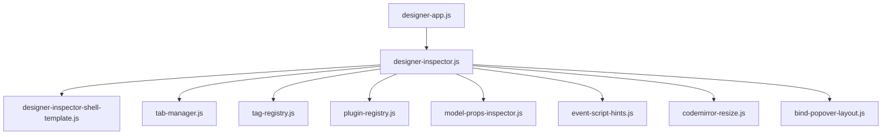
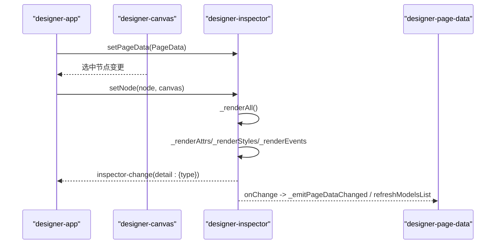
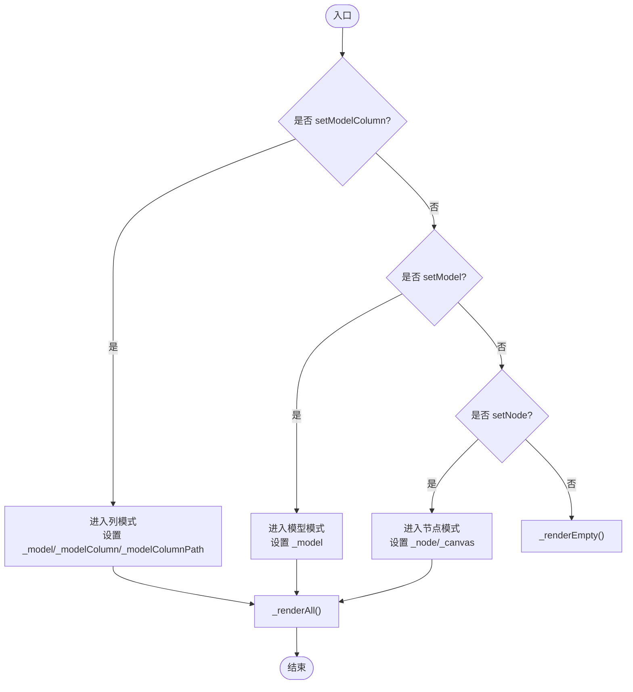
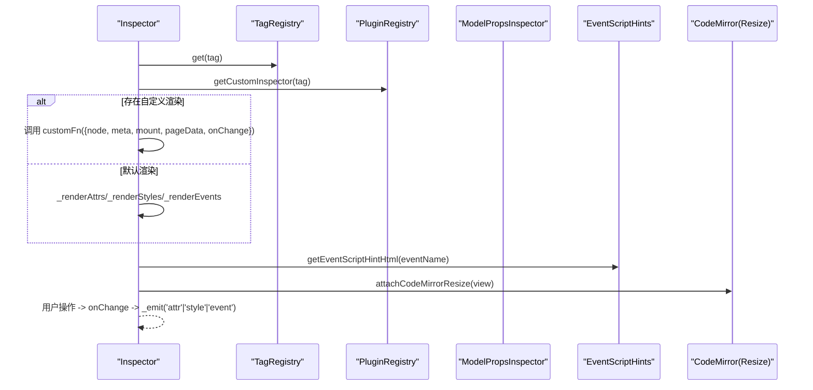
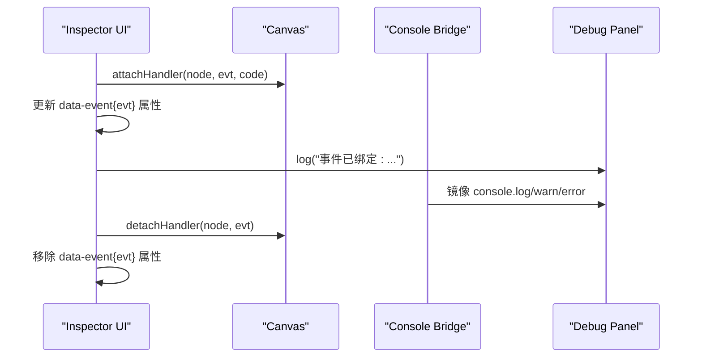
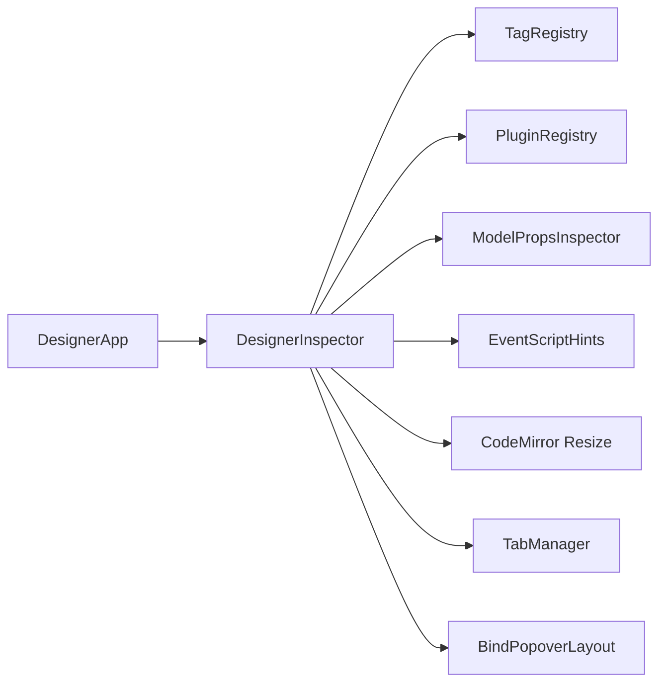

# 属性面板核心架构

<cite>
**本文引用的文件**
- [designer-inspector.js](file://CMXHTMLDesigner/src/components/designer-inspector.js)
- [designer-inspector-shell-template.js](file://CMXHTMLDesigner/src/components/designer-inspector/designer-inspector-shell-template.js)
- [model-props-inspector.js](file://CMXHTMLDesigner/src/components/designer-inspector/model-props-inspector.js)
- [designer-base-component.js](file://CMXHTMLDesigner/src/components/designer-base-component.js)
- [plugin-registry.js](file://CMXHTMLDesigner/src/lib/plugin-registry.js)
- [tag-registry.js](file://CMXHTMLDesigner/src/metadata/tag-registry.js)
- [event-script-hints.js](file://CMXHTMLDesigner/src/components/designer-inspector/event-script-hints.js)
- [codemirror-resize.js](file://CMXHTMLDesigner/src/utils/codemirror-resize.js)
- [tab-manager.js](file://CMXHTMLDesigner/src/utils/tab-manager.js)
- [bind-popover-layout.js](file://CMXHTMLDesigner/src/components/designer-inspector/bind-popover-layout.js)
- [designer-app.js](file://CMXHTMLDesigner/src/components/designer-app.js)
</cite>

## 目录
1. [简介](#简介)
2. [项目结构](#项目结构)
3. [核心组件](#核心组件)
4. [架构总览](#架构总览)
5. [详细组件分析](#详细组件分析)
6. [依赖关系分析](#依赖关系分析)
7. [性能考量](#性能考量)
8. [故障排查指南](#故障排查指南)
9. [结论](#结论)
10. [附录：扩展与集成指南](#附录：扩展与集成指南)

## 简介
本技术文档聚焦于设计器右侧“属性面板”的核心实现——DesignerInspector 组件。内容涵盖其整体架构、生命周期管理、状态管理、事件处理系统，节点绑定机制（setNode、setModel、setModelColumn）的工作原理，以及不同模式下的渲染流程。同时说明属性面板、样式面板、事件面板和调试面板的协作方式，组件间通信协议、数据同步策略与性能优化方案，并提供扩展点与自定义集成指南。

## 项目结构
DesignerInspector 位于 CMXHTMLDesigner/src/components/designer-inspector.js，采用 Web Components + Shadow DOM 封装，内部通过 TabManager 管理四个子面板：属性、样式、事件、调试。模板由 designer-inspector-shell-template.js 提供；模型属性编辑由 model-props-inspector.js 负责；事件脚本提示由 event-script-hints.js 提供；编辑器尺寸自适应由 codemirror-resize.js 管理；标签元数据由 tag-registry.js 维护；插件扩展由 plugin-registry.js 提供；Tab 切换逻辑由 tab-manager.js 提供；布局常量由 bind-popover-layout.js 提供。父容器 designer-app.js 协调各子组件并注入 pageData 引用。

图表来源
- [designer-app.js:75-192](file://CMXHTMLDesigner/src/components/designer-app.js#L75-L192)
- [designer-inspector.js:48-118](file://CMXHTMLDesigner/src/components/designer-inspector.js#L48-L118)
- [designer-inspector-shell-template.js:1-45](file://CMXHTMLDesigner/src/components/designer-inspector/designer-inspector-shell-template.js#L1-L45)
- [tab-manager.js:24-55](file://CMXHTMLDesigner/src/utils/tab-manager.js#L24-L55)
- [tag-registry.js:15-149](file://CMXHTMLDesigner/src/metadata/tag-registry.js#L15-L149)
- [plugin-registry.js:48-95](file://CMXHTMLDesigner/src/lib/plugin-registry.js#L48-L95)
- [model-props-inspector.js:14-31](file://CMXHTMLDesigner/src/components/designer-inspector/model-props-inspector.js#L14-L31)
- [event-script-hints.js:72-101](file://CMXHTMLDesigner/src/components/designer-inspector/event-script-hints.js#L72-L101)
- [codemirror-resize.js:35-59](file://CMXHTMLDesigner/src/utils/codemirror-resize.js#L35-L59)
- [bind-popover-layout.js:1-7](file://CMXHTMLDesigner/src/components/designer-inspector/bind-popover-layout.js#L1-L7)

章节来源
- [designer-inspector.js:48-118](file://CMXHTMLDesigner/src/components/designer-inspector.js#L48-L118)
- [designer-inspector-shell-template.js:1-45](file://CMXHTMLDesigner/src/components/designer-inspector/designer-inspector-shell-template.js#L1-L45)

## 核心组件
- DesignerBaseComponent：所有设计器组件基类，提供 Shadow DOM 挂载、init/cleanup 生命周期钩子，确保 connectedCallback 幂等。
- DesignerInspector：右侧属性/样式/事件/调试面板主组件，负责：
  - 生命周期：init 中初始化引用、TabManager、调试区监听。
  - 状态：_node、_canvas、_pageDataComp、_model、_modelColumn、_modelColumnPath。
  - 公开 API：setNode、clearNode、setModel、setModelColumn、log。
  - 渲染：_renderAll/_renderEmpty/_renderModelAll/_renderModelColumnAll，分别驱动属性/样式/事件/调试面板。
  - 事件：inspector-change、inspector-console-mirror-change。
- model-props-inspector：按模型类型渲染属性编辑表单，支持 CmxDataSet、CmxMasterSlave、CmxColumnModel、FlexibleCombination，以及列详情编辑。
- plugin-registry：注册自定义组件元数据与 customInspector 渲染函数，供 DesignerInspector 在属性面板优先使用。
- tag-registry：集中管理标签元数据（attrs、styles、events），提供 ensureTagRegistryLoaded 异步加载。
- event-script-hints：为事件脚本编辑器提供上下文提示。
- codemirror-resize：为 CodeMirror 编辑器提供可拖拽尺寸调整与 ResizeObserver 重算。
- tab-manager：通用 Tab 切换管理器，统一激活/失活逻辑。
- bind-popover-layout：数据绑定浮层定位常量。

章节来源
- [designer-base-component.js:12-39](file://CMXHTMLDesigner/src/components/designer-base-component.js#L12-L39)
- [designer-inspector.js:48-118](file://CMXHTMLDesigner/src/components/designer-inspector.js#L48-L118)
- [model-props-inspector.js:14-31](file://CMXHTMLDesigner/src/components/designer-inspector/model-props-inspector.js#L14-L31)
- [plugin-registry.js:48-95](file://CMXHTMLDesigner/src/lib/plugin-registry.js#L48-L95)
- [tag-registry.js:15-149](file://CMXHTMLDesigner/src/metadata/tag-registry.js#L15-L149)
- [event-script-hints.js:72-101](file://CMXHTMLDesigner/src/components/designer-inspector/event-script-hints.js#L72-L101)
- [codemirror-resize.js:35-59](file://CMXHTMLDesigner/src/utils/codemirror-resize.js#L35-L59)
- [tab-manager.js:24-55](file://CMXHTMLDesigner/src/utils/tab-manager.js#L24-L55)
- [bind-popover-layout.js:1-7](file://CMXHTMLDesigner/src/components/designer-inspector/bind-popover-layout.js#L1-L7)

## 架构总览
DesignerInspector 作为右侧面板容器，根据当前选中对象的不同，进入三种渲染模式：
- 节点模式：基于 DOM 节点渲染属性、样式、事件。
- 模型模式：基于页面级模型实例渲染属性与模型事件。
- 列模式：基于 CmxColumn 渲染列详情属性。

所有模式共享统一的顶部 badge 展示、Tab 切换、调试日志输出能力。事件面板内置 CodeMirror 编辑器，支持插入 debugger、脚本提示、绑定/移除事件。

图表来源
- [designer-app.js:75-192](file://CMXHTMLDesigner/src/components/designer-app.js#L75-L192)
- [designer-inspector.js:78-118](file://CMXHTMLDesigner/src/components/designer-inspector.js#L78-L118)
- [designer-inspector.js:182-266](file://CMXHTMLDesigner/src/components/designer-inspector.js#L182-L266)

## 详细组件分析

### DesignerInspector 组件生命周期与状态管理
- 生命周期：
  - connectedCallback：由基类创建 Shadow DOM，注入样式与模板，调用 init。
  - init：获取面板引用，初始化 TabManager，绑定调试区开关与清空按钮。
  - disconnectedCallback：调用 cleanup（基类默认空实现）。
- 状态字段：
  - _node、_canvas：节点模式上下文。
  - _pageDataComp：页面数据组件引用，用于触发脏标记与刷新列表。
  - _model、_modelColumn、_modelColumnPath：模型与列模式上下文。
- 公开方法：
  - setNode(node, canvas)：切换到节点模式，清空模型相关状态，调用 _renderAll。
  - clearNode()：清空所有上下文，调用 _renderEmpty。
  - setModel(model, pageDataComponent?)：切换到模型模式，清空节点相关状态，调用 _renderAll。
  - setModelColumn(model, column, path?, pageDataComponent?)：切换到列模式，清空节点相关状态，调用 _renderAll。
  - log(msg, level?)：向调试区追加带时间戳的行，限制最大字符数。

章节来源
- [designer-base-component.js:12-39](file://CMXHTMLDesigner/src/components/designer-base-component.js#L12-L39)
- [designer-inspector.js:48-118](file://CMXHTMLDesigner/src/components/designer-inspector.js#L48-L118)

### 节点绑定机制（setNode、setModel、setModelColumn）
- setNode：
  - 设置 _node 与 _canvas，清空模型相关状态。
  - 调用 _renderAll，进入节点模式渲染流程。
- setModel：
  - 清空节点相关状态，设置 _model 与可选 _pageDataComp。
  - 调用 _renderAll，进入模型模式渲染流程。
- setModelColumn：
  - 清空节点相关状态，设置 _model、_modelColumn、_modelColumnPath 与可选 _pageDataComp。
  - 调用 _renderAll，进入列模式渲染流程。

图表来源
- [designer-inspector.js:82-118](file://CMXHTMLDesigner/src/components/designer-inspector.js#L82-L118)
- [designer-inspector.js:182-266](file://CMXHTMLDesigner/src/components/designer-inspector.js#L182-L266)

章节来源
- [designer-inspector.js:82-118](file://CMXHTMLDesigner/src/components/designer-inspector.js#L82-L118)
- [designer-inspector.js:182-266](file://CMXHTMLDesigner/src/components/designer-inspector.js#L182-L266)

### 渲染流程与面板协作
- 节点模式：
  - 属性面板：读取 registry.get(tag) 元数据，生成属性行；支持文本内容编辑、数据绑定弹出层、UI5 slot 设置、自定义属性增删。
  - 样式面板：按 styleGroups 分组渲染，支持颜色、选择、数值输入；原始 style 文本框应用。
  - 事件面板：列出已知事件，打开编辑器编辑脚本，绑定到 canvas.attachHandler，或从 canvas.detachHandler 移除。
- 模型模式：
  - 属性面板：调用 renderModelPropsInspector，按模型类型渲染属性编辑表单，onChange 触发页面数据变更与列表刷新。
  - 样式面板：显示提示（模型无画布样式）。
  - 事件面板：渲染模型事件预设与自定义事件，编辑后写入 model.events，触发页面数据变更与列表刷新。
- 列模式：
  - 属性面板：调用 renderColumnDetailPropsInspector，渲染列详情属性编辑表单，onChange 触发页面数据变更与列表刷新。
  - 样式面板：显示提示（列无画布样式）。
  - 事件面板：显示提示（列事件通过模型或页面事件脚本组织）。

图表来源
- [designer-inspector.js:270-442](file://CMXHTMLDesigner/src/components/designer-inspector.js#L270-L442)
- [designer-inspector.js:525-597](file://CMXHTMLDesigner/src/components/designer-inspector.js#L525-L597)
- [designer-inspector.js:601-705](file://CMXHTMLDesigner/src/components/designer-inspector.js#L601-L705)
- [model-props-inspector.js:14-31](file://CMXHTMLDesigner/src/components/designer-inspector/model-props-inspector.js#L14-L31)
- [event-script-hints.js:72-101](file://CMXHTMLDesigner/src/components/designer-inspector/event-script-hints.js#L72-L101)
- [codemirror-resize.js:35-59](file://CMXHTMLDesigner/src/utils/codemirror-resize.js#L35-L59)

章节来源
- [designer-inspector.js:182-266](file://CMXHTMLDesigner/src/components/designer-inspector.js#L182-L266)
- [designer-inspector.js:270-442](file://CMXHTMLDesigner/src/components/designer-inspector.js#L270-L442)
- [designer-inspector.js:525-597](file://CMXHTMLDesigner/src/components/designer-inspector.js#L525-L597)
- [designer-inspector.js:601-705](file://CMXHTMLDesigner/src/components/designer-inspector.js#L601-L705)

### 事件处理系统与调试面板
- 事件面板：
  - 节点事件：点击事件芯片打开编辑器，绑定 data-event{evt} 到节点，并通过 canvas.attachHandler 注册运行时回调；移除时调用 canvas.detachHandler。
  - 模型事件：编辑后写入 model.events，触发页面数据变更与列表刷新。
- 调试面板：
  - 支持按级别（log/warn/error）将浏览器控制台输出镜像到调试日志区。
  - 支持清空日志，限制日志长度避免内存增长。
  - 通过 installCmxConsoleTap 在父容器中桥接控制台输出。

图表来源
- [designer-inspector.js:673-693](file://CMXHTMLDesigner/src/components/designer-inspector.js#L673-L693)
- [designer-inspector.js:139-169](file://CMXHTMLDesigner/src/components/designer-inspector.js#L139-L169)
- [designer-app.js:90-94](file://CMXHTMLDesigner/src/components/designer-app.js#L90-L94)

章节来源
- [designer-inspector.js:601-705](file://CMXHTMLDesigner/src/components/designer-inspector.js#L601-L705)
- [designer-inspector.js:139-169](file://CMXHTMLDesigner/src/components/designer-inspector.js#L139-L169)
- [designer-app.js:90-94](file://CMXHTMLDesigner/src/components/designer-app.js#L90-L94)

### 数据同步策略与组件间通信
- 组件间通信：
  - 通过 CustomEvent 派发 inspector-change，detail.type 标识变更来源（attr/style/event/model/model-event）。
  - 通过 inspector-console-mirror-change 通知上层控制台镜像开关变化。
- 数据同步：
  - 节点模式：直接修改 DOM 属性与 style，触发 inspector-change。
  - 模型/列模式：通过 onChange 回调调用 pageDataComp._emitPageDataChanged 与 refreshModelsList，保持页面数据一致。
  - 事件绑定：节点模式通过 canvas.attachHandler/detachHandler 管理运行时事件；模型模式写入 model.events。

章节来源
- [designer-inspector.js:283-287](file://CMXHTMLDesigner/src/components/designer-inspector.js#L283-L287)
- [designer-inspector.js:221-227](file://CMXHTMLDesigner/src/components/designer-inspector.js#L221-L227)
- [designer-inspector.js:255-260](file://CMXHTMLDesigner/src/components/designer-inspector.js#L255-L260)
- [designer-inspector.js:673-693](file://CMXHTMLDesigner/src/components/designer-inspector.js#L673-L693)
- [designer-inspector.js:782-793](file://CMXHTMLDesigner/src/components/designer-inspector.js#L782-L793)

### 性能优化方案
- 编辑器尺寸自适应：使用 ResizeObserver 监听 host 尺寸变化，调用 view.requestMeasure 重算布局，避免手动计算。
- 调试日志限长：限制日志区最大字符数，防止内存膨胀。
- 渲染路径优化：根据当前模式快速分支到对应渲染函数，减少不必要的 DOM 重建。
- 插件优先：若存在 customInspector，则跳过默认渲染，减少冗余构建。

章节来源
- [codemirror-resize.js:35-59](file://CMXHTMLDesigner/src/utils/codemirror-resize.js#L35-L59)
- [designer-inspector.js:124-135](file://CMXHTMLDesigner/src/components/designer-inspector.js#L124-L135)
- [designer-inspector.js:273-293](file://CMXHTMLDesigner/src/components/designer-inspector.js#L273-L293)

## 依赖关系分析
- DesignerInspector 依赖：
  - TagRegistry：提供标签元数据（attrs、styles、events）。
  - PluginRegistry：提供自定义 Inspector 渲染函数。
  - ModelPropsInspector：提供模型与列的属性编辑。
  - EventScriptHints：提供事件脚本上下文提示。
  - CodeMirror Resize：提供编辑器尺寸自适应。
  - TabManager：提供 Tab 切换逻辑。
  - BindPopoverLayout：提供数据绑定浮层布局常量。
- 父容器 DesignerApp：
  - 注入 pageData 引用。
  - 安装控制台桥接，将控制台输出镜像到调试面板。

图表来源
- [designer-inspector.js:15-39](file://CMXHTMLDesigner/src/components/designer-inspector.js#L15-L39)
- [designer-app.js:75-192](file://CMXHTMLDesigner/src/components/designer-app.js#L75-L192)

章节来源
- [designer-inspector.js:15-39](file://CMXHTMLDesigner/src/components/designer-inspector.js#L15-L39)
- [designer-app.js:75-192](file://CMXHTMLDesigner/src/components/designer-app.js#L75-L192)

## 性能考量
- 避免重复初始化：基类 connectedCallback 有幂等保护，防止重复创建 Shadow DOM。
- 懒加载元数据：TagRegistry 通过 ensureTagRegistryLoaded 异步加载标签元数据，减少初始包体。
- 编辑器资源管理：在切换模式时销毁旧 CodeMirror 实例并解绑 ResizeObserver，避免内存泄漏。
- 日志长度限制：调试日志区限制最大字符数，避免长时间运行导致内存增长。

章节来源
- [designer-base-component.js:12-39](file://CMXHTMLDesigner/src/components/designer-base-component.js#L12-L39)
- [tag-registry.js:123-149](file://CMXHTMLDesigner/src/metadata/tag-registry.js#L123-L149)
- [designer-inspector.js:201-208](file://CMXHTMLDesigner/src/components/designer-inspector.js#L201-L208)
- [designer-inspector.js:234-241](file://CMXHTMLDesigner/src/components/designer-inspector.js#L234-L241)
- [designer-inspector.js:124-135](file://CMXHTMLDesigner/src/components/designer-inspector.js#L124-L135)

## 故障排查指南
- 属性面板不显示：检查 TagRegistry 是否已加载（ensureTagRegistryLoaded），确认节点 tagName 是否在注册表中。
- 事件绑定无效：确认 canvas.attachHandler 是否正确调用，data-event{evt} 属性是否存在。
- 模型属性编辑不生效：确认 onChange 回调是否触发 pageDataComp._emitPageDataChanged 与 refreshModelsList。
- 调试日志不显示：检查控制台镜像开关配置，确认 installCmxConsoleTap 已安装。

章节来源
- [tag-registry.js:123-149](file://CMXHTMLDesigner/src/metadata/tag-registry.js#L123-L149)
- [designer-inspector.js:673-693](file://CMXHTMLDesigner/src/components/designer-inspector.js#L673-L693)
- [designer-inspector.js:221-227](file://CMXHTMLDesigner/src/components/designer-inspector.js#L221-L227)
- [designer-app.js:90-94](file://CMXHTMLDesigner/src/components/designer-app.js#L90-L94)

## 结论
DesignerInspector 以清晰的模式划分与模块化设计，实现了属性、样式、事件与调试的统一管理。通过插件机制与元数据驱动，具备高度可扩展性；借助 CodeMirror 与 ResizeObserver，提供了良好的交互体验与性能保障。配合父容器 DesignerApp 的协调，形成了稳定可靠的设计器右侧面板体系。

## 附录：扩展与集成指南
- 自定义组件 Inspector：
  - 通过 plugin-registry.definePlugin 注册 customInspectors，覆盖指定 tag 的渲染逻辑。
  - 在 DesignerInspector 中，若存在 customInspector，则优先调用，无需修改核心代码。
- 扩展标签元数据：
  - 通过 plugin-registry.definePlugin 注册新的组与组件元数据，自动加入调色板与属性面板。
- 集成页面数据：
  - 在父容器 DesignerApp 中调用 inspector.setPageData(pageData)，使属性面板能访问页面数据与服务函数。
- 事件脚本提示：
  - 使用 event-script-hints.getEventScriptHintHtml 动态生成事件上下文提示，提升开发者体验。

章节来源
- [plugin-registry.js:48-95](file://CMXHTMLDesigner/src/lib/plugin-registry.js#L48-L95)
- [designer-inspector.js:273-293](file://CMXHTMLDesigner/src/components/designer-inspector.js#L273-L293)
- [designer-app.js:190-192](file://CMXHTMLDesigner/src/components/designer-app.js#L190-L192)
- [event-script-hints.js:72-101](file://CMXHTMLDesigner/src/components/designer-inspector/event-script-hints.js#L72-L101)