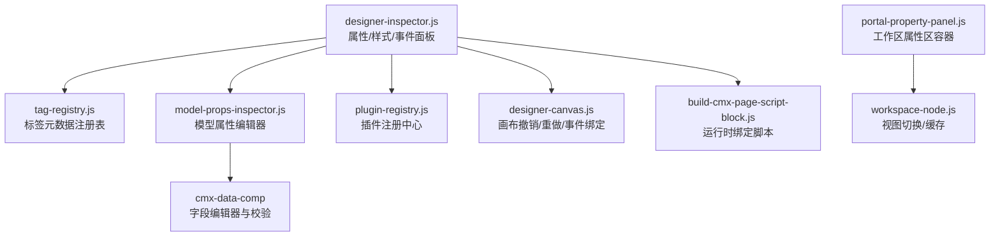
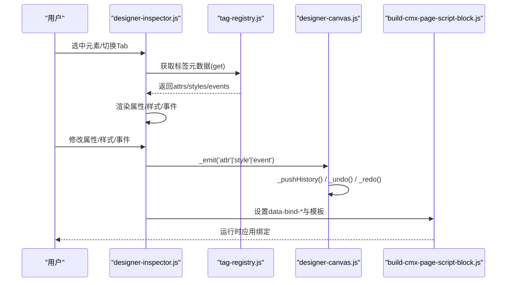
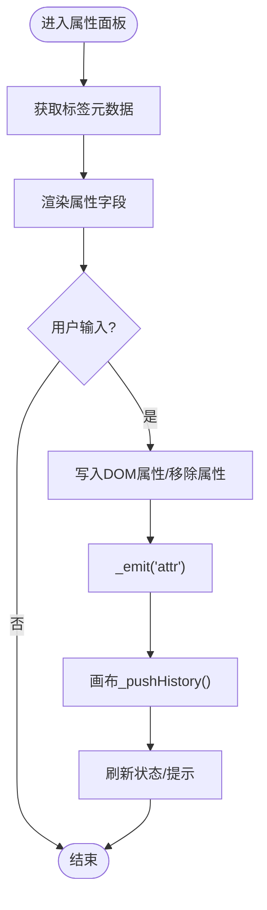
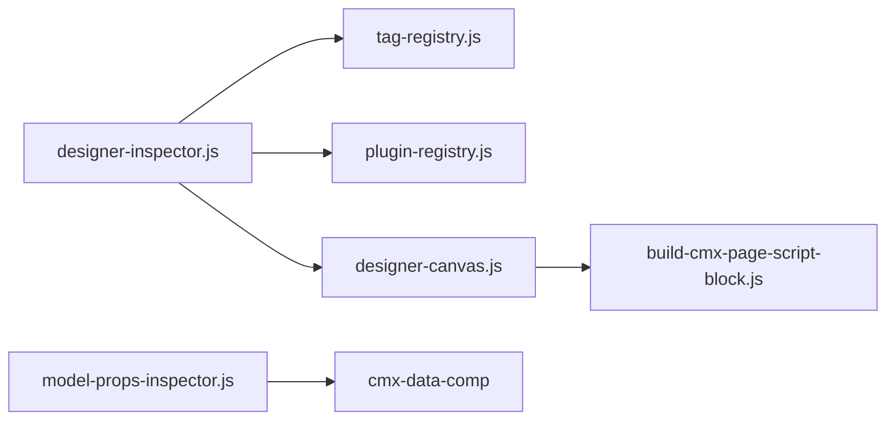

# 属性面板系统

<cite>
**本文引用的文件**
- [designer-inspector.js](file://CMXHTMLDesigner/src/components/designer-inspector.js)
- [tag-registry.js](file://CMXHTMLDesigner/src/metadata/tag-registry.js)
- [groups.js](file://CMXHTMLDesigner/src/metadata/groups.js)
- [model-props-inspector.js](file://CMXHTMLDesigner/src/components/designer-inspector/model-props-inspector.js)
- [bind-popover-layout.js](file://CMXHTMLDesigner/src/components/designer-inspector/bind-popover-layout.js)
- [plugin-registry.js](file://CMXHTMLDesigner/src/lib/plugin-registry.js)
- [designer-canvas.js](file://CMXHTMLDesigner/src/components/designer-canvas.js)
- [build-cmx-page-script-block.js](file://CMXHTMLDesigner/src/utils/build-cmx-page-script-block.js)
- [portal-property-panel.js（设计器调试）](file://CMXHTMLDesigner/src/debug-portal/portal-property-panel.js)
- [portal-property-panel.js（门户管理器）](file://CMXPortalManager/src/components/portal-property-panel.js)
- [cmx-input-editors.test.js](file://packages/cmx-data-comp/src/lib/__tests__/cmx-input-editors.test.js)
- [cmx-field-ui.test.js](file://packages/cmx-data-comp/src/lib/__tests__/cmx-field-ui.test.js)
- [revo-grid-events-mixin.js](file://packages/cmx-data-comp/src/components/revo-grid/revo-grid-events-mixin.js)
- [validation.ts](file://cmx-mega-sheet/src/core/validation.ts)
</cite>

## 目录
1. [简介](#简介)
2. [项目结构](#项目结构)
3. [核心组件](#核心组件)
4. [架构总览](#架构总览)
5. [详细组件分析](#详细组件分析)
6. [依赖关系分析](#依赖关系分析)
7. [性能考虑](#性能考虑)
8. [故障排查指南](#故障排查指南)
9. [结论](#结论)
10. [附录](#附录)

## 简介
本技术文档围绕“属性面板系统”展开，聚焦于：
- 动态生成机制：基于标签元数据与分组配置，运行时渲染属性、样式、事件编辑区。
- 表单渲染引擎：统一使用 SAP UI5 Web Components 构建字段行，支持布尔、选择、文本、数值、URL 等类型。
- 数据绑定策略：通过 data-bind-* 与运行时脚本实现 $data 变量绑定，并支持清除绑定。
- 编辑器实现：文本输入、数值选择、文件上传（由插件扩展）、代码编辑器（事件脚本）。
- 变更传播与撤销重做：属性/样式/事件变更触发 inspector-change 事件；画布维护历史栈，支持撤销/重做。
- 实时预览更新：属性变更后刷新画布或模型列表，保持所见即所得。
- 自定义编辑器扩展：通过插件注册 customInspectors 覆盖特定标签的 Inspector 渲染。
- 验证规则与国际化：字段校验（必填、正则、范围、函数式规则），多语言值归一化。
- 与设计器其他组件集成：与画布、页面数据、模型面板、工作区属性区协同。

## 项目结构
属性面板系统主要位于 CMXHTMLDesigner 与 packages/cmx-data-comp，以及 PortalManager 的工作区属性区。关键目录与职责：
- CMXHTMLDesigner/src/components/designer-inspector.js：右侧属性/样式/事件/调试面板主组件。
- CMXHTMLDesigner/src/metadata/tag-registry.js：标签元数据注册表，负责加载 common-attrs、style-groups、event-presets、tag-index。
- CMXHTMLDesigner/src/metadata/groups.js：调色板分组定义（UI5/Fiori/默认）。
- CMXHTMLDesigner/src/components/designer-inspector/model-props-inspector.js：模型属性编辑器（CmxDataSet/CmxMasterSlave/CmxColumnModel/FlexibleCombination）。
- CMXHTMLDesigner/src/lib/plugin-registry.js：插件注册中心，提供 customInspectors 钩子。
- CMXHTMLDesigner/src/components/designer-canvas.js：画布组件，维护撤销/重做历史、事件绑定、导出 HTML。
- CMXHTMLDesigner/src/utils/build-cmx-page-script-block.js：运行时绑定脚本生成，将 data-bind-* 映射到 DOM 属性。
- packages/cmx-data-comp：字段编辑器与校验逻辑（文本/数字/日期/时间、验证规则、多语言）。
- CMXPortalManager/src/components/portal-property-panel.js：工作区“属性”区域容器，承载多视图与拖放、上下文菜单。

图表来源
- [designer-inspector.js:1-120](file://CMXHTMLDesigner/src/components/designer-inspector.js#L1-L120)
- [tag-registry.js:10-149](file://CMXHTMLDesigner/src/metadata/tag-registry.js#L10-L149)
- [model-props-inspector.js:14-31](file://CMXHTMLDesigner/src/components/designer-inspector/model-props-inspector.js#L14-L31)
- [plugin-registry.js:71-94](file://CMXHTMLDesigner/src/lib/plugin-registry.js#L71-L94)
- [designer-canvas.js:225-264](file://CMXHTMLDesigner/src/components/designer-canvas.js#L225-L264)
- [build-cmx-page-script-block.js:111-144](file://CMXHTMLDesigner/src/utils/build-cmx-page-script-block.js#L111-L144)
- [portal-property-panel.js（门户管理器）:140-182](file://CMXPortalManager/src/components/portal-property-panel.js#L140-L182)

章节来源
- [designer-inspector.js:1-120](file://CMXHTMLDesigner/src/components/designer-inspector.js#L1-L120)
- [tag-registry.js:10-149](file://CMXHTMLDesigner/src/metadata/tag-registry.js#L10-L149)
- [groups.js:1-32](file://CMXHTMLDesigner/src/metadata/groups.js#L1-L32)

## 核心组件
- 属性面板主组件（designer-inspector.js）
  - 负责渲染属性、样式、事件三个 Tab，处理数据绑定按钮弹出层、插槽设置、事件脚本编辑器（CodeMirror）。
  - 派发 inspector-change 事件，通知上层刷新。
- 标签元数据注册表（tag-registry.js）
  - 异步加载 common-attrs、style-groups、event-presets、tag-index，合并为每个标签的 attrs/styles/events/defaultSetup。
  - 提供 get(tag) 获取标签元信息，供面板渲染。
- 模型属性编辑器（model-props-inspector.js）
  - 针对 CmxDataSet、CmxMasterSlave、CmxColumnModel、FlexibleCombination 提供专用编辑器。
  - 使用 cmx-data-comp 的 renderFieldPanel 与 makeFlcAdapter 进行字段级编辑与回写。
- 画布（designer-canvas.js）
  - 维护历史栈（最大步数限制），支持撤销/重做；在属性/样式/事件变更后 pushHistory。
  - 提供 attachHandler/detachHandler 管理事件绑定。
- 运行时绑定脚本（build-cmx-page-script-block.js）
  - 生成 applyBindings 函数，遍历 data-bind-* 属性并写入目标 DOM 属性或 setAttribute。
- 工作区属性区容器（portal-property-panel.js）
  - 管理 property 区域的视图切换、缓存根节点复用、拖放与上下文菜单。

章节来源
- [designer-inspector.js:171-266](file://CMXHTMLDesigner/src/components/designer-inspector.js#L171-L266)
- [tag-registry.js:115-149](file://CMXHTMLDesigner/src/metadata/tag-registry.js#L115-L149)
- [model-props-inspector.js:14-31](file://CMXHTMLDesigner/src/components/designer-inspector/model-props-inspector.js#L14-L31)
- [designer-canvas.js:225-264](file://CMXHTMLDesigner/src/components/designer-canvas.js#L225-L264)
- [build-cmx-page-script-block.js:111-144](file://CMXHTMLDesigner/src/utils/build-cmx-page-script-block.js#L111-L144)
- [portal-property-panel.js（门户管理器）:140-182](file://CMXPortalManager/src/components/portal-property-panel.js#L140-L182)

## 架构总览
属性面板系统的整体交互流程如下：
- 用户选中画布元素 → 属性面板根据 tag 元数据渲染属性/样式/事件。
- 用户修改属性/样式/事件 → 面板派发 inspector-change 事件，画布记录历史并刷新。
- 数据绑定 → 面板设置 data-bind-* 与模板表达式，运行时脚本应用绑定。
- 模型编辑 → 通过 model-props-inspector 调用 cmx-data-comp 适配器写入字段，触发 onChange。
- 插件扩展 → 通过 plugin-registry 注册 customInspectors 覆盖特定标签的 Inspector。

图表来源
- [designer-inspector.js:171-266](file://CMXHTMLDesigner/src/components/designer-inspector.js#L171-L266)
- [tag-registry.js:57-66](file://CMXHTMLDesigner/src/metadata/tag-registry.js#L57-L66)
- [designer-canvas.js:225-264](file://CMXHTMLDesigner/src/components/designer-canvas.js#L225-L264)
- [build-cmx-page-script-block.js:111-144](file://CMXHTMLDesigner/src/utils/build-cmx-page-script-block.js#L111-L144)

## 详细组件分析

### 属性面板主组件（designer-inspector.js）
- 动态生成机制
  - 根据当前选中元素的 tag，从 registry.get(tag) 获取 attrs/styles/events，动态拼接字段行。
  - 支持布尔、选择、文本、数值、URL 类型；文本内容直接编辑；UI5 元素支持 slot 设置。
- 数据绑定策略
  - 点击“绑定数据变量”弹出浮层，选择 $data.xxx 后设置 data-bind-xxx 与属性值为 {{name}}。
  - 运行时脚本会遍历 data-bind-* 并写入对应 DOM 属性或 setAttribute。
- 事件传播
  - 所有属性/样式/事件变更均通过 _emit(type) 派发 inspector-change 事件，detail.type 区分类型。
- 撤销重做
  - 属性/样式/事件变更后，画布侧 _pushHistory() 记录快照；_undo/_redo 恢复历史。
- 实时预览更新
  - 属性/样式变更后立即反映到画布；模型编辑时刷新模型列表。

图表来源
- [designer-inspector.js:270-442](file://CMXHTMLDesigner/src/components/designer-inspector.js#L270-L442)
- [designer-canvas.js:225-264](file://CMXHTMLDesigner/src/components/designer-canvas.js#L225-L264)

章节来源
- [designer-inspector.js:270-442](file://CMXHTMLDesigner/src/components/designer-inspector.js#L270-L442)
- [designer-inspector.js:523-597](file://CMXHTMLDesigner/src/components/designer-inspector.js#L523-L597)
- [designer-inspector.js:601-705](file://CMXHTMLDesigner/src/components/designer-inspector.js#L601-L705)
- [designer-canvas.js:225-264](file://CMXHTMLDesigner/src/components/designer-canvas.js#L225-L264)

### 标签元数据注册表（tag-registry.js）
- 功能要点
  - 异步加载 common-attrs、style-groups、event-presets、tag-index。
  - 合并公共属性与样式组，按 preset 计算 events，并为标签提供 defaultSetup。
  - 提供 register/registerAll/get/getByGroups 等方法。
- 扩展点
  - 插件可通过 registerGroup 增加分组；通过 components 注册新标签元数据。

章节来源
- [tag-registry.js:15-109](file://CMXHTMLDesigner/src/metadata/tag-registry.js#L15-L109)
- [tag-registry.js:120-149](file://CMXHTMLDesigner/src/metadata/tag-registry.js#L120-L149)
- [groups.js:1-32](file://CMXHTMLDesigner/src/metadata/groups.js#L1-L32)

### 模型属性编辑器（model-props-inspector.js）
- 功能要点
  - 针对四种模型类型提供专用编辑器：CmxDataSet、CmxMasterSlave、CmxColumnModel、FlexibleCombination。
  - 使用 cmx-data-comp 的 renderFieldPanel 与 makeFlcAdapter 进行字段编辑与回写。
  - 支持列详情编辑（edit.mode、formula、dimType）、枚举值增删、验证规则添加。
- 数据同步
  - onChange 回调触发页面数据变更与模型列表刷新。

章节来源
- [model-props-inspector.js:14-31](file://CMXHTMLDesigner/src/components/designer-inspector/model-props-inspector.js#L14-L31)
- [model-props-inspector.js:37-128](file://CMXHTMLDesigner/src/components/designer-inspector/model-props-inspector.js#L37-L128)
- [model-props-inspector.js:140-424](file://CMXHTMLDesigner/src/components/designer-inspector/model-props-inspector.js#L140-L424)

### 插件扩展机制（plugin-registry.js）
- 功能要点
  - 支持 groups/components/customInspectors 注册。
  - getCustomInspector(tag) 返回指定标签的自定义 Inspector 渲染函数，优先于默认渲染。
- 最佳实践
  - 自定义 Inspector 应接收 {node, meta, mount, pageData, onChange}，并在 onChange 中触发 inspector-change。

章节来源
- [plugin-registry.js:71-94](file://CMXHTMLDesigner/src/lib/plugin-registry.js#L71-L94)
- [designer-inspector.js:273-293](file://CMXHTMLDesigner/src/components/designer-inspector.js#L273-L293)

### 画布与撤销重做（designer-canvas.js）
- 功能要点
  - 维护历史栈，限制最大步数；撤销/重做时 setHtml(false) 避免重复 pushHistory。
  - 提供 hasDesignNodes、getHtml/getExportHtml 等接口。
  - 事件绑定通过 attachHandler/detachHandler 管理。
- 性能优化
  - 在撤销/重做过程中禁用 undo/redo 按钮状态更新，减少重排。

章节来源
- [designer-canvas.js:173-187](file://CMXHTMLDesigner/src/components/designer-canvas.js#L173-L187)
- [designer-canvas.js:225-264](file://CMXHTMLDesigner/src/components/designer-canvas.js#L225-L264)
- [designer-canvas.js:706-730](file://CMXHTMLDesigner/src/components/designer-canvas.js#L706-L730)

### 运行时数据绑定（build-cmx-page-script-block.js）
- 功能要点
  - 生成 applyBindings 函数，遍历 data-bind-* 属性并写入目标 DOM 属性或 setAttribute。
  - 支持多种数据类型默认值（string/number/boolean/object/array）。
- 集成方式
  - 属性面板设置 data-bind-* 与模板表达式后，运行时脚本自动应用绑定。

章节来源
- [build-cmx-page-script-block.js:111-144](file://CMXHTMLDesigner/src/utils/build-cmx-page-script-block.js#L111-L144)

### 工作区属性区容器（portal-property-panel.js）
- 功能要点
  - 管理 property 区域的视图切换、缓存根节点复用、拖放与上下文菜单。
  - 支持 activateWorkspaceRegionViewByViewId 精确切换到指定 viewId。
- 集成方式
  - 与 workspace-node.js 协作，渲染 views[] 并处理 tab 切换。

章节来源
- [portal-property-panel.js（门户管理器）:140-182](file://CMXPortalManager/src/components/portal-property-panel.js#L140-L182)
- [portal-property-panel.js（设计器调试）:80-110](file://CMXHTMLDesigner/src/debug-portal/portal-property-panel.js#L80-L110)

## 依赖关系分析
- 组件耦合
  - designer-inspector.js 依赖 tag-registry.js 获取元数据，依赖 plugin-registry.js 获取自定义 Inspector。
  - model-props-inspector.js 依赖 cmx-data-comp 进行字段编辑与回写。
  - designer-canvas.js 提供撤销/重做与事件绑定能力，被属性面板调用。
- 外部依赖
  - SAP UI5 Web Components 用于表单控件渲染。
  - CodeMirror 用于事件脚本编辑器。
- 潜在循环依赖
  - 无直接循环依赖；通过事件与回调解耦。

图表来源
- [designer-inspector.js:1-40](file://CMXHTMLDesigner/src/components/designer-inspector.js#L1-L40)
- [model-props-inspector.js:1-6](file://CMXHTMLDesigner/src/components/designer-inspector/model-props-inspector.js#L1-L6)
- [designer-canvas.js:173-187](file://CMXHTMLDesigner/src/components/designer-canvas.js#L173-L187)
- [build-cmx-page-script-block.js:111-144](file://CMXHTMLDesigner/src/utils/build-cmx-page-script-block.js#L111-L144)

章节来源
- [designer-inspector.js:1-40](file://CMXHTMLDesigner/src/components/designer-inspector.js#L1-L40)
- [model-props-inspector.js:1-6](file://CMXHTMLDesigner/src/components/designer-inspector/model-props-inspector.js#L1-L6)

## 性能考虑
- 元数据懒加载：tag-registry 异步加载 JSON，避免阻塞首屏。
- 历史栈限制：撤销/重做历史步数上限，防止内存增长。
- 渲染优化：属性/样式变更后仅局部更新，避免全量重绘。
- 插件钩子：customInspectors 可定制渲染，减少不必要的通用字段。
- 运行时绑定：applyBindings 仅在必要时执行，避免频繁 DOM 操作。

[本节为通用指导，无需具体文件引用]

## 故障排查指南
- 属性未生效
  - 检查是否设置了 data-bind-* 与模板表达式；确认运行时脚本已应用绑定。
- 撤销/重做无效
  - 确认画布未被锁定（setMutationLocked(true) 会阻止历史记录）。
- 模型编辑不刷新
  - 检查 onChange 回调是否触发；确认页面数据组件已监听 inspector-change。
- 验证失败
  - 检查字段 validate 规则（必填、正则、范围、函数式）；参考 revo-grid-events-mixin 与 validation.ts。
- 多语言显示异常
  - 确认字段 i18n 配置与 locale；参考 cmx-input-editors.test.js 的多语言测试。

章节来源
- [designer-canvas.js:183-187](file://CMXHTMLDesigner/src/components/designer-canvas.js#L183-L187)
- [revo-grid-events-mixin.js:309-335](file://packages/cmx-data-comp/src/components/revo-grid/revo-grid-events-mixin.js#L309-L335)
- [validation.ts:60-87](file://cmx-mega-sheet/src/core/validation.ts#L60-L87)
- [cmx-input-editors.test.js:49-56](file://packages/cmx-data-comp/src/lib/__tests__/cmx-input-editors.test.js#L49-L56)

## 结论
属性面板系统通过元数据驱动与插件扩展，实现了高度可配置的动态生成与编辑体验。结合画布的撤销/重做与运行时绑定脚本，提供了完整的所见即所得设计能力。建议在实际使用中：
- 充分利用插件机制扩展自定义属性编辑器。
- 合理配置验证规则与多语言支持。
- 关注性能优化，避免过度渲染与频繁 DOM 操作。
- 与设计器其他组件紧密集成，确保数据同步与实时预览。

[本节为总结性内容，无需具体文件引用]

## 附录
- 自定义属性编辑器开发指南
  - 通过 plugin-registry 注册 customInspectors，实现 {node, meta, mount, pageData, onChange} 接口。
  - 在 onChange 中触发 inspector-change，确保属性变更传播。
- 验证规则配置
  - 支持必填、正则、范围、函数式规则；数组规则逐条求值，首条失败返回 message。
- 国际化支持
  - 字段值支持多语言对象；编辑器根据 locale 归一化显示与输入。
- 最佳实践
  - 使用 renderFieldPanel 与 makeFlcAdapter 进行字段编辑，确保一致性。
  - 利用 tag-registry 的 style-groups 与 event-presets 标准化样式与事件。

[本节为补充说明，无需具体文件引用]