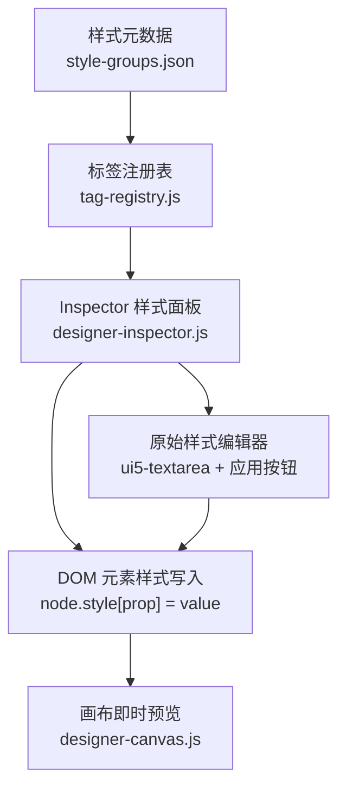
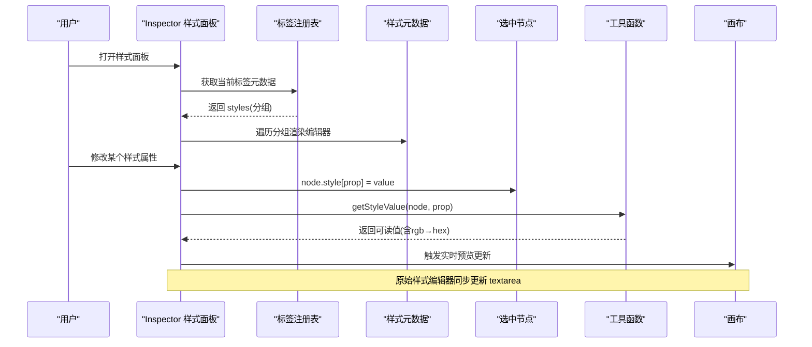
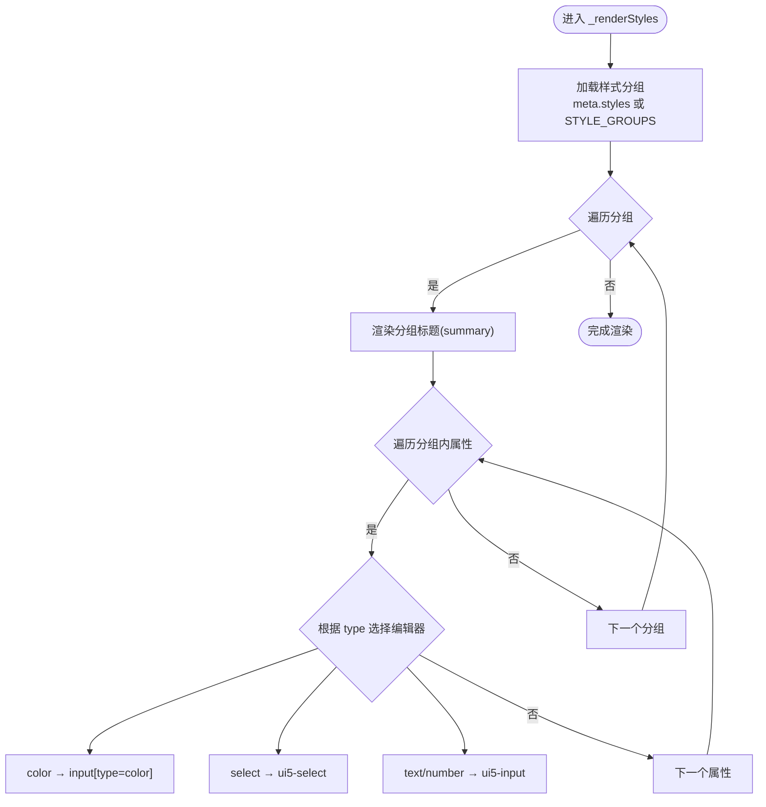
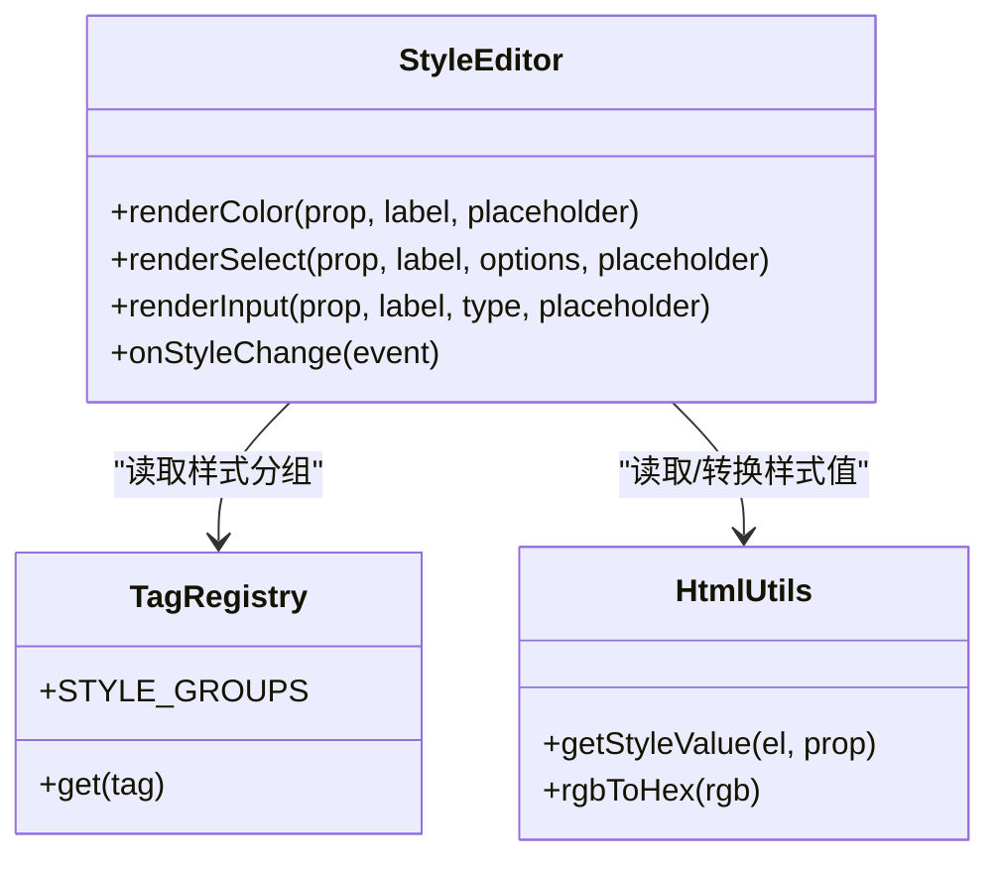
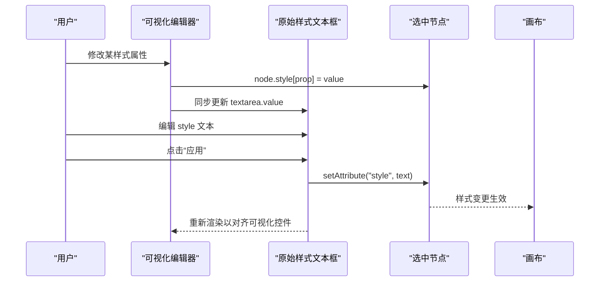
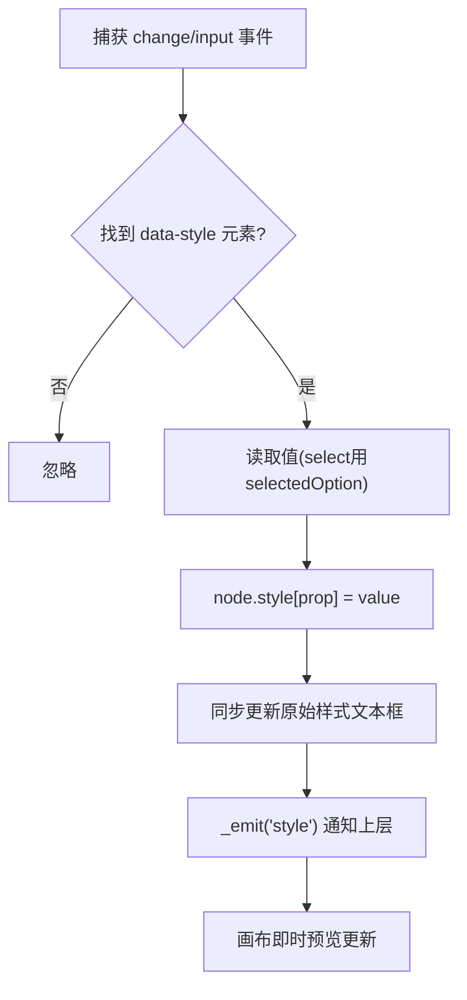
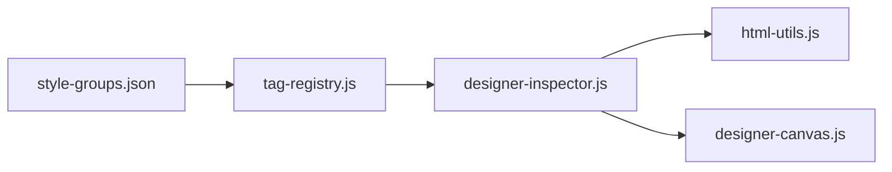

# 样式编辑面板

<cite>
**本文引用的文件**
- [designer-inspector.js](file://CMXHTMLDesigner/src/components/designer-inspector.js)
- [style-groups.json](file://CMXHTMLDesigner/src/metadata/style-groups.json)
- [tag-registry.js](file://CMXHTMLDesigner/src/metadata/tag-registry.js)
- [html-utils.js](file://CMXHTMLDesigner/src/utils/html-utils.js)
- [designer-canvas.js](file://CMXHTMLDesigner/src/components/designer-canvas.js)
- [model-props-inspector.js](file://CMXHTMLDesigner/src/components/designer-inspector/model-props-inspector.js)
</cite>

## 目录
1. [简介](#简介)
2. [项目结构](#项目结构)
3. [核心组件](#核心组件)
4. [架构总览](#架构总览)
5. [详细组件分析](#详细组件分析)
6. [依赖关系分析](#依赖关系分析)
7. [性能考虑](#性能考虑)
8. [故障排查指南](#故障排查指南)
9. [结论](#结论)
10. [附录](#附录)

## 简介
本技术文档围绕“样式编辑面板”展开，系统性说明样式属性的动态生成机制（分组、属性类型识别、编辑器选择）、颜色选择器/数值输入/下拉选择等编辑器的实现原理，以及原始样式编辑器的双向绑定、样式应用与实时预览更新流程。同时覆盖样式变更事件处理、CSS 语法验证与兼容性检查策略，并给出最佳实践与性能优化建议。

## 项目结构
样式编辑能力由“元数据驱动 + 运行时渲染”构成：
- 样式分组与属性定义位于 JSON 元数据中，按布局、弹性盒、文字、盒模型、定位等维度组织。
- 标签注册表在启动时加载元数据，为每个标签聚合可用的样式组与默认事件。
- 右侧 Inspector 根据当前选中节点及其标签元数据，动态渲染样式分组与具体属性编辑器。
- 编辑器通过事件监听将值写回 DOM style 或 style 文本框，触发画布即时更新。

**图表来源**
- [style-groups.json:1-407](file://CMXHTMLDesigner/src/metadata/style-groups.json#L1-L407)
- [tag-registry.js:115-145](file://CMXHTMLDesigner/src/metadata/tag-registry.js#L115-L145)
- [designer-inspector.js:525-597](file://CMXHTMLDesigner/src/components/designer-inspector.js#L525-L597)
- [designer-canvas.js:172-175](file://CMXHTMLDesigner/src/components/designer-canvas.js#L172-L175)

**章节来源**
- [style-groups.json:1-407](file://CMXHTMLDesigner/src/metadata/style-groups.json#L1-L407)
- [tag-registry.js:115-145](file://CMXHTMLDesigner/src/metadata/tag-registry.js#L115-L145)
- [designer-inspector.js:525-597](file://CMXHTMLDesigner/src/components/designer-inspector.js#L525-L597)
- [designer-canvas.js:172-175](file://CMXHTMLDesigner/src/components/designer-canvas.js#L172-L175)

## 核心组件
- 样式元数据：以 JSON 数组形式描述样式分组与属性，包含 prop、label、type、options、placeholder 等字段。
- 标签注册表：负责加载并缓存样式分组，供各标签按需使用；提供 STYLE_GROUPS 全局访问。
- Inspector 样式面板：读取当前节点的标签元数据，渲染分组折叠区与属性行；支持颜色、下拉、文本/数字输入。
- 原始样式编辑器：提供 ui5-textarea 直接编辑 style 字符串，并提供“应用”按钮将文本写入 style 属性。
- 工具函数：getStyleValue 用于从 DOM 读取当前样式值，并将 rgb() 转换为 #rrggbb 以便 color 输入显示。

**章节来源**
- [style-groups.json:1-407](file://CMXHTMLDesigner/src/metadata/style-groups.json#L1-L407)
- [tag-registry.js:115-145](file://CMXHTMLDesigner/src/metadata/tag-registry.js#L115-L145)
- [designer-inspector.js:525-597](file://CMXHTMLDesigner/src/components/designer-inspector.js#L525-L597)
- [html-utils.js:379-392](file://CMXHTMLDesigner/src/utils/html-utils.js#L379-L392)

## 架构总览
样式编辑面板采用“声明式元数据 + 事件驱动渲染”的架构：
- 元数据层：style-groups.json 定义所有可编辑样式及 UI 行为。
- 注册层：tag-registry.js 在初始化时拉取元数据并暴露给 UI。
- 表现层：designer-inspector.js 根据当前节点标签元数据渲染样式分组与编辑器。
- 交互层：编辑器通过 change/input 事件将值写回 node.style 或 style 文本框，触发实时预览。
- 持久化层：设计区序列化与导出时保留 style 属性，保证修改结果可被保存与运行。

**图表来源**
- [designer-inspector.js:525-597](file://CMXHTMLDesigner/src/components/designer-inspector.js#L525-L597)
- [tag-registry.js:115-145](file://CMXHTMLDesigner/src/metadata/tag-registry.js#L115-L145)
- [html-utils.js:379-392](file://CMXHTMLDesigner/src/utils/html-utils.js#L379-L392)
- [designer-canvas.js:172-175](file://CMXHTMLDesigner/src/components/designer-canvas.js#L172-L175)

## 详细组件分析

### 样式分组与属性动态生成
- 分组来源：STYLE_GROUPS 来自 tag-registry 加载的 style-groups.json。
- 渲染逻辑：_renderStyles 遍历 meta.styles 或 STYLE_GROUPS，为每个分组生成 details/summary 折叠区块，并在内部渲染属性行。
- 属性行：_styleRow 依据 meta.type 决定编辑器类型：
  - color → 原生 input[type=color]
  - select → ui5-select + 选项列表
  - number/text → ui5-input(type=Number/Text)
- 初始值：getStyleValue 从 node.style[prop] 读取，若为 rgb() 则转为十六进制色值，确保颜色选择器正确显示。

**图表来源**
- [designer-inspector.js:525-597](file://CMXHTMLDesigner/src/components/designer-inspector.js#L525-L597)
- [style-groups.json:1-407](file://CMXHTMLDesigner/src/metadata/style-groups.json#L1-L407)
- [html-utils.js:379-392](file://CMXHTMLDesigner/src/utils/html-utils.js#L379-L392)

**章节来源**
- [designer-inspector.js:525-597](file://CMXHTMLDesigner/src/components/designer-inspector.js#L525-L597)
- [style-groups.json:1-407](file://CMXHTMLDesigner/src/metadata/style-groups.json#L1-L407)
- [html-utils.js:379-392](file://CMXHTMLDesigner/src/utils/html-utils.js#L379-L392)

### 颜色选择器、数值输入、下拉选择实现
- 颜色选择器：
  - 渲染：input[type=color]，value 通过 getStyleValue 读取并转换 rgb→hex。
  - 更新：change 事件将值写入 node.style[prop]，并同步更新原始样式文本框。
- 数值输入：
  - 渲染：ui5-input type=Number，placeholder 提示单位或范围。
  - 更新：input/change 事件写入 node.style[prop]，保持实时预览。
- 下拉选择：
  - 渲染：ui5-select，选项来自 meta.options。
  - 更新：change 事件写入 node.style[prop]，空值移除属性。

**图表来源**
- [designer-inspector.js:574-597](file://CMXHTMLDesigner/src/components/designer-inspector.js#L574-L597)
- [tag-registry.js:115-145](file://CMXHTMLDesigner/src/metadata/tag-registry.js#L115-L145)
- [html-utils.js:379-392](file://CMXHTMLDesigner/src/utils/html-utils.js#L379-L392)

**章节来源**
- [designer-inspector.js:574-597](file://CMXHTMLDesigner/src/components/designer-inspector.js#L574-L597)
- [html-utils.js:379-392](file://CMXHTMLDesigner/src/utils/html-utils.js#L379-L392)

### 原始样式编辑器的双向绑定与应用机制
- 双向绑定：
  - 当通过可视化编辑器修改样式时，同步更新 ui5-textarea 的值，使其与当前 style 属性保持一致。
  - 当用户在 ui5-textarea 中编辑后点击“应用”，将文本内容写入 node.setAttribute('style', ...)，并重新渲染样式面板以刷新可视化控件状态。
- 应用机制：
  - 应用按钮点击后，调用 node.setAttribute('style', trimmedValue)，随后触发 _emit('style') 通知上层进行后续处理（如保存、刷新）。
  - 该过程会立即反映到画布预览中，因为 DOM 已更新。

**图表来源**
- [designer-inspector.js:550-571](file://CMXHTMLDesigner/src/components/designer-inspector.js#L550-L571)

**章节来源**
- [designer-inspector.js:550-571](file://CMXHTMLDesigner/src/components/designer-inspector.js#L550-L571)

### 样式变更的事件处理与实时预览
- 事件绑定：
  - 样式面板统一监听 change 与 input 事件，捕获目标元素上的 data-style 属性，确定要更新的 CSS 属性名。
  - 对 ui5-select 使用 selectedOption?.value，其他控件使用 value。
- 实时预览：
  - 写入 node.style[prop] 后立即生效，无需额外刷新。
  - 同步更新原始样式文本框，保持视图一致性。
  - 通过 _emit('style') 向父级组件派发变更事件，便于保存或联动其他面板。

**图表来源**
- [designer-inspector.js:550-571](file://CMXHTMLDesigner/src/components/designer-inspector.js#L550-L571)

**章节来源**
- [designer-inspector.js:550-571](file://CMXHTMLDesigner/src/components/designer-inspector.js#L550-L571)

### 样式分组与标签元数据的协作
- 标签元数据中的 styleGroups 字段可限制该标签可用的样式分组；未指定时使用全局 STYLE_GROUPS。
- 注册表在 ensureTagRegistryLoaded 完成后，STYLE_GROUPS 即全局可用，Inspector 据此渲染通用样式编辑项。
- 对于特定标签，可通过元数据扩展 extraEvents 或 defaults.style，但样式编辑仍以分组为单位。

**章节来源**
- [tag-registry.js:96-109](file://CMXHTMLDesigner/src/metadata/tag-registry.js#L96-L109)
- [tag-registry.js:115-145](file://CMXHTMLDesigner/src/metadata/tag-registry.js#L115-L145)

### 模型与列属性编辑器的补充说明
- 虽然不属于样式编辑范畴，但 model-props-inspector 展示了 Inspector 的统一模式：根据模型类型渲染不同属性面板，并通过 onChange 回调通知页面数据组件刷新。
- 该模式与样式编辑一致：声明式配置 + 事件驱动更新 + 实时反馈。

**章节来源**
- [model-props-inspector.js:14-31](file://CMXHTMLDesigner/src/components/designer-inspector/model-props-inspector.js#L14-L31)

## 依赖关系分析
- 样式元数据 → 标签注册表：JSON 元数据在启动时被拉取并缓存，供运行时查询。
- 标签注册表 → Inspector：Inspector 通过 registry.get(tag) 获取当前标签的样式分组与事件预设。
- Inspector → 工具函数：读取样式值并进行 rgb→hex 转换，确保颜色选择器正确显示。
- Inspector → 画布：样式变更通过 DOM 操作即时影响画布预览；序列化/导出时保留 style 属性。

**图表来源**
- [style-groups.json:1-407](file://CMXHTMLDesigner/src/metadata/style-groups.json#L1-L407)
- [tag-registry.js:115-145](file://CMXHTMLDesigner/src/metadata/tag-registry.js#L115-L145)
- [designer-inspector.js:525-597](file://CMXHTMLDesigner/src/components/designer-inspector.js#L525-L597)
- [html-utils.js:379-392](file://CMXHTMLDesigner/src/utils/html-utils.js#L379-L392)
- [designer-canvas.js:172-175](file://CMXHTMLDesigner/src/components/designer-canvas.js#L172-L175)

**章节来源**
- [tag-registry.js:115-145](file://CMXHTMLDesigner/src/metadata/tag-registry.js#L115-L145)
- [designer-inspector.js:525-597](file://CMXHTMLDesigner/src/components/designer-inspector.js#L525-L597)

## 性能考虑
- 避免频繁重排：样式变更直接写入 node.style，浏览器会合并多次写入；建议在批量修改时使用临时对象或一次性设置多个属性。
- 减少 DOM 操作：原始样式文本框仅在必要时更新（每次属性变更后），避免重复 innerHTML 导致的重绘。
- 延迟渲染：对于大量样式属性，可考虑防抖输入事件，降低高频 input 带来的开销。
- 元数据缓存：STYLE_GROUPS 在注册表中缓存，避免重复解析与网络请求。
- 颜色转换优化：getStyleValue 仅在需要显示颜色选择器时执行 rgb→hex 转换，减少不必要计算。

[本节为通用性能建议，不直接分析具体文件]

## 故障排查指南
- 颜色选择器显示异常：
  - 现象：颜色选择器值为空或显示不正确。
  - 原因：node.style[prop] 可能为空或为 rgb() 格式。
  - 解决：确认 getStyleValue 能正确读取并转换；检查属性名是否大小写正确。
- 下拉选择无效：
  - 现象：选择后样式未生效。
  - 原因：data-style 属性未正确绑定或值未写入。
  - 解决：检查事件监听是否捕获到 change 事件，确认 node.style[prop] 赋值成功。
- 原始样式应用失败：
  - 现象：点击“应用”后无变化。
  - 原因：style 文本为空或包含非法 CSS。
  - 解决：检查 trim 后的值是否为空；浏览器控制台查看是否有 CSS 解析错误。
- 实时预览不更新：
  - 现象：修改样式后画布未刷新。
  - 原因：事件未触发或未写入 DOM。
  - 解决：确认 onStyleChange 已绑定，且目标元素存在 data-style 属性。

**章节来源**
- [designer-inspector.js:550-571](file://CMXHTMLDesigner/src/components/designer-inspector.js#L550-L571)
- [html-utils.js:379-392](file://CMXHTMLDesigner/src/utils/html-utils.js#L379-L392)

## 结论
样式编辑面板通过声明式元数据驱动，实现了灵活的样式分组与属性编辑器选择。颜色选择器、数值输入、下拉选择等编辑器均基于事件驱动，将值写回 DOM 以实现实时预览。原始样式编辑器提供了更直接的 CSS 文本编辑能力，并与可视化编辑器保持双向同步。整体架构清晰、可扩展性强，适合在企业级设计器中复用与扩展。

[本节为总结性内容，不直接分析具体文件]

## 附录
- 最佳实践
  - 优先使用分组化的样式属性，避免在原始样式文本中散落难以维护的 CSS。
  - 对复杂样式（如 transform、box-shadow）建议使用文本输入并配合占位符提示。
  - 在批量修改样式时，尽量合并写入以减少重排。
- 兼容性检查
  - 对于较新的 CSS 属性，可在元数据中添加注释或提示，提醒使用者注意浏览器兼容性。
  - 在导出页面时，可利用 html-utils 的序列化能力保留 style 属性，确保运行时效果一致。
- 调试技巧
  - 使用 Inspector 的日志功能记录样式变更，便于追踪问题。
  - 在事件脚本中插入 debugger，结合浏览器 DevTools 逐步排查样式生效路径。

[本节为通用指导，不直接分析具体文件]