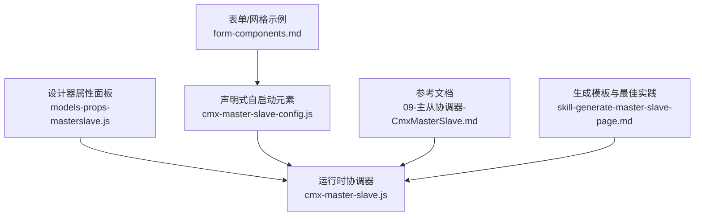
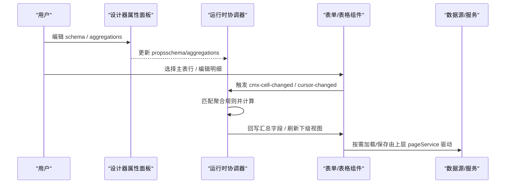
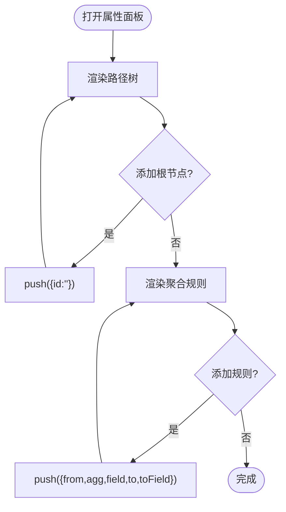
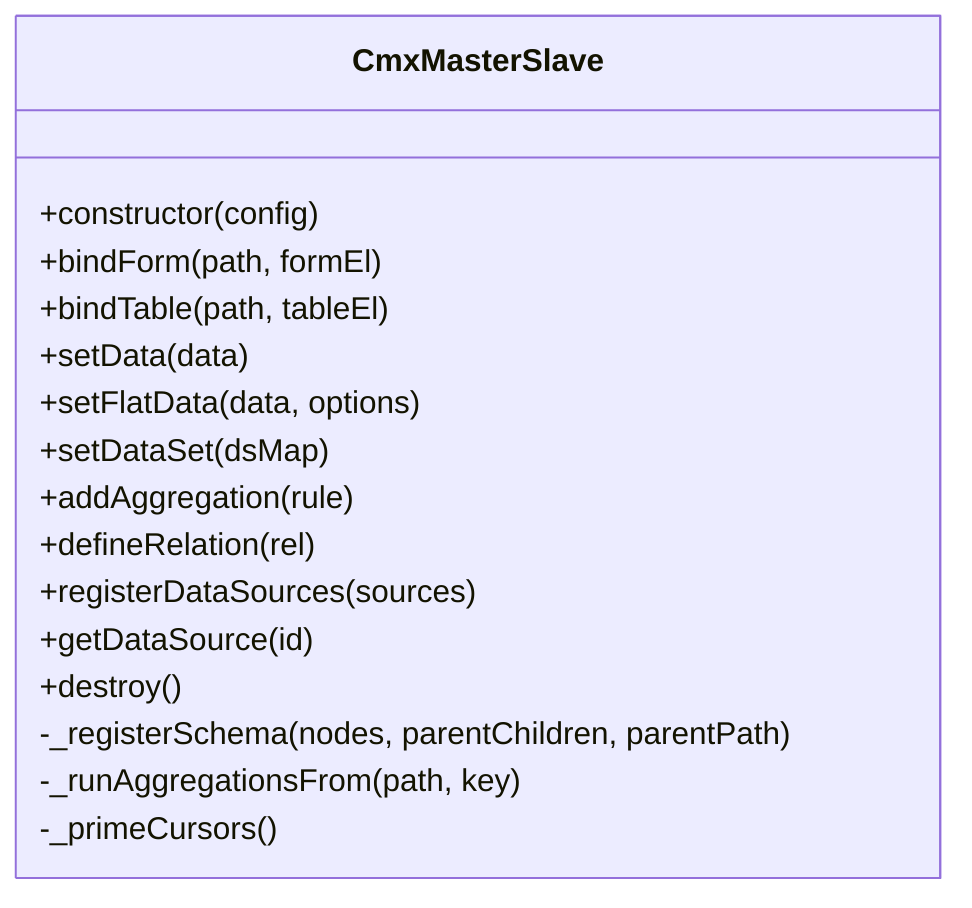
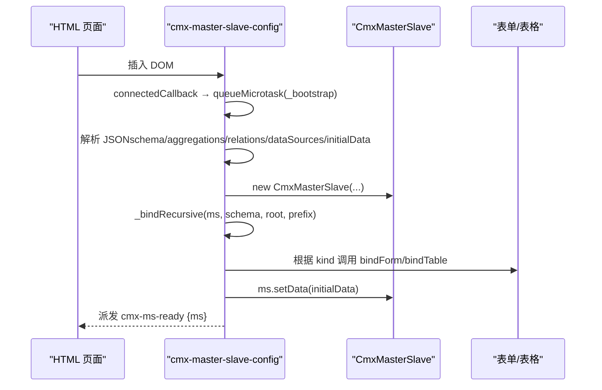
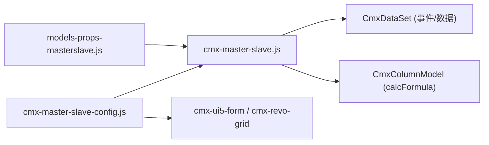

# 主从协调器属性编辑

<cite>
**本文引用的文件**
- [cmx-master-slave.js](file://packages/cmx-data-comp/src/lib/cmx-master-slave.js)
- [cmx-master-slave-config.js](file://packages/cmx-data-comp/src/components/cmx-master-slave-config.js)
- [models-props-masterslave.js](file://CMXHTMLDesigner/src/components/designer-page-data/models-props-masterslave.js)
- [09-主从协调器-CmxMasterSlave.md](file://docs/CMXPortalManager+CMXHTMLDesigner-模型体系文档/09-主从协调器-CmxMasterSlave.md)
- [form-components.md](file://.agents/skills/cmx-components-guide/references/form-components.md)
- [model-master-slave.md](file://.agents/skills/html-page-generator/references/model-master-slave.md)
- [skill-generate-master-slave-page.md](file://packages/cmx-data-comp/docs/skill-generate-master-slave-page.md)
</cite>

## 目录
1. [简介](#简介)
2. [项目结构](#项目结构)
3. [核心组件](#核心组件)
4. [架构总览](#架构总览)
5. [详细组件分析](#详细组件分析)
6. [依赖关系分析](#依赖关系分析)
7. [性能与分页](#性能与分页)
8. [故障排查](#故障排查)
9. [结论](#结论)
10. [附录：配置速查](#附录：配置速查)

## 简介
本技术文档围绕“主从协调器（CmxMasterSlave）属性编辑器”展开，聚焦以下目标：
- 解释主从关系的配置机制、自动加载能力与数据源设置。
- 说明列表模式与详情模式的差异，涵盖分页、过滤与深度控制。
- 阐述元数据模型的绑定方式、模块编码与字典编码的配置。
- 覆盖二进制数据传输、接口地址覆盖与保存接口的自定义配置。
- 给出主从数据同步的最佳实践与常见问题解决方案。

## 项目结构
与主从协调器属性编辑器直接相关的代码与文档分布如下：
- 设计器属性面板：负责在 CMXHTMLDesigner 中可视化编辑 schema 路径树与聚合规则。
- 运行时协调器：实现主从数据树、视图绑定、事件联动与聚合计算。
- 声明式自启动元素：通过 HTML 中的 JSON 配置完成自动初始化、视图绑定与初始数据注入。
- 参考文档：对 CmxMasterSlave 的职责、字段、事件、流程进行系统化说明。

**图表来源**
- [models-props-masterslave.js:1-132](file://CMXHTMLDesigner/src/components/designer-page-data/models-props-masterslave.js#L1-L132)
- [cmx-master-slave.js:1-200](file://packages/cmx-data-comp/src/lib/cmx-master-slave.js#L1-L200)
- [cmx-master-slave-config.js:1-126](file://packages/cmx-data-comp/src/components/cmx-master-slave-config.js#L1-L126)
- [09-主从协调器-CmxMasterSlave.md:1-318](file://docs/CMXPortalManager+CMXHTMLDesigner-模型体系文档/09-主从协调器-CmxMasterSlave.md#L1-L318)
- [form-components.md:218-273](file://.agents/skills/cmx-components-guide/references/form-components.md#L218-L273)
- [skill-generate-master-slave-page.md:132-204](file://packages/cmx-data-comp/docs/skill-generate-master-slave-page.md#L132-L204)

**章节来源**
- [models-props-masterslave.js:1-132](file://CMXHTMLDesigner/src/components/designer-page-data/models-props-masterslave.js#L1-L132)
- [cmx-master-slave.js:1-200](file://packages/cmx-data-comp/src/lib/cmx-master-slave.js#L1-L200)
- [cmx-master-slave-config.js:1-126](file://packages/cmx-data-comp/src/components/cmx-master-slave-config.js#L1-L126)
- [09-主从协调器-CmxMasterSlave.md:1-318](file://docs/CMXPortalManager+CMXHTMLDesigner-模型体系文档/09-主从协调器-CmxMasterSlave.md#L1-L318)

## 核心组件
- 设计器属性面板：提供“路径树（Schema）”和“聚合规则”的可视化编辑，支持添加根节点、子节点、删除节点以及新增聚合规则行。
- 运行时协调器：维护递归主从数据树、注册视图绑定、管理当前选中行、监听单元格/行变更并执行聚合回写。
- 声明式自启动元素：解析 JSON 配置，创建协调器实例，按 selector 自动绑定表单/表格，注入初始数据，并派发就绪事件。

关键职责与行为要点：
- Schema 路径树：每个节点代表一张表，使用点分隔的完整路径（如 head.items.taxes）。
- 聚合规则：定义 from → agg(field) → to(toField)，支持 sum/avg/min/max/count。
- 视图绑定：bindForm 用于单条记录（详情模式），bindTable 用于列表（列表模式）。
- 数据装载：setData（树形）、setFlatData（平铺 + relations）、setDataSet（CmxDataSet 映射）。
- 事件：change/select/aggregate 等，供业务侧监听。

**章节来源**
- [models-props-masterslave.js:1-132](file://CMXHTMLDesigner/src/components/designer-page-data/models-props-masterslave.js#L1-L132)
- [cmx-master-slave.js:1-200](file://packages/cmx-data-comp/src/lib/cmx-master-slave.js#L1-L200)
- [cmx-master-slave-config.js:1-126](file://packages/cmx-data-comp/src/components/cmx-master-slave-config.js#L1-L126)
- [09-主从协调器-CmxMasterSlave.md:1-318](file://docs/CMXPortalManager+CMXHTMLDesigner-模型体系文档/09-主从协调器-CmxMasterSlave.md#L1-L318)

## 架构总览
下图展示了属性编辑器、运行时协调器与页面组件之间的交互关系。

**图表来源**
- [cmx-master-slave.js:1-200](file://packages/cmx-data-comp/src/lib/cmx-master-slave.js#L1-L200)
- [09-主从协调器-CmxMasterSlave.md:182-204](file://docs/CMXPortalManager+CMXHTMLDesigner-模型体系文档/09-主从协调器-CmxMasterSlave.md#L182-L204)

## 详细组件分析

### 设计器属性面板：路径树与聚合规则
- 路径树（Schema）：
  - 每行一个节点，支持缩进表示层级；可添加根节点、子节点、删除节点。
  - 节点包含 id 与 children，最终被转换为协调器的 schema 路径树。
- 聚合规则：
  - 每条规则包含 from、agg、field、to、toField 五个字段。
  - 支持 sum/avg/min/max/count 五种聚合类型。
  - 新增/修改/删除均触发 onChange 以持久化到模型。

**图表来源**
- [models-props-masterslave.js:25-61](file://CMXHTMLDesigner/src/components/designer-page-data/models-props-masterslave.js#L25-L61)
- [models-props-masterslave.js:63-117](file://CMXHTMLDesigner/src/components/designer-page-data/models-props-masterslave.js#L63-L117)

**章节来源**
- [models-props-masterslave.js:1-132](file://CMXHTMLDesigner/src/components/designer-page-data/models-props-masterslave.js#L1-L132)

### 运行时协调器：主从关系与聚合
- 数据结构：
  - 持有递归主从数据树，每个 row 可挂 _children: { tableId: CmxDataSet }。
  - 维护 path → ViewBinding、path → currentId、aggregation rules 索引。
- 视图绑定：
  - bindForm(path, formEl)：详情模式（single）。
  - bindTable(path, tableEl)：列表模式（list），并监听 cmx-row-added/removed。
- 数据入口：
  - setData(data)：树形数据，内部归一化后预热聚合、渲染、定位游标。
  - setFlatData(...)：平铺数据 + relations，自动构建关联。
  - setDataSet(dsMap)：以 CmxDataSet 映射装载，统一事件注册。
- 聚合规则：
  - addAggregation(rule)：校验必填字段，建立 from→rules 的反向索引。
  - 触发时机：setData 后整体重算；cell 变更、行增删命中 from 前缀的规则。

**图表来源**
- [cmx-master-slave.js:41-85](file://packages/cmx-data-comp/src/lib/cmx-master-slave.js#L41-L85)
- [cmx-master-slave.js:117-139](file://packages/cmx-data-comp/src/lib/cmx-master-slave.js#L117-L139)
- [cmx-master-slave.js:206-224](file://packages/cmx-data-comp/src/lib/cmx-master-slave.js#L206-L224)
- [cmx-master-slave.js:281-335](file://packages/cmx-data-comp/src/lib/cmx-master-slave.js#L281-L335)

**章节来源**
- [cmx-master-slave.js:1-200](file://packages/cmx-data-comp/src/lib/cmx-master-slave.js#L1-L200)
- [cmx-master-slave.js:200-400](file://packages/cmx-data-comp/src/lib/cmx-master-slave.js#L200-L400)

### 声明式自启动元素：自动加载与绑定
- 功能：
  - 解析 textContent 中的 JSON 配置，创建 CmxMasterSlave 实例。
  - 按 schema 节点的 selector 在指定 scope（默认 document）内查找组件并绑定。
  - kind=single 走 bindForm，其他走 bindTable。
  - 注入 initialData（树形），派发 cmx-ms-ready 事件。
- 作用：
  - 将“配置即运行”的理念落地，减少样板代码。
  - 便于在设计器中生成可直接运行的页面片段。

**图表来源**
- [cmx-master-slave-config.js:28-96](file://packages/cmx-data-comp/src/components/cmx-master-slave-config.js#L28-L96)
- [cmx-master-slave-config.js:98-122](file://packages/cmx-data-comp/src/components/cmx-master-slave-config.js#L98-L122)

**章节来源**
- [cmx-master-slave-config.js:1-126](file://packages/cmx-data-comp/src/components/cmx-master-slave-config.js#L1-L126)

### 列表模式与详情模式：区别与用法
- 详情模式（kind=single）：
  - 使用 bindForm 绑定到单条记录的表单组件。
  - 适合头表、主记录编辑场景。
- 列表模式（kind=list）：
  - 使用 bindTable 绑定到表格组件，支持多选/单选、分页、过滤等。
  - 适合明细、子表、孙表等多行展示与编辑。
- 典型组合：
  - 主表单（详情）+ 明细表格（列表）+ 可选孙表（列表）。
  - 通过 schema 路径树组织父子关系，配合 relations 或 _children 维护关联。

**章节来源**
- [cmx-master-slave-config.js:105-122](file://packages/cmx-data-comp/src/components/cmx-master-slave-config.js#L105-L122)
- [form-components.md:218-273](file://.agents/skills/cmx-components-guide/references/form-components.md#L218-L273)

### 元数据模型绑定：模块编码与字典编码
- 列模型绑定：
  - 通过 setColumnModel(model) 将 CmxColumnModel 与 schema 路径关联。
  - 在 row-changed 时依据 model 执行 calcFormula 与依赖字段联动。
- 元数据形态：
  - DOC（单据）：metaModelId + metaTable 指向表名，取表方法为 getTable。
  - DCT（字典）：metaModelId + metaTable 指向字典编码，取表方法为 getDictionary。
  - FLC（弹性组合）：通过 scenario 坐标动态出列。
- 数据源（dataSources）：
  - 注册后可被 form/grid 通过 _setDataSourceProvider 解析 ref/ref-display。
  - 支持 helper（如 combo-search）、search、loadByKeys 等扩展能力。

**章节来源**
- [cmx-master-slave.js:181-191](file://packages/cmx-data-comp/src/lib/cmx-master-slave.js#L181-L191)
- [form-components.md:169-179](file://.agents/skills/cmx-components-guide/references/form-components.md#L169-L179)
- [form-components.md:163-166](file://.agents/skills/cmx-components-guide/references/form-components.md#L163-L166)

### 二进制数据传输、接口地址覆盖与保存接口自定义
- 二进制数据传输：
  - 协调器本身不感知传输协议，数据装载与保存通常由上层 pageService 或 UI 组件驱动。
  - 若需二进制传输（如文件、图片），应在 pageService 层处理序列化/反序列化，并将结果写入 CmxDataSet 或协调器数据。
- 接口地址覆盖：
  - 通过 dataSources 的 search/loadByKeys/helper 等能力，结合上层服务定位逻辑，可实现不同环境下的接口地址覆盖。
  - 建议在 pageService 或 API 客户端层集中管理地址策略，避免散落在页面脚本中。
- 保存接口自定义：
  - 保存动作应由业务侧在 cmx-ms-ready 事件中获取 ms 引用，收集数据（getData/setDataSet），再调用自定义保存接口。
  - 可使用 ChangeSetCollector（若启用）收集变更集，提交后端增量保存。

**章节来源**
- [cmx-master-slave.js:281-335](file://packages/cmx-data-comp/src/lib/cmx-master-slave.js#L281-L335)
- [cmx-master-slave-config.js:90-96](file://packages/cmx-data-comp/src/components/cmx-master-slave-config.js#L90-L96)

### 主从数据同步最佳实践
- 使用完整路径：schema 与 aggregations 中的 from/to 必须使用完整路径（如 head.items），避免短路径导致无法定位父级。
- 合理拆分 relations：对于复杂主从，优先使用 setFlatData + relations 简化装配；更复杂的嵌套用 setData/setDataSet。
- 控制聚合规模：aggregations 数组过大时，每次 cell change 都会触发相关规则；利用 from 反向索引仅命中必要规则。
- 及时销毁：SPA 切换页面时调用 destroy()，解绑 DOM 事件与 ds 事件，防止内存泄漏。
- 视图绑定顺序：先 bindForm/bindTable，再 setData/setDataSet，确保视图已准备好接收数据与事件。

**章节来源**
- [09-主从协调器-CmxMasterSlave.md:294-304](file://docs/CMXPortalManager+CMXHTMLDesigner-模型体系文档/09-主从协调器-CmxMasterSlave.md#L294-L304)
- [cmx-master-slave.js:141-167](file://packages/cmx-data-comp/src/lib/cmx-master-slave.js#L141-L167)

## 依赖关系分析
- 设计器属性面板依赖运行时协调器的 schema/aggregations 结构，确保生成的配置可被协调器正确解析。
- 运行时协调器依赖 CmxDataSet 的事件体系（row-changed、cursor-changed）与列模型（calcFormula）。
- 声明式自启动元素依赖页面组件（cmx-ui5-form / cmx-revo-grid）暴露的 _setDataSourceProvider 与 setEditable/setOptions 能力。

**图表来源**
- [models-props-masterslave.js:1-132](file://CMXHTMLDesigner/src/components/designer-page-data/models-props-masterslave.js#L1-L132)
- [cmx-master-slave.js:1-200](file://packages/cmx-data-comp/src/lib/cmx-master-slave.js#L1-L200)
- [cmx-master-slave-config.js:1-126](file://packages/cmx-data-comp/src/components/cmx-master-slave-config.js#L1-L126)

**章节来源**
- [cmx-master-slave.js:1-200](file://packages/cmx-data-comp/src/lib/cmx-master-slave.js#L1-L200)
- [cmx-master-slave-config.js:1-126](file://packages/cmx-data-comp/src/components/cmx-master-slave-config.js#L1-L126)

## 性能与分页
- 性能特性：
  - 聚合规则按 from 反向索引，仅命中部分规则，降低无关计算。
  - 在 setData 后整体预热聚合值，再渲染视图，避免闪烁与过期显示。
  - 通过 _primeCursors 在数据装载后自上而下点亮子层视图，减少手动 moveFirst。
- 分页能力：
  - 协调器内部维护分页状态（_paging）与根层总行数（_lastTotal），用于驱动分页控件。
  - 建议在上层 pageService 中实现服务端分页，并通过 setDataSet 将分页后的数据集注入协调器。
- 深度控制：
  - 通过 schema 路径树的层级控制数据深度；过深层级可能影响性能，建议按需懒加载或分页。
- 过滤条件：
  - 列表模式可通过 grid 的选项（selectionMode、editable、showTotals 等）与 pageService 的查询参数实现过滤。
  - 主从联动时，上级选中变化会驱动下级视图重新计算“该显示哪些行”。

**章节来源**
- [cmx-master-slave.js:74-85](file://packages/cmx-data-comp/src/lib/cmx-master-slave.js#L74-L85)
- [cmx-master-slave.js:343-350](file://packages/cmx-data-comp/src/lib/cmx-master-slave.js#L343-L350)
- [skill-generate-master-slave-page.md:184-197](file://packages/cmx-data-comp/docs/skill-generate-master-slave-page.md#L184-L197)

## 故障排查
- 常见错误与原因：
  - duplicate path：schema 中存在重复 id，导致路径冲突。
  - unknown path：aggregations 的 to/from 指向不存在的路径。
  - 未绑定视图就 setCurrentId：业务无影响但视图不会自动刷新。
  - 忘记 destroy()：SPA 切换页面造成内存泄漏。
- 调试建议：
  - 检查 schema 路径是否完整（head.items.taxes）。
  - 确认 aggregations 的 from 与 to 均在 schema 中存在。
  - 在 cmx-ms-ready 事件中获取 ms 引用，逐步验证绑定与数据装载。
  - 使用 getData() 输出当前数据快照，核对结构与值。

**章节来源**
- [cmx-master-slave.js:89-113](file://packages/cmx-data-comp/src/lib/cmx-master-slave.js#L89-L113)
- [cmx-master-slave.js:141-167](file://packages/cmx-data-comp/src/lib/cmx-master-slave.js#L141-L167)
- [09-主从协调器-CmxMasterSlave.md:294-304](file://docs/CMXPortalManager+CMXHTMLDesigner-模型体系文档/09-主从协调器-CmxMasterSlave.md#L294-L304)

## 结论
- CmxMasterSlave 作为“多表管家”，通过 schema 路径树与聚合规则实现主从联动与自动汇总。
- 设计器属性面板提供直观的 schema 与 aggregations 编辑能力，配合声明式自启动元素实现“配置即运行”。
- 列表模式与详情模式分别对应 bindTable 与 bindForm，满足主从场景的多态需求。
- 元数据模型绑定与 dataSources 注册为表单/表格提供了强大的字段与字典能力。
- 通过合理的分页、过滤与深度控制，可在保证性能的前提下支撑复杂主从业务。
- 遵循最佳实践与故障排查指南，可有效提升开发效率与系统稳定性。

## 附录：配置速查
- schema：路径树，节点含 id、children；所有 path 使用点分隔完整路径。
- aggregations：from、agg、field、to、toField；支持 sum/avg/min/max/count。
- relations：parent、child、parentKey（默认 id）、childKey（必填）。
- dataSources：id、keyField、labelField、items、helper、search、loadByKeys。
- initialData：树形数据，直接喂给 ms.setData。
- 事件：cmx-ms-ready（{ms}）、change（{path,id,key,value,row}）、select（{path,id}）、aggregate（{rule,value,targetId}）。

**章节来源**
- [09-主从协调器-CmxMasterSlave.md:40-131](file://docs/CMXPortalManager+CMXHTMLDesigner-模型体系文档/09-主从协调器-CmxMasterSlave.md#L40-L131)
- [form-components.md:142-166](file://.agents/skills/cmx-components-guide/references/form-components.md#L142-L166)
- [skill-generate-master-slave-page.md:291-312](file://packages/cmx-data-comp/docs/skill-generate-master-slave-page.md#L291-L312)