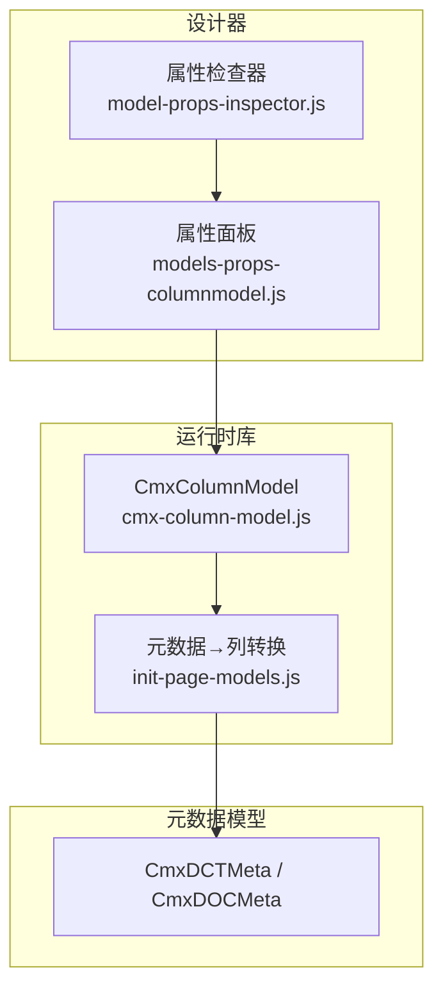
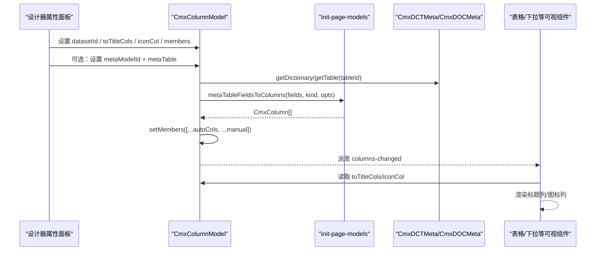
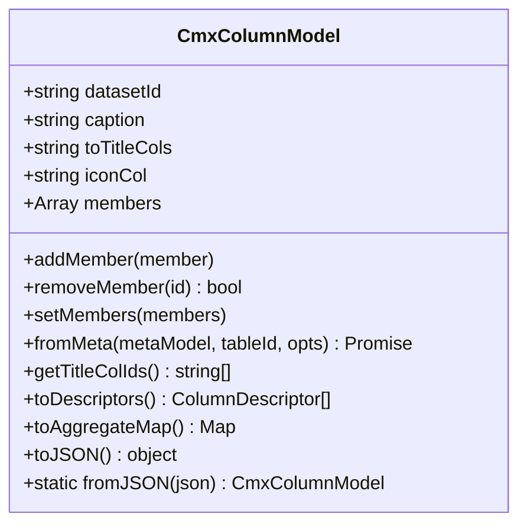
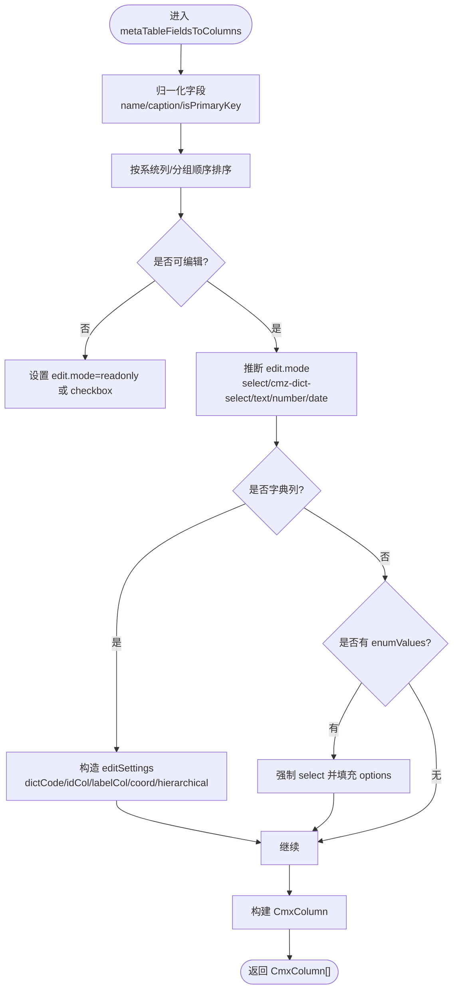
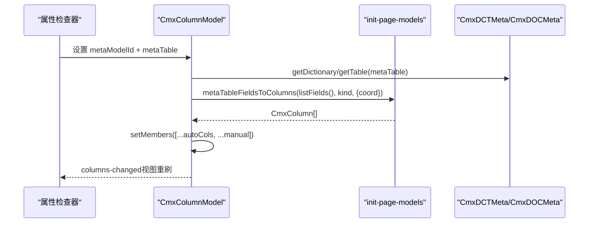
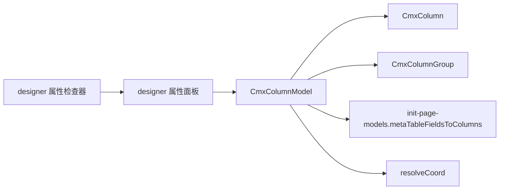

# 列模型属性编辑

<cite>
**本文引用的文件**
- [cmx-column-model.js](file://packages/cmx-data-comp/src/lib/cmx-column-model.js)
- [init-page-models.js](file://packages/cmx-data-comp/src/lib/init-page-models.js)
- [models-props-columnmodel.js](file://CMXHTMLDesigner/src/components/designer-page-data/models-props-columnmodel.js)
- [model-props-inspector.js](file://CMXHTMLDesigner/src/components/designer-inspector/model-props-inspector.js)
- [08-列模型-CmxColumnModel.md](file://docs/CMXPortalManager+CMXHTMLDesigner-模型体系文档/08-列模型-CmxColumnModel.md)
- [dct-doc-meta-model.md](file://packages/cmx-data-comp/docs/dct-doc-meta-model.md)
- [05-单据模型-CmxDOCMeta.md](file://docs/CMXPortalManager+CMXHTMLDesigner-模型体系文档/05-单据模型-CmxDOCMeta.md)
- [20260729_lib目录模块总览.md](file://packages/cmx-data-comp/src/lib/__tests__/__snapshots__/20260729_lib目录模块总览.md.snap)
</cite>

## 目录
1. [简介](#简介)
2. [项目结构](#项目结构)
3. [核心组件](#核心组件)
4. [架构总览](#架构总览)
5. [详细组件分析](#详细组件分析)
6. [依赖关系分析](#依赖关系分析)
7. [性能考量](#性能考量)
8. [故障排查指南](#故障排查指南)
9. [结论](#结论)
10. [附录](#附录)

## 简介
本技术文档围绕 CmxColumnModel（列模型）的属性编辑器与运行时行为展开，重点解释：
- 元数据驱动的列定义机制：如何通过 CmxDCTMeta/CmxDOCMeta 自动生成列；
- 数据集关联、标题列配置 toTitleCols、图标列 iconCol 的使用场景与配置方法；
- 设计器属性面板如何绑定并驱动列模型；
- 列模型与元数据模型的集成方案与扩展指南。

## 项目结构
与列模型属性编辑相关的关键位置：
- 运行时列模型实现：packages/cmx-data-comp/src/lib/cmx-column-model.js
- 元数据→列转换逻辑：packages/cmx-data-comp/src/lib/init-page-models.js
- 设计器属性面板（可视化编辑列/列组、JSON 编辑）：CMXHTMLDesigner/src/components/designer-page-data/models-props-columnmodel.js
- 设计器属性检查器（实例名、datasetId、toTitleCols、iconCol、metaModelId、metaTable 等绑定）：CMXHTMLDesigner/src/components/designer-inspector/model-props-inspector.js
- 文档说明：docs/CMXPortalManager+CMXHTMLDesigner-模型体系文档/08-列模型-CmxColumnModel.md
- 元数据模型说明：packages/cmx-data-comp/docs/dct-doc-meta-model.md、docs/.../05-单据模型-CmxDOCMeta.md

图表来源
- [model-props-inspector.js:292-316](file://CMXHTMLDesigner/src/components/designer-inspector/model-props-inspector.js#L292-L316)
- [models-props-columnmodel.js:23-79](file://CMXHTMLDesigner/src/components/designer-page-data/models-props-columnmodel.js#L23-L79)
- [cmx-column-model.js:20-29](file://packages/cmx-data-comp/src/lib/cmx-column-model.js#L20-L29)
- [init-page-models.js:392-566](file://packages/cmx-data-comp/src/lib/init-page-models.js#L392-L566)

章节来源
- [model-props-inspector.js:292-316](file://CMXHTMLDesigner/src/components/designer-inspector/model-props-inspector.js#L292-L316)
- [models-props-columnmodel.js:23-79](file://CMXHTMLDesigner/src/components/designer-page-data/models-props-columnmodel.js#L23-L79)
- [cmx-column-model.js:20-29](file://packages/cmx-data-comp/src/lib/cmx-column-model.js#L20-L29)
- [init-page-models.js:392-566](file://packages/cmx-data-comp/src/lib/init-page-models.js#L392-L566)

## 核心组件
- CmxColumnModel：纯元数据的列模型容器，维护 datasetId、caption、members（CmxColumn/CmxColumnGroup）、toTitleCols、iconCol，并提供 fromMeta、toDescriptors、toAggregateMap、setMembers 等方法。
- init-page-models.metaTableFieldsToColumns：将元数据字段转换为 CmxColumn[]，处理可编辑性、显示模式、字典选择、枚举选项、系统列排序等。
- 设计器属性面板：提供可视化编辑 columns/columnGroups、JSON 编辑、复制粘贴、列组聚合配置等。
- 设计器属性检查器：暴露 metaModelId/metaTable 绑定入口，以及 toTitleCols/iconCol 的输入框。

章节来源
- [cmx-column-model.js:20-29](file://packages/cmx-data-comp/src/lib/cmx-column-model.js#L20-L29)
- [cmx-column-model.js:89-157](file://packages/cmx-data-comp/src/lib/cmx-column-model.js#L89-L157)
- [init-page-models.js:392-566](file://packages/cmx-data-comp/src/lib/init-page-models.js#L392-L566)
- [models-props-columnmodel.js:23-79](file://CMXHTMLDesigner/src/components/designer-page-data/models-props-columnmodel.js#L23-L79)
- [model-props-inspector.js:292-316](file://CMXHTMLDesigner/src/components/designer-inspector/model-props-inspector.js#L292-L316)

## 架构总览
列模型属性编辑的整体流程如下：
- 设计期：在属性检查器中设置 datasetId、toTitleCols、iconCol、metaModelId、metaTable；或在属性面板中手动编辑 columns/columnGroups。
- 运行期：CmxColumnModel 通过 fromMeta 调用 metaTableFieldsToColumns，从 CmxDCTMeta/CmxDOCMeta 指定表/字典生成列，再 setMembers 替换成员列表，触发 columns-changed 事件，视图组件重渲染。
- 展示期：可视组件读取 toTitleCols/iconCol，组合行标题与图标。

图表来源
- [cmx-column-model.js:89-157](file://packages/cmx-data-comp/src/lib/cmx-column-model.js#L89-L157)
- [init-page-models.js:392-566](file://packages/cmx-data-comp/src/lib/init-page-models.js#L392-L566)
- [model-props-inspector.js:292-316](file://CMXHTMLDesigner/src/components/designer-inspector/model-props-inspector.js#L292-L316)

## 详细组件分析

### CmxColumnModel 类
- 职责：组织列与列组、管理成员变更事件、输出通用描述符、聚合配置、序列化/反序列化。
- 关键属性：
  - datasetId：关联的数据集实例名；
  - caption：模型显示标题；
  - members：顶层成员数组（CmxColumn | CmxColumnGroup）；
  - toTitleCols：逗号分隔的列 id，用于组合行标题；
  - iconCol：列 id，用于取行数据中的值作为图标标识。
- 关键方法：
  - addMember/removeMember/setMembers：增删改成员并派发 columns-changed；
  - fromMeta(metaModel, tableId, opts)：从元数据模型动态生成列并替换成员；
  - getTitleColIds()：解析 toTitleCols 为列 id 数组；
  - toDescriptors()：输出适配器可用的列描述符；
  - toAggregateMap()：汇总聚合配置供 grid 使用。

图表来源
- [cmx-column-model.js:20-29](file://packages/cmx-data-comp/src/lib/cmx-column-model.js#L20-L29)
- [cmx-column-model.js:33-72](file://packages/cmx-data-comp/src/lib/cmx-column-model.js#L33-L72)
- [cmx-column-model.js:89-157](file://packages/cmx-data-comp/src/lib/cmx-column-model.js#L89-L157)
- [cmx-column-model.js:173-219](file://packages/cmx-data-comp/src/lib/cmx-column-model.js#L173-L219)
- [cmx-column-model.js:223-239](file://packages/cmx-data-comp/src/lib/cmx-column-model.js#L223-L239)

章节来源
- [cmx-column-model.js:20-29](file://packages/cmx-data-comp/src/lib/cmx-column-model.js#L20-L29)
- [cmx-column-model.js:89-157](file://packages/cmx-data-comp/src/lib/cmx-column-model.js#L89-L157)
- [cmx-column-model.js:173-219](file://packages/cmx-data-comp/src/lib/cmx-column-model.js#L173-L219)
- [cmx-column-model.js:223-239](file://packages/cmx-data-comp/src/lib/cmx-column-model.js#L223-L239)

### 元数据驱动的列生成（metaTableFieldsToColumns）
- 输入：字段数组 fields、元数据类型或完整元数据对象 metaOrKind、可选参数 opts（respectOrder/coord/editable/hideDerivedHierarchy）。
- 处理要点：
  - 归一化字段 name/id/fieldName，解析 i18n caption；
  - 判定主键/业务键/系统列，决定可编辑性；
  - 生成 edit/display/refDict/editSettings 等列属性；
  - 对 DCT 增强路径支持业务键 readonlyWhen、树形父节点 hierarchical 等；
  - 对 refDict 列补充 coord（domain/application/module/dbId），避免字典弹窗请求缺坐标；
  - 返回 CmxColumn[]，由 CmxColumnModel.setMembers 合并到成员列表。
- 典型调用：CmxColumnModel.fromMeta → 动态 import init-page-models → metaTableFieldsToColumns → setMembers。

图表来源
- [init-page-models.js:392-566](file://packages/cmx-data-comp/src/lib/init-page-models.js#L392-L566)

章节来源
- [init-page-models.js:392-566](file://packages/cmx-data-comp/src/lib/init-page-models.js#L392-L566)

### 设计器属性面板（models-props-columnmodel.js）
- 功能：
  - “定义”标签页：可视化编辑 columns 和 columnGroups，支持复制/粘贴、上下移动、添加列组、聚合开关；
  - “JSON”标签页：CodeMirror 编辑 JSON，支持格式化、刷新、应用；
  - 内部将上下文字段映射为 CmxColumn/CmxColumnGroup，并持久化回 instance.props。
- 关键点：
  - normalizeColumnModelProps 兼容旧字段（fields/groups）迁移；
  - renderFieldPanel/renderFieldTable 复用弹性组合字段表能力；
  - 列组支持嵌套与聚合（sum/avg/max/min/count）及聚合行位置控制。

章节来源
- [models-props-columnmodel.js:23-79](file://CMXHTMLDesigner/src/components/designer-page-data/models-props-columnmodel.js#L23-L79)
- [models-props-columnmodel.js:111-167](file://CMXHTMLDesigner/src/components/designer-page-data/models-props-columnmodel.js#L111-L167)
- [models-props-columnmodel.js:465-515](file://CMXHTMLDesigner/src/components/designer-page-data/models-props-columnmodel.js#L465-L515)
- [models-props-columnmodel.js:642-683](file://CMXHTMLDesigner/src/components/designer-page-data/models-props-columnmodel.js#L642-L683)

### 设计器属性检查器（model-props-inspector.js）
- 暴露列模型关键属性输入：
  - instanceId、datasetId、toTitleCols、iconCol；
  - 元数据来源绑定：metaModelId（CmxDOCMeta/CmxDCTMeta 实例）、metaTable（表名/字典编码）；
- 自动列出页面已声明的元数据模型实例，供选择；
- 删除旧字段 columnsSource，统一改用 metaModelId 引用元数据模型。

章节来源
- [model-props-inspector.js:292-316](file://CMXHTMLDesigner/src/components/designer-inspector/model-props-inspector.js#L292-L316)
- [model-props-inspector.js:319-323](file://CMXHTMLDesigner/src/components/designer-inspector/model-props-inspector.js#L319-L323)

### 元数据模型（CmxDCTMeta / CmxDOCMeta）
- 角色：加载后端 JSON 元数据，以只读方式访问表、字段、字段集及其属性；
- 能力：
  - 提供 getDictionary/table 接口获取目标表；
  - listFields/listFieldRefs 展开字段；
  - 支持 fieldSets 共享、DOC/DCT 专用 API；
- 与列模型集成：CmxColumnModel.fromMeta 通过 metaModel.getDictionary/getTable 取得表后，调用 metaTableFieldsToColumns 生成列。

章节来源
- [dct-doc-meta-model.md:1-218](file://packages/cmx-data-comp/docs/dct-doc-meta-model.md#L1-L218)
- [05-单据模型-CmxDOCMeta.md:1-27](file://docs/CMXPortalManager+CMXHTMLDesigner-模型体系文档/05-单据模型-CmxDOCMeta.md#L1-L27)

### toTitleCols 与 iconCol 的使用场景与配置
- toTitleCols：
  - 作用：在列表/下拉等组件中，从每行数据中取出多个字段拼接成“标题”，提升可读性；
  - 配置：在属性检查器中输入逗号分隔的列 id（如 code,name）；
  - 运行时：组件读取 CmxColumnModel.getTitleColIds()，按顺序取行数据字段拼接；当存在 ≥2 个字段时，可使用左右对齐模板（例如 cmx-combo-box 的 list 模式）。
- iconCol：
  - 作用：从每行数据中取该列的值作为图标标识；
  - 配置：在属性检查器中输入列 id（如 iconType）；
  - 运行时：组件读取 CmxColumnModel.iconCol，结合行数据渲染图标。

章节来源
- [cmx-column-model.js:20-29](file://packages/cmx-data-comp/src/lib/cmx-column-model.js#L20-L29)
- [cmx-column-model.js:173-177](file://packages/cmx-data-comp/src/lib/cmx-column-model.js#L173-L177)
- [model-props-inspector.js:301-314](file://CMXHTMLDesigner/src/components/designer-inspector/model-props-inspector.js#L301-L314)
- [cmx-combo-box.js:1093-1148](file://packages/cmx-data-comp/src/components/cmx-combo-box.js#L1093-L1148)

### 列模型与元数据模型的集成方案
- 设计期：
  - 在属性检查器中选择 metaModelId（CmxDCTMeta/CmxDOCMeta）与 metaTable（表名/字典编码）；
  - 也可在属性面板中手动定义 columns/columnGroups，或通过 JSON 直接编辑。
- 运行期：
  - 调用 CmxColumnModel.fromMeta(metaModel, tableId, opts) 动态生成列；
  - 内部委托 metaTableFieldsToColumns 完成字段→列的转换；
  - setMembers 替换成员列表并派发 columns-changed，视图组件自动重刷。
- 坐标补全：
  - 对 refDict 列补充 editSettings.coord（domain/application/module/dbId），确保字典弹窗请求正确。

图表来源
- [cmx-column-model.js:89-157](file://packages/cmx-data-comp/src/lib/cmx-column-model.js#L89-L157)
- [init-page-models.js:392-566](file://packages/cmx-data-comp/src/lib/init-page-models.js#L392-L566)
- [model-props-inspector.js:292-316](file://CMXHTMLDesigner/src/components/designer-inspector/model-props-inspector.js#L292-L316)

章节来源
- [cmx-column-model.js:89-157](file://packages/cmx-data-comp/src/lib/cmx-column-model.js#L89-L157)
- [init-page-models.js:392-566](file://packages/cmx-data-comp/src/lib/init-page-models.js#L392-L566)
- [model-props-inspector.js:292-316](file://CMXHTMLDesigner/src/components/designer-inspector/model-props-inspector.js#L292-L316)

## 依赖关系分析
- CmxColumnModel 依赖：
  - CmxColumn/CmxColumnGroup：列与列组的实体；
  - init-page-models.metaTableFieldsToColumns：元数据→列转换；
  - resolveCoord：坐标合并工具（用于 refDict 列的 coord 回填）。
- 设计器依赖：
  - models-props-columnmodel.js 依赖 cmx-data-comp 的字段面板能力（renderFieldPanel/renderFieldTable）；
  - model-props-inspector.js 提供属性绑定界面，并列出页面内可用模型实例。

图表来源
- [cmx-column-model.js:16-18](file://packages/cmx-data-comp/src/lib/cmx-column-model.js#L16-L18)
- [cmx-column-model.js:89-157](file://packages/cmx-data-comp/src/lib/cmx-column-model.js#L89-L157)
- [models-props-columnmodel.js:11-21](file://CMXHTMLDesigner/src/components/designer-page-data/models-props-columnmodel.js#L11-L21)
- [model-props-inspector.js:292-316](file://CMXHTMLDesigner/src/components/designer-inspector/model-props-inspector.js#L292-L316)

章节来源
- [cmx-column-model.js:16-18](file://packages/cmx-data-comp/src/lib/cmx-column-model.js#L16-L18)
- [cmx-column-model.js:89-157](file://packages/cmx-data-comp/src/lib/cmx-column-model.js#L89-L157)
- [models-props-columnmodel.js:11-21](file://CMXHTMLDesigner/src/components/designer-page-data/models-props-columnmodel.js#L11-L21)
- [model-props-inspector.js:292-316](file://CMXHTMLDesigner/src/components/designer-inspector/model-props-inspector.js#L292-L316)

## 性能考量
- 动态列生成：
  - fromMeta 采用动态 import 引入 metaTableFieldsToColumns，避免循环依赖与不必要的初始化开销；
  - setMembers 一次性替换成员列表，仅派发一次 columns-changed，减少多次重绘。
- 列排序与过滤：
  - metaTableFieldsToColumns 先 orderColumns 再 map，保证系统列与用户自定义顺序可控；
  - toDescriptors 过滤不可见列，降低适配器层负担。
- 坐标回填：
  - 仅在必要时计算并写入 editSettings.coord，避免多余对象创建。

[本节为通用性能讨论，不直接分析具体文件]

## 故障排查指南
- 未找到元数据表：
  - 现象：控制台警告“元数据中未找到表 'xxx'”；
  - 排查：确认 metaModelId 指向正确的 CmxDCTMeta/CmxDOCMeta 实例，metaTable 填写正确的表名/字典编码。
- 字典弹窗请求失败（缺坐标）：
  - 现象：/api/dct/data/search 报 400；
  - 排查：确保 refDict 列的 editSettings.coord 已回填（fromMeta 会优先用传入 coord，其次从 metaModel 实例 domain/application/module 兜底）。
- 列未显示或闪烁：
  - 现象：首次加载无列或短暂空白；
  - 排查：确认 initPageModels 阶段 1.5 自动填充列已执行；如需覆盖，后续 switchDict 调用 fromMeta 重新生成列。
- toTitleCols/iconCol 无效：
  - 现象：标题/图标未按预期显示；
  - 排查：确认 toTitleCols/iconCol 配置的列 id 存在于当前行的数据中；组件需支持读取 CmxColumnModel 的对应属性。

章节来源
- [cmx-column-model.js:90-100](file://packages/cmx-data-comp/src/lib/cmx-column-model.js#L90-L100)
- [cmx-column-model.js:119-153](file://packages/cmx-data-comp/src/lib/cmx-column-model.js#L119-L153)
- [init-page-models.js:878-895](file://packages/cmx-data-comp/src/lib/init-page-models.js#L878-L895)
- [cmx-combo-box.js:1093-1148](file://packages/cmx-data-comp/src/components/cmx-combo-box.js#L1093-L1148)

## 结论
CmxColumnModel 通过元数据驱动的方式，实现了列定义的自动化与动态化。设计器属性面板与检查器提供了直观的编辑与绑定入口，运行时通过 fromMeta 与 metaTableFieldsToColumns 将 CmxDCTMeta/CmxDOCMeta 的字段转化为可编辑、可展示的列。toTitleCols 与 iconCol 进一步增强了列表/下拉等组件的展示能力。整体架构解耦清晰，扩展点明确，便于在不同业务场景中灵活定制列行为。

[本节为总结性内容，不直接分析具体文件]

## 附录
- 列模型文档参考：
  - [08-列模型-CmxColumnModel.md](file://docs/CMXPortalManager+CMXHTMLDesigner-模型体系文档/08-列模型-CmxColumnModel.md)
- 元数据模型文档参考：
  - [dct-doc-meta-model.md](file://packages/cmx-data-comp/docs/dct-doc-meta-model.md)
  - [05-单据模型-CmxDOCMeta.md](file://docs/CMXPortalManager+CMXHTMLDesigner-模型体系文档/05-单据模型-CmxDOCMeta.md)

[本节为参考资料索引，不直接分析具体文件]