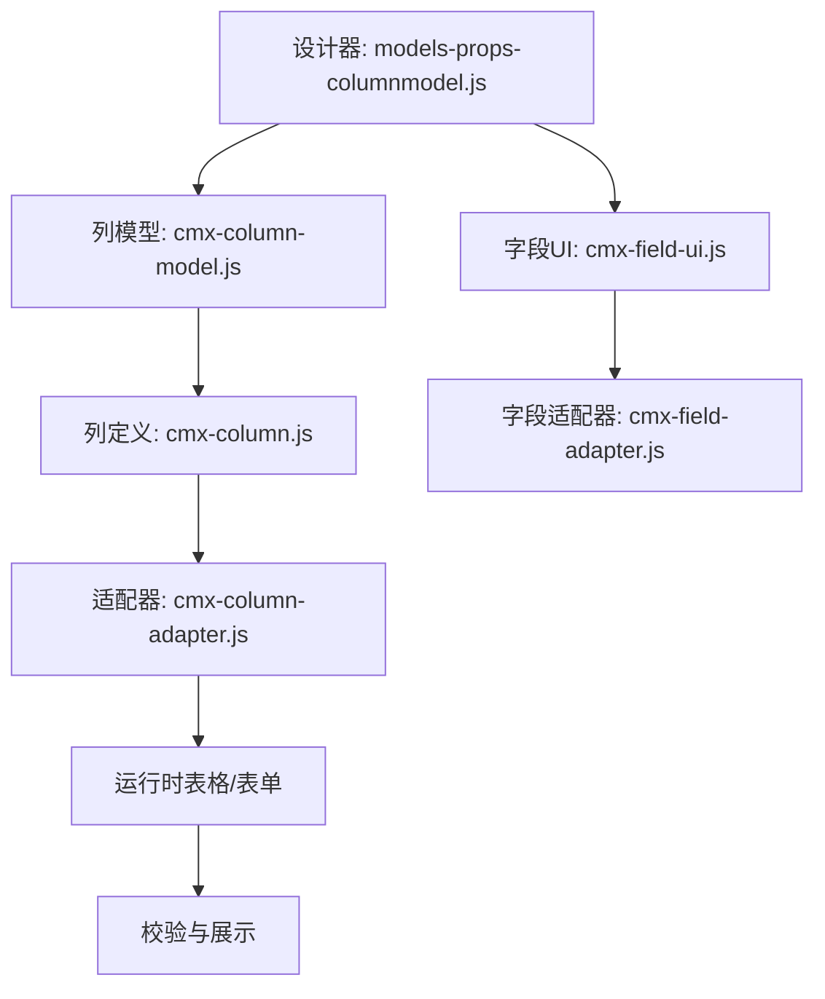
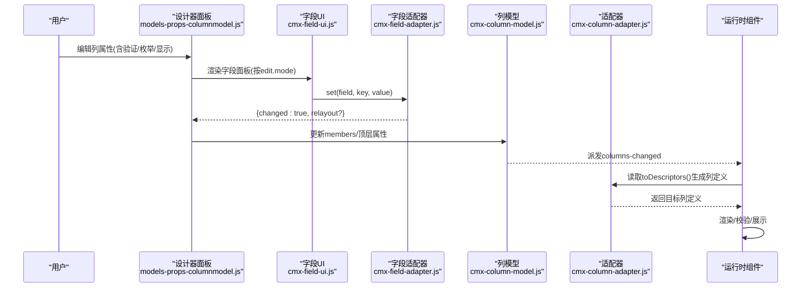
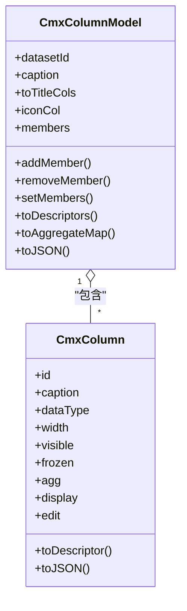
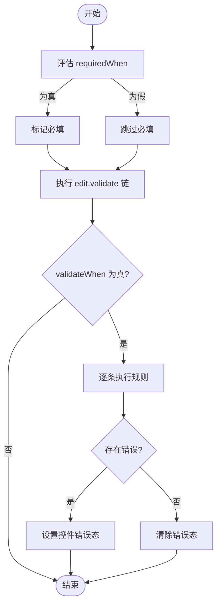
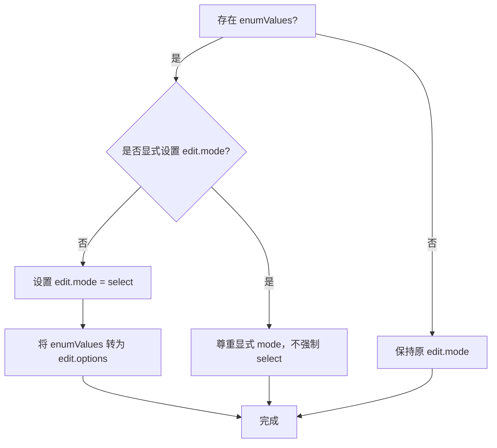
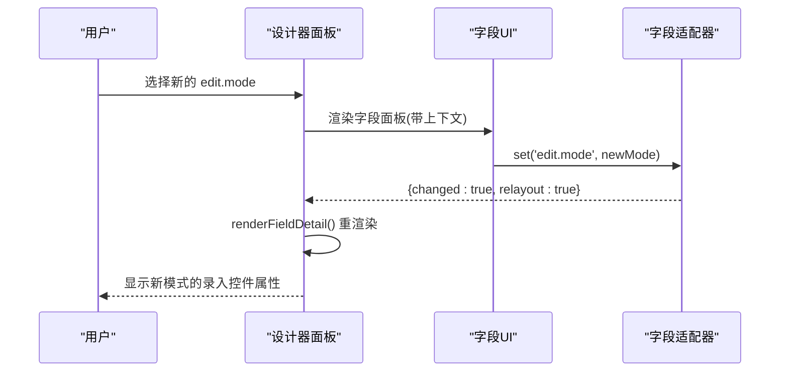
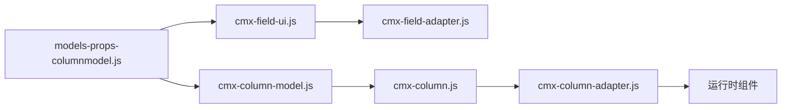

# 列详情属性编辑

<cite>
**本文引用的文件**
- [cmx-column.js](file://packages/cmx-data-comp/src/lib/cmx-column.js)
- [cmx-column-model.js](file://packages/cmx-data-comp/src/lib/cmx-column-model.js)
- [cmx-column-adapter.js](file://packages/cmx-data-comp/src/lib/cmx-column-adapter.js)
- [models-props-columnmodel.js](file://CMXHTMLDesigner/src/components/designer-page-data/models-props-columnmodel.js)
- [cmx-field-ui.js](file://packages/cmx-data-comp/src/lib/cmx-field-ui.js)
- [cmx-field-adapter.js](file://packages/cmx-data-comp/src/lib/cmx-field-adapter.js)
- [flexible-combination-engine.test.js](file://packages/cmx-data-comp/src/lib/__tests__/flexible-combination-engine.test.js)
- [P8-组件列定义统一CmxColumnModel.md](file://docs/P8-组件列定义统一CmxColumnModel.md)
</cite>

## 目录
1. [简介](#简介)
2. [项目结构](#项目结构)
3. [核心组件](#核心组件)
4. [架构总览](#架构总览)
5. [详细组件分析](#详细组件分析)
6. [依赖关系分析](#依赖关系分析)
7. [性能考虑](#性能考虑)
8. [故障排查指南](#故障排查指南)
9. [结论](#结论)
10. [附录](#附录)

## 简介
本技术文档聚焦“列详情属性编辑器”，围绕列级配置展开，覆盖字段类型、显示格式与录入控件设置；详细说明验证规则的配置与管理（添加、删除、编辑表达式）；解释枚举值配置机制（value-label 对的增删）；说明录入控件属性的动态切换与上下文字段绑定；并提供列级配置的最佳实践与常见配置模式示例。

## 项目结构
列详情属性编辑涉及设计器面板、列模型与适配器、以及运行时渲染/校验链路：
- 设计器侧：提供可视化编辑界面，支持列/列组管理、JSON 视图、枚举项维护、验证表达式编辑等。
- 模型侧：以 CmxColumn / CmxColumnModel 为核心，承载列元数据与聚合分组。
- 适配侧：将模型转换为具体表格/表单所需的列定义，并处理 edit/display 的归一化与映射。
- 运行侧：根据 edit.mode 动态渲染控件，执行 requiredWhen/validateWhen 条件控制与 validate 校验。

**图表来源**
- [models-props-columnmodel.js:23-109](file://CMXHTMLDesigner/src/components/designer-page-data/models-props-columnmodel.js#L23-L109)
- [cmx-column-model.js:20-72](file://packages/cmx-data-comp/src/lib/cmx-column-model.js#L20-L72)
- [cmx-column.js:84-200](file://packages/cmx-data-comp/src/lib/cmx-column.js#L84-L200)
- [cmx-column-adapter.js:432-462](file://packages/cmx-data-comp/src/lib/cmx-column-adapter.js#L432-L462)
- [cmx-field-ui.js:177-201](file://packages/cmx-data-comp/src/lib/cmx-field-ui.js#L177-L201)
- [cmx-field-adapter.js:177-202](file://packages/cmx-data-comp/src/lib/cmx-field-adapter.js#L177-L202)

**章节来源**
- [models-props-columnmodel.js:23-109](file://CMXHTMLDesigner/src/components/designer-page-data/models-props-columnmodel.js#L23-L109)
- [cmx-column-model.js:20-72](file://packages/cmx-data-comp/src/lib/cmx-column-model.js#L20-L72)
- [cmx-column.js:84-200](file://packages/cmx-data-comp/src/lib/cmx-column.js#L84-L200)
- [cmx-column-adapter.js:432-462](file://packages/cmx-data-comp/src/lib/cmx-column-adapter.js#L432-L462)
- [cmx-field-ui.js:177-201](file://packages/cmx-data-comp/src/lib/cmx-field-ui.js#L177-L201)
- [cmx-field-adapter.js:177-202](file://packages/cmx-data-comp/src/lib/cmx-field-adapter.js#L177-L202)

## 核心组件
- CmxColumn：单列元数据，集中声明 display/edit 结构化配置，提供 toDescriptor 输出通用描述符。
- CmxColumnModel：列集合与分组，负责成员管理、序列化、从元数据构建列、触发 columns-changed 事件。
- 设计器属性面板：基于 schema 驱动的字段面板，按 edit.mode 动态渲染“录入控件属性”分区，支持枚举项与验证表达式维护。
- 字段 UI/适配器：schema 驱动渲染与读写，edit.mode 变化时触发重渲染以更新分区可见性。
- 适配器层：将 CmxColumn 的 display/edit 映射到具体表格/表单列定义，处理 options、placeholder、source、dependents、helper、valueField、displayTemplate 等。

**章节来源**
- [cmx-column.js:84-200](file://packages/cmx-data-comp/src/lib/cmx-column.js#L84-L200)
- [cmx-column-model.js:20-72](file://packages/cmx-data-comp/src/lib/cmx-column-model.js#L20-L72)
- [models-props-columnmodel.js:23-109](file://CMXHTMLDesigner/src/components/designer-page-data/models-props-columnmodel.js#L23-L109)
- [cmx-field-ui.js:177-201](file://packages/cmx-data-comp/src/lib/cmx-field-ui.js#L177-L201)
- [cmx-field-adapter.js:177-202](file://packages/cmx-data-comp/src/lib/cmx-field-adapter.js#L177-L202)
- [cmx-column-adapter.js:432-462](file://packages/cmx-data-comp/src/lib/cmx-column-adapter.js#L432-L462)

## 架构总览
列详情属性编辑的整体流程：
- 设计器面板通过 renderFieldPanel 渲染字段属性，依据 edit.mode 动态选择“录入控件属性”分区。
- 用户修改字段属性后，通过字段适配器 set 写入路径（如 edit.validate、enumValues.*），必要时触发 relayout。
- 列模型变更触发 columns-changed，驱动可视组件重新同步列定义。
- 运行时根据 edit.display/edit.edit 渲染单元格与录入控件，并在提交或失焦时执行校验。

**图表来源**
- [models-props-columnmodel.js:23-109](file://CMXHTMLDesigner/src/components/designer-page-data/models-props-columnmodel.js#L23-L109)
- [cmx-field-ui.js:177-201](file://packages/cmx-data-comp/src/lib/cmx-field-ui.js#L177-L201)
- [cmx-field-adapter.js:177-202](file://packages/cmx-data-comp/src/lib/cmx-field-adapter.js#L177-L202)
- [cmx-column-model.js:33-72](file://packages/cmx-data-comp/src/lib/cmx-column-model.js#L33-L72)
- [cmx-column.js:158-200](file://packages/cmx-data-comp/src/lib/cmx-column.js#L158-L200)
- [cmx-column-adapter.js:432-462](file://packages/cmx-data-comp/src/lib/cmx-column-adapter.js#L432-L462)

## 详细组件分析

### 字段类型、显示格式与录入控件
- 字段类型：由 dataType 决定基础行为，edit.mode 可显式覆盖（如 number/date/datetime/checkbox/select/ref/combo/dict-select/image/video/readonly/none）。
- 显示格式：display.format、display.decimalDigits、display.zeroAsBlank、display.align、display.mode（text/badge/link/icon）、cellStyle、render 等。
- 录入控件：edit.mode 决定控件类型；edit.options/source/valueField/displayTemplate/parent/dropdownColumns/dropdownWidth/dropdownMaxHeight/placeholder/dependents/required/requiredWhen/validate/validateWhen/readonlyWhen/editor 等细粒度控制。
- 别名与归一化：顶层 displayMask/validateFormula/decimalDigits/required 等会被归一到 display/edit 块，保证一致的结构化配置。

**图表来源**
- [cmx-column.js:84-200](file://packages/cmx-data-comp/src/lib/cmx-column.js#L84-L200)
- [cmx-column-model.js:20-72](file://packages/cmx-data-comp/src/lib/cmx-column-model.js#L20-L72)

**章节来源**
- [cmx-column.js:84-200](file://packages/cmx-data-comp/src/lib/cmx-column.js#L84-L200)
- [cmx-column.js:128-152](file://packages/cmx-data-comp/src/lib/cmx-column.js#L128-L152)
- [cmx-column-adapter.js:432-462](file://packages/cmx-data-comp/src/lib/cmx-column-adapter.js#L432-L462)

### 验证规则的配置与管理
- 规则位置：edit.validate 支持字符串预设、对象{preset,args}、函数(value,row)=>true|string，或数组形式组合多条规则。
- 表达式与条件：edit.requiredWhen 控制必填条件；edit.validateWhen 控制校验执行时机；pattern 正则会转为函数式规则追加至 edit.validate，空值放行交由 required 处理。
- 设计器操作：
  - 添加/删除/编辑验证表达式：通过面板动作 add-validation/remove-validation/open-formula 等实现。
  - 点路径写入 enumValues.*：宿主端使用 writeFieldPath 直接操作数组元素。
- 运行时校验：表单/表格在提交或失焦时执行 validate 链，错误态通过 _setFieldError 设置 UI5 控件状态或类名提示。

**图表来源**
- [cmx-field-ui.js:177-201](file://packages/cmx-data-comp/src/lib/cmx-field-ui.js#L177-L201)
- [cmx-field-adapter.js:177-202](file://packages/cmx-data-comp/src/lib/cmx-field-adapter.js#L177-L202)
- [flexible-combination-engine.test.js:324-345](file://packages/cmx-data-comp/src/lib/__tests__/flexible-combination-engine.test.js#L324-L345)

**章节来源**
- [flexible-combination-engine.test.js:324-345](file://packages/cmx-data-comp/src/lib/__tests__/flexible-combination-engine.test.js#L324-L345)
- [models-props-columnmodel.js:200-202](file://CMXHTMLDesigner/src/components/designer-page-data/models-props-columnmodel.js#L200-L202)
- [cmx-field-adapter.js:177-202](file://packages/cmx-data-comp/src/lib/cmx-field-adapter.js#L177-L202)

### 枚举值的配置机制（value-label 对）
- 输入形态：既支持字符串数组（兼容旧格式），也支持对象数组 [{value,label}]。
- 引擎转换：当存在 enumValues 且未显式指定 edit.mode 时，自动将 edit.mode 设为 select，并将 enumValues 映射为 edit.options。
- 优先级：若显式设置了 edit.mode（如 cmx-text-input），则不强制覆盖为 select。
- 设计器维护：
  - 新增枚举项：push 一个 {value:'', label:''} 行。
  - 删除枚举项：splice 移除对应索引。
  - 编辑 value/label：通过 data-field-path="enumValues.{i}.value|label" 进行点路径写回。

**图表来源**
- [flexible-combination-engine.test.js:347-372](file://packages/cmx-data-comp/src/lib/__tests__/flexible-combination-engine.test.js#L347-L372)
- [models-props-columnmodel.js:357-378](file://CMXHTMLDesigner/src/components/designer-page-data/models-props-columnmodel.js#L357-L378)

**章节来源**
- [flexible-combination-engine.test.js:347-372](file://packages/cmx-data-comp/src/lib/__tests__/flexible-combination-engine.test.js#L347-L372)
- [models-props-columnmodel.js:357-378](file://CMXHTMLDesigner/src/components/designer-page-data/models-props-columnmodel.js#L357-L378)

### 录入控件属性的动态切换与上下文字段绑定
- 动态切换：当 edit.mode 改变时，字段面板需重渲染以更新“录入控件属性”分区（relayout=true）。
- 上下文字段：
  - refDictOptions：维度列的字典选项。
  - refFieldOptions：字典字段可选属性。
  - defaultFrom/source.dimension：用于推导可用属性。
- 设计器交互：
  - 通过 fieldCtx 注入 end、dimensionCodes、refDictOptions、refFieldOptions 等上下文。
  - 选择 edit.mode 时触发 renderFieldDetail 刷新面板。

**图表来源**
- [models-props-columnmodel.js:241-247](file://CMXHTMLDesigner/src/components/designer-page-data/models-props-columnmodel.js#L241-L247)
- [cmx-field-ui.js:177-201](file://packages/cmx-data-comp/src/lib/cmx-field-ui.js#L177-L201)
- [cmx-field-adapter.js:177-202](file://packages/cmx-data-comp/src/lib/cmx-field-adapter.js#L177-L202)

**章节来源**
- [models-props-columnmodel.js:95-101](file://CMXHTMLDesigner/src/components/designer-page-data/models-props-columnmodel.js#L95-L101)
- [models-props-columnmodel.js:241-247](file://CMXHTMLDesigner/src/components/designer-page-data/models-props-columnmodel.js#L241-L247)
- [cmx-field-ui.js:177-201](file://packages/cmx-data-comp/src/lib/cmx-field-ui.js#L177-L201)
- [cmx-field-adapter.js:177-202](file://packages/cmx-data-comp/src/lib/cmx-field-adapter.js#L177-L202)

### 最佳实践与常见配置模式
- 数值列：设置 dataType=DECIMAL，display.format='thousands' 或 'percent'，display.decimalDigits 控制小数位，zeroAsBlank 控制零值显示。
- 日期时间：dataType=DATETIME，edit.mode=date/datetime，format 使用 date:YYYY-MM-DD 等。
- 下拉枚举：优先使用 enumValues 对象数组 [{value,label}]，让引擎自动转为 select 与 options；如需自定义输入，显式设置 edit.mode 覆盖。
- 引用字典：refDict/refField/displayField 配合 editSettings.coord，确保弹窗请求携带 domain/application/module。
- 条件必填/只读：使用 edit.requiredWhen/readonlyWhen 表达式，结合行字段计算。
- 校验策略：先用 requiredWhen 控制必填范围，再用 edit.validate 做内容校验；pattern 正则作为函数式规则追加，空值放行交由 required。
- 列分组与合计：使用 CmxColumnGroup.aggregate 配置 sum/avg/max/min/count，aggregatePosition 控制合计行位置。

**章节来源**
- [cmx-column.js:30-79](file://packages/cmx-data-comp/src/lib/cmx-column.js#L30-L79)
- [cmx-column-model.js:197-219](file://packages/cmx-data-comp/src/lib/cmx-column-model.js#L197-L219)
- [flexible-combination-engine.test.js:316-322](file://packages/cmx-data-comp/src/lib/__tests__/flexible-combination-engine.test.js#L316-L322)
- [flexible-combination-engine.test.js:347-372](file://packages/cmx-data-comp/src/lib/__tests__/flexible-combination-engine.test.js#L347-L372)

## 依赖关系分析
- 设计器面板依赖字段 UI 与适配器进行渲染与读写。
- 列模型依赖 CmxColumn/CmxColumnGroup 组织成员，对外暴露 toDescriptors 供适配器消费。
- 适配器依赖列定义的 display/edit 结构，将其映射为目标表格/表单列定义。
- 运行时组件监听 columns-changed 事件，动态刷新列。

**图表来源**
- [models-props-columnmodel.js:23-109](file://CMXHTMLDesigner/src/components/designer-page-data/models-props-columnmodel.js#L23-L109)
- [cmx-field-ui.js:177-201](file://packages/cmx-data-comp/src/lib/cmx-field-ui.js#L177-L201)
- [cmx-field-adapter.js:177-202](file://packages/cmx-data-comp/src/lib/cmx-field-adapter.js#L177-L202)
- [cmx-column-model.js:20-72](file://packages/cmx-data-comp/src/lib/cmx-column-model.js#L20-L72)
- [cmx-column.js:84-200](file://packages/cmx-data-comp/src/lib/cmx-column.js#L84-L200)
- [cmx-column-adapter.js:432-462](file://packages/cmx-data-comp/src/lib/cmx-column-adapter.js#L432-L462)

**章节来源**
- [models-props-columnmodel.js:23-109](file://CMXHTMLDesigner/src/components/designer-page-data/models-props-columnmodel.js#L23-L109)
- [cmx-field-ui.js:177-201](file://packages/cmx-data-comp/src/lib/cmx-field-ui.js#L177-L201)
- [cmx-field-adapter.js:177-202](file://packages/cmx-data-comp/src/lib/cmx-field-adapter.js#L177-L202)
- [cmx-column-model.js:20-72](file://packages/cmx-data-comp/src/lib/cmx-column-model.js#L20-L72)
- [cmx-column.js:84-200](file://packages/cmx-data-comp/src/lib/cmx-column.js#L84-L200)
- [cmx-column-adapter.js:432-462](file://packages/cmx-data-comp/src/lib/cmx-column-adapter.js#L432-L462)

## 性能考虑
- 避免频繁全量重渲染：字段适配器仅在 edit.mode/display.mode 变化时返回 relayout=true，减少面板抖动。
- 批量更新列：使用 setMembers 一次性替换成员列表，仅触发一次 columns-changed。
- 序列化优化：toJSON 剔除函数值，避免不必要的传输与解析开销。
- 适配器映射：toDescriptor 仅输出必要字段，降低下游构建成本。

**章节来源**
- [cmx-field-adapter.js:177-202](file://packages/cmx-data-comp/src/lib/cmx-field-adapter.js#L177-L202)
- [cmx-column-model.js:62-72](file://packages/cmx-data-comp/src/lib/cmx-column-model.js#L62-L72)
- [cmx-column.js:202-249](file://packages/cmx-data-comp/src/lib/cmx-column.js#L202-L249)

## 故障排查指南
- 枚举未生效：确认是否存在显式 edit.mode；若存在，引擎不会强制覆盖为 select。检查 enumValues 是否为对象数组或兼容字符串数组。
- 验证表达式无效：检查 validateWhen 条件是否为真；pattern 正则空值放行，需配合 requiredWhen 控制必填。
- 字典引用报错：确保 editSettings.coord 包含 domain/application/module；从元数据构建列时会自动回填坐标。
- 面板未刷新：确认 edit.mode 变化是否触发 relayout；必要时手动调用 renderFieldDetail。
- JSON 应用失败：检查 columns/columnGroups 是否为数组；根节点必须为对象。

**章节来源**
- [flexible-combination-engine.test.js:347-372](file://packages/cmx-data-comp/src/lib/__tests__/flexible-combination-engine.test.js#L347-L372)
- [flexible-combination-engine.test.js:324-345](file://packages/cmx-data-comp/src/lib/__tests__/flexible-combination-engine.test.js#L324-L345)
- [cmx-column-model.js:89-157](file://packages/cmx-data-comp/src/lib/cmx-column-model.js#L89-L157)
- [models-props-columnmodel.js:494-515](file://CMXHTMLDesigner/src/components/designer-page-data/models-props-columnmodel.js#L494-L515)

## 结论
列详情属性编辑器通过 CmxColumn/CmxColumnModel 提供统一的列级配置能力，借助设计器面板与字段 UI/适配器实现可视化编辑与动态切换。验证规则与枚举值配置清晰可控，运行时渲染与校验链路稳定可靠。遵循最佳实践可显著提升配置效率与可维护性。

## 附录
- 统一列定义方案：可视组件列定义统一为 CmxColumnModel，关闭自有列 API，删除 cmx-ui5-table，确保唯一入口与一致性。

**章节来源**
- [P8-组件列定义统一CmxColumnModel.md:1-19](file://docs/P8-组件列定义统一CmxColumnModel.md#L1-L19)
- [P8-组件列定义统一CmxColumnModel.md:21-79](file://docs/P8-组件列定义统一CmxColumnModel.md#L21-L79)