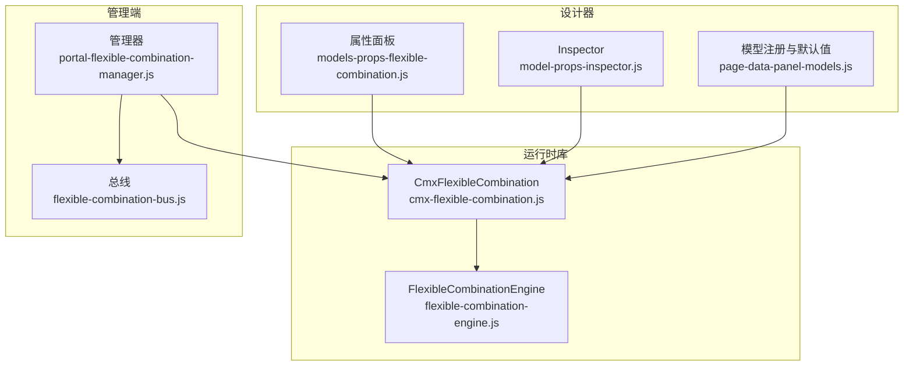
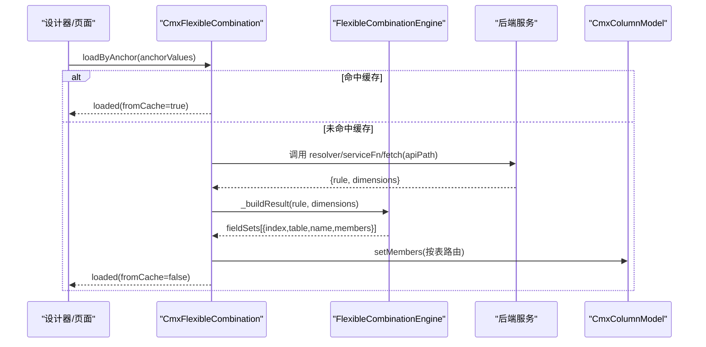
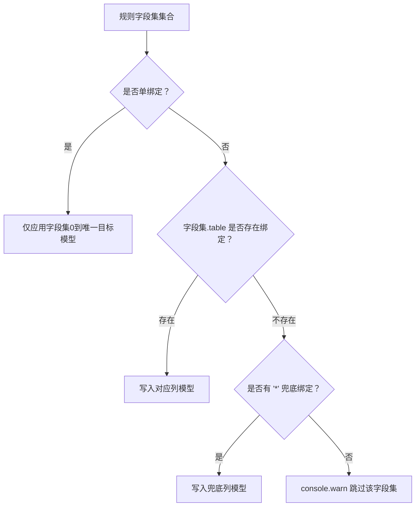

# 弹性组合属性编辑

<cite>
**本文引用的文件**
- [cmx-flexible-combination.js](file://packages/cmx-data-comp/src/lib/cmx-flexible-combination.js)
- [flexible-combination-engine.js](file://packages/cmx-data-comp/src/lib/flexible-combination-engine.js)
- [models-props-flexible-combination.js](file://CMXHTMLDesigner/src/components/designer-page-data/models-props-flexible-combination.js)
- [model-props-inspector.js](file://CMXHTMLDesigner/src/components/designer-inspector/model-props-inspector.js)
- [page-data-panel-models.js](file://CMXHTMLDesigner/src/components/designer-page-data/page-data-panel-models.js)
- [portal-flexible-combination-manager.js](file://CMXPortalManager/src/components/portal-flexible-combination-manager.js)
- [flexible-combination-bus.js](file://CMXPortalManager/src/lib/flexible-combination-bus.js)
- [10-弹性组合-FlexibleCombination.md](file://docs/CMXPortalManager+CMXHTMLDesigner-模型体系文档/10-弹性组合-FlexibleCombination.md)
</cite>

## 目录
1. [简介](#简介)
2. [项目结构](#项目结构)
3. [核心组件](#核心组件)
4. [架构总览](#架构总览)
5. [详细组件分析](#详细组件分析)
6. [依赖关系分析](#依赖关系分析)
7. [性能考虑](#性能考虑)
8. [故障排查指南](#故障排查指南)
9. [结论](#结论)
10. [附录](#附录)

## 简介
本技术文档围绕“弹性组合（FlexibleCombination）属性编辑器”展开，面向业务场景配置、后端定位机制、坐标继承原理、目标列模型绑定方式（按表绑定与多行配置）、取数来源（页面服务函数与默认接口地址）、内联规则启用与使用、以及与档案级配置的集成方案与性能优化建议。目标是让读者在不深入源码的情况下也能正确配置并高效使用弹性组合能力。

## 项目结构
与弹性组合属性编辑相关的代码分布在三个层次：
- 设计器侧（CMXHTMLDesigner）：提供属性面板与 Inspector，用于在页面建模阶段配置 FlexibleCombination 实例的普通属性与内联规则。
- 运行时库（packages/cmx-data-comp）：实现 CmxFlexibleCombination 组件与 FlexibleCombinationEngine 引擎，负责按锚点维度加载规则、解析字段集、生成 CmxColumn[] 并写入目标列模型。
- 管理端（CMXPortalManager）：提供弹性组合档案的管理界面（列表、编辑、校验、预览），以及跨组件通信总线。



图表来源
- [models-props-flexible-combination.js:1-16](file://CMXHTMLDesigner/src/components/designer-page-data/models-props-flexible-combination.js#L1-L16)
- [model-props-inspector.js:325-354](file://CMXHTMLDesigner/src/components/designer-inspector/model-props-inspector.js#L325-L354)
- [page-data-panel-models.js:91-92](file://CMXHTMLDesigner/src/components/designer-page-data/page-data-panel-models.js#L91-L92)
- [cmx-flexible-combination.js:37-70](file://packages/cmx-data-comp/src/lib/cmx-flexible-combination.js#L37-L70)
- [flexible-combination-engine.js:47-68](file://packages/cmx-data-comp/src/lib/flexible-combination-engine.js#L47-L68)
- [portal-flexible-combination-manager.js:51-104](file://CMXPortalManager/src/components/portal-flexible-combination-manager.js#L51-L104)
- [flexible-combination-bus.js:17-73](file://CMXPortalManager/src/lib/flexible-combination-bus.js#L17-L73)

章节来源
- [models-props-flexible-combination.js:1-16](file://CMXHTMLDesigner/src/components/designer-page-data/models-props-flexible-combination.js#L1-L16)
- [model-props-inspector.js:325-354](file://CMXHTMLDesigner/src/components/designer-inspector/model-props-inspector.js#L325-L354)
- [page-data-panel-models.js:91-92](file://CMXHTMLDesigner/src/components/designer-page-data/page-data-panel-models.js#L91-L92)
- [cmx-flexible-combination.js:37-70](file://packages/cmx-data-comp/src/lib/cmx-flexible-combination.js#L37-L70)
- [flexible-combination-engine.js:47-68](file://packages/cmx-data-comp/src/lib/flexible-combination-engine.js#L47-L68)
- [portal-flexible-combination-manager.js:51-104](file://CMXPortalManager/src/components/portal-flexible-combination-manager.js#L51-L104)
- [flexible-combination-bus.js:17-73](file://CMXPortalManager/src/lib/flexible-combination-bus.js#L17-L73)

## 核心组件
- CmxFlexibleCombination（运行时组件）
  - 职责：封装“按锚点维度组合 → 取规则 → 转列 → 写入目标列模型”的完整流程；支持缓存、事件派发、错误回退。
  - 关键能力：
    - 数据来源优先级：resolver > serviceFn > 默认 fetch(apiPath)。
    - 目标绑定：columnModelId 可为字符串（单绑定）或对象 { 表名: instanceId }（按表多绑定）。
    - 事件：loaded / error / cleared。
- FlexibleCombinationEngine（运行时引擎）
  - 职责：将规则（含 overlay/use/pick 展开为 inline）编译为 CmxColumn[] 或成员集合（含分组），并提供匹配、合并、重算、校验等能力。
  - 关键能力：
    - resolveRule / resolveMergedRule：按 anchor 匹配与合并。
    - buildMembers / fieldSetsOf：支持主字段集与多字段集（fieldTabs）。
    - applyToColumnModel：原地更新已有列模型。
- 设计器属性面板与 Inspector
  - 提供 FlexibleCombination 实例的普通属性编辑入口（如 instanceId、apiPath、serviceFn、inlineData 等），并在右侧属性区统一展示。
- 管理端管理器与总线
  - 提供弹性组合档案的增删改查、版本管理、校验预览；通过总线协调列表与主体状态。

章节来源
- [cmx-flexible-combination.js:37-70](file://packages/cmx-data-comp/src/lib/cmx-flexible-combination.js#L37-L70)
- [flexible-combination-engine.js:47-68](file://packages/cmx-data-comp/src/lib/flexible-combination-engine.js#L47-L68)
- [model-props-inspector.js:325-354](file://CMXHTMLDesigner/src/components/designer-inspector/model-props-inspector.js#L325-L354)
- [portal-flexible-combination-manager.js:51-104](file://CMXPortalManager/src/components/portal-flexible-combination-manager.js#L51-L104)
- [flexible-combination-bus.js:17-73](file://CMXPortalManager/src/lib/flexible-combination-bus.js#L17-L73)

## 架构总览
弹性组合从配置到渲染的整体流程如下：



图表来源
- [cmx-flexible-combination.js:104-132](file://packages/cmx-data-comp/src/lib/cmx-flexible-combination.js#L104-L132)
- [cmx-flexible-combination.js:260-279](file://packages/cmx-data-comp/src/lib/cmx-flexible-combination.js#L260-L279)
- [cmx-flexible-combination.js:288-298](file://packages/cmx-data-comp/src/lib/cmx-flexible-combination.js#L288-L298)
- [cmx-flexible-combination.js:315-339](file://packages/cmx-data-comp/src/lib/cmx-flexible-combination.js#L315-L339)

章节来源
- [cmx-flexible-combination.js:104-132](file://packages/cmx-data-comp/src/lib/cmx-flexible-combination.js#L104-L132)
- [cmx-flexible-combination.js:260-279](file://packages/cmx-data-comp/src/lib/cmx-flexible-combination.js#L260-L279)
- [cmx-flexible-combination.js:288-298](file://packages/cmx-data-comp/src/lib/cmx-flexible-combination.js#L288-L298)
- [cmx-flexible-combination.js:315-339](file://packages/cmx-data-comp/src/lib/cmx-flexible-combination.js#L315-L339)

## 详细组件分析

### 业务场景配置与后端定位机制
- DAM 三段 + scenario：domain/app/module/scenario 共同构成后端定位键，用于请求 /config 或 /rule。
- 默认接口地址：CmxFlexibleCombination 默认 apiPath 为 /api/flexible-combination/rule；读取默认规则时走 /api/flexible-combination/config?expanded=1。
- 坐标继承：构造时传入 domain/app/module/scenario，后续 loadByAnchor/loadDefaultRule 自动携带这些坐标参数。

章节来源
- [cmx-flexible-combination.js:34-58](file://packages/cmx-data-comp/src/lib/cmx-flexible-combination.js#L34-L58)
- [cmx-flexible-combination.js:161-186](file://packages/cmx-data-comp/src/lib/cmx-flexible-combination.js#L161-L186)
- [10-弹性组合-FlexibleCombination.md:77-93](file://docs/CMXPortalManager+CMXHTMLDesigner-模型体系文档/10-弹性组合-FlexibleCombination.md#L77-L93)

### 目标列模型的绑定方式（按表绑定与多行配置）
- 单绑定：columnModelId 为字符串，表示唯一目标列模型实例 ID；所有命中规则仅应用字段集0（detail）。
- 多绑定：columnModelId 为对象 { 表名: 列模型ID }，规则中的每个字段集（detail + detail.fieldTabs[]）按 table 精确路由到对应列模型；'*' 作为兜底；未匹配且无兜底的字段集会 console.warn 跳过。
- 写入后由 CmxColumnModel 派发 columns-changed，订阅该模型的可视组件（如 cmx-revo-grid）自动刷新。



图表来源
- [cmx-flexible-combination.js:7-13](file://packages/cmx-data-comp/src/lib/cmx-flexible-combination.js#L7-L13)
- [cmx-flexible-combination.js:300-339](file://packages/cmx-data-comp/src/lib/cmx-flexible-combination.js#L300-L339)

章节来源
- [cmx-flexible-combination.js:7-13](file://packages/cmx-data-comp/src/lib/cmx-flexible-combination.js#L7-L13)
- [cmx-flexible-combination.js:300-339](file://packages/cmx-data-comp/src/lib/cmx-flexible-combination.js#L300-L339)

### 取数来源配置（页面服务函数与默认接口地址）
- 优先级：
  1) resolver：显式注入的函数 (anchor) => Promise<{rule, dimensions}>，最高优先。
  2) serviceFn：host 上的 pageService 函数名（设计器服务面板声明 REST 服务）。
  3) 默认 fetch：调用 apiPath（默认 /api/flexible-combination/rule），附带 domain/app/module/scenario 与 anchor 参数。
- 默认接口地址：当需要直接以 scenario 坐标拉取默认 rule（不经过 anchor 匹配）时，走 /api/flexible-combination/config?expanded=1。

章节来源
- [cmx-flexible-combination.js:19-24](file://packages/cmx-data-comp/src/lib/cmx-flexible-combination.js#L19-L24)
- [cmx-flexible-combination.js:260-279](file://packages/cmx-data-comp/src/lib/cmx-flexible-combination.js#L260-L279)
- [cmx-flexible-combination.js:161-186](file://packages/cmx-data-comp/src/lib/cmx-flexible-combination.js#L161-L186)
- [model-props-inspector.js:350-354](file://CMXHTMLDesigner/src/components/designer-inspector/model-props-inspector.js#L350-L354)

### 内联规则的启用、配置格式与使用场景
- 启用位置：设计器 Inspector 中提供“内联规则”文本框，可粘贴 JSON 直接生效。
- 配置格式：
  - 单规则形态：{ rule, dimensions[, anchor] }
  - 多规则形态：{ rules, dimensions[, anchor] } 或 { config:{ rules, dimensions }, anchor }
- 使用场景：
  - 开页即生效：无需后端请求，适合演示或离线场景。
  - 快速覆盖：运行时 setCombination 直接注入规则，便于调试与动态切换。
- 注意：既无 rule 也无 rules 的 JSON 会 console.warn 且不写入列模型。

章节来源
- [model-props-inspector.js:354-354](file://CMXHTMLDesigner/src/components/designer-inspector/model-props-inspector.js#L354-L354)
- [cmx-flexible-combination.js:188-228](file://packages/cmx-data-comp/src/lib/cmx-flexible-combination.js#L188-L228)
- [10-弹性组合-FlexibleCombination.md:110-189](file://docs/CMXPortalManager+CMXHTMLDesigner-模型体系文档/10-弹性组合-FlexibleCombination.md#L110-L189)

### 坐标继承原理与默认规则加载
- 坐标继承：CmxFlexibleCombination 构造时保存 domain/app/module/scenario，loadByAnchor 与 loadDefaultRule 均会携带这些坐标参与请求。
- 默认规则加载：当设置了 scenario 坐标但未提供 inlineData 时，可通过 loadDefaultRule 直接拉取默认 rule（isDefault:true 优先，否则第一条），并使用 expanded=1 获取读时展开后的档案（overlay use/pick 已展开为 inline fields）。

章节来源
- [cmx-flexible-combination.js:48-58](file://packages/cmx-data-comp/src/lib/cmx-flexible-combination.js#L48-L58)
- [cmx-flexible-combination.js:161-186](file://packages/cmx-data-comp/src/lib/cmx-flexible-combination.js#L161-L186)

### 与档案级配置的集成方案
- 管理端（portal-flexible-combination-manager）负责弹性组合档案的维护（列表、编辑、校验、预览、版本管理），并通过总线与属性面板联动。
- 设计期：可在 Models 面板中配置 FlexibleCombination 实例的 props（instanceId、domain/app/module/scenario、columnModelId、serviceFn、apiPath、inlineData 等）。
- 运行期：页面通过 host.detailFC.loadByAnchor(...) 触发取数与渲染；也可用 setCombination/setRule 直接注入规则。

章节来源
- [portal-flexible-combination-manager.js:51-104](file://CMXPortalManager/src/components/portal-flexible-combination-manager.js#L51-L104)
- [flexible-combination-bus.js:17-73](file://CMXPortalManager/src/lib/flexible-combination-bus.js#L17-L73)
- [10-弹性组合-FlexibleCombination.md:317-368](file://docs/CMXPortalManager+CMXHTMLDesigner-模型体系文档/10-弹性组合-FlexibleCombination.md#L317-L368)

### 性能优化建议
- 缓存复用：CmxFlexibleCombination 按 anchor 签名缓存最近一次结果（含全部字段集的 members），重复锚点不再请求后端。
- 最小化请求：优先使用 serviceFn 或 resolver 进行本地计算或缓存聚合，减少网络往返。
- 批量构建：使用 engine.buildAllFieldSets 一次性构建多张表的字段集，避免多次重复计算。
- 就地更新：使用 applyToColumnModel 原地更新列模型，减少对象创建与事件风暴。
- 合理拆分：对复杂场景拆分为多规则并按 anchor 精准匹配，降低合并成本。

章节来源
- [cmx-flexible-combination.js:24-24](file://packages/cmx-data-comp/src/lib/cmx-flexible-combination.js#L24-L24)
- [cmx-flexible-combination.js:104-132](file://packages/cmx-data-comp/src/lib/cmx-flexible-combination.js#L104-L132)
- [flexible-combination-engine.js:499-512](file://packages/cmx-data-comp/src/lib/flexible-combination-engine.js#L499-L512)
- [flexible-combination-engine.js:417-438](file://packages/cmx-data-comp/src/lib/flexible-combination-engine.js#L417-L438)

## 依赖关系分析
- CmxFlexibleCombination 依赖：
  - FlexibleCombinationEngine：规则解析、字段集构建、合并策略、公式重算与校验。
  - CmxColumnModel：目标列模型，接收 setMembers 并派发变更事件。
- 设计器依赖：
  - Inspector 与属性面板：提供用户友好的配置入口（instanceId、apiPath、serviceFn、inlineData 等）。
- 管理端依赖：
  - 总线：协调列表与主体状态，避免竞态与重复请求。

```mermaid
classDiagram
class CmxFlexibleCombination {
+constructor(props)
+bindColumnModel(model, table)
+bindHost(host)
+loadByAnchor(anchorValues) Promise
+setRule({rule,dimensions,anchor})
+setCombination(json)
+clear()
+invalidateCache(anchor)
}
class FlexibleCombinationEngine {
+resolveRule(anchorValues)
+resolveMergedRule(anchorValues)
+buildMembers(rule)
+fieldSetsOf(rule)
+applyToColumnModel(ccm, rule, combination)
+validate(row, rule)
}
class CmxColumnModel {
+setMembers(members)
+members
}
CmxFlexibleCombination --> FlexibleCombinationEngine : "委托规则解析"
CmxFlexibleCombination --> CmxColumnModel : "写入列模型"
```

图表来源
- [cmx-flexible-combination.js:37-70](file://packages/cmx-data-comp/src/lib/cmx-flexible-combination.js#L37-L70)
- [flexible-combination-engine.js:47-68](file://packages/cmx-data-comp/src/lib/flexible-combination-engine.js#L47-L68)

章节来源
- [cmx-flexible-combination.js:37-70](file://packages/cmx-data-comp/src/lib/cmx-flexible-combination.js#L37-L70)
- [flexible-combination-engine.js:47-68](file://packages/cmx-data-comp/src/lib/flexible-combination-engine.js#L47-L68)

## 性能考虑
- 缓存命中率提升：确保 anchor 维度稳定且语义明确，避免频繁变化导致缓存失效。
- 减少重复构建：对同一规则多次应用时，优先复用已构建的 members。
- 控制规则复杂度：合理拆分规则与字段集，避免超大合并带来的性能损耗。
- 服务端优化：serviceFn 可结合本地缓存或批处理接口，降低前端压力。

[本节为通用指导，不直接分析具体文件]

## 故障排查指南
- 常见错误与现象：
  - 取数失败：检查 serviceFn 是否正确注册、apiPath 是否可达、fetch 是否可用。
  - 无匹配规则：确认 anchor 维度与规则 match 条件一致；必要时使用 resolveMergedRule 合并多条命中规则。
  - 列未更新：确认 columnModelId 绑定正确（单绑定或多绑定映射完整）；检查 CmxColumnModel 是否被订阅。
  - 内联规则无效：确认 JSON 包含 rule 或 rules；否则不会写入列模型。
- 诊断手段：
  - 监听 flexible-combination-loaded / flexible-combination-error / flexible-combination-cleared 事件。
  - 使用 invalidateCache 清理特定 anchor 的缓存后重试。
  - 在设计器 Inspector 中查看内联规则 JSON 并验证语法。

章节来源
- [cmx-flexible-combination.js:117-132](file://packages/cmx-data-comp/src/lib/cmx-flexible-combination.js#L117-L132)
- [cmx-flexible-combination.js:230-244](file://packages/cmx-data-comp/src/lib/cmx-flexible-combination.js#L230-L244)
- [model-props-inspector.js:354-354](file://CMXHTMLDesigner/src/components/designer-inspector/model-props-inspector.js#L354-L354)

## 结论
弹性组合属性编辑器通过设计器与管理端的协同，提供了从配置到运行的完整闭环。其核心价值在于“上下文驱动的动态列”，能够根据锚点维度灵活生成表格结构，并与 CmxColumnModel 无缝集成。通过合理的取数来源选择、内联规则启用、按表绑定与多行配置，以及缓存与就地更新等优化手段，可以在保证功能强大的同时获得良好的性能表现。

[本节为总结性内容，不直接分析具体文件]

## 附录
- 常用 API 速查：
  - loadByAnchor(anchorValues)：按锚点加载规则并应用。
  - setCombination(json)：直接注入单规则或多规则配置。
  - setRule({rule, dimensions, anchor})：设置单条规则。
  - clear()：清空缓存并还原初始列。
  - invalidateCache(anchor)：清理指定 anchor 的缓存。
- 参考文档：
  - 弹性组合模型指南与用法说明详见相关文档章节。

章节来源
- [10-弹性组合-FlexibleCombination.md:348-368](file://docs/CMXPortalManager+CMXHTMLDesigner-模型体系文档/10-弹性组合-FlexibleCombination.md#L348-L368)