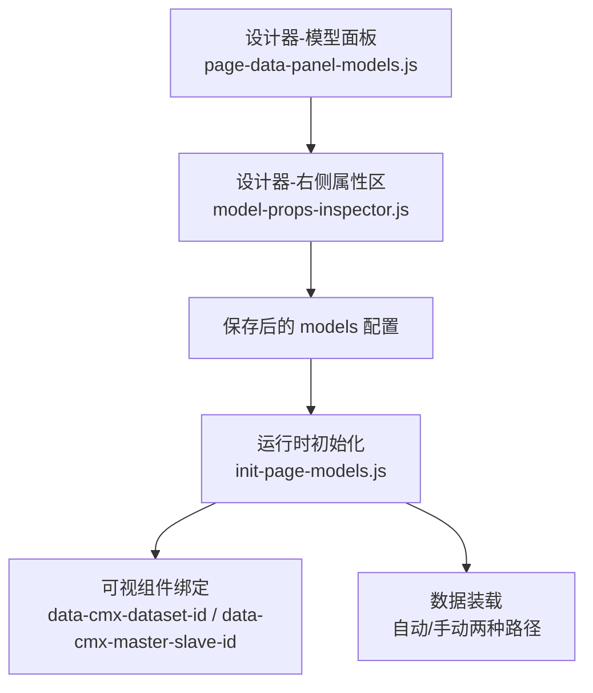
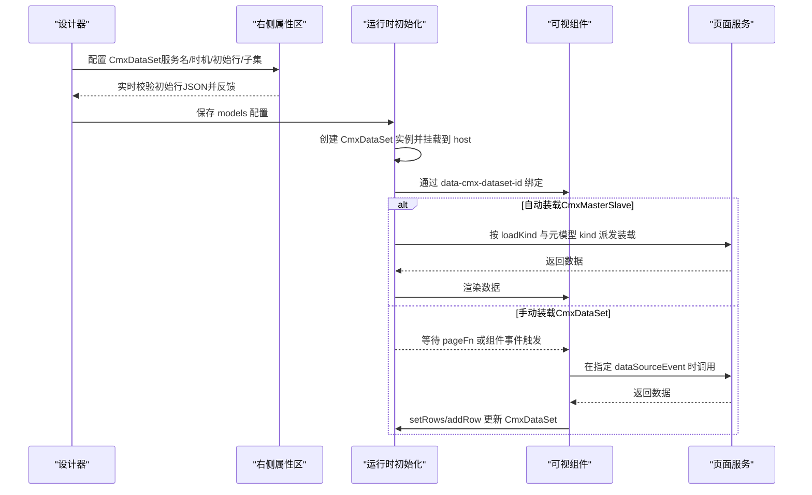
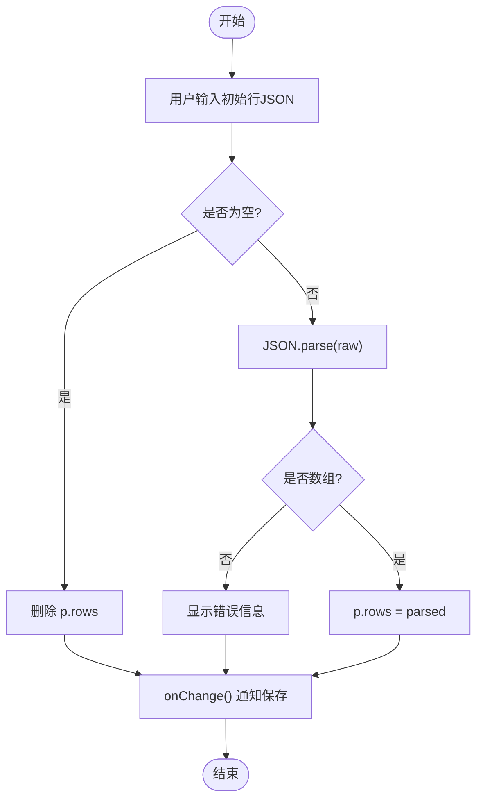
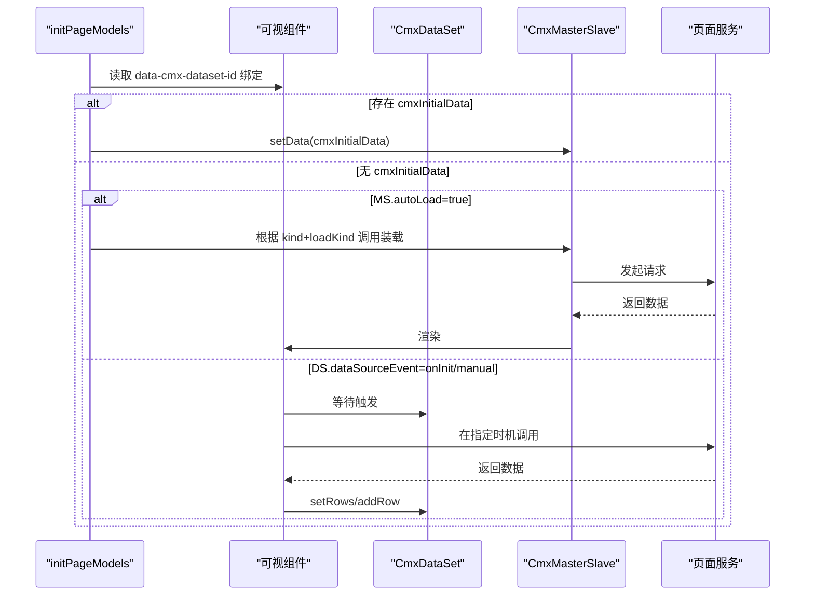
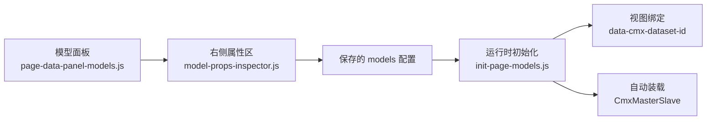

# 数据集模型属性编辑

<cite>
**本文引用的文件**
- [CMXHTMLDesigner/src/components/designer-page-data/models-props-dataset.js](file://CMXHTMLDesigner/src/components/designer-page-data/models-props-dataset.js)
- [CMXHTMLDesigner/src/components/designer-page-data/page-data-panel-models.js](file://CMXHTMLDesigner/src/components/designer-page-data/page-data-panel-models.js)
- [CMXHTMLDesigner/src/components/designer-inspector/model-props-inspector.js](file://CMXHTMLDesigner/src/components/designer-inspector/model-props-inspector.js)
- [packages/cmx-data-comp/src/lib/init-page-models.js](file://packages/cmx-data-comp/src/lib/init-page-models.js)
- [.agents/skills/html-page-generator/references/model-dataset.md](file://.agents/skills/html-page-generator/references/model-dataset.md)
</cite>

## 目录
1. [简介](#简介)
2. [项目结构](#项目结构)
3. [核心组件](#核心组件)
4. [架构总览](#架构总览)
5. [详细组件分析](#详细组件分析)
6. [依赖关系分析](#依赖关系分析)
7. [性能考虑](#性能考虑)
8. [故障排查指南](#故障排查指南)
9. [结论](#结论)
10. [附录](#附录)

## 简介
本技术文档围绕“数据集模型（CmxDataSet）属性编辑器”展开，面向设计器与运行时两端，系统性说明：
- 数据集实例配置、数据源绑定机制与初始数据加载流程
- 服务函数调用时机配置：手动装载模式 vs 自动加载模式
- 子数据集的层级关系配置与数据映射规则
- JSON 数组数据的验证机制、错误处理与实时预览
- 数据集与页面服务的集成方案与性能优化建议

目标读者包括页面设计师、前端工程师与平台维护人员。

## 项目结构
与 CmxDataSet 属性编辑相关的代码主要分布在以下位置：
- 设计器“模型面板”：负责拖拽创建模型实例、默认属性初始化、事件脚本编辑
- 设计器“右侧属性区”：提供 CmxDataSet 的属性编辑界面（服务名、调用时机、初始行、子数据集）
- 运行时初始化：将设计期 models 配置转换为运行时实例，并执行视图绑定与数据装载
- 参考文档：对 CmxDataSet 的 props、children、dataSourceEvent 等语义进行说明

图表来源
- [CMXHTMLDesigner/src/components/designer-page-data/page-data-panel-models.js:66-95](file://CMXHTMLDesigner/src/components/designer-page-data/page-data-panel-models.js#L66-L95)
- [CMXHTMLDesigner/src/components/designer-inspector/model-props-inspector.js:140-220](file://CMXHTMLDesigner/src/components/designer-inspector/model-props-inspector.js#L140-L220)
- [packages/cmx-data-comp/src/lib/init-page-models.js:970-1026](file://packages/cmx-data-comp/src/lib/init-page-models.js#L970-L1026)

章节来源
- [CMXHTMLDesigner/src/components/designer-page-data/page-data-panel-models.js:66-95](file://CMXHTMLDesigner/src/components/designer-page-data/page-data-panel-models.js#L66-L95)
- [CMXHTMLDesigner/src/components/designer-inspector/model-props-inspector.js:140-220](file://CMXHTMLDesigner/src/components/designer-inspector/model-props-inspector.js#L140-L220)
- [packages/cmx-data-comp/src/lib/init-page-models.js:970-1026](file://packages/cmx-data-comp/src/lib/init-page-models.js#L970-L1026)

## 核心组件
- 模型面板（Models Panel）
  - 负责从调色板拖入模型实例，生成默认 props（包含 dataSource、dataSourceEvent、children 等）
  - 提供事件脚本编辑能力（内置事件提示与上下文补全）
- 右侧属性区（Inspector）
  - 针对 CmxDataSet 提供属性编辑：实例名、服务函数名、调用时机、初始行 JSON、子数据集映射
  - 对初始行 JSON 进行实时解析与错误提示
- 运行时初始化（Init Page Models）
  - 根据 models 配置创建 CmxDataSet 实例并挂载到 host
  - 完成视图绑定（data-cmx-dataset-id）与可选的自动装载（CmxMasterSlave autoLoad）
  - 支持显式 cmxInitialData 覆盖自动装载

章节来源
- [CMXHTMLDesigner/src/components/designer-page-data/page-data-panel-models.js:66-95](file://CMXHTMLDesigner/src/components/designer-page-data/page-data-panel-models.js#L66-L95)
- [CMXHTMLDesigner/src/components/designer-inspector/model-props-inspector.js:140-220](file://CMXHTMLDesigner/src/components/designer-inspector/model-props-inspector.js#L140-L220)
- [packages/cmx-data-comp/src/lib/init-page-models.js:970-1026](file://packages/cmx-data-comp/src/lib/init-page-models.js#L970-L1026)

## 架构总览
下图展示从设计器到运行时的完整链路：设计期配置 → 运行时实例化 → 视图绑定 → 数据装载（自动/手动）。

图表来源
- [CMXHTMLDesigner/src/components/designer-inspector/model-props-inspector.js:140-220](file://CMXHTMLDesigner/src/components/designer-inspector/model-props-inspector.js#L140-L220)
- [packages/cmx-data-comp/src/lib/init-page-models.js:970-1026](file://packages/cmx-data-comp/src/lib/init-page-models.js#L970-L1026)
- [.agents/skills/html-page-generator/references/model-dataset.md:32-86](file://.agents/skills/html-page-generator/references/model-dataset.md#L32-L86)

## 详细组件分析

### CmxDataSet 属性编辑器（右侧 Inspector）
- 功能要点
  - 实例名：用于运行时通过 host.<instanceId> 访问
  - 服务函数名：指向 pageServices 中已定义的服务名称
  - 调用时机：onInit（页面初始化时）或 manual（手动调用）
  - 初始行数据：JSON 数组文本框，输入即解析并实时校验
  - 子数据集：维护 childId -> instanceId 的映射，用于父行 _children 中的子数据集占位
- 交互与校验
  - 空值时删除 rows 字段；非空则尝试 JSON.parse，要求为数组
  - 解析失败时在错误区域显示具体错误信息
  - 子数据集列表支持增删改，变更即时触发 onChange 持久化

图表来源
- [CMXHTMLDesigner/src/components/designer-inspector/model-props-inspector.js:166-186](file://CMXHTMLDesigner/src/components/designer-inspector/model-props-inspector.js#L166-L186)

章节来源
- [CMXHTMLDesigner/src/components/designer-inspector/model-props-inspector.js:140-220](file://CMXHTMLDesigner/src/components/designer-inspector/model-props-inspector.js#L140-L220)

### 模型面板（Models Panel）与默认属性
- 默认属性
  - CmxDataSet：{ dataSource: '', dataSourceEvent: 'onInit', children: [] }
- 行为
  - 拖拽创建模型实例，分配唯一 id 与 instanceId
  - 选择模型后渲染右侧属性区与事件 Tab
  - 事件脚本支持预设事件与自定义事件，提供上下文变量提示

章节来源
- [CMXHTMLDesigner/src/components/designer-page-data/page-data-panel-models.js:66-95](file://CMXHTMLDesigner/src/components/designer-page-data/page-data-panel-models.js#L66-L95)
- [CMXHTMLDesigner/src/components/designer-page-data/page-data-panel-models.js:119-151](file://CMXHTMLDesigner/src/components/designer-page-data/page-data-panel-models.js#L119-L151)

### 运行时初始化与数据装载
- 视图绑定
  - 优先使用 data-cmx-master-slave-id 精确绑定（表单/表格）
  - 兼容旧方式：仅 data-cmx-dataset-id 时直接设置 dataset 到组件
- 初始数据装载
  - 若存在 $data.cmxInitialData，则优先 setData 覆盖（跳过 autoLoad）
  - 否则进入 autoLoad 流程（仅 CmxMasterSlave），依据 metaModel.kind + loadKind 派发到对应方法
- CmxDataSet 的数据来源
  - 走 pageService：由 pageFns 或可视组件在 dataSourceEvent 触发时调用
  - 静态 rows：initPageModels 创建实例后 setRows(p.rows)
  - 空：运行时由 pageFn 主动 addRow/setRows

图表来源
- [packages/cmx-data-comp/src/lib/init-page-models.js:970-1026](file://packages/cmx-data-comp/src/lib/init-page-models.js#L970-L1026)
- [.agents/skills/html-page-generator/references/model-dataset.md:32-86](file://.agents/skills/html-page-generator/references/model-dataset.md#L32-L86)

章节来源
- [packages/cmx-data-comp/src/lib/init-page-models.js:970-1026](file://packages/cmx-data-comp/src/lib/init-page-models.js#L970-L1026)
- [.agents/skills/html-page-generator/references/model-dataset.md:32-86](file://.agents/skills/html-page-generator/references/model-dataset.md#L32-L86)

### 子数据集层级关系与数据映射
- 配置方式
  - 父 DataSet.props.children 中声明子数据集映射：childId -> instanceId
  - 运行时父行 addRow 会为子 DataSet 创建占位行（row._children: { detailDs: CmxDataSet }）
- 适用场景
  - 树形数据展示与简单父子联动
  - 需要更复杂的“选父刷表、改值聚合”场景建议升级到 CmxMasterSlave

章节来源
- [.agents/skills/html-page-generator/references/model-dataset.md:90-114](file://.agents/skills/html-page-generator/references/model-dataset.md#L90-L114)
- [CMXHTMLDesigner/src/components/designer-inspector/model-props-inspector.js:188-219](file://CMXHTMLDesigner/src/components/designer-inspector/model-props-inspector.js#L188-L219)

### 服务函数调用时机与模式对比
- 手动装载模式（CmxDataSet）
  - dataSourceEvent 设为 manual 或在 pageFns 中按需调用
  - 适合复杂业务逻辑、条件加载、组合多服务结果
- 自动加载模式（CmxMasterSlave）
  - 勾选 autoLoad，并设置 loadKind（list/detail）
  - 由元模型 kind（DOC/DCT）决定具体装载方法（loadDoc/loadDict）
  - 适合标准列表/详情场景，减少手写脚本

章节来源
- [CMXHTMLDesigner/src/components/designer-inspector/model-props-inspector.js:148-152](file://CMXHTMLDesigner/src/components/designer-inspector/model-props-inspector.js#L148-L152)
- [packages/cmx-data-comp/src/lib/init-page-models.js:1003-1026](file://packages/cmx-data-comp/src/lib/init-page-models.js#L1003-L1026)

### JSON 数组数据验证与实时预览
- 实时解析：每次输入都尝试 JSON.parse，确保为数组
- 错误处理：解析失败时显示错误信息，不污染 p.rows
- 预览效果：正确 JSON 会立即写入 p.rows，便于后续设计与运行时预览

章节来源
- [CMXHTMLDesigner/src/components/designer-inspector/model-props-inspector.js:166-186](file://CMXHTMLDesigner/src/components/designer-inspector/model-props-inspector.js#L166-L186)

## 依赖关系分析
- 设计器侧
  - 模型面板依赖默认属性构建器与事件脚本提示
  - 右侧属性区依赖页面服务列表与模型实例列表以提供下拉候选
- 运行时侧
  - initPageModels 依赖 DOM 属性进行视图绑定
  - 自动装载依赖元模型 kind 与 loadKind 的派发表

图表来源
- [CMXHTMLDesigner/src/components/designer-page-data/page-data-panel-models.js:66-95](file://CMXHTMLDesigner/src/components/designer-page-data/page-data-panel-models.js#L66-L95)
- [CMXHTMLDesigner/src/components/designer-inspector/model-props-inspector.js:140-220](file://CMXHTMLDesigner/src/components/designer-inspector/model-props-inspector.js#L140-L220)
- [packages/cmx-data-comp/src/lib/init-page-models.js:970-1026](file://packages/cmx-data-comp/src/lib/init-page-models.js#L970-L1026)

章节来源
- [CMXHTMLDesigner/src/components/designer-page-data/page-data-panel-models.js:66-95](file://CMXHTMLDesigner/src/components/designer-page-data/page-data-panel-models.js#L66-L95)
- [CMXHTMLDesigner/src/components/designer-inspector/model-props-inspector.js:140-220](file://CMXHTMLDesigner/src/components/designer-inspector/model-props-inspector.js#L140-L220)
- [packages/cmx-data-comp/src/lib/init-page-models.js:970-1026](file://packages/cmx-data-comp/src/lib/init-page-models.js#L970-L1026)

## 性能考虑
- 避免重复请求
  - 使用自动装载时，确保仅在必要时启用 autoLoad，避免与显式 cmxInitialData 冲突导致重复装载
- 控制数据规模
  - 列表模式下合理设置 limit 与 pageSize，结合分页组件（cmx-pager）提升体验
- 懒加载与深度控制
  - 使用 depth 限制递归层数，按需下钻以减少首屏压力
- 列式压缩
  - 字典场景可开启 binary（msgpack）降低传输体积

[本节为通用指导，无需特定文件引用]

## 故障排查指南
- 自动装载被跳过
  - 检查是否存在 $data.cmxInitialData（会优先覆盖并跳过 autoLoad）
  - 确认 loadKind 已设置且 metaModelId 指向有效的元模型实例
- 视图未渲染数据
  - 确认组件上设置了正确的 data-cmx-dataset-id 或 data-cmx-master-slave-id
  - 对于 CmxDataSet，确认 dataSourceEvent 与 pageFn 调用是否正确
- JSON 初始行错误
  - 检查右侧属性区的错误提示，确保为合法 JSON 数组
- 子数据集未生效
  - 检查 children 映射中 childId 与 instanceId 是否一致
  - 确认父行已 addRow，以便为子 DataSet 创建占位

章节来源
- [packages/cmx-data-comp/src/lib/init-page-models.js:996-1026](file://packages/cmx-data-comp/src/lib/init-page-models.js#L996-L1026)
- [CMXHTMLDesigner/src/components/designer-inspector/model-props-inspector.js:166-186](file://CMXHTMLDesigner/src/components/designer-inspector/model-props-inspector.js#L166-L186)

## 结论
CmxDataSet 属性编辑器在设计器与运行时之间提供了清晰的配置与执行契约：
- 设计期通过直观界面配置数据源、调用时机、初始行与子数据集
- 运行期通过统一的初始化流程完成实例化、视图绑定与数据装载
- 手动装载与自动加载模式互补，满足不同复杂度场景
- 严格的 JSON 校验与错误提示保障配置质量
- 结合分页、深度控制与列式压缩等手段可实现良好的性能表现

[本节为总结性内容，无需特定文件引用]

## 附录
- 典型配置示例与最佳实践请参考参考文档中对 CmxDataSet 的说明与模板
- 建议在复杂主从联动场景中评估升级至 CmxMasterSlave，以获得更强的自动刷表与聚合能力

[本节为补充说明，无需特定文件引用]