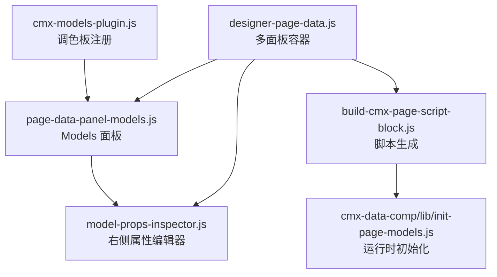
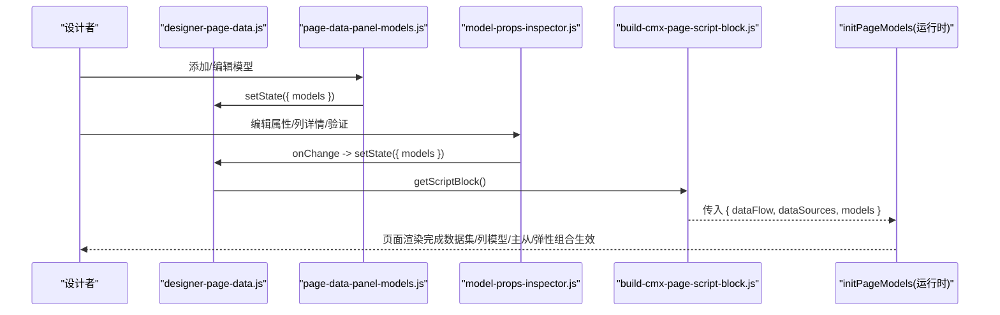
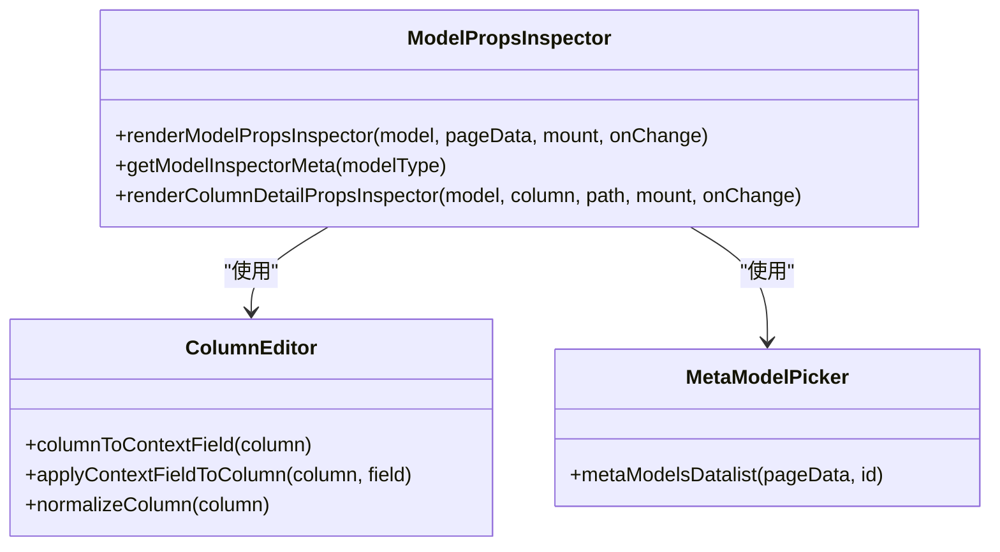
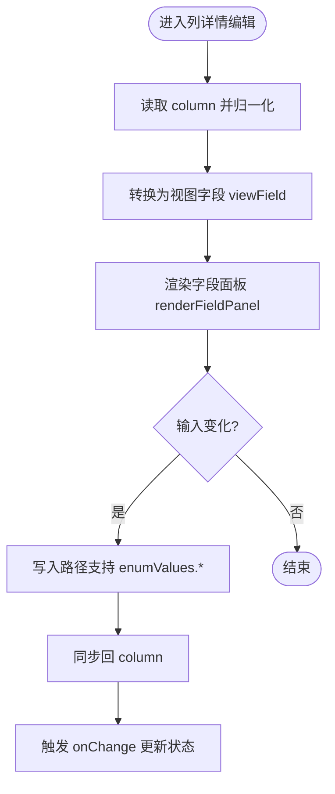
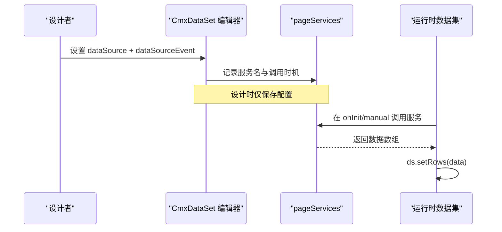
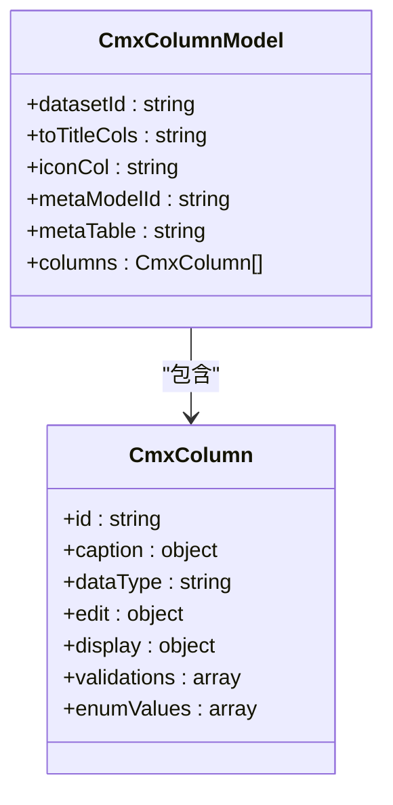
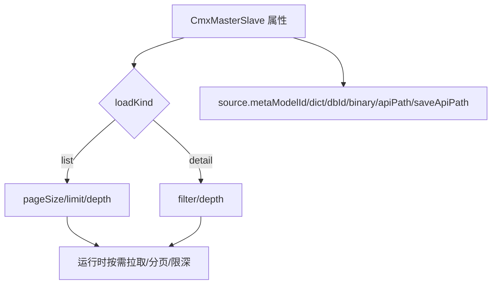
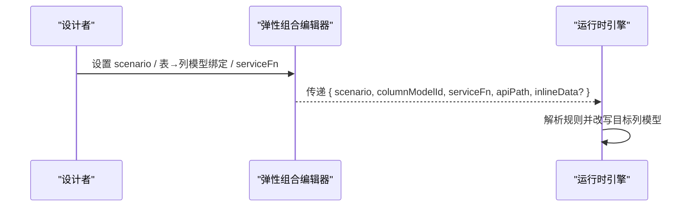
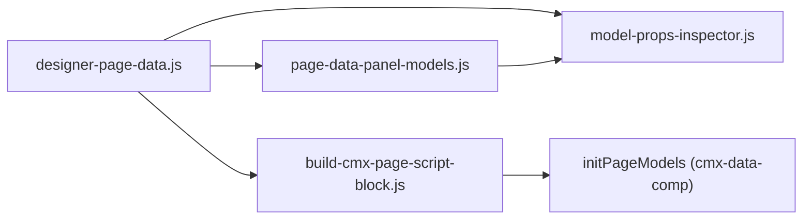

# 模型属性面板

<cite>
**本文引用的文件**
- [models-panel-spec.md](file://CMXHTMLDesigner/docs/models-panel-spec.md)
- [designer-page-data.js](file://CMXHTMLDesigner/src/components/designer-page-data.js)
- [build-cmx-page-script-block.js](file://CMXHTMLDesigner/src/utils/build-cmx-page-script-block.js)
- [cmx-models-plugin.js](file://CMXHTMLDesigner/src/plugins/cmx-models-plugin.js)
- [model-props-inspector.js](file://CMXHTMLDesigner/src/components/designer-inspector/model-props-inspector.js)
- [page-data-panel-models.js](file://CMXHTMLDesigner/src/components/designer-page-data/page-data-panel-models.js)
- [models-props-dataset.js](file://CMXHTMLDesigner/src/components/designer-page-data/models-props-dataset.js)
- [models-props-columnmodel.js](file://CMXHTMLDesigner/src/components/designer-page-data/models-props-columnmodel.js)
- [models-props-masterslave.js](file://CMXHTMLDesigner/src/components/designer-page-data/models-props-masterslave.js)
- [models-props-flexible-combination.js](file://CMXHTMLDesigner/src/components/designer-page-data/models-props-flexible-combination.js)
- [models-props-meta.js](file://CMXHTMLDesigner/src/components/designer-page-data/models-props-meta.js)
</cite>

## 目录
1. [简介](#简介)
2. [项目结构](#项目结构)
3. [核心组件](#核心组件)
4. [架构总览](#架构总览)
5. [详细组件分析](#详细组件分析)
6. [依赖关系分析](#依赖关系分析)
7. [性能考虑](#性能考虑)
8. [故障排查指南](#故障排查指南)
9. [结论](#结论)
10. [附录](#附录)

## 简介
本技术文档围绕“模型属性面板”展开，聚焦以下目标：
- 模型类型检测、属性元数据获取与动态表单生成机制
- 不同类型模型的属性编辑器实现（数据集配置、列定义、验证规则）
- 模型事件的可视化编辑、预设事件支持与自定义事件处理
- 模型与页面数据的绑定机制、数据源配置与实时更新
- 模型扩展的开发指南与集成方案

该能力将设计器中的“不可见 JS 对象”（如 CmxDataSet、CmxColumnModel、CmxMasterSlave、弹性组合等）以可视化的方式暴露给设计者，并通过脚本生成管道在运行时自动实例化并绑定到画布元素。

## 项目结构
与模型属性面板直接相关的代码主要分布在 CMXHTMLDesigner 中：
- 设计器数据面板容器：负责多标签页切换、状态序列化/反序列化、导出脚本
- Models 面板：新增的“模型”子面板，承载 CmxDataSet / CmxColumnModel / CmxMasterSlave / 弹性组合等模型的增删改查
- 右侧 Inspector：按模型类型渲染属性编辑表单，支持列详情编辑、验证规则管理、元数据绑定等
- 插件体系：注册“CMX 模型”分组与不可视模型项，向全局暴露运行时类引用
- 脚本生成：将 models 配置转换为运行时初始化代码，委托给 cmx-data-comp 的 initPageModels

图表来源
- [designer-page-data.js:65-119](file://CMXHTMLDesigner/src/components/designer-page-data.js#L65-L119)
- [build-cmx-page-script-block.js:284-298](file://CMXHTMLDesigner/src/utils/build-cmx-page-script-block.js#L284-L298)
- [cmx-models-plugin.js:39-117](file://CMXHTMLDesigner/src/plugins/cmx-models-plugin.js#L39-L117)

章节来源
- [designer-page-data.js:1-305](file://CMXHTMLDesigner/src/components/designer-page-data.js#L1-L305)
- [models-panel-spec.md:1-374](file://CMXHTMLDesigner/docs/models-panel-spec.md#L1-L374)

## 核心组件
- 设计器数据面板容器（designer-page-data.js）
  - 提供 setView/getState/setState，统一维护 pageData/pageFns/pageServices/pageDeps/pageInterfaces/dataFlow/models
  - 通过 TabManager 切换 data/fn/svc/flow/test/deps/models 等子面板
  - 导出 getScriptBlock 调用 build-cmx-page-script-block 生成完整运行脚本
- Models 面板（page-data-panel-models.js）
  - 承载模型列表、添加/删除、树形子集管理、与服务/列定义的关联
  - 提供 getModelsState/setModelsState 与容器交互
- 右侧属性编辑器（model-props-inspector.js）
  - 根据 modelType 分派到具体渲染函数：renderDataSet/renderMasterSlave/renderColumnModel/renderFlexibleCombination
  - 支持列详情编辑、验证规则增删、枚举值编辑、元数据模型绑定
- 脚本生成（build-cmx-page-script-block.js）
  - 读取 state.models，构造 { dataFlow, dataSources, models } 并调用 initPageModels
  - 为页面注入 $data、pageFns、pageServices、对外接口、事件水合等
- 插件注册（cmx-models-plugin.js）
  - 注册“CMX 模型”分组与不可视模型项（CmxDataSet/CmxMasterSlave/CmxColumnModel/CmxDCTMeta/CmxDOCMeta/FlexibleCombination）
  - 暴露 __cmxDataComp 与 __cmxInitPageModels 供设计时与调试使用

章节来源
- [designer-page-data.js:35-119](file://CMXHTMLDesigner/src/components/designer-page-data.js#L35-L119)
- [model-props-inspector.js:7-31](file://CMXHTMLDesigner/src/components/designer-inspector/model-props-inspector.js#L7-L31)
- [build-cmx-page-script-block.js:28-313](file://CMXHTMLDesigner/src/utils/build-cmx-page-script-block.js#L28-L313)
- [cmx-models-plugin.js:21-117](file://CMXHTMLDesigner/src/plugins/cmx-models-plugin.js#L21-L117)

## 架构总览
模型属性面板的工作流分为“设计时”和“运行时”两个阶段：
- 设计时
  - 用户在 Models 面板创建/编辑模型（数据集、列模型、主从协调器、弹性组合）
  - 右侧 Inspector 提供细粒度属性编辑（含列详情、验证规则、元数据绑定）
  - 所有变更通过 setState/getState 持久化到 __designer_meta__.models
- 运行时
  - 构建脚本时读取 models，生成初始化代码并调用 initPageModels
  - 运行时由 cmx-data-comp 完成模型实例化、服务加载、列模型应用、主从协调与数据绑定

图表来源
- [designer-page-data.js:109-119](file://CMXHTMLDesigner/src/components/designer-page-data.js#L109-L119)
- [build-cmx-page-script-block.js:284-298](file://CMXHTMLDesigner/src/utils/build-cmx-page-script-block.js#L284-L298)

## 详细组件分析

### 模型类型检测与元数据获取
- 模型类型映射
  - 右侧 Inspector 通过 MODEL_META 与 renderModelPropsInspector 的分发表识别模型类型（CmxDataSet、CmxMasterSlave、CmxColumnModel、FlexibleCombination）
  - 未注册的模型类型会显示“暂无右侧属性编辑器”提示
- 元数据与上下文
  - 列详情编辑通过 makeFlcAdapter 与 renderFieldPanel 复用字段编辑能力
  - 列到上下文字段的转换（columnToContextField/applyContextFieldToColumn）保证 UI 与底层列结构一致
  - 元数据模型（CmxDCTMeta/CmxDOCMeta）实例列表通过 metaModelsDatalist 提供给选择器

图表来源
- [model-props-inspector.js:7-31](file://CMXHTMLDesigner/src/components/designer-inspector/model-props-inspector.js#L7-L31)
- [model-props-inspector.js:541-590](file://CMXHTMLDesigner/src/components/designer-inspector/model-props-inspector.js#L541-L590)
- [model-props-inspector.js:319-323](file://CMXHTMLDesigner/src/components/designer-inspector/model-props-inspector.js#L319-L323)

章节来源
- [model-props-inspector.js:7-31](file://CMXHTMLDesigner/src/components/designer-inspector/model-props-inspector.js#L7-L31)
- [model-props-inspector.js:541-590](file://CMXHTMLDesigner/src/components/designer-inspector/model-props-inspector.js#L541-L590)

### 动态表单生成与属性编辑
- 通用表单控件
  - textRow/selectRow/textareaRow/checkboxRow/numberRow 等辅助函数快速生成属性行
  - bindInput/bindSelect/bindCheckbox/bindNumber 统一事件绑定与写回
- 列详情编辑
  - 支持 validations 增删、enumValues 增删、edit.mode 切换后重渲染
  - 通过 fieldId 与 makeFlcAdapter 进行路径写入，兼容数组下标场景
- 元数据绑定
  - CmxColumnModel 支持 metaModelId/metaTable 绑定，运行时自动生成列定义
  - CmxMasterSlave 支持自动加载（list/detail）、分页/限制/深度/过滤等参数

图表来源
- [model-props-inspector.js:37-128](file://CMXHTMLDesigner/src/components/designer-inspector/model-props-inspector.js#L37-L128)
- [model-props-inspector.js:520-539](file://CMXHTMLDesigner/src/components/designer-inspector/model-props-inspector.js#L520-L539)

章节来源
- [model-props-inspector.js:37-128](file://CMXHTMLDesigner/src/components/designer-inspector/model-props-inspector.js#L37-L128)
- [model-props-inspector.js:520-539](file://CMXHTMLDesigner/src/components/designer-inspector/model-props-inspector.js#L520-L539)

### 数据集配置（CmxDataSet）
- 属性编辑
  - 实例名、初始数据来源（服务函数名 + 调用时机）、初始行数据 JSON、子数据集树
  - 子数据集通过 childId -> instanceId 建立父子关系
- 运行时行为
  - 通过 pageServices 声明的服务函数在 onInit/manual 时调用，结果填充到数据集
  - 子数据集在 addRow 时挂入父数据集 _children

图表来源
- [model-props-inspector.js:140-220](file://CMXHTMLDesigner/src/components/designer-inspector/model-props-inspector.js#L140-L220)
- [models-panel-spec.md:223-245](file://CMXHTMLDesigner/docs/models-panel-spec.md#L223-L245)

章节来源
- [model-props-inspector.js:140-220](file://CMXHTMLDesigner/src/components/designer-inspector/model-props-inspector.js#L140-L220)
- [models-panel-spec.md:223-245](file://CMXHTMLDesigner/docs/models-panel-spec.md#L223-L245)

### 列定义与验证规则（CmxColumnModel）
- 列来源
  - 手动定义：在 Models 面板或列编辑器中添加列
  - 元数据驱动：绑定 CmxDCTMeta/CmxDOCMeta 实例与表/字典编码，运行时自动生成列
- 列属性
  - id/caption/type/width/edit/display/validations/enumValues 等
  - editSettings.dependents 用于联动计算
- 验证规则
  - 支持 validations 数组（expr/message），可动态增删
  - 枚举值支持 value/label 行编辑

图表来源
- [model-props-inspector.js:292-317](file://CMXHTMLDesigner/src/components/designer-inspector/model-props-inspector.js#L292-L317)
- [model-props-inspector.js:559-590](file://CMXHTMLDesigner/src/components/designer-inspector/model-props-inspector.js#L559-L590)

章节来源
- [model-props-inspector.js:292-317](file://CMXHTMLDesigner/src/components/designer-inspector/model-props-inspector.js#L292-L317)
- [model-props-inspector.js:559-590](file://CMXHTMLDesigner/src/components/designer-inspector/model-props-inspector.js#L559-L590)

### 主从协调器（CmxMasterSlave）
- 可视化编辑
  - 自动加载开关、加载形态（list/detail）
  - 数据源：元模型实例、模块编码、字典编码、数据库标识、是否二进制压缩、接口覆盖
  - 列表模式：pageSize/limit/depth；详情模式：filter/depth
- 与 dataFlow 的关系
  - schema/aggregations/relations 在“数据流”面板维护，Models 面板侧重加载策略与数据源

图表来源
- [model-props-inspector.js:222-290](file://CMXHTMLDesigner/src/components/designer-inspector/model-props-inspector.js#L222-L290)

章节来源
- [model-props-inspector.js:222-290](file://CMXHTMLDesigner/src/components/designer-inspector/model-props-inspector.js#L222-L290)

### 弹性组合（FlexibleCombination）
- 后端定位
  - scenario（必填），业务域/应用/模块由页面坐标继承
- 目标列模型绑定
  - 按表绑定到 CmxColumnModel 实例（支持 * 兜底）
- 取数来源
  - serviceFn 优先于默认 apiPath
  - 支持 inlineData 内联规则（预览/demo 场景）

图表来源
- [model-props-inspector.js:325-424](file://CMXHTMLDesigner/src/components/designer-inspector/model-props-inspector.js#L325-L424)

章节来源
- [model-props-inspector.js:325-424](file://CMXHTMLDesigner/src/components/designer-inspector/model-props-inspector.js#L325-L424)

### 模型事件与脚本
- 事件水合
  - 脚本生成时在 connectedCallback 末尾调用 __hydrateEvents(root, host)，将画布元素的事件绑定到宿主方法
- 预设事件与自定义事件
  - 设计器侧通过 event-script-hints 等机制提供事件建议与提示
  - 作者可在 pageFns 中编写自定义事件处理逻辑，并在运行时通过 host 方法调用
- 与 Models 的协作
  - 数据集加载时机（onInit/manual）即一种“事件”；主从协调器的自动加载也受 loadKind 控制

章节来源
- [build-cmx-page-script-block.js:282-298](file://CMXHTMLDesigner/src/utils/build-cmx-page-script-block.js#L282-L298)
- [models-panel-spec.md:169-219](file://CMXHTMLDesigner/docs/models-panel-spec.md#L169-L219)

### 模型与页面数据绑定、数据源配置与实时更新
- 绑定机制
  - 脚本生成阶段将 $data 注入宿主，并通过 Proxy 实现双向绑定
  - 模型（数据集/列模型/主从/弹性组合）通过 initPageModels 统一初始化
- 数据源配置
  - pageServices 声明 REST/JSON-RPC/WebSocket 等服务
  - CmxDataSet.dataSource 指向服务名，dataSourceEvent 指定调用时机
- 实时更新
  - 设计时修改 models → setState → getScriptBlock → 重新生成脚本 → 运行时刷新
  - 列详情编辑实时写回 column 并触发 onChange

章节来源
- [designer-page-data.js:109-119](file://CMXHTMLDesigner/src/components/designer-page-data.js#L109-L119)
- [build-cmx-page-script-block.js:110-163](file://CMXHTMLDesigner/src/utils/build-cmx-page-script-block.js#L110-L163)
- [build-cmx-page-script-block.js:284-298](file://CMXHTMLDesigner/src/utils/build-cmx-page-script-block.js#L284-L298)

### 模型扩展开发指南与集成方案
- 新增模型类型
  - 在 cmx-models-plugin.js 的 components 中注册新模型（tag/group/label/description/modelOnly 等）
  - 在 model-props-inspector.js 的 MODEL_META 与 renderModelPropsInspector 分发表中加入对应渲染器
- 运行时支持
  - 若需自定义初始化逻辑，可在 initPageModels 前后钩入或通过 pageFns 扩展
  - 通过 __cmxDataComp 暴露运行时类，便于调试与控制台使用
- 与现有架构兼容
  - 不破坏现有 dataFlow/pageServices 等配置
  - 向后兼容：无 models 字段时跳过模型初始化

章节来源
- [cmx-models-plugin.js:39-117](file://CMXHTMLDesigner/src/plugins/cmx-models-plugin.js#L39-L117)
- [model-props-inspector.js:7-31](file://CMXHTMLDesigner/src/components/designer-inspector/model-props-inspector.js#L7-L31)
- [models-panel-spec.md:347-355](file://CMXHTMLDesigner/docs/models-panel-spec.md#L347-L355)

## 依赖关系分析
- 组件耦合
  - designer-page-data.js 作为容器，聚合多个子面板与工具模块
  - page-data-panel-models.js 与 model-props-inspector.js 强耦合（编辑与展示）
  - build-cmx-page-script-block.js 依赖 page-services 生成逻辑与界面注册表
- 外部依赖
  - cmx-data-comp：运行时模型库（CmxDataSet/CmxColumnModel/CmxMasterSlave/弹性组合等）
  - initPageModels：统一的模型初始化入口
- 潜在循环依赖
  - 当前未见明显循环；脚本生成与运行时初始化解耦

图表来源
- [designer-page-data.js:65-119](file://CMXHTMLDesigner/src/components/designer-page-data.js#L65-L119)
- [build-cmx-page-script-block.js:284-298](file://CMXHTMLDesigner/src/utils/build-cmx-page-script-block.js#L284-L298)

章节来源
- [designer-page-data.js:65-119](file://CMXHTMLDesigner/src/components/designer-page-data.js#L65-L119)
- [build-cmx-page-script-block.js:284-298](file://CMXHTMLDesigner/src/utils/build-cmx-page-script-block.js#L284-L298)

## 性能考虑
- 设计时
  - 列详情编辑采用局部 DOM 更新与最小化 re-render，避免全量重建
  - 大列表（如列/服务/模型）建议使用虚拟滚动或分页渲染（可扩展）
- 运行时
  - 数据集批量 setRows 优于逐行插入
  - 主从协调器按需懒加载（depth 控制）减少首屏压力
  - 列模型从元数据生成时注意缓存与去重

[本节为通用指导，无需特定文件来源]

## 故障排查指南
- 模型类型未识别
  - 检查 cmx-models-plugin.js 是否注册了该模型类型
  - 检查 model-props-inspector.js 的 MODEL_META 与分发表
- 列详情编辑无效
  - 确认 normalizeColumn/columnToContextField/applyContextFieldToColumn 正确执行
  - 检查 enumValues.* 路径写入是否走专用 writeEnumPath
- 数据集未加载
  - 确认 pageServices 已声明且名称匹配
  - 检查 dataSourceEvent 是否为 onInit/manual，并确保服务返回数组
- 脚本生成失败
  - 查看控制台警告信息（initPageModels 失败日志）
  - 校验 models JSON 结构是否符合规范

章节来源
- [model-props-inspector.js:37-128](file://CMXHTMLDesigner/src/components/designer-inspector/model-props-inspector.js#L37-L128)
- [model-props-inspector.js:520-539](file://CMXHTMLDesigner/src/components/designer-inspector/model-props-inspector.js#L520-L539)
- [build-cmx-page-script-block.js:284-298](file://CMXHTMLDesigner/src/utils/build-cmx-page-script-block.js#L284-L298)

## 结论
模型属性面板通过“设计时可视化 + 运行时自动化”的方式，将复杂的数据层建模工作简化为直观的图形化操作。依托现有的服务、脚本生成与主从协调器基础设施，新增的 Models 面板实现了数据集、列模型、主从协调器与弹性组合的统一管理，并提供完善的属性编辑与验证能力。未来可在此基础上进一步扩展更多模型类型与高级特性。

[本节为总结性内容，无需特定文件来源]

## 附录
- 关键流程参考
  - 模型面板规划与运行时脚本生成：参见 models-panel-spec.md
  - 设计器数据面板容器与状态管理：参见 designer-page-data.js
  - 脚本生成与运行时初始化：参见 build-cmx-page-script-block.js
  - 插件注册与全局类暴露：参见 cmx-models-plugin.js
  - 右侧属性编辑器与列详情编辑：参见 model-props-inspector.js

章节来源
- [models-panel-spec.md:1-374](file://CMXHTMLDesigner/docs/models-panel-spec.md#L1-L374)
- [designer-page-data.js:1-305](file://CMXHTMLDesigner/src/components/designer-page-data.js#L1-L305)
- [build-cmx-page-script-block.js:1-313](file://CMXHTMLDesigner/src/utils/build-cmx-page-script-block.js#L1-L313)
- [cmx-models-plugin.js:1-118](file://CMXHTMLDesigner/src/plugins/cmx-models-plugin.js#L1-L118)
- [model-props-inspector.js:1-712](file://CMXHTMLDesigner/src/components/designer-inspector/model-props-inspector.js#L1-L712)