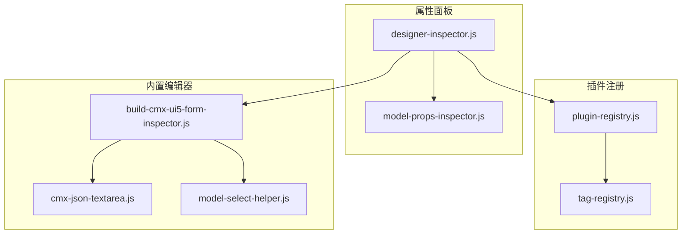
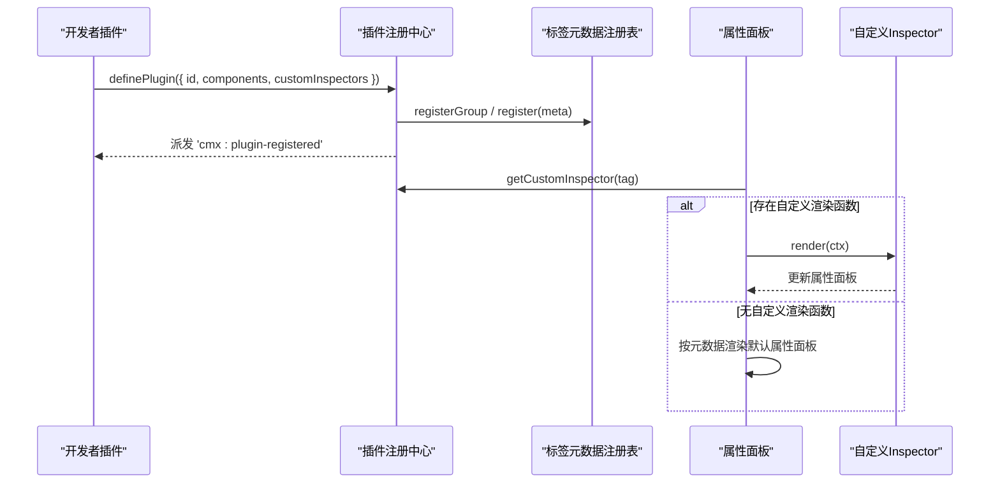
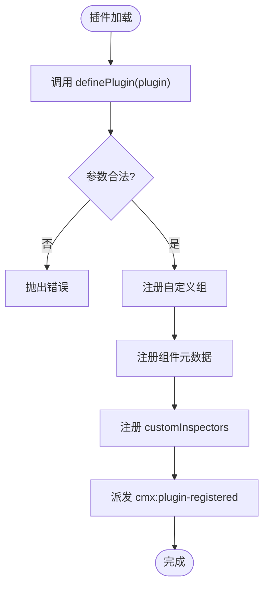
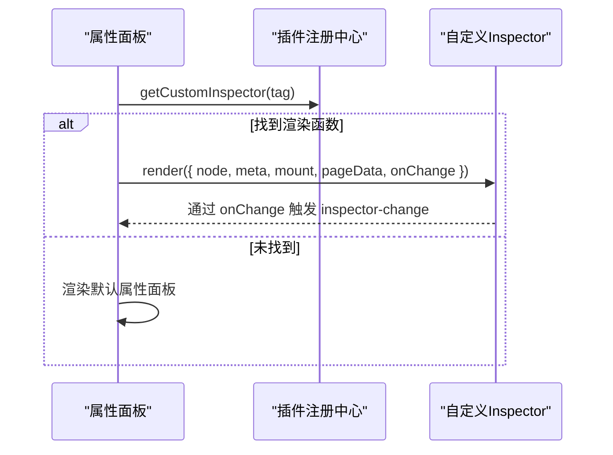
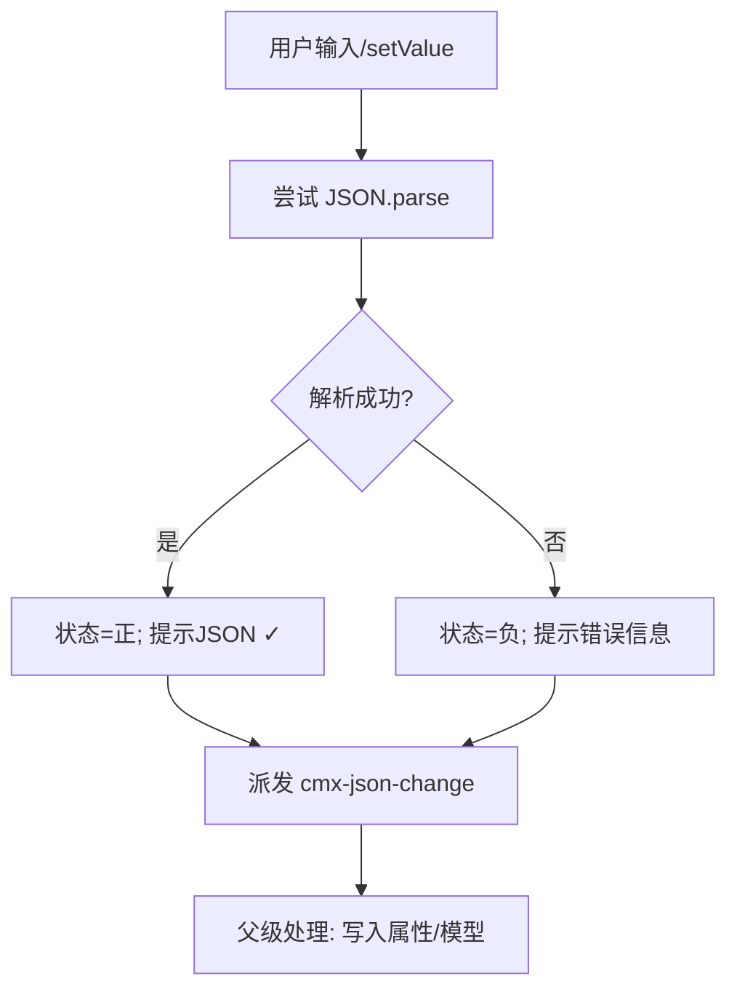
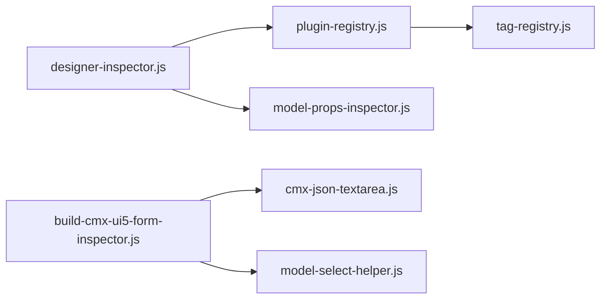

# 自定义属性编辑器

<cite>
**本文引用的文件**
- [plugin-registry.js](file://CMXHTMLDesigner/src/lib/plugin-registry.js)
- [designer-inspector.js](file://CMXHTMLDesigner/src/components/designer-inspector.js)
- [model-props-inspector.js](file://CMXHTMLDesigner/src/components/designer-inspector/model-props-inspector.js)
- [cmx-json-textarea.js](file://CMXHTMLDesigner/src/plugins/cmx-inspector/cmx-json-textarea.js)
- [build-cmx-ui5-form-inspector.js](file://CMXHTMLDesigner/src/plugins/cmx-inspector/build-cmx-ui5-form-inspector.js)
- [model-select-helper.js](file://CMXHTMLDesigner/src/plugins/cmx-inspector/model-select-helper.js)
- [tag-registry.js](file://CMXHTMLDesigner/src/metadata/tag-registry.js)
</cite>

## 目录
1. [简介](#简介)
2. [项目结构](#项目结构)
3. [核心组件](#核心组件)
4. [架构总览](#架构总览)
5. [详细组件分析](#详细组件分析)
6. [依赖关系分析](#依赖关系分析)
7. [性能考量](#性能考量)
8. [故障排查指南](#故障排查指南)
9. [结论](#结论)
10. [附录：开发示例与最佳实践](#附录：开发示例与最佳实践)

## 简介
本技术文档面向在 CMX HTML Designer 中开发“自定义属性编辑器”的工程师，系统阐述插件注册机制、编辑器接口规范与生命周期管理；并基于内置实现（JSON 编辑器、模型选择器、UI5 表单 Inspector）总结可复用的设计模式。文档同时覆盖验证规则、国际化与主题适配要点，并提供完整的开发流程与最佳实践建议。

## 项目结构
与自定义属性编辑器直接相关的代码主要分布在以下模块：
- 插件注册与发现：lib/plugin-registry.js、metadata/tag-registry.js
- 右侧属性面板（Inspector）：components/designer-inspector.js
- 模型属性编辑器：components/designer-inspector/model-props-inspector.js
- 内置编辑器与辅助：plugins/cmx-inspector/*（JSON 编辑器、模型选择行等）

图表来源
- [plugin-registry.js:60-89](file://CMXHTMLDesigner/src/lib/plugin-registry.js#L60-L89)
- [tag-registry.js:15-110](file://CMXHTMLDesigner/src/metadata/tag-registry.js#L15-L110)
- [designer-inspector.js:270-293](file://CMXHTMLDesigner/src/components/designer-inspector.js#L270-L293)
- [build-cmx-ui5-form-inspector.js:22-146](file://CMXHTMLDesigner/src/plugins/cmx-inspector/build-cmx-ui5-form-inspector.js#L22-L146)

章节来源
- [plugin-registry.js:60-89](file://CMXHTMLDesigner/src/lib/plugin-registry.js#L60-L89)
- [designer-inspector.js:270-293](file://CMXHTMLDesigner/src/components/designer-inspector.js#L270-L293)
- [tag-registry.js:15-110](file://CMXHTMLDesigner/src/metadata/tag-registry.js#L15-L110)

## 核心组件
- 插件注册中心（definePlugin/getCustomInspector）
  - 负责注册自定义组、组件元数据与 tag → customInspector 映射，并在注册完成后派发事件以刷新调色板。
- 属性面板（DesignerInspector）
  - 渲染属性/样式/事件/调试四个面板；当选中节点存在自定义 Inspector 时优先调用之。
- 模型属性编辑器（renderModelPropsInspector/renderColumnDetailPropsInspector）
  - 针对 CmxDataSet/CmxMasterSlave/CmxColumnModel/FlexibleCombination 提供专用编辑界面。
- 内置编辑器
  - JSON 文本域（带即时校验与格式化）
  - 模型选择行（从页面模型列表中选择实例 ID）
  - UI5 表单 Inspector（组合上述能力构建表单属性编辑）

章节来源
- [plugin-registry.js:60-95](file://CMXHTMLDesigner/src/lib/plugin-registry.js#L60-L95)
- [designer-inspector.js:270-293](file://CMXHTMLDesigner/src/components/designer-inspector.js#L270-L293)
- [model-props-inspector.js:14-31](file://CMXHTMLDesigner/src/components/designer-inspector/model-props-inspector.js#L14-L31)
- [cmx-json-textarea.js:20-139](file://CMXHTMLDesigner/src/plugins/cmx-inspector/cmx-json-textarea.js#L20-L139)
- [model-select-helper.js:18-84](file://CMXHTMLDesigner/src/plugins/cmx-inspector/model-select-helper.js#L18-L84)
- [build-cmx-ui5-form-inspector.js:22-146](file://CMXHTMLDesigner/src/plugins/cmx-inspector/build-cmx-ui5-form-inspector.js#L22-L146)

## 架构总览
自定义属性编辑器的运行链路如下：
- 插件通过 definePlugin 注册组件元数据与自定义 Inspector 渲染函数。
- 标签元数据由 tag-registry 统一管理，支持分组、样式组、事件预设扩展。
- 当用户在画布选中元素时，designer-inspector 根据 tag 查找是否有自定义 Inspector；若有则调用其渲染函数，否则使用默认元数据生成属性面板。
- 内置编辑器（如 cmx-json-textarea、模型选择行）作为通用控件被各 Inspector 复用。

图表来源
- [plugin-registry.js:60-89](file://CMXHTMLDesigner/src/lib/plugin-registry.js#L60-L89)
- [tag-registry.js:30-55](file://CMXHTMLDesigner/src/metadata/tag-registry.js#L30-L55)
- [designer-inspector.js:270-293](file://CMXHTMLDesigner/src/components/designer-inspector.js#L270-L293)

## 详细组件分析

### 插件注册机制与生命周期
- 插件对象结构
  - id：必填唯一标识
  - groups：可选新增组定义
  - components：组件元数据数组（与 tags/*.json 格式一致）
  - customInspectors：可选 { [tag]: (ctx) => void } 映射
- 生命周期
  - 注册阶段：注册组与组件元数据；若重复注册（HMR）会按 tag 覆盖。
  - 运行时：属性面板根据当前选中元素的 tag 查询是否提供自定义渲染函数；若有则调用。
  - 回调契约：ctx = { node, meta, mount, pageData, onChange }
    - node：当前 DOM 节点
    - meta：组件元数据
    - mount：Inspector 根容器（清空后可挂载自定义 DOM）
    - pageData：页面数据上下文（可读）
    - onChange：触发 inspector-change 事件，标记 dirty

图表来源
- [plugin-registry.js:60-89](file://CMXHTMLDesigner/src/lib/plugin-registry.js#L60-L89)

章节来源
- [plugin-registry.js:60-95](file://CMXHTMLDesigner/src/lib/plugin-registry.js#L60-L95)

### 编辑器接口规范与渲染流程
- 自定义 Inspector 渲染函数签名
  - 输入 ctx：node、meta、mount、pageData、onChange
  - 职责：向 mount 注入属性编辑 UI，并通过 onChange 通知变更
- 属性面板集成点
  - designer-inspector 在 _renderAttrs 中优先调用 getCustomInspector(tag) 获取渲染函数
  - 若不存在，则按元数据 attrs/styles/events 渲染默认面板

图表来源
- [designer-inspector.js:270-293](file://CMXHTMLDesigner/src/components/designer-inspector.js#L270-L293)
- [plugin-registry.js:91-95](file://CMXHTMLDesigner/src/lib/plugin-registry.js#L91-L95)

章节来源
- [designer-inspector.js:270-293](file://CMXHTMLDesigner/src/components/designer-inspector.js#L270-L293)
- [plugin-registry.js:91-95](file://CMXHTMLDesigner/src/lib/plugin-registry.js#L91-L95)

### 内置编辑器实现模式

#### JSON 编辑器（cmx-json-textarea）
- 功能
  - 多行文本输入，实时 JSON 解析校验
  - 格式化按钮
  - 事件 cmx-json-change，包含 value/parsed/valid
- 用法
  - 设置 label/placeholder/rows 属性
  - setValue(getValue/getParsed) 方法控制值
  - 监听 cmx-json-change 将有效 JSON 写回节点属性或模型字段

图表来源
- [cmx-json-textarea.js:69-135](file://CMXHTMLDesigner/src/plugins/cmx-inspector/cmx-json-textarea.js#L69-L135)

章节来源
- [cmx-json-textarea.js:20-139](file://CMXHTMLDesigner/src/plugins/cmx-inspector/cmx-json-textarea.js#L20-L139)

#### 模型选择器（model-select-helper）
- 功能
  - 从 pageData._models 中筛选指定 modelType 的实例，渲染下拉供快速选择
  - 保留手动输入框，兼容自由输入
  - datasetId 动态行：根据 masterSlaveId 切换选项来源（schema 路径或数据集实例）
- 适用场景
  - 表单绑定 CmxMasterSlave/CmxColumnModel/CmxDataSet
  - 复杂属性中需要“从模型面板选择”的交互

章节来源
- [model-select-helper.js:18-84](file://CMXHTMLDesigner/src/plugins/cmx-inspector/model-select-helper.js#L18-L84)
- [model-select-helper.js:88-130](file://CMXHTMLDesigner/src/plugins/cmx-inspector/model-select-helper.js#L88-L130)

#### UI5 表单 Inspector（build-cmx-ui5-form-inspector）
- 功能
  - 提供 masterSlaveId/datasetId/modelId 三个模型绑定选择行
  - layout/header 文本输入
  - sources/row 两个 JSON 文本域（带校验）
  - 自动以 kind=single 绑定（bindForm），游标切换时刷新字段
- 组成
  - 复用 model-select-helper 与 cmx-json-textarea

章节来源
- [build-cmx-ui5-form-inspector.js:22-146](file://CMXHTMLDesigner/src/plugins/cmx-inspector/build-cmx-ui5-form-inspector.js#L22-L146)

### 模型属性编辑器（CmxDataSet / CmxMasterSlave / CmxColumnModel / FlexibleCombination）
- 统一入口：renderModelPropsInspector
  - 根据 model.modelType 分派到具体渲染器
- 列详情编辑器：renderColumnDetailPropsInspector
  - 将 column 归一化为视图字段，使用 FLcAdapter 进行双向绑定
  - 支持枚举值增删、验证规则增删、字段提示弹出
- 关键特性
  - 自动加载开关、加载形态（list/detail）、分页/深度/过滤等配置
  - 弹性组合的多表绑定行编辑器与内联规则 JSON 校验

章节来源
- [model-props-inspector.js:14-31](file://CMXHTMLDesigner/src/components/designer-inspector/model-props-inspector.js#L14-L31)
- [model-props-inspector.js:140-220](file://CMXHTMLDesigner/src/components/designer-inspector/model-props-inspector.js#L140-L220)
- [model-props-inspector.js:222-290](file://CMXHTMLDesigner/src/components/designer-inspector/model-props-inspector.js#L222-L290)
- [model-props-inspector.js:292-317](file://CMXHTMLDesigner/src/components/designer-inspector/model-props-inspector.js#L292-L317)
- [model-props-inspector.js:325-424](file://CMXHTMLDesigner/src/components/designer-inspector/model-props-inspector.js#L325-L424)
- [model-props-inspector.js:541-590](file://CMXHTMLDesigner/src/components/designer-inspector/model-props-inspector.js#L541-L590)

## 依赖关系分析
- 插件注册中心依赖标签元数据注册表，用于注册组与组件元数据。
- 属性面板依赖插件注册中心以获取自定义 Inspector。
- 内置编辑器之间相互独立但被 Inspector 组合使用。

图表来源
- [plugin-registry.js:60-95](file://CMXHTMLDesigner/src/lib/plugin-registry.js#L60-L95)
- [designer-inspector.js:270-293](file://CMXHTMLDesigner/src/components/designer-inspector.js#L270-L293)
- [build-cmx-ui5-form-inspector.js:22-146](file://CMXHTMLDesigner/src/plugins/cmx-inspector/build-cmx-ui5-form-inspector.js#L22-L146)

章节来源
- [plugin-registry.js:60-95](file://CMXHTMLDesigner/src/lib/plugin-registry.js#L60-L95)
- [designer-inspector.js:270-293](file://CMXHTMLDesigner/src/components/designer-inspector.js#L270-L293)

## 性能考量
- 避免在 onChange 中执行昂贵重绘：尽量只更新必要字段，减少 mount.innerHTML 重建频率。
- JSON 编辑器采用惰性解析：仅在 input 时解析，失败时仅更新状态不抛错。
- 模型选择器按需过滤 pageData._models，避免全量遍历。
- 属性面板对 CodeMirror 等资源进行懒加载与销毁，防止内存泄漏。

[本节为通用指导，不直接分析具体文件]

## 故障排查指南
- 插件重复注册
  - 现象：HMR 下多次 definePlugin
  - 行为：按 tag 覆盖组件元数据与 customInspectors，不会跳过
  - 参考：[plugin-registry.js:64-69](file://CMXHTMLDesigner/src/lib/plugin-registry.js#L64-L69)
- 自定义 Inspector 渲染异常
  - 现象：属性面板空白或报错
  - 处理：designer-inspector 捕获异常并记录日志，确保 try/catch 包裹渲染逻辑
  - 参考：[designer-inspector.js:273-292](file://CMXHTMLDesigner/src/components/designer-inspector.js#L273-L292)
- JSON 编辑器无效输入
  - 现象：状态显示“JSON ✗”，帮助区显示错误信息
  - 处理：检查语法，使用格式化按钮修正
  - 参考：[cmx-json-textarea.js:108-135](file://CMXHTMLDesigner/src/plugins/cmx-inspector/cmx-json-textarea.js#L108-L135)
- 模型选择器为空
  - 现象：无下拉选项
  - 原因：pageData._models 中无对应 modelType 实例
  - 处理：先在模型面板声明实例
  - 参考：[model-select-helper.js:28-30](file://CMXHTMLDesigner/src/plugins/cmx-inspector/model-select-helper.js#L28-L30)

章节来源
- [plugin-registry.js:64-69](file://CMXHTMLDesigner/src/lib/plugin-registry.js#L64-L69)
- [designer-inspector.js:273-292](file://CMXHTMLDesigner/src/components/designer-inspector.js#L273-L292)
- [cmx-json-textarea.js:108-135](file://CMXHTMLDesigner/src/plugins/cmx-inspector/cmx-json-textarea.js#L108-L135)
- [model-select-helper.js:28-30](file://CMXHTMLDesigner/src/plugins/cmx-inspector/model-select-helper.js#L28-L30)

## 结论
自定义属性编辑器体系以“插件注册 + 元数据驱动 + 自定义 Inspector 钩子”为核心，既保证了可扩展性，又提供了统一的编辑体验。通过内置的 JSON 编辑器、模型选择器与 UI5 表单 Inspector，开发者可以快速构建复杂的属性编辑界面。遵循本文的接口规范与最佳实践，可在保证稳定性的前提下高效扩展平台能力。

[本节为总结性内容，不直接分析具体文件]

## 附录：开发示例与最佳实践

### 如何开发一个自定义属性编辑器
- 步骤
  1. 编写自定义 Inspector 渲染函数，接收 ctx，向 mount 注入 UI，并通过 onChange 提交变更。
  2. 在插件中通过 definePlugin 注册 customInspectors 映射。
  3. 如需新增调色板分组与组件元数据，一并注册 groups 与 components。
- 关键点
  - 保持 UI 简洁，避免频繁重建 DOM
  - 使用内置编辑器（cmx-json-textarea、model-select-helper）提升一致性
  - 严格校验输入，及时反馈错误

章节来源
- [plugin-registry.js:60-89](file://CMXHTMLDesigner/src/lib/plugin-registry.js#L60-L89)
- [designer-inspector.js:270-293](file://CMXHTMLDesigner/src/components/designer-inspector.js#L270-L293)
- [build-cmx-ui5-form-inspector.js:22-146](file://CMXHTMLDesigner/src/plugins/cmx-inspector/build-cmx-ui5-form-inspector.js#L22-L146)

### 编辑器验证规则
- JSON 编辑器：实时解析，成功/失败分别设置状态与帮助文案
- 模型属性编辑器：对 JSON 字符串进行解析与类型校验，错误时展示提示
- 列详情编辑器：支持 validations 数组增删，enumValues 数组维护

章节来源
- [cmx-json-textarea.js:108-135](file://CMXHTMLDesigner/src/plugins/cmx-inspector/cmx-json-textarea.js#L108-L135)
- [model-props-inspector.js:166-186](file://CMXHTMLDesigner/src/components/designer-inspector/model-props-inspector.js#L166-L186)
- [model-props-inspector.js:72-127](file://CMXHTMLDesigner/src/components/designer-inspector/model-props-inspector.js#L72-L127)

### 国际化支持
- 标签与描述来源于元数据（tags/*.json），可通过本地化资源替换
- 列 caption 支持多语言对象（如 zh_CN），编辑器中通过适配器读写
- 建议在插件中为新增字段提供 i18n key，并在运行时解析

章节来源
- [model-props-inspector.js:541-590](file://CMXHTMLDesigner/src/components/designer-inspector/model-props-inspector.js#L541-L590)
- [tag-registry.js:43-66](file://CMXHTMLDesigner/src/metadata/tag-registry.js#L43-L66)

### 主题适配
- 使用 CSS 变量（如 --sapField_BorderColor、--sapContent_LabelColor）保证与 SAP 主题一致
- JSON 编辑器与模型选择器均通过变量适配深色/浅色主题
- 自定义 Inspector 应遵循相同变量命名，避免主题割裂

章节来源
- [cmx-json-textarea.js:41-53](file://CMXHTMLDesigner/src/plugins/cmx-inspector/cmx-json-textarea.js#L41-L53)
- [model-select-helper.js:46-58](file://CMXHTMLDesigner/src/plugins/cmx-inspector/model-select-helper.js#L46-L58)