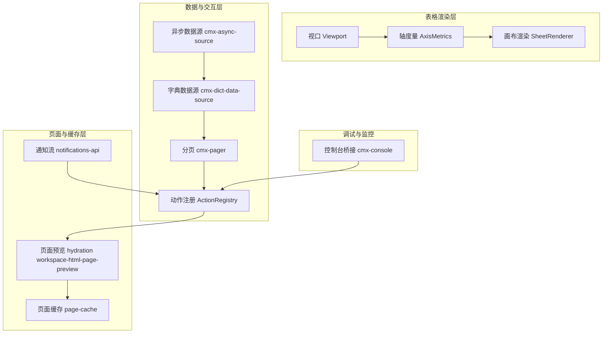
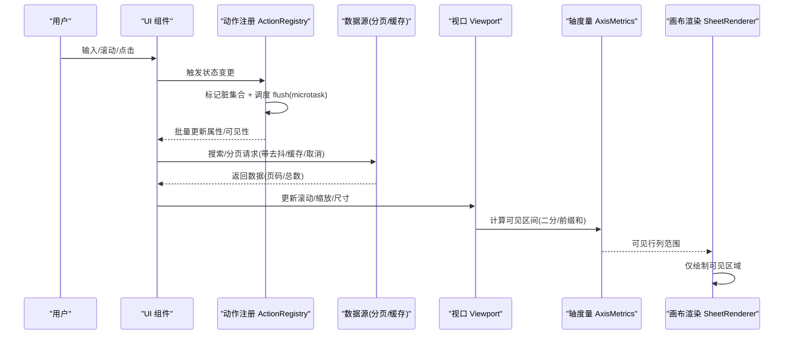
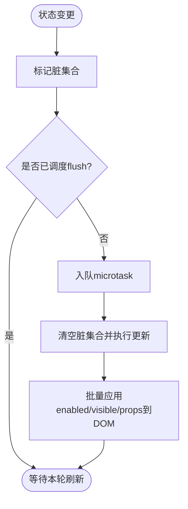
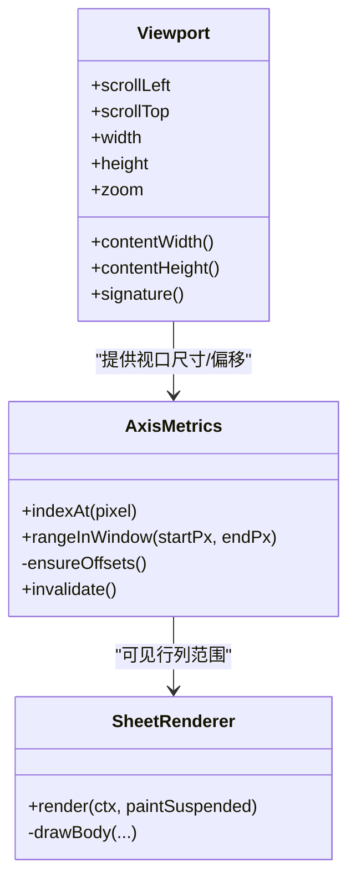
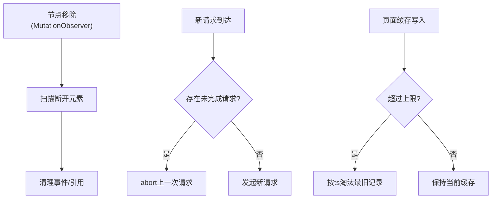
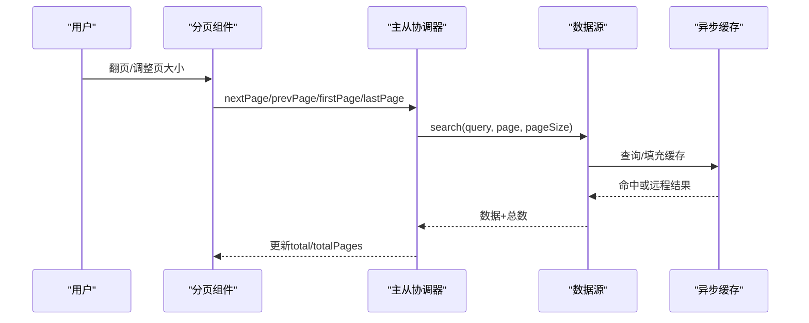
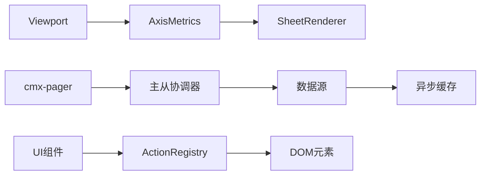

# 性能优化策略

<cite>
**本文引用的文件**
- [Viewport.ts](file://cmx-mega-sheet/src/render/Viewport.ts)
- [AxisMetrics.ts](file://cmx-mega-sheet/src/render/AxisMetrics.ts)
- [SheetRenderer.ts](file://cmx-mega-sheet/src/render/SheetRenderer.ts)
- [action-registry.js](file://CMXPortalManager/src/lib/action-registry.js)
- [workspace-html-page-preview.js](file://CMXPortalManager/src/lib/workspace-html-page-preview.js)
- [cmx-async-source.js](file://packages/cmx-data-comp/src/lib/cmx-async-source.js)
- [cmx-dict-data-source.js](file://packages/cmx-data-comp/src/lib/cmx-dict-data-source.js)
- [cmx-pager.js](file://packages/cmx-data-comp/src/components/cmx-pager.js)
- [init-page-models.js](file://packages/cmx-data-comp/src/lib/init-page-models.js)
- [page-cache.js](file://CMXPortalManager/src/lib/page-cache.js)
- [notifications-api.js](file://CMXPortalManager/src/api/notifications-api.js)
- [cmx-console.js](file://CMXHTMLDesigner/src/utils/cmx-console.js)
</cite>

## 目录
1. [简介](#简介)
2. [项目结构](#项目结构)
3. [核心组件](#核心组件)
4. [架构总览](#架构总览)
5. [详细组件分析](#详细组件分析)
6. [依赖关系分析](#依赖关系分析)
7. [性能考量](#性能考量)
8. [故障排查指南](#故障排查指南)
9. [结论](#结论)
10. [附录](#附录)

## 简介
本技术文档聚焦于前端性能优化策略，围绕以下主题展开：请求动画帧节流（requestAnimationFrame、帧率控制与任务调度）、DOM 操作批处理（批量更新、重排重绘优化、虚拟滚动）、内存管理（事件监听器清理、对象回收、垃圾收集优化）、大数据集处理（虚拟化渲染、懒加载、分页加载），以及性能监控与调试工具使用方法。内容基于仓库中实际实现进行归纳与可视化说明，帮助读者在复杂企业级应用中落地高性能方案。

## 项目结构
本项目包含多个子模块，涉及表格渲染、数据源缓存、页面状态与动作注册、分页与视图缓存等关键能力。下图展示与性能相关的主要模块及其职责边界：

图表来源
- [Viewport.ts:1-178](file://cmx-mega-sheet/src/render/Viewport.ts#L1-L178)
- [AxisMetrics.ts:66-135](file://cmx-mega-sheet/src/render/AxisMetrics.ts#L66-L135)
- [SheetRenderer.ts:1-200](file://cmx-mega-sheet/src/render/SheetRenderer.ts#L1-L200)
- [action-registry.js:89-129](file://CMXPortalManager/src/lib/action-registry.js#L89-L129)
- [cmx-async-source.js:1-143](file://packages/cmx-data-comp/src/lib/cmx-async-source.js#L1-L143)
- [cmx-dict-data-source.js:70-112](file://packages/cmx-data-comp/src/lib/cmx-dict-data-source.js#L70-L112)
- [cmx-pager.js:194-229](file://packages/cmx-data-comp/src/components/cmx-pager.js#L194-L229)
- [workspace-html-page-preview.js:395-410](file://CMXPortalManager/src/lib/workspace-html-page-preview.js#L395-L410)
- [page-cache.js:214-255](file://CMXPortalManager/src/lib/page-cache.js#L214-L255)
- [notifications-api.js:69-116](file://CMXPortalManager/src/api/notifications-api.js#L69-L116)
- [cmx-console.js:1-84](file://CMXHTMLDesigner/src/utils/cmx-console.js#L1-L84)

章节来源
- [Viewport.ts:1-178](file://cmx-mega-sheet/src/render/Viewport.ts#L1-L178)
- [action-registry.js:89-129](file://CMXPortalManager/src/lib/action-registry.js#L89-L129)
- [cmx-async-source.js:1-143](file://packages/cmx-data-comp/src/lib/cmx-async-source.js#L1-L143)

## 核心组件
- 视口与轴度量：通过 Viewport 维护滚动、缩放、冻结行列等状态并生成稳定签名；AxisMetrics 提供高效索引映射与前缀和计算，支撑可见区域判定与二分查找。
- 画布渲染：SheetRenderer 仅绘制可见区域，结合几何信息减少不必要的 DOM/Canvas 操作。
- 动作注册与微任务调度：ActionRegistry 使用 microtask 合并多次状态变更，批量同步到 DOM，避免频繁重排。
- 异步数据源与分页：cmx-async-source 提供 LRU 缓存、去抖、AbortController 取消重复请求；cmx-dict-data-source 支持分页参数与响应路径解析；cmx-pager 暴露分页信息与导航命令。
- 页面缓存与通知流：page-cache 实现 LRU 淘汰；notifications-api 以指数退避重连与流式读取，降低网络抖动影响。
- 调试与监控：cmx-console 劫持 console 输出至自定义 sink，便于设计器内观测。

章节来源
- [Viewport.ts:1-178](file://cmx-mega-sheet/src/render/Viewport.ts#L1-L178)
- [AxisMetrics.ts:66-135](file://cmx-mega-sheet/src/render/AxisMetrics.ts#L66-L135)
- [SheetRenderer.ts:1-200](file://cmx-mega-sheet/src/render/SheetRenderer.ts#L1-L200)
- [action-registry.js:89-129](file://CMXPortalManager/src/lib/action-registry.js#L89-L129)
- [cmx-async-source.js:1-143](file://packages/cmx-data-comp/src/lib/cmx-async-source.js#L1-L143)
- [cmx-dict-data-source.js:70-112](file://packages/cmx-data-comp/src/lib/cmx-dict-data-source.js#L70-L112)
- [cmx-pager.js:194-229](file://packages/cmx-data-comp/src/components/cmx-pager.js#L194-L229)
- [page-cache.js:214-255](file://CMXPortalManager/src/lib/page-cache.js#L214-L255)
- [notifications-api.js:69-116](file://CMXPortalManager/src/api/notifications-api.js#L69-L116)
- [cmx-console.js:1-84](file://CMXHTMLDesigner/src/utils/cmx-console.js#L1-L84)

## 架构总览
下图展示了从用户交互到渲染更新的完整链路，包括请求节流、DOM 批处理、虚拟化渲染与数据分页：

图表来源
- [action-registry.js:318-356](file://CMXPortalManager/src/lib/action-registry.js#L318-L356)
- [cmx-async-source.js:56-81](file://packages/cmx-data-comp/src/lib/cmx-async-source.js#L56-L81)
- [cmx-dict-data-source.js:96-107](file://packages/cmx-data-comp/src/lib/cmx-dict-data-source.js#L96-L107)
- [Viewport.ts:116-156](file://cmx-mega-sheet/src/render/Viewport.ts#L116-L156)
- [AxisMetrics.ts:66-135](file://cmx-mega-sheet/src/render/AxisMetrics.ts#L66-L135)
- [SheetRenderer.ts:165-200](file://cmx-mega-sheet/src/render/SheetRenderer.ts#L165-L200)

## 详细组件分析

### 请求动画帧节流与任务调度
- requestAnimationFrame 的使用：在页面水合阶段，对多视图区域的透明度变化采用双层 rAF 延迟，确保首帧布局稳定后再执行样式更新，减少重排抖动。
- 帧率控制与任务调度：ActionRegistry 将多次状态变更合并为一次 microtask 刷新，避免每步变更都触发 DOM 写入；同时利用 MutationObserver 检测节点脱离时清理引用，防止内存泄漏。

图表来源
- [workspace-html-page-preview.js:395-410](file://CMXPortalManager/src/lib/workspace-html-page-preview.js#L395-L410)
- [action-registry.js:318-356](file://CMXPortalManager/src/lib/action-registry.js#L318-L356)
- [action-registry.js:89-129](file://CMXPortalManager/src/lib/action-registry.js#L89-L129)

章节来源
- [workspace-html-page-preview.js:395-410](file://CMXPortalManager/src/lib/workspace-html-page-preview.js#L395-L410)
- [action-registry.js:318-356](file://CMXPortalManager/src/lib/action-registry.js#L318-L356)
- [action-registry.js:89-129](file://CMXPortalManager/src/lib/action-registry.js#L89-L129)

### DOM 操作批处理与重排重绘优化
- 批量更新：ActionRegistry 的 _applyToOneEl 将 enabled/visible/props 一次性应用到元素属性，最小化样式读写次数。
- 重排重绘优化：通过 hidden/disabled 属性切换而非直接修改布局属性，减少回流；结合 microtask 合并多次 set，避免中间态导致的额外布局。
- 虚拟滚动：Viewport 提供 contentWidth/contentHeight 与冻结行列偏移；AxisMetrics 使用前缀和与二分快速定位可见行/列；SheetRenderer 仅绘制可见区域，显著降低绘制成本。

图表来源
- [Viewport.ts:116-156](file://cmx-mega-sheet/src/render/Viewport.ts#L116-L156)
- [AxisMetrics.ts:66-135](file://cmx-mega-sheet/src/render/AxisMetrics.ts#L66-L135)
- [SheetRenderer.ts:165-200](file://cmx-mega-sheet/src/render/SheetRenderer.ts#L165-L200)

章节来源
- [action-registry.js:449-474](file://CMXPortalManager/src/lib/action-registry.js#L449-L474)
- [Viewport.ts:116-156](file://cmx-mega-sheet/src/render/Viewport.ts#L116-L156)
- [AxisMetrics.ts:66-135](file://cmx-mega-sheet/src/render/AxisMetrics.ts#L66-L135)
- [SheetRenderer.ts:165-200](file://cmx-mega-sheet/src/render/SheetRenderer.ts#L165-L200)

### 内存管理策略
- 事件监听器清理：ActionRegistry 通过 MutationObserver 监听节点移除，扫描并清理断开连接的元素引用，避免悬挂事件导致内存泄漏。
- 对象回收与 GC 优化：异步数据源使用 AbortController 取消未完成的请求，避免多余回调持有引用；LRU 缓存限制大小，及时淘汰旧条目；页面缓存按时间戳淘汰最旧记录，控制存储占用。
- 通知流资源释放：SSE 客户端在停止时调用 abort 并关闭 reader，确保流资源被释放。

图表来源
- [action-registry.js:89-129](file://CMXPortalManager/src/lib/action-registry.js#L89-L129)
- [cmx-async-source.js:56-81](file://packages/cmx-data-comp/src/lib/cmx-async-source.js#L56-L81)
- [page-cache.js:214-255](file://CMXPortalManager/src/lib/page-cache.js#L214-L255)
- [notifications-api.js:69-116](file://CMXPortalManager/src/api/notifications-api.js#L69-L116)

章节来源
- [action-registry.js:89-129](file://CMXPortalManager/src/lib/action-registry.js#L89-L129)
- [cmx-async-source.js:56-81](file://packages/cmx-data-comp/src/lib/cmx-async-source.js#L56-L81)
- [page-cache.js:214-255](file://CMXPortalManager/src/lib/page-cache.js#L214-L255)
- [notifications-api.js:69-116](file://CMXPortalManager/src/api/notifications-api.js#L69-L116)

### 大数据集处理
- 虚拟化渲染：Viewport 与 AxisMetrics 配合，精确计算可见行列；SheetRenderer 仅绘制可见区域，避免全量渲染。
- 懒加载与分页：cmx-dict-data-source 支持 page/pageSize 参数与响应路径解析；cmx-pager 提供分页信息与导航方法；init-page-models 自动检测 cmx-pager 并启用协调器分页。
- 缓存与去抖：cmx-async-source 提供 LRU 查询缓存与 key 缓存，debounceForSource 合并高频输入，减少后端压力。

图表来源
- [cmx-dict-data-source.js:96-107](file://packages/cmx-data-comp/src/lib/cmx-dict-data-source.js#L96-L107)
- [cmx-pager.js:194-229](file://packages/cmx-data-comp/src/components/cmx-pager.js#L194-L229)
- [init-page-models.js:1023-1047](file://packages/cmx-data-comp/src/lib/init-page-models.js#L1023-L1047)
- [cmx-async-source.js:117-143](file://packages/cmx-data-comp/src/lib/cmx-async-source.js#L117-L143)

章节来源
- [cmx-dict-data-source.js:96-107](file://packages/cmx-data-comp/src/lib/cmx-dict-data-source.js#L96-L107)
- [cmx-pager.js:194-229](file://packages/cmx-data-comp/src/components/cmx-pager.js#L194-L229)
- [init-page-models.js:1023-1047](file://packages/cmx-data-comp/src/lib/init-page-models.js#L1023-L1047)
- [cmx-async-source.js:117-143](file://packages/cmx-data-comp/src/lib/cmx-async-source.js#L117-L143)

### 性能监控与调试工具
- 控制台桥接：installCmxConsoleTap 劫持 console.log/warn/error，双写到 DevTools 与设计器 sink，便于集中观测；uninstallCmxConsoleTap 可恢复原生行为。
- 设计器调试面板：通过 inspector 组件开关日志镜像，结合 tab 管理与清空按钮，提升问题定位效率。

章节来源
- [cmx-console.js:1-84](file://CMXHTMLDesigner/src/utils/cmx-console.js#L1-L84)

## 依赖关系分析
- 渲染链路依赖：SheetRenderer 依赖 SheetGeometry 提供的可见区域；Viewport 与 AxisMetrics 共同决定绘制范围。
- 数据链路依赖：cmx-pager 驱动主从协调器，协调器调用数据源；cmx-async-source 为数据源提供缓存与去抖能力。
- 页面状态依赖：ActionRegistry 作为状态中枢，接收 UI 变更并批量同步到 DOM；MutationObserver 保障内存安全。

图表来源
- [Viewport.ts:116-156](file://cmx-mega-sheet/src/render/Viewport.ts#L116-L156)
- [AxisMetrics.ts:66-135](file://cmx-mega-sheet/src/render/AxisMetrics.ts#L66-L135)
- [SheetRenderer.ts:165-200](file://cmx-mega-sheet/src/render/SheetRenderer.ts#L165-L200)
- [cmx-pager.js:194-229](file://packages/cmx-data-comp/src/components/cmx-pager.js#L194-L229)
- [cmx-async-source.js:1-143](file://packages/cmx-data-comp/src/lib/cmx-async-source.js#L1-L143)
- [action-registry.js:318-356](file://CMXPortalManager/src/lib/action-registry.js#L318-L356)

章节来源
- [Viewport.ts:116-156](file://cmx-mega-sheet/src/render/Viewport.ts#L116-L156)
- [AxisMetrics.ts:66-135](file://cmx-mega-sheet/src/render/AxisMetrics.ts#L66-L135)
- [SheetRenderer.ts:165-200](file://cmx-mega-sheet/src/render/SheetRenderer.ts#L165-L200)
- [cmx-pager.js:194-229](file://packages/cmx-data-comp/src/components/cmx-pager.js#L194-L229)
- [cmx-async-source.js:1-143](file://packages/cmx-data-comp/src/lib/cmx-async-source.js#L1-L143)
- [action-registry.js:318-356](file://CMXPortalManager/src/lib/action-registry.js#L318-L356)

## 性能考量
- 帧级节流：优先使用 requestAnimationFrame 安排视觉更新，避免阻塞主线程；对非紧急样式更新采用双层 rAF 保证首帧稳定。
- 批量化更新：通过 microtask 合并状态变更，减少 DOM 写入次数；使用属性切换（hidden/disabled）替代布局敏感操作。
- 虚拟化渲染：严格限定绘制范围为可见区域，结合轴度量二分查找快速定位行列，降低 Canvas 绘制开销。
- 数据层优化：LRU 缓存与去抖减少重复请求；AbortController 取消过时请求；分页加载控制单次数据量。
- 内存安全：MutationObserver 清理断开节点；页面缓存 LRU 淘汰；SSE 流正确释放 reader。

[本节为通用指导，不直接分析具体文件]

## 故障排查指南
- 卡顿与掉帧：检查是否存在大量同步 DOM 写入；确认是否使用了 rAF/microtask 合并更新；验证虚拟化渲染是否正确限制绘制范围。
- 内存泄漏：确认事件监听器是否在组件卸载时移除；检查是否有悬挂的 MutationObserver 或 SSE reader；评估缓存容量与淘汰策略。
- 数据重复请求：确认 debounce 配置是否合理；检查 AbortController 是否正确取消上一次请求；验证 LRU 缓存键是否稳定。
- 分页异常：核对 cmx-pager 的 total/totalPages 设置；确认主从协调器 enablePaging 是否生效；检查数据源响应路径解析是否正确。

章节来源
- [action-registry.js:89-129](file://CMXPortalManager/src/lib/action-registry.js#L89-L129)
- [cmx-async-source.js:56-81](file://packages/cmx-data-comp/src/lib/cmx-async-source.js#L56-L81)
- [page-cache.js:214-255](file://CMXPortalManager/src/lib/page-cache.js#L214-L255)
- [notifications-api.js:69-116](file://CMXPortalManager/src/api/notifications-api.js#L69-L116)
- [cmx-pager.js:194-229](file://packages/cmx-data-comp/src/components/cmx-pager.js#L194-L229)

## 结论
通过在渲染层实施虚拟化与批处理、在数据层引入缓存与分页、在状态层使用微任务调度与内存清理，本项目实现了高吞吐、低延迟的前端体验。建议在实际工程中持续监控帧率、内存占用与网络请求频率，结合调试工具定位瓶颈，逐步优化关键路径。

[本节为总结性内容，不直接分析具体文件]

## 附录
- 关键实现参考路径
  - 请求动画帧节流与任务调度：[workspace-html-page-preview.js:395-410](file://CMXPortalManager/src/lib/workspace-html-page-preview.js#L395-L410)、[action-registry.js:318-356](file://CMXPortalManager/src/lib/action-registry.js#L318-L356)
  - DOM 批处理与虚拟化渲染：[action-registry.js:449-474](file://CMXPortalManager/src/lib/action-registry.js#L449-L474)、[Viewport.ts:116-156](file://cmx-mega-sheet/src/render/Viewport.ts#L116-L156)、[AxisMetrics.ts:66-135](file://cmx-mega-sheet/src/render/AxisMetrics.ts#L66-L135)、[SheetRenderer.ts:165-200](file://cmx-mega-sheet/src/render/SheetRenderer.ts#L165-L200)
  - 内存管理：[action-registry.js:89-129](file://CMXPortalManager/src/lib/action-registry.js#L89-L129)、[cmx-async-source.js:56-81](file://packages/cmx-data-comp/src/lib/cmx-async-source.js#L56-L81)、[page-cache.js:214-255](file://CMXPortalManager/src/lib/page-cache.js#L214-L255)、[notifications-api.js:69-116](file://CMXPortalManager/src/api/notifications-api.js#L69-L116)
  - 大数据集处理：[cmx-dict-data-source.js:96-107](file://packages/cmx-data-comp/src/lib/cmx-dict-data-source.js#L96-L107)、[cmx-pager.js:194-229](file://packages/cmx-data-comp/src/components/cmx-pager.js#L194-L229)、[init-page-models.js:1023-1047](file://packages/cmx-data-comp/src/lib/init-page-models.js#L1023-L1047)、[cmx-async-source.js:117-143](file://packages/cmx-data-comp/src/lib/cmx-async-source.js#L117-L143)
  - 性能监控与调试：[cmx-console.js:1-84](file://CMXHTMLDesigner/src/utils/cmx-console.js#L1-L84)

[本节为附录，不直接分析具体文件]