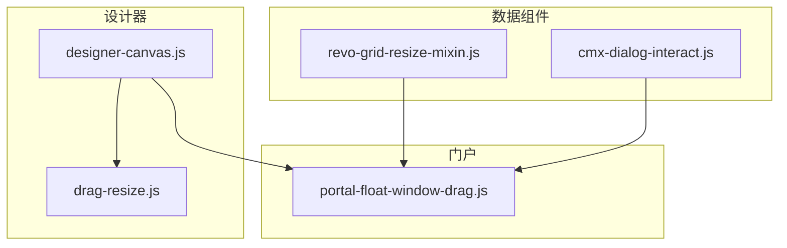
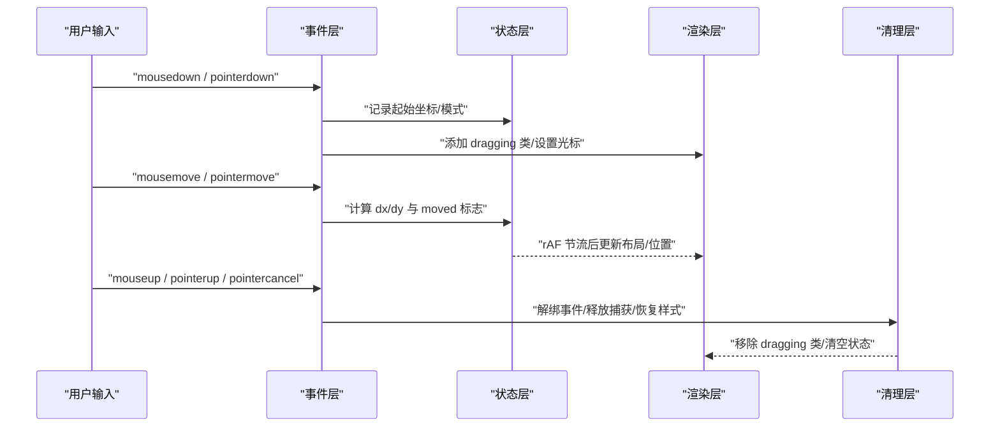
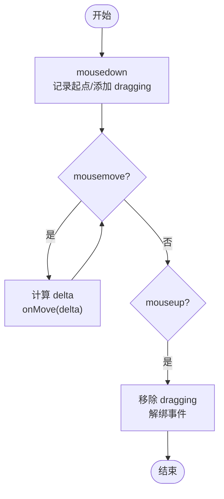
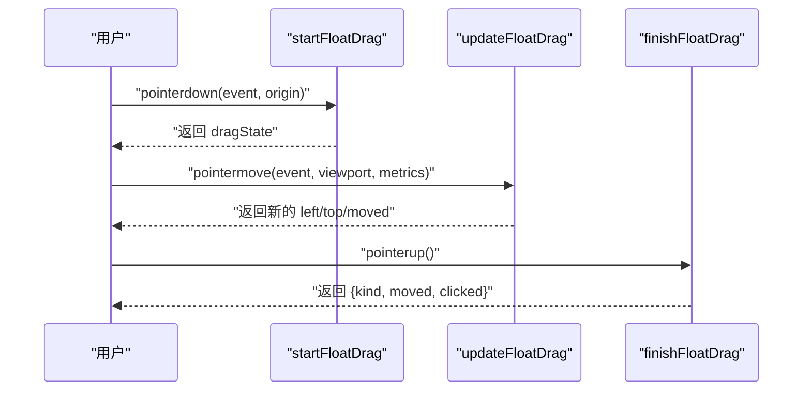
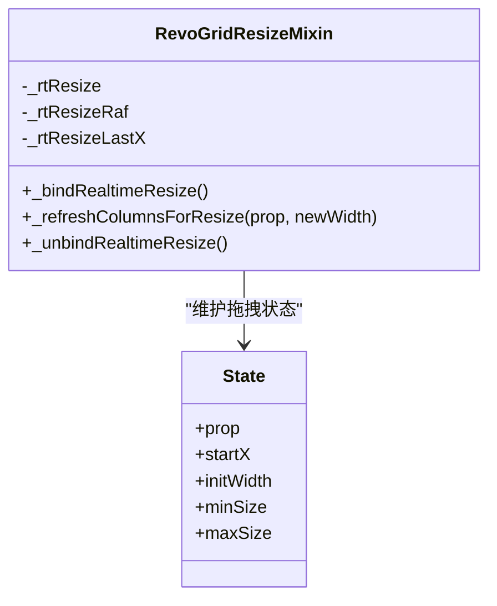
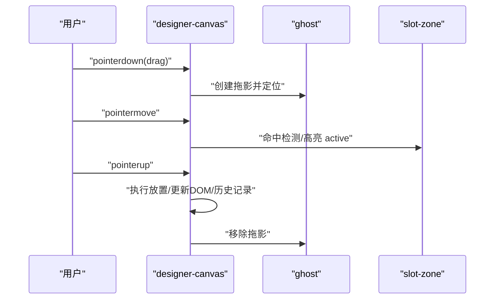
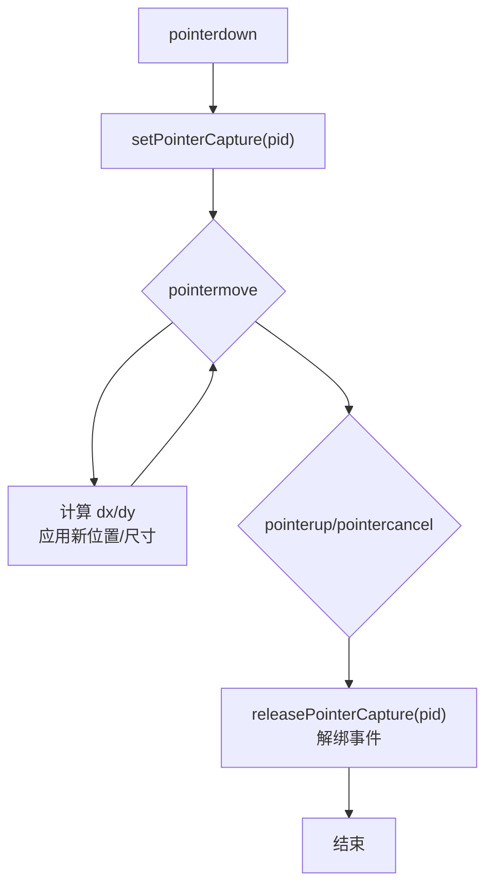
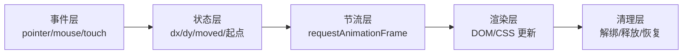

# 手势处理机制

<cite>
**本文引用的文件**
- [drag-resize.js](file://CMXHTMLDesigner/src/utils/drag-resize.js)
- [portal-float-window-drag.js](file://CMXPortalManager/src/lib/portal-float-window-drag.js)
- [revo-grid-resize-mixin.js](file://packages/cmx-data-comp/src/components/revo-grid/revo-grid-resize-mixin.js)
- [designer-canvas.js](file://CMXHTMLDesigner/src/components/designer-canvas.js)
- [cmx-dialog-interact.js](file://packages/cmx-data-comp/src/lib/cmx-dialog-interact.js)
- [drag-resize.test.js](file://CMXHTMLDesigner/src/__tests__/drag-resize.test.js)
</cite>

## 目录
1. [简介](#简介)
2. [项目结构](#项目结构)
3. [核心组件](#核心组件)
4. [架构总览](#架构总览)
5. [详细组件分析](#详细组件分析)
6. [依赖关系分析](#依赖关系分析)
7. [性能考量](#性能考量)
8. [故障排查指南](#故障排查指南)
9. [结论](#结论)

## 简介
本技术文档聚焦于前端手势处理机制，覆盖指针事件监听器的绑定与解绑、拖拽状态管理（开始/进行/结束）、移动轨迹跟踪（坐标差值、方向判断、速度计算）、多指触控支持与移动端适配方案。文档基于仓库中实际实现进行分析，提供可视化图示与可操作的排错建议，帮助读者理解并扩展相关能力。

## 项目结构
本项目在多个子模块中实现了不同类型的手势交互：
- 分隔条拖拽：水平/垂直分隔条的鼠标拖拽与尺寸更新
- 浮窗拖拽：浮动窗口或悬浮球的拖拽与边界约束
- 表格列宽实时调整：接管第三方网格的列宽拖动，实现“按住即变”的实时体验
- 画布内节点拖拽：设计器画布内的元素拖放与槽位插入
- 对话框交互：通用对话框的拖拽与缩放，统一使用 Pointer Events

图表来源
- [designer-canvas.js:360-470](file://CMXHTMLDesigner/src/components/designer-canvas.js#L360-L470)
- [drag-resize.js:1-66](file://CMXHTMLDesigner/src/utils/drag-resize.js#L1-L66)
- [portal-float-window-drag.js:1-59](file://CMXPortalManager/src/lib/portal-float-window-drag.js#L1-L59)
- [revo-grid-resize-mixin.js:1-150](file://packages/cmx-data-comp/src/components/revo-grid/revo-grid-resize-mixin.js#L1-L150)
- [cmx-dialog-interact.js:150-202](file://packages/cmx-data-comp/src/lib/cmx-dialog-interact.js#L150-L202)

章节来源
- [designer-canvas.js:360-470](file://CMXHTMLDesigner/src/components/designer-canvas.js#L360-L470)
- [drag-resize.js:1-66](file://CMXHTMLDesigner/src/utils/drag-resize.js#L1-L66)
- [portal-float-window-drag.js:1-59](file://CMXPortalManager/src/lib/portal-float-window-drag.js#L1-L59)
- [revo-grid-resize-mixin.js:1-150](file://packages/cmx-data-comp/src/components/revo-grid/revo-grid-resize-mixin.js#L1-L150)
- [cmx-dialog-interact.js:150-202](file://packages/cmx-data-comp/src/lib/cmx-dialog-interact.js#L150-L202)

## 核心组件
- 分隔条拖拽工具：提供水平/垂直拖拽绑定，维护起始坐标与增量回调，并在结束时清理事件与样式类。
- 浮窗拖拽计算：封装拖拽状态对象，计算位移、阈值判定与边界限制，支持区分“球”和“标题栏”两种拖拽形态。
- 表格列宽实时调整 mixin：在 capture 阶段拦截 .resizable 的 mousedown，旁路第三方网格的默认行为，通过 rAF 节流更新列宽。
- 画布内节点拖拽：使用 Pointer Events 与 setPointerCapture，创建拖影、命中检测、槽位高亮与最终放置。
- 对话框交互：统一的 pointermove/pointerup/pointercancel 处理，支持多指识别与释放捕获。

章节来源
- [drag-resize.js:1-66](file://CMXHTMLDesigner/src/utils/drag-resize.js#L1-L66)
- [portal-float-window-drag.js:1-59](file://CMXPortalManager/src/lib/portal-float-window-drag.js#L1-L59)
- [revo-grid-resize-mixin.js:1-150](file://packages/cmx-data-comp/src/components/revo-grid/revo-grid-resize-mixin.js#L1-L150)
- [designer-canvas.js:360-470](file://CMXHTMLDesigner/src/components/designer-canvas.js#L360-L470)
- [cmx-dialog-interact.js:150-202](file://packages/cmx-data-comp/src/lib/cmx-dialog-interact.js#L150-L202)

## 架构总览
整体采用“轻量状态 + 事件驱动”的模式：
- 事件层：统一使用 Pointer Events（兼容鼠标/触摸/笔），必要时回退到 mouse/touch 事件；在 capture 阶段抢占事件以旁路第三方逻辑。
- 状态层：集中维护拖拽状态（起始坐标、是否已移动、目标类型等），用于计算位移、方向与边界。
- 渲染层：通过 requestAnimationFrame 节流批量更新 UI，避免频繁重绘。
- 清理层：在 mouseup/pointerup/pointercancel 时解绑事件、恢复光标与选择、释放捕获。

图表来源
- [designer-canvas.js:360-470](file://CMXHTMLDesigner/src/components/designer-canvas.js#L360-L470)
- [revo-grid-resize-mixin.js:22-113](file://packages/cmx-data-comp/src/components/revo-grid/revo-grid-resize-mixin.js#L22-L113)
- [cmx-dialog-interact.js:150-202](file://packages/cmx-data-comp/src/lib/cmx-dialog-interact.js#L150-L202)

## 详细组件分析

### 分隔条拖拽（水平/垂直）
- 事件绑定与解绑
  - 在 splitter 上监听 mousedown，记录 startX/startY，添加 dragging 类，并在 window 上绑定 mousemove/mouseup。
  - mouseup 时移除 dragging 类并解绑 window 上的事件，防止内存泄漏。
- 移动轨迹跟踪
  - 每帧计算 dx/dy = current - last，调用 onMove(delta)，由上层决定如何应用（如改变面板宽度）。
- 状态转换
  - 初始态 -> 按下 -> 拖拽中 -> 释放 -> 初始态。
- 兼容性
  - 当前实现使用 mouse 事件；如需多指触控，可在 mousedown 处增加 touchstart 分支或使用 Pointer Events。

图表来源
- [drag-resize.js:10-31](file://CMXHTMLDesigner/src/utils/drag-resize.js#L10-L31)
- [drag-resize.js:39-61](file://CMXHTMLDesigner/src/utils/drag-resize.js#L39-L61)

章节来源
- [drag-resize.js:1-66](file://CMXHTMLDesigner/src/utils/drag-resize.js#L1-L66)
- [drag-resize.test.js:32-83](file://CMXHTMLDesigner/src/__tests__/drag-resize.test.js#L32-L83)
- [drag-resize.test.js:85-128](file://CMXHTMLDesigner/src/__tests__/drag-resize.test.js#L85-L128)

### 浮窗拖拽（球/标题栏）
- 状态对象
  - kind: 'ball' | 'title'
  - pointerX/Y: 起始指针坐标
  - left/top: 当前位置
  - moved: 是否发生有效移动（超过阈值）
- 位移计算与边界约束
  - 计算 dx/dy，根据 moveThreshold 判定 moved。
  - 对 ball 与 title 分别做边界限制，确保不超出视口。
- 点击与拖拽区分
  - finishFloatDrag 返回 clicked 标志，当 moved 为 false 时视为点击。
- 多指触控支持
  - 该模块接收 PointerEvent，天然兼容触摸；上层需保证在 pointerdown 时传入 origin 与 viewport。

图表来源
- [portal-float-window-drag.js:10-19](file://CMXPortalManager/src/lib/portal-float-window-drag.js#L10-L19)
- [portal-float-window-drag.js:27-49](file://CMXPortalManager/src/lib/portal-float-window-drag.js#L27-L49)
- [portal-float-window-drag.js:52-58](file://CMXPortalManager/src/lib/portal-float-window-drag.js#L52-L58)

章节来源
- [portal-float-window-drag.js:1-59](file://CMXPortalManager/src/lib/portal-float-window-drag.js#L1-L59)

### 表格列宽实时调整（mixin）
- 事件抢占与旁路
  - 在 _host 的 mousedown capture 阶段查找 .resizable 与 rgHeaderCell，若命中则 preventDefault + stopImmediatePropagation，阻止第三方 ResizeDirective 接管。
- 拖拽状态与节流
  - 记录 prop、initWidth、minSize/maxSize、startX。
  - document 级 mousemove 使用 requestAnimationFrame 节流，每帧最多一次重算 newWidth，并应用至列树。
- 结束清理
  - mouseup 时解绑 document 事件，恢复 cursor 与 userSelect，清理 rAF 与状态。
- 多指触控支持
  - 当前实现使用 mouse 事件；如需触摸，可将 capture 阶段的 mousedown 改为 pointerdown，并在 move/up 中使用 pointermove/pointerup。

图表来源
- [revo-grid-resize-mixin.js:22-113](file://packages/cmx-data-comp/src/components/revo-grid/revo-grid-resize-mixin.js#L22-L113)
- [revo-grid-resize-mixin.js:119-149](file://packages/cmx-data-comp/src/components/revo-grid/revo-grid-resize-mixin.js#L119-L149)

章节来源
- [revo-grid-resize-mixin.js:1-150](file://packages/cmx-data-comp/src/components/revo-grid/revo-grid-resize-mixin.js#L1-L150)

### 画布内节点拖拽（设计器）
- 事件模型
  - 使用 pointerdown/pointermove/pointerup，配合 setPointerCapture 与 releasePointerCapture，确保在多指环境下只响应同一指针。
- 拖拽过程
  - 创建拖影 ghost，计算命中区域，高亮 slot-zone，确定 dropTarget。
  - 在 pointerup 时执行放置逻辑，更新 DOM 结构与历史。
- 滚动与遮罩保护
  - 在 shadowRoot 上监听 wheel/touchmove，滚动或触摸时隐藏临时遮罩与槽位条，避免遮挡。

图表来源
- [designer-canvas.js:368-471](file://CMXHTMLDesigner/src/components/designer-canvas.js#L368-L471)
- [designer-canvas.js:125-141](file://CMXHTMLDesigner/src/components/designer-canvas.js#L125-L141)

章节来源
- [designer-canvas.js:360-470](file://CMXHTMLDesigner/src/components/designer-canvas.js#L360-L470)
- [designer-canvas.js:125-141](file://CMXHTMLDesigner/src/components/designer-canvas.js#L125-L141)

### 对话框交互（拖拽与缩放）
- 事件模型
  - 使用 pointermove/pointerup/pointercancel，并通过 pid 匹配同一指针，避免多指干扰。
- 缩放与移动
  - 根据边缘标记（e/w/n/s）计算新宽高与位置，限制最小尺寸与视口边界。
- 释放捕获
  - 在 onEnd 中释放捕获，确保后续事件正常冒泡。

图表来源
- [cmx-dialog-interact.js:150-202](file://packages/cmx-data-comp/src/lib/cmx-dialog-interact.js#L150-L202)

章节来源
- [cmx-dialog-interact.js:150-202](file://packages/cmx-data-comp/src/lib/cmx-dialog-interact.js#L150-L202)

## 依赖关系分析
- 事件到状态的映射
  - 各组件均将原始事件转换为内部状态（起始坐标、模式、moved 标志），再驱动渲染。
- 节流与批处理
  - 使用 requestAnimationFrame 合并多次移动更新，降低重排/重绘成本。
- 事件抢占与旁路
  - 在 capture 阶段拦截事件，避免第三方库重复处理，提升一致性。
- 多指触控
  - 通过 pointerId 与 setPointerCapture 精确控制单指交互，避免多指冲突。

图表来源
- [revo-grid-resize-mixin.js:85-109](file://packages/cmx-data-comp/src/components/revo-grid/revo-grid-resize-mixin.js#L85-L109)
- [designer-canvas.js:368-471](file://CMXHTMLDesigner/src/components/designer-canvas.js#L368-L471)
- [cmx-dialog-interact.js:182-200](file://packages/cmx-data-comp/src/lib/cmx-dialog-interact.js#L182-L200)

章节来源
- [revo-grid-resize-mixin.js:85-109](file://packages/cmx-data-comp/src/components/revo-grid/revo-grid-resize-mixin.js#L85-L109)
- [designer-canvas.js:368-471](file://CMXHTMLDesigner/src/components/designer-canvas.js#L368-L471)
- [cmx-dialog-interact.js:182-200](file://packages/cmx-data-comp/src/lib/cmx-dialog-interact.js#L182-L200)

## 性能考量
- 使用 requestAnimationFrame 节流高频移动事件，减少重绘压力。
- 在 capture 阶段抢占事件，避免重复计算与多余渲染。
- 仅在必要时更新 DOM（如列宽变化时克隆列树并触发 Watch），避免全量刷新。
- 使用 setPointerCapture 与 pid 匹配，精准控制交互范围，降低误触概率。
- 在滚动或触摸时隐藏临时遮罩与槽位条，减少不必要的布局计算。

[本节为通用性能建议，不直接分析具体文件]

## 故障排查指南
- 拖拽无响应
  - 检查是否在 capture 阶段正确抢占事件，并确保 preventDefault/stopImmediatePropagation 生效。
  - 确认目标元素包含必要类名（如 .resizable、rgHeaderCell）。
- 拖拽中途失效
  - 检查 pointerId 是否一致，确保未混用多指。
  - 确认在 pointerup/pointercancel 时正确释放捕获并解绑事件。
- 移动端滚动冲突
  - 在 shadowRoot 上监听 touchmove/wheel，滚动时隐藏遮罩与槽位条。
  - 避免被动监听器导致无法 preventDefault 的场景。
- 列宽不实时更新
  - 确认 rAF 队列未被取消或未正确触发。
  - 检查列树克隆与属性签名是否正确重置，以触发 Watch。

章节来源
- [revo-grid-resize-mixin.js:22-113](file://packages/cmx-data-comp/src/components/revo-grid/revo-grid-resize-mixin.js#L22-L113)
- [designer-canvas.js:125-141](file://CMXHTMLDesigner/src/components/designer-canvas.js#L125-L141)
- [cmx-dialog-interact.js:182-200](file://packages/cmx-data-comp/src/lib/cmx-dialog-interact.js#L182-L200)

## 结论
本项目在不同场景下实现了稳健的手势处理机制：
- 分隔条拖拽：简洁高效，适合基础布局调整。
- 浮窗拖拽：状态化、带阈值与边界约束，便于区分点击与拖拽。
- 表格列宽实时调整：通过 capture 抢占与 rAF 节流，实现流畅的“按住即变”体验。
- 画布内节点拖拽：结合 Pointer Events 与 setPointerCapture，提供跨设备一致的拖放体验。
- 对话框交互：统一的事件模型与释放捕获，保障多指环境下的稳定性。

建议在需要多指触控或更复杂手势识别的场景中，优先采用 Pointer Events，并结合 rAF 节流与状态机管理，以获得更好的性能与可维护性。