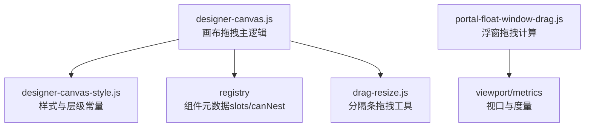
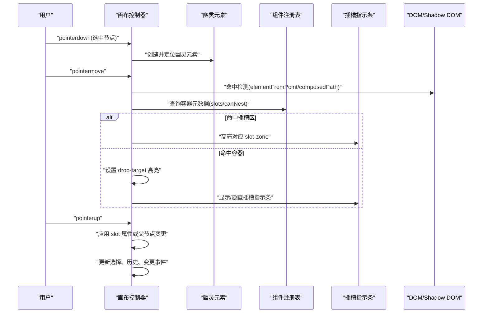
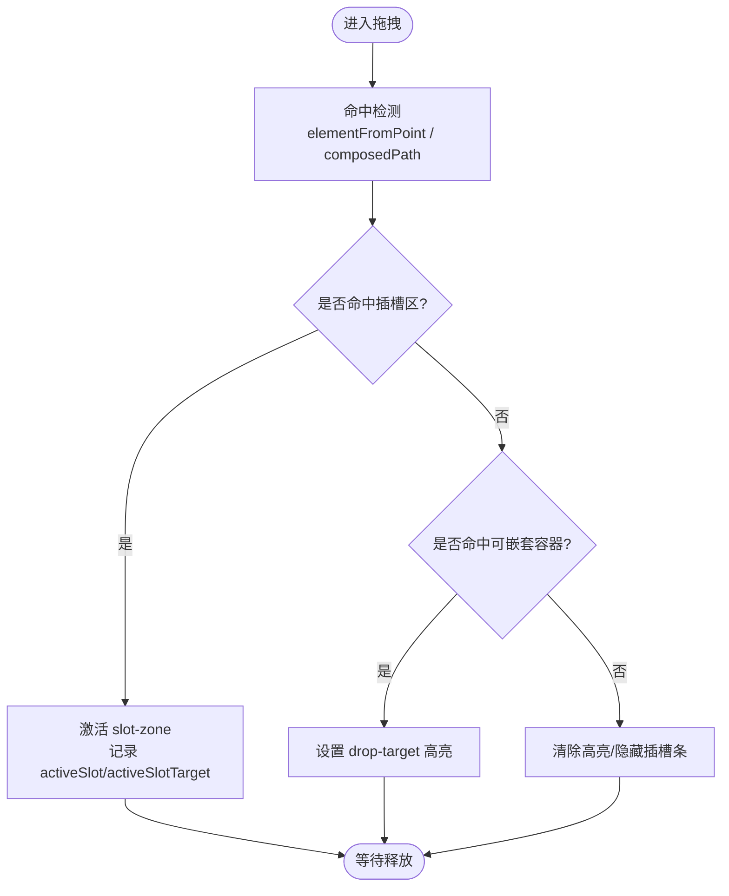
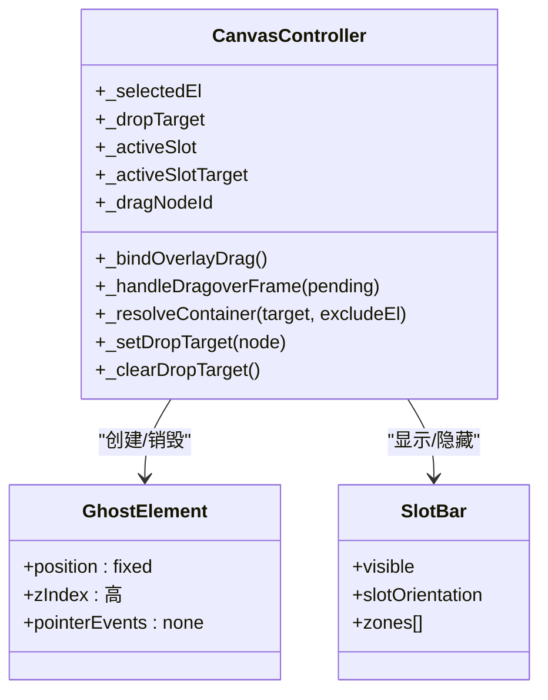
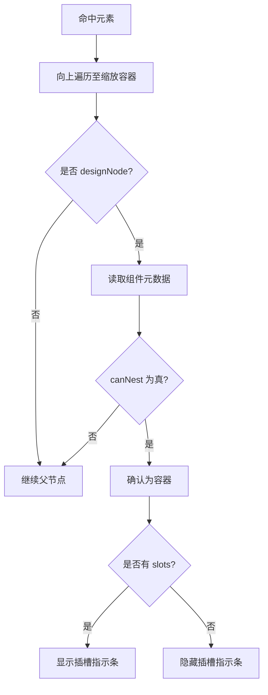
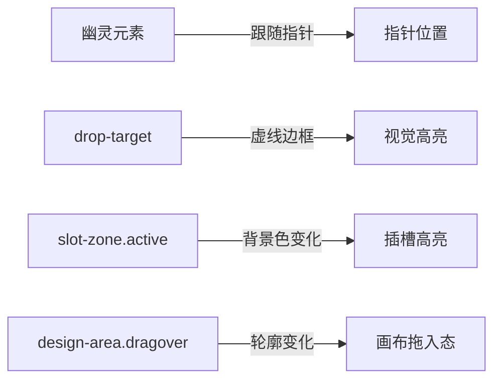
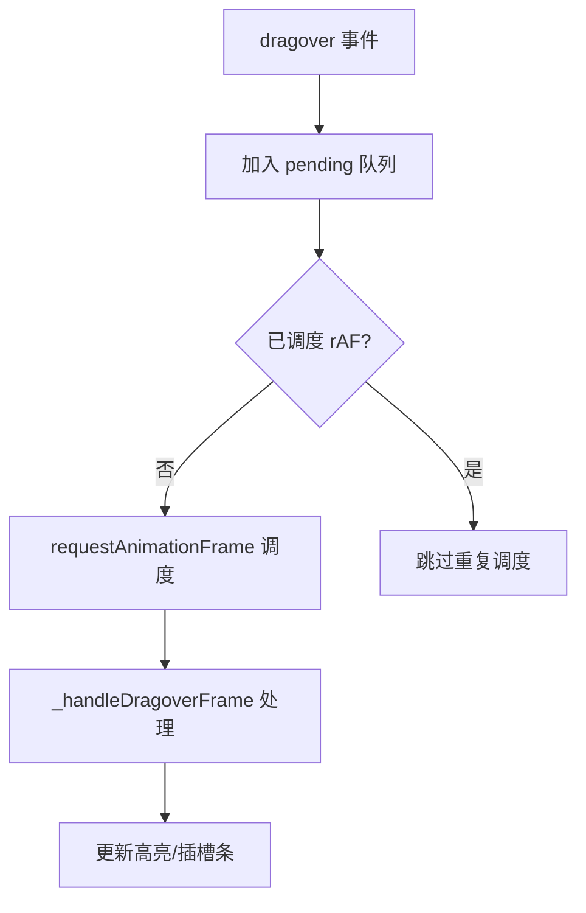
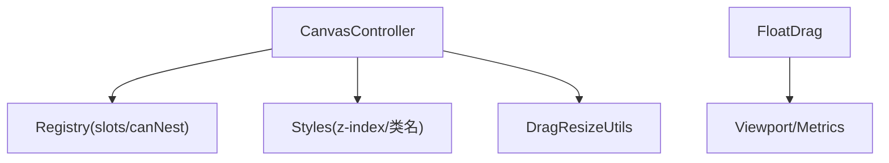

# 拖拽引擎

<cite>
**本文引用的文件**
- [designer-canvas.js](file://CMXHTMLDesigner/src/components/designer-canvas.js)
- [designer-canvas-style.js](file://CMXHTMLDesigner/src/components/designer-canvas-style.js)
- [drag-resize.js](file://CMXHTMLDesigner/src/utils/drag-resize.js)
- [portal-float-window-drag.js](file://CMXPortalManager/src/lib/portal-float-window-drag.js)
- [drag-resize.test.js](file://CMXHTMLDesigner/src/__tests__/drag-resize.test.js)
</cite>

## 目录
1. [简介](#简介)
2. [项目结构](#项目结构)
3. [核心组件](#核心组件)
4. [架构总览](#架构总览)
5. [详细组件分析](#详细组件分析)
6. [依赖关系分析](#依赖关系分析)
7. [性能考虑](#性能考虑)
8. [故障排查指南](#故障排查指南)
9. [结论](#结论)
10. [附录：自定义与扩展指南](#附录自定义与扩展指南)

## 简介
本技术文档围绕工程中的拖拽引擎进行系统化说明，覆盖以下关键主题：
- 拖拽检测算法：碰撞检测、位置计算、边界约束
- 手势处理机制：指针事件监听、拖拽状态管理、移动轨迹跟踪
- 目标识别系统：容器解析、嵌套规则验证、插槽匹配
- 视觉反馈：幽灵元素创建、高亮显示、动画效果
- 性能优化：请求动画帧节流、DOM 操作批处理、内存管理
- 自定义行为：扩展点与开发指南

该引擎主要实现在设计器画布中，用于在可视化编辑环境中对节点进行拖放、插入、重排和尺寸调整；同时在门户浮窗模块提供轻量级拖拽能力。

## 项目结构
拖拽相关代码分布在两个子工程中：
- CMXHTMLDesigner：可视化设计器的画布与拖放逻辑，包含拖拽检测、插槽指示条、选择框与手柄等
- CMXPortalManager：门户浮窗的拖拽计算工具，提供最小化的拖拽状态机

图表来源
- [designer-canvas.js:367-642](file://CMXHTMLDesigner/src/components/designer-canvas.js#L367-L642)
- [designer-canvas-style.js:7-13](file://CMXHTMLDesigner/src/components/designer-canvas-style.js#L7-L13)
- [drag-resize.js:10-65](file://CMXHTMLDesigner/src/utils/drag-resize.js#L10-L65)
- [portal-float-window-drag.js:10-58](file://CMXPortalManager/src/lib/portal-float-window-drag.js#L10-L58)

章节来源
- [designer-canvas.js:367-642](file://CMXHTMLDesigner/src/components/designer-canvas.js#L367-L642)
- [designer-canvas-style.js:7-13](file://CMXHTMLDesigner/src/components/designer-canvas-style.js#L7-L13)
- [drag-resize.js:10-65](file://CMXHTMLDesigner/src/utils/drag-resize.js#L10-L65)
- [portal-float-window-drag.js:10-58](file://CMXPortalManager/src/lib/portal-float-window-drag.js#L10-L58)

## 核心组件
- 画布拖拽控制器：负责指针事件绑定、幽灵元素、命中检测、容器解析、插槽匹配、落点高亮、最终插入与历史记录提交
- 插槽指示条：根据容器元数据动态生成可放置区域，支持水平/垂直布局
- 分隔条拖拽工具：为面板分隔条提供水平/垂直拖拽与增量回调
- 浮窗拖拽计算：维护拖拽状态、阈值判断、边界约束与点击/拖拽区分

章节来源
- [designer-canvas.js:367-642](file://CMXHTMLDesigner/src/components/designer-canvas.js#L367-L642)
- [designer-canvas.js:474-529](file://CMXHTMLDesigner/src/components/designer-canvas.js#L474-L529)
- [drag-resize.js:10-65](file://CMXHTMLDesigner/src/utils/drag-resize.js#L10-L65)
- [portal-float-window-drag.js:10-58](file://CMXPortalManager/src/lib/portal-float-window-drag.js#L10-L58)

## 架构总览
画布拖拽流程由“指针按下 → 创建幽灵元素 → 移动命中 → 目标识别 → 插槽匹配 → 释放落点”组成；同时通过 requestAnimationFrame 对高频 dragover 事件进行节流，避免每帧重复计算。

图表来源
- [designer-canvas.js:367-471](file://CMXHTMLDesigner/src/components/designer-canvas.js#L367-L471)
- [designer-canvas.js:531-642](file://CMXHTMLDesigner/src/components/designer-canvas.js#L531-L642)
- [designer-canvas.js:744-779](file://CMXHTMLDesigner/src/components/designer-canvas.js#L744-L779)

## 详细组件分析

### 拖拽检测算法：碰撞检测、位置计算、边界约束
- 碰撞检测
  - 使用 elementFromPoint 穿透 Shadow DOM 进行命中，临时关闭被拖元素的 pointerEvents 以避免遮挡
  - 对于 dragover 路径，优先使用 composedPath() 获取真实命中链，再向上查找可嵌套容器
- 位置计算
  - 幽灵元素跟随指针偏移固定像素，保持可见且不干扰命中
  - 插槽指示条根据容器与画布的 getBoundingClientRect 与滚动偏移计算绝对位置
- 边界约束
  - 浮窗拖拽使用 minWindowWidth/titleBarHeight/ballSize 与视口宽高做 clamp，确保不越界
  - 分隔条拖拽通过增量 delta 驱动布局，配合 clamp 工具函数限制范围

图表来源
- [designer-canvas.js:406-441](file://CMXHTMLDesigner/src/components/designer-canvas.js#L406-L441)
- [designer-canvas.js:610-642](file://CMXHTMLDesigner/src/components/designer-canvas.js#L610-L642)
- [portal-float-window-drag.js:27-48](file://CMXPortalManager/src/lib/portal-float-window-drag.js#L27-L48)
- [drag-resize.js:63-65](file://CMXHTMLDesigner/src/utils/drag-resize.js#L63-L65)

章节来源
- [designer-canvas.js:406-441](file://CMXHTMLDesigner/src/components/designer-canvas.js#L406-L441)
- [designer-canvas.js:610-642](file://CMXHTMLDesigner/src/components/designer-canvas.js#L610-L642)
- [portal-float-window-drag.js:27-48](file://CMXPortalManager/src/lib/portal-float-window-drag.js#L27-L48)
- [drag-resize.js:63-65](file://CMXHTMLDesigner/src/utils/drag-resize.js#L63-L65)

### 手势处理机制：指针事件监听、状态管理、轨迹跟踪
- 指针事件
  - 使用 pointerdown/pointermove/pointerup 统一鼠标与触摸输入
  - 通过 setPointerCapture 锁定指针到拖拽源，避免丢失事件
- 状态管理
  - 维护 _selectedEl、_dropTarget、_activeSlot、_activeSlotTarget、_dragNodeId 等状态
  - 通过 mutationLocked 防止递归修改导致的死循环
- 轨迹跟踪
  - 移动时持续更新幽灵元素位置与命中结果
  - dragover 经 rAF 节流，仅保留最后一帧的命中数据进行渲染

图表来源
- [designer-canvas.js:367-471](file://CMXHTMLDesigner/src/components/designer-canvas.js#L367-L471)
- [designer-canvas.js:474-529](file://CMXHTMLDesigner/src/components/designer-canvas.js#L474-L529)
- [designer-canvas.js:531-642](file://CMXHTMLDesigner/src/components/designer-canvas.js#L531-L642)

章节来源
- [designer-canvas.js:367-471](file://CMXHTMLDesigner/src/components/designer-canvas.js#L367-L471)
- [designer-canvas.js:531-642](file://CMXHTMLDesigner/src/components/designer-canvas.js#L531-L642)

### 拖拽目标识别系统：容器解析、嵌套规则验证、插槽匹配
- 容器解析
  - 从命中元素向上遍历，寻找标记为 designNode 且位于缩放容器内的祖先
  - 通过 registry.get(tag) 读取 canNest 标志，确认是否为合法容器
- 嵌套规则验证
  - 排除正在移动的自身节点，避免自嵌套
  - 若命中槽位区域则优先按插槽放置，否则按容器规则插入
- 插槽匹配
  - 根据容器元数据的 slots 与 slotOrientation 动态生成插槽指示条
  - 将活动插槽名写入节点的 slot 属性，或在 header 等特殊场景附加样式

图表来源
- [designer-canvas.js:744-779](file://CMXHTMLDesigner/src/components/designer-canvas.js#L744-L779)
- [designer-canvas.js:474-529](file://CMXHTMLDesigner/src/components/designer-canvas.js#L474-L529)

章节来源
- [designer-canvas.js:744-779](file://CMXHTMLDesigner/src/components/designer-canvas.js#L744-L779)
- [designer-canvas.js:474-529](file://CMXHTMLDesigner/src/components/designer-canvas.js#L474-L529)

### 拖拽视觉反馈：幽灵元素、高亮显示、动画效果
- 幽灵元素
  - 创建固定定位的 div，设置高 z-index 与半透明背景，跟随指针移动
  - 通过 pointerEvents: none 避免影响命中检测
- 高亮显示
  - 容器作为 drop-target 时添加虚线边框高亮
  - 插槽指示条中活动区域高亮，区分命名插槽与默认内容
- 动画效果
  - 插槽区域切换使用 CSS transition 平滑过渡
  - 画布整体拖入状态通过 outline 变化提示

图表来源
- [designer-canvas.js:381-404](file://CMXHTMLDesigner/src/components/designer-canvas.js#L381-L404)
- [designer-canvas.js:781-790](file://CMXHTMLDesigner/src/components/designer-canvas.js#L781-L790)
- [designer-canvas-style.js:42-72](file://CMXHTMLDesigner/src/components/designer-canvas-style.js#L42-L72)
- [designer-canvas-style.js:101-145](file://CMXHTMLDesigner/src/components/designer-canvas-style.js#L101-L145)

章节来源
- [designer-canvas.js:381-404](file://CMXHTMLDesigner/src/components/designer-canvas.js#L381-L404)
- [designer-canvas.js:781-790](file://CMXHTMLDesigner/src/components/designer-canvas.js#L781-L790)
- [designer-canvas-style.js:42-72](file://CMXHTMLDesigner/src/components/designer-canvas-style.js#L42-L72)
- [designer-canvas-style.js:101-145](file://CMXHTMLDesigner/src/components/designer-canvas-style.js#L101-L145)

### 性能优化策略：rAF 节流、DOM 批处理、内存管理
- 请求动画帧节流
  - dragover 事件通过 _dragoverRafScheduled 标志与 requestAnimationFrame 合并，仅处理最后一帧命中数据
- DOM 操作批处理
  - 插槽指示条在需要时一次性创建/销毁，避免频繁增删节点
  - 选择框与手柄更新延迟一帧执行，减少布局抖动
- 内存管理
  - 拖拽结束时移除幽灵元素与事件监听器，清理引用
  - 使用 mutationLocked 防止重复触发导致的状态不一致

图表来源
- [designer-canvas.js:531-565](file://CMXHTMLDesigner/src/components/designer-canvas.js#L531-L565)
- [designer-canvas.js:610-642](file://CMXHTMLDesigner/src/components/designer-canvas.js#L610-L642)

章节来源
- [designer-canvas.js:531-565](file://CMXHTMLDesigner/src/components/designer-canvas.js#L531-L565)
- [designer-canvas.js:610-642](file://CMXHTMLDesigner/src/components/designer-canvas.js#L610-L642)

## 依赖关系分析
- 画布控制器依赖组件注册表以获取容器的插槽与嵌套能力
- 样式层通过常量定义各层级 z-index，保证幽灵元素、选择框、插槽条的正确堆叠
- 分隔条拖拽工具提供通用水平/垂直拖拽能力，供其他 UI 复用
- 浮窗拖拽计算独立于画布，提供最小化状态机与边界约束

图表来源
- [designer-canvas.js:744-779](file://CMXHTMLDesigner/src/components/designer-canvas.js#L744-L779)
- [designer-canvas-style.js:7-13](file://CMXHTMLDesigner/src/components/designer-canvas-style.js#L7-L13)
- [drag-resize.js:10-65](file://CMXHTMLDesigner/src/utils/drag-resize.js#L10-L65)
- [portal-float-window-drag.js:10-58](file://CMXPortalManager/src/lib/portal-float-window-drag.js#L10-L58)

章节来源
- [designer-canvas.js:744-779](file://CMXHTMLDesigner/src/components/designer-canvas.js#L744-L779)
- [designer-canvas-style.js:7-13](file://CMXHTMLDesigner/src/components/designer-canvas-style.js#L7-L13)
- [drag-resize.js:10-65](file://CMXHTMLDesigner/src/utils/drag-resize.js#L10-L65)
- [portal-float-window-drag.js:10-58](file://CMXPortalManager/src/lib/portal-float-window-drag.js#L10-L58)

## 性能考虑
- 高频事件节流：dragover 使用 rAF 合并，降低每帧计算量
- 命中优化：优先使用 composedPath() 避免强制布局；几何回退仅在必要时启用
- 渲染批处理：选择框与手柄更新延迟一帧，减少布局抖动
- 资源清理：拖拽结束及时移除幽灵元素与监听器，避免内存泄漏

[本节为通用性能建议，无需特定文件来源]

## 故障排查指南
- 无法命中容器
  - 检查命中元素是否在缩放容器内，且具备 designNode 标记
  - 确认组件元数据中 canNest 为真
- 插槽未生效
  - 确认插槽指示条是否正确显示，活动插槽是否被记录
  - 检查节点 slot 属性是否被正确设置
- 浮窗拖拽异常
  - 校验 viewport 与 metrics 参数是否正确传入
  - 确认 moveThreshold 与最小尺寸配置合理
- 分隔条拖拽无响应
  - 确认 mousedown/mousemove/mouseup 事件绑定与解绑正常
  - 检查 onMove 回调是否被调用

章节来源
- [designer-canvas.js:744-779](file://CMXHTMLDesigner/src/components/designer-canvas.js#L744-L779)
- [designer-canvas.js:474-529](file://CMXHTMLDesigner/src/components/designer-canvas.js#L474-L529)
- [portal-float-window-drag.js:27-58](file://CMXPortalManager/src/lib/portal-float-window-drag.js#L27-L58)
- [drag-resize.js:10-65](file://CMXHTMLDesigner/src/utils/drag-resize.js#L10-L65)

## 结论
该拖拽引擎在设计器画布中实现了完整的拖放工作流，包括精准的命中检测、灵活的容器与插槽匹配、直观的视觉反馈以及高效的性能优化。浮窗拖拽提供了轻量级的状态管理与边界约束。通过合理的扩展点与元数据驱动，可以便捷地定制不同容器的嵌套与插槽行为。

[本节为总结性内容，无需特定文件来源]

## 附录：自定义与扩展指南
- 扩展容器嵌套规则
  - 在组件元数据中设置 canNest 为真，使该组件可作为拖拽目标容器
  - 如需特殊插入逻辑，可在容器元数据中提供 defaultSetup 或其他钩子
- 自定义插槽行为
  - 在元数据中声明 slots 数组与 slotOrientation，引擎会自动生成插槽指示条
  - 通过 activeSlot 与 activeSlotTarget 控制最终插入位置与 slot 属性
- 自定义视觉反馈
  - 通过 CSS 类 drop-target、slot-zone.active、design-area.dragover 控制高亮与过渡
  - 可调整 z-index 常量以改变层级顺序
- 自定义拖拽行为
  - 在 pointermove 中实现额外的命中逻辑或业务校验
  - 在 drop 阶段结合 dataTransfer 类型判断进行复制/移动分支处理
- 浮窗拖拽扩展
  - 使用 startFloatDrag/updateFloatDrag/finishFloatDrag 构建最小状态机
  - 通过 viewport 与 metrics 控制边界与阈值

章节来源
- [designer-canvas.js:734-742](file://CMXHTMLDesigner/src/components/designer-canvas.js#L734-L742)
- [designer-canvas.js:474-529](file://CMXHTMLDesigner/src/components/designer-canvas.js#L474-L529)
- [designer-canvas-style.js:7-13](file://CMXHTMLDesigner/src/components/designer-canvas-style.js#L7-L13)
- [designer-canvas-style.js:42-72](file://CMXHTMLDesigner/src/components/designer-canvas-style.js#L42-L72)
- [designer-canvas-style.js:101-145](file://CMXHTMLDesigner/src/components/designer-canvas-style.js#L101-L145)
- [portal-float-window-drag.js:10-58](file://CMXPortalManager/src/lib/portal-float-window-drag.js#L10-L58)