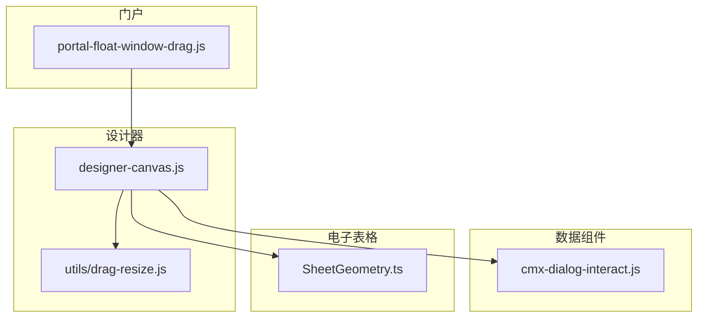
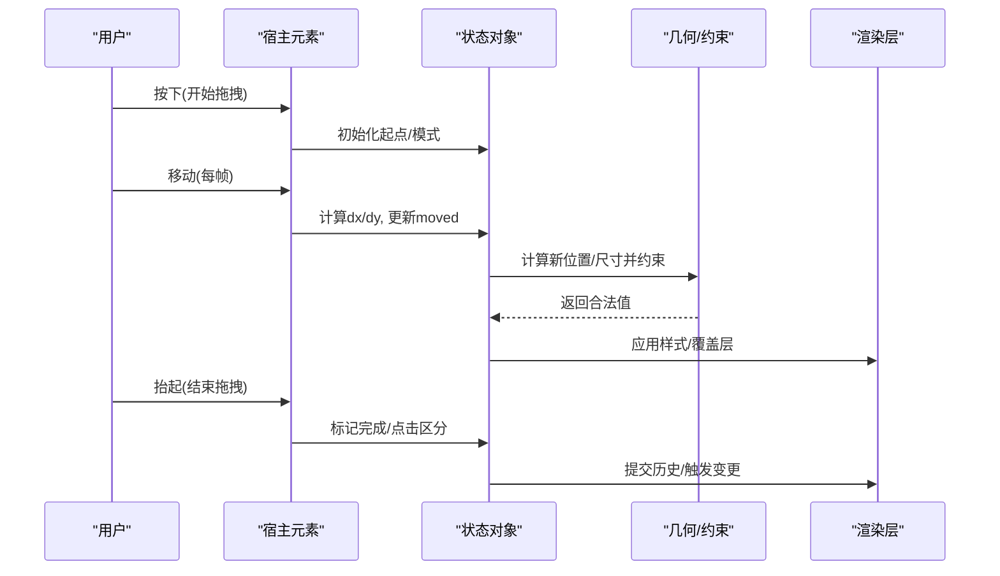
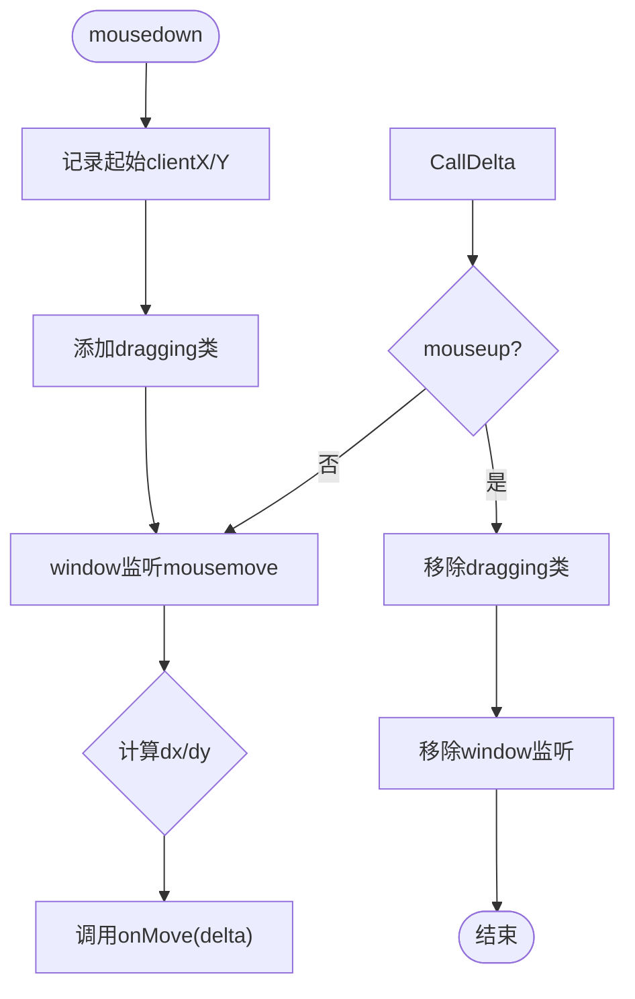
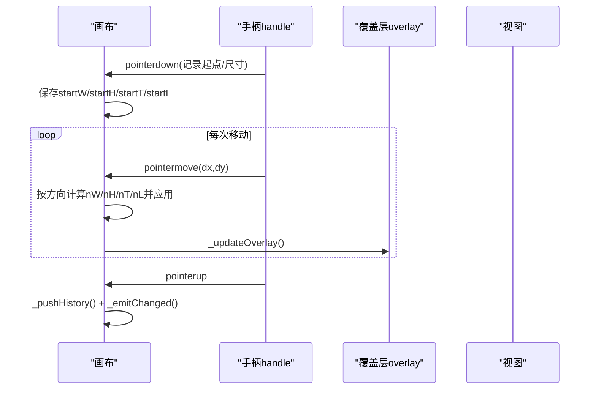
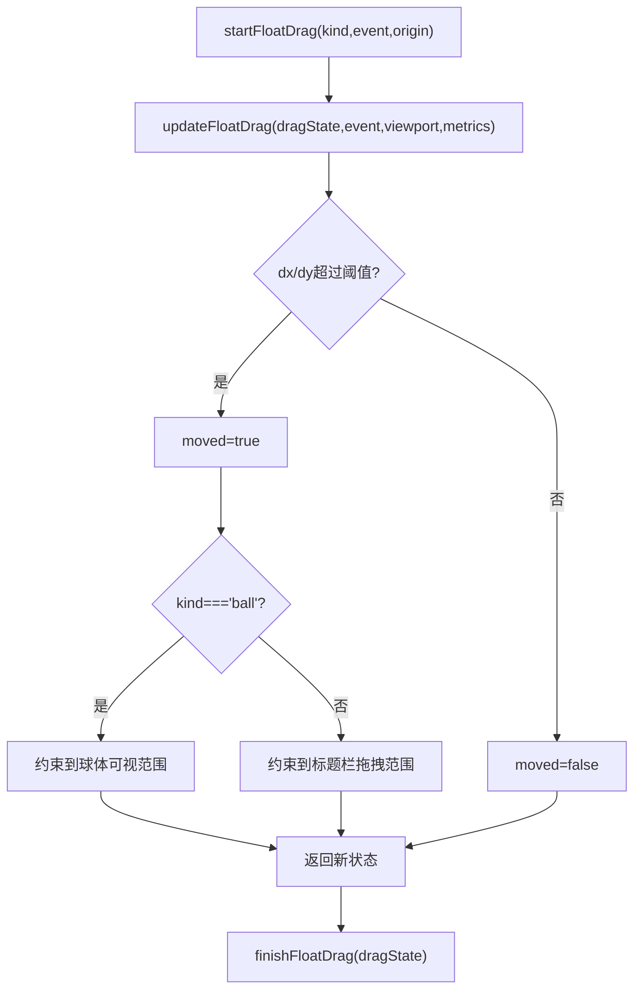
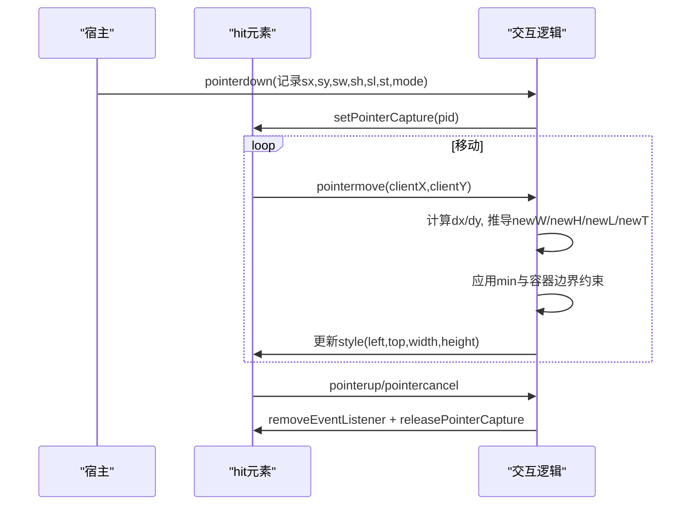
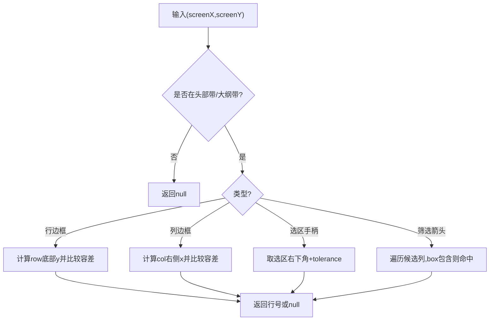
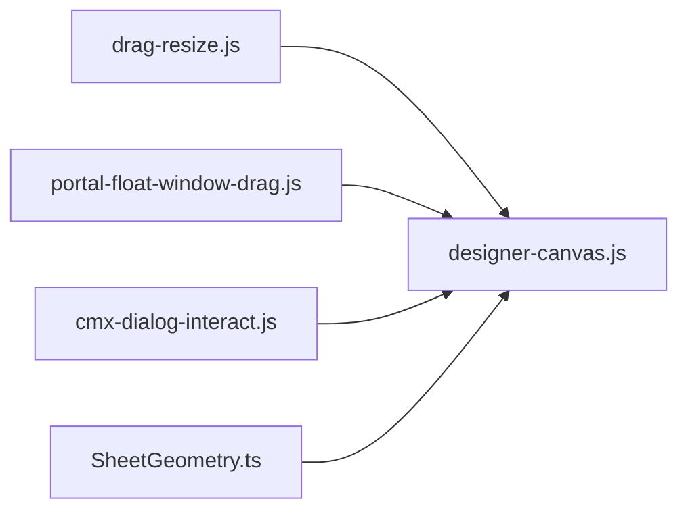

# 拖拽检测算法

<cite>
**本文引用的文件**
- [drag-resize.js](file://CMXHTMLDesigner/src/utils/drag-resize.js)
- [designer-canvas.js](file://CMXHTMLDesigner/src/components/designer-canvas.js)
- [portal-float-window-drag.js](file://CMXPortalManager/src/lib/portal-float-window-drag.js)
- [cmx-dialog-interact.js](file://packages/cmx-data-comp/src/lib/cmx-dialog-interact.js)
- [SheetGeometry.ts](file://cmx-mega-sheet/src/render/SheetGeometry.ts)
- [drag-resize.test.js](file://CMXHTMLDesigner/src/__tests__/drag-resize.test.js)
</cite>

## 目录
1. [简介](#简介)
2. [项目结构](#项目结构)
3. [核心组件](#核心组件)
4. [架构总览](#架构总览)
5. [详细组件分析](#详细组件分析)
6. [依赖关系分析](#依赖关系分析)
7. [性能考量](#性能考量)
8. [故障排查指南](#故障排查指南)
9. [结论](#结论)
10. [附录](#附录)

## 简介
本技术文档围绕仓库中的拖拽与碰撞检测能力，系统阐述以下主题：
- 碰撞检测实现原理：元素边界计算、重叠检测与命中测试。
- 位置计算机制：坐标转换、相对位置计算与容器边界约束。
- 拖拽状态管理：初始状态设置、状态转换逻辑与异常处理。
- 性能优化策略：防抖节流、增量更新与内存管理。
- 代码示例路径与调试技巧。

## 项目结构
与拖拽检测相关的核心代码分布在多个子模块中：
- 设计器画布与分隔条拖拽：位于 CMXHTMLDesigner 的 utils 与 components。
- 浮窗拖拽：位于 CMXPortalManager 的 lib。
- 对话框/弹窗拖拽与缩放：位于 packages/cmx-data-comp 的 lib。
- 表格几何与命中测试：位于 cmx-mega-sheet 的 render。

图表来源
- [designer-canvas.js:700-730](file://CMXHTMLDesigner/src/components/designer-canvas.js#L700-L730)
- [drag-resize.js:1-66](file://CMXHTMLDesigner/src/utils/drag-resize.js#L1-L66)
- [portal-float-window-drag.js:1-59](file://CMXPortalManager/src/lib/portal-float-window-drag.js#L1-L59)
- [cmx-dialog-interact.js:140-202](file://packages/cmx-data-comp/src/lib/cmx-dialog-interact.js#L140-L202)
- [SheetGeometry.ts:340-539](file://cmx-mega-sheet/src/render/SheetGeometry.ts#L340-L539)

章节来源
- [designer-canvas.js:700-899](file://CMXHTMLDesigner/src/components/designer-canvas.js#L700-L899)
- [drag-resize.js:1-66](file://CMXHTMLDesigner/src/utils/drag-resize.js#L1-L66)
- [portal-float-window-drag.js:1-59](file://CMXPortalManager/src/lib/portal-float-window-drag.js#L1-L59)
- [cmx-dialog-interact.js:140-202](file://packages/cmx-data-comp/src/lib/cmx-dialog-interact.js#L140-L202)
- [SheetGeometry.ts:340-539](file://cmx-mega-sheet/src/render/SheetGeometry.ts#L340-L539)

## 核心组件
- 分隔条拖拽工具：提供水平/垂直拖拽绑定与数值钳制（clamp），用于面板分割线拖动。
- 设计器画布：负责节点选择、拖拽/调整大小、容器判定与覆盖层更新。
- 浮窗拖拽：维护拖拽状态，按视口与指标进行边界约束，区分“标题栏拖拽”和“小球拖拽”。
- 对话框交互：统一处理指针捕获、移动应用与释放清理，包含最小尺寸与容器边界约束。
- 表格几何：提供行列边框命中、选区手柄命中、筛选箭头命中等精确命中测试。

章节来源
- [drag-resize.js:1-66](file://CMXHTMLDesigner/src/utils/drag-resize.js#L1-L66)
- [designer-canvas.js:700-899](file://CMXHTMLDesigner/src/components/designer-canvas.js#L700-L899)
- [portal-float-window-drag.js:1-59](file://CMXPortalManager/src/lib/portal-float-window-drag.js#L1-L59)
- [cmx-dialog-interact.js:140-202](file://packages/cmx-data-comp/src/lib/cmx-dialog-interact.js#L140-L202)
- [SheetGeometry.ts:340-539](file://cmx-mega-sheet/src/render/SheetGeometry.ts#L340-L539)

## 架构总览
拖拽检测由“事件采集 → 状态更新 → 几何计算 → 渲染更新”构成闭环。不同场景复用同一模式：
- 事件采集：pointer/mouse 事件获取 clientX/clientY。
- 状态更新：记录起始点、增量、是否已移动（阈值过滤）。
- 几何计算：根据方向或类型计算新位置/尺寸，并进行边界约束。
- 渲染更新：通过样式或覆盖层刷新 UI。

图表来源
- [designer-canvas.js:700-730](file://CMXHTMLDesigner/src/components/designer-canvas.js#L700-L730)
- [portal-float-window-drag.js:10-59](file://CMXPortalManager/src/lib/portal-float-window-drag.js#L10-L59)
- [cmx-dialog-interact.js:140-202](file://packages/cmx-data-comp/src/lib/cmx-dialog-interact.js#L140-L202)

## 详细组件分析

### 分隔条拖拽与数值钳制
- 功能要点
  - 水平/垂直拖拽：监听 mousedown/mousemove/mouseup，累积 delta 并调用 onMove。
  - 视觉反馈：添加/移除 dragging 类名。
  - 数值钳制：clamp(value, min, max) 保证结果在范围内。
- 适用场景
  - 侧边栏/面板宽度调整。
  - 需要稳定、可预测的增量回调。

图表来源
- [drag-resize.js:10-32](file://CMXHTMLDesigner/src/utils/drag-resize.js#L10-L32)
- [drag-resize.js:39-61](file://CMXHTMLDesigner/src/utils/drag-resize.js#L39-L61)
- [drag-resize.js:63-65](file://CMXHTMLDesigner/src/utils/drag-resize.js#L63-L65)

章节来源
- [drag-resize.js:1-66](file://CMXHTMLDesigner/src/utils/drag-resize.js#L1-L66)
- [drag-resize.test.js:1-128](file://CMXHTMLDesigner/src/__tests__/drag-resize.test.js#L1-L128)

### 设计器画布的拖拽与容器判定
- 功能要点
  - 调整大小：基于 handle 的方向（n/e/s/w）计算新宽高与偏移，应用最小尺寸限制。
  - 覆盖层更新：拖拽过程中实时刷新 overlay，辅助对齐与预览。
  - 容器判定：支持 Shadow DOM 穿透，查找可嵌套的目标容器，避免误投放。
  - 历史记录：拖拽结束后推入历史并触发变更事件。
- 关键流程
  - 记录起始 rect、offsetTop/Left、startW/startH。
  - pointermove 中按方向分支计算 nW/nH/nT/nL，并写回 style。
  - pointerup 中解绑事件、提交历史、发出变更。

图表来源
- [designer-canvas.js:700-730](file://CMXHTMLDesigner/src/components/designer-canvas.js#L700-L730)
- [designer-canvas.js:744-779](file://CMXHTMLDesigner/src/components/designer-canvas.js#L744-L779)

章节来源
- [designer-canvas.js:700-899](file://CMXHTMLDesigner/src/components/designer-canvas.js#L700-L899)

### 浮窗拖拽：状态机与边界约束
- 功能要点
  - startFloatDrag：初始化 kind、指针坐标、窗口左上角与 moved 标志。
  - updateFloatDrag：计算 dx/dy，使用 moveThreshold 判断是否真正移动；按 kind 分别约束到视口与指标。
  - finishFloatDrag：输出 moved 与 clicked 以区分拖拽与点击。
- 边界约束
  - 球型拖拽：限制在 [0, width-ballSize] × [0, height-ballSize]。
  - 标题栏拖拽：限制 top 不超过 titleBarHeight，left 不超过 minWindowWidth。

图表来源
- [portal-float-window-drag.js:10-59](file://CMXPortalManager/src/lib/portal-float-window-drag.js#L10-L59)

章节来源
- [portal-float-window-drag.js:1-59](file://CMXPortalManager/src/lib/portal-float-window-drag.js#L1-L59)

### 对话框/弹窗拖拽与缩放：指针捕获与容器约束
- 功能要点
  - 指针捕获：setPointerCapture(pid) 确保移动/释放事件稳定到达目标。
  - 移动应用：根据 mode（n/e/s/w 组合）计算 newW/newH/newL/newT，并应用最小尺寸与容器边界。
  - 释放清理：移除事件监听并释放指针捕获。
- 约束策略
  - 最小宽高：Math.max(minWidth/minHeight, ...)。
  - 容器内可见：left/top 限制在 [0, vw-vh]，width/height 限制不超出剩余空间。

图表来源
- [cmx-dialog-interact.js:140-202](file://packages/cmx-data-comp/src/lib/cmx-dialog-interact.js#L140-L202)

章节来源
- [cmx-dialog-interact.js:140-202](file://packages/cmx-data-comp/src/lib/cmx-dialog-interact.js#L140-L202)

### 表格几何：精确命中测试与容差
- 功能要点
  - 行列边框命中：hitColumnBorder/hitRowBorder 考虑滚动与头部区域，返回命中的行列索引或 null。
  - 选区手柄命中：hitFillHandle 在选区右下角附近以 tolerance 像素容差命中。
  - 筛选箭头命中：hitFilterArrow 仅在列头带有效，结合冻结列与视口范围计算候选列。
  - 复选框/下拉箭头命中：hitCheckbox/hitCellDropdown 基于单元格矩形计算命中盒。
- 坐标体系
  - 屏幕坐标 → 内容坐标 → 行列索引，考虑缩放、滚动与头部偏移。

图表来源
- [SheetGeometry.ts:340-539](file://cmx-mega-sheet/src/render/SheetGeometry.ts#L340-L539)

章节来源
- [SheetGeometry.ts:340-539](file://cmx-mega-sheet/src/render/SheetGeometry.ts#L340-L539)

## 依赖关系分析
- 设计器画布依赖分隔条工具函数（如 clamp）与覆盖层更新。
- 浮窗拖拽独立于具体 UI，仅依赖 viewport 与 metrics。
- 对话框交互依赖宿主容器尺寸与最小尺寸配置。
- 表格几何依赖轴度量与视口信息，为交互层提供命中能力。

图表来源
- [drag-resize.js:1-66](file://CMXHTMLDesigner/src/utils/drag-resize.js#L1-L66)
- [designer-canvas.js:700-899](file://CMXHTMLDesigner/src/components/designer-canvas.js#L700-L899)
- [portal-float-window-drag.js:1-59](file://CMXPortalManager/src/lib/portal-float-window-drag.js#L1-L59)
- [cmx-dialog-interact.js:140-202](file://packages/cmx-data-comp/src/lib/cmx-dialog-interact.js#L140-L202)
- [SheetGeometry.ts:340-539](file://cmx-mega-sheet/src/render/SheetGeometry.ts#L340-L539)

章节来源
- [designer-canvas.js:700-899](file://CMXHTMLDesigner/src/components/designer-canvas.js#L700-L899)
- [drag-resize.js:1-66](file://CMXHTMLDesigner/src/utils/drag-resize.js#L1-L66)
- [portal-float-window-drag.js:1-59](file://CMXPortalManager/src/lib/portal-float-window-drag.js#L1-L59)
- [cmx-dialog-interact.js:140-202](file://packages/cmx-data-comp/src/lib/cmx-dialog-interact.js#L140-L202)
- [SheetGeometry.ts:340-539](file://cmx-mega-sheet/src/render/SheetGeometry.ts#L340-L539)

## 性能考量
- 防抖与节流
  - 搜索/异步源可使用 debounce 包装，减少高频调用带来的开销（参考异步源防抖封装）。
  - 对于高频拖拽，建议将样式更新合并到 requestAnimationFrame，避免布局抖动。
- 增量更新
  - 只在 pointermove 中计算必要字段（如 nW/nH/nT/nL），并仅更新受影响的 style 属性。
  - 使用覆盖层（overlay）做轻量级预览，降低重排成本。
- 内存管理
  - 及时移除事件监听与释放指针捕获，防止泄漏。
  - 对断开连接的 DOM 节点进行清理（例如 MutationObserver 兜底）。
- 视口稳定性
  - 忽略亚像素滚动抖动，保持签名稳定，减少不必要的重算。

章节来源
- [cmx-async-source.js:117-142](file://packages/cmx-data-comp/src/lib/cmx-async-source.js#L117-L142)
- [workspace-html-page-preview.js:395-410](file://CMXPortalManager/src/lib/workspace-html-page-preview.js#L395-L410)
- [action-registry.js:93-129](file://CMXPortalManager/src/lib/action-registry.js#L93-L129)
- [Viewport.test.ts:43-58](file://cmx-mega-sheet/test/Viewport.test.ts#L43-L58)

## 故障排查指南
- 常见问题
  - 拖拽无响应：检查是否成功 setPointerCapture，以及 pointermove/pointerup 是否正确解绑。
  - 越界/溢出：确认边界约束逻辑（min/max、容器宽高）是否生效。
  - 命中不准：核对坐标转换（clientX/Y → 内容坐标）、头部偏移与滚动量。
  - 性能卡顿：确认是否每帧都触发了大量重排，尝试合并更新或使用 rAF。
- 调试技巧
  - 打印 dragState 与 viewport/metrics，验证阈值与边界。
  - 在命中测试处断点，检查 hit* 返回值是否符合预期。
  - 使用浏览器性能面板观察 rAF 与样式写入频率。
  - 针对 Shadow DOM 穿透问题，优先使用 composedPath 定位真实目标。

章节来源
- [designer-canvas.js:744-779](file://CMXHTMLDesigner/src/components/designer-canvas.js#L744-L779)
- [portal-float-window-drag.js:27-49](file://CMXPortalManager/src/lib/portal-float-window-drag.js#L27-L49)
- [SheetGeometry.ts:340-539](file://cmx-mega-sheet/src/render/SheetGeometry.ts#L340-L539)

## 结论
该仓库在不同场景中实现了稳健的拖拽与碰撞检测能力：
- 通过统一的“事件→状态→几何→渲染”模式，保证了行为一致性与可维护性。
- 借助精确的几何命中与容差机制，提升了交互体验。
- 通过指针捕获、边界约束与资源清理，保障了鲁棒性与性能。
- 建议在高密度交互场景继续采用 rAF 合并更新与防抖策略，进一步优化流畅度。

## 附录
- 相关测试用例路径
  - 分隔条拖拽与 clamp：[drag-resize.test.js](file://CMXHTMLDesigner/src/__tests__/drag-resize.test.js)
  - 表格几何命中：[SheetGeometryResize.test.ts](file://cmx-mega-sheet/test/SheetGeometryResize.test.ts)