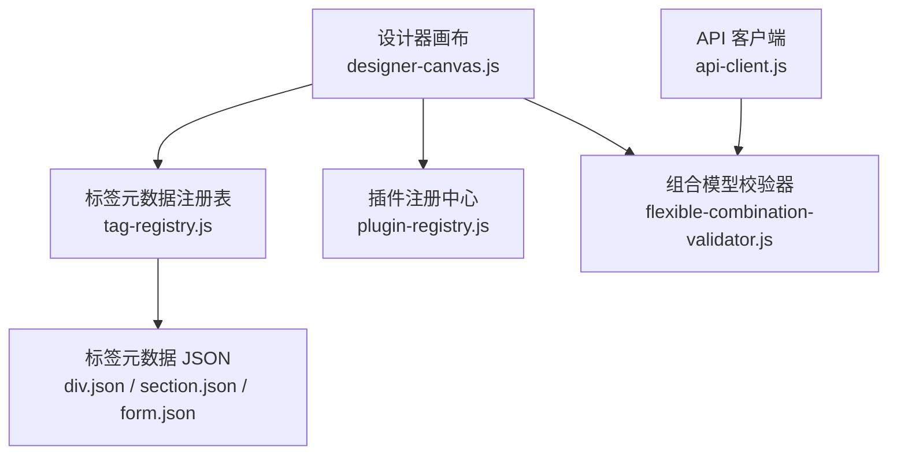
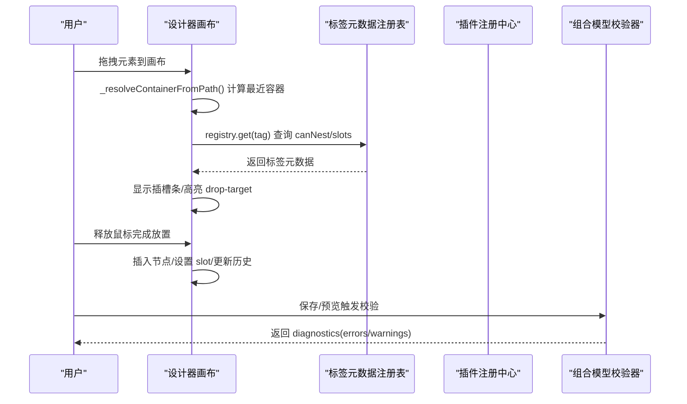
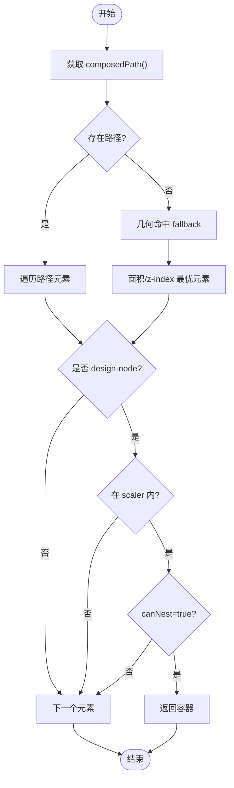
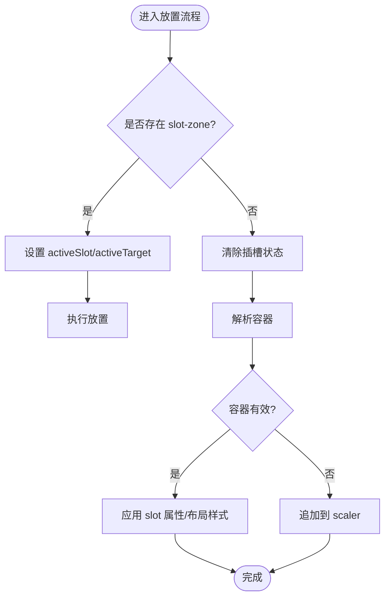
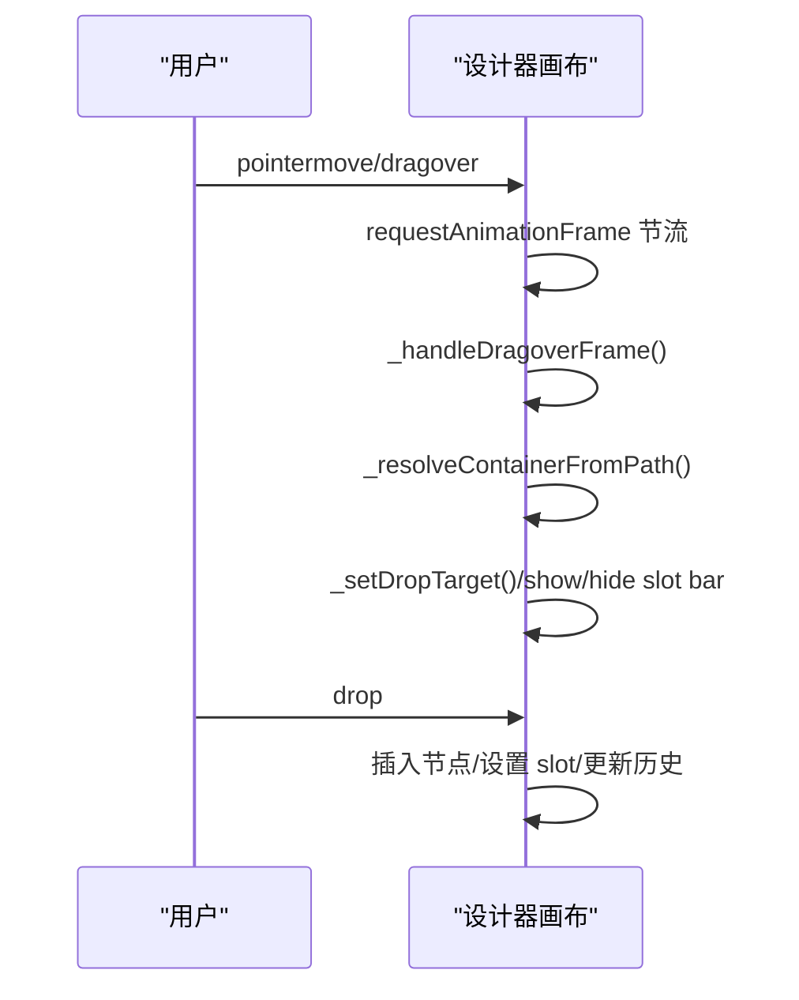
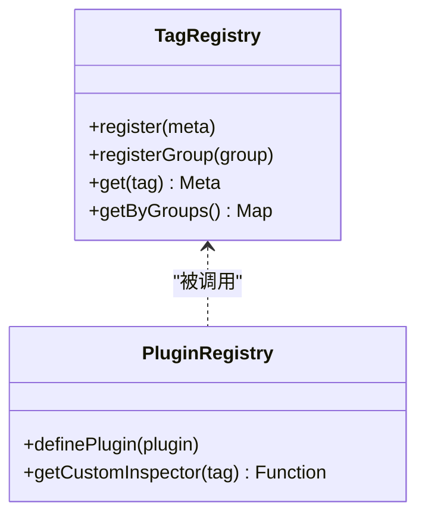
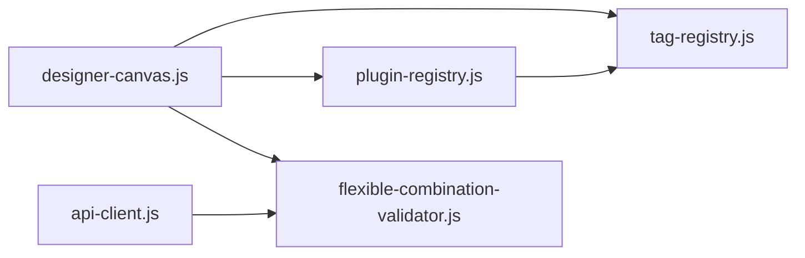

# 目标识别系统

<cite>
**本文引用的文件**
- [designer-canvas.js](file://CMXHTMLDesigner/src/components/designer-canvas.js)
- [tag-registry.js](file://CMXHTMLDesigner/src/metadata/tag-registry.js)
- [plugin-registry.js](file://CMXHTMLDesigner/src/lib/plugin-registry.js)
- [div.json](file://CMXHTMLDesigner/src/metadata/tags/div.json)
- [section.json](file://CMXHTMLDesigner/src/metadata/tags/section.json)
- [form.json](file://CMXHTMLDesigner/src/metadata/tags/form.json)
- [flexible-combination-validator.js](file://packages/cmx-data-comp/src/lib/flexible-combination-validator.js)
- [api-client.js](file://CMXPortalManager/src/lib/api-client.js)
</cite>

## 目录
1. [简介](#简介)
2. [项目结构](#项目结构)
3. [核心组件](#核心组件)
4. [架构总览](#架构总览)
5. [详细组件分析](#详细组件分析)
6. [依赖关系分析](#依赖关系分析)
7. [性能考量](#性能考量)
8. [故障排查指南](#故障排查指南)
9. [结论](#结论)
10. [附录](#附录)

## 简介
本技术文档面向“目标识别系统”，聚焦于设计器画布中的容器解析、嵌套规则验证、拖拽目标选择与自定义容器扩展机制，并给出错误处理与回退策略。该系统以 DOM 树遍历为基础，结合标签元数据注册表与插件体系，实现可插拔的容器类型识别与层级关系构建；在交互层面提供“最近优先”的拖拽命中、可见性与交互状态判断，以及插槽匹配与布局约束校验；在数据侧提供灵活的组合模型校验能力，保障页面结构与业务规则的完整性。

## 项目结构
目标识别相关能力主要分布在以下模块：
- 设计器画布与交互：负责 DOM 遍历、容器识别、拖拽命中、插槽指示与落点计算
- 标签元数据注册表：集中管理标签能力（是否可嵌套、插槽、默认行为等）
- 插件注册中心：动态扩展组件元数据与属性面板渲染
- 数据组合校验器：对组合模型的维度、字段、分组、公式等进行静态校验
- API 客户端：统一错误响应封装，便于上层回退与提示

图表来源
- [designer-canvas.js:50-120](file://CMXHTMLDesigner/src/components/designer-canvas.js#L50-L120)
- [tag-registry.js:15-66](file://CMXHTMLDesigner/src/metadata/tag-registry.js#L15-L66)
- [plugin-registry.js:60-89](file://CMXHTMLDesigner/src/lib/plugin-registry.js#L60-L89)
- [div.json:1-34](file://CMXHTMLDesigner/src/metadata/tags/div.json#L1-L34)
- [section.json:1-18](file://CMXHTMLDesigner/src/metadata/tags/section.json#L1-L18)
- [form.json:1-35](file://CMXHTMLDesigner/src/metadata/tags/form.json#L1-L35)
- [flexible-combination-validator.js:24-118](file://packages/cmx-data-comp/src/lib/flexible-combination-validator.js#L24-L118)
- [api-client.js:249-258](file://CMXPortalManager/src/lib/api-client.js#L249-L258)

章节来源
- [designer-canvas.js:50-120](file://CMXHTMLDesigner/src/components/designer-canvas.js#L50-L120)
- [tag-registry.js:15-66](file://CMXHTMLDesigner/src/metadata/tag-registry.js#L15-L66)
- [plugin-registry.js:60-89](file://CMXHTMLDesigner/src/lib/plugin-registry.js#L60-L89)

## 核心组件
- 设计器画布（DesignerCanvas）
  - 负责 DOM 树遍历、容器识别、拖拽命中、插槽指示、节点创建与插入、选中与覆盖层更新、撤销重做历史等
  - 关键方法包括：_resolveContainer、_resolveContainerFromPath、_handleDragoverFrame、_bindDrop、_createNode、_selectNode 等
- 标签元数据注册表（TagRegistry）
  - 维护标签能力（canNest、isVoid、slots、attrs、events、defaultSetup），支持组管理与动态加载
  - 提供 get(tag) 返回标签元信息，未注册标签有默认回退
- 插件注册中心（Plugin Registry）
  - definePlugin 动态注册组件元数据与自定义 Inspector，派发 cmx:plugin-registered 事件驱动 UI 刷新
- 组合模型校验器（FlexibleCombination Validator）
  - 校验 dimensions/rules/columnModel/fields/groups 等结构，检测锚点、字段重复、公式循环依赖、聚合配置合法性等
- API 客户端（API Client）
  - 统一错误响应封装，支持 violations 透传，便于上层进行回退与提示

章节来源
- [designer-canvas.js:50-120](file://CMXHTMLDesigner/src/components/designer-canvas.js#L50-L120)
- [tag-registry.js:15-66](file://CMXHTMLDesigner/src/metadata/tag-registry.js#L15-L66)
- [plugin-registry.js:60-89](file://CMXHTMLDesigner/src/lib/plugin-registry.js#L60-L89)
- [flexible-combination-validator.js:24-118](file://packages/cmx-data-comp/src/lib/flexible-combination-validator.js#L24-L118)
- [api-client.js:249-258](file://CMXPortalManager/src/lib/api-client.js#L249-L258)

## 架构总览
目标识别系统围绕“画布交互 + 元数据驱动 + 插件扩展 + 数据校验”的四层架构展开：
- 交互层：画布捕获指针/拖拽事件，计算命中元素，识别容器与插槽区域
- 元数据层：通过 TagRegistry 获取标签能力，决定容器是否可嵌套、插槽名称与方向
- 扩展层：通过 Plugin Registry 动态注入新组件元数据与属性面板渲染函数
- 数据层：组合模型校验器在保存/预览前对规则与字段进行静态检查，确保一致性

图表来源
- [designer-canvas.js:531-642](file://CMXHTMLDesigner/src/components/designer-canvas.js#L531-L642)
- [designer-canvas.js:744-779](file://CMXHTMLDesigner/src/components/designer-canvas.js#L744-L779)
- [tag-registry.js:43-66](file://CMXHTMLDesigner/src/metadata/tag-registry.js#L43-L66)
- [plugin-registry.js:60-89](file://CMXHTMLDesigner/src/lib/plugin-registry.js#L60-L89)
- [flexible-combination-validator.js:24-118](file://packages/cmx-data-comp/src/lib/flexible-combination-validator.js#L24-L118)

## 详细组件分析

### 容器解析算法（DOM 树遍历、容器类型识别、层级关系构建）
- DOM 树遍历与命中
  - 使用 composedPath() 穿透 Shadow DOM 重定向，按“最内层→外层”顺序查找第一个标记为 design-node 的元素
  - 若无法获取 composedPath，则回退到几何命中：elementsFromPoint + getBoundingClientRect，按面积与 z-index 择优
- 容器类型识别
  - 通过 registry.get(tag) 获取标签元数据，依据 canNest 判定是否为有效容器
  - 忽略遮罩层（overlay）与不在缩放容器内的元素
- 层级关系构建
  - 拖拽移动时记录 movingEl，避免将自身或子元素作为父容器
  - 根据插槽区（slot-zone）与容器插槽定义，确定最终插入位置与 slot 属性

图表来源
- [designer-canvas.js:654-693](file://CMXHTMLDesigner/src/components/designer-canvas.js#L654-L693)
- [designer-canvas.js:744-779](file://CMXHTMLDesigner/src/components/designer-canvas.js#L744-L779)
- [tag-registry.js:43-66](file://CMXHTMLDesigner/src/metadata/tag-registry.js#L43-L66)

章节来源
- [designer-canvas.js:654-693](file://CMXHTMLDesigner/src/components/designer-canvas.js#L654-L693)
- [designer-canvas.js:744-779](file://CMXHTMLDesigner/src/components/designer-canvas.js#L744-L779)
- [tag-registry.js:43-66](file://CMXHTMLDesigner/src/metadata/tag-registry.js#L43-L66)

### 嵌套规则验证（父子关系检查、插槽匹配、布局约束验证）
- 父子关系检查
  - 拖拽移动时排除 movingEl 及其子元素作为目标容器，防止自引用
  - 仅允许 canNest=true 的容器作为父级
- 插槽匹配
  - 当容器声明 slots 时，显示插槽条；用户可选择具体 slot 名称或默认内容
  - 放置时根据 activeSlot 设置 slot 属性，并对特定 slot（如 header）应用布局样式
- 布局约束验证
  - 插槽方向（horizontal/vertical）影响插槽条展示与标签文案
  - 对齐与尺寸调整受最小尺寸与相对定位限制

图表来源
- [designer-canvas.js:531-642](file://CMXHTMLDesigner/src/components/designer-canvas.js#L531-L642)
- [designer-canvas.js:474-529](file://CMXHTMLDesigner/src/components/designer-canvas.js#L474-L529)

章节来源
- [designer-canvas.js:531-642](file://CMXHTMLDesigner/src/components/designer-canvas.js#L531-L642)
- [designer-canvas.js:474-529](file://CMXHTMLDesigner/src/components/designer-canvas.js#L474-L529)

### 拖拽目标选择（最近优先原则、可见性检查、交互状态判断）
- 最近优先原则
  - 使用 composedPath() 从最内层元素开始查找，保证命中最近的容器
  - 几何回退时使用 elementsFromPoint 并按面积与 z-index 择优
- 可见性检查
  - 忽略 overlay 与不在 scaler 内的元素，避免误命中
  - 滚动/触摸时隐藏临时覆盖层，避免遮挡
- 交互状态判断
  - dragover 节流至 rAF 帧，减少重复计算
  - 区分 move/copy 模式，设置 dataTransfer.dropEffect
  - 仅在容器可嵌套且非 movingEl 自身时高亮 drop-target

图表来源
- [designer-canvas.js:531-642](file://CMXHTMLDesigner/src/components/designer-canvas.js#L531-L642)
- [designer-canvas.js:610-642](file://CMXHTMLDesigner/src/components/designer-canvas.js#L610-L642)

章节来源
- [designer-canvas.js:531-642](file://CMXHTMLDesigner/src/components/designer-canvas.js#L531-L642)
- [designer-canvas.js:610-642](file://CMXHTMLDesigner/src/components/designer-canvas.js#L610-L642)

### 自定义容器的扩展机制（接口定义与插件架构）
- 插件对象结构
  - id：唯一标识
  - groups：新增调色板组定义
  - components：组件元数据数组（与标签 JSON 格式一致）
  - customInspectors：可选，为指定 tag 提供属性面板渲染函数
- 注册流程
  - definePlugin 校验必填字段，注册组与组件元数据，覆盖同名 tag 的元信息
  - 派发 cmx:plugin-registered 事件，左侧面板监听后刷新
- 运行时行为
  - TagRegistry.get(tag) 返回合并后的元数据，包含 attrs、styles、events、defaultSetup
  - 未注册标签有默认回退（canNest=true、isVoid=false、通用事件）

图表来源
- [tag-registry.js:15-66](file://CMXHTMLDesigner/src/metadata/tag-registry.js#L15-L66)
- [plugin-registry.js:60-89](file://CMXHTMLDesigner/src/lib/plugin-registry.js#L60-L89)

章节来源
- [plugin-registry.js:60-89](file://CMXHTMLDesigner/src/lib/plugin-registry.js#L60-L89)
- [tag-registry.js:15-66](file://CMXHTMLDesigner/src/metadata/tag-registry.js#L15-L66)

### 数据组合校验（维度、字段、分组、公式）
- 维度与锚点
  - 校验 anchorDimensions 是否在 dimensions 中定义
  - 校验 anchor.columns 为非空字符串，anchor.match 键必须在锚点列/维度或其属性列中
- 字段与分组
  - fields 必须为数组（overlay 模式除外），id 唯一，dimType 合法
  - groups.members 引用字段必须存在，支持嵌套分组与重复警告
- 公式与依赖
  - formula 与 validations.expr 需可编译，检测循环依赖
- 附加属性
  - columnModel/group.columnModel 字段类型校验，display/edit 模式白名单校验

章节来源
- [flexible-combination-validator.js:24-118](file://packages/cmx-data-comp/src/lib/flexible-combination-validator.js#L24-L118)
- [flexible-combination-validator.js:127-195](file://packages/cmx-data-comp/src/lib/flexible-combination-validator.js#L127-L195)
- [flexible-combination-validator.js:197-228](file://packages/cmx-data-comp/src/lib/flexible-combination-validator.js#L197-L228)
- [flexible-combination-validator.js:230-246](file://packages/cmx-data-comp/src/lib/flexible-combination-validator.js#L230-L246)
- [flexible-combination-validator.js:254-315](file://packages/cmx-data-comp/src/lib/flexible-combination-validator.js#L254-L315)
- [flexible-combination-validator.js:339-350](file://packages/cmx-data-comp/src/lib/flexible-combination-validator.js#L339-L350)
- [flexible-combination-validator.js:359-383](file://packages/cmx-data-comp/src/lib/flexible-combination-validator.js#L359-L383)

## 依赖关系分析
- 设计器画布依赖标签元数据注册表以识别容器能力与插槽
- 插件注册中心向注册表注入自定义组件元数据，影响容器识别与属性面板
- 组合模型校验器独立于画布，但在保存/预览时被调用，提供数据一致性保障
- API 客户端统一错误响应，便于上层回退与提示

图表来源
- [designer-canvas.js:50-120](file://CMXHTMLDesigner/src/components/designer-canvas.js#L50-L120)
- [tag-registry.js:15-66](file://CMXHTMLDesigner/src/metadata/tag-registry.js#L15-L66)
- [plugin-registry.js:60-89](file://CMXHTMLDesigner/src/lib/plugin-registry.js#L60-L89)
- [flexible-combination-validator.js:24-118](file://packages/cmx-data-comp/src/lib/flexible-combination-validator.js#L24-L118)
- [api-client.js:249-258](file://CMXPortalManager/src/lib/api-client.js#L249-L258)

章节来源
- [designer-canvas.js:50-120](file://CMXHTMLDesigner/src/components/designer-canvas.js#L50-L120)
- [tag-registry.js:15-66](file://CMXHTMLDesigner/src/metadata/tag-registry.js#L15-L66)
- [plugin-registry.js:60-89](file://CMXHTMLDesigner/src/lib/plugin-registry.js#L60-L89)
- [flexible-combination-validator.js:24-118](file://packages/cmx-data-comp/src/lib/flexible-combination-validator.js#L24-L118)
- [api-client.js:249-258](file://CMXPortalManager/src/lib/api-client.js#L249-L258)

## 性能考量
- 命中计算优化
  - 优先使用 composedPath() 避免强制布局；几何回退时按面积与 z-index 快速择优
- 事件节流
  - dragover 使用 requestAnimationFrame 节流，仅处理最后一帧，降低重复计算开销
- 历史与覆盖层
  - 撤销重做历史上限控制，避免内存增长
  - 覆盖层更新延迟一帧，等待浏览器布局完成后再绘制，减少重排

[本节为通用指导，不直接分析具体文件]

## 故障排查指南
- 容器识别失败
  - 检查标签元数据是否注册，canNest 是否正确
  - 确认元素位于 scaler 内且未被 overlay 遮挡
- 插槽不生效
  - 检查容器是否声明 slots，activeSlot 是否正确设置
  - 确认放置时 slot 属性已写入，布局样式（如 header 的 marginLeft）已应用
- 校验错误
  - 查看 diagnostics.errors 与 warnings，定位字段/分组/公式问题
  - 对于 violations，参考 API 客户端返回结构进行提示与回滚
- 插件未生效
  - 确认 definePlugin 已调用且 id 唯一
  - 监听 cmx:plugin-registered 事件，检查调色板是否刷新

章节来源
- [designer-canvas.js:531-642](file://CMXHTMLDesigner/src/components/designer-canvas.js#L531-L642)
- [designer-canvas.js:744-779](file://CMXHTMLDesigner/src/components/designer-canvas.js#L744-L779)
- [flexible-combination-validator.js:24-118](file://packages/cmx-data-comp/src/lib/flexible-combination-validator.js#L24-L118)
- [api-client.js:249-258](file://CMXPortalManager/src/lib/api-client.js#L249-L258)
- [plugin-registry.js:60-89](file://CMXHTMLDesigner/src/lib/plugin-registry.js#L60-L89)

## 结论
目标识别系统通过“画布交互 + 元数据驱动 + 插件扩展 + 数据校验”的组合，实现了稳健的容器解析、嵌套规则验证、拖拽目标选择与可扩展的自定义容器机制。其设计兼顾性能与可维护性，提供了完善的错误处理与回退策略，适用于复杂的企业级页面设计与数据建模场景。

[本节为总结，不直接分析具体文件]

## 附录
- 标签元数据示例
  - div.json：通用块级容器，可嵌套，支持布局/弹性/文本/盒模型/定位样式组
  - section.json：文档区块容器，可嵌套
  - form.json：表单容器，可嵌套，支持 action/method 属性与表单事件预设

章节来源
- [div.json:1-34](file://CMXHTMLDesigner/src/metadata/tags/div.json#L1-L34)
- [section.json:1-18](file://CMXHTMLDesigner/src/metadata/tags/section.json#L1-L18)
- [form.json:1-35](file://CMXHTMLDesigner/src/metadata/tags/form.json#L1-L35)