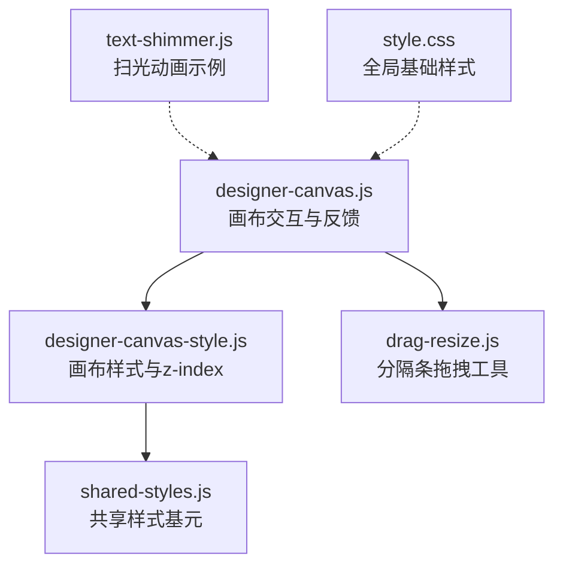
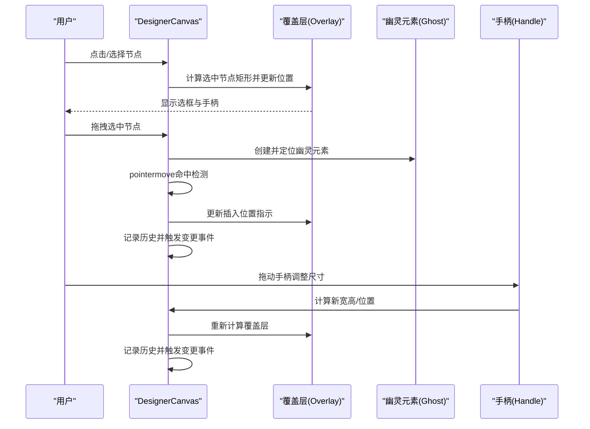
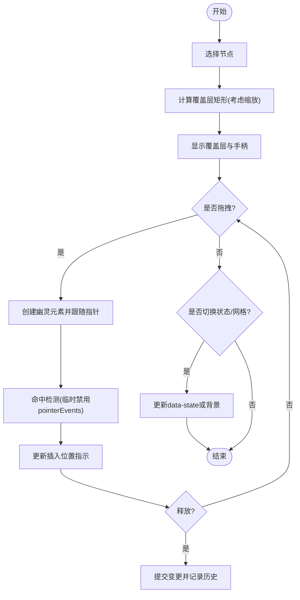
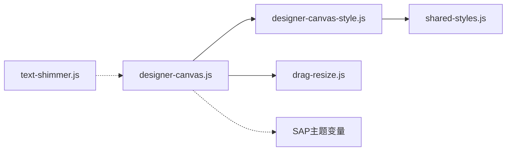

# 视觉反馈系统

<cite>
**本文引用的文件**
- [designer-canvas.js](file://CMXHTMLDesigner/src/components/designer-canvas.js)
- [designer-canvas-style.js](file://CMXHTMLDesigner/src/components/designer-canvas-style.js)
- [shared-styles.js](file://CMXHTMLDesigner/src/styles/shared-styles.js)
- [drag-resize.js](file://CMXHTMLDesigner/src/utils/drag-resize.js)
- [text-shimmer.js](file://CMXPortalManager/src/ai-workbench/utils/text-shimmer.js)
- [style.css](file://CMXHTMLDesigner/src/style.css)
</cite>

## 目录
1. [简介](#简介)
2. [项目结构](#项目结构)
3. [核心组件](#核心组件)
4. [架构总览](#架构总览)
5. [详细组件分析](#详细组件分析)
6. [依赖关系分析](#依赖关系分析)
7. [性能考量](#性能考量)
8. [故障排查指南](#故障排查指南)
9. [结论](#结论)
10. [附录](#附录)

## 简介
本技术文档聚焦于设计器画布中的“视觉反馈系统”，围绕以下目标展开：
- 幽灵元素创建：元素克隆、样式复制与定位计算
- 高亮显示机制：目标元素标记、插入位置指示与预览效果
- 动画效果实现：过渡动画、缓动函数与性能优化
- 响应式反馈：不同屏幕尺寸的适配与动态调整
- 自定义反馈样式配置方法

该系统主要实现在 CMXHTMLDesigner 的画布组件中，通过选择覆盖层、拖拽幽灵元素、缩放容器与八向手柄等能力，提供直观的可视化交互反馈。

## 项目结构
与视觉反馈直接相关的代码集中在以下模块：
- 画布组件与交互逻辑：designer-canvas.js
- 画布样式与层级管理：designer-canvas-style.js
- 共享样式基元：shared-styles.js
- 通用拖拽工具：drag-resize.js
- 扫光文本动画（示例性反馈动画）：text-shimmer.js
- 全局基础样式：style.css

图表来源
- [designer-canvas.js:1-100](file://CMXHTMLDesigner/src/components/designer-canvas.js#L1-L100)
- [designer-canvas-style.js:1-45](file://CMXHTMLDesigner/src/components/designer-canvas-style.js#L1-L45)
- [shared-styles.js:1-61](file://CMXHTMLDesigner/src/styles/shared-styles.js#L1-L61)
- [drag-resize.js:1-66](file://CMXHTMLDesigner/src/utils/drag-resize.js#L1-L66)
- [text-shimmer.js:1-64](file://CMXPortalManager/src/ai-workbench/utils/text-shimmer.js#L1-L64)
- [style.css:1-17](file://CMXHTMLDesigner/src/style.css#L1-L17)

章节来源
- [designer-canvas.js:1-120](file://CMXHTMLDesigner/src/components/designer-canvas.js#L1-L120)
- [designer-canvas-style.js:1-45](file://CMXHTMLDesigner/src/components/designer-canvas-style.js#L1-L45)
- [shared-styles.js:1-61](file://CMXHTMLDesigner/src/styles/shared-styles.js#L1-L61)
- [drag-resize.js:1-66](file://CMXHTMLDesigner/src/utils/drag-resize.js#L1-L66)
- [text-shimmer.js:1-64](file://CMXPortalManager/src/ai-workbench/utils/text-shimmer.js#L1-L64)
- [style.css:1-17](file://CMXHTMLDesigner/src/style.css#L1-L17)

## 核心组件
- 画布组件 DesignerCanvas：负责选择、拖拽、缩放、历史撤销、事件脚本绑定以及视觉反馈（覆盖层、幽灵元素、插入指示）。
- 画布样式 CANVAS_STYLE：定义设计区、缩放容器、覆盖层、手柄、拖拽状态等样式与 z-index 层级。
- 共享样式 TOOLBAR_BASE/FIELD_ROW：统一工具栏与表单行样式，确保跨组件一致性。
- 拖拽工具 drag-resize：为分隔条提供水平/垂直拖拽能力，用于面板尺寸调整。
- 扫光动画 text-shimmer：演示基于 CSS 的轻量级动画与可访问性适配（减少动态效果）。
- 全局样式 style.css：设置根背景色、字体与溢出行为，作为应用的基础样式。

章节来源
- [designer-canvas.js:50-120](file://CMXHTMLDesigner/src/components/designer-canvas.js#L50-L120)
- [designer-canvas-style.js:1-45](file://CMXHTMLDesigner/src/components/designer-canvas-style.js#L1-L45)
- [shared-styles.js:24-61](file://CMXHTMLDesigner/src/styles/shared-styles.js#L24-L61)
- [drag-resize.js:10-66](file://CMXHTMLDesigner/src/utils/drag-resize.js#L10-L66)
- [text-shimmer.js:19-64](file://CMXPortalManager/src/ai-workbench/utils/text-shimmer.js#L19-L64)
- [style.css:1-17](file://CMXHTMLDesigner/src/style.css#L1-L17)

## 架构总览
视觉反馈系统以画布为中心，围绕“选择—覆盖—拖拽—预览”形成闭环：
- 选择：选中节点后更新覆盖层位置与可见性
- 覆盖层：绘制选框与八向手柄，支持尺寸调整
- 拖拽：移动节点时生成幽灵元素跟随鼠标，实时命中检测并显示插入位置
- 预览：状态切换预览（如 active/visible）与网格背景切换
- 缩放：通过缩放容器保持覆盖层与手柄在缩放下的正确坐标

图表来源
- [designer-canvas.js:338-352](file://CMXHTMLDesigner/src/components/designer-canvas.js#L338-L352)
- [designer-canvas.js:368-418](file://CMXHTMLDesigner/src/components/designer-canvas.js#L368-L418)
- [designer-canvas.js:706-730](file://CMXHTMLDesigner/src/components/designer-canvas.js#L706-L730)

## 详细组件分析

### 幽灵元素创建：元素克隆、样式复制与定位计算
- 元素克隆与样式复制
  - 在拖拽过程中创建临时 div 作为幽灵元素，并通过内联样式模拟目标元素的标签名提示与主题色，保证高对比度与可读性。
  - 使用固定定位将幽灵元素置于视口顶层，避免被其他元素遮挡。
- 定位计算
  - 初始位置基于指针坐标加上偏移常量，确保不遮挡光标。
  - 拖动过程中持续更新 left/top，使幽灵元素跟随指针移动。
- 命中检测
  - 临时禁用目标元素的 pointer-events，调用 elementFromPoint 获取命中目标，再恢复原值，确保准确识别插入位置。
- 性能要点
  - 仅在当前拖拽会话中创建和销毁幽灵元素，避免长期持有 DOM 引用。
  - 命中检测仅在 pointermove 时执行，且最小化重排。

章节来源
- [designer-canvas.js:368-418](file://CMXHTMLDesigner/src/components/designer-canvas.js#L368-L418)

### 高亮显示机制：目标元素标记、插入位置指示与预览效果
- 目标元素标记
  - 选中节点后，根据缩放比例计算覆盖层 top/left/width/height，并添加 visible 类以显示选框。
  - 八向手柄按预设偏移与百分比定位，支持四边与四角调整。
- 插入位置指示
  - 拖拽命中目标后，通过覆盖层或内部指示元素展示插入点（例如边框高亮或占位线），并在释放时提交变更。
- 预览效果
  - 状态预览：尝试切换 data-state 属性至一组活跃值，读取 computed display 判断是否可见，从而在画布中预览不同状态下的布局表现。
  - 网格背景：切换径向渐变背景以辅助对齐与间距感知。

图表来源
- [designer-canvas.js:338-352](file://CMXHTMLDesigner/src/components/designer-canvas.js#L338-L352)
- [designer-canvas.js:354-365](file://CMXHTMLDesigner/src/components/designer-canvas.js#L354-L365)
- [designer-canvas.js:327-336](file://CMXHTMLDesigner/src/components/designer-canvas.js#L327-L336)
- [designer-canvas.js:890-910](file://CMXHTMLDesigner/src/components/designer-canvas.js#L890-L910)

章节来源
- [designer-canvas.js:327-365](file://CMXHTMLDesigner/src/components/designer-canvas.js#L327-L365)
- [designer-canvas.js:890-910](file://CMXHTMLDesigner/src/components/designer-canvas.js#L890-L910)

### 动画效果实现：过渡动画、缓动函数与性能优化
- 过渡与关键帧
  - 登录页与部分 UI 使用 CSS @keyframes 实现淡入、旋转、闪烁等效果；通过 will-change 与 transform 提升合成性能。
  - 扫光文本动画使用 background-position 动画与 background-clip:text，配合 prefers-reduced-motion 降低动效。
- 缓动函数
  - 多处使用 ease-in-out、linear 等内置缓动，平衡流畅性与性能。
- 性能优化
  - 使用 transform 与 opacity 进行动画，避免触发布局与绘制。
  - 对高频动画元素启用 will-change 提示浏览器提前优化。
  - 在低性能设备或用户偏好减少动效时，自动降级为静态样式。

章节来源
- [text-shimmer.js:19-64](file://CMXPortalManager/src/ai-workbench/utils/text-shimmer.js#L19-L64)
- [login.html:80-158](file://CMXHTMLDesigner/login.html#L80-L158)
- [login.html:275-298](file://CMXHTMLDesigner/login.html#L275-L298)

### 响应式反馈：不同屏幕尺寸的适配与动态调整
- 媒体查询
  - 登录页在不同断点下调整品牌面板宽度、标题字号与内容布局，保证移动端可用性。
  - 控制台等界面在小屏下切换为单列布局，提升可读性。
- 动态缩放
  - 画布支持缩放容器 transform-origin: top left，覆盖层与手柄根据缩放比重新计算坐标，确保在任何缩放级别下反馈一致。
- 可访问性
  - 遵循 prefers-reduced-motion 策略，在用户偏好减少动效时关闭动画。

章节来源
- [login.html:287-298](file://CMXHTMLDesigner/login.html#L287-L298)
- [portal-agent-console.js:1647-1651](file://CMXPortalManager/src/components/portal-agent-console.js#L1647-L1651)
- [designer-canvas-style.js:25-45](file://CMXHTMLDesigner/src/components/designer-canvas-style.js#L25-L45)
- [designer-canvas.js:338-352](file://CMXHTMLDesigner/src/components/designer-canvas.js#L338-L352)

### 自定义反馈样式的配置方法
- 主题变量
  - 通过 SAP 主题变量（如 --sapBackgroundColor、--sapTextColor、--sapHighlightColor）统一控制颜色与对比度，便于切换主题。
- 组件样式扩展
  - 在 :host 或组件作用域内覆盖默认样式，如调整工具栏高度、字段行布局、覆盖层边框与阴影等。
- 层级与可见性
  - 通过 z-index 常量管理覆盖层、手柄、幽灵元素层级，避免相互遮挡。
- 栅格与对齐
  - 切换网格背景或使用 CSS 变量控制背景大小与颜色，辅助精确对齐。
- 可访问性开关
  - 结合 prefers-reduced-motion 与数据属性（如 data-active）控制动画启停，满足不同用户需求。

章节来源
- [shared-styles.js:8-22](file://CMXHTMLDesigner/src/styles/shared-styles.js#L8-L22)
- [shared-styles.js:24-61](file://CMXHTMLDesigner/src/styles/shared-styles.js#L24-L61)
- [designer-canvas-style.js:7-13](file://CMXHTMLDesigner/src/components/designer-canvas-style.js#L7-L13)
- [designer-canvas-style.js:25-45](file://CMXHTMLDesigner/src/components/designer-canvas-style.js#L25-L45)
- [text-shimmer.js:46-53](file://CMXPortalManager/src/ai-workbench/utils/text-shimmer.js#L46-L53)

## 依赖关系分析
- 组件耦合
  - designer-canvas.js 依赖样式模块 designer-canvas-style.js 与共享样式 shared-styles.js，形成松耦合的样式组合。
  - 拖拽分隔条功能复用 drag-resize.js，解耦具体 UI 组件。
- 外部依赖
  - 使用 SAP UI5 按钮与主题变量，确保与设计器整体风格一致。
  - 动画与可访问性策略参考 text-shimmer.js 的实现模式。
- 潜在循环依赖
  - 当前样式与组件间无循环导入，职责清晰。

图表来源
- [designer-canvas.js:1-20](file://CMXHTMLDesigner/src/components/designer-canvas.js#L1-L20)
- [designer-canvas-style.js:1-13](file://CMXHTMLDesigner/src/components/designer-canvas-style.js#L1-L13)
- [shared-styles.js:24-61](file://CMXHTMLDesigner/src/styles/shared-styles.js#L24-L61)
- [drag-resize.js:10-66](file://CMXHTMLDesigner/src/utils/drag-resize.js#L10-L66)
- [text-shimmer.js:19-64](file://CMXPortalManager/src/ai-workbench/utils/text-shimmer.js#L19-L64)

章节来源
- [designer-canvas.js:1-20](file://CMXHTMLDesigner/src/components/designer-canvas.js#L1-L20)
- [designer-canvas-style.js:1-13](file://CMXHTMLDesigner/src/components/designer-canvas-style.js#L1-L13)
- [shared-styles.js:24-61](file://CMXHTMLDesigner/src/styles/shared-styles.js#L24-L61)
- [drag-resize.js:10-66](file://CMXHTMLDesigner/src/utils/drag-resize.js#L10-L66)
- [text-shimmer.js:19-64](file://CMXPortalManager/src/ai-workbench/utils/text-shimmer.js#L19-L64)

## 性能考量
- 渲染路径优化
  - 使用 transform 与 opacity 进行动画，避免布局抖动。
  - 命中检测仅在必要的事件回调中执行，减少重绘。
- 内存管理
  - 幽灵元素在拖拽结束后立即移除，避免泄漏。
  - 事件监听器在交互结束时解绑，防止重复绑定。
- 可访问性
  - 尊重 prefers-reduced-motion，提供无动画降级方案。
- 缩放一致性
  - 覆盖层与手柄坐标按缩放比换算，确保在不同缩放级别下反馈稳定。

[本节为通用指导，不直接分析具体文件]

## 故障排查指南
- 覆盖层未显示或错位
  - 检查选中元素是否存在、是否可见（display/visibility/opacity），以及缩放容器 getBoundingClientRect 是否正确。
  - 确认 _updateOverlay 在缩放变化时重新计算。
- 幽灵元素不跟随或遮挡错误
  - 确认 pointermove 事件中指针 ID 匹配，且幽灵元素定位使用 fixed。
  - 命中检测前临时禁用 pointer-events，避免自身拦截。
- 手柄拖拽无效
  - 检查 handle 的 pointerup/move 事件绑定与解绑逻辑，确保在交互结束时清理。
  - 验证最小尺寸约束与相对定位修正逻辑。
- 动画卡顿或不符合预期
  - 检查是否使用了会触发布局的属性（如 width/height/top/left）进行动画，优先使用 transform。
  - 在需要时启用 will-change，并确保浏览器支持。
- 响应式布局异常
  - 核对媒体查询断点与容器尺寸，确保在小屏下切换为合适的布局。
  - 检查缩放容器 transform-origin 与缩放范围限制。

章节来源
- [designer-canvas.js:338-352](file://CMXHTMLDesigner/src/components/designer-canvas.js#L338-L352)
- [designer-canvas.js:368-418](file://CMXHTMLDesigner/src/components/designer-canvas.js#L368-L418)
- [designer-canvas.js:706-730](file://CMXHTMLDesigner/src/components/designer-canvas.js#L706-L730)
- [text-shimmer.js:46-53](file://CMXPortalManager/src/ai-workbench/utils/text-shimmer.js#L46-L53)

## 结论
该视觉反馈系统通过覆盖层、幽灵元素、八向手柄与缩放容器，提供了直观、稳定的设计器交互体验。其实现兼顾了性能与可访问性，并通过主题变量与媒体查询实现了灵活的样式定制与响应式适配。建议在后续迭代中继续强化：
- 更细粒度的命中区域与插入指示
- 更丰富的状态预览与差异对比
- 统一的动画规范与性能监控

[本节为总结性内容，不直接分析具体文件]

## 附录
- 关键常量与配置
  - 缩放范围与步长：min/max/step/reset/percent
  - 最小节点尺寸与拖拽幽灵偏移、层级
  - 状态预览集合与显示值集合
- 常用样式片段
  - 工具栏基样式、字段行布局
  - 画布设计区、缩放容器与拖拽状态样式
- 拖拽工具
  - 水平/垂直分隔条拖拽绑定与边界钳制

章节来源
- [designer-canvas.js:22-48](file://CMXHTMLDesigner/src/components/designer-canvas.js#L22-L48)
- [designer-canvas.js:327-336](file://CMXHTMLDesigner/src/components/designer-canvas.js#L327-L336)
- [designer-canvas-style.js:25-45](file://CMXHTMLDesigner/src/components/designer-canvas-style.js#L25-L45)
- [shared-styles.js:24-61](file://CMXHTMLDesigner/src/styles/shared-styles.js#L24-L61)
- [drag-resize.js:10-66](file://CMXHTMLDesigner/src/utils/drag-resize.js#L10-L66)