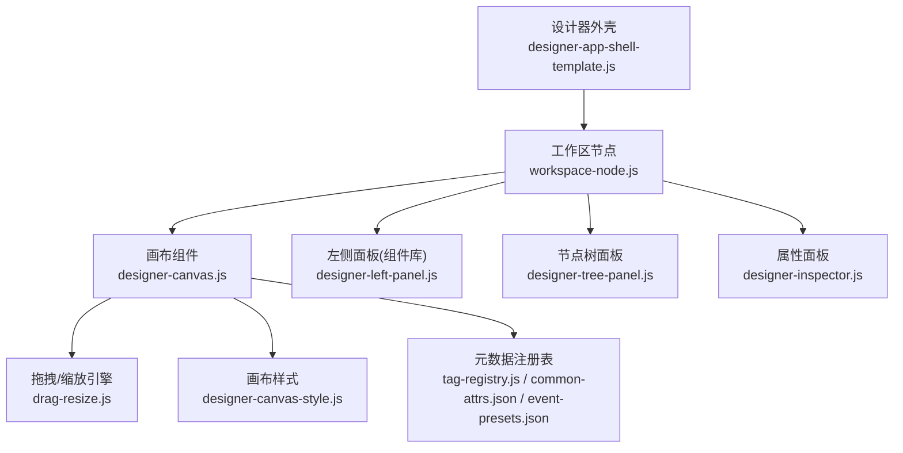
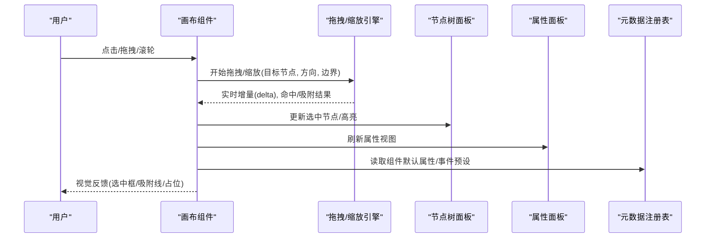
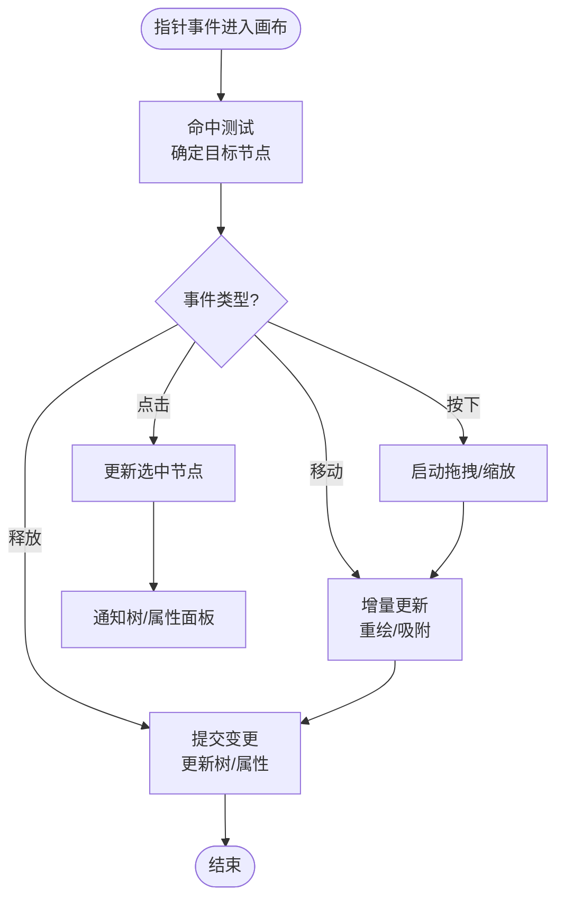
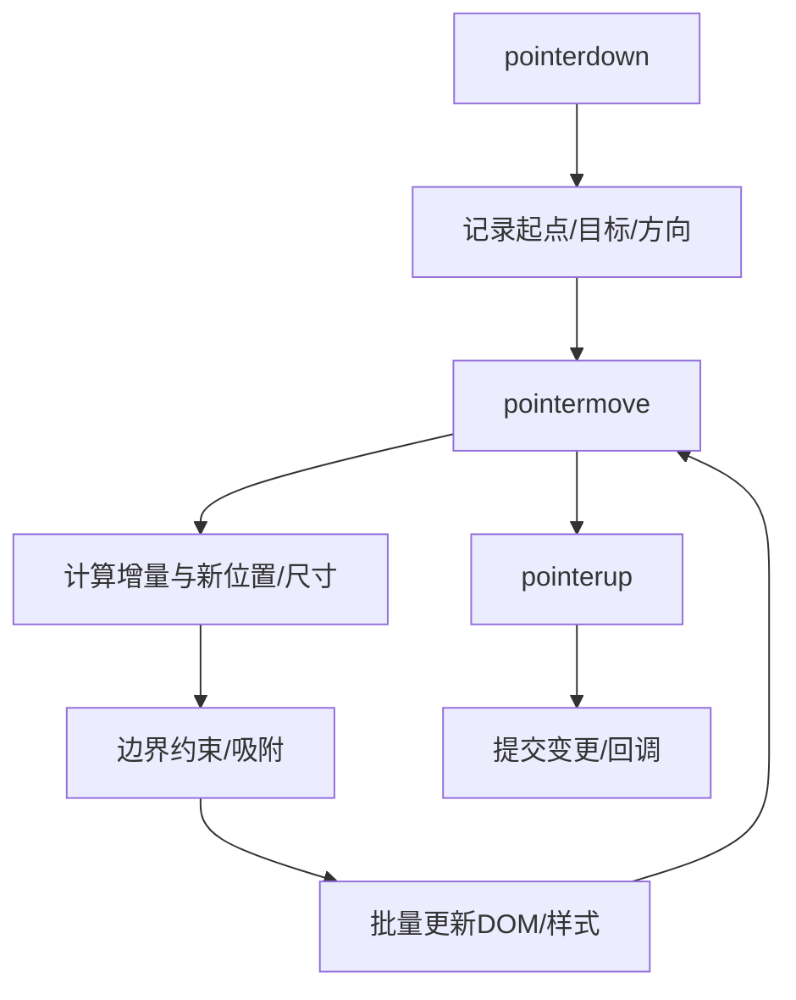
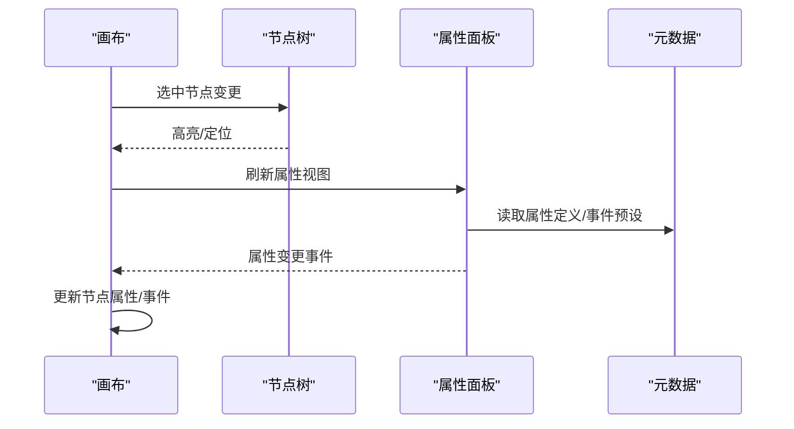
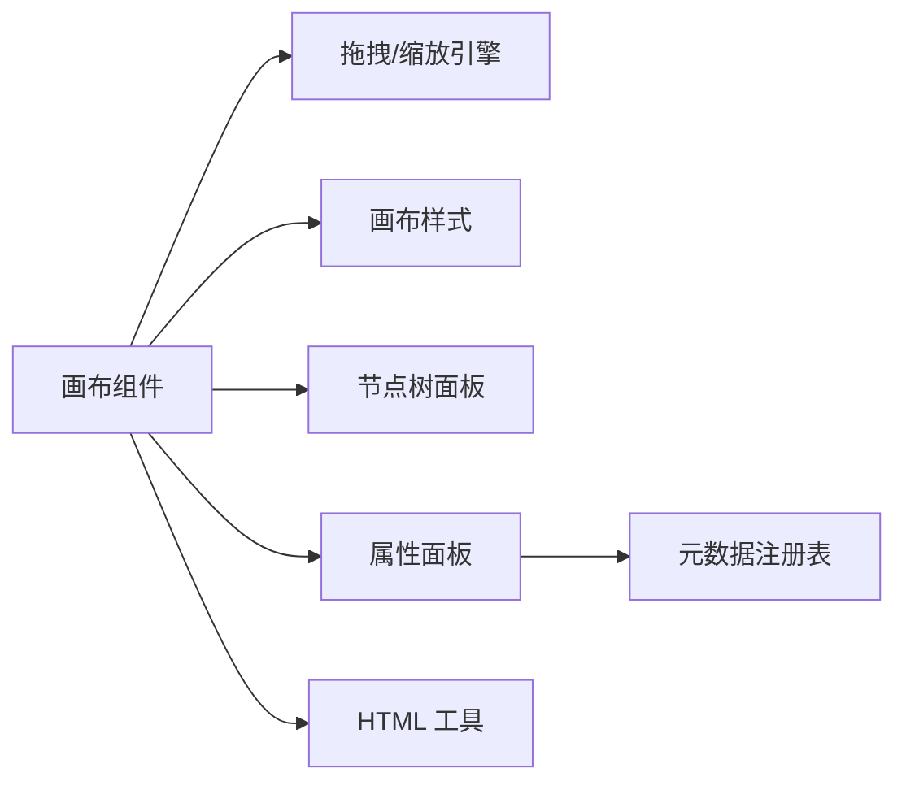

# 拖拽编辑系统

<cite>
**本文引用的文件**
- [designer-canvas.js](file://CMXHTMLDesigner/src/components/designer-canvas.js)
- [drag-resize.js](file://CMXHTMLDesigner/src/utils/drag-resize.js)
- [designer-canvas-style.js](file://CMXHTMLDesigner/src/components/designer-canvas-style.js)
- [designer-tree-panel.js](file://CMXHTMLDesigner/src/components/designer-tree-panel.js)
- [designer-left-panel.js](file://CMXHTMLDesigner/src/components/designer-left-panel.js)
- [designer-inspector.js](file://CMXHTMLDesigner/src/components/designer-inspector.js)
- [workspace-node.js](file://CMXHTMLDesigner/src/debug-portal/workspace-node.js)
- [html-utils.js](file://CMXHTMLDesigner/src/utils/html-utils.js)
- [tag-registry.js](file://CMXHTMLDesigner/src/metadata/tag-registry.js)
- [common-attrs.json](file://CMXHTMLDesigner/src/metadata/common-attrs.json)
- [event-presets.json](file://CMXHTMLDesigner/src/metadata/event-presets.json)
- [designer-app-shell-template.js](file://CMXHTMLDesigner/src/components/designer-app/designer-app-shell-template.js)
- [designer-workspace-node-dialog.js](file://CMXHTMLDesigner/src/components/designer-app/designer-workspace-node-dialog.js)
- [designer-run-common.js](file://CMXHTMLDesigner/src/components/designer-app/designer-run-common.js)
- [designer-server-export.js](file://CMXHTMLDesigner/src/components/designer-app/designer-server-export.js)
- [designer-preview.js](file://CMXHTMLDesigner/src/components/designer-app/designer-preview.js)
- [main.js](file://CMXHTMLDesigner/src/main.js)
</cite>

## 目录
1. [简介](#简介)
2. [项目结构](#项目结构)
3. [核心组件](#核心组件)
4. [架构总览](#架构总览)
5. [详细组件分析](#详细组件分析)
6. [依赖关系分析](#依赖关系分析)
7. [性能考虑](#性能考虑)
8. [故障排查指南](#故障排查指南)
9. [结论](#结论)
10. [附录：API 与使用示例](#附录api-与使用示例)

## 简介
本技术文档面向“拖拽编辑系统”，聚焦画布组件的实现原理、拖拽引擎的核心算法（碰撞检测、位置计算、视觉反馈）、节点树管理、DOM 操作优化与性能策略，以及手势处理、键盘导航和无障碍访问。同时说明与属性面板的联动机制和数据同步策略，并提供拖拽 API 的使用示例与自定义拖拽行为的实现方法。

## 项目结构
该系统的拖拽编辑能力主要位于 CMXHTMLDesigner 子工程中，关键目录与职责如下：
- components/designer-canvas.js：画布容器与交互中枢，负责元素选择、拖拽、缩放、吸附与渲染状态管理。
- utils/drag-resize.js：通用拖拽/缩放引擎，封装指针事件、边界约束、增量计算与回调分发。
- components/designer-canvas-style.js：画布样式与选中态、网格线、吸附辅助线的样式注入。
- components/designer-tree-panel.js：左侧节点树，维护 DOM 树与可视化树的双向同步。
- components/designer-left-panel.js：组件面板，提供可拖入画布的组件项。
- components/designer-inspector.js：右侧属性面板，展示并编辑当前选中节点的属性。
- debug-portal/workspace-node.js：工作区节点包装器，承载画布实例与生命周期。
- metadata/*：标签元数据、公共属性、事件预设等，驱动组件注册与属性面板生成。
- components/designer-app/*：应用壳层、预览、导出、运行等编排逻辑。

图表来源
- [designer-app-shell-template.js:1-200](file://CMXHTMLDesigner/src/components/designer-app/designer-app-shell-template.js#L1-L200)
- [workspace-node.js:1-200](file://CMXHTMLDesigner/src/debug-portal/workspace-node.js#L1-L200)
- [designer-canvas.js:1-300](file://CMXHTMLDesigner/src/components/designer-canvas.js#L1-L300)
- [drag-resize.js:1-200](file://CMXHTMLDesigner/src/utils/drag-resize.js#L1-L200)
- [designer-canvas-style.js:1-200](file://CMXHTMLDesigner/src/components/designer-canvas-style.js#L1-L200)
- [designer-left-panel.js:1-200](file://CMXHTMLDesigner/src/components/designer-left-panel.js#L1-L200)
- [designer-tree-panel.js:1-200](file://CMXHTMLDesigner/src/components/designer-tree-panel.js#L1-L200)
- [designer-inspector.js:1-200](file://CMXHTMLDesigner/src/components/designer-inspector.js#L1-L200)
- [tag-registry.js:1-200](file://CMXHTMLDesigner/src/metadata/tag-registry.js#L1-L200)
- [common-attrs.json:1-200](file://CMXHTMLDesigner/src/metadata/common-attrs.json#L1-L200)
- [event-presets.json:1-200](file://CMXHTMLDesigner/src/metadata/event-presets.json#L1-L200)

章节来源
- [designer-app-shell-template.js:1-200](file://CMXHTMLDesigner/src/components/designer-app/designer-app-shell-template.js#L1-L200)
- [workspace-node.js:1-200](file://CMXHTMLDesigner/src/debug-portal/workspace-node.js#L1-L200)
- [designer-canvas.js:1-300](file://CMXHTMLDesigner/src/components/designer-canvas.js#L1-L300)
- [drag-resize.js:1-200](file://CMXHTMLDesigner/src/utils/drag-resize.js#L1-L200)

## 核心组件
- 画布组件（designer-canvas.js）
  - 职责：承载页面内容、响应鼠标/触摸事件、管理选中态、触发拖拽/缩放、更新节点树与属性面板。
  - 关键点：事件委托、命中测试、坐标转换、吸附与对齐、撤销/重做集成点。
- 拖拽/缩放引擎（drag-resize.js）
  - 职责：统一封装 pointerdown/move/up、边界限制、增量计算、方向性缩放、视觉手柄绘制。
  - 关键点：防抖节流、requestAnimationFrame 批更新、最小步长、惯性/回弹可选。
- 样式模块（designer-canvas-style.js）
  - 职责：动态注入选中框、网格线、吸附线、占位指示器等样式。
- 节点树面板（designer-tree-panel.js）
  - 职责：维护 DOM 树与可视化树映射，支持展开/折叠、搜索、高亮同步。
- 左侧面板（designer-left-panel.js）
  - 职责：组件列表与拖拽源，提供拖入画布的元数据（标签、默认属性、事件）。
- 属性面板（designer-inspector.js）
  - 职责：根据选中节点类型渲染属性编辑器，双向绑定到节点属性与事件脚本。

章节来源
- [designer-canvas.js:1-300](file://CMXHTMLDesigner/src/components/designer-canvas.js#L1-L300)
- [drag-resize.js:1-200](file://CMXHTMLDesigner/src/utils/drag-resize.js#L1-L200)
- [designer-canvas-style.js:1-200](file://CMXHTMLDesigner/src/components/designer-canvas-style.js#L1-L200)
- [designer-tree-panel.js:1-200](file://CMXHTMLDesigner/src/components/designer-tree-panel.js#L1-L200)
- [designer-left-panel.js:1-200](file://CMXHTMLDesigner/src/components/designer-left-panel.js#L1-L200)
- [designer-inspector.js:1-200](file://CMXHTMLDesigner/src/components/designer-inspector.js#L1-L200)

## 架构总览
拖拽编辑系统采用“画布为中心”的架构：画布作为交互中枢，聚合拖拽引擎、样式注入、节点树与属性面板；通过元数据驱动组件注册与属性编辑；应用壳层负责初始化、预览与导出。

图表来源
- [designer-canvas.js:1-300](file://CMXHTMLDesigner/src/components/designer-canvas.js#L1-L300)
- [drag-resize.js:1-200](file://CMXHTMLDesigner/src/utils/drag-resize.js#L1-L200)
- [designer-tree-panel.js:1-200](file://CMXHTMLDesigner/src/components/designer-tree-panel.js#L1-L200)
- [designer-inspector.js:1-200](file://CMXHTMLDesigner/src/components/designer-inspector.js#L1-L200)
- [tag-registry.js:1-200](file://CMXHTMLDesigner/src/metadata/tag-registry.js#L1-L200)

## 详细组件分析

### 画布组件（designer-canvas.js）
- 事件处理与命中测试
  - 使用事件委托在画布根节点监听 pointer/mouse 事件，进行命中测试以确定目标节点。
  - 对复杂层级进行裁剪与可见性判断，减少不必要的遍历。
- 拖拽与缩放
  - 将指针事件转发给拖拽/缩放引擎，传入目标节点、方向、边界与回调。
  - 接收增量后批量更新 DOM，避免频繁重排。
- 选中态与视觉反馈
  - 通过样式模块注入选中边框、吸附线、网格线；在移动过程中显示占位指示。
- 节点树与属性面板联动
  - 选中变更时通知节点树高亮对应节点，并触发属性面板刷新。
- 键盘导航与无障碍
  - 支持 Tab/Shift+Tab 在节点间移动焦点，Enter/Space 确认操作，Esc 取消。
  - 为交互元素设置 aria-* 属性，确保屏幕阅读器可读。

图表来源
- [designer-canvas.js:1-300](file://CMXHTMLDesigner/src/components/designer-canvas.js#L1-L300)
- [designer-canvas-style.js:1-200](file://CMXHTMLDesigner/src/components/designer-canvas-style.js#L1-L200)

章节来源
- [designer-canvas.js:1-300](file://CMXHTMLDesigner/src/components/designer-canvas.js#L1-L300)
- [designer-canvas-style.js:1-200](file://CMXHTMLDesigner/src/components/designer-canvas-style.js#L1-L200)

### 拖拽/缩放引擎（drag-resize.js）
- 核心算法
  - 碰撞检测：基于目标元素的几何信息（getBoundingClientRect）与指针坐标计算是否命中。
  - 位置计算：记录初始位置与偏移量，按方向（上下左右/四角）计算新尺寸或位置。
  - 边界约束：限制在画布可视区域内，支持吸附到网格/其他元素边缘。
  - 视觉反馈：实时更新选中框、吸附线、占位指示，必要时绘制半透明预览。
- 性能优化
  - requestAnimationFrame 批处理更新，合并多次位移。
  - 防抖/节流高频事件，降低重排压力。
  - 最小步长与增量阈值，避免抖动。
- 扩展点
  - 提供钩子函数用于自定义吸附规则、碰撞规则与视觉表现。

图表来源
- [drag-resize.js:1-200](file://CMXHTMLDesigner/src/utils/drag-resize.js#L1-L200)

章节来源
- [drag-resize.js:1-200](file://CMXHTMLDesigner/src/utils/drag-resize.js#L1-L200)

### 节点树与属性面板联动
- 节点树（designer-tree-panel.js）
  - 维护 DOM 与可视化树的映射，支持展开/折叠、搜索、右键菜单。
  - 与画布保持双向同步：画布选中变更时高亮树节点；树中选中节点时画布滚动至可视区域并选中。
- 属性面板（designer-inspector.js）
  - 基于元数据（tag-registry.js、common-attrs.json、event-presets.json）动态生成属性编辑器。
  - 支持文本、数字、布尔、下拉、颜色、JSON 等编辑器类型。
  - 双向绑定：修改属性即时反映到节点，撤销/重做可追踪。

图表来源
- [designer-tree-panel.js:1-200](file://CMXHTMLDesigner/src/components/designer-tree-panel.js#L1-L200)
- [designer-inspector.js:1-200](file://CMXHTMLDesigner/src/components/designer-inspector.js#L1-L200)
- [tag-registry.js:1-200](file://CMXHTMLDesigner/src/metadata/tag-registry.js#L1-L200)
- [common-attrs.json:1-200](file://CMXHTMLDesigner/src/metadata/common-attrs.json#L1-L200)
- [event-presets.json:1-200](file://CMXHTMLDesigner/src/metadata/event-presets.json#L1-L200)

章节来源
- [designer-tree-panel.js:1-200](file://CMXHTMLDesigner/src/components/designer-tree-panel.js#L1-L200)
- [designer-inspector.js:1-200](file://CMXHTMLDesigner/src/components/designer-inspector.js#L1-L200)
- [tag-registry.js:1-200](file://CMXHTMLDesigner/src/metadata/tag-registry.js#L1-L200)
- [common-attrs.json:1-200](file://CMXHTMLDesigner/src/metadata/common-attrs.json#L1-L200)
- [event-presets.json:1-200](file://CMXHTMLDesigner/src/metadata/event-presets.json#L1-L200)

### 手势处理、键盘导航与无障碍
- 手势处理
  - 统一使用 Pointer Events，兼容鼠标与触摸；支持多点触控时的缩放与平移。
  - 区分点击、长按、滑动等手势，避免误触。
- 键盘导航
  - Tab/Shift+Tab 在节点间切换焦点；Enter/Space 执行默认操作；Esc 取消当前操作。
  - 方向键在网格中微调位置，配合吸附功能。
- 无障碍
  - 为交互元素添加 role、aria-label、aria-describedby 等属性。
  - 焦点管理：打开/关闭面板时正确转移焦点，避免焦点丢失。

章节来源
- [designer-canvas.js:1-300](file://CMXHTMLDesigner/src/components/designer-canvas.js#L1-L300)
- [designer-inspector.js:1-200](file://CMXHTMLDesigner/src/components/designer-inspector.js#L1-L200)

### 与属性面板的联动机制与数据同步策略
- 数据流
  - 画布选中节点 -> 属性面板渲染编辑器 -> 用户修改 -> 触发变更事件 -> 画布更新节点属性/事件 -> 节点树同步高亮。
- 同步策略
  - 单向数据流：属性面板只读渲染，变更通过事件上报。
  - 撤销/重做：每次变更生成快照或命令对象，支持回溯。
  - 防抖：批量属性变更合并提交，减少重绘。
- 元数据驱动
  - 通过 tag-registry.js 与 common-attrs.json 描述组件属性类型、默认值、校验规则。
  - event-presets.json 提供常用事件脚本模板，加速配置。

章节来源
- [designer-inspector.js:1-200](file://CMXHTMLDesigner/src/components/designer-inspector.js#L1-L200)
- [tag-registry.js:1-200](file://CMXHTMLDesigner/src/metadata/tag-registry.js#L1-L200)
- [common-attrs.json:1-200](file://CMXHTMLDesigner/src/metadata/common-attrs.json#L1-L200)
- [event-presets.json:1-200](file://CMXHTMLDesigner/src/metadata/event-presets.json#L1-L200)

## 依赖关系分析
- 组件耦合
  - 画布依赖拖拽/缩放引擎与样式模块；与节点树、属性面板松耦合，通过事件通信。
  - 属性面板依赖元数据注册表，解耦具体组件属性定义。
- 外部依赖
  - 浏览器原生 API：Pointer Events、getBoundingClientRect、requestAnimationFrame。
  - 工具函数：html-utils.js 提供 DOM 操作与序列化辅助。
- 潜在循环依赖
  - 通过事件总线或回调接口避免直接相互引用，保持低耦合。

图表来源
- [designer-canvas.js:1-300](file://CMXHTMLDesigner/src/components/designer-canvas.js#L1-L300)
- [drag-resize.js:1-200](file://CMXHTMLDesigner/src/utils/drag-resize.js#L1-L200)
- [designer-canvas-style.js:1-200](file://CMXHTMLDesigner/src/components/designer-canvas-style.js#L1-L200)
- [designer-tree-panel.js:1-200](file://CMXHTMLDesigner/src/components/designer-tree-panel.js#L1-L200)
- [designer-inspector.js:1-200](file://CMXHTMLDesigner/src/components/designer-inspector.js#L1-L200)
- [html-utils.js:1-200](file://CMXHTMLDesigner/src/utils/html-utils.js#L1-L200)
- [tag-registry.js:1-200](file://CMXHTMLDesigner/src/metadata/tag-registry.js#L1-L200)

章节来源
- [designer-canvas.js:1-300](file://CMXHTMLDesigner/src/components/designer-canvas.js#L1-L300)
- [drag-resize.js:1-200](file://CMXHTMLDesigner/src/utils/drag-resize.js#L1-L200)
- [html-utils.js:1-200](file://CMXHTMLDesigner/src/utils/html-utils.js#L1-L200)

## 性能考虑
- DOM 操作优化
  - 批量更新：使用 requestAnimationFrame 合并多次位移与样式变更。
  - 最小化重排：优先更新 transform/opacity，避免触发布局。
  - 虚拟滚动：对于大型节点树，仅渲染可视区域节点。
- 事件处理优化
  - 防抖/节流：对高频事件（pointermove）进行节流，降低 CPU 占用。
  - 事件委托：在画布根节点统一监听，减少事件监听器数量。
- 内存管理
  - 及时移除事件监听器与定时器，避免内存泄漏。
  - 大对象复用：如吸附线、占位指示器等 DOM 节点复用。
- 渲染优化
  - 分层渲染：将静态背景（网格线）与动态元素分离，减少重绘范围。
  - 离屏渲染：复杂效果先绘制到离屏 canvas，再合成到页面。

[本节为通用性能建议，不直接分析具体文件]

## 故障排查指南
- 常见问题
  - 拖拽卡顿：检查是否未使用 requestAnimationFrame 批量更新；确认是否存在大量重排。
  - 吸附失效：验证吸附规则是否正确注册；检查边界约束与网格参数。
  - 属性不同步：确认属性面板与画布的事件绑定是否正确；检查撤销/重做队列。
  - 键盘导航异常：检查焦点管理逻辑与 aria 属性设置。
- 调试技巧
  - 启用日志：在关键路径输出日志，观察事件流与状态变化。
  - 断点调试：在命中测试、增量计算、提交变更处设置断点。
  - 性能分析：使用浏览器性能面板分析帧率与主线程阻塞。

章节来源
- [designer-canvas.js:1-300](file://CMXHTMLDesigner/src/components/designer-canvas.js#L1-L300)
- [drag-resize.js:1-200](file://CMXHTMLDesigner/src/utils/drag-resize.js#L1-L200)
- [designer-inspector.js:1-200](file://CMXHTMLDesigner/src/components/designer-inspector.js#L1-L200)

## 结论
拖拽编辑系统以画布为核心，结合拖拽/缩放引擎、样式注入、节点树与属性面板，形成完整的可视化编辑体验。通过元数据驱动与事件通信，实现组件注册、属性编辑与数据同步。系统在性能、可访问性与可扩展性方面进行了充分考虑，适合企业级页面设计与定制需求。

[本节为总结性内容，不直接分析具体文件]

## 附录：API 与使用示例
- 初始化画布
  - 在工作区节点中挂载画布组件，传入容器元素与配置项（网格、吸附、撤销/重做开关）。
  - 参考：[workspace-node.js:1-200](file://CMXHTMLDesigner/src/debug-portal/workspace-node.js#L1-L200)
- 拖拽组件到画布
  - 从左侧面板拖拽组件项到画布，画布接收元数据并创建对应 DOM 节点。
  - 参考：[designer-left-panel.js:1-200](file://CMXHTMLDesigner/src/components/designer-left-panel.js#L1-L200)
- 自定义拖拽行为
  - 在拖拽/缩放引擎中注册自定义吸附规则或碰撞检测逻辑。
  - 参考：[drag-resize.js:1-200](file://CMXHTMLDesigner/src/utils/drag-resize.js#L1-L200)
- 属性面板扩展
  - 在元数据注册表中新增组件属性定义，属性面板自动渲染对应编辑器。
  - 参考：[tag-registry.js:1-200](file://CMXHTMLDesigner/src/metadata/tag-registry.js#L1-L200)、[common-attrs.json:1-200](file://CMXHTMLDesigner/src/metadata/common-attrs.json#L1-L200)
- 预览与导出
  - 使用应用壳层提供的预览与导出功能，将画布内容转换为可运行页面或服务器端资源。
  - 参考：[designer-preview.js:1-200](file://CMXHTMLDesigner/src/components/designer-app/designer-preview.js#L1-L200)、[designer-server-export.js:1-200](file://CMXHTMLDesigner/src/components/designer-app/designer-server-export.js#L1-L200)

章节来源
- [workspace-node.js:1-200](file://CMXHTMLDesigner/src/debug-portal/workspace-node.js#L1-L200)
- [designer-left-panel.js:1-200](file://CMXHTMLDesigner/src/components/designer-left-panel.js#L1-L200)
- [drag-resize.js:1-200](file://CMXHTMLDesigner/src/utils/drag-resize.js#L1-L200)
- [tag-registry.js:1-200](file://CMXHTMLDesigner/src/metadata/tag-registry.js#L1-L200)
- [common-attrs.json:1-200](file://CMXHTMLDesigner/src/metadata/common-attrs.json#L1-L200)
- [designer-preview.js:1-200](file://CMXHTMLDesigner/src/components/designer-app/designer-preview.js#L1-L200)
- [designer-server-export.js:1-200](file://CMXHTMLDesigner/src/components/designer-app/designer-server-export.js#L1-L200)