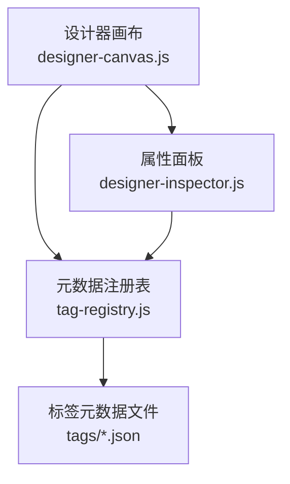
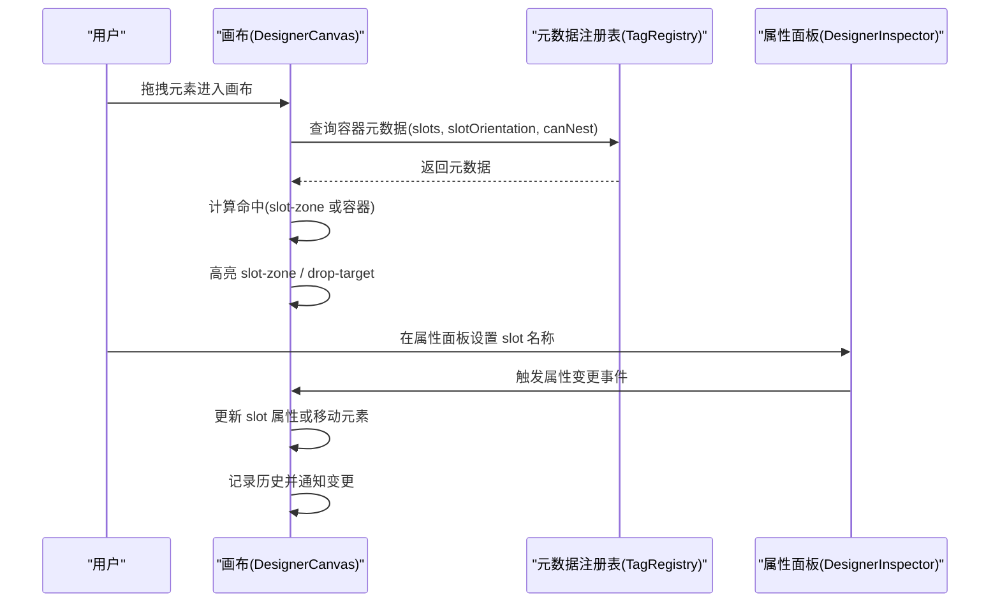
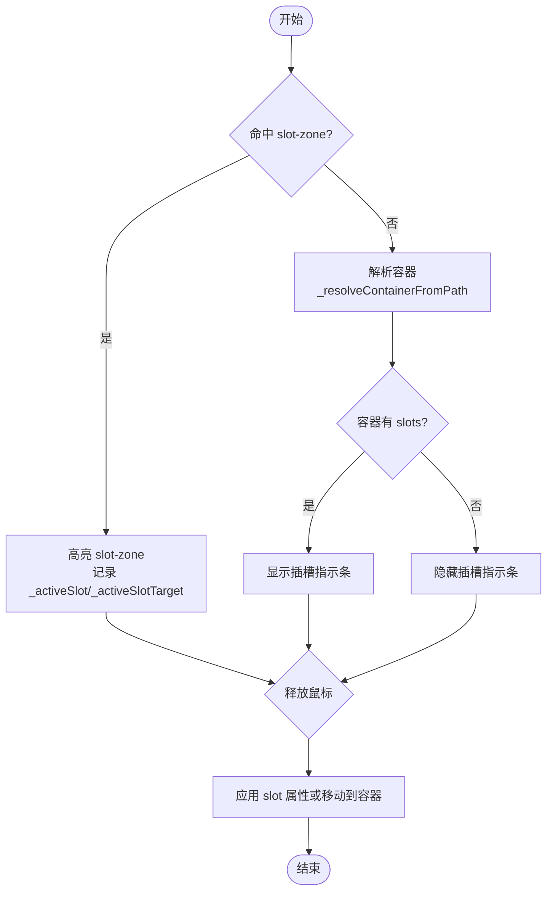
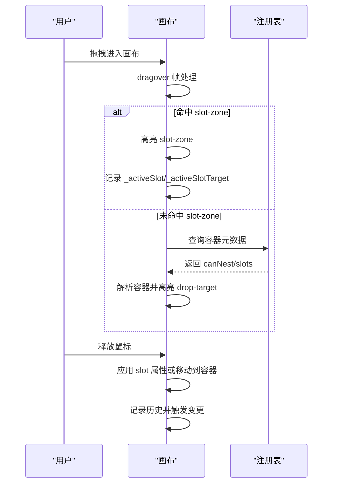
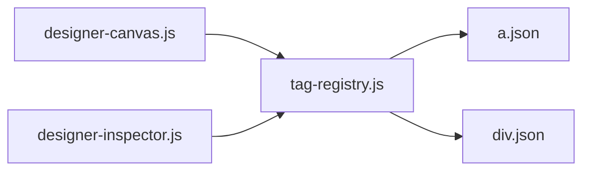

# 插槽系统

<cite>
**本文引用的文件**
- [designer-canvas.js](file://CMXHTMLDesigner/src/components/designer-canvas.js)
- [designer-inspector.js](file://CMXHTMLDesigner/src/components/designer-inspector.js)
- [tag-registry.js](file://CMXHTMLDesigner/src/metadata/tag-registry.js)
- [a.json](file://CMXHTMLDesigner/src/metadata/tags/a.json)
- [div.json](file://CMXHTMLDesigner/src/metadata/tags/div.json)
</cite>

## 目录
1. [简介](#简介)
2. [项目结构](#项目结构)
3. [核心组件](#核心组件)
4. [架构总览](#架构总览)
5. [详细组件分析](#详细组件分析)
6. [依赖关系分析](#依赖关系分析)
7. [性能考量](#性能考量)
8. [故障排查指南](#故障排查指南)
9. [结论](#结论)
10. [附录](#附录)

## 简介
本技术文档聚焦于设计器中的“插槽系统”，系统性阐述插槽概念、可视化与交互、拖拽分发逻辑、配置体系以及与组件元数据的关联机制。内容覆盖默认插槽、命名插槽、插槽指示条的显示与高亮、用户交互反馈、目标识别与插入、布局调整，以及插槽继承、重写与动态配置的最佳实践与常见问题解决方案。

## 项目结构
插槽系统主要位于 HTML 设计器前端模块中，涉及以下关键位置：
- 画布与交互：设计器画布组件负责插槽指示条渲染、拖拽命中、容器解析与落点插入。
- 属性面板：右侧属性面板提供 UI5 插槽名称设置与快捷槽位选择。
- 元数据注册表：标签元数据集中管理插槽列表、方向控制（如水平/垂直）与可嵌套能力等。
- 标签元数据文件：具体标签的元数据定义（attrs、styleGroups、eventPreset、extraEvents 等）。

图表来源
- [designer-canvas.js:474-529](file://CMXHTMLDesigner/src/components/designer-canvas.js#L474-L529)
- [designer-inspector.js:475-521](file://CMXHTMLDesigner/src/components/designer-inspector.js#L475-L521)
- [tag-registry.js:15-66](file://CMXHTMLDesigner/src/metadata/tag-registry.js#L15-L66)

章节来源
- [designer-canvas.js:474-642](file://CMXHTMLDesigner/src/components/designer-canvas.js#L474-L642)
- [designer-inspector.js:475-521](file://CMXHTMLDesigner/src/components/designer-inspector.js#L475-L521)
- [tag-registry.js:15-66](file://CMXHTMLDesigner/src/metadata/tag-registry.js#L15-L66)

## 核心组件
- 设计器画布（DesignerCanvas）
  - 插槽指示条：根据容器元素的元数据渲染 slot-bar，并生成多个 slot-zone 表示可用插槽区域。
  - 拖拽与命中：在 dragover/drop 过程中识别 slot-zone 或容器节点，更新 active 状态并记录当前激活的插槽名与目标。
  - 容器解析：通过 composedPath 与 canNest 判断可嵌套容器，避免将元素错误地放入不可嵌套节点。
  - 落点插入：drop 时根据是否命中 slot-zone 决定写入 slot 属性或直接 appendChild 到容器。
- 属性面板（DesignerInspector）
  - UI5 Slot 区：为 UI5 组件渲染 slot 名称输入框、推荐槽位 chips、设置/清除按钮。
  - 事件绑定：与画布联动，修改 slot 后触发属性变更事件，驱动画布刷新。
- 元数据注册表（TagRegistry）
  - 统一获取标签元数据，包含 attrs、styles、events、defaultSetup、canNest 等。
  - 支持样式组、事件预设与额外事件的合并。
  - 未显式声明插槽时，提供默认行为；当存在 slots 字段时，用于插槽可视化与交互。

章节来源
- [designer-canvas.js:474-642](file://CMXHTMLDesigner/src/components/designer-canvas.js#L474-L642)
- [designer-inspector.js:475-521](file://CMXHTMLDesigner/src/components/designer-inspector.js#L475-L521)
- [tag-registry.js:15-66](file://CMXHTMLDesigner/src/metadata/tag-registry.js#L15-L66)

## 架构总览
插槽系统的整体流程如下：
- 元数据层：标签元数据定义插槽列表、方向、可嵌套能力等。
- 交互层：画布在拖拽过程中计算命中目标，若命中 slot-zone，则标记当前插槽；否则尝试解析容器。
- 渲染层：根据容器元数据渲染插槽指示条，展示默认插槽与命名插槽区域。
- 持久化层：drop 时将 slot 属性写入元素或移动到目标容器，并触发历史与变更事件。

图表来源
- [designer-canvas.js:417-467](file://CMXHTMLDesigner/src/components/designer-canvas.js#L417-L467)
- [designer-canvas.js:474-529](file://CMXHTMLDesigner/src/components/designer-canvas.js#L474-L529)
- [designer-canvas.js:531-642](file://CMXHTMLDesigner/src/components/designer-canvas.js#L531-L642)
- [designer-inspector.js:475-521](file://CMXHTMLDesigner/src/components/designer-inspector.js#L475-L521)
- [tag-registry.js:15-66](file://CMXHTMLDesigner/src/metadata/tag-registry.js#L15-L66)

## 详细组件分析

### 插槽可视化界面
- 插槽指示条
  - 渲染时机：当拖拽命中某个容器且该容器元数据包含 slots 时，显示 slot-bar。
  - 方向控制：根据 slotOrientation 是否为 horizontal 切换布局样式，并在 slot-zone 上标注“左/中间/右”或“默认内容”。
  - 默认插槽补充：若非水平布局且未声明空字符串插槽，自动追加“默认内容”区域。
- 插槽区域高亮
  - 在 dragover 帧处理中，若命中 slot-zone，则移除其他 active 并高亮当前 zone，同时记录 _activeSlot 与 _activeSlotTarget。
  - 若未命中 slot-zone，则恢复容器 drop-target 高亮，并根据容器元数据决定是否显示插槽指示条。
- 用户交互反馈
  - 拖拽过程中实时反馈：slot-zone 高亮、容器 drop-target 高亮、画布 dragover 类切换。
  - 释放后：根据是否命中 slot-zone 写入 slot 属性或移动到目标容器，并选中元素、记录历史、触发变更事件。

图表来源
- [designer-canvas.js:417-467](file://CMXHTMLDesigner/src/components/designer-canvas.js#L417-L467)
- [designer-canvas.js:474-529](file://CMXHTMLDesigner/src/components/designer-canvas.js#L474-L529)
- [designer-canvas.js:531-642](file://CMXHTMLDesigner/src/components/designer-canvas.js#L531-L642)

章节来源
- [designer-canvas.js:417-467](file://CMXHTMLDesigner/src/components/designer-canvas.js#L417-L467)
- [designer-canvas.js:474-529](file://CMXHTMLDesigner/src/components/designer-canvas.js#L474-L529)
- [designer-canvas.js:531-642](file://CMXHTMLDesigner/src/components/designer-canvas.js#L531-L642)

### 插槽拖拽逻辑
- 目标识别
  - 优先命中 slot-zone：dragover 帧处理中检测 e.target.closest('.slot-zone')，若命中则直接定位到插槽区域。
  - 容器解析：使用 composedPath 穿透 shadow DOM 重定向，查找最近的可嵌套设计节点（canNest=true），避免误入不可嵌套容器。
- 内容插入
  - 若命中 slot-zone：在 drop 时为目标元素设置 slot 属性（或移除），并将元素移动到插槽宿主容器。
  - 若命中普通容器：直接将元素 appendChild 到目标容器。
- 布局调整
  - 特殊插槽处理：当 slotName 为 'header' 时，自动设置 marginLeft='auto' 以实现头部对齐效果。
  - 方向控制：根据 slotOrientation 渲染不同方向的插槽指示条，影响用户视觉预期与插入位置。

图表来源
- [designer-canvas.js:417-467](file://CMXHTMLDesigner/src/components/designer-canvas.js#L417-L467)
- [designer-canvas.js:531-642](file://CMXHTMLDesigner/src/components/designer-canvas.js#L531-L642)
- [tag-registry.js:15-66](file://CMXHTMLDesigner/src/metadata/tag-registry.js#L15-L66)

章节来源
- [designer-canvas.js:417-467](file://CMXHTMLDesigner/src/components/designer-canvas.js#L417-L467)
- [designer-canvas.js:531-642](file://CMXHTMLDesigner/src/components/designer-canvas.js#L531-L642)

### 插槽配置系统
- 插槽定义
  - 插槽列表来源于容器标签元数据的 slots 字段（若存在）。
  - 未声明 slots 时，画布不会显示插槽指示条，仅支持普通容器插入。
- 方向控制
  - slotOrientation 为 'horizontal' 时，插槽指示条横向排列，并对常见 startContent/endContent 进行本地化标签映射。
- 约束规则
  - canNest 控制是否允许作为插入目标；只有 canNest=true 的设计节点才会被解析为有效容器。
  - 默认插槽：非水平布局下若未声明空字符串插槽，自动追加“默认内容”区域。

章节来源
- [designer-canvas.js:474-529](file://CMXHTMLDesigner/src/components/designer-canvas.js#L474-L529)
- [tag-registry.js:15-66](file://CMXHTMLDesigner/src/metadata/tag-registry.js#L15-L66)

### 插槽与组件元数据的关联机制
- 插槽继承与扩展
  - 元数据注册表在 get(tag) 时提供默认元数据（包括默认事件、默认样式组、默认文本等）。
  - 标签元数据文件可自定义 attrs、styleGroups、eventPreset、extraEvents 等，从而扩展插槽相关行为。
- 重写与动态配置
  - 通过 ensureTagRegistryLoaded 加载并注册全部标签元数据，运行时可动态获取最新元数据。
  - 插件可通过 register/registerAll 扩展元数据，进而影响插槽可视化与交互。
- 示例元数据
  - a.json：定义超链接元素的属性、默认文本、样式组与事件预设。
  - div.json：定义通用块级容器的可嵌套能力与额外事件（如 dragstart/dragend/dragover/drop）。

章节来源
- [tag-registry.js:15-66](file://CMXHTMLDesigner/src/metadata/tag-registry.js#L15-L66)
- [a.json:1-42](file://CMXHTMLDesigner/src/metadata/tags/a.json#L1-L42)
- [div.json:1-34](file://CMXHTMLDesigner/src/metadata/tags/div.json#L1-L34)

### 插槽可视化界面（属性面板）
- UI5 Slot 区
  - 渲染 slot 名称输入框、推荐槽位 chips（来自 meta.slots）、设置/清除按钮。
  - 点击 chips 可直接设置 slot 名称，点击设置/清除按钮同步更新元素属性。
- 交互反馈
  - 设置/清除 slot 后触发属性变更事件，画布侧会相应更新插槽指示条与拖拽行为。

章节来源
- [designer-inspector.js:475-521](file://CMXHTMLDesigner/src/components/designer-inspector.js#L475-L521)

## 依赖关系分析
插槽系统的关键依赖关系如下：
- 画布依赖元数据注册表以获取容器元数据（slots、slotOrientation、canNest）。
- 属性面板依赖元数据注册表以渲染插槽推荐与编辑界面。
- 标签元数据文件提供具体标签的元数据，影响插槽可视化与交互行为。

图表来源
- [designer-canvas.js:474-529](file://CMXHTMLDesigner/src/components/designer-canvas.js#L474-L529)
- [designer-inspector.js:475-521](file://CMXHTMLDesigner/src/components/designer-inspector.js#L475-L521)
- [tag-registry.js:15-66](file://CMXHTMLDesigner/src/metadata/tag-registry.js#L15-L66)
- [a.json:1-42](file://CMXHTMLDesigner/src/metadata/tags/a.json#L1-L42)
- [div.json:1-34](file://CMXHTMLDesigner/src/metadata/tags/div.json#L1-L34)

章节来源
- [designer-canvas.js:474-529](file://CMXHTMLDesigner/src/components/designer-canvas.js#L474-L529)
- [designer-inspector.js:475-521](file://CMXHTMLDesigner/src/components/designer-inspector.js#L475-L521)
- [tag-registry.js:15-66](file://CMXHTMLDesigner/src/metadata/tag-registry.js#L15-L66)
- [a.json:1-42](file://CMXHTMLDesigner/src/metadata/tags/a.json#L1-L42)
- [div.json:1-34](file://CMXHTMLDesigner/src/metadata/tags/div.json#L1-L34)

## 性能考量
- 拖拽命中优化
  - dragover 事件经 requestAnimationFrame 节流，仅处理最后一帧命中数据，避免频繁重算。
  - 使用 composedPath 快速定位设计节点，减少强制布局与几何计算。
- 插槽指示条渲染
  - 仅在容器元数据包含 slots 时显示，减少不必要的 DOM 操作。
  - 滚动与缩放时延迟隐藏瞬时覆盖层，降低重绘频率。
- 历史与变更事件
  - 每次 drop 后记录历史并触发变更事件，便于撤销/重做与外部监听，但需注意大量操作时的性能开销。

[本节为通用性能建议，不直接分析具体文件]

## 故障排查指南
- 插槽指示条不显示
  - 检查容器元数据是否包含 slots；若无 slots，画布不会显示插槽指示条。
  - 确认 ensureTagRegistryLoaded 已调用并完成元数据加载。
- 拖拽无法插入
  - 检查目标容器是否 canNest=true；不可嵌套容器不会被解析为有效插入目标。
  - 确认 dragover 命中逻辑是否正确识别 slot-zone 或容器。
- slot 属性未生效
  - 在属性面板设置 slot 名称后，确认已触发属性变更事件。
  - 检查 drop 逻辑是否正确写入 slot 属性或移动到目标容器。
- 布局异常
  - 对于 header 插槽，确认是否自动设置了 marginLeft='auto'。
  - 检查 slotOrientation 是否正确，影响插槽指示条方向与用户预期。

章节来源
- [designer-canvas.js:474-529](file://CMXHTMLDesigner/src/components/designer-canvas.js#L474-L529)
- [designer-canvas.js:531-642](file://CMXHTMLDesigner/src/components/designer-canvas.js#L531-L642)
- [designer-inspector.js:475-521](file://CMXHTMLDesigner/src/components/designer-inspector.js#L475-L521)
- [tag-registry.js:15-66](file://CMXHTMLDesigner/src/metadata/tag-registry.js#L15-L66)

## 结论
插槽系统通过元数据驱动的可视化与交互，实现了默认插槽与命名插槽的统一管理。画布在拖拽过程中精准识别目标并应用 slot 属性或移动到容器，属性面板提供便捷的插槽编辑能力。结合元数据注册表与标签元数据文件，插槽系统具备良好的扩展性与可维护性。遵循最佳实践可有效提升用户体验与开发效率。

[本节为总结性内容，不直接分析具体文件]

## 附录
- 最佳实践
  - 在容器元数据中明确声明 slots 与 slotOrientation，确保插槽指示条符合业务布局预期。
  - 合理使用 canNest 控制可嵌套能力，避免误插到不可嵌套容器。
  - 对 header 等特殊插槽进行布局增强（如 marginLeft='auto'），提升视觉效果。
- 常见问题
  - 插槽指示条不显示：检查元数据 slots 与注册表加载。
  - 拖拽无效：确认 canNest 与命中逻辑。
  - slot 属性未生效：检查属性面板事件与 drop 逻辑。

[本节为通用指导，不直接分析具体文件]