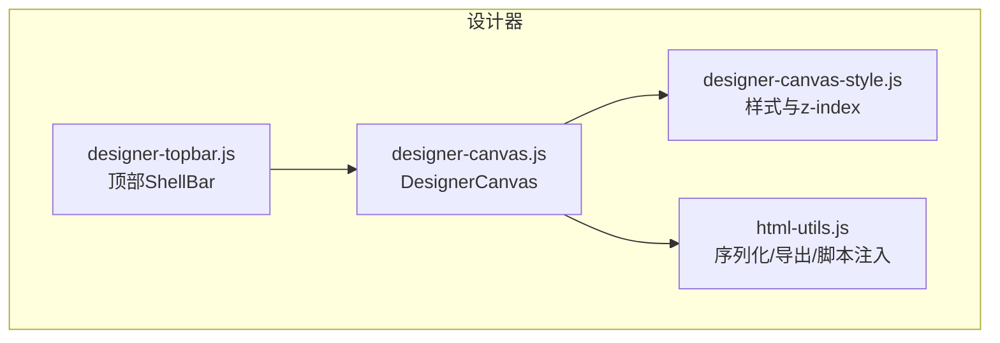
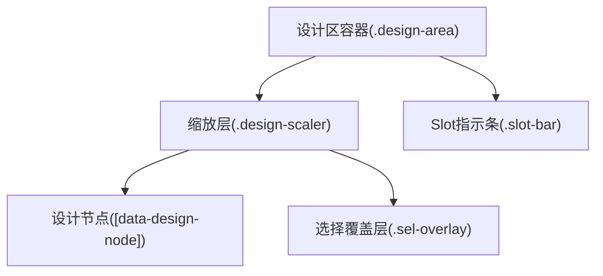
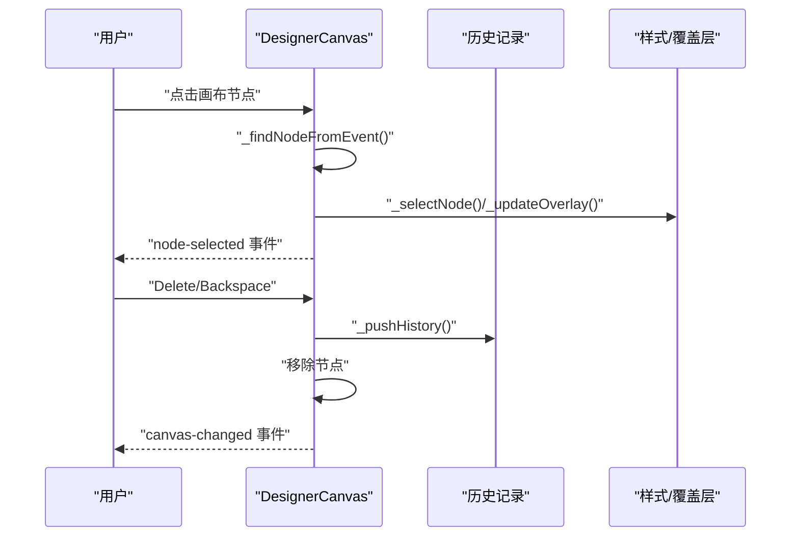
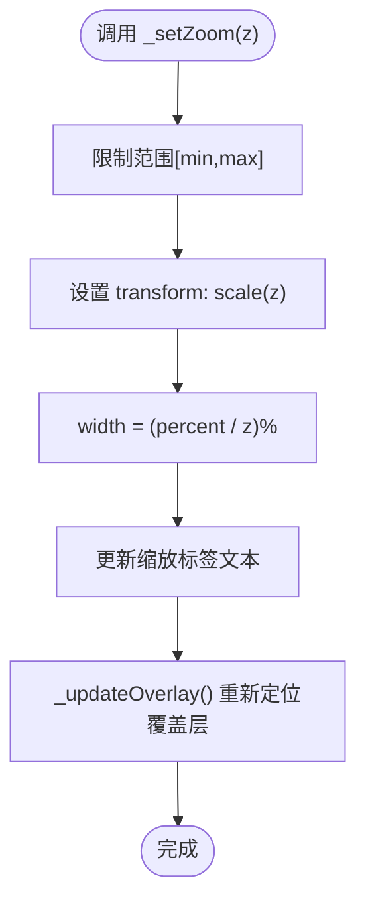
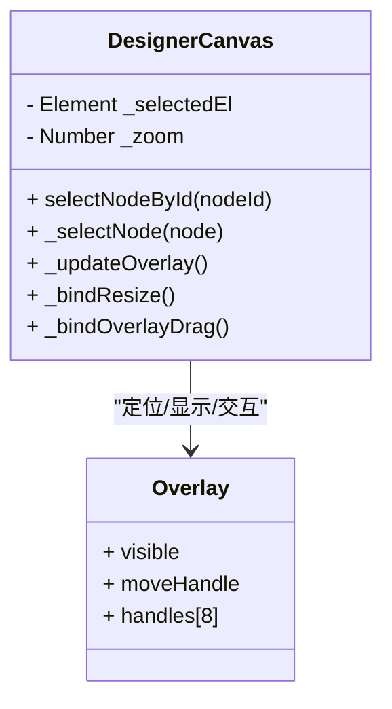
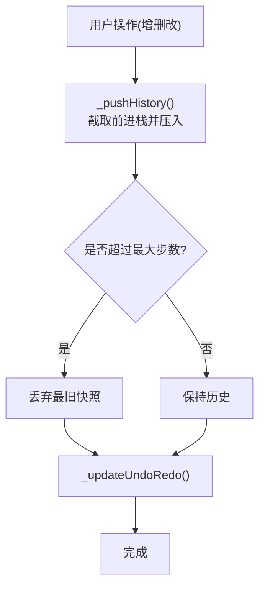
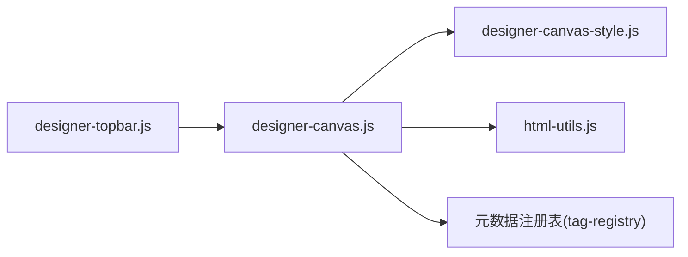

# 画布组件核心

<cite>
**本文引用的文件**
- [designer-canvas.js](file://CMXHTMLDesigner/src/components/designer-canvas.js)
- [designer-canvas-style.js](file://CMXHTMLDesigner/src/components/designer-canvas-style.js)
- [html-utils.js](file://CMXHTMLDesigner/src/utils/html-utils.js)
- [designer-topbar.js](file://CMXHTMLDesigner/src/components/designer-topbar.js)
</cite>

## 目录
1. [简介](#简介)
2. [项目结构](#项目结构)
3. [核心组件](#核心组件)
4. [架构总览](#架构总览)
5. [详细组件分析](#详细组件分析)
6. [依赖关系分析](#依赖关系分析)
7. [性能考量](#性能考量)
8. [故障排查指南](#故障排查指南)
9. [结论](#结论)
10. [附录：API 与使用示例](#附录api-与使用示例)

## 简介
本技术文档聚焦于设计器中的画布组件核心，围绕 DesignerCanvas 类展开，系统阐述其初始化流程、DOM 结构管理、事件处理机制、缩放功能、节点选择系统、撤销重做历史管理、工具栏能力（对齐、网格切换、缩放控制），以及对外暴露的 API 与扩展方式。目标是帮助开发者快速理解并安全地集成或扩展画布能力。

## 项目结构
画布相关代码主要位于 CMXHTMLDesigner 模块中：
- 画布主逻辑：designer-canvas.js
- 画布样式与层级 z-index：designer-canvas-style.js
- HTML 序列化与导出工具：html-utils.js
- 顶部 ShellBar（与画布协同）：designer-topbar.js

图表来源
- [designer-canvas.js:50-95](file://CMXHTMLDesigner/src/components/designer-canvas.js#L50-L95)
- [designer-canvas-style.js:15-146](file://CMXHTMLDesigner/src/components/designer-canvas-style.js#L15-L146)
- [html-utils.js:62-96](file://CMXHTMLDesigner/src/utils/html-utils.js#L62-L96)
- [designer-topbar.js:59-126](file://CMXHTMLDesigner/src/components/designer-topbar.js#L59-L126)

章节来源
- [designer-canvas.js:50-95](file://CMXHTMLDesigner/src/components/designer-canvas.js#L50-L95)
- [designer-canvas-style.js:15-146](file://CMXHTMLDesigner/src/components/designer-canvas-style.js#L15-L146)
- [html-utils.js:62-96](file://CMXHTMLDesigner/src/utils/html-utils.js#L62-L96)
- [designer-topbar.js:59-126](file://CMXHTMLDesigner/src/components/designer-topbar.js#L59-L126)

## 核心组件
- DesignerCanvas：画布核心 Web Component，负责 DOM 结构、交互、缩放、选择、拖拽、对齐、网格、撤销重做、事件水合与导出。
- 样式层：集中管理画布各层 z-index、选择框、手柄、slot 指示条等视觉表现。
- HTML 工具：提供序列化、清理设计器内部属性、导出页面包装、调试脚本注入等能力。
- 顶部栏：提供主题、语言、调试模式等全局设置，并通过事件与画布协作。

章节来源
- [designer-canvas.js:50-176](file://CMXHTMLDesigner/src/components/designer-canvas.js#L50-L176)
- [designer-canvas-style.js:15-146](file://CMXHTMLDesigner/src/components/designer-canvas-style.js#L15-L146)
- [html-utils.js:62-96](file://CMXHTMLDesigner/src/utils/html-utils.js#L62-L96)
- [designer-topbar.js:59-126](file://CMXHTMLDesigner/src/components/designer-topbar.js#L59-L126)

## 架构总览
画布采用“容器 + 缩放层 + 覆盖层”的分层结构：
- 设计区容器：承载滚动与背景网格。
- 缩放层：通过 CSS transform: scale 实现缩放，宽度按缩放比例反向计算，保证缩放中心在左上角。
- 选择覆盖层：绝对定位到选中元素，绘制边框、移动手柄和八个方向的手柄，用于拖拽移动与尺寸调整。
- Slot 指示条：当目标容器支持 slot 时显示，辅助将节点放入命名槽位。

图表来源
- [designer-canvas.js:66-95](file://CMXHTMLDesigner/src/components/designer-canvas.js#L66-L95)
- [designer-canvas-style.js:25-42](file://CMXHTMLDesigner/src/components/designer-canvas-style.js#L25-L42)
- [designer-canvas-style.js:74-146](file://CMXHTMLDesigner/src/components/designer-canvas-style.js#L74-L146)

## 详细组件分析

### 画布初始化与 DOM 结构管理
- 模板结构：包含工具栏、设计区、缩放层、选择覆盖层（含移动手柄与8个方向手柄）。
- init() 职责：
  - 缓存关键 DOM 引用（设计区、缩放层、覆盖层、移动手柄）。
  - 注册滚动/触摸/滚轮监听以隐藏临时覆盖物。
  - 绑定删除键（Delete/Backspace）逻辑，排除输入态与 UI5 控件。
  - 设置属性过滤器，仅保留元数据声明的属性，避免 UI5 自动附加的内部属性污染。
  - 初始化位置、工具栏、拖放、点击、resize 手柄、覆盖层拖拽等。
- 节点归一化：
  - 标记页面根节点，确保唯一性。
  - 为所有设计节点打上 data-design-node 与稳定 nodeId，去重并修复重复 ID。
  - 对特定组件（如 cmx-split-pane）自动最小高度策略。
  - 应用状态预览：根据 data-state 与 display 推断默认可见状态，提升设计期体验。

章节来源
- [designer-canvas.js:66-164](file://CMXHTMLDesigner/src/components/designer-canvas.js#L66-L164)
- [designer-canvas.js:804-910](file://CMXHTMLDesigner/src/components/designer-canvas.js#L804-L910)

### 事件处理机制
- 点击选择：捕获阶段优先命中，避免被 ui5 组件拦截；通过 composedPath 快速定位最深的设计节点，减少强制布局。
- 键盘删除：仅在非输入态且未锁定写入时生效，删除后推入历史并触发变更事件。
- 拖放：
  - dragover 经 rAF 节流，只处理最后一帧命中，降低高频事件开销。
  - drop 区分“移动节点”与“新建节点”，支持 slot 投放与容器嵌套判定。
- 事件水合：
  - attachHandler/detachHandler 动态绑定/解绑事件，支持 sourceURL 与调试模式断点注入。
  - 设计器内不主动绑定业务事件，仅用于属性面板展示与源码生成。

图表来源
- [designer-canvas.js:645-693](file://CMXHTMLDesigner/src/components/designer-canvas.js#L645-L693)
- [designer-canvas.js:142-163](file://CMXHTMLDesigner/src/components/designer-canvas.js#L142-L163)
- [designer-canvas.js:793-802](file://CMXHTMLDesigner/src/components/designer-canvas.js#L793-L802)

章节来源
- [designer-canvas.js:645-693](file://CMXHTMLDesigner/src/components/designer-canvas.js#L645-L693)
- [designer-canvas.js:142-163](file://CMXHTMLDesigner/src/components/designer-canvas.js#L142-L163)
- [designer-canvas.js:793-802](file://CMXHTMLDesigner/src/components/designer-canvas.js#L793-L802)

### 缩放功能实现
- 缩放范围与步长：最小 0.1，最大 4，步进 0.1，重置 100%。
- 变换矩阵：通过 CSS transform: scale 应用缩放，transform-origin 为左上角，宽度按百分比反向计算以保持缩放中心一致。
- 视觉反馈：更新缩放标签文本，刷新选择覆盖层位置（考虑缩放因子）。
- 工具栏按钮：放大、缩小、适应宽度（按容器可视宽度与内容宽度比值）、重置 100%。

图表来源
- [designer-canvas.js:24-33](file://CMXHTMLDesigner/src/components/designer-canvas.js#L24-L33)
- [designer-canvas.js:267-274](file://CMXHTMLDesigner/src/components/designer-canvas.js#L267-L274)
- [designer-canvas.js:299-316](file://CMXHTMLDesigner/src/components/designer-canvas.js#L299-L316)

章节来源
- [designer-canvas.js:24-33](file://CMXHTMLDesigner/src/components/designer-canvas.js#L24-L33)
- [designer-canvas.js:267-274](file://CMXHTMLDesigner/src/components/designer-canvas.js#L267-L274)
- [designer-canvas.js:299-316](file://CMXHTMLDesigner/src/components/designer-canvas.js#L299-L316)

### 节点选择系统与覆盖层定位
- 选中状态管理：维护 _selectedEl，选择变化时派发 node-selected 事件。
- 覆盖层定位：基于 getBoundingClientRect 计算选中元素与设计区容器的相对位置，除以当前缩放比得到覆盖层 top/left/width/height。
- 手柄渲染：8 个方向手柄配置了 cursor 与偏移，支持拖拽调整宽高与位置，同时保持最小尺寸约束。
- 移动手柄：拖动可移动节点至目标容器或 slot 区域，期间显示 slot 指示条与拖影提示。

图表来源
- [designer-canvas.js:339-365](file://CMXHTMLDesigner/src/components/designer-canvas.js#L339-L365)
- [designer-canvas.js:696-732](file://CMXHTMLDesigner/src/components/designer-canvas.js#L696-L732)
- [designer-canvas.js:368-472](file://CMXHTMLDesigner/src/components/designer-canvas.js#L368-L472)

章节来源
- [designer-canvas.js:339-365](file://CMXHTMLDesigner/src/components/designer-canvas.js#L339-L365)
- [designer-canvas.js:696-732](file://CMXHTMLDesigner/src/components/designer-canvas.js#L696-L732)
- [designer-canvas.js:368-472](file://CMXHTMLDesigner/src/components/designer-canvas.js#L368-L472)

### 撤销重做历史管理机制
- 快照策略：每次修改（插入、删除、对齐、拖放、清空、setHtml）调用 _pushHistory()，将当前画布 HTML 快照压栈。
- 内存优化：
  - 最大步数限制：超过 UNDO_HISTORY_MAX_STEPS（100）时丢弃最旧快照。
  - 前进栈截断：新操作会截断前进栈，避免冗余历史。
- 快捷键支持：Ctrl+Z 撤销，Ctrl+Y 或 Shift+Ctrl+Z 重做。
- 状态同步：撤销/重做后更新按钮禁用状态，防止越界操作。

图表来源
- [designer-canvas.js:232-264](file://CMXHTMLDesigner/src/components/designer-canvas.js#L232-L264)

章节来源
- [designer-canvas.js:232-264](file://CMXHTMLDesigner/src/components/designer-canvas.js#L232-L264)

### 画布工具栏功能
- 对齐操作：左对齐、水平居中、右对齐、顶部对齐、垂直居中、底部对齐；依据父容器与选中元素几何计算 margin/top/left。
- 网格切换：通过背景径向渐变与 backgroundSize 切换网格显示。
- 缩放控制：放大、缩小、适应宽度、重置 100%，实时更新缩放标签。
- 快捷键：Ctrl+Z/Ctrl+Y 直接触发撤销/重做。

章节来源
- [designer-canvas.js:277-336](file://CMXHTMLDesigner/src/components/designer-canvas.js#L277-L336)
- [designer-canvas.js:299-325](file://CMXHTMLDesigner/src/components/designer-canvas.js#L299-L325)

### 拖放与 Slot 指示
- dragover 节流：使用 requestAnimationFrame 合并高频事件，减少重复计算。
- 命中解析：通过 composedPath 穿透 Shadow DOM 边界，准确找到可嵌套容器。
- Slot 指示条：当目标容器支持 slots 时显示，支持横向/纵向布局，拖拽进入指定 slot 后落盘。

章节来源
- [designer-canvas.js:532-642](file://CMXHTMLDesigner/src/components/designer-canvas.js#L532-L642)
- [designer-canvas.js:474-529](file://CMXHTMLDesigner/src/components/designer-canvas.js#L474-L529)

## 依赖关系分析
- 元数据注册表：用于判断节点属性白名单、插槽定义、是否允许嵌套等。
- HTML 工具：序列化设计区、清理内部属性、导出完整页面、注入调试脚本。
- 样式模块：统一 z-index 与主题变量，保证多层叠加正确。
- 顶部栏：通过自定义事件与画布协作（主题、语言、调试模式等）。

图表来源
- [designer-canvas.js:8-20](file://CMXHTMLDesigner/src/components/designer-canvas.js#L8-L20)
- [designer-canvas.js:66-95](file://CMXHTMLDesigner/src/components/designer-canvas.js#L66-L95)
- [html-utils.js:62-96](file://CMXHTMLDesigner/src/utils/html-utils.js#L62-L96)
- [designer-topbar.js:59-126](file://CMXHTMLDesigner/src/components/designer-topbar.js#L59-L126)

章节来源
- [designer-canvas.js:8-20](file://CMXHTMLDesigner/src/components/designer-canvas.js#L8-L20)
- [designer-canvas.js:66-95](file://CMXHTMLDesigner/src/components/designer-canvas.js#L66-L95)
- [html-utils.js:62-96](file://CMXHTMLDesigner/src/utils/html-utils.js#L62-L96)
- [designer-topbar.js:59-126](file://CMXHTMLDesigner/src/components/designer-topbar.js#L59-L126)

## 性能考量
- 高频事件节流：dragover 使用 rAF 合并，scroll 使用防抖隐藏覆盖层，减少重排与重绘。
- 命中路径优化：点击命中优先使用 composedPath，避免遍历全量节点与强制布局。
- 历史快照大小控制：限制最大步数，避免内存膨胀。
- 样式与层级：集中管理 z-index，避免不必要的层叠计算。
- 事件水合：按需绑定/解绑事件，避免泄漏与重复监听。

## 故障排查指南
- 无法删除节点：检查是否在输入态或 UI5 控件内，或画布处于 mutationLocked 状态。
- 覆盖层错位：确认缩放比例是否正确，覆盖层定位需除以当前缩放比。
- 拖放无效：检查 dragover 命中链与 canNest 判定，确认 slot 指示条是否激活。
- 撤销/重做失效：确认历史索引边界与按钮禁用状态，检查 setHtml 是否传入 pushHistory=false。
- 事件不生效：确认 attachHandler 已调用，sourceURL 与调试模式配置正确。

章节来源
- [designer-canvas.js:142-163](file://CMXHTMLDesigner/src/components/designer-canvas.js#L142-L163)
- [designer-canvas.js:232-264](file://CMXHTMLDesigner/src/components/designer-canvas.js#L232-L264)
- [designer-canvas.js:912-946](file://CMXHTMLDesigner/src/components/designer-canvas.js#L912-L946)

## 结论
DesignerCanvas 通过清晰的层次结构与高效的交互算法，提供了完整的可视化编辑能力：缩放、选择、拖拽、对齐、网格、撤销重做与事件水合。借助 html-utils 的序列化与导出能力，画布既能满足设计期体验，也能无缝输出生产可用 HTML。配合顶部栏的全局设置，形成完整的设计器工作流。

## 附录：API 与使用示例
- 基本用法
  - 创建实例并挂载到 DOM。
  - 通过 setHtml(html, pushHistory=true) 注入设计内容。
  - 通过 getHtml()/getExportHtml()/getHtmlWithIds() 获取不同用途的 HTML。
  - 监听 node-selected 与 canvas-changed 事件响应交互。
- 选择与导航
  - selectNodeById(nodeId) 按 ID 选择节点。
  - selectedNode 读取当前选中节点。
- 写入保护
  - setMutationLocked(true) 禁止任何持久化写入（页内运行场景）。
- 事件绑定
  - attachHandler(node, evt, code) 动态绑定事件，支持 sourceURL 与调试模式。
  - detachHandler(node, evt) 解绑事件。
- 导出与调试
  - 使用 html-utils.wrapHtmlDocument 生成完整页面，包含 importmap、UI5 依赖与事件水合脚本。
  - 使用 stripDesignScriptsFromHtmlFragment 清理脚本片段，便于调试。

章节来源
- [designer-canvas.js:172-229](file://CMXHTMLDesigner/src/components/designer-canvas.js#L172-L229)
- [designer-canvas.js:912-946](file://CMXHTMLDesigner/src/components/designer-canvas.js#L912-L946)
- [html-utils.js:237-367](file://CMXHTMLDesigner/src/utils/html-utils.js#L237-L367)
- [html-utils.js:129-148](file://CMXHTMLDesigner/src/utils/html-utils.js#L129-L148)