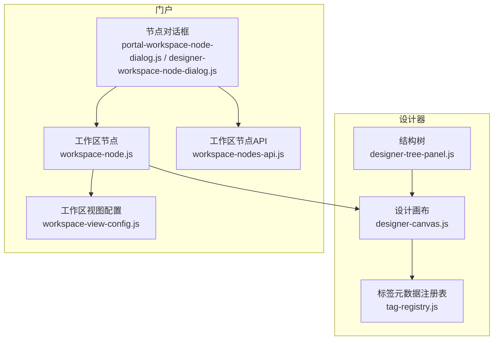
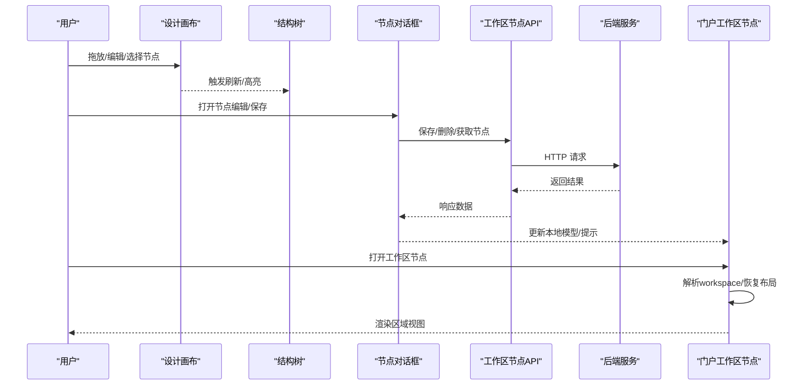
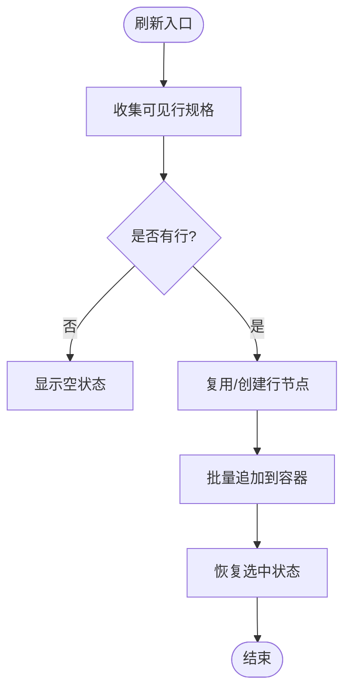
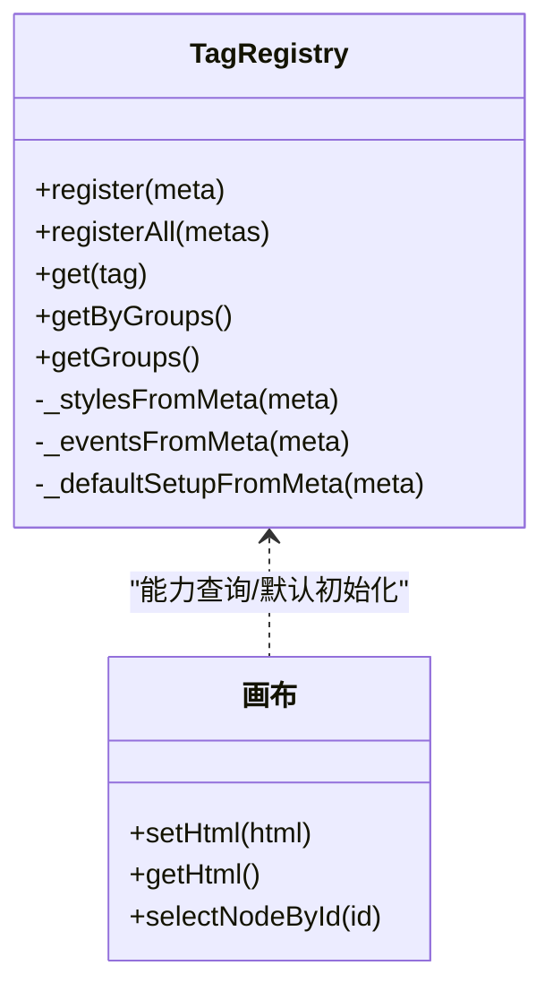
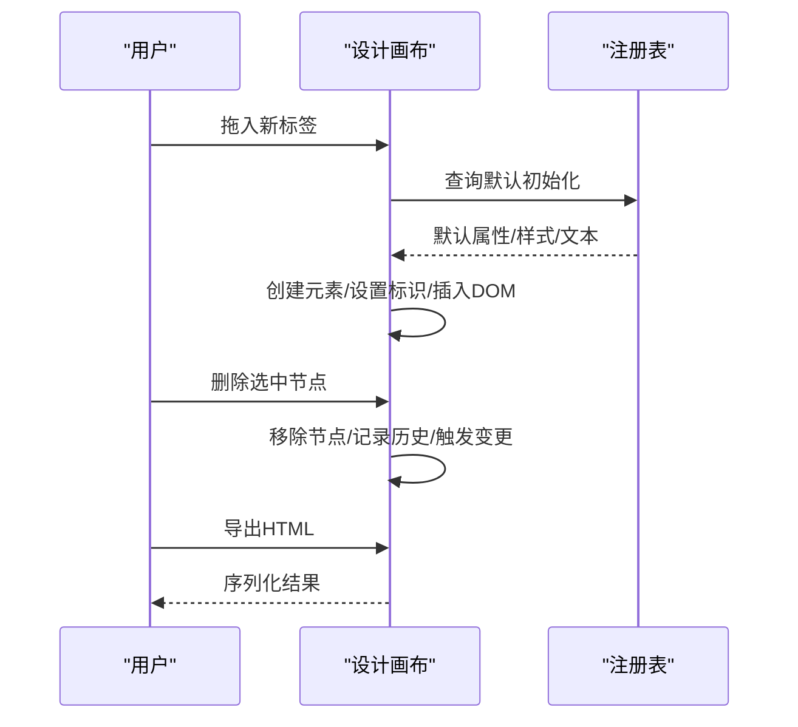
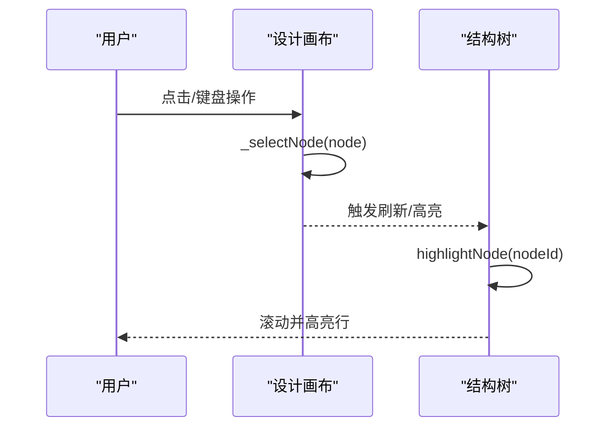
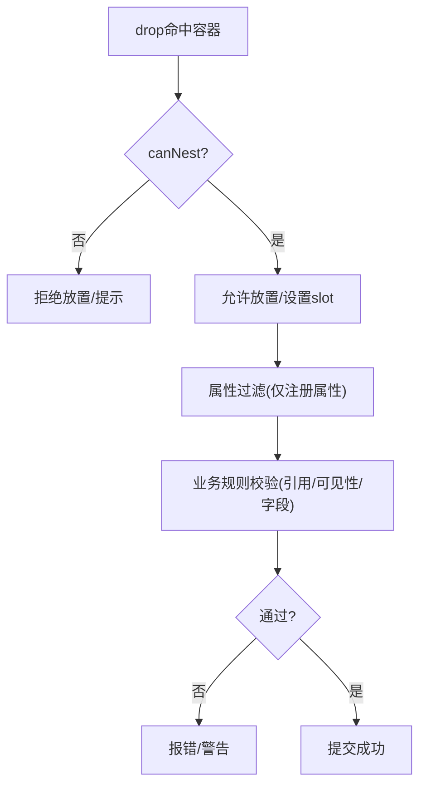
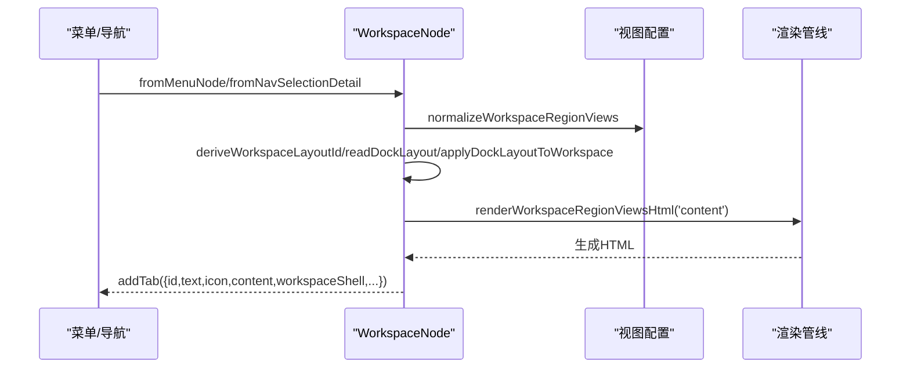
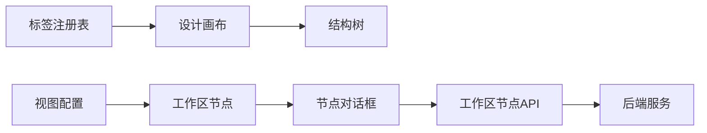

# 节点管理系统

<cite>
**本文引用的文件**
- [designer-tree-panel.js](file://CMXHTMLDesigner/src/components/designer-tree-panel.js)
- [designer-canvas.js](file://CMXHTMLDesigner/src/components/designer-canvas.js)
- [tag-registry.js](file://CMXHTMLDesigner/src/metadata/tag-registry.js)
- [workspace-node.js](file://CMXPortalManager/src/lib/workspace-node.js)
- [workspace-view-config.js](file://CMXPortalManager/src/lib/workspace-view-config.js)
- [workspace-nodes-api.js](file://CMXHTMLDesigner/src/api/workspace-nodes-api.js)
- [portal-workspace-node-dialog.js](file://CMXPortalManager/src/components/portal-workspace-node-dialog.js)
- [designer-workspace-node-dialog.js](file://CMXHTMLDesigner/src/components/designer-app/designer-workspace-node-dialog.js)
- [flc-ref-diagnostics.js](file://packages/cmx-data-comp/src/lib/flc-ref-diagnostics.js)
- [flexible-combination-validator.js](file://packages/cmx-data-comp/src/lib/flexible-combination-validator.js)
</cite>

## 目录
1. [简介](#简介)
2. [项目结构](#项目结构)
3. [核心组件](#核心组件)
4. [架构总览](#架构总览)
5. [详细组件分析](#详细组件分析)
6. [依赖关系分析](#依赖关系分析)
7. [性能考虑](#性能考虑)
8. [故障排查指南](#故障排查指南)
9. [结论](#结论)
10. [附录](#附录)

## 简介
本技术文档围绕“节点管理系统”展开，聚焦于设计器与门户中的工作区节点管理。内容涵盖：
- 节点树结构的维护机制（DOM 操作优化、节点关系映射、状态同步）
- 节点元数据注册系统（标签定义、属性配置、行为绑定）
- 节点生命周期管理（创建、销毁、序列化与反序列化）
- 节点选择与高亮机制（选中状态传播、视觉反馈、键盘导航支持）
- 节点验证规则（嵌套约束、属性校验、业务规则检查）
- 批量处理与性能优化技巧

## 项目结构
该系统的实现横跨设计器与门户两个工程：
- 设计器侧负责可视化编辑：画布、结构树、拖拽放置、撤销重做、事件绑定与序列化。
- 门户侧负责工作区节点的加载、渲染、区域视图装配与持久化。
- 元数据注册表集中管理标签能力（属性、样式组、事件预设、插槽等），驱动画布与面板的可用能力。
- API 层提供工作区节点的增删改查，对接后端服务。

**图表来源**
- [designer-canvas.js:50-180](file://CMXHTMLDesigner/src/components/designer-canvas.js#L50-L180)
- [designer-tree-panel.js:105-180](file://CMXHTMLDesigner/src/components/designer-tree-panel.js#L105-L180)
- [tag-registry.js:15-149](file://CMXHTMLDesigner/src/metadata/tag-registry.js#L15-L149)
- [workspace-node.js:124-283](file://CMXPortalManager/src/lib/workspace-node.js#L124-L283)
- [workspace-view-config.js:1-157](file://CMXPortalManager/src/lib/workspace-view-config.js#L1-L157)
- [workspace-nodes-api.js:1-69](file://CMXHTMLDesigner/src/api/workspace-nodes-api.js#L1-L69)
- [portal-workspace-node-dialog.js:189-1560](file://CMXPortalManager/src/components/portal-workspace-node-dialog.js#L189-L1560)
- [designer-workspace-node-dialog.js:214-1022](file://CMXHTMLDesigner/src/components/designer-app/designer-workspace-node-dialog.js#L214-L1022)

**章节来源**
- [designer-canvas.js:50-180](file://CMXHTMLDesigner/src/components/designer-canvas.js#L50-L180)
- [designer-tree-panel.js:105-180](file://CMXHTMLDesigner/src/components/designer-tree-panel.js#L105-L180)
- [tag-registry.js:15-149](file://CMXHTMLDesigner/src/metadata/tag-registry.js#L15-L149)
- [workspace-node.js:124-283](file://CMXPortalManager/src/lib/workspace-node.js#L124-L283)
- [workspace-view-config.js:1-157](file://CMXPortalManager/src/lib/workspace-view-config.js#L1-L157)
- [workspace-nodes-api.js:1-69](file://CMXHTMLDesigner/src/api/workspace-nodes-api.js#L1-L69)
- [portal-workspace-node-dialog.js:189-1560](file://CMXPortalManager/src/components/portal-workspace-node-dialog.js#L189-L1560)
- [designer-workspace-node-dialog.js:214-1022](file://CMXHTMLDesigner/src/components/designer-app/designer-workspace-node-dialog.js#L214-L1022)

## 核心组件
- 设计画布：承载 DOM 节点树，提供拖放、选择、对齐、缩放、撤销重做、序列化导出等功能。
- 结构树：以轻量列表展示画布节点层级，支持折叠/展开、高亮定位、选中联动。
- 标签元数据注册表：集中管理标签能力（属性、样式组、事件、插槽、默认初始化），为画布与面板提供能力查询。
- 工作区节点：封装 workspace 配置与元信息，负责打开视图、应用 shell 快照、恢复布局、生成 tab 内容。
- 工作区视图配置：规范化区域视图输入、收集页面 ID、解析视图 ID，统一多区域渲染契约。
- 工作区节点 API：提供 REST 接口封装，用于列表、获取、保存、删除工作区节点。
- 节点对话框：在设计与门户两端提供可视化的节点编辑界面，调用 API 完成持久化。

**章节来源**
- [designer-canvas.js:50-180](file://CMXHTMLDesigner/src/components/designer-canvas.js#L50-L180)
- [designer-tree-panel.js:105-180](file://CMXHTMLDesigner/src/components/designer-tree-panel.js#L105-L180)
- [tag-registry.js:15-149](file://CMXHTMLDesigner/src/metadata/tag-registry.js#L15-L149)
- [workspace-node.js:124-283](file://CMXPortalManager/src/lib/workspace-node.js#L124-L283)
- [workspace-view-config.js:1-157](file://CMXPortalManager/src/lib/workspace-view-config.js#L1-L157)
- [workspace-nodes-api.js:1-69](file://CMXHTMLDesigner/src/api/workspace-nodes-api.js#L1-L69)
- [portal-workspace-node-dialog.js:189-1560](file://CMXPortalManager/src/components/portal-workspace-node-dialog.js#L189-L1560)
- [designer-workspace-node-dialog.js:214-1022](file://CMXHTMLDesigner/src/components/designer-app/designer-workspace-node-dialog.js#L214-L1022)

## 架构总览
下图展示了从用户交互到数据落库的关键路径：用户在画布中编辑节点，结构树同步显示；通过对话框保存工作区节点，调用 API 写入后端；门户侧打开节点时读取配置并渲染区域视图。

**图表来源**
- [designer-canvas.js:50-180](file://CMXHTMLDesigner/src/components/designer-canvas.js#L50-L180)
- [designer-tree-panel.js:105-180](file://CMXHTMLDesigner/src/components/designer-tree-panel.js#L105-L180)
- [workspace-nodes-api.js:1-69](file://CMXHTMLDesigner/src/api/workspace-nodes-api.js#L1-L69)
- [workspace-node.js:124-283](file://CMXPortalManager/src/lib/workspace-node.js#L124-L283)
- [portal-workspace-node-dialog.js:189-1560](file://CMXPortalManager/src/components/portal-workspace-node-dialog.js#L189-L1560)
- [designer-workspace-node-dialog.js:214-1022](file://CMXHTMLDesigner/src/components/designer-app/designer-workspace-node-dialog.js#L214-L1022)

## 详细组件分析

### 节点树结构与 DOM 操作优化
- 节点树通过遍历画布 scaler 下的 design-node 元素构建可见行规格，使用 DocumentFragment 批量插入，避免多次回流。
- 复用已有行节点（按 nodeId 池化），仅更新差异属性，减少 DOM 重建。
- 折叠状态以 Set 维护，点击切换后重新计算可见行并刷新。
- 高亮定位会向上查找祖先节点，若被折叠则自动展开并滚动至可视区域。

**图表来源**
- [designer-tree-panel.js:138-179](file://CMXHTMLDesigner/src/components/designer-tree-panel.js#L138-L179)
- [designer-tree-panel.js:210-276](file://CMXHTMLDesigner/src/components/designer-tree-panel.js#L210-L276)

**章节来源**
- [designer-tree-panel.js:138-179](file://CMXHTMLDesigner/src/components/designer-tree-panel.js#L138-L179)
- [designer-tree-panel.js:210-276](file://CMXHTMLDesigner/src/components/designer-tree-panel.js#L210-L276)

### 节点元数据注册系统
- 标签元数据由 JSON 描述，包含公共属性、样式组、事件预设、插槽、默认初始化逻辑等。
- 运行时一次性并行加载 common-attrs、style-groups、event-presets、tag-index，再逐个加载 tags/* 元数据并注册。
- 未注册的标签将回退到通用元数据（可嵌套、默认文本、公共事件）。
- 画布根据注册表的 attrs 过滤属性，确保只保留受管属性，避免 UI5 自动附加的内部属性污染。

**图表来源**
- [tag-registry.js:15-149](file://CMXHTMLDesigner/src/metadata/tag-registry.js#L15-L149)
- [designer-canvas.js:110-180](file://CMXHTMLDesigner/src/components/designer-canvas.js#L110-L180)

**章节来源**
- [tag-registry.js:15-149](file://CMXHTMLDesigner/src/metadata/tag-registry.js#L15-L149)
- [designer-canvas.js:110-180](file://CMXHTMLDesigner/src/components/designer-canvas.js#L110-L180)

### 节点生命周期管理（创建、销毁、序列化/反序列化）
- 创建：从调色板拖入或移动现有节点时，依据注册表创建元素并设置 data-design-node、data-node-id，执行默认初始化。
- 选择与删除：支持 Delete/Backspace 删除选中节点，清空选择并记录历史。
- 序列化：提供 getHtml/getExportHtml/getHtmlWithIds 等方法，输出设计区 HTML；支持带 ID 的序列化以便调试与还原。
- 反序列化：setHtml 解析 HTML 注入画布，归一化节点并重新绑定事件；clear 清空画布并记录历史。
- 撤销/重做：维护历史栈，限制步数，Ctrl+Z/Y 快捷键支持。

**图表来源**
- [designer-canvas.js:50-180](file://CMXHTMLDesigner/src/components/designer-canvas.js#L50-L180)
- [designer-canvas.js:200-256](file://CMXHTMLDesigner/src/components/designer-canvas.js#L200-L256)
- [designer-canvas.js:734-742](file://CMXHTMLDesigner/src/components/designer-canvas.js#L734-L742)

**章节来源**
- [designer-canvas.js:142-164](file://CMXHTMLDesigner/src/components/designer-canvas.js#L142-L164)
- [designer-canvas.js:200-256](file://CMXHTMLDesigner/src/components/designer-canvas.js#L200-L256)
- [designer-canvas.js:734-742](file://CMXHTMLDesigner/src/components/designer-canvas.js#L734-L742)

### 节点选择与高亮机制（含键盘导航）
- 画布选择：通过 composedPath 快速命中设计节点，避免强制布局；选择后延迟一帧更新选择覆盖层。
- 结构树高亮：highlightNode 会确保目标节点可见（展开父级），并滚动到可视区域。
- 键盘导航：Delete/Backspace 删除选中节点；Ctrl+Z/Y 撤销/重做；对 ui5 组件与输入框进行保护，避免误删。
- 视觉反馈：选择覆盖层、缩放手柄、槽位指示条、拖拽占位等。

**图表来源**
- [designer-canvas.js:644-698](file://CMXHTMLDesigner/src/components/designer-canvas.js#L644-L698)
- [designer-canvas.js:793-798](file://CMXHTMLDesigner/src/components/designer-canvas.js#L793-L798)
- [designer-tree-panel.js:168-179](file://CMXHTMLDesigner/src/components/designer-tree-panel.js#L168-L179)

**章节来源**
- [designer-canvas.js:142-164](file://CMXHTMLDesigner/src/components/designer-canvas.js#L142-L164)
- [designer-canvas.js:644-698](file://CMXHTMLDesigner/src/components/designer-canvas.js#L644-L698)
- [designer-canvas.js:793-798](file://CMXHTMLDesigner/src/components/designer-canvas.js#L793-L798)
- [designer-tree-panel.js:168-179](file://CMXHTMLDesigner/src/components/designer-tree-panel.js#L168-L179)

### 节点验证规则（嵌套约束、属性校验、业务规则）
- 嵌套约束：画布在 drop 过程中依据注册表的 canNest 判断是否允许放入容器；slot 区域通过 slot 名称与方向控制布局。
- 属性校验：画布通过注册表的 attrs 过滤属性，避免不受管属性进入设计区。
- 业务规则：弹性组合引用诊断与校验（如 over 不得修改物理类型、非空列放松必填告警、跨 DAM 可见性检查、字段数组要求等）。

**图表来源**
- [designer-canvas.js:744-779](file://CMXHTMLDesigner/src/components/designer-canvas.js#L744-L779)
- [designer-canvas.js:110-114](file://CMXHTMLDesigner/src/components/designer-canvas.js#L110-L114)
- [flc-ref-diagnostics.js:98-124](file://packages/cmx-data-comp/src/lib/flc-ref-diagnostics.js#L98-L124)
- [flexible-combination-validator.js:93-112](file://packages/cmx-data-comp/src/lib/flexible-combination-validator.js#L93-L112)

**章节来源**
- [designer-canvas.js:744-779](file://CMXHTMLDesigner/src/components/designer-canvas.js#L744-L779)
- [designer-canvas.js:110-114](file://CMXHTMLDesigner/src/components/designer-canvas.js#L110-L114)
- [flc-ref-diagnostics.js:98-124](file://packages/cmx-data-comp/src/lib/flc-ref-diagnostics.js#L98-L124)
- [flexible-combination-validator.js:93-112](file://packages/cmx-data-comp/src/lib/flexible-combination-validator.js#L93-L112)

### 工作区节点生命周期（创建、打开、销毁、序列化/反序列化）
- 创建：从菜单节点或导航选择细节构造 WorkspaceNode，提取标签、图标、workspace 配置与 DAM 三元组。
- 打开：open_view 抽取原始 workspace 快照、恢复 dock 布局、渲染 content 区域 HTML、生成 tab 选项（含 originalWorkspace/sourceNode/dirty 等）。
- 销毁：关闭 tab 时清理挂载与上下文（由上层 tab 管理）。
- 序列化/反序列化：workspace 配置作为 JSON 存储；打开时按区域规范化为视图数组并渲染。

**图表来源**
- [workspace-node.js:124-283](file://CMXPortalManager/src/lib/workspace-node.js#L124-L283)
- [workspace-view-config.js:64-93](file://CMXPortalManager/src/lib/workspace-view-config.js#L64-L93)
- [workspace-view-config.js:115-157](file://CMXPortalManager/src/lib/workspace-view-config.js#L115-L157)

**章节来源**
- [workspace-node.js:124-283](file://CMXPortalManager/src/lib/workspace-node.js#L124-L283)
- [workspace-view-config.js:64-93](file://CMXPortalManager/src/lib/workspace-view-config.js#L64-L93)
- [workspace-view-config.js:115-157](file://CMXPortalManager/src/lib/workspace-view-config.js#L115-L157)

### 节点操作的批量处理与性能优化
- 批量拉取页面：html-pages/batch 接口支持 clientRevs 增量同步，减少带宽与解析开销。
- 结构树刷新：DocumentFragment 批量插入、节点池复用、最小化样式变更。
- 拖拽命中：dragover 经 requestAnimationFrame 节流，仅处理最后一帧命中，降低计算频率。
- 选择覆盖层：延迟一帧更新，避免布局抖动。
- 历史记录：限制最大步数，截断前进栈，避免内存增长。

**章节来源**
- [workspace-html-pages.js:183-220](file://CMXPortalManager/src/lib/workspace-html-pages.js#L183-L220)
- [designer-tree-panel.js:138-179](file://CMXHTMLDesigner/src/components/designer-tree-panel.js#L138-L179)
- [designer-canvas.js:531-642](file://CMXHTMLDesigner/src/components/designer-canvas.js#L531-L642)
- [designer-canvas.js:793-798](file://CMXHTMLDesigner/src/components/designer-canvas.js#L793-L798)
- [designer-canvas.js:232-264](file://CMXHTMLDesigner/src/components/designer-canvas.js#L232-L264)

## 依赖关系分析
- 设计器内部依赖：
  - 画布依赖注册表决定默认初始化与属性过滤。
  - 结构树依赖画布的 scaler 元素进行遍历与高亮。
- 门户内部依赖：
  - 工作区节点依赖视图配置进行区域规范化与视图 ID 解析。
  - 对话框依赖 API 模块与工作区节点类完成持久化与打开流程。
- 外部依赖：
  - 工作区节点 API 依赖后端 REST 服务。
  - 页面批量拉取依赖 html-pages/batch 接口。

**图表来源**
- [tag-registry.js:15-149](file://CMXHTMLDesigner/src/metadata/tag-registry.js#L15-L149)
- [designer-canvas.js:50-180](file://CMXHTMLDesigner/src/components/designer-canvas.js#L50-L180)
- [designer-tree-panel.js:105-180](file://CMXHTMLDesigner/src/components/designer-tree-panel.js#L105-L180)
- [workspace-view-config.js:1-157](file://CMXPortalManager/src/lib/workspace-view-config.js#L1-L157)
- [workspace-node.js:124-283](file://CMXPortalManager/src/lib/workspace-node.js#L124-L283)
- [workspace-nodes-api.js:1-69](file://CMXHTMLDesigner/src/api/workspace-nodes-api.js#L1-L69)

**章节来源**
- [tag-registry.js:15-149](file://CMXHTMLDesigner/src/metadata/tag-registry.js#L15-L149)
- [designer-canvas.js:50-180](file://CMXHTMLDesigner/src/components/designer-canvas.js#L50-L180)
- [designer-tree-panel.js:105-180](file://CMXHTMLDesigner/src/components/designer-tree-panel.js#L105-L180)
- [workspace-view-config.js:1-157](file://CMXPortalManager/src/lib/workspace-view-config.js#L1-L157)
- [workspace-node.js:124-283](file://CMXPortalManager/src/lib/workspace-node.js#L124-L283)
- [workspace-nodes-api.js:1-69](file://CMXHTMLDesigner/src/api/workspace-nodes-api.js#L1-L69)

## 性能考虑
- 使用 DocumentFragment 批量插入结构树行，减少重排。
- 节点池复用行元素，仅更新必要属性。
- dragover 命中经 rAF 节流，避免高频计算。
- 选择覆盖层延迟一帧更新，避免布局抖动。
- 历史记录限制步数，防止内存膨胀。
- 批量拉取页面支持 clientRevs 增量同步，降低网络与解析成本。

[本节为通用性能建议，不直接分析具体文件]

## 故障排查指南
- 无法删除节点：检查是否在 ui5 组件或输入框内聚焦；确认 mutationLocked 未被锁定。
- 结构树高亮无效：确认目标节点存在且未被折叠；检查 ensureVisible 是否展开父级。
- 属性异常：确认注册表中定义了该属性；画布会通过 attrFilter 过滤不受管属性。
- 保存失败：检查 workspace-nodes-api 的错误消息读取与 HTTP 状态；确认 payload 字段完整。
- 打开节点无内容：检查 workspace 配置是否规范为 views 数组；确认 content 区域渲染正常。
- 业务规则报错：查看引用诊断错误码（如 REF_TARGET_NOT_FOUND、REF_VISIBILITY_DENIED、OVER_CHANGES_PHYSICAL_TYPE、OVER_RELAXES_NULLABLE 等）。

**章节来源**
- [designer-canvas.js:142-164](file://CMXHTMLDesigner/src/components/designer-canvas.js#L142-L164)
- [designer-tree-panel.js:168-179](file://CMXHTMLDesigner/src/components/designer-tree-panel.js#L168-L179)
- [designer-canvas.js:110-114](file://CMXHTMLDesigner/src/components/designer-canvas.js#L110-L114)
- [workspace-nodes-api.js:7-14](file://CMXHTMLDesigner/src/api/workspace-nodes-api.js#L7-L14)
- [workspace-view-config.js:64-93](file://CMXPortalManager/src/lib/workspace-view-config.js#L64-L93)
- [flc-ref-diagnostics.js:98-124](file://packages/cmx-data-comp/src/lib/flc-ref-diagnostics.js#L98-L124)

## 结论
本节点管理系统通过清晰的职责划分与模块化设计，实现了高效的可视化编辑与稳定的工作区节点管理。设计器侧聚焦 DOM 操作优化与交互体验，门户侧专注配置规范化与渲染装配，元数据注册表提供统一的能力契约。结合批量处理与性能优化策略，系统在大规模场景下仍保持良好响应。未来可进一步扩展验证规则与插件化能力，提升可维护性与可扩展性。

[本节为总结性内容，不直接分析具体文件]

## 附录
- 关键术语
  - 工作区节点：包含 workspace 配置与元信息的可打开单元。
  - 区域视图：explorer/property/bottom/content/prepare/floatview/model/inner/embed 等区域的视图集合。
  - 槽位（slot）：容器组件声明的可插入区域，支持水平/垂直方向。
  - 引用诊断：对弹性组合引用的可见性、物理类型、必填性等规则进行检查。

[本节为概念说明，不直接分析具体文件]