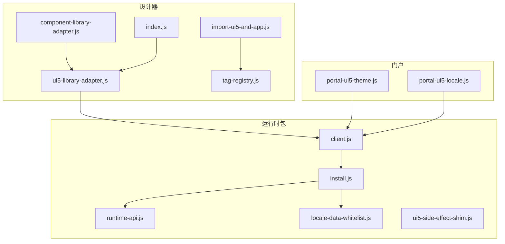
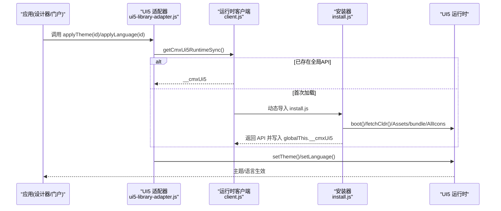
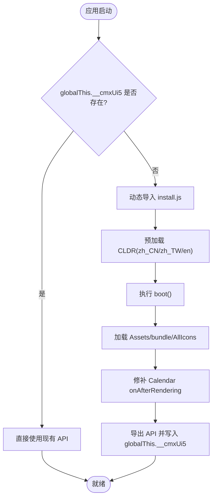
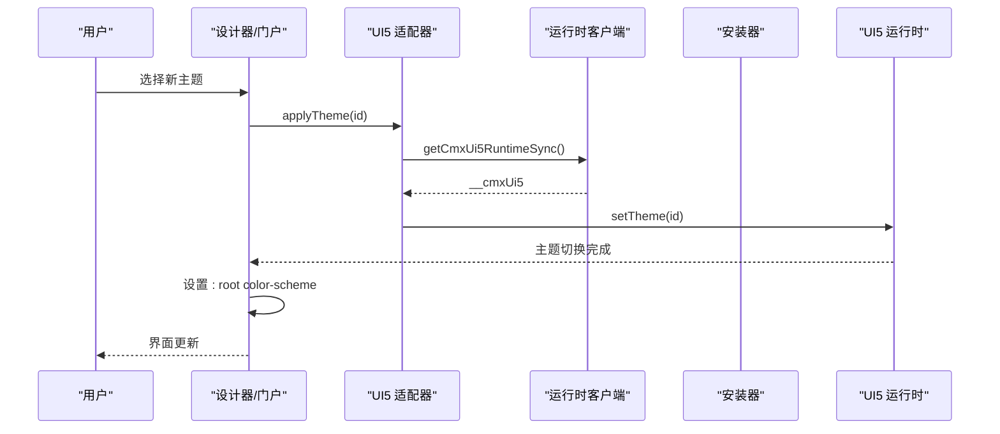
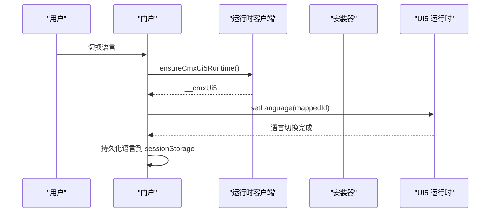
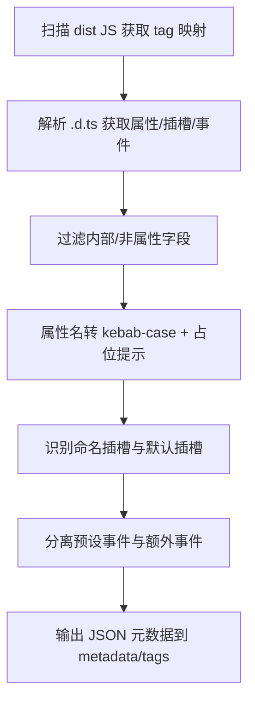
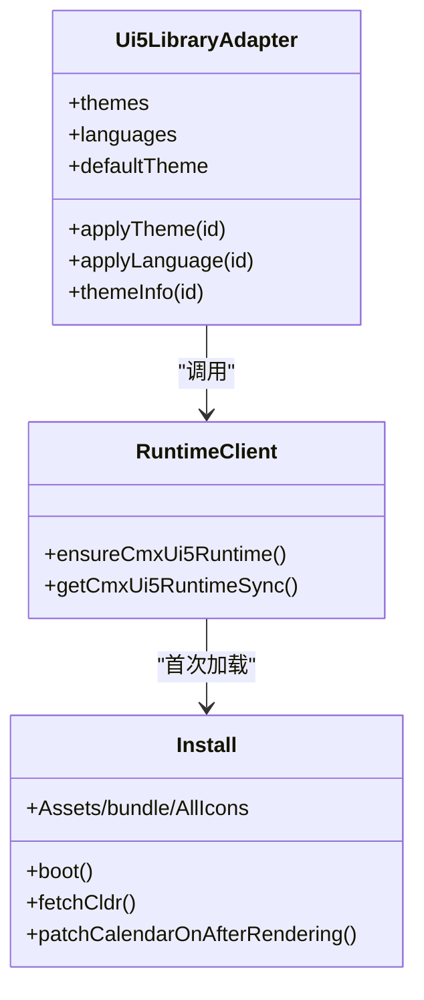
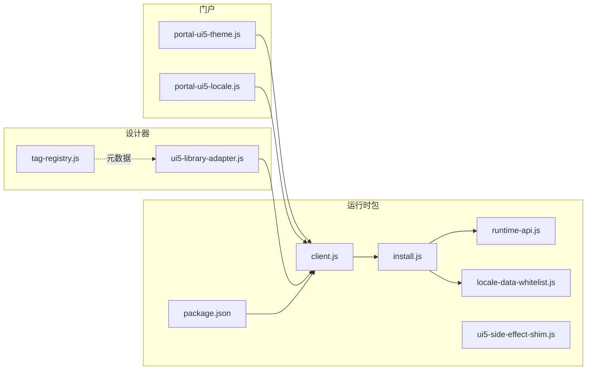

# UI5 运行时适配器

<cite>
**本文引用的文件**
- [packages/cmx-ui5-runtime/src/client.js](file://packages/cmx-ui5-runtime/src/client.js)
- [packages/cmx-ui5-runtime/src/install.js](file://packages/cmx-ui5-runtime/src/install.js)
- [packages/cmx-ui5-runtime/src/runtime-api.js](file://packages/cmx-ui5-runtime/src/runtime-api.js)
- [packages/cmx-ui5-runtime/src/locale-data-whitelist.js](file://packages/cmx-ui5-runtime/src/locale-data-whitelist.js)
- [packages/cmx-ui5-runtime/src/ui5-side-effect-shim.js](file://packages/cmx-ui5-runtime/src/ui5-side-effect-shim.js)
- [packages/cmx-ui5-runtime/package.json](file://packages/cmx-ui5-runtime/package.json)
- [CMXHTMLDesigner/src/lib/component-library-adapter.js](file://CMXHTMLDesigner/src/lib/component-library-adapter.js)
- [CMXHTMLDesigner/src/lib/ui5-library-adapter.js](file://CMXHTMLDesigner/src/lib/ui5-library-adapter.js)
- [CMXHTMLDesigner/src/lib/index.js](file://CMXHTMLDesigner/src/lib/index.js)
- [CMXHTMLDesigner/src/import-ui5-and-app.js](file://CMXHTMLDesigner/src/import-ui5-and-app.js)
- [CMXHTMLDesigner/scripts/gen-meta.py](file://CMXHTMLDesigner/scripts/gen-meta.py)
- [CMXHTMLDesigner/src/metadata/tag-registry.js](file://CMXHTMLDesigner/src/metadata/tag-registry.js)
- [CMXPortalManager/src/lib/portal-ui5-theme.js](file://CMXPortalManager/src/lib/portal-ui5-theme.js)
- [CMXPortalManager/src/lib/portal-ui5-locale.js](file://CMXPortalManager/src/lib/portal-ui5-locale.js)
</cite>

## 目录
1. [简介](#简介)
2. [项目结构](#项目结构)
3. [核心组件](#核心组件)
4. [架构总览](#架构总览)
5. [详细组件分析](#详细组件分析)
6. [依赖关系分析](#依赖关系分析)
7. [性能与内存优化](#性能与内存优化)
8. [故障排查指南](#故障排查指南)
9. [结论](#结论)
10. [附录](#附录)

## 简介
本技术文档围绕“UI5 运行时适配器”展开，系统性说明 SAP UI5 Web Components 在本工程中的集成方案。内容涵盖：
- 运行时环境初始化流程（boot、CLDR、资源与图标加载）
- 主题系统与国际化支持（主题切换、语言切换、原生控件适配）
- UI5 组件元数据提取与转换机制（属性映射、事件绑定、插槽处理）
- 与原生 Web Components 的桥接实现（生命周期同步、状态管理）
- 主题定制与样式隔离策略
- 设计器中 UI5 组件的使用示例与最佳实践
- 性能优化与内存管理方案

## 项目结构
本项目将 UI5 运行时能力收敛到独立包 cmx-ui5-runtime，并通过适配器在 CMXHTMLDesigner 和 CMXPortalManager 中复用。关键目录与职责：
- packages/cmx-ui5-runtime：提供统一的 UI5 运行时入口、主题/语言 API、本地化白名单与副作用垫片
- CMXHTMLDesigner：设计器侧通过 ComponentLibraryAdapter 抽象层调用 UI5 运行时，并维护 UI5/Fiori 组件元数据
- CMXPortalManager：门户侧负责主题持久化、语言切换与浏览器原生控件样式联动

图表来源
- [packages/cmx-ui5-runtime/src/client.js:1-42](file://packages/cmx-ui5-runtime/src/client.js#L1-L42)
- [packages/cmx-ui5-runtime/src/install.js:1-136](file://packages/cmx-ui5-runtime/src/install.js#L1-L136)
- [packages/cmx-ui5-runtime/src/runtime-api.js:1-13](file://packages/cmx-ui5-runtime/src/runtime-api.js#L1-L13)
- [packages/cmx-ui5-runtime/src/locale-data-whitelist.js:1-20](file://packages/cmx-ui5-runtime/src/locale-data-whitelist.js#L1-L20)
- [packages/cmx-ui5-runtime/src/ui5-side-effect-shim.js:1-6](file://packages/cmx-ui5-runtime/src/ui5-side-effect-shim.js#L1-L6)
- [CMXHTMLDesigner/src/lib/component-library-adapter.js:1-40](file://CMXHTMLDesigner/src/lib/component-library-adapter.js#L1-L40)
- [CMXHTMLDesigner/src/lib/ui5-library-adapter.js:1-39](file://CMXHTMLDesigner/src/lib/ui5-library-adapter.js#L1-L39)
- [CMXHTMLDesigner/src/lib/index.js:1-7](file://CMXHTMLDesigner/src/lib/index.js#L1-L7)
- [CMXHTMLDesigner/src/import-ui5-and-app.js:1-12](file://CMXHTMLDesigner/src/import-ui5-and-app.js#L1-L12)
- [CMXHTMLDesigner/src/metadata/tag-registry.js:1-30](file://CMXHTMLDesigner/src/metadata/tag-registry.js#L1-L30)
- [CMXPortalManager/src/lib/portal-ui5-theme.js:1-73](file://CMXPortalManager/src/lib/portal-ui5-theme.js#L1-L73)
- [CMXPortalManager/src/lib/portal-ui5-locale.js:1-88](file://CMXPortalManager/src/lib/portal-ui5-locale.js#L1-L88)

章节来源
- [packages/cmx-ui5-runtime/package.json:1-31](file://packages/cmx-ui5-runtime/package.json#L1-L31)

## 核心组件
- 运行时客户端 client.js：统一懒加载 UI5 运行时，避免多实例；暴露 ensureCmxUi5Runtime 与 getCmxUi5RuntimeSync
- 安装器 install.js：按序执行 boot、预加载 CLDR、加载 Assets/bundle/AllIcons、注入 Tabler 图标、修补 Calendar 渲染问题，最终导出 API 并挂载到 globalThis.__cmxUi5
- 运行时 API runtime-api.js：定义 CmxUi5RuntimeApi 类型契约（boot、setTheme、setLanguage、getLanguage、attach/detachLanguageChange、reRenderAllUI5Elements）
- 本地化白名单 locale-data-whitelist.js：仅注册 zh_CN、zh_TW、en 的 CLDR 数据，减少体积并保证 LocaleData 可用
- 副作用垫片 ui5-side-effect-shim.js：替代应用侧直接 import UI5 组件带来的副作用，避免重复注册自定义元素
- 设计器适配器 component-library-adapter.js / ui5-library-adapter.js：抽象库适配接口并提供 UI5 具体实现（主题/语言列表、默认主题、切换方法）
- 门户主题/语言 portal-ui5-theme.js / portal-ui5-locale.js：主题持久化、语言切换、原生控件 color-scheme 联动、事件广播

章节来源
- [packages/cmx-ui5-runtime/src/client.js:1-42](file://packages/cmx-ui5-runtime/src/client.js#L1-L42)
- [packages/cmx-ui5-runtime/src/install.js:1-136](file://packages/cmx-ui5-runtime/src/install.js#L1-L136)
- [packages/cmx-ui5-runtime/src/runtime-api.js:1-13](file://packages/cmx-ui5-runtime/src/runtime-api.js#L1-L13)
- [packages/cmx-ui5-runtime/src/locale-data-whitelist.js:1-20](file://packages/cmx-ui5-runtime/src/locale-data-whitelist.js#L1-L20)
- [packages/cmx-ui5-runtime/src/ui5-side-effect-shim.js:1-6](file://packages/cmx-ui5-runtime/src/ui5-side-effect-shim.js#L1-L6)
- [CMXHTMLDesigner/src/lib/component-library-adapter.js:1-40](file://CMXHTMLDesigner/src/lib/component-library-adapter.js#L1-L40)
- [CMXHTMLDesigner/src/lib/ui5-library-adapter.js:1-39](file://CMXHTMLDesigner/src/lib/ui5-library-adapter.js#L1-L39)
- [CMXPortalManager/src/lib/portal-ui5-theme.js:1-73](file://CMXPortalManager/src/lib/portal-ui5-theme.js#L1-L73)
- [CMXPortalManager/src/lib/portal-ui5-locale.js:1-88](file://CMXPortalManager/src/lib/portal-ui5-locale.js#L1-L88)

## 架构总览
下图展示从设计器/门户到 UI5 运行时的调用链与职责边界：

图表来源
- [CMXHTMLDesigner/src/lib/ui5-library-adapter.js:1-39](file://CMXHTMLDesigner/src/lib/ui5-library-adapter.js#L1-L39)
- [packages/cmx-ui5-runtime/src/client.js:1-42](file://packages/cmx-ui5-runtime/src/client.js#L1-L42)
- [packages/cmx-ui5-runtime/src/install.js:1-136](file://packages/cmx-ui5-runtime/src/install.js#L1-L136)

## 详细组件分析

### 运行时初始化与生命周期
- 懒加载与单例：client.js 通过 ensureCmxUi5Runtime 确保只加载一次 install.js，并将 API 缓存于 globalThis.__cmxUi5；getCmxUi5RuntimeSync 用于同步读取
- 初始化顺序：install.js 先预加载 CLDR（zh_CN、zh_TW、en），再执行 boot，随后并行加载 Assets、bundle、AllIcons，最后注入 Tabler 图标并修补 Calendar 渲染问题
- 生命周期桥接：通过 reRenderAllUI5Elements 触发全量重渲染；语言变化通过 attach/detachLanguageChange 订阅

图表来源
- [packages/cmx-ui5-runtime/src/client.js:1-42](file://packages/cmx-ui5-runtime/src/client.js#L1-L42)
- [packages/cmx-ui5-runtime/src/install.js:1-136](file://packages/cmx-ui5-runtime/src/install.js#L1-L136)

章节来源
- [packages/cmx-ui5-runtime/src/client.js:1-42](file://packages/cmx-ui5-runtime/src/client.js#L1-L42)
- [packages/cmx-ui5-runtime/src/install.js:1-136](file://packages/cmx-ui5-runtime/src/install.js#L1-L136)

### 主题系统适配
- 设计器侧：Ui5LibraryAdapter 暴露 themes/languages/defaultTheme，并调用 getCmxUi5RuntimeSync().setTheme/setLanguage
- 门户侧：portal-ui5-theme.js 维护主题列表、持久化至 sessionStorage，设置 UI5 主题后同步 :root 的 color-scheme，驱动原生 select/滚动条等控件亮/暗模式
- 副作用控制：ui5-side-effect-shim.js 替代应用侧直接 import UI5 组件的副作用，避免重复注册

图表来源
- [CMXHTMLDesigner/src/lib/ui5-library-adapter.js:1-39](file://CMXHTMLDesigner/src/lib/ui5-library-adapter.js#L1-L39)
- [CMXPortalManager/src/lib/portal-ui5-theme.js:1-73](file://CMXPortalManager/src/lib/portal-ui5-theme.js#L1-L73)
- [packages/cmx-ui5-runtime/src/client.js:1-42](file://packages/cmx-ui5-runtime/src/client.js#L1-L42)

章节来源
- [CMXHTMLDesigner/src/lib/ui5-library-adapter.js:1-39](file://CMXHTMLDesigner/src/lib/ui5-library-adapter.js#L1-L39)
- [CMXPortalManager/src/lib/portal-ui5-theme.js:1-73](file://CMXPortalManager/src/lib/portal-ui5-theme.js#L1-L73)
- [packages/cmx-ui5-runtime/src/ui5-side-effect-shim.js:1-6](file://packages/cmx-ui5-runtime/src/ui5-side-effect-shim.js#L1-L6)

### 国际化支持
- 语言列表与映射：portal-ui5-locale.js 定义 PORTAL_LANGUAGES，并将 en_US 映射为 UI5 的 en
- 语言切换：applyPortalUi5Language 调用 ensureCmxUi5Runtime().setLanguage，并持久化到 sessionStorage
- 本地化数据：install.js 在 boot 前预加载 zh_CN、zh_TW、en 的 CLDR；locale-data-whitelist.js 注册对应 loader，避免运行时缺失

图表来源
- [CMXPortalManager/src/lib/portal-ui5-locale.js:1-88](file://CMXPortalManager/src/lib/portal-ui5-locale.js#L1-L88)
- [packages/cmx-ui5-runtime/src/client.js:1-42](file://packages/cmx-ui5-runtime/src/client.js#L1-L42)
- [packages/cmx-ui5-runtime/src/install.js:1-136](file://packages/cmx-ui5-runtime/src/install.js#L1-L136)
- [packages/cmx-ui5-runtime/src/locale-data-whitelist.js:1-20](file://packages/cmx-ui5-runtime/src/locale-data-whitelist.js#L1-L20)

章节来源
- [CMXPortalManager/src/lib/portal-ui5-locale.js:1-88](file://CMXPortalManager/src/lib/portal-ui5-locale.js#L1-L88)
- [packages/cmx-ui5-runtime/src/locale-data-whitelist.js:1-20](file://packages/cmx-ui5-runtime/src/locale-data-whitelist.js#L1-L20)

### UI5 组件元数据提取与转换机制
- 生成脚本：gen-meta.py 扫描 @ui5/webcomponents 与 @ui5/webcomponents-fiori 的 dist JS/.d.ts，解析 tag、属性、插槽、事件，生成 src/metadata/tags/{ui5,fiori}/*.json
- 保留字段：脚本会保留 tag/group/label/description/isVoid/canNest/styleGroups/defaults/slotOrientation/eventPreset/paletteIcon 等设计期元信息
- 属性映射：将 .d.ts 的属性名转换为 kebab-case，过滤内部/非属性字段，填充占位提示
- 插槽处理：区分命名插槽与默认插槽（空字符串表示默认插槽）
- 事件处理：内置 click/focusin/focusout/keydown/keyup 作为预设事件，其余事件放入 extraEvents

图表来源
- [CMXHTMLDesigner/scripts/gen-meta.py:1-281](file://CMXHTMLDesigner/scripts/gen-meta.py#L1-L281)

章节来源
- [CMXHTMLDesigner/scripts/gen-meta.py:1-281](file://CMXHTMLDesigner/scripts/gen-meta.py#L1-L281)
- [CMXHTMLDesigner/src/metadata/tag-registry.js:1-30](file://CMXHTMLDesigner/src/metadata/tag-registry.js#L1-L30)

### 与原生 Web Components 的桥接实现
- 自定义元素注册：install.js 加载 bundle.esm.js 与 AllIcons，完成 UI5 自定义元素的注册；ui5-side-effect-shim.js 防止应用侧重复引入导致副作用
- 生命周期同步：通过 reRenderAllUI5Elements 强制刷新所有 UI5 元素；对 Calendar 的 onAfterRendering 进行补丁，确保 header 文本设置逻辑在 dev 模式下也能执行
- 状态管理：主题/语言变更通过 UI5 配置 API 同步；门户侧通过事件 cmx-portal-theme-change 通知其他模块

图表来源
- [CMXHTMLDesigner/src/lib/ui5-library-adapter.js:1-39](file://CMXHTMLDesigner/src/lib/ui5-library-adapter.js#L1-L39)
- [packages/cmx-ui5-runtime/src/client.js:1-42](file://packages/cmx-ui5-runtime/src/client.js#L1-L42)
- [packages/cmx-ui5-runtime/src/install.js:1-136](file://packages/cmx-ui5-runtime/src/install.js#L1-L136)

章节来源
- [packages/cmx-ui5-runtime/src/install.js:1-136](file://packages/cmx-ui5-runtime/src/install.js#L1-L136)
- [packages/cmx-ui5-runtime/src/ui5-side-effect-shim.js:1-6](file://packages/cmx-ui5-runtime/src/ui5-side-effect-shim.js#L1-L6)

### 主题定制与样式隔离
- 主题定制：通过 setTheme 切换 UI5 主题；门户侧同时设置 :root 的 color-scheme，使原生控件跟随主题
- 样式隔离：UI5 组件以 Shadow DOM 形式渲染，配合 color-scheme 可穿透 shadow 影响原生控件；避免在应用侧重复引入 UI5 组件副作用，使用 ui5-side-effect-shim.js 保持隔离

章节来源
- [CMXPortalManager/src/lib/portal-ui5-theme.js:1-73](file://CMXPortalManager/src/lib/portal-ui5-theme.js#L1-L73)
- [packages/cmx-ui5-runtime/src/ui5-side-effect-shim.js:1-6](file://packages/cmx-ui5-runtime/src/ui5-side-effect-shim.js#L1-L6)

### 设计器中使用 UI5 组件的最佳实践
- 入口顺序：import-ui5-and-app.js 先确保标签元数据注册表加载，再按需引入插件与设计器应用
- 元数据驱动：通过 tag-registry.js 提供的注册表，在设计器中动态展示 UI5/Fiori 组件及其属性/插槽/事件
- 适配器解耦：使用 ComponentLibraryAdapter 抽象层，便于未来替换为其他组件库

章节来源
- [CMXHTMLDesigner/src/import-ui5-and-app.js:1-12](file://CMXHTMLDesigner/src/import-ui5-and-app.js#L1-L12)
- [CMXHTMLDesigner/src/metadata/tag-registry.js:1-30](file://CMXHTMLDesigner/src/metadata/tag-registry.js#L1-L30)
- [CMXHTMLDesigner/src/lib/component-library-adapter.js:1-40](file://CMXHTMLDesigner/src/lib/component-library-adapter.js#L1-L40)

## 依赖关系分析
- 运行时包依赖：@ui5/webcomponents、@ui5/webcomponents-fiori、@ui5/webcomponents-icons*、@ui5/webcomponents-localization、@ui5/webcomponents-theming、cmx-icon-resource
- 设计器依赖：ui5-library-adapter 依赖 cmx-ui5-runtime/client；tag-registry 负责元数据加载
- 门户依赖：portal-ui5-theme/locale 依赖 cmx-ui5-runtime/client 进行主题/语言切换

图表来源
- [packages/cmx-ui5-runtime/package.json:1-31](file://packages/cmx-ui5-runtime/package.json#L1-L31)
- [packages/cmx-ui5-runtime/src/client.js:1-42](file://packages/cmx-ui5-runtime/src/client.js#L1-L42)
- [packages/cmx-ui5-runtime/src/install.js:1-136](file://packages/cmx-ui5-runtime/src/install.js#L1-L136)
- [packages/cmx-ui5-runtime/src/runtime-api.js:1-13](file://packages/cmx-ui5-runtime/src/runtime-api.js#L1-L13)
- [packages/cmx-ui5-runtime/src/locale-data-whitelist.js:1-20](file://packages/cmx-ui5-runtime/src/locale-data-whitelist.js#L1-L20)
- [CMXHTMLDesigner/src/lib/ui5-library-adapter.js:1-39](file://CMXHTMLDesigner/src/lib/ui5-library-adapter.js#L1-L39)
- [CMXHTMLDesigner/src/metadata/tag-registry.js:1-30](file://CMXHTMLDesigner/src/metadata/tag-registry.js#L1-L30)
- [CMXPortalManager/src/lib/portal-ui5-theme.js:1-73](file://CMXPortalManager/src/lib/portal-ui5-theme.js#L1-L73)
- [CMXPortalManager/src/lib/portal-ui5-locale.js:1-88](file://CMXPortalManager/src/lib/portal-ui5-locale.js#L1-L88)

章节来源
- [packages/cmx-ui5-runtime/package.json:1-31](file://packages/cmx-ui5-runtime/package.json#L1-L31)

## 性能与内存优化
- 本地化数据裁剪：仅注册 zh_CN、zh_TW、en 的 CLDR，减少运行时内存占用与网络请求
- 预加载策略：在 boot 之前预加载 CLDR，避免 LocaleData 缓存空数据导致的日历头显示异常
- 延迟加载：client.js 懒加载 install.js，避免首屏阻塞；生产构建通过共享 chunk 减少重复加载
- 渲染优化：reRenderAllUI5Elements 仅在必要时触发全量重渲染；对 Calendar 的 onAfterRendering 进行补丁，避免 dev 模式下渲染队列永久挂起
- 副作用控制：ui5-side-effect-shim.js 避免重复注册自定义元素，降低内存与初始化开销

章节来源
- [packages/cmx-ui5-runtime/src/install.js:1-136](file://packages/cmx-ui5-runtime/src/install.js#L1-L136)
- [packages/cmx-ui5-runtime/src/client.js:1-42](file://packages/cmx-ui5-runtime/src/client.js#L1-L42)
- [packages/cmx-ui5-runtime/src/locale-data-whitelist.js:1-20](file://packages/cmx-ui5-runtime/src/locale-data-whitelist.js#L1-L20)
- [packages/cmx-ui5-runtime/src/ui5-side-effect-shim.js:1-6](file://packages/cmx-ui5-runtime/src/ui5-side-effect-shim.js#L1-L6)

## 故障排查指南
- 日历头月份/年份显示 undefined：确认 install.js 在 boot 前已预加载 CLDR；若仍异常，检查 getCalendarHeaderTexts 兜底逻辑是否被触发
- 语言切换无效：检查 portal-ui5-locale.js 的语言映射是否正确；确认 ensureCmxUi5Runtime 成功返回 API
- 主题切换不生效：确认 portal-ui5-theme.js 正确调用 setTheme 并设置 :root color-scheme；检查是否有重复引入 UI5 组件副作用
- 双实例问题：确保开发模式通过 Vite alias 共享同一份 ES module 实例；生产模式使用共享 chunk 路径

章节来源
- [packages/cmx-ui5-runtime/src/install.js:1-136](file://packages/cmx-ui5-runtime/src/install.js#L1-L136)
- [CMXPortalManager/src/lib/portal-ui5-locale.js:1-88](file://CMXPortalManager/src/lib/portal-ui5-locale.js#L1-L88)
- [CMXPortalManager/src/lib/portal-ui5-theme.js:1-73](file://CMXPortalManager/src/lib/portal-ui5-theme.js#L1-L73)
- [packages/cmx-ui5-runtime/src/client.js:1-42](file://packages/cmx-ui5-runtime/src/client.js#L1-L42)

## 结论
本方案通过独立的 cmx-ui5-runtime 包统一了 UI5 运行时初始化、主题与国际化能力，并在设计器与门户中通过适配器解耦调用。结合元数据生成脚本与 TagRegistry，实现了 UI5/Fiori 组件在设计器中的可视化编辑与属性映射。性能方面通过本地化裁剪、预加载、懒加载与副作用控制，有效降低了内存与初始化开销。该架构具备良好的扩展性与可维护性，便于未来接入更多组件库或替换运行时实现。

## 附录
- 运行时 API 契约参考：CmxUi5RuntimeApi 包含 boot、setTheme、setLanguage、getLanguage、attachLanguageChange、detachLanguageChange、reRenderAllUI5Elements
- 设计器入口顺序：确保标签元数据注册表加载后再引入业务插件与应用
- 主题/语言持久化：门户侧使用 sessionStorage 存储当前主题与语言，并在初始化时恢复

章节来源
- [packages/cmx-ui5-runtime/src/runtime-api.js:1-13](file://packages/cmx-ui5-runtime/src/runtime-api.js#L1-L13)
- [CMXHTMLDesigner/src/import-ui5-and-app.js:1-12](file://CMXHTMLDesigner/src/import-ui5-and-app.js#L1-L12)
- [CMXPortalManager/src/lib/portal-ui5-theme.js:1-73](file://CMXPortalManager/src/lib/portal-ui5-theme.js#L1-L73)
- [CMXPortalManager/src/lib/portal-ui5-locale.js:1-88](file://CMXPortalManager/src/lib/portal-ui5-locale.js#L1-L88)